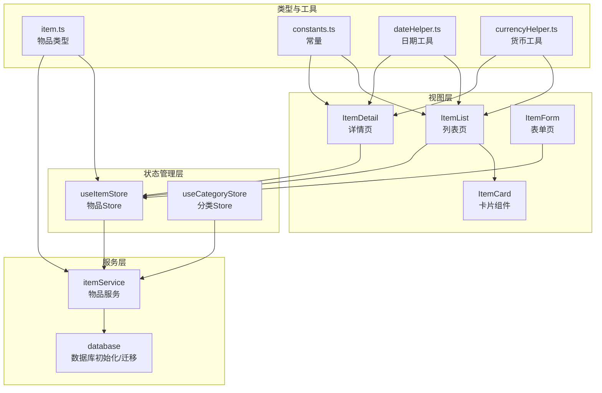
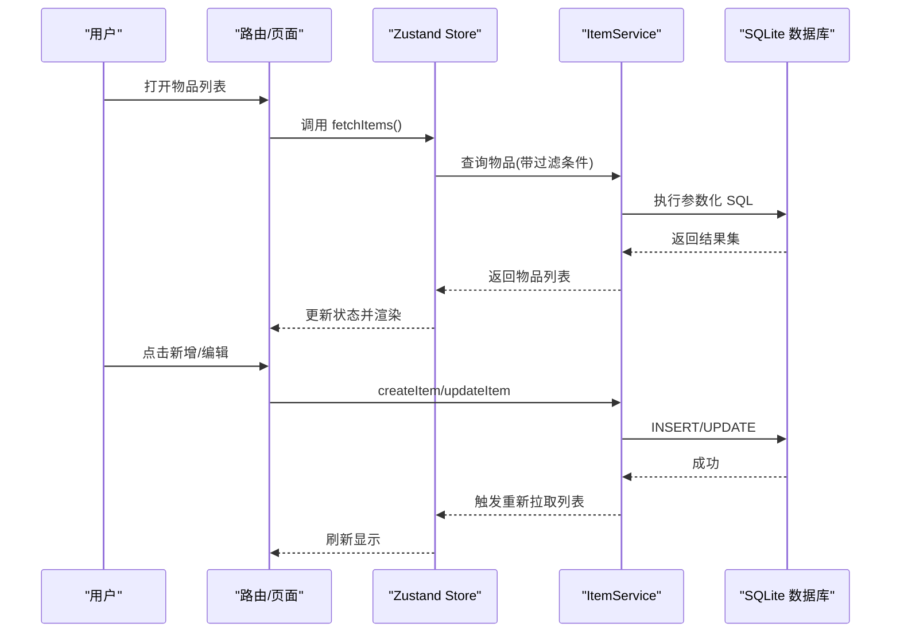
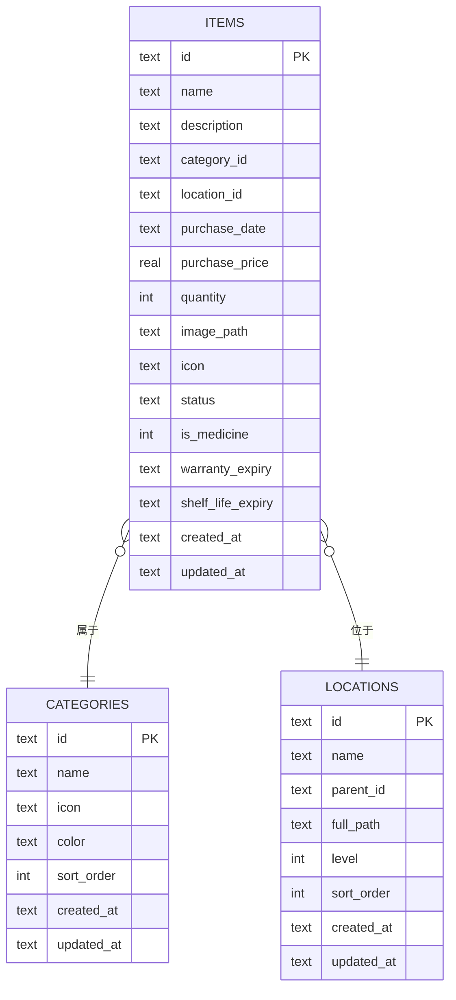
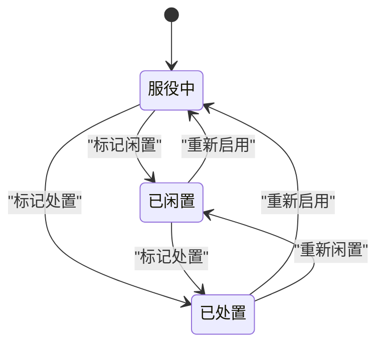
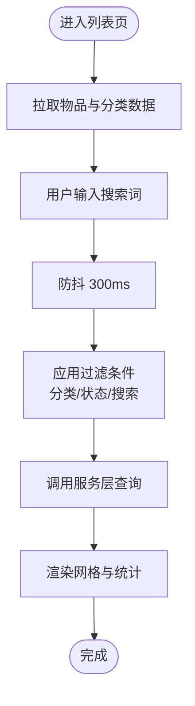
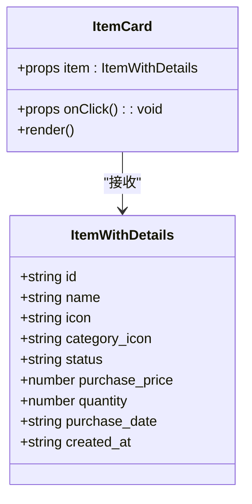
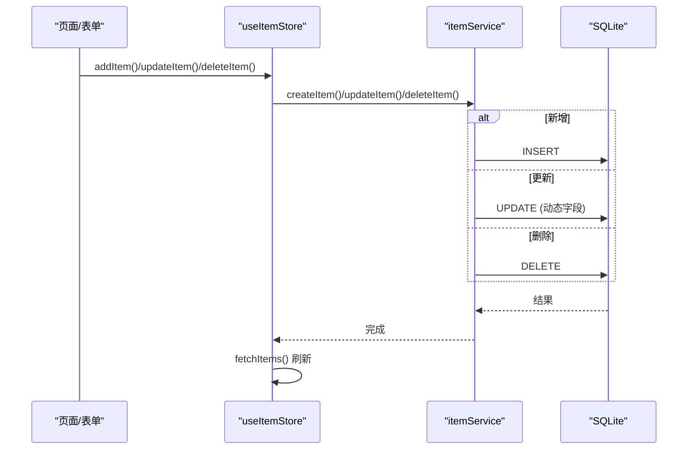
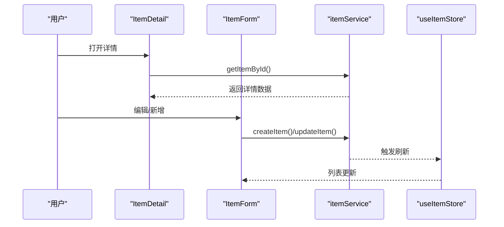
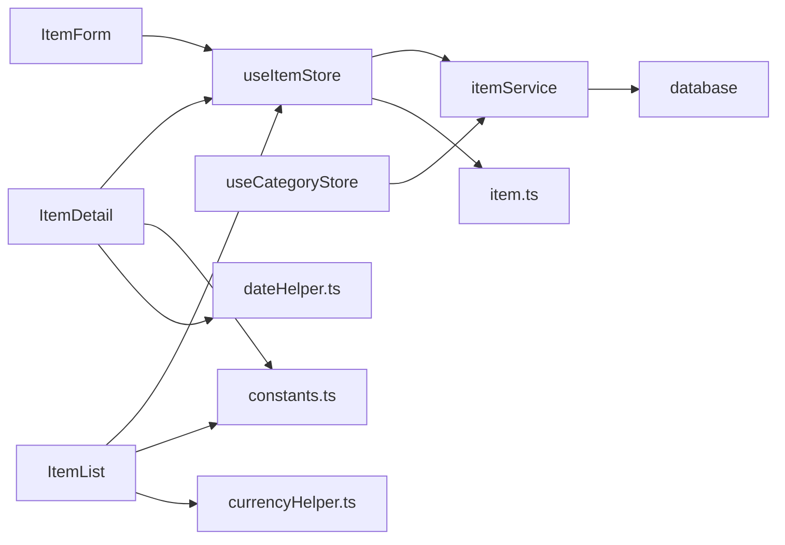

# 资产管理

<cite>
**本文引用的文件**
- [src/types/item.ts](file://src/types/item.ts)
- [src/stores/useItemStore.ts](file://src/stores/useItemStore.ts)
- [src/services/itemService.ts](file://src/services/itemService.ts)
- [src/routes/ItemList.tsx](file://src/routes/ItemList.tsx)
- [src/routes/ItemDetail.tsx](file://src/routes/ItemDetail.tsx)
- [src/routes/ItemForm.tsx](file://src/routes/ItemForm.tsx)
- [src/components/items/ItemCard.tsx](file://src/components/items/ItemCard.tsx)
- [src/services/database.ts](file://src/services/database.ts)
- [src/utils/constants.ts](file://src/utils/constants.ts)
- [src/utils/dateHelper.ts](file://src/utils/dateHelper.ts)
- [src/utils/currencyHelper.ts](file://src/utils/currencyHelper.ts)
- [src/stores/useCategoryStore.ts](file://src/stores/useCategoryStore.ts)
- [src/components/shared/SearchBar.tsx](file://src/components/shared/SearchBar.tsx)
- [README.md](file://README.md)
</cite>

## 目录
1. [简介](#简介)
2. [项目结构](#项目结构)
3. [核心组件](#核心组件)
4. [架构总览](#架构总览)
5. [详细组件分析](#详细组件分析)
6. [依赖关系分析](#依赖关系分析)
7. [性能考虑](#性能考虑)
8. [故障排除指南](#故障排除指南)
9. [结论](#结论)
10. [附录](#附录)

## 简介
资产管理模块围绕“物品”这一核心实体展开，提供从列表展示、详情查看、表单编辑到状态管理的完整闭环。系统支持三态状态流转（服役中、已闲置、已处置），具备智能搜索与多维筛选能力；物品卡片组件采用响应式布局与轻量交互反馈；数据模型涵盖物品基本信息、购买记录、状态历史等字段，并通过本地 SQLite 数据库存储与迁移机制保障数据一致性与演进能力。

## 项目结构
资产管理模块主要由以下层次构成：
- 类型定义层：统一定义物品、分类、位置等领域的数据契约
- 状态管理层：基于 Zustand 的领域 Store，封装 CRUD 与过滤逻辑
- 服务层：封装数据库访问与业务逻辑，屏蔽底层实现细节
- 视图层：页面路由与组件，负责渲染与用户交互
- 工具层：日期、货币、常量等辅助工具

图表来源
- [src/routes/ItemList.tsx:1-185](file://src/routes/ItemList.tsx#L1-L185)
- [src/routes/ItemDetail.tsx:1-168](file://src/routes/ItemDetail.tsx#L1-L168)
- [src/routes/ItemForm.tsx:1-263](file://src/routes/ItemForm.tsx#L1-L263)
- [src/components/items/ItemCard.tsx:1-94](file://src/components/items/ItemCard.tsx#L1-L94)
- [src/stores/useItemStore.ts:1-53](file://src/stores/useItemStore.ts#L1-L53)
- [src/stores/useCategoryStore.ts:1-44](file://src/stores/useCategoryStore.ts#L1-L44)
- [src/services/itemService.ts:1-127](file://src/services/itemService.ts#L1-L127)
- [src/services/database.ts:1-171](file://src/services/database.ts#L1-L171)
- [src/types/item.ts:1-46](file://src/types/item.ts#L1-L46)
- [src/utils/constants.ts:1-40](file://src/utils/constants.ts#L1-L40)
- [src/utils/dateHelper.ts:1-52](file://src/utils/dateHelper.ts#L1-L52)
- [src/utils/currencyHelper.ts:1-17](file://src/utils/currencyHelper.ts#L1-L17)

章节来源
- [README.md:157-180](file://README.md#L157-L180)

## 核心组件
- 物品类型与表单数据：定义物品字段、状态枚举、详情扩展字段以及表单提交数据结构
- 物品 Store：集中管理列表、过滤条件、加载状态与 CRUD 操作
- 物品服务：封装数据库查询、插入、更新、删除与动态参数化 SQL
- 列表页：提供搜索、状态筛选、分类筛选、统计概览与网格展示
- 详情页：展示物品详情、状态徽章、价格与日均成本、操作入口
- 表单页：支持新增与编辑，包含图标选择、分类与位置选择、日期与数值输入、状态切换
- 物品卡片：承载物品缩略信息、状态徽章、日均成本提示与点击跳转
- 数据库与迁移：本地 SQLite 初始化、迁移版本控制与索引建立
- 工具与常量：状态标签、日期格式化、货币格式化、默认分类等

章节来源
- [src/types/item.ts:1-46](file://src/types/item.ts#L1-L46)
- [src/stores/useItemStore.ts:1-53](file://src/stores/useItemStore.ts#L1-L53)
- [src/services/itemService.ts:1-127](file://src/services/itemService.ts#L1-L127)
- [src/routes/ItemList.tsx:1-185](file://src/routes/ItemList.tsx#L1-L185)
- [src/routes/ItemDetail.tsx:1-168](file://src/routes/ItemDetail.tsx#L1-L168)
- [src/routes/ItemForm.tsx:1-263](file://src/routes/ItemForm.tsx#L1-L263)
- [src/components/items/ItemCard.tsx:1-94](file://src/components/items/ItemCard.tsx#L1-L94)
- [src/services/database.ts:1-171](file://src/services/database.ts#L1-L171)
- [src/utils/constants.ts:1-40](file://src/utils/constants.ts#L1-L40)
- [src/utils/dateHelper.ts:1-52](file://src/utils/dateHelper.ts#L1-L52)
- [src/utils/currencyHelper.ts:1-17](file://src/utils/currencyHelper.ts#L1-L17)

## 架构总览
资产管理模块遵循“视图-状态-服务-数据”的分层架构，确保关注点分离与可维护性。

图表来源
- [src/routes/ItemList.tsx:27-30](file://src/routes/ItemList.tsx#L27-L30)
- [src/stores/useItemStore.ts:28-32](file://src/stores/useItemStore.ts#L28-L32)
- [src/services/itemService.ts:60-87](file://src/services/itemService.ts#L60-L87)
- [src/services/itemService.ts:89-119](file://src/services/itemService.ts#L89-L119)

## 详细组件分析

### 数据模型设计
- 物品核心字段：标识、名称、描述、分类、位置、购买日期与价格、数量、图片路径、图标、状态、是否药品、质保与保质期截止、创建/更新时间
- 详情扩展：关联分类名称、图标、颜色与位置完整路径
- 表单数据：与核心字段一致，布尔值转换为布尔类型

图表来源
- [src/services/database.ts:88-103](file://src/services/database.ts#L88-L103)
- [src/services/database.ts:67-87](file://src/services/database.ts#L67-L87)
- [src/types/item.ts:5-22](file://src/types/item.ts#L5-L22)

章节来源
- [src/types/item.ts:1-46](file://src/types/item.ts#L1-L46)
- [src/services/database.ts:60-171](file://src/services/database.ts#L60-L171)

### 物品状态管理与流转
- 状态枚举：active（服役中）、archived（已闲置）、disposed（已处置）
- 状态标签：中文展示映射
- 流转场景：列表页状态筛选、详情页状态徽章、表单页状态选择

图表来源
- [src/utils/constants.ts:22-27](file://src/utils/constants.ts#L22-L27)
- [src/routes/ItemList.tsx:12-17](file://src/routes/ItemList.tsx#L12-L17)
- [src/routes/ItemForm.tsx:240-247](file://src/routes/ItemForm.tsx#L240-L247)

章节来源
- [src/utils/constants.ts:1-40](file://src/utils/constants.ts#L1-L40)
- [src/routes/ItemList.tsx:1-185](file://src/routes/ItemList.tsx#L1-L185)
- [src/routes/ItemForm.tsx:1-263](file://src/routes/ItemForm.tsx#L1-L263)

### 智能搜索与多维筛选
- 搜索：输入框防抖（300ms）触发过滤，模糊匹配物品名称
- 筛选：按分类、状态、关键词进行组合过滤
- 列表页统计：实时统计各状态数量与总资产、日均成本

图表来源
- [src/routes/ItemList.tsx:27-38](file://src/routes/ItemList.tsx#L27-L38)
- [src/stores/useItemStore.ts:28-32](file://src/stores/useItemStore.ts#L28-L32)
- [src/services/itemService.ts:10-44](file://src/services/itemService.ts#L10-L44)

章节来源
- [src/routes/ItemList.tsx:1-185](file://src/routes/ItemList.tsx#L1-L185)
- [src/stores/useItemStore.ts:1-53](file://src/stores/useItemStore.ts#L1-L53)
- [src/services/itemService.ts:1-127](file://src/services/itemService.ts#L1-L127)

### 物品卡片组件设计与交互
- 展示内容：图标（优先物品图标，其次分类映射 Emoji，否则默认包裹盒），状态徽章，名称，总价与使用天数，日均成本提示
- 交互行为：点击卡片跳转详情页；按下时轻微缩放反馈
- 响应式布局：网格自适应列数，移动端紧凑排布

图表来源
- [src/components/items/ItemCard.tsx:27-94](file://src/components/items/ItemCard.tsx#L27-L94)
- [src/types/item.ts:24-29](file://src/types/item.ts#L24-L29)

章节来源
- [src/components/items/ItemCard.tsx:1-94](file://src/components/items/ItemCard.tsx#L1-L94)
- [src/utils/constants.ts:12-25](file://src/utils/constants.ts#L12-L25)

### CRUD 操作与数据库交互
- 新增：生成唯一 ID，填充创建/更新时间，插入物品记录
- 更新：动态拼接字段与参数，原子性更新并刷新时间戳
- 删除：删除物品记录（药品通过外键级联删除）
- 查询：支持多条件过滤与排序，关联分类与位置的展示字段

图表来源
- [src/stores/useItemStore.ts:34-47](file://src/stores/useItemStore.ts#L34-L47)
- [src/services/itemService.ts:60-87](file://src/services/itemService.ts#L60-L87)
- [src/services/itemService.ts:89-119](file://src/services/itemService.ts#L89-L119)
- [src/services/itemService.ts:121-126](file://src/services/itemService.ts#L121-L126)

章节来源
- [src/stores/useItemStore.ts:1-53](file://src/stores/useItemStore.ts#L1-L53)
- [src/services/itemService.ts:1-127](file://src/services/itemService.ts#L1-L127)

### 详情页与表单页流程
- 详情页：加载物品详情、计算日均成本、展示状态徽章与信息卡片、提供编辑与删除入口
- 表单页：支持新增与编辑两种模式，表单字段覆盖物品核心信息，含图标选择器、日期选择器、位置选择器与状态选择器

图表来源
- [src/routes/ItemDetail.tsx:13-38](file://src/routes/ItemDetail.tsx#L13-L38)
- [src/routes/ItemForm.tsx:29-81](file://src/routes/ItemForm.tsx#L29-L81)
- [src/services/itemService.ts:46-58](file://src/services/itemService.ts#L46-L58)

章节来源
- [src/routes/ItemDetail.tsx:1-168](file://src/routes/ItemDetail.tsx#L1-L168)
- [src/routes/ItemForm.tsx:1-263](file://src/routes/ItemForm.tsx#L1-L263)

## 依赖关系分析
- 列表页依赖物品 Store 与分类 Store，用于渲染与筛选
- 详情页依赖物品服务与 Store，用于加载与删除
- 表单页依赖物品 Store 与分类 Store，用于提交与回填
- 物品 Store 依赖物品服务，物品服务依赖数据库
- 工具与常量被多处复用，降低耦合度

图表来源
- [src/routes/ItemList.tsx:1-185](file://src/routes/ItemList.tsx#L1-L185)
- [src/routes/ItemDetail.tsx:1-168](file://src/routes/ItemDetail.tsx#L1-L168)
- [src/routes/ItemForm.tsx:1-263](file://src/routes/ItemForm.tsx#L1-L263)
- [src/stores/useItemStore.ts:1-53](file://src/stores/useItemStore.ts#L1-L53)
- [src/stores/useCategoryStore.ts:1-44](file://src/stores/useCategoryStore.ts#L1-L44)
- [src/services/itemService.ts:1-127](file://src/services/itemService.ts#L1-L127)
- [src/services/database.ts:1-171](file://src/services/database.ts#L1-L171)
- [src/types/item.ts:1-46](file://src/types/item.ts#L1-L46)
- [src/utils/constants.ts:1-40](file://src/utils/constants.ts#L1-L40)
- [src/utils/dateHelper.ts:1-52](file://src/utils/dateHelper.ts#L1-L52)
- [src/utils/currencyHelper.ts:1-17](file://src/utils/currencyHelper.ts#L1-L17)

章节来源
- [src/stores/useItemStore.ts:1-53](file://src/stores/useItemStore.ts#L1-L53)
- [src/stores/useCategoryStore.ts:1-44](file://src/stores/useCategoryStore.ts#L1-L44)
- [src/services/itemService.ts:1-127](file://src/services/itemService.ts#L1-L127)
- [src/services/database.ts:1-171](file://src/services/database.ts#L1-L171)

## 性能考虑
- 列表渲染：网格布局按设备宽度自适应列数，减少重排
- 防抖搜索：输入搜索词后延迟 300ms 再触发查询，降低频繁请求
- 本地存储：SQLite 本地持久化，避免网络抖动影响体验
- 索引优化：针对分类、位置、状态、药品有效期等建立索引，加速查询
- 轻量交互：卡片点击采用轻微缩放反馈，避免复杂动画造成卡顿
- 数据迁移：版本化迁移与幂等插入，保证数据库演进稳定

章节来源
- [src/routes/ItemList.tsx:32-38](file://src/routes/ItemList.tsx#L32-L38)
- [src/services/database.ts:124-131](file://src/services/database.ts#L124-L131)
- [README.md:227-231](file://README.md#L227-L231)

## 故障排除指南
- 数据库连接失败：检查数据库初始化与迁移是否成功，确认迁移版本号与错误日志
- 查询无结果：确认过滤条件是否正确传入，检查 SQL 参数绑定顺序
- 更新无效：确认传入字段映射与参数数组顺序一致，注意更新时间戳同步
- 删除异常：确认外键约束与级联删除策略，避免孤立数据
- 性能问题：检查是否存在高频重复查询，必要时引入缓存或分页

章节来源
- [src/services/database.ts:8-16](file://src/services/database.ts#L8-L16)
- [src/services/database.ts:35-52](file://src/services/database.ts#L35-L52)
- [src/services/itemService.ts:95-118](file://src/services/itemService.ts#L95-L118)

## 结论
资产管理模块以清晰的分层架构与完善的类型体系为基础，结合本地数据库与轻量状态管理，实现了从数据建模到界面交互的完整闭环。通过状态标签、日均成本计算与多维筛选，提升了资产管理的可视化与可操作性；通过防抖搜索与索引优化，兼顾了易用性与性能。未来可在长列表场景引入虚拟滚动与懒加载进一步优化性能。

## 附录
- 交互与手势：移动端全面屏手势适配与安全区域处理，提升触摸体验
- 主题与货币：支持多主题色与多币种，满足国际化需求
- 数据导出：支持 JSON 导出与导入，便于备份与迁移

章节来源
- [README.md:227-231](file://README.md#L227-L231)
- [README.md:69-72](file://README.md#L69-L72)
- [README.md:60-67](file://README.md#L60-L67)