# Zustand 架构设计

<cite>
**本文档引用的文件**
- [useCategoryStore.ts](file://src/stores/useCategoryStore.ts)
- [useDashboardStore.ts](file://src/stores/useDashboardStore.ts)
- [useItemStore.ts](file://src/stores/useItemStore.ts)
- [useLocationStore.ts](file://src/stores/useLocationStore.ts)
- [useMedicineStore.ts](file://src/stores/useMedicineStore.ts)
- [useSettingsStore.ts](file://src/stores/useSettingsStore.ts)
- [category.ts](file://src/types/category.ts)
- [item.ts](file://src/types/item.ts)
- [location.ts](file://src/types/location.ts)
- [medicine.ts](file://src/types/medicine.ts)
- [settings.ts](file://src/types/settings.ts)
- [package.json](file://package.json)
- [Dashboard.tsx](file://src/routes/Dashboard.tsx)
- [ItemList.tsx](file://src/routes/ItemList.tsx)
- [statisticsService.ts](file://src/services/statisticsService.ts)
</cite>

## 目录
1. [简介](#简介)
2. [项目结构](#项目结构)
3. [核心组件](#核心组件)
4. [架构概览](#架构概览)
5. [详细组件分析](#详细组件分析)
6. [依赖关系分析](#依赖关系分析)
7. [性能考虑](#性能考虑)
8. [故障排除指南](#故障排除指南)
9. [结论](#结论)

## 简介

Assetly 项目采用 Zustand 作为其状态管理解决方案，这是一个现代化的轻量级状态管理库。Zustand 相比传统状态管理方案（如 Redux）提供了更简洁的设计理念和更好的开发体验。

### Zustand 的核心优势

**简化设计理念**
- 去除样板代码：无需复杂的 action creators、action types 和 reducers
- 直观的 API：使用 create 函数直接创建 store
- 函数式更新：通过 set 函数进行状态更新，无需手动合并状态

**与 Redux 的对比**
- Redux 需要定义 action types、action creators、reducers 和 middleware
- Zustand 只需定义状态结构和更新函数
- 更低的学习曲线和更快的开发速度

## 项目结构

项目采用按功能模块组织的 store 结构，每个业务领域都有独立的 store 文件：

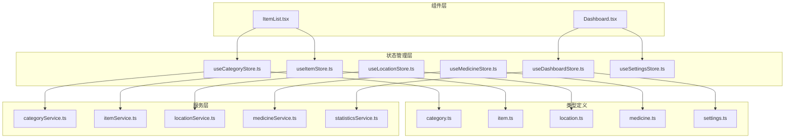

**图表来源**
- [useCategoryStore.ts:1-44](file://src/stores/useCategoryStore.ts#L1-L44)
- [useItemStore.ts:1-53](file://src/stores/useItemStore.ts#L1-L53)
- [useDashboardStore.ts:1-34](file://src/stores/useDashboardStore.ts#L1-L34)

**章节来源**
- [useCategoryStore.ts:1-44](file://src/stores/useCategoryStore.ts#L1-L44)
- [useItemStore.ts:1-53](file://src/stores/useItemStore.ts#L1-L53)
- [useDashboardStore.ts:1-34](file://src/stores/useDashboardStore.ts#L1-L34)

## 核心组件

### Store 创建模式

所有 store 都遵循统一的创建模式，使用 Zustand 的 create 函数：

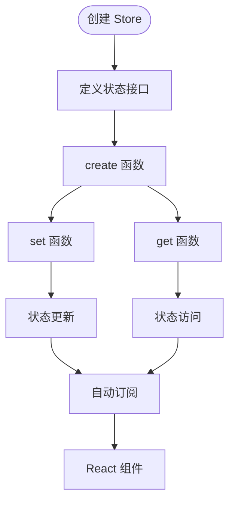

**图表来源**
- [useCategoryStore.ts:14-43](file://src/stores/useCategoryStore.ts#L14-L43)
- [useItemStore.ts:23-52](file://src/stores/useItemStore.ts#L23-L52)

### 状态结构设计原则

**单一职责原则**
每个 store 只管理特定领域的状态，避免状态耦合：
- CategoryStore：管理分类相关状态
- ItemStore：管理物品列表和过滤器状态
- LocationStore：管理位置层级结构
- MedicineStore：管理药品类型和标签状态

**状态最小化**
只存储必要的状态数据，避免冗余：
- 使用派生状态而非重复存储
- 通过计算属性提供格式化数据

**类型安全**
所有 store 都有对应的 TypeScript 接口定义，确保类型安全。

**章节来源**
- [useCategoryStore.ts:5-12](file://src/stores/useCategoryStore.ts#L5-L12)
- [useItemStore.ts:12-21](file://src/stores/useItemStore.ts#L12-L21)
- [useLocationStore.ts:5-13](file://src/stores/useLocationStore.ts#L5-L13)

## 架构概览

### 状态管理架构

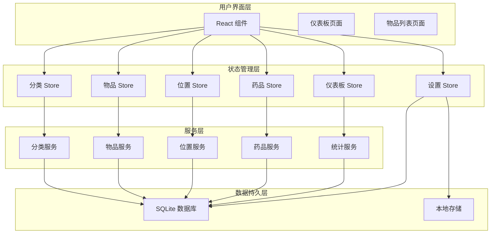

**图表来源**
- [Dashboard.tsx:13-22](file://src/routes/Dashboard.tsx#L13-L22)
- [ItemList.tsx:19-25](file://src/routes/ItemList.tsx#L19-L25)

### 数据流模式

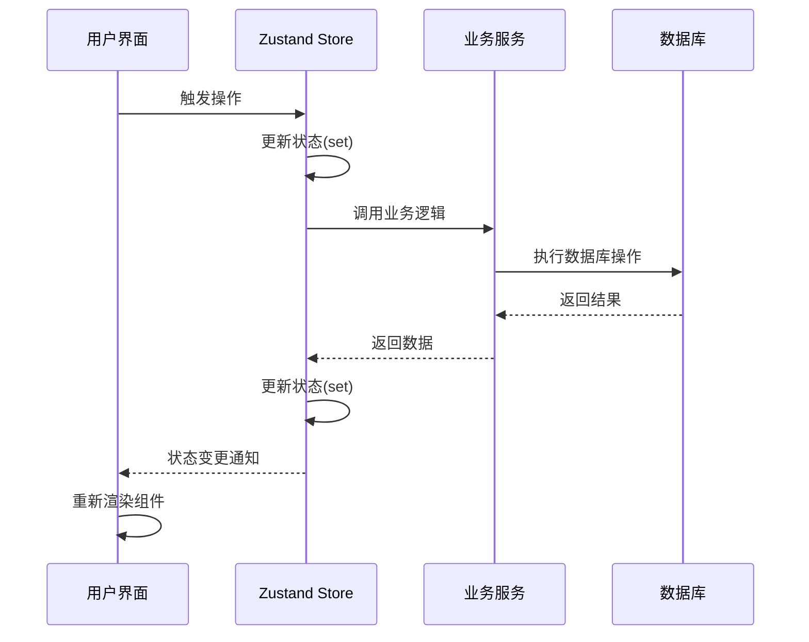

**图表来源**
- [useCategoryStore.ts:18-22](file://src/stores/useCategoryStore.ts#L18-L22)
- [useItemStore.ts:28-32](file://src/stores/useItemStore.ts#L28-L32)

## 详细组件分析

### 分类管理 Store

分类管理是资产管理的基础，负责维护分类的增删改查操作。

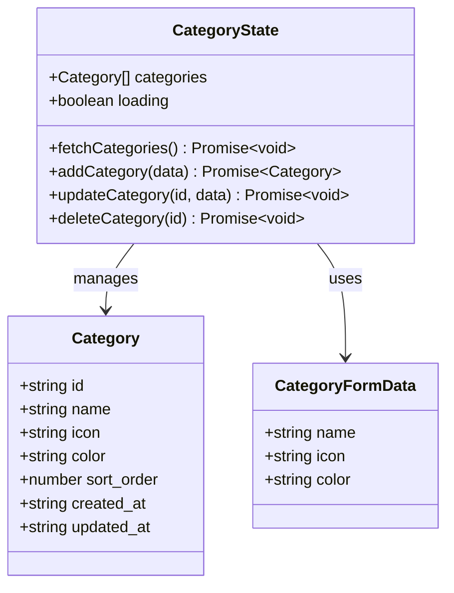

**图表来源**
- [useCategoryStore.ts:5-12](file://src/stores/useCategoryStore.ts#L5-L12)
- [category.ts:3-11](file://src/types/category.ts#L3-L11)

#### 核心功能实现

**异步数据加载**
- 使用 fetchCategories 方法进行批量数据获取
- 通过 loading 状态控制加载指示器
- 支持错误处理和状态重置

**实时状态更新**
- addCategory：添加新分类后立即更新本地状态
- updateCategory：更新指定分类并保持时间戳同步
- deleteCategory：删除分类后从本地状态移除

**状态一致性保证**
- 使用 get() 函数获取最新状态
- 避免竞态条件和状态不一致

**章节来源**
- [useCategoryStore.ts:18-42](file://src/stores/useCategoryStore.ts#L18-L42)
- [category.ts:13-17](file://src/types/category.ts#L13-L17)

### 物品管理 Store

物品管理 Store 处理复杂的过滤和搜索功能，支持多维度筛选。

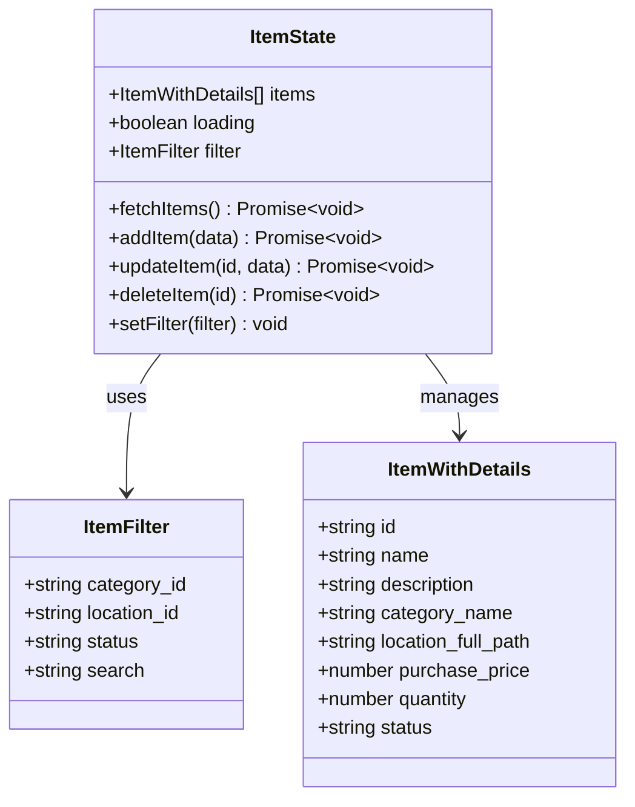

**图表来源**
- [useItemStore.ts:5-21](file://src/stores/useItemStore.ts#L5-L21)
- [item.ts:24-29](file://src/types/item.ts#L24-L29)

#### 过滤器设计模式

**动态过滤器**
- 支持多字段组合过滤
- 实时搜索功能，带防抖处理
- 状态切换和分类筛选

**性能优化**
- 使用 useMemo 缓存计算结果
- 防抖搜索避免频繁请求
- 条件查询减少数据库负载

**章节来源**
- [useItemStore.ts:23-52](file://src/stores/useItemStore.ts#L23-L52)
- [item.ts:3-45](file://src/types/item.ts#L3-L45)

### 位置管理 Store

位置管理 Store 处理复杂的层级结构，支持树形数据的构建和维护。

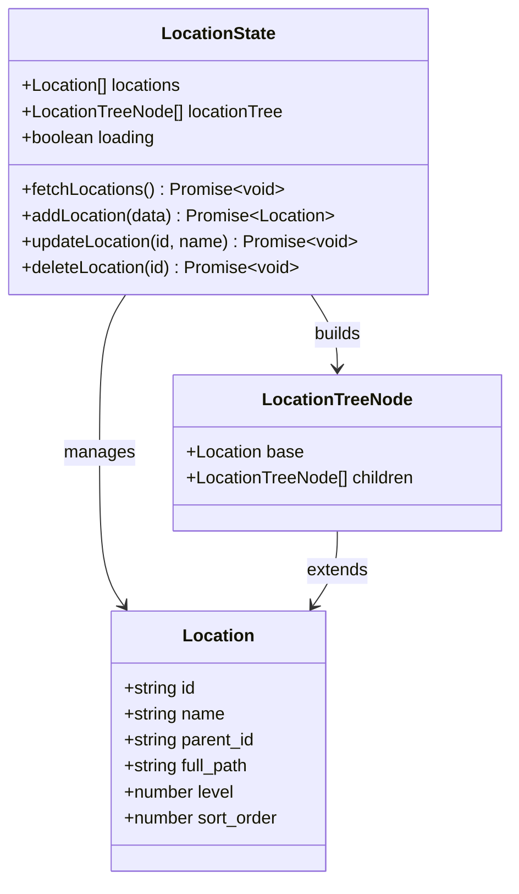

**图表来源**
- [useLocationStore.ts:5-13](file://src/stores/useLocationStore.ts#L5-L13)
- [location.ts:3-17](file://src/types/location.ts#L3-L17)

#### 树形结构处理

**层级构建算法**
- 将扁平的 Location 数组转换为树形结构
- 支持动态更新和重新构建
- 保持父子关系的完整性

**状态同步机制**
- 所有 CRUD 操作后自动重新获取数据
- 确保树形结构与数据库状态一致

**章节来源**
- [useLocationStore.ts:15-42](file://src/stores/useLocationStore.ts#L15-L42)
- [location.ts:15-23](file://src/types/location.ts#L15-L23)

### 药品管理 Store

药品管理 Store 处理复杂的药品类型和标签状态管理。

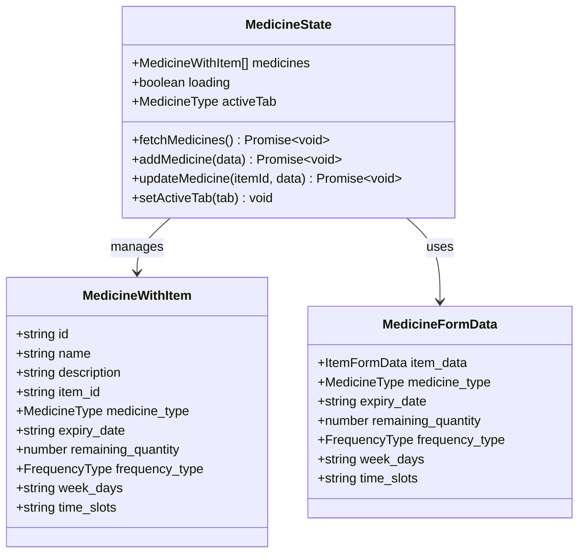

**图表来源**
- [useMedicineStore.ts:5-13](file://src/stores/useMedicineStore.ts#L5-L13)
- [medicine.ts:29-41](file://src/types/medicine.ts#L29-L41)

#### Tab 切换机制

**类型过滤**
- 支持 all、internal、external、emergency 类型
- 动态根据标签过滤药品列表
- 保持过滤状态的一致性

**状态管理模式**
- 使用 activeTab 控制当前显示类型
- fetchMedicines 根据标签动态查询
- 自动刷新确保数据同步

**章节来源**
- [useMedicineStore.ts:15-41](file://src/stores/useMedicineStore.ts#L15-L41)
- [medicine.ts:3-69](file://src/types/medicine.ts#L3-L69)

### 仪表板 Store

仪表板 Store 处理复杂的多数据源聚合和并发请求。

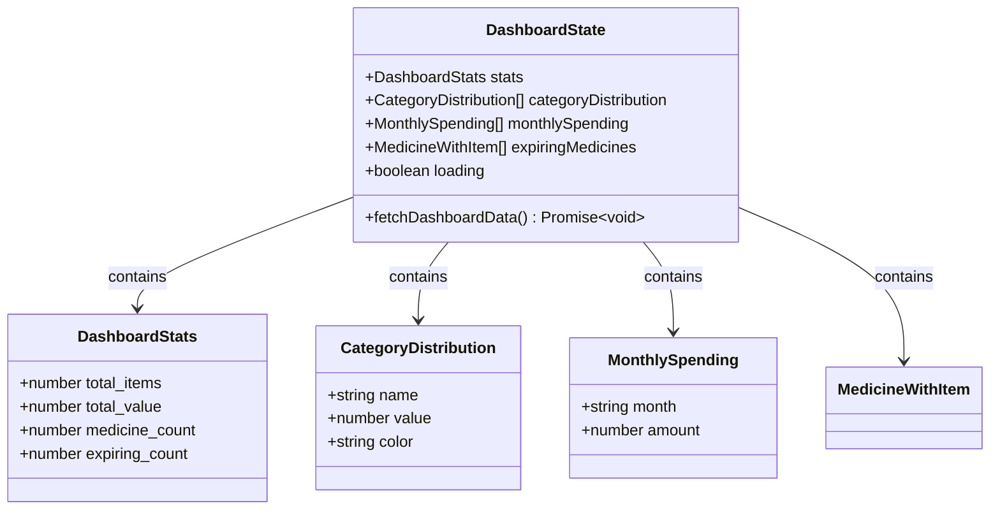

**图表来源**
- [useDashboardStore.ts:7-14](file://src/stores/useDashboardStore.ts#L7-L14)
- [settings.ts:8-24](file://src/types/settings.ts#L8-L24)

#### 并发数据聚合

**Promise.all 优化**
- 同时发起多个 API 请求
- 并行处理统计数据
- 统一状态更新时机

**数据预处理**
- 格式化统计数据
- 计算资产分布
- 筛选即将过期的药品

**章节来源**
- [useDashboardStore.ts:16-33](file://src/stores/useDashboardStore.ts#L16-L33)
- [settings.ts:8-24](file://src/types/settings.ts#L8-L24)

### 设置管理 Store

设置管理 Store 处理应用配置和主题定制。

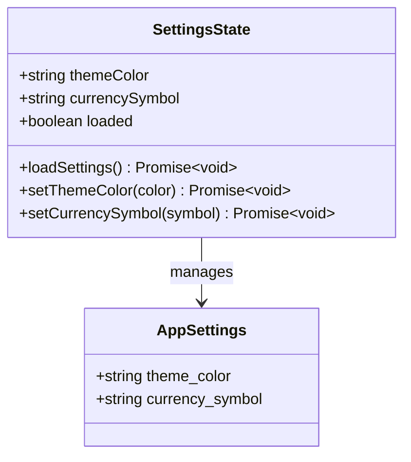

**图表来源**
- [useSettingsStore.ts:5-12](file://src/stores/useSettingsStore.ts#L5-L12)
- [settings.ts:3-6](file://src/types/settings.ts#L3-L6)

#### 持久化存储策略

**数据库集成**
- 使用 SQLite 存储设置信息
- 支持键值对形式的灵活存储
- 自动时间戳更新

**实时主题更新**
- 动态更新 CSS 变量
- 即时反映主题变化
- 跨组件状态同步

**章节来源**
- [useSettingsStore.ts:14-55](file://src/stores/useSettingsStore.ts#L14-L55)

## 依赖关系分析

### 外部依赖

项目对 Zustand 的依赖关系清晰明确：

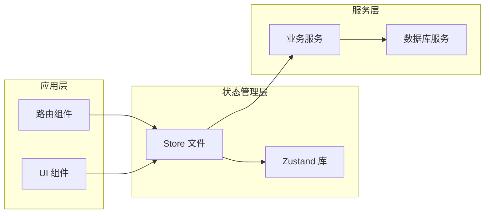

**图表来源**
- [package.json](file://package.json#L30)
- [useCategoryStore.ts](file://src/stores/useCategoryStore.ts#L1)

### 内部依赖关系

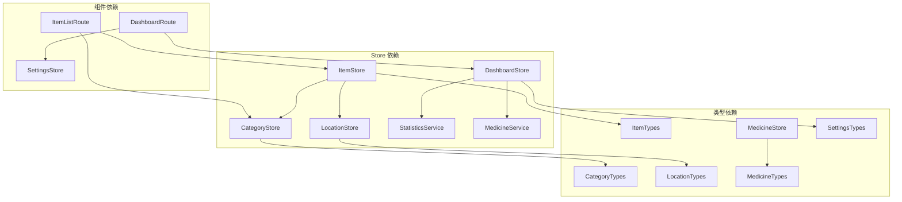

**图表来源**
- [Dashboard.tsx:4-5](file://src/routes/Dashboard.tsx#L4-L5)
- [ItemList.tsx:4-6](file://src/routes/ItemList.tsx#L4-L6)

**章节来源**
- [package.json:12-30](file://package.json#L12-L30)
- [Dashboard.tsx:13-22](file://src/routes/Dashboard.tsx#L13-L22)

## 性能考虑

### 状态订阅优化

**细粒度订阅**
- 每个组件只订阅需要的状态
- 避免不必要的重新渲染
- 使用 selector 函数精确控制订阅范围

**批量更新**
- 使用单个 set 调用更新多个状态
- 减少组件重新渲染次数
- 保持状态原子性更新

### 异步操作处理

**并发请求优化**
- 使用 Promise.all 并行处理多个请求
- 减少总等待时间
- 统一错误处理机制

**缓存策略**
- 本地状态缓存
- 避免重复请求相同数据
- 条件刷新机制

### 内存管理

**状态清理**
- 组件卸载时自动清理订阅
- 避免内存泄漏
- 及时释放资源

**数据结构优化**
- 使用不可变更新避免意外修改
- 优化大型数组的处理
- 合理的数据结构选择

## 故障排除指南

### 常见问题诊断

**状态不同步问题**
- 检查是否正确使用 get() 获取最新状态
- 确认异步操作的顺序
- 验证状态更新的原子性

**性能问题排查**
- 使用 React DevTools 检查重新渲染频率
- 分析组件订阅的状态范围
- 优化昂贵的计算属性

**数据一致性问题**
- 确认数据库操作的事务性
- 检查并发操作的同步机制
- 验证状态更新的幂等性

### 调试技巧

**开发工具使用**
- 利用 React DevTools 的组件树检查
- 使用 Zustand DevTools 进行状态追踪
- 监控网络请求和数据库操作

**日志记录**
- 在关键操作点添加日志
- 记录状态变化历史
- 监控异常情况

**章节来源**
- [useCategoryStore.ts:32-36](file://src/stores/useCategoryStore.ts#L32-L36)
- [useItemStore.ts:49-51](file://src/stores/useItemStore.ts#L49-L51)

## 结论

Assetly 项目采用的 Zustand 状态管理架构体现了现代前端开发的最佳实践。通过精心设计的 store 结构、清晰的类型定义和高效的异步处理机制，实现了高性能、可维护的状态管理解决方案。

### 技术决策总结

**选择 Zustand 的理由**
- 简化的 API 设计降低了开发复杂度
- 函数式更新模式提高了代码可读性
- 内置的订阅机制提供了良好的性能表现
- 类型安全的 TypeScript 支持确保了开发质量

**架构优势**
- 模块化设计便于维护和扩展
- 清晰的职责分离提高了代码质量
- 优化的性能策略确保了用户体验
- 完善的错误处理机制提升了系统稳定性

这种架构设计为类似资产管理系统的开发提供了优秀的参考模板，展示了如何在保持代码简洁的同时实现强大的功能特性。