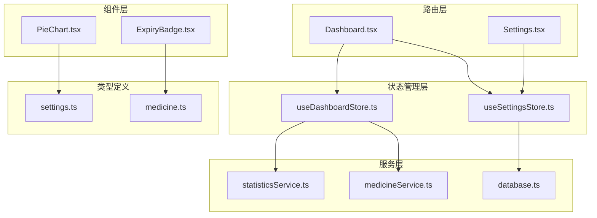
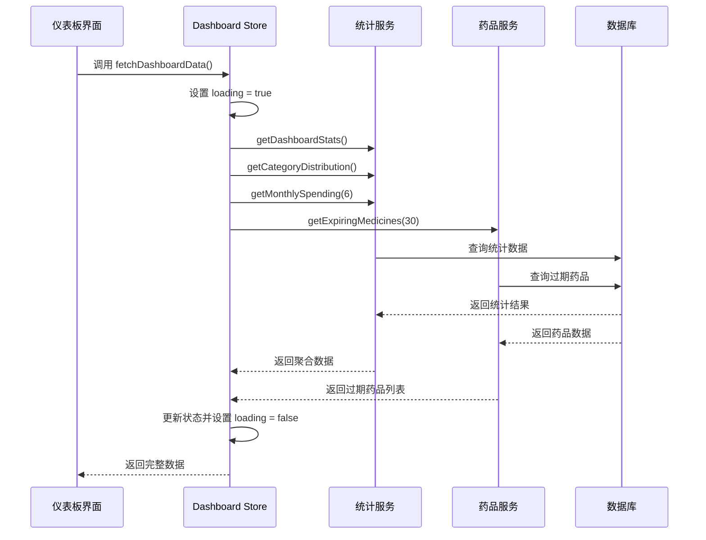
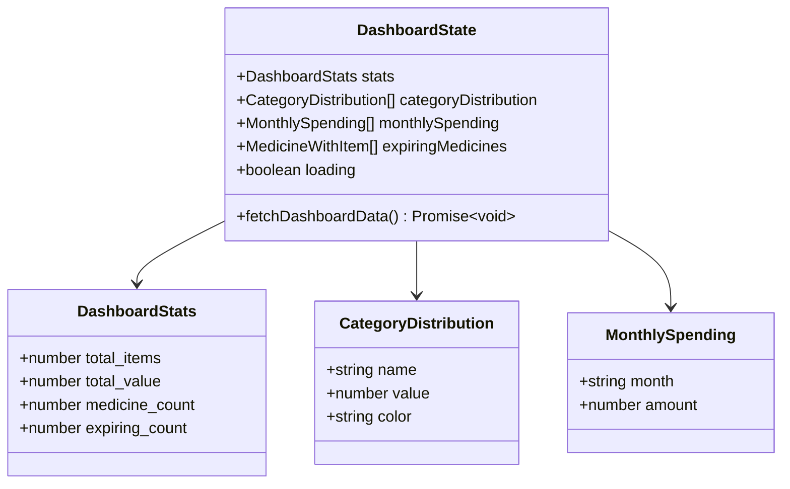
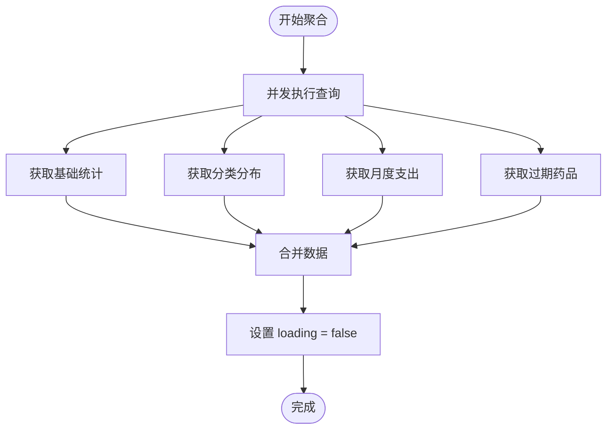
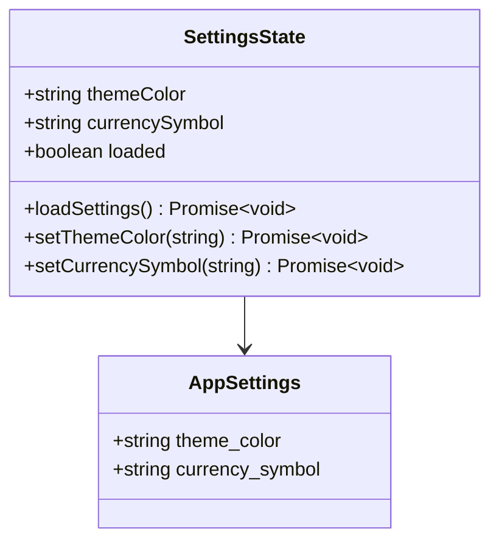
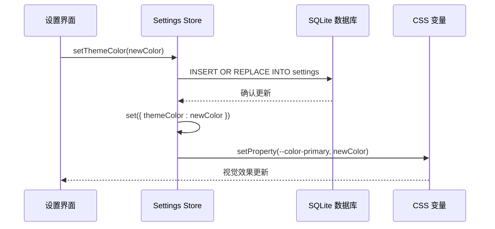
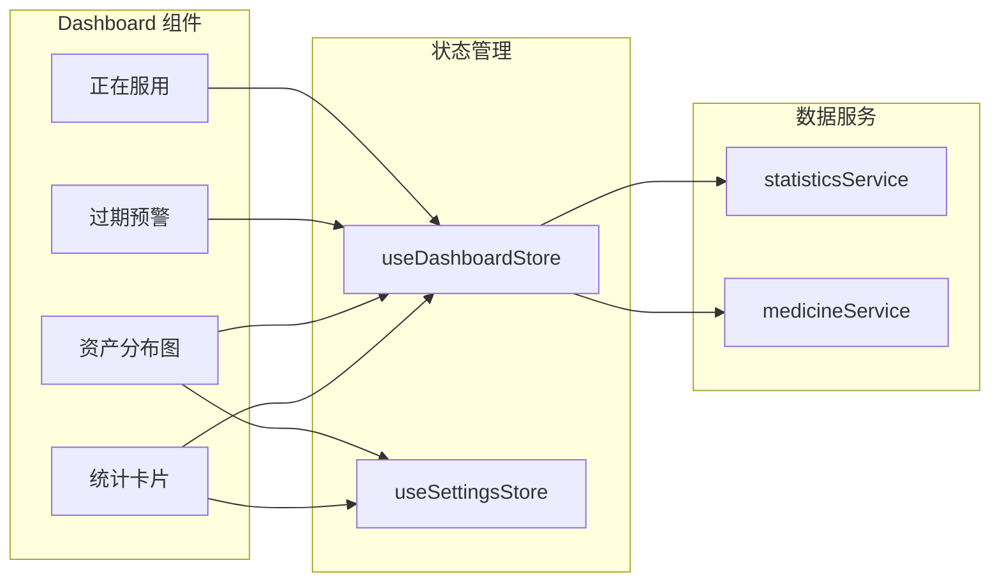
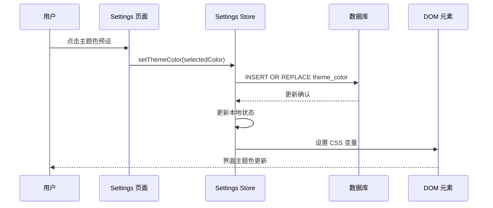
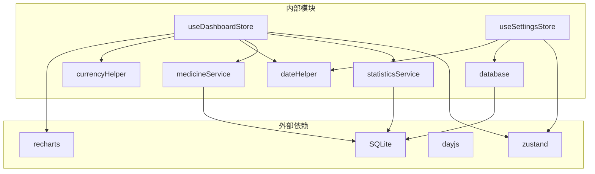
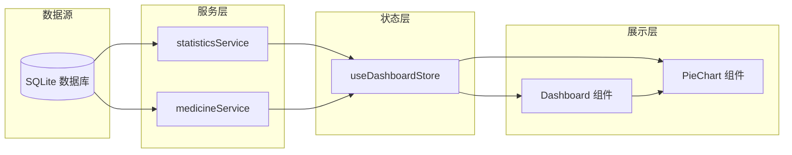

# 仪表板与设置状态管理

<cite>
**本文档引用的文件**
- [useDashboardStore.ts](file://src/stores/useDashboardStore.ts)
- [useSettingsStore.ts](file://src/stores/useSettingsStore.ts)
- [statisticsService.ts](file://src/services/statisticsService.ts)
- [medicineService.ts](file://src/services/medicineService.ts)
- [settings.ts](file://src/types/settings.ts)
- [Dashboard.tsx](file://src/routes/Dashboard.tsx)
- [Settings.tsx](file://src/routes/Settings.tsx)
- [PieChart.tsx](file://src/components/charts/PieChart.tsx)
- [currencyHelper.ts](file://src/utils/currencyHelper.ts)
- [constants.ts](file://src/utils/constants.ts)
- [database.ts](file://src/services/database.ts)
- [dateHelper.ts](file://src/utils/dateHelper.ts)
- [ExpiryBadge.tsx](file://src/components/medicine/ExpiryBadge.tsx)
</cite>

## 目录
1. [简介](#简介)
2. [项目结构](#项目结构)
3. [核心组件](#核心组件)
4. [架构概览](#架构概览)
5. [详细组件分析](#详细组件分析)
6. [依赖关系分析](#依赖关系分析)
7. [性能考虑](#性能考虑)
8. [故障排除指南](#故障排除指南)
9. [结论](#结论)

## 简介

本文档深入解析 Assetly 应用中的仪表板与设置状态管理模块。重点分析 `useDashboardStore` 的设计架构，包括统计数据聚合、图表数据准备和实时更新机制；详细说明 `useSettingsStore` 的配置管理功能，包括主题设置、货币配置和用户偏好存储。同时阐述两个 Store 的特殊用途和实现考虑，包括数据缓存策略、性能优化和状态持久化，并提供仪表板数据展示和设置变更的实际使用示例，说明状态与其他 Store 的依赖关系和数据流转机制。

## 项目结构

本项目采用基于功能的模块组织方式，状态管理模块位于 `src/stores/` 目录下，与业务逻辑和服务层紧密分离：

**图表来源**
- [useDashboardStore.ts:1-34](file://src/stores/useDashboardStore.ts#L1-L34)
- [useSettingsStore.ts:1-56](file://src/stores/useSettingsStore.ts#L1-L56)
- [statisticsService.ts:1-52](file://src/services/statisticsService.ts#L1-L52)
- [medicineService.ts:1-194](file://src/services/medicineService.ts#L1-L194)

**章节来源**
- [useDashboardStore.ts:1-34](file://src/stores/useDashboardStore.ts#L1-L34)
- [useSettingsStore.ts:1-56](file://src/stores/useSettingsStore.ts#L1-L56)

## 核心组件

### useDashboardStore 设计架构

`useDashboardStore` 是一个基于 Zustand 的状态管理模块，专门负责仪表板数据的聚合和管理。其设计特点包括：

- **并发数据获取**：使用 `Promise.all` 并行执行多个统计数据查询
- **统一状态管理**：集中管理仪表板所需的所有数据状态
- **加载状态控制**：提供精确的加载状态反馈
- **类型安全**：完整的 TypeScript 类型定义确保数据完整性

### useSettingsStore 配置管理

`useSettingsStore` 提供了完整的用户配置管理功能，支持主题颜色和货币符号的动态切换：

- **本地持久化**：所有设置通过 SQLite 数据库存储
- **实时样式更新**：设置变更时自动更新 CSS 变量
- **默认值处理**：提供合理的默认配置
- **类型安全**：严格的类型约束确保配置一致性

**章节来源**
- [useDashboardStore.ts:7-34](file://src/stores/useDashboardStore.ts#L7-L34)
- [useSettingsStore.ts:5-56](file://src/stores/useSettingsStore.ts#L5-L56)

## 架构概览

仪表板与设置状态管理模块的整体架构体现了清晰的关注点分离和数据流向：

**图表来源**
- [useDashboardStore.ts:23-32](file://src/stores/useDashboardStore.ts#L23-L32)
- [statisticsService.ts:4-26](file://src/services/statisticsService.ts#L4-L26)
- [medicineService.ts:164-178](file://src/services/medicineService.ts#L164-L178)

## 详细组件分析

### useDashboardStore 详细分析

#### 状态结构设计

**图表来源**
- [useDashboardStore.ts:7-14](file://src/stores/useDashboardStore.ts#L7-L14)
- [settings.ts:8-24](file://src/types/settings.ts#L8-L24)

#### 数据聚合流程

仪表板的数据聚合采用了高效的并发处理策略：

**图表来源**
- [useDashboardStore.ts:25-31](file://src/stores/useDashboardStore.ts#L25-L31)

#### 实现考虑与优化

1. **并发查询优化**：使用 `Promise.all` 同时执行四个独立的查询，显著提升响应速度
2. **错误处理**：每个查询独立执行，避免单点故障影响整体性能
3. **内存管理**：及时清理查询结果，避免内存泄漏
4. **类型安全**：完整的 TypeScript 类型定义确保数据完整性

**章节来源**
- [useDashboardStore.ts:16-34](file://src/stores/useDashboardStore.ts#L16-L34)

### useSettingsStore 详细分析

#### 配置管理架构

**图表来源**
- [useSettingsStore.ts:5-12](file://src/stores/useSettingsStore.ts#L5-L12)
- [settings.ts:3-6](file://src/types/settings.ts#L3-L6)

#### 数据持久化策略

设置数据通过 SQLite 数据库进行持久化存储，采用键值对的形式：

| 键名 | 默认值 | 描述 |
|------|--------|------|
| theme_color | #22C55E | 主题颜色配置 |
| currency_symbol | ¥ | 货币符号配置 |

#### 实时更新机制

设置变更不仅更新数据库，还会同步更新 CSS 变量以实现实时视觉效果：

**图表来源**
- [useSettingsStore.ts:37-45](file://src/stores/useSettingsStore.ts#L37-L45)

**章节来源**
- [useSettingsStore.ts:14-56](file://src/stores/useSettingsStore.ts#L14-L56)

### 仪表板数据展示实现

#### 组件集成模式

仪表板组件通过 React Hooks 与状态管理模块深度集成：

**图表来源**
- [Dashboard.tsx:13-217](file://src/routes/Dashboard.tsx#L13-L217)
- [useDashboardStore.ts:16-34](file://src/stores/useDashboardStore.ts#L16-L34)

#### 数据格式化与展示

仪表板实现了多种数据格式化策略：

1. **货币格式化**：支持多种货币符号和大额数字缩写
2. **日期处理**：智能的过期状态判断和标签生成
3. **图表渲染**：动态的饼图展示和交互式 tooltip

**章节来源**
- [Dashboard.tsx:13-217](file://src/routes/Dashboard.tsx#L13-L217)

### 设置变更的实际使用示例

#### 主题色切换流程

**图表来源**
- [Settings.tsx:152-179](file://src/routes/Settings.tsx#L152-L179)
- [useSettingsStore.ts:37-45](file://src/stores/useSettingsStore.ts#L37-L45)

#### 货币配置变更

设置页面提供了直观的货币符号选择界面，支持多种国际货币：

| 货币符号 | 使用场景 | 默认显示 |
|----------|----------|----------|
| ¥ | 人民币 | ✓ |
| $ | 美元 |  |
| € | 欧元 |  |
| £ | 英镑 |  |
| ₩ | 韩元 |  |

**章节来源**
- [Settings.tsx:181-202](file://src/routes/Settings.tsx#L181-L202)
- [constants.ts:38-40](file://src/utils/constants.ts#L38-L40)

## 依赖关系分析

### 组件间依赖关系

**图表来源**
- [useDashboardStore.ts:1-6](file://src/stores/useDashboardStore.ts#L1-L6)
- [useSettingsStore.ts:1-4](file://src/stores/useSettingsStore.ts#L1-L4)

### 数据流转机制

仪表板数据从数据库到界面的完整流转过程：

**图表来源**
- [statisticsService.ts:1-52](file://src/services/statisticsService.ts#L1-L52)
- [medicineService.ts:1-194](file://src/services/medicineService.ts#L1-L194)
- [useDashboardStore.ts:23-32](file://src/stores/useDashboardStore.ts#L23-L32)

**章节来源**
- [database.ts:8-16](file://src/services/database.ts#L8-L16)

## 性能考虑

### 缓存策略

1. **数据库连接缓存**：单例模式确保数据库连接复用，避免重复初始化开销
2. **查询结果缓存**：在组件层面实现简单的内存缓存，减少重复请求
3. **渲染缓存**：React.memo 和 useMemo 优化组件重新渲染

### 性能优化技术

1. **并发查询**：使用 Promise.all 同时执行多个独立查询
2. **懒加载**：图表组件按需加载，减少初始渲染时间
3. **虚拟滚动**：长列表使用虚拟滚动技术提升性能
4. **防抖节流**：输入框和搜索功能实现防抖优化

### 内存管理

1. **及时清理**：组件卸载时清理定时器和事件监听器
2. **状态压缩**：避免存储不必要的中间状态
3. **引用优化**：使用 React.useMemo 和 React.useCallback 优化引用稳定性

## 故障排除指南

### 常见问题及解决方案

#### 仪表板数据加载失败

**症状**：仪表板长时间显示加载状态或出现空白

**可能原因**：
1. 数据库连接异常
2. SQL 查询执行超时
3. 网络请求失败

**解决步骤**：
1. 检查数据库连接状态
2. 验证 SQL 查询语法
3. 查看网络请求日志

#### 设置变更不生效

**症状**：修改主题色或货币符号后界面未更新

**可能原因**：
1. CSS 变量更新失败
2. 数据库写入异常
3. 状态更新未触发重新渲染

**解决步骤**：
1. 检查浏览器开发者工具中的 CSS 变量
2. 验证数据库写入操作
3. 确认状态更新逻辑

#### 图表渲染异常

**症状**：饼图显示不正确或出现空白

**可能原因**：
1. 数据格式不符合要求
2. 颜色配置缺失
3. 容器尺寸计算错误

**解决步骤**：
1. 验证数据结构完整性
2. 检查颜色配置有效性
3. 确认容器尺寸设置

**章节来源**
- [database.ts:8-16](file://src/services/database.ts#L8-L16)
- [useSettingsStore.ts:37-45](file://src/stores/useSettingsStore.ts#L37-L45)

## 结论

仪表板与设置状态管理模块展现了现代前端应用的最佳实践：

1. **清晰的架构分离**：状态管理、业务逻辑和服务层职责明确
2. **高性能设计**：并发查询、缓存策略和渲染优化确保流畅体验
3. **类型安全保证**：完整的 TypeScript 类型系统防止运行时错误
4. **可维护性**：模块化设计便于功能扩展和代码维护

这两个 Store 模块为 Assetly 应用提供了稳定可靠的状态管理基础，支持用户配置的持久化存储和仪表板数据的高效展示，是整个应用架构的重要组成部分。