# 分类与位置状态管理

<cite>
**本文档引用的文件**
- [useCategoryStore.ts](file://src/stores/useCategoryStore.ts)
- [useLocationStore.ts](file://src/stores/useLocationStore.ts)
- [categoryService.ts](file://src/services/categoryService.ts)
- [locationService.ts](file://src/services/locationService.ts)
- [database.ts](file://src/services/database.ts)
- [category.ts](file://src/types/category.ts)
- [location.ts](file://src/types/location.ts)
- [Categories.tsx](file://src/routes/Categories.tsx)
- [Locations.tsx](file://src/routes/Locations.tsx)
- [LocationPicker.tsx](file://src/components/items/LocationPicker.tsx)
- [constants.ts](file://src/utils/constants.ts)
- [dateHelper.ts](file://src/utils/dateHelper.ts)
</cite>

## 目录
1. [简介](#简介)
2. [项目结构](#项目结构)
3. [核心组件](#核心组件)
4. [架构概览](#架构概览)
5. [详细组件分析](#详细组件分析)
6. [依赖关系分析](#依赖关系分析)
7. [性能考虑](#性能考虑)
8. [故障排除指南](#故障排除指南)
9. [结论](#结论)

## 简介

本文档深入分析了 Assetly 应用中的分类和位置状态管理系统。该系统采用现代 React 状态管理模式，通过 Zustand 实现轻量级状态管理，结合 Tauri 数据库插件提供本地持久化存储。系统包含两个核心 Store：`useCategoryStore` 和 `useLocationStore`，分别负责分类管理和位置树形结构管理。

该系统的设计目标是提供直观的用户界面来管理物品的分类和存放位置，支持复杂的层次结构操作，包括拖拽排序、父子关系维护和实时数据同步。

## 项目结构

分类和位置状态管理模块位于应用的前端架构中，采用分层设计模式：

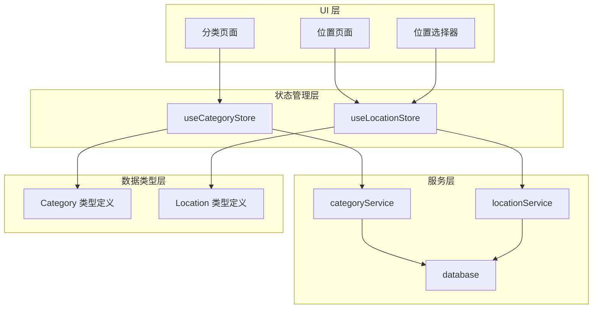

**图表来源**
- [useCategoryStore.ts:1-44](file://src/stores/useCategoryStore.ts#L1-L44)
- [useLocationStore.ts:1-43](file://src/stores/useLocationStore.ts#L1-L43)
- [categoryService.ts:1-59](file://src/services/categoryService.ts#L1-L59)
- [locationService.ts:1-143](file://src/services/locationService.ts#L1-L143)

**章节来源**
- [useCategoryStore.ts:1-44](file://src/stores/useCategoryStore.ts#L1-L44)
- [useLocationStore.ts:1-43](file://src/stores/useLocationStore.ts#L1-L43)
- [categoryService.ts:1-59](file://src/services/categoryService.ts#L1-L59)
- [locationService.ts:1-143](file://src/services/locationService.ts#L1-L143)

## 核心组件

### 分类状态管理 (useCategoryStore)

`useCategoryStore` 是一个基于 Zustand 的状态管理容器，专门处理分类数据的 CRUD 操作和状态同步。

**主要功能特性：**
- 分类列表获取和缓存
- 分类创建、更新、删除操作
- 加载状态管理
- 实时状态更新

**核心状态结构：**
- `categories`: 分类数组，包含完整的分类信息
- `loading`: 布尔值，指示数据加载状态

**关键方法：**
- `fetchCategories()`: 异步获取所有分类
- `addCategory(data)`: 创建新分类
- `updateCategory(id, data)`: 更新现有分类
- `deleteCategory(id)`: 删除分类

### 位置状态管理 (useLocationStore)

`useLocationStore` 提供更复杂的状态管理，不仅处理位置数据，还维护树形结构视图。

**主要功能特性：**
- 位置列表和树形结构双重状态
- 自动构建和维护位置树
- 完整的树形结构操作支持
- 高效的树形数据渲染

**核心状态结构：**
- `locations`: 平铺的位置数组
- `locationTree`: 树形结构视图
- `loading`: 加载状态管理

**关键方法：**
- `fetchLocations()`: 获取位置并构建树形结构
- `addLocation(data)`: 创建新位置（自动重新获取）
- `updateLocation(id, data)`: 更新位置并刷新树
- `deleteLocation(id)`: 删除位置并清理子节点

**章节来源**
- [useCategoryStore.ts:5-12](file://src/stores/useCategoryStore.ts#L5-L12)
- [useLocationStore.ts:5-13](file://src/stores/useLocationStore.ts#L5-L13)

## 架构概览

系统采用分层架构设计，确保关注点分离和代码可维护性：

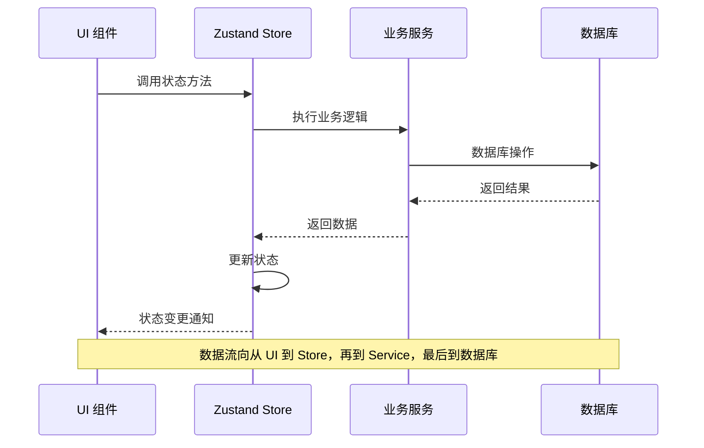

**图表来源**
- [useCategoryStore.ts:14-43](file://src/stores/useCategoryStore.ts#L14-L43)
- [useLocationStore.ts:15-42](file://src/stores/useLocationStore.ts#L15-L42)
- [categoryService.ts:9-49](file://src/services/categoryService.ts#L9-L49)
- [locationService.ts:9-109](file://src/services/locationService.ts#L9-L109)

### 数据流架构

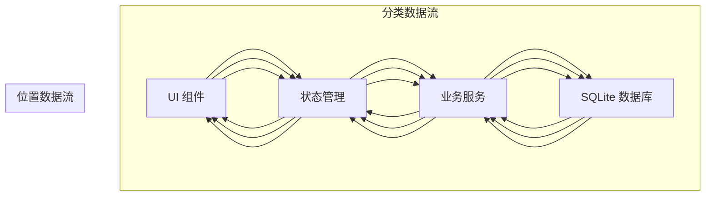

**图表来源**
- [Categories.tsx:11-18](file://src/routes/Categories.tsx#L11-L18)
- [Locations.tsx:7-15](file://src/routes/Locations.tsx#L7-L15)
- [LocationPicker.tsx:11-17](file://src/components/items/LocationPicker.tsx#L11-L17)

## 详细组件分析

### 分类系统分析

#### 数据结构设计

分类系统采用简洁而高效的数据模型：

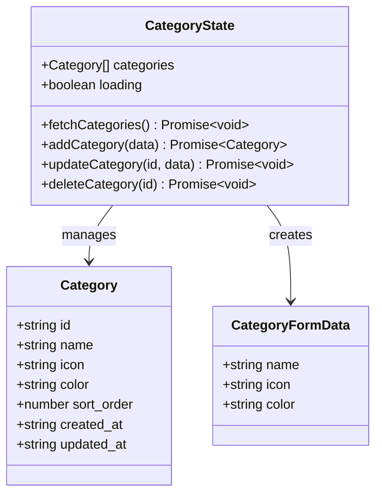

**图表来源**
- [category.ts:3-17](file://src/types/category.ts#L3-L17)
- [useCategoryStore.ts:5-12](file://src/stores/useCategoryStore.ts#L5-L12)

#### 图标和颜色配置

系统提供了丰富的图标和颜色选项，支持用户自定义分类外观：

**图标选项：**
- 12 种预定义图标：Smartphone、Sofa、CookingPot、Shirt、BookOpen、Pill、Wrench、Package、Camera、Headphones、Watch、Car

**颜色方案：**
- 10 种预定义颜色，从蓝色到灰色的渐变色板
- 支持透明度混合的背景色显示

**默认分类种子数据：**
系统启动时自动创建 8 个默认分类，覆盖主要物品类别：
- 电子产品、家具家电、厨房用品、衣物鞋包
- 书籍文具、药品保健、工具耗材、其他

#### 分类操作流程

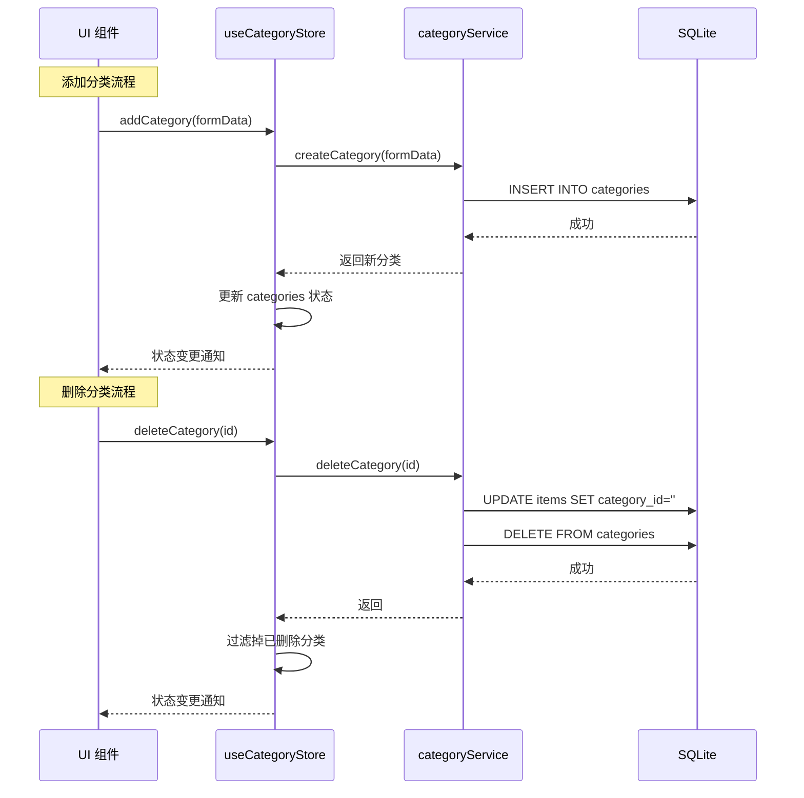

**图表来源**
- [useCategoryStore.ts:24-42](file://src/stores/useCategoryStore.ts#L24-L42)
- [categoryService.ts:20-49](file://src/services/categoryService.ts#L20-L49)

**章节来源**
- [category.ts:3-17](file://src/types/category.ts#L3-L17)
- [useCategoryStore.ts:14-43](file://src/stores/useCategoryStore.ts#L14-L43)
- [categoryService.ts:9-59](file://src/services/categoryService.ts#L9-L59)
- [constants.ts:4-13](file://src/utils/constants.ts#L4-L13)

### 位置系统分析

#### 树形结构设计

位置系统采用自引用的树形数据库结构，支持无限层级的嵌套：

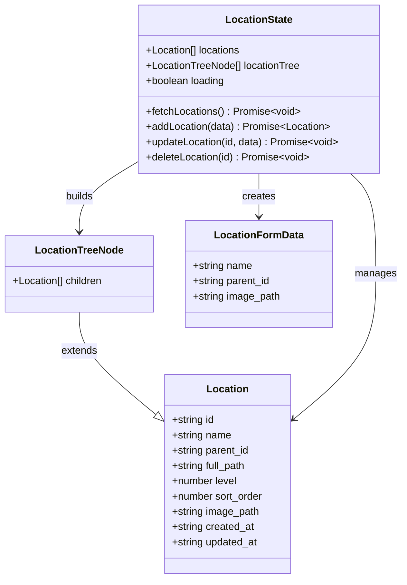

**图表来源**
- [location.ts:3-23](file://src/types/location.ts#L3-L23)
- [useLocationStore.ts:5-13](file://src/stores/useLocationStore.ts#L5-L13)

#### 全路径管理算法

位置系统实现了智能的全路径管理，确保层级关系的正确维护：

**全路径生成规则：**
- 根位置：full_path = name
- 子位置：full_path = parent.full_path + "/" + name
- 层级 level：根位置为 0，每深入一层 level + 1

**路径更新策略：**
当父位置名称更改时，系统会递归更新所有子节点的全路径，确保数据一致性。

#### 位置树形结构构建

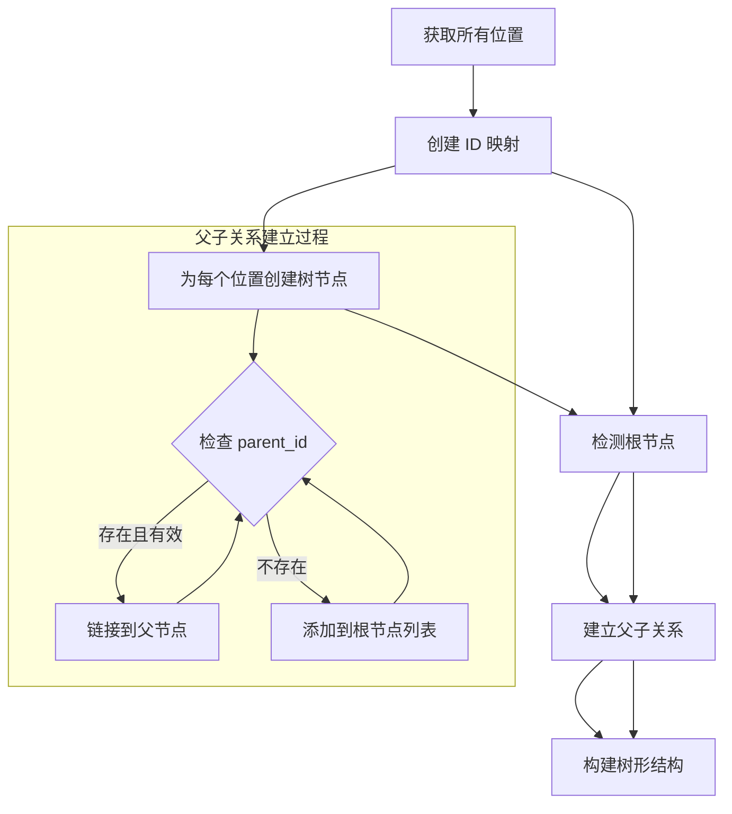

**图表来源**
- [locationService.ts:124-142](file://src/services/locationService.ts#L124-L142)
- [locationService.ts:128-139](file://src/services/locationService.ts#L128-L139)

#### 位置操作流程

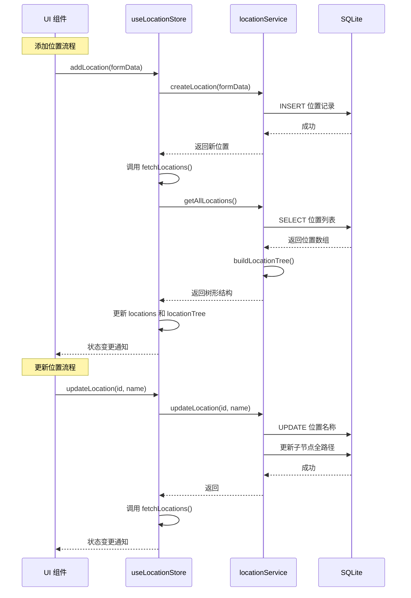

**图表来源**
- [useLocationStore.ts:27-41](file://src/stores/useLocationStore.ts#L27-L41)
- [locationService.ts:20-92](file://src/services/locationService.ts#L20-L92)

**章节来源**
- [location.ts:3-23](file://src/types/location.ts#L3-L23)
- [useLocationStore.ts:15-42](file://src/stores/useLocationStore.ts#L15-L42)
- [locationService.ts:9-143](file://src/services/locationService.ts#L9-L143)

### UI 组件集成分析

#### 分类管理界面

分类管理界面提供了完整的 CRUD 操作体验：

**核心功能：**
- 分类列表展示，支持图标和颜色显示
- 添加/编辑模态框，包含图标选择器和颜色选择器
- 删除确认对话框，显示关联物品数量
- 实时状态更新和错误处理

**用户交互流程：**
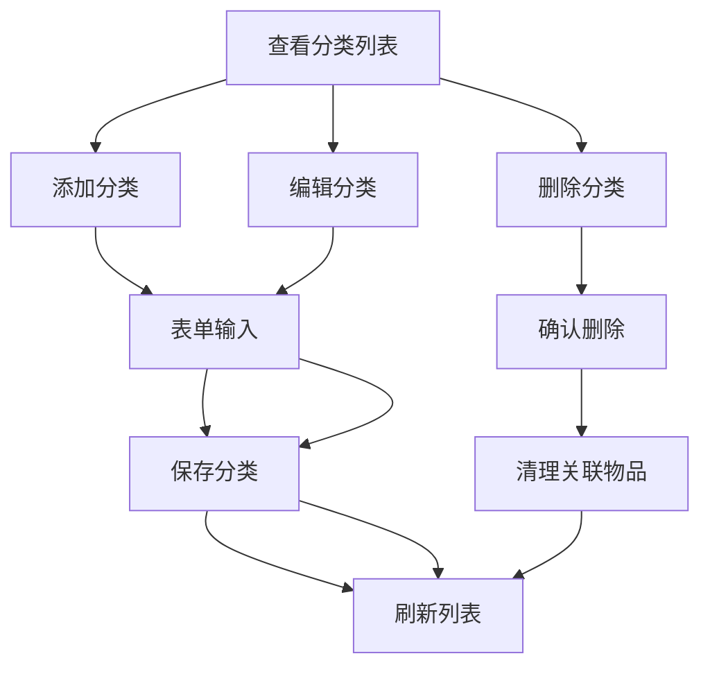

#### 位置管理界面

位置管理界面实现了复杂的树形结构可视化：

**核心功能：**
- 树形结构展示，支持展开/折叠
- 添加子位置和编辑功能
- 删除确认，包含子节点级联删除
- 位置选择器组件

**树形渲染机制：**
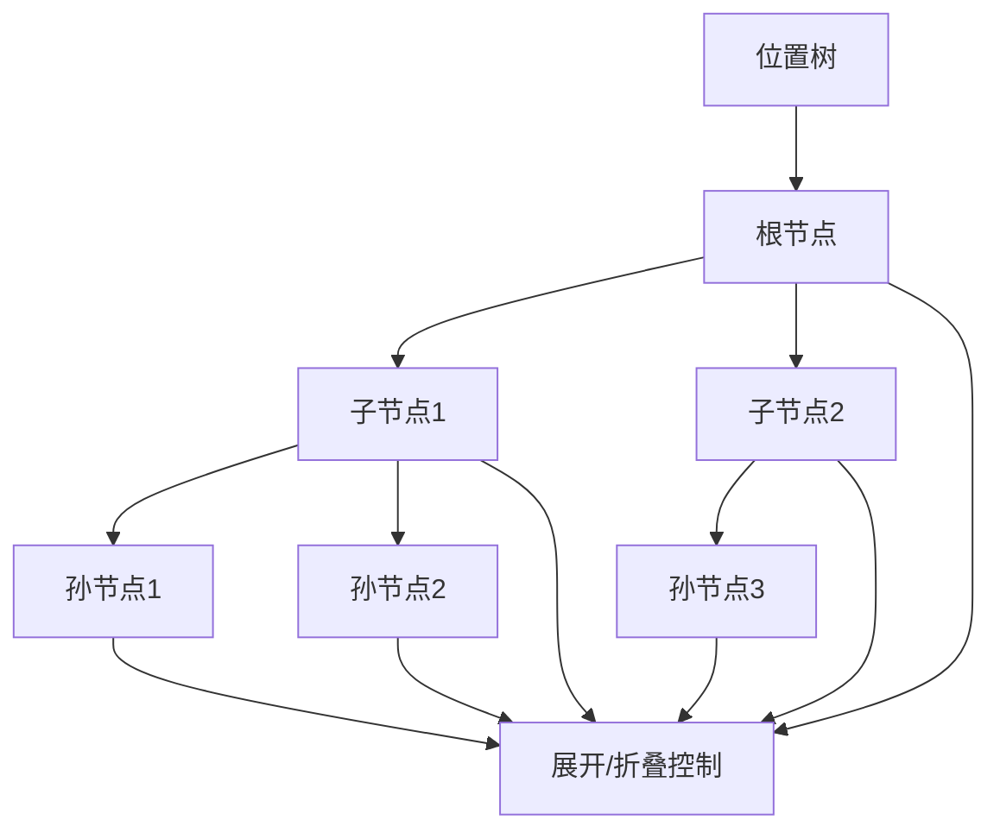

**章节来源**
- [Categories.tsx:11-184](file://src/routes/Categories.tsx#L11-L184)
- [Locations.tsx:7-204](file://src/routes/Locations.tsx#L7-L204)
- [LocationPicker.tsx:11-103](file://src/components/items/LocationPicker.tsx#L11-L103)

## 依赖关系分析

### 组件耦合度分析

系统采用了良好的分层设计，各组件之间的耦合度较低：

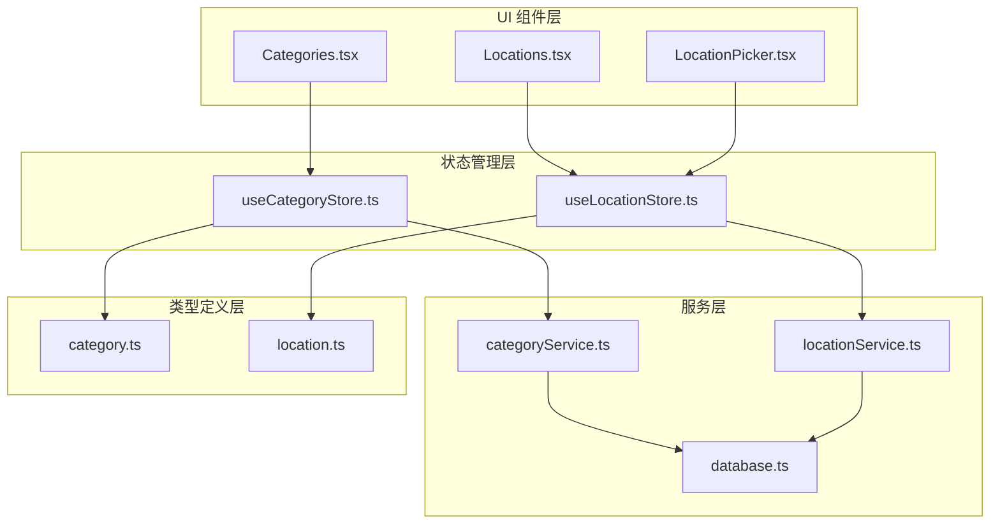

**图表来源**
- [useCategoryStore.ts:1-3](file://src/stores/useCategoryStore.ts#L1-L3)
- [useLocationStore.ts:1-3](file://src/stores/useLocationStore.ts#L1-L3)

### 数据依赖链

系统中的数据流动形成了清晰的依赖链：

1. **UI 组件** 依赖 **Zustand Store**
2. **Zustand Store** 依赖 **业务服务层**
3. **业务服务层** 依赖 **数据库层**
4. **类型定义** 为整个系统提供数据契约

这种设计确保了：
- 单向数据流，便于调试和维护
- 业务逻辑与 UI 层解耦
- 数据访问层抽象化

**章节来源**
- [database.ts:1-171](file://src/services/database.ts#L1-L171)

## 性能考虑

### 缓存策略

系统采用了多层缓存策略来优化性能：

**内存缓存：**
- Zustand Store 中的分类和位置数据缓存
- 避免重复的数据库查询
- 实时状态更新确保数据一致性

**数据库索引优化：**
- 为常用查询字段建立索引
- 优化分类和位置的查询性能
- 支持高效的树形结构构建

### 异步操作优化

**批量操作：**
- 位置更新后统一重新获取数据
- 避免部分更新导致的数据不一致
- 确保树形结构的完整性

**并发控制：**
- 使用异步操作避免 UI 阻塞
- 加载状态管理提升用户体验
- 错误处理确保系统稳定性

### 内存管理

**数据结构优化：**
- 分类系统使用简单数组结构
- 位置系统维护双重状态（平铺数组 + 树形结构）
- 避免不必要的数据复制

**垃圾回收：**
- 合理的组件生命周期管理
- 及时清理事件监听器
- 避免内存泄漏

## 故障排除指南

### 常见问题及解决方案

**数据库连接问题：**
- 检查 SQLite 插件初始化
- 验证数据库文件权限
- 确认迁移脚本执行成功

**树形结构异常：**
- 验证 parent_id 关系完整性
- 检查 full_path 字段一致性
- 确认层级计算正确性

**状态不同步问题：**
- 确认异步操作顺序
- 检查状态更新回调
- 验证重新获取数据的调用

### 错误处理机制

系统实现了多层次的错误处理：

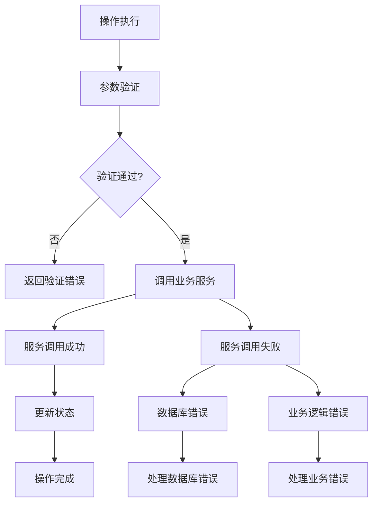

**章节来源**
- [database.ts:38-52](file://src/services/database.ts#L38-L52)
- [locationService.ts:79-92](file://src/services/locationService.ts#L79-L92)

## 结论

Assetly 的分类和位置状态管理系统展现了现代前端应用的最佳实践：

**设计优势：**
- 清晰的分层架构，职责明确
- 基于 Zustand 的轻量级状态管理
- 完善的类型安全和数据验证
- 用户友好的交互设计

**技术亮点：**
- 智能的树形结构管理
- 高效的数据库操作和索引优化
- 实时的状态同步和缓存机制
- 完整的错误处理和恢复机制

**扩展性考虑：**
- 模块化的组件设计便于功能扩展
- 抽象的服务层支持多种数据源
- 灵活的配置系统支持个性化定制

该系统为资产管理应用提供了坚实的技术基础，能够满足从个人用户到企业用户的多样化需求。