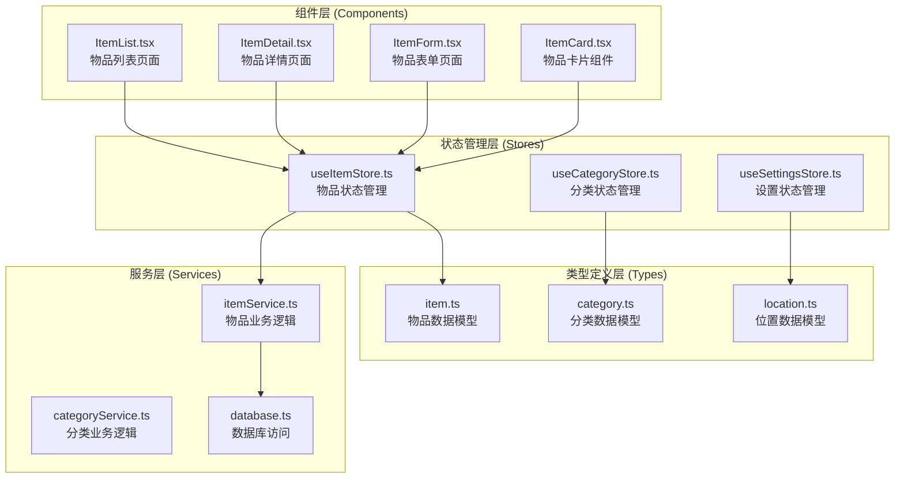
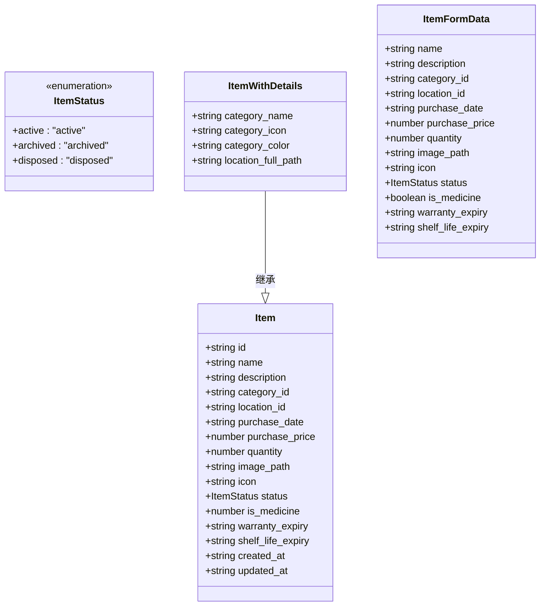
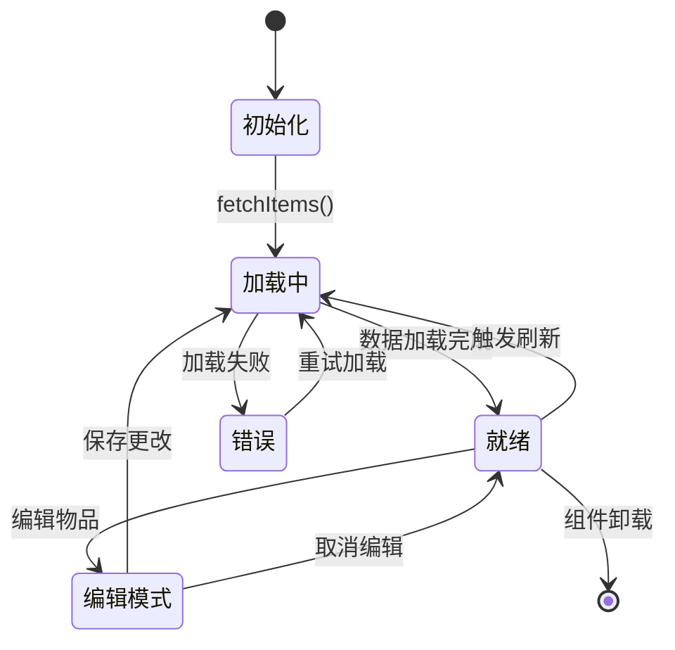
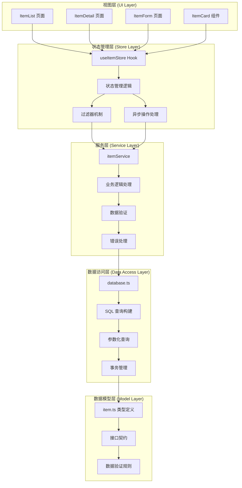
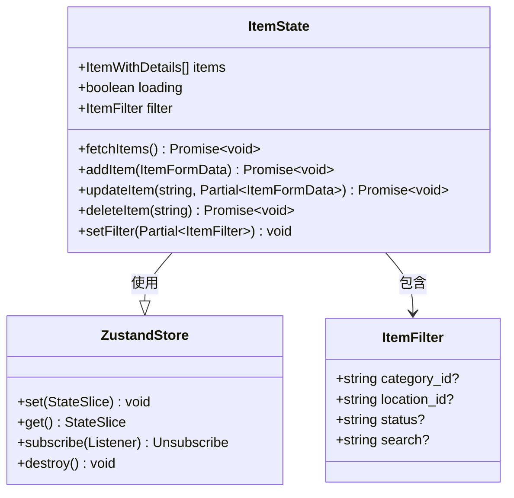
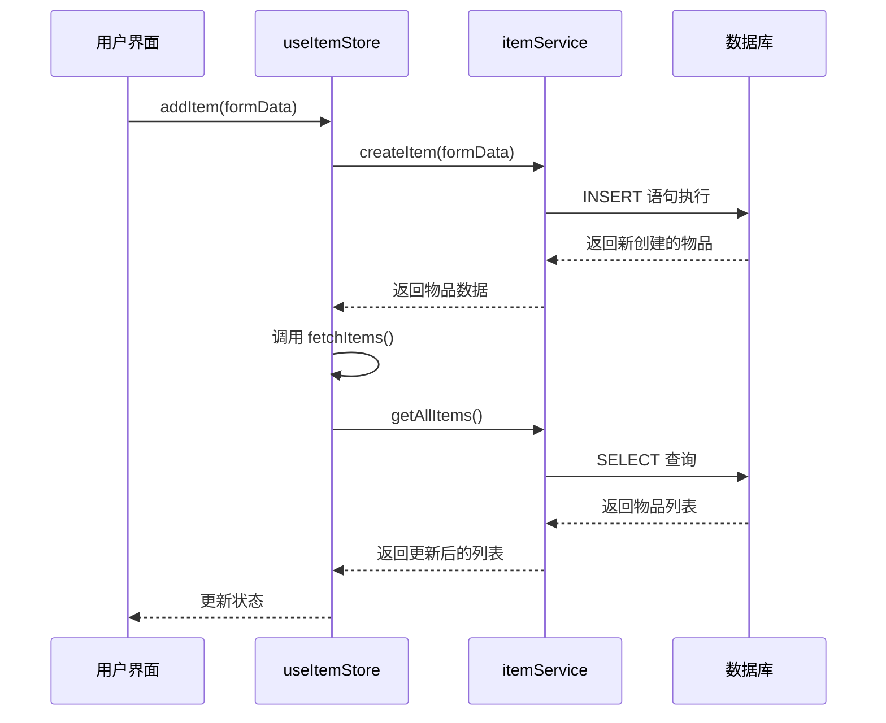
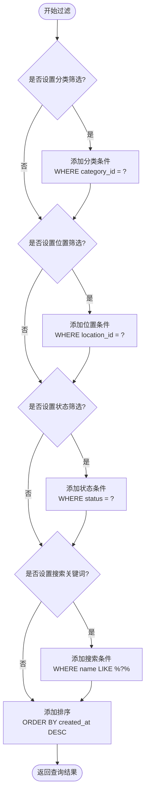
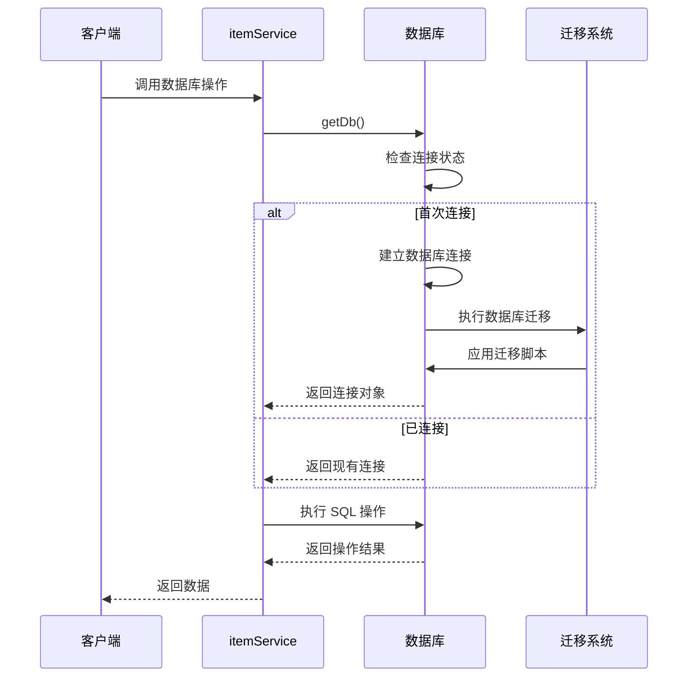
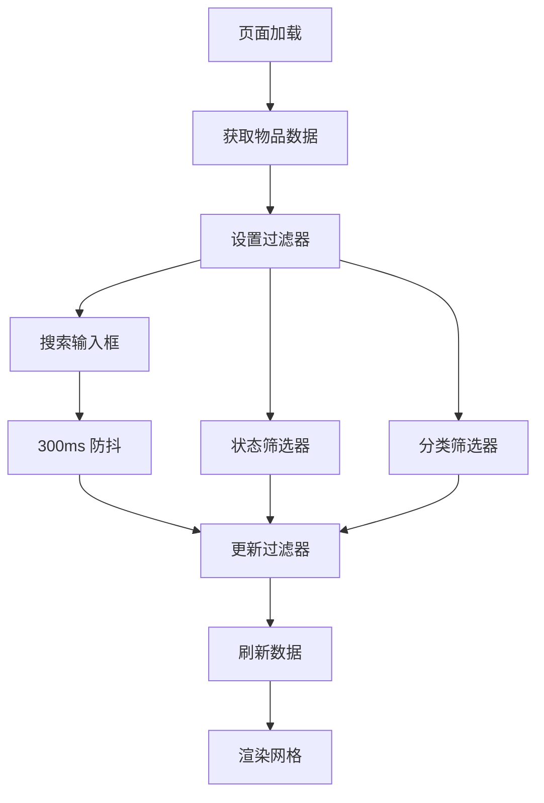
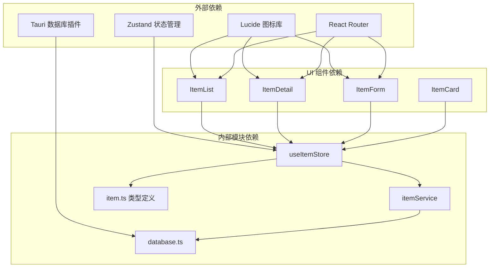

# 物品状态管理

<cite>
**本文档引用的文件**
- [useItemStore.ts](file://src/stores/useItemStore.ts)
- [item.ts](file://src/types/item.ts)
- [itemService.ts](file://src/services/itemService.ts)
- [ItemList.tsx](file://src/routes/ItemList.tsx)
- [ItemDetail.tsx](file://src/routes/ItemDetail.tsx)
- [ItemForm.tsx](file://src/routes/ItemForm.tsx)
- [ItemCard.tsx](file://src/components/items/ItemCard.tsx)
- [constants.ts](file://src/utils/constants.ts)
- [database.ts](file://src/services/database.ts)
- [category.ts](file://src/types/category.ts)
- [location.ts](file://src/types/location.ts)
- [useCategoryStore.ts](file://src/stores/useCategoryStore.ts)
- [useSettingsStore.ts](file://src/stores/useSettingsStore.ts)
</cite>

## 目录
1. [简介](#简介)
2. [项目结构](#项目结构)
3. [核心组件](#核心组件)
4. [架构概览](#架构概览)
5. [详细组件分析](#详细组件分析)
6. [依赖关系分析](#依赖关系分析)
7. [性能考虑](#性能考虑)
8. [故障排除指南](#故障排除指南)
9. [结论](#结论)

## 简介

物品状态管理模块是 Assetly 应用程序的核心数据管理组件，负责管理用户物品的完整生命周期。该模块基于 Zustand 状态管理库构建，提供了完整的 CRUD 操作、智能过滤机制和响应式数据更新能力。模块采用分层架构设计，将数据模型、服务层、存储层和视图层清晰分离，确保了代码的可维护性和扩展性。

本模块支持多种物品类型（普通物品和药品），提供实时的状态跟踪、成本计算和库存管理功能。通过集成 Tauri 数据库插件，实现了本地数据持久化和跨平台兼容性。

## 项目结构

物品状态管理模块位于 `src/stores/` 目录下，与相关的类型定义、服务层和组件共同构成了完整的数据管理生态系统。



**图表来源**
- [useItemStore.ts:1-53](file://src/stores/useItemStore.ts#L1-L53)
- [item.ts:1-46](file://src/types/item.ts#L1-L46)
- [itemService.ts:1-127](file://src/services/itemService.ts#L1-L127)
- [ItemList.tsx:1-185](file://src/routes/ItemList.tsx#L1-L185)

**章节来源**
- [useItemStore.ts:1-53](file://src/stores/useItemStore.ts#L1-L53)
- [item.ts:1-46](file://src/types/item.ts#L1-L46)
- [ItemList.tsx:1-185](file://src/routes/ItemList.tsx#L1-L185)

## 核心组件

### 数据模型设计

物品状态管理模块采用了精心设计的数据模型体系，确保了数据的一致性和完整性。

#### 物品状态枚举



**图表来源**
- [item.ts:3-46](file://src/types/item.ts#L3-L46)

#### 过滤器接口设计

ItemFilter 接口提供了灵活的查询机制，支持多维度的数据筛选：

- **分类筛选**: 基于 `category_id` 字段进行精确匹配
- **位置筛选**: 基于 `location_id` 字段进行精确匹配  
- **状态筛选**: 基于 `status` 枚举值进行筛选
- **搜索功能**: 基于物品名称的模糊匹配

**章节来源**
- [useItemStore.ts:5-10](file://src/stores/useItemStore.ts#L5-L10)
- [item.ts:3-46](file://src/types/item.ts#L3-L46)

### 状态管理架构



**图表来源**
- [useItemStore.ts:23-52](file://src/stores/useItemStore.ts#L23-L52)

**章节来源**
- [useItemStore.ts:12-21](file://src/stores/useItemStore.ts#L12-L21)

## 架构概览

物品状态管理模块采用分层架构设计，确保了各层之间的职责分离和松耦合。



**图表来源**
- [useItemStore.ts:1-53](file://src/stores/useItemStore.ts#L1-L53)
- [itemService.ts:1-127](file://src/services/itemService.ts#L1-L127)
- [database.ts:1-171](file://src/services/database.ts#L1-L171)

## 详细组件分析

### useItemStore 实现详解

useItemStore 是整个物品状态管理模块的核心，基于 Zustand 构建，提供了完整的状态管理和异步操作能力。

#### 状态结构设计



**图表来源**
- [useItemStore.ts:12-21](file://src/stores/useItemStore.ts#L12-L21)
- [useItemStore.ts:5-10](file://src/stores/useItemStore.ts#L5-L10)

#### 异步数据加载策略

模块采用了智能的异步加载策略，确保了用户体验和性能的平衡：

1. **懒加载机制**: 首次渲染时只加载必要的数据
2. **防抖优化**: 搜索功能使用 300ms 防抖延迟
3. **并发控制**: 避免重复的异步请求
4. **缓存策略**: 利用 React 组件的 memoization 优化

#### CRUD 操作实现

每个 CRUD 操作都经过精心设计，确保了数据的一致性和完整性：

**创建操作流程**:


**图表来源**
- [useItemStore.ts:34-37](file://src/stores/useItemStore.ts#L34-L37)
- [itemService.ts:60-87](file://src/services/itemService.ts#L60-L87)

**章节来源**
- [useItemStore.ts:23-52](file://src/stores/useItemStore.ts#L23-L52)

### 过滤器机制深度解析

过滤器机制是物品状态管理模块的重要特性，提供了强大的数据筛选能力。

#### 过滤器接口设计



**图表来源**
- [itemService.ts:10-44](file://src/services/itemService.ts#L10-L44)

#### 过滤器应用流程

过滤器的应用遵循严格的顺序和逻辑，确保了查询的准确性和效率：

1. **基础查询**: 从 items 表开始，关联 categories 和 locations 表
2. **条件构建**: 动态构建 WHERE 子句，支持任意组合的筛选条件
3. **参数绑定**: 使用参数化查询防止 SQL 注入攻击
4. **排序规则**: 默认按创建时间倒序排列

**章节来源**
- [itemService.ts:10-44](file://src/services/itemService.ts#L10-L44)

### 数据服务层实现

数据服务层封装了所有与数据库交互的逻辑，提供了安全、高效的 API 接口。

#### 数据库连接管理



**图表来源**
- [database.ts:8-16](file://src/services/database.ts#L8-L16)
- [database.ts:18-53](file://src/services/database.ts#L18-L53)

#### 数据验证和转换

服务层提供了完整的数据验证和转换机制：

- **输入验证**: 确保传入的数据符合预期格式
- **类型转换**: 将字符串转换为适当的数值类型
- **默认值处理**: 为缺失字段提供合理的默认值
- **时间戳管理**: 自动处理创建和更新时间戳

**章节来源**
- [itemService.ts:60-87](file://src/services/itemService.ts#L60-L87)
- [database.ts:18-53](file://src/services/database.ts#L18-L53)

### 视图组件集成

多个视图组件集成了物品状态管理功能，提供了完整的用户交互体验。

#### 物品列表页面

ItemList 页面展示了过滤器机制的实际应用：



**图表来源**
- [ItemList.tsx:27-49](file://src/routes/ItemList.tsx#L27-L49)

#### 成功案例展示

以下是在不同场景下的使用示例：

**场景一：基础物品管理**
```typescript
// 在组件中订阅状态
const { items, loading, fetchItems } = useItemStore();

// 触发异步操作
useEffect(() => {
  fetchItems();
}, []);

// 处理响应
if (loading) return <div>加载中...</div>;
return items.map(item => <ItemCard key={item.id} item={item} />);
```

**场景二：高级过滤功能**
```typescript
// 设置多维度过滤
const handleSearch = (term: string) => {
  setFilter({ 
    search: term || undefined,
    status: selectedStatus || undefined,
    category_id: selectedCategory || undefined
  });
  fetchItems();
};
```

**场景三：响应式更新机制**
```typescript
// 订阅状态变化
const items = useItemStore(state => state.items);

// 自动响应数据更新
useEffect(() => {
  // 当 items 发生变化时自动重新渲染
}, [items]);
```

**章节来源**
- [ItemList.tsx:19-185](file://src/routes/ItemList.tsx#L19-L185)
- [ItemDetail.tsx:13-168](file://src/routes/ItemDetail.tsx#L13-L168)
- [ItemForm.tsx:29-263](file://src/routes/ItemForm.tsx#L29-L263)

## 依赖关系分析

物品状态管理模块的依赖关系清晰明确，遵循了单一职责原则和依赖倒置原则。



**图表来源**
- [useItemStore.ts:1-3](file://src/stores/useItemStore.ts#L1-L3)
- [itemService.ts:1-4](file://src/services/itemService.ts#L1-L4)

### 循环依赖检测

经过分析，模块间不存在循环依赖：
- Store 层不依赖 UI 组件
- Service 层不依赖 UI 组件  
- Type 定义独立存在
- 数据库层提供基础设施服务

### 性能影响分析

模块的性能特征：
- **内存占用**: 按需加载，避免一次性加载大量数据
- **网络开销**: 合理的缓存策略减少重复请求
- **渲染性能**: 使用 React.memo 和 useMemo 优化渲染
- **数据库性能**: 合理的索引设计和查询优化

**章节来源**
- [useItemStore.ts:1-53](file://src/stores/useItemStore.ts#L1-L53)
- [itemService.ts:1-127](file://src/services/itemService.ts#L1-L127)

## 性能考虑

### 内存管理优化

1. **惰性加载**: 只在需要时加载数据，避免内存浪费
2. **状态清理**: 组件卸载时自动清理订阅和定时器
3. **数据压缩**: 对大型数据结构进行合理压缩

### 网络请求优化

1. **请求去重**: 避免相同请求的重复发送
2. **批量操作**: 支持批量数据更新以减少请求次数
3. **缓存策略**: 合理利用浏览器缓存和应用内缓存

### 数据库性能优化

1. **索引优化**: 为常用查询字段建立索引
2. **查询优化**: 使用参数化查询防止性能问题
3. **连接池管理**: 合理管理数据库连接资源

### 响应式更新优化

1. **细粒度更新**: 只更新受影响的组件
2. **批量更新**: 将多个状态变更合并为一次更新
3. **防抖节流**: 对频繁触发的操作进行优化

## 故障排除指南

### 常见问题及解决方案

#### 数据加载失败

**症状**: 物品列表显示为空或加载指示器持续显示

**可能原因**:
1. 数据库连接失败
2. SQL 查询语法错误
3. 网络连接问题

**解决步骤**:
1. 检查数据库连接状态
2. 验证 SQL 查询语法
3. 查看控制台错误日志

#### 过滤器失效

**症状**: 过滤器设置后数据没有相应变化

**可能原因**:
1. 过滤器参数传递错误
2. 服务层查询逻辑问题
3. 状态更新未触发

**解决步骤**:
1. 验证过滤器参数格式
2. 检查服务层查询构建逻辑
3. 确认状态更新回调

#### 数据同步问题

**症状**: 新增或修改的物品没有及时反映在列表中

**可能原因**:
1. fetchItems 调用时机不当
2. 状态更新不完整
3. 组件订阅问题

**解决步骤**:
1. 确保在 CRUD 操作后调用 fetchItems
2. 检查状态更新的完整性
3. 验证组件订阅逻辑

### 调试技巧

1. **启用开发模式**: 使用 React DevTools 检查组件状态
2. **日志记录**: 在关键节点添加日志输出
3. **断点调试**: 使用浏览器调试器检查变量值
4. **单元测试**: 为关键函数编写测试用例

**章节来源**
- [useItemStore.ts:28-32](file://src/stores/useItemStore.ts#L28-L32)
- [itemService.ts:10-44](file://src/services/itemService.ts#L10-L44)

## 结论

物品状态管理模块展现了现代前端应用的最佳实践，通过精心设计的架构和完善的实现，提供了强大而灵活的数据管理能力。

### 主要优势

1. **架构清晰**: 分层设计确保了代码的可维护性
2. **功能完整**: 提供了完整的 CRUD 操作和过滤功能
3. **性能优秀**: 采用多种优化技术提升用户体验
4. **易于扩展**: 模块化设计便于功能扩展和维护

### 技术亮点

- **响应式设计**: 基于 React Hooks 的响应式状态管理
- **类型安全**: 完整的 TypeScript 类型定义
- **异步处理**: 合理的异步操作和错误处理机制
- **性能优化**: 多层次的性能优化策略

### 未来改进方向

1. **缓存机制**: 实现更智能的数据缓存策略
2. **离线支持**: 增强离线数据同步能力
3. **性能监控**: 添加性能指标监控和分析
4. **测试覆盖**: 提高单元测试和集成测试覆盖率

该模块为 Assetly 应用程序奠定了坚实的数据管理基础，为用户提供了一个功能丰富、性能优异的物品管理体验。