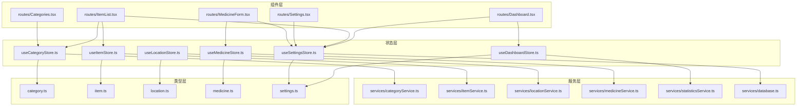
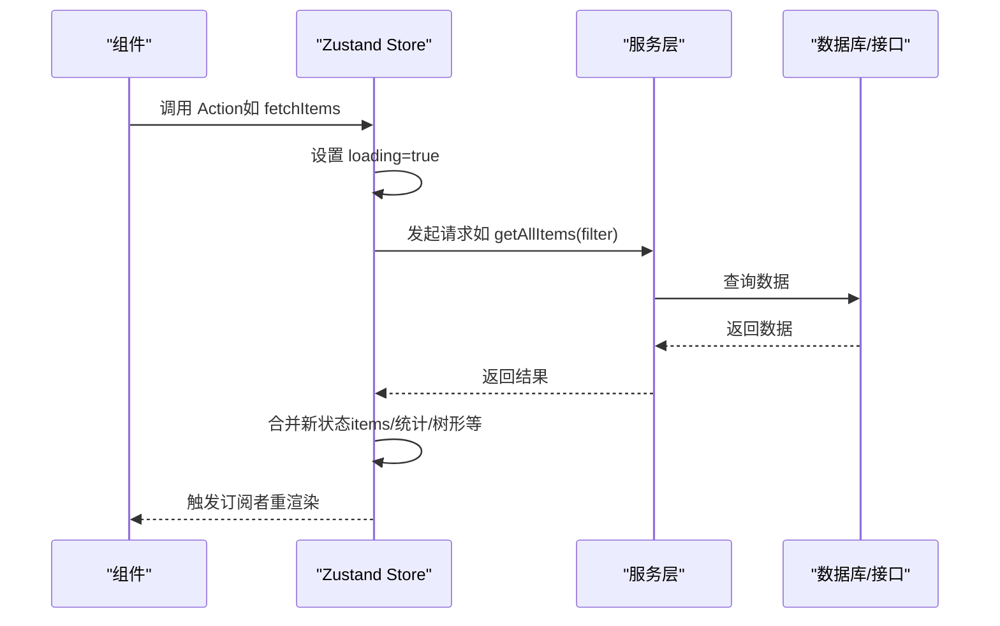
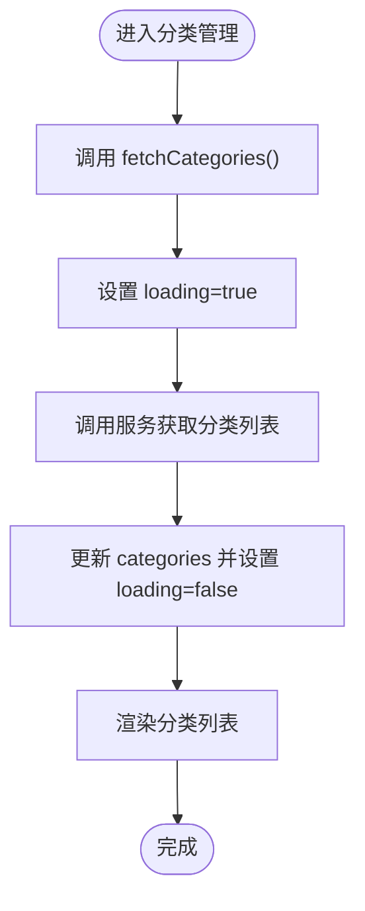
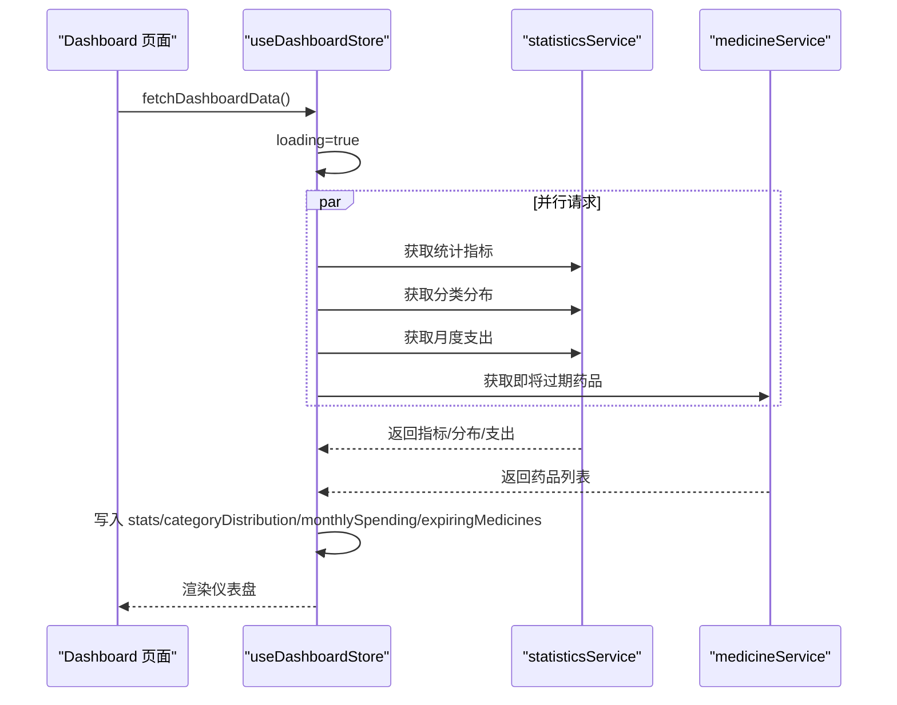
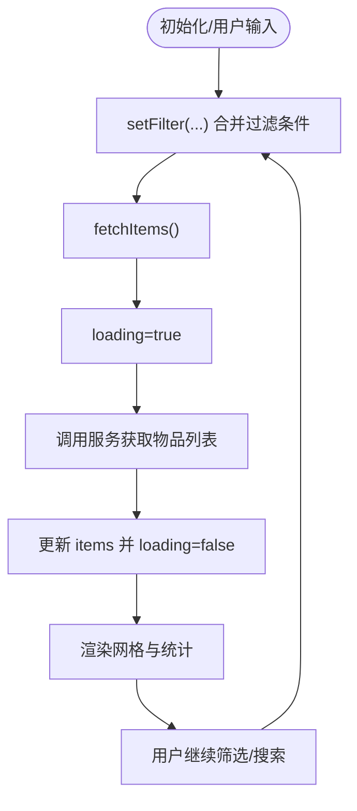
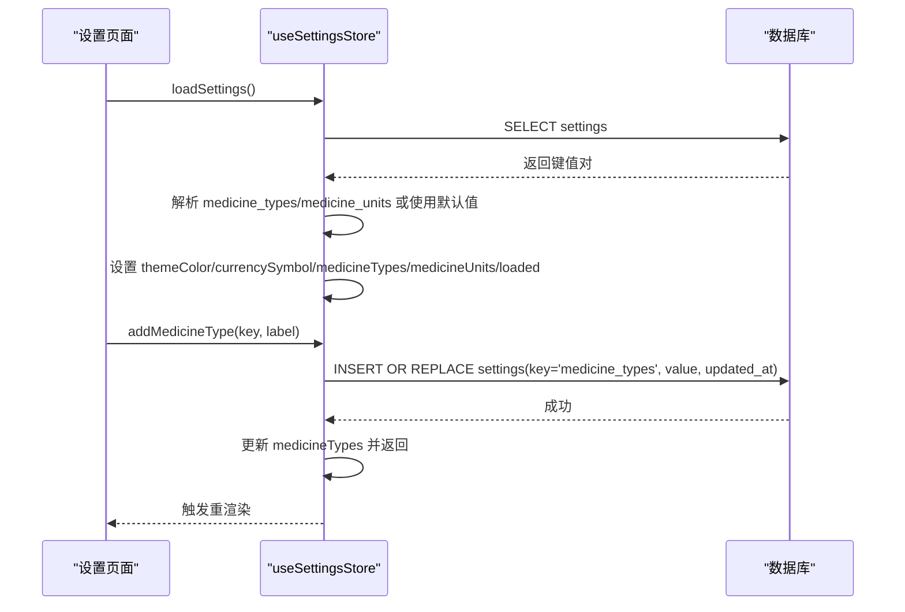
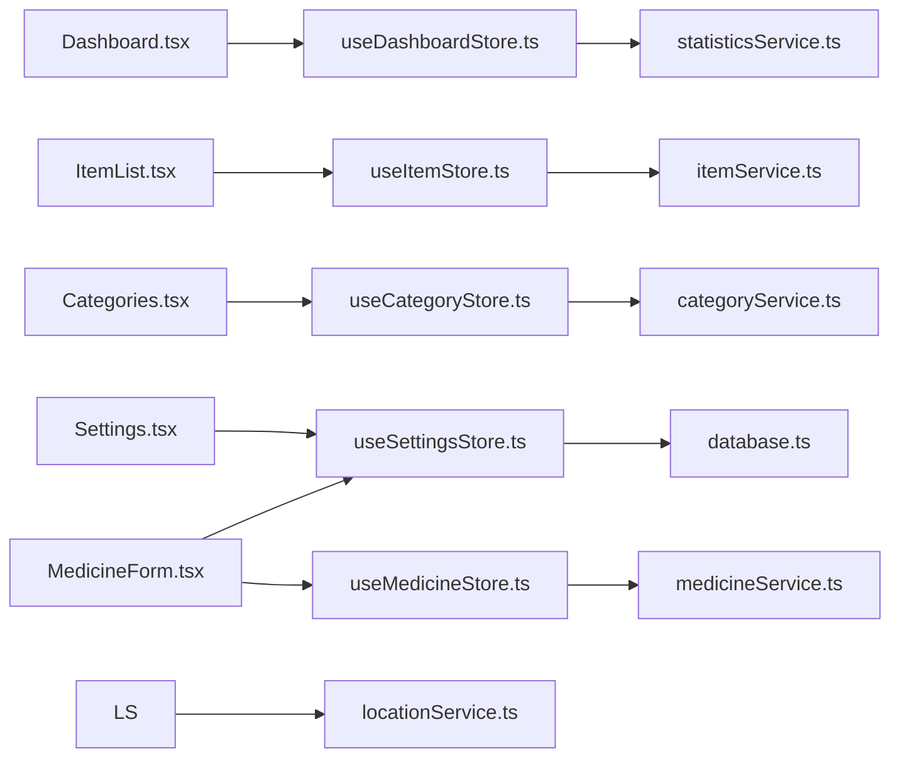

# 状态管理

<cite>
**本文引用的文件**
- [useCategoryStore.ts](file://src/stores/useCategoryStore.ts)
- [useDashboardStore.ts](file://src/stores/useDashboardStore.ts)
- [useItemStore.ts](file://src/stores/useItemStore.ts)
- [useLocationStore.ts](file://src/stores/useLocationStore.ts)
- [useMedicineStore.ts](file://src/stores/useMedicineStore.ts)
- [useSettingsStore.ts](file://src/stores/useSettingsStore.ts)
- [category.ts](file://src/types/category.ts)
- [item.ts](file://src/types/item.ts)
- [location.ts](file://src/types/location.ts)
- [medicine.ts](file://src/types/medicine.ts)
- [settings.ts](file://src/types/settings.ts)
- [Dashboard.tsx](file://src/routes/Dashboard.tsx)
- [ItemList.tsx](file://src/routes/ItemList.tsx)
- [Categories.tsx](file://src/routes/Categories.tsx)
- [Settings.tsx](file://src/routes/Settings.tsx)
- [MedicineForm.tsx](file://src/routes/MedicineForm.tsx)
- [constants.ts](file://src/utils/constants.ts)
</cite>

## 目录
1. [简介](#简介)
2. [项目结构](#项目结构)
3. [核心组件](#核心组件)
4. [架构总览](#架构总览)
5. [详细组件分析](#详细组件分析)
6. [依赖关系分析](#依赖关系分析)
7. [性能考量](#性能考量)
8. [故障排查指南](#故障排查指南)
9. [结论](#结论)
10. [附录](#附录)

## 简介
本文件系统性梳理 Assetly 基于 Zustand 的轻量级状态管理方案，围绕"按领域拆分"的 Store 设计模式，逐个说明各 Store 的职责边界、状态结构、Action 定义与副作用处理方式，并总结最佳实践（状态更新策略、异步处理、持久化与性能优化）。同时给出 Store 在组件中的使用范式、订阅与响应式更新机制、调试技巧以及常见问题的解决思路。

## 项目结构
- 状态层：位于 src/stores，采用单文件一 Store 的组织方式，每个 Store 聚焦一个业务域。
- 类型层：位于 src/types，统一定义 Store 的状态与 Action 参数/返回值类型。
- 组件层：位于 src/routes 与 src/components，通过 React Hooks 订阅 Store 并驱动 UI 更新。
- 服务层：位于 src/services，封装数据库与网络访问，Store 中调用以实现副作用。

**图表来源**
- [useCategoryStore.ts:1-44](file://src/stores/useCategoryStore.ts#L1-L44)
- [useDashboardStore.ts:1-34](file://src/stores/useDashboardStore.ts#L1-L34)
- [useItemStore.ts:1-53](file://src/stores/useItemStore.ts#L1-L53)
- [useLocationStore.ts:1-43](file://src/stores/useLocationStore.ts#L1-L43)
- [useMedicineStore.ts:1-42](file://src/stores/useMedicineStore.ts#L1-L42)
- [useSettingsStore.ts:1-154](file://src/stores/useSettingsStore.ts#L1-L154)
- [category.ts:1-18](file://src/types/category.ts#L1-L18)
- [item.ts:1-46](file://src/types/item.ts#L1-L46)
- [location.ts:1-24](file://src/types/location.ts#L1-L24)
- [medicine.ts:1-70](file://src/types/medicine.ts#L1-L70)
- [settings.ts:1-25](file://src/types/settings.ts#L1-L25)
- [Dashboard.tsx:1-235](file://src/routes/Dashboard.tsx#L1-L235)
- [ItemList.tsx:1-185](file://src/routes/ItemList.tsx#L1-L185)
- [Categories.tsx:1-184](file://src/routes/Categories.tsx#L1-L184)
- [Settings.tsx:1-372](file://src/routes/Settings.tsx#L1-L372)
- [MedicineForm.tsx:1-215](file://src/routes/MedicineForm.tsx#L1-L215)

**章节来源**
- [useCategoryStore.ts:1-44](file://src/stores/useCategoryStore.ts#L1-L44)
- [useDashboardStore.ts:1-34](file://src/stores/useDashboardStore.ts#L1-L34)
- [useItemStore.ts:1-53](file://src/stores/useItemStore.ts#L1-L53)
- [useLocationStore.ts:1-43](file://src/stores/useLocationStore.ts#L1-L43)
- [useMedicineStore.ts:1-42](file://src/stores/useMedicineStore.ts#L1-L42)
- [useSettingsStore.ts:1-154](file://src/stores/useSettingsStore.ts#L1-L154)
- [category.ts:1-18](file://src/types/category.ts#L1-L18)
- [item.ts:1-46](file://src/types/item.ts#L1-L46)
- [location.ts:1-24](file://src/types/location.ts#L1-L24)
- [medicine.ts:1-70](file://src/types/medicine.ts#L1-L70)
- [settings.ts:1-25](file://src/types/settings.ts#L1-L25)
- [Dashboard.tsx:1-235](file://src/routes/Dashboard.tsx#L1-L235)
- [ItemList.tsx:1-185](file://src/routes/ItemList.tsx#L1-L185)
- [Categories.tsx:1-184](file://src/routes/Categories.tsx#L1-L184)
- [Settings.tsx:1-372](file://src/routes/Settings.tsx#L1-L372)
- [MedicineForm.tsx:1-215](file://src/routes/MedicineForm.tsx#L1-L215)

## 核心组件
- 分类域 Store（useCategoryStore）：负责分类的增删改查与加载，维护分类列表与加载态。
- 仪表盘 Store（useDashboardStore）：聚合多源统计信息，包括概览指标、分类分布、月度支出与即将过期药品。
- 物品域 Store（useItemStore）：负责物品列表、筛选器与 CRUD；支持搜索、状态过滤、分类过滤。
- 地点域 Store（useLocationStore）：负责地点列表与树形结构构建，支持增删改查。
- 药品域 Store（useMedicineStore）：负责药品列表与标签页切换，支持按类型过滤与 CRUD。
- 设置域 Store（useSettingsStore）：负责主题色、货币符号以及药品类型和单位的读取与持久化管理。

**章节来源**
- [useCategoryStore.ts:5-12](file://src/stores/useCategoryStore.ts#L5-L12)
- [useDashboardStore.ts:7-14](file://src/stores/useDashboardStore.ts#L7-L14)
- [useItemStore.ts:12-21](file://src/stores/useItemStore.ts#L12-L21)
- [useLocationStore.ts:5-13](file://src/stores/useLocationStore.ts#L5-L13)
- [useMedicineStore.ts:5-13](file://src/stores/useMedicineStore.ts#L5-L13)
- [useSettingsStore.ts:5-12](file://src/stores/useSettingsStore.ts#L5-L12)

## 架构总览
Zustand 以函数式 Store 定义为核心，每个 Store 通过 create 创建，内部包含：
- 状态字段：描述当前域的数据快照
- Action 方法：同步或异步，负责更新状态与执行副作用
- 外部依赖：通过服务层进行数据访问（数据库/接口）

组件通过 React Hooks 订阅 Store，当状态变化时触发重新渲染，形成"状态驱动 UI"的响应式体系。

**图表来源**
- [useItemStore.ts:28-32](file://src/stores/useItemStore.ts#L28-L32)
- [useDashboardStore.ts:23-32](file://src/stores/useDashboardStore.ts#L23-L32)
- [useSettingsStore.ts:19-35](file://src/stores/useSettingsStore.ts#L19-L35)

## 详细组件分析

### 分类域 Store（useCategoryStore）
- 职责范围
  - 加载分类列表
  - 新增、更新、删除分类
- 状态结构
  - categories: 分类数组
  - loading: 是否加载中
- Action 定义
  - fetchCategories: 异步拉取并更新列表
  - addCategory: 调用服务创建后追加到列表
  - updateCategory: 调用服务更新后局部替换并补充时间戳
  - deleteCategory: 调用服务删除后从列表剔除
- 副作用处理
  - 与 categoryService 对接，集中处理错误与网络异常
- 使用示例
  - 在分类管理页面中展示、新增、编辑、删除分类

**图表来源**
- [useCategoryStore.ts:18-22](file://src/stores/useCategoryStore.ts#L18-L22)
- [Categories.tsx:11-19](file://src/routes/Categories.tsx#L11-L19)

**章节来源**
- [useCategoryStore.ts:5-43](file://src/stores/useCategoryStore.ts#L5-L43)
- [category.ts:3-17](file://src/types/category.ts#L3-L17)
- [Categories.tsx:11-57](file://src/routes/Categories.tsx#L11-L57)

### 仪表盘 Store（useDashboardStore）
- 职责范围
  - 聚合仪表盘所需统计数据与图表数据
- 状态结构
  - stats: 总资产、总数量、药品数、过期预警数
  - categoryDistribution: 分类价值分布
  - monthlySpending: 近期月度支出
  - expiringMedicines: 即将过期药品
  - loading: 是否加载中
- Action 定义
  - fetchDashboardData: 并行拉取多项统计，一次性写入状态
- 副作用处理
  - 并行调用 statisticsService 与 medicineService，提升首屏性能
- 使用示例
  - 在仪表盘首页展示卡片、饼图与预警列表

**图表来源**
- [useDashboardStore.ts:23-32](file://src/stores/useDashboardStore.ts#L23-L32)
- [Dashboard.tsx:13-31](file://src/routes/Dashboard.tsx#L13-L31)

**章节来源**
- [useDashboardStore.ts:7-33](file://src/stores/useDashboardStore.ts#L7-L33)
- [settings.ts:8-24](file://src/types/settings.ts#L8-L24)
- [Dashboard.tsx:13-216](file://src/routes/Dashboard.tsx#L13-L216)

### 物品域 Store（useItemStore）
- 职责范围
  - 物品列表查询、筛选、增删改
- 状态结构
  - items: 物品详情列表（含分类/地点信息）
  - loading: 是否加载中
  - filter: 过滤条件（类别、地点、状态、搜索）
- Action 定义
  - fetchItems: 基于 filter 拉取列表
  - addItem/updateItem/deleteItem: 调用服务后刷新列表
  - setFilter: 合并过滤条件
- 副作用处理
  - 列表变更后自动重新拉取，保证视图一致性
- 使用示例
  - 在物品列表页展示、搜索、状态与分类筛选

**图表来源**
- [useItemStore.ts:28-51](file://src/stores/useItemStore.ts#L28-L51)
- [ItemList.tsx:19-68](file://src/routes/ItemList.tsx#L19-L68)

**章节来源**
- [useItemStore.ts:12-52](file://src/stores/useItemStore.ts#L12-L52)
- [item.ts:24-45](file://src/types/item.ts#L24-L45)
- [ItemList.tsx:19-183](file://src/routes/ItemList.tsx#L19-L183)

### 地点域 Store（useLocationStore）
- 职责范围
  - 地点列表与树形结构构建
- 状态结构
  - locations: 地点数组
  - locationTree: 树形结构
  - loading: 是否加载中
- Action 定义
  - fetchLocations: 拉取列表并构建树
  - add/update/delete: 变更后重新构建树
- 副作用处理
  - 本地计算树结构，避免重复远程转换
- 使用示例
  - 在表单与导航中选择地点路径

**章节来源**
- [useLocationStore.ts:5-42](file://src/stores/useLocationStore.ts#L5-L42)
- [location.ts:15-23](file://src/types/location.ts#L15-L23)

### 药品域 Store（useMedicineStore）
- 职责范围
  - 药品列表与类型标签页切换
- 状态结构
  - medicines: 药品详情（含物品信息）
  - loading: 是否加载中
  - activeTab: 当前类型或全部
- Action 定义
  - fetchMedicines: 根据 activeTab 过滤后拉取
  - add/update: 变更后刷新
  - setActiveTab: 切换标签页
- 副作用处理
  - 仅在标签页变化时触发重新拉取
- 使用示例
  - 在药品列表页按类型筛选与管理

**章节来源**
- [useMedicineStore.ts:5-41](file://src/stores/useMedicineStore.ts#L5-L41)
- [medicine.ts:29-41](file://src/types/medicine.ts#L29-L41)

### 设置域 Store（useSettingsStore）
- 职责范围
  - 应用主题色、货币符号以及药品类型和单位的读取与持久化管理
- 状态结构
  - themeColor: 主题色
  - currencySymbol: 货币符号
  - medicineTypes: 药品类型选项数组（包含 key 和 label）
  - medicineUnits: 药品单位字符串数组
  - loaded: 是否已加载
- Action 定义
  - loadSettings: 从数据库读取并解析，支持药品类型和单位的自定义配置
  - setThemeColor: 写入数据库并同步 DOM CSS 变量
  - setCurrencySymbol: 写入数据库
  - addMedicineType: 添加新的药品类型，支持自定义 key 和 label
  - removeMedicineType: 删除指定的药品类型
  - addMedicineUnit: 添加新的药品单位，自动去重
  - removeMedicineUnit: 删除指定的药品单位
- 副作用处理
  - 数据库事务写入，失败回退；DOM 属性即时生效；支持 JSON 解析与默认值回退
- 使用示例
  - 在仪表盘与列表页根据货币符号格式化金额
  - 在药品表单中选择药品类型和单位
  - 在设置页面管理药品类型和单位

**更新** 新增药品类型和单位管理功能，支持用户自定义配置

**图表来源**
- [useSettingsStore.ts:54-84](file://src/stores/useSettingsStore.ts#L54-L84)
- [useSettingsStore.ts:105-127](file://src/stores/useSettingsStore.ts#L105-L127)
- [Settings.tsx:195-276](file://src/routes/Settings.tsx#L195-L276)

**章节来源**
- [useSettingsStore.ts:5-154](file://src/stores/useSettingsStore.ts#L5-L154)
- [settings.ts:3-6](file://src/types/settings.ts#L3-L6)
- [Settings.tsx:195-276](file://src/routes/Settings.tsx#L195-L276)
- [MedicineForm.tsx:166-203](file://src/routes/MedicineForm.tsx#L166-L203)

## 依赖关系分析
- 组件到 Store：各页面组件通过 hooks 订阅对应 Store，读取状态与调用 Action。
- Store 到服务：Store 内部调用服务层，实现数据获取与写入。
- 服务到外部：服务层对接数据库或统计接口，承担副作用。
- 类型到 Store：类型定义约束状态结构与 Action 签名，确保类型安全。

**图表来源**
- [Dashboard.tsx:4-16](file://src/routes/Dashboard.tsx#L4-L16)
- [ItemList.tsx:4-23](file://src/routes/ItemList.tsx#L4-L23)
- [Categories.tsx:3-17](file://src/routes/Categories.tsx#L3-L17)
- [Settings.tsx:1-11](file://src/routes/Settings.tsx#L1-L11)
- [MedicineForm.tsx:1-40](file://src/routes/MedicineForm.tsx#L1-L40)
- [useCategoryStore.ts](file://src/stores/useCategoryStore.ts#L2)
- [useItemStore.ts](file://src/stores/useItemStore.ts#L2)
- [useLocationStore.ts](file://src/stores/useLocationStore.ts#L2)
- [useMedicineStore.ts](file://src/stores/useMedicineStore.ts#L2)
- [useDashboardStore.ts](file://src/stores/useDashboardStore.ts#L2)
- [useSettingsStore.ts](file://src/stores/useSettingsStore.ts#L2)

**章节来源**
- [Dashboard.tsx:4-16](file://src/routes/Dashboard.tsx#L4-L16)
- [ItemList.tsx:4-23](file://src/routes/ItemList.tsx#L4-L23)
- [Categories.tsx:3-17](file://src/routes/Categories.tsx#L3-L17)
- [Settings.tsx:1-11](file://src/routes/Settings.tsx#L1-L11)
- [MedicineForm.tsx:1-40](file://src/routes/MedicineForm.tsx#L1-L40)

## 性能考量
- 并行加载
  - 仪表盘使用 Promise.all 并行拉取多个统计，减少首屏等待时间。
- 列表刷新策略
  - 物品、地点、药品在新增/更新/删除后统一走"重新拉取"策略，确保一致性，避免复杂 diff。
- 防抖与节流
  - 列表搜索建议使用防抖（如 300ms），降低请求频率。
- 本地树构建
  - 地点树在客户端一次性构建，避免重复远程转换。
- 状态粒度
  - 将"加载态"与"数据态"分离，避免不必要的重渲染。
- 类型约束
  - 通过类型定义明确状态结构，减少运行时错误与无效渲染。
- 药品类型和单位缓存
  - 药品类型和单位作为全局设置存储，避免重复计算和远程转换。

## 故障排查指南
- 异步加载卡住
  - 检查 loading 字段是否正确置位与复位；确认服务层是否有未捕获异常。
- 列表不同步
  - 确认新增/更新/删除后是否调用了重新拉取；避免直接手动拼接状态导致不一致。
- 并行请求失败
  - 注意 Promise.all 的整体失败处理，必要时改为独立 try-catch 并合并结果。
- 设置未生效
  - 检查数据库写入是否成功；确认 DOM CSS 变量赋值是否执行；验证 JSON 解析是否正确。
- 药品类型和单位管理问题
  - 确认自定义类型和单位的唯一性；检查数据库中 medicine_types 和 medicine_units 字段的 JSON 格式；验证默认值回退逻辑。
- 性能问题
  - 关注渲染次数与重渲染范围；对大列表启用虚拟滚动或分页；避免在渲染中做昂贵计算。

## 结论
Assetly 的状态管理以 Zustand 为核心，采用"按领域拆分"的 Store 设计，清晰划分职责、统一类型约束、通过服务层隔离副作用。组件通过订阅 Store 实现响应式更新，配合并行加载与简洁的刷新策略，在保证开发效率的同时兼顾性能与可维护性。新增的药品类型和单位管理功能进一步增强了系统的可扩展性和用户体验。遵循本文最佳实践与排错建议，可进一步提升系统的稳定性与扩展性。

## 附录
- Store 使用清单
  - 仪表盘：订阅 useDashboardStore，调用 fetchDashboardData 初始化
  - 物品列表：订阅 useItemStore，设置 filter 并调用 fetchItems
  - 分类管理：订阅 useCategoryStore，调用 CRUD 与 fetchCategories
  - 地点管理：订阅 useLocationStore，调用 CRUD 与 fetchLocations
  - 药品管理：订阅 useMedicineStore，调用 CRUD 与 setActiveTab
  - 应用设置：订阅 useSettingsStore，调用 loadSettings 与 setThemeColor/setCurrencySymbol，以及药品类型和单位管理
- 状态订阅与响应式更新
  - 组件内解构 Store 状态与 Action；在 useEffect 或事件回调中触发 Action；无需手动订阅，Zustand 自动追踪依赖并触发重渲染
- 调试技巧
  - 使用浏览器 React DevTools 的组件树与 Hooks 面板观察状态变化
  - 为关键 Action 添加日志输出，记录输入参数与返回值
  - 对并发场景增加幂等性校验（如重复提交防护）
  - 监控数据库中 settings 表的 medicine_types 和 medicine_units 字段变化
- 常见问题
  - "状态更新了但 UI 不变"：检查是否在正确的组件中订阅了对应 Store
  - "列表不刷新"：确认 CRUD 后是否调用了重新拉取方法
  - "并发请求互相覆盖"：使用独立的 loading 字段或请求去重策略
  - "药品类型和单位不显示"：检查数据库中 JSON 数据格式是否正确，确认默认值回退逻辑
  - "自定义类型重复"：确认 addMedicineType 操作的唯一性检查逻辑