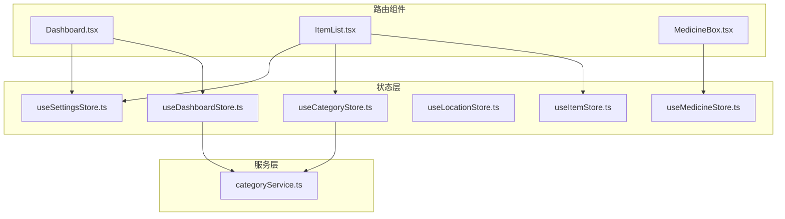
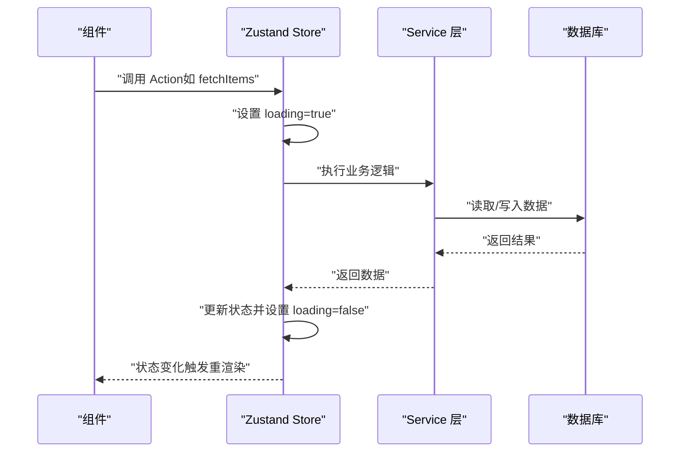
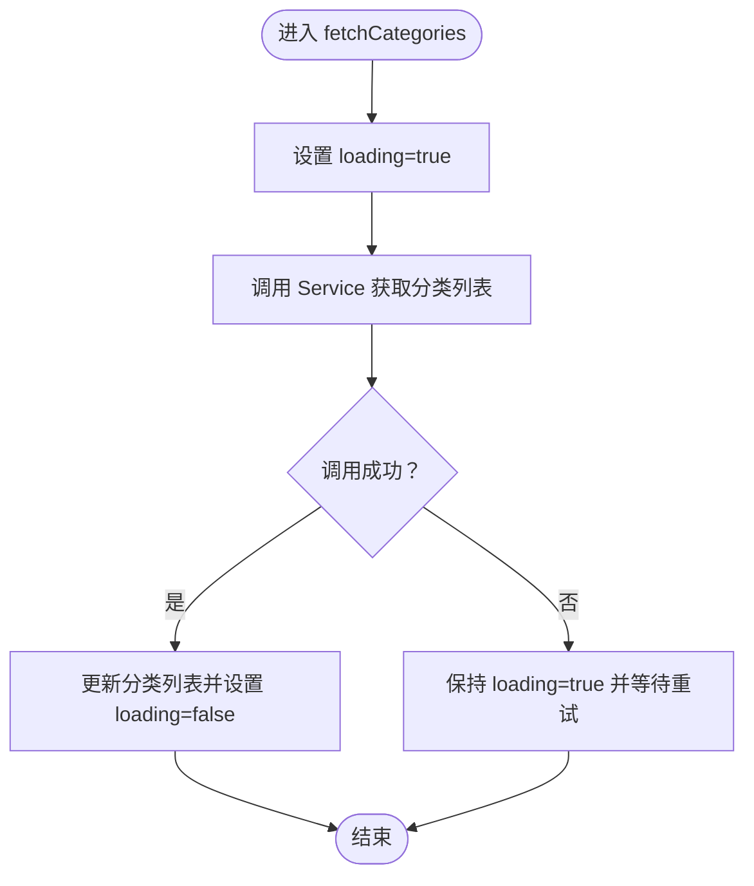
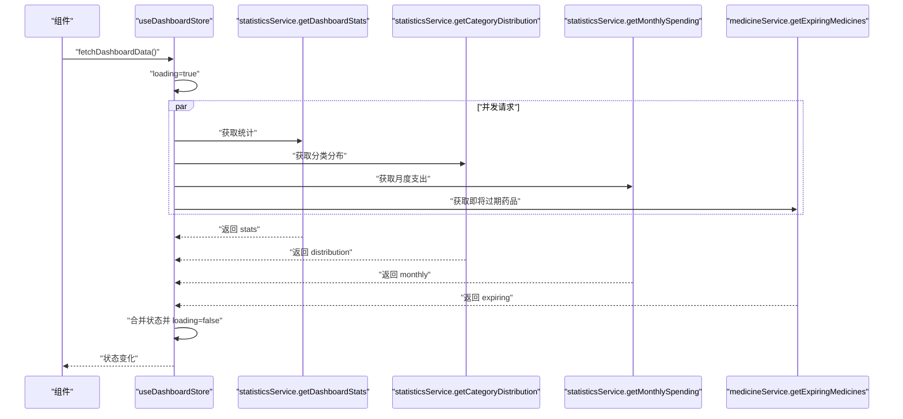
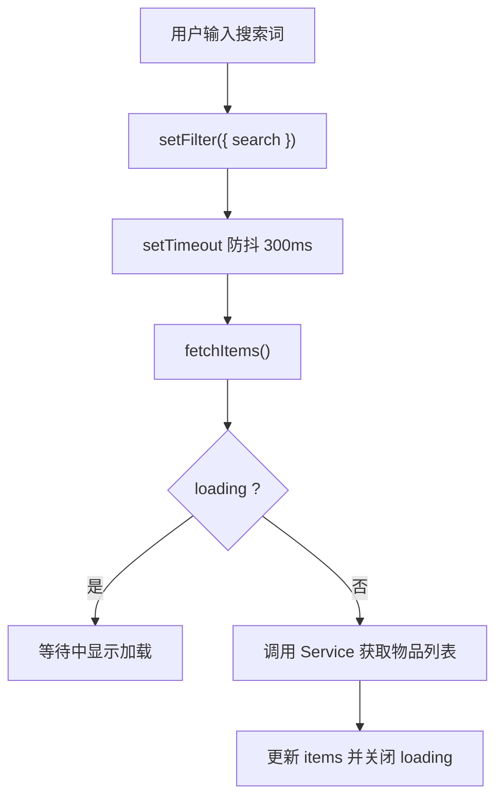
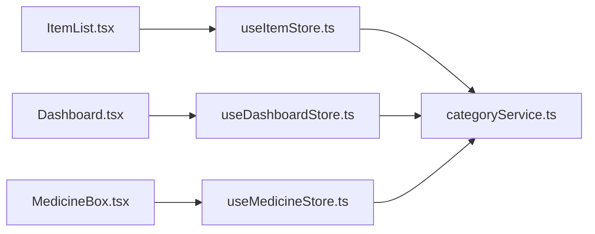

# 状态管理模式与最佳实践

<cite>
**本文引用的文件**
- [useCategoryStore.ts](file://src/stores/useCategoryStore.ts)
- [useDashboardStore.ts](file://src/stores/useDashboardStore.ts)
- [useItemStore.ts](file://src/stores/useItemStore.ts)
- [useLocationStore.ts](file://src/stores/useLocationStore.ts)
- [useMedicineStore.ts](file://src/stores/useMedicineStore.ts)
- [useSettingsStore.ts](file://src/stores/useSettingsStore.ts)
- [categoryService.ts](file://src/services/categoryService.ts)
- [category.ts](file://src/types/category.ts)
- [item.ts](file://src/types/item.ts)
- [location.ts](file://src/types/location.ts)
- [medicine.ts](file://src/types/medicine.ts)
- [settings.ts](file://src/types/settings.ts)
- [Dashboard.tsx](file://src/routes/Dashboard.tsx)
- [ItemList.tsx](file://src/routes/ItemList.tsx)
- [MedicineBox.tsx](file://src/routes/MedicineBox.tsx)
</cite>

## 目录
1. [引言](#引言)
2. [项目结构](#项目结构)
3. [核心组件](#核心组件)
4. [架构总览](#架构总览)
5. [详细组件分析](#详细组件分析)
6. [依赖关系分析](#依赖关系分析)
7. [性能考量](#性能考量)
8. [故障排查指南](#故障排查指南)
9. [结论](#结论)
10. [附录](#附录)

## 引言
本指南系统梳理 Assetly 的状态管理模式与最佳实践，围绕各 Store 的设计模式、状态结构、Action 组织与副作用处理进行深入解析；总结异步操作处理、错误与加载状态管理策略；阐述订阅与渲染优化、内存泄漏防范；给出组件集成与使用范式，并提供调试、测试与常见问题解决方案，以及扩展性与演进方向建议。

## 项目结构
- 前端采用 Zustand 作为轻量状态管理库，Store 定义集中在 src/stores 下，每个领域一个 Store（如分类、仪表盘、物品、位置、药品、设置）。
- 业务逻辑通过 Service 层封装，Store 调用 Service 进行数据库或远程接口访问，避免在 Store 中直接写复杂副作用。
- 类型定义集中于 src/types，确保 Store 与组件之间的契约清晰。
- 路由组件通过 hooks 订阅 Store，负责触发加载、过滤与交互，渲染层仅关注展示与用户交互。

图表来源
- [Dashboard.tsx](file://src/routes/Dashboard.tsx)
- [ItemList.tsx](file://src/routes/ItemList.tsx)
- [MedicineBox.tsx](file://src/routes/MedicineBox.tsx)
- [useCategoryStore.ts](file://src/stores/useCategoryStore.ts)
- [useDashboardStore.ts](file://src/stores/useDashboardStore.ts)
- [useItemStore.ts](file://src/stores/useItemStore.ts)
- [useLocationStore.ts](file://src/stores/useLocationStore.ts)
- [useMedicineStore.ts](file://src/stores/useMedicineStore.ts)
- [useSettingsStore.ts](file://src/stores/useSettingsStore.ts)
- [categoryService.ts](file://src/services/categoryService.ts)

章节来源
- [useCategoryStore.ts:1-44](file://src/stores/useCategoryStore.ts#L1-L44)
- [useDashboardStore.ts:1-34](file://src/stores/useDashboardStore.ts#L1-L34)
- [useItemStore.ts:1-53](file://src/stores/useItemStore.ts#L1-L53)
- [useLocationStore.ts:1-43](file://src/stores/useLocationStore.ts#L1-L43)
- [useMedicineStore.ts:1-42](file://src/stores/useMedicineStore.ts#L1-L42)
- [useSettingsStore.ts:1-56](file://src/stores/useSettingsStore.ts#L1-L56)

## 核心组件
- 分类 Store：维护分类列表与加载状态，提供查询、新增、更新、删除等 Action，内部通过 Service 访问数据库。
- 仪表盘 Store：聚合多路数据（统计、分类分布、月度支出、即将过期药品），统一加载状态，支持并发请求。
- 物品 Store：维护物品列表、过滤器与加载状态，支持搜索、状态筛选、分类筛选，变更后自动刷新列表。
- 位置 Store：维护平铺列表与树形结构，提供查询、新增、更新、删除，变更后重建树。
- 药品 Store：维护药品列表与活动标签页，按类型过滤，变更后刷新列表。
- 设置 Store：维护主题色、货币符号等应用设置，持久化到本地数据库，支持动态更新并联动 DOM 变量。

章节来源
- [useCategoryStore.ts:5-12](file://src/stores/useCategoryStore.ts#L5-L12)
- [useDashboardStore.ts:7-14](file://src/stores/useDashboardStore.ts#L7-L14)
- [useItemStore.ts:12-21](file://src/stores/useItemStore.ts#L12-L21)
- [useLocationStore.ts:5-13](file://src/stores/useLocationStore.ts#L5-L13)
- [useMedicineStore.ts:5-13](file://src/stores/useMedicineStore.ts#L5-L13)
- [useSettingsStore.ts:5-12](file://src/stores/useSettingsStore.ts#L5-L12)

## 架构总览
- 数据流：组件通过 Store 的 Action 触发异步请求；Service 封装数据访问；Store 更新状态；组件订阅状态并重新渲染。
- 错误与加载：统一在 Store 内设置 loading 状态；组件根据 loading 渲染骨架或加载指示器；错误通常在组件侧捕获并记录。
- 副作用隔离：Store 仅负责状态与调度；数据库/网络等副作用由 Service 承担；避免在 Store 中直接写副作用。

图表来源
- [useItemStore.ts:28-32](file://src/stores/useItemStore.ts#L28-L32)
- [categoryService.ts:9-12](file://src/services/categoryService.ts#L9-L12)

## 详细组件分析

### 分类 Store（useCategoryStore）
- 设计要点
  - 状态结构：包含分类数组与全局加载标志。
  - Action 组织：提供查询、新增、更新、删除四个异步 Action。
  - 副作用处理：所有数据库操作委托给 Service，Store 仅负责状态更新。
- 异步与加载
  - 查询时设置 loading；成功后回写数据并关闭 loading。
- 错误处理
  - 当前未显式 try/catch，建议在 Service 层抛出可识别错误并在组件侧捕获。
- 性能与一致性
  - 新增/更新/删除后直接在内存中同步更新列表，避免额外请求，保证 UI 与数据一致。

图表来源
- [useCategoryStore.ts:18-22](file://src/stores/useCategoryStore.ts#L18-L22)
- [categoryService.ts:9-12](file://src/services/categoryService.ts#L9-L12)

章节来源
- [useCategoryStore.ts:1-44](file://src/stores/useCategoryStore.ts#L1-L44)
- [categoryService.ts:1-59](file://src/services/categoryService.ts#L1-L59)
- [category.ts:1-18](file://src/types/category.ts#L1-L18)

### 仪表盘 Store（useDashboardStore）
- 设计要点
  - 多源聚合：同时拉取统计数据、分类分布、月度支出、即将过期药品。
  - 并发优化：使用 Promise.all 同时发起多个请求，减少总等待时间。
  - 加载状态：统一 loading 控制，组件一次性渲染骨架。
- 异步与加载
  - 开始聚合请求前设置 loading；全部完成后回写数据并关闭 loading。
- 错误处理
  - 若任一子任务失败，整体失败；建议对每个子任务做独立错误处理与降级策略。

图表来源
- [useDashboardStore.ts:25-31](file://src/stores/useDashboardStore.ts#L25-L31)

章节来源
- [useDashboardStore.ts:1-34](file://src/stores/useDashboardStore.ts#L1-L34)
- [settings.ts:8-24](file://src/types/settings.ts#L8-L24)

### 物品 Store（useItemStore）
- 设计要点
  - 状态结构：物品列表、加载状态、过滤器对象。
  - 过滤器设计：支持分类、位置、状态、关键词等组合过滤。
  - 列表刷新：新增/更新/删除后自动重新拉取列表，保证一致性。
- 异步与加载
  - 查询时设置 loading；成功后回写 items 并关闭 loading。
- 防抖与节流
  - 搜索输入使用防抖（300ms）减少频繁请求。
- 性能与一致性
  - 使用 get().fetchItems() 在同一事务中刷新，避免中间态。

图表来源
- [useItemStore.ts:49-51](file://src/stores/useItemStore.ts#L49-L51)
- [ItemList.tsx:32-38](file://src/routes/ItemList.tsx#L32-L38)

章节来源
- [useItemStore.ts:1-53](file://src/stores/useItemStore.ts#L1-L53)
- [item.ts:1-46](file://src/types/item.ts#L1-L46)
- [ItemList.tsx:1-185](file://src/routes/ItemList.tsx#L1-L185)

### 位置 Store（useLocationStore）
- 设计要点
  - 状态结构：平铺列表与树形结构，便于不同场景使用。
  - 树构建：在 Service 层构建树，Store 仅接收并存储。
  - 变更后重建：新增/更新/删除后重新获取列表并重建树。
- 异步与加载
  - 查询时设置 loading；成功后同时更新平铺与树结构并关闭 loading。

章节来源
- [useLocationStore.ts:1-43](file://src/stores/useLocationStore.ts#L1-L43)
- [location.ts:1-24](file://src/types/location.ts#L1-L24)

### 药品 Store（useMedicineStore）
- 设计要点
  - 状态结构：药品列表、加载状态、活动标签页。
  - 标签过滤：根据 activeTab 动态构造查询条件，支持“全部”与三类药品。
  - 列表刷新：新增/更新后自动刷新，保持与后端一致。
- 异步与加载
  - 查询时设置 loading；成功后回写 medicines 并关闭 loading。
- 交互优化
  - 组件侧在切换标签时触发刷新，避免 Store 内部监听标签变化。

章节来源
- [useMedicineStore.ts:1-42](file://src/stores/useMedicineStore.ts#L1-L42)
- [medicine.ts:1-70](file://src/types/medicine.ts#L1-L70)
- [MedicineBox.tsx:1-112](file://src/routes/MedicineBox.tsx#L1-L112)

### 设置 Store（useSettingsStore）
- 设计要点
  - 状态结构：主题色、货币符号、加载完成标记。
  - 持久化：通过数据库表 settings 存储键值对，支持 JSON 字段。
  - 动态样式：更新主题色后同步设置 CSS 变量，即时生效。
- 异步与加载
  - 初始化时从数据库读取并设置 loaded；更新设置时写入数据库并回写状态。
- 错误处理
  - 解析 JSON 失败时回退为字符串，保证健壮性。

章节来源
- [useSettingsStore.ts:1-56](file://src/stores/useSettingsStore.ts#L1-L56)
- [settings.ts:1-6](file://src/types/settings.ts#L1-L6)

## 依赖关系分析
- 组件依赖 Store：路由组件通过 hooks 订阅 Store，触发 Action 并消费状态。
- Store 依赖 Service：Store 不直接访问数据库，而是通过 Service 封装数据访问。
- Service 依赖数据库：Service 通过统一的数据库访问接口执行 SQL。
- 类型定义贯穿：Store、Service、组件共享类型定义，确保契约一致。

图表来源
- [ItemList.tsx](file://src/routes/ItemList.tsx)
- [Dashboard.tsx](file://src/routes/Dashboard.tsx)
- [MedicineBox.tsx](file://src/routes/MedicineBox.tsx)
- [useItemStore.ts](file://src/stores/useItemStore.ts)
- [useDashboardStore.ts](file://src/stores/useDashboardStore.ts)
- [useMedicineStore.ts](file://src/stores/useMedicineStore.ts)
- [categoryService.ts](file://src/services/categoryService.ts)

章节来源
- [ItemList.tsx:1-185](file://src/routes/ItemList.tsx#L1-L185)
- [Dashboard.tsx:1-235](file://src/routes/Dashboard.tsx#L1-L235)
- [MedicineBox.tsx:1-112](file://src/routes/MedicineBox.tsx#L1-L112)
- [useItemStore.ts:1-53](file://src/stores/useItemStore.ts#L1-L53)
- [useDashboardStore.ts:1-34](file://src/stores/useDashboardStore.ts#L1-L34)
- [useMedicineStore.ts:1-42](file://src/stores/useMedicineStore.ts#L1-L42)
- [categoryService.ts:1-59](file://src/services/categoryService.ts#L1-L59)

## 性能考量
- 并发请求：仪表盘 Store 使用 Promise.all 并发拉取多路数据，显著降低首屏等待时间。
- 防抖与节流：物品列表搜索使用 300ms 防抖，减少无效请求。
- 列表刷新策略：新增/更新/删除后立即刷新，避免多次往返请求。
- 组件渲染优化：使用 useMemo 计算统计信息，避免重复计算；列表为空时渲染占位图而非空节点。
- 加载状态：统一 loading 控制，组件在 loading 期间渲染骨架屏，提升感知性能。
- 内存与订阅：组件卸载时清理定时器与订阅，避免内存泄漏。

章节来源
- [useDashboardStore.ts:25-31](file://src/stores/useDashboardStore.ts#L25-L31)
- [ItemList.tsx:32-38](file://src/routes/ItemList.tsx#L32-L38)
- [ItemList.tsx:51-68](file://src/routes/ItemList.tsx#L51-L68)

## 故障排查指南
- 加载状态异常
  - 现象：页面一直显示加载。
  - 排查：确认 Store 中是否正确设置 loading；检查 Service 是否抛错导致未恢复。
- 列表不刷新
  - 现象：新增/更新/删除后列表未变化。
  - 排查：确认 Store 是否在变更后调用 fetchItems；检查过滤器是否影响结果。
- 并发请求失败
  - 现象：仪表盘部分数据缺失。
  - 排查：对每个子请求增加独立错误处理与重试；必要时降级渲染。
- 防抖失效
  - 现象：搜索频繁闪烁。
  - 排查：确认防抖定时器清理逻辑；避免在卸载后仍触发 setState。
- 主题色不生效
  - 现象：切换主题色后界面未变化。
  - 排查：确认 CSS 变量是否正确设置；检查 Store 写入数据库与回写的顺序。

章节来源
- [useDashboardStore.ts:25-31](file://src/stores/useDashboardStore.ts#L25-L31)
- [useItemStore.ts:49-51](file://src/stores/useItemStore.ts#L49-L51)
- [useSettingsStore.ts:44-44](file://src/stores/useSettingsStore.ts#L44-L44)

## 结论
Assetly 的状态管理以 Zustand 为核心，结合 Service 层与类型定义，形成了清晰、可维护且高性能的状态管理模式。通过统一的加载状态、并发请求与列表刷新策略，实现了良好的用户体验。建议后续在错误处理、缓存与持久化策略、以及 Store 的模块化拆分方面进一步完善，以增强可扩展性与可测试性。

## 附录
- 组件集成模式
  - 在路由组件中引入对应 Store 的 hooks，解构出状态与 Action。
  - 在 useEffect 中触发初始化加载；在用户交互中触发更新 Action。
  - 在渲染层根据 loading 与数据状态分别渲染骨架、空态或列表。
- 状态使用示例（路径）
  - 仪表盘数据加载：[useDashboardStore.ts:23-32](file://src/stores/useDashboardStore.ts#L23-L32)、[Dashboard.tsx:19-22](file://src/routes/Dashboard.tsx#L19-L22)
  - 物品列表与过滤：[useItemStore.ts:28-51](file://src/stores/useItemStore.ts#L28-L51)、[ItemList.tsx:27-49](file://src/routes/ItemList.tsx#L27-L49)
  - 药品列表与标签切换：[useMedicineStore.ts:20-40](file://src/stores/useMedicineStore.ts#L20-L40)、[MedicineBox.tsx:23-29](file://src/routes/MedicineBox.tsx#L23-L29)
  - 分类 CRUD：[useCategoryStore.ts:18-42](file://src/stores/useCategoryStore.ts#L18-L42)、[categoryService.ts:20-49](file://src/services/categoryService.ts#L20-L49)
  - 应用设置持久化：[useSettingsStore.ts:19-54](file://src/stores/useSettingsStore.ts#L19-L54)