# 药品状态管理

<cite>
**本文档引用的文件**
- [useMedicineStore.ts](file://src/stores/useMedicineStore.ts)
- [medicine.ts](file://src/types/medicine.ts)
- [medicationReminder.ts](file://src/services/medicationReminder.ts)
- [medicineService.ts](file://src/services/medicineService.ts)
- [MedicineCard.tsx](file://src/components/medicine/MedicineCard.tsx)
- [MedicineForm.tsx](file://src/routes/MedicineForm.tsx)
- [MedicineBox.tsx](file://src/routes/MedicineBox.tsx)
- [ExpiryBadge.tsx](file://src/components/medicine/ExpiryBadge.tsx)
- [dateHelper.ts](file://src/utils/dateHelper.ts)
- [constants.ts](file://src/utils/constants.ts)
- [database.ts](file://src/services/database.ts)
</cite>

## 目录
1. [简介](#简介)
2. [项目结构](#项目结构)
3. [核心组件](#核心组件)
4. [架构概览](#架构概览)
5. [详细组件分析](#详细组件分析)
6. [依赖关系分析](#依赖关系分析)
7. [性能考虑](#性能考虑)
8. [故障排除指南](#故障排除指南)
9. [结论](#结论)

## 简介

本文件详细介绍了资产管理系统中的药品状态管理模块。该模块基于Zustand状态管理库构建，专门用于管理药品的生命周期状态，包括过期状态监控、用药提醒配置和库存跟踪等功能。系统采用"物品-药品"的扩展模式，通过数据库层面的一对一关联实现物品基础信息与药品特有属性的分离管理。

## 项目结构

药品状态管理模块主要分布在以下目录结构中：

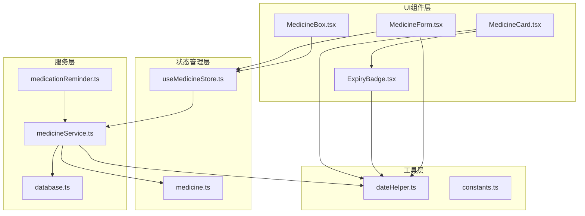

**图表来源**
- [useMedicineStore.ts:1-42](file://src/stores/useMedicineStore.ts#L1-L42)
- [medicineService.ts:1-194](file://src/services/medicineService.ts#L1-L194)
- [medicationReminder.ts:1-132](file://src/services/medicationReminder.ts#L1-L132)

**章节来源**
- [useMedicineStore.ts:1-42](file://src/stores/useMedicineStore.ts#L1-L42)
- [medicine.ts:1-70](file://src/types/medicine.ts#L1-L70)

## 核心组件

### 数据模型设计

药品状态管理的核心数据模型基于TypeScript接口定义，采用继承扩展的设计模式：

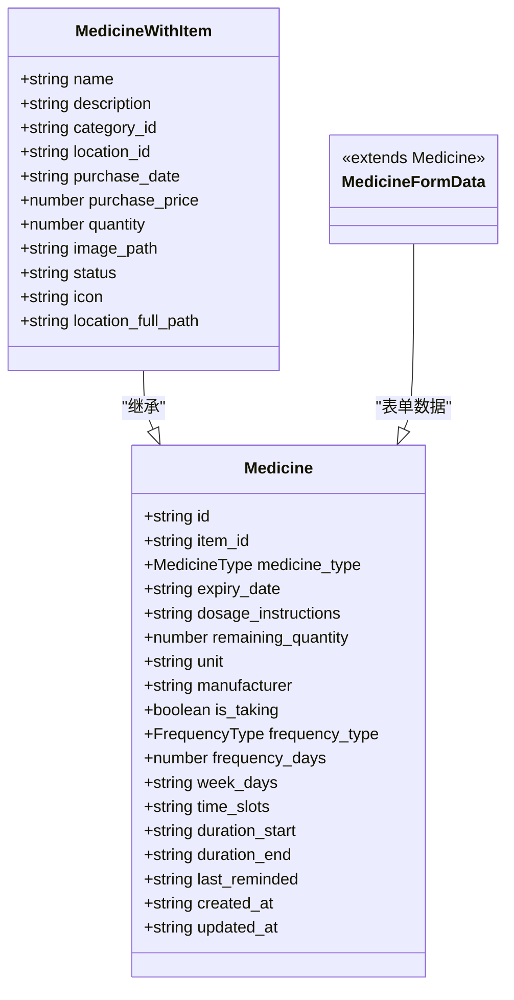

**图表来源**
- [medicine.ts:7-69](file://src/types/medicine.ts#L7-L69)

### 状态管理模式

系统采用Zustand轻量级状态管理，提供响应式的药品状态管理能力：

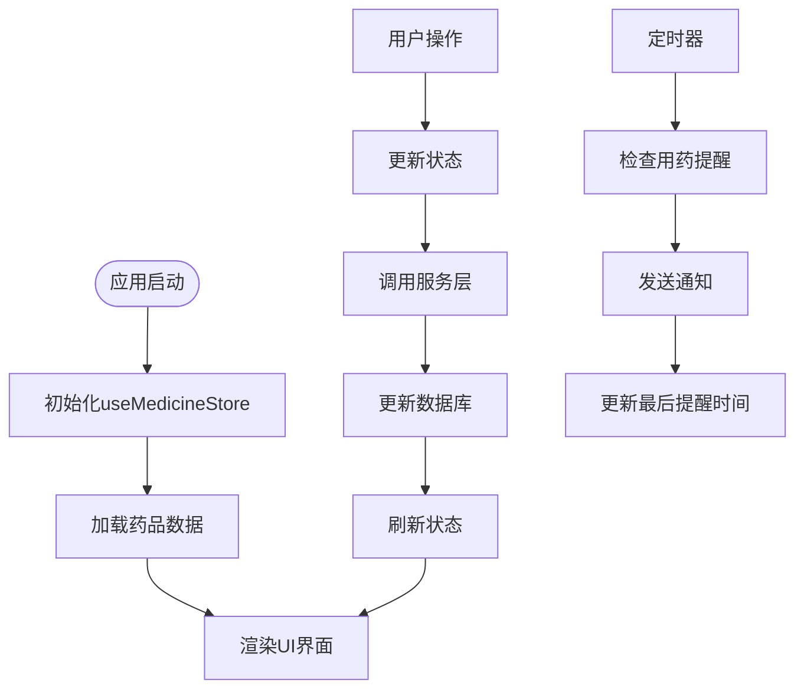

**图表来源**
- [useMedicineStore.ts:15-41](file://src/stores/useMedicineStore.ts#L15-L41)
- [medicationReminder.ts:53-97](file://src/services/medicationReminder.ts#L53-L97)

**章节来源**
- [medicine.ts:1-70](file://src/types/medicine.ts#L1-L70)
- [useMedicineStore.ts:1-42](file://src/stores/useMedicineStore.ts#L1-L42)

## 架构概览

### 整体架构设计

药品状态管理模块采用分层架构设计，各层职责明确，耦合度低：

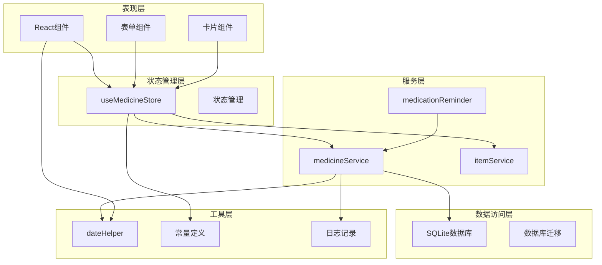

**图表来源**
- [MedicineBox.tsx:18-112](file://src/routes/MedicineBox.tsx#L18-L112)
- [MedicineForm.tsx:33-401](file://src/routes/MedicineForm.tsx#L33-L401)
- [database.ts:60-170](file://src/services/database.ts#L60-L170)

### 数据流处理

系统的数据流遵循单向数据流原则，确保状态一致性：

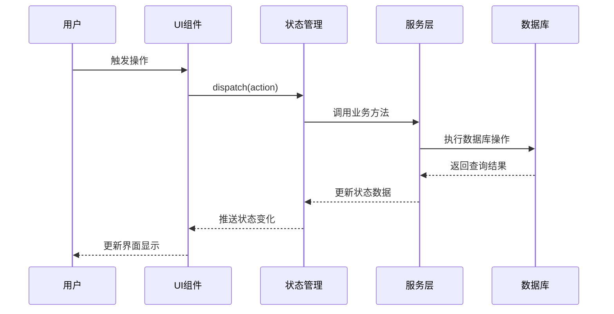

**图表来源**
- [useMedicineStore.ts:20-36](file://src/stores/useMedicineStore.ts#L20-L36)
- [medicineService.ts:54-95](file://src/services/medicineService.ts#L54-L95)

## 详细组件分析

### 药品状态存储器 (useMedicineStore)

useMedicineStore是整个药品状态管理的核心，基于Zustand提供响应式状态管理：

#### 状态结构设计

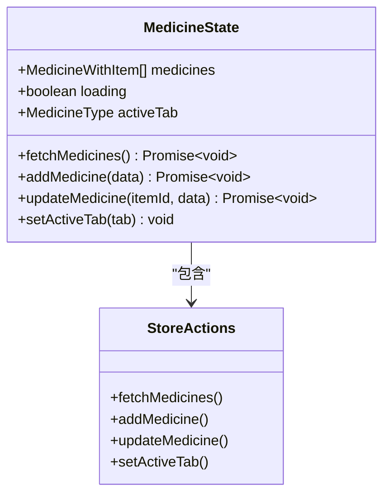

**图表来源**
- [useMedicineStore.ts:5-13](file://src/stores/useMedicineStore.ts#L5-L13)

#### 核心功能实现

1. **数据获取**: 支持按类型过滤的药品列表查询
2. **数据增删改**: 提供完整的CRUD操作接口
3. **状态筛选**: 支持药品类型的标签页切换
4. **异步处理**: 完整的异步操作流程管理

**章节来源**
- [useMedicineStore.ts:15-41](file://src/stores/useMedicineStore.ts#L15-L41)

### 药品数据模型 (medicine.ts)

药品数据模型采用继承扩展的设计模式，实现了物品与药品的解耦：

#### 类型定义体系

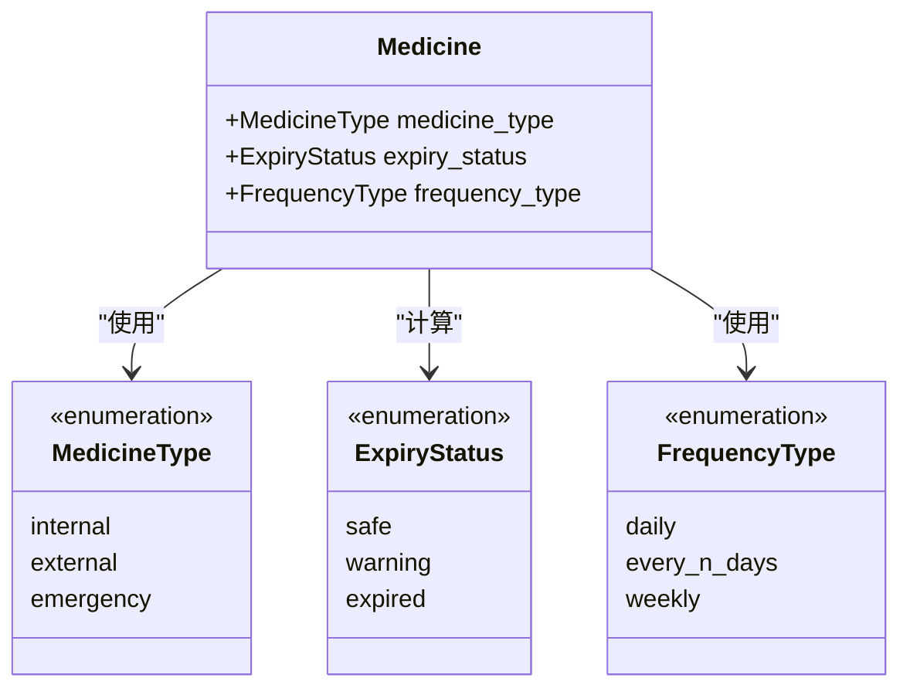

**图表来源**
- [medicine.ts:3-5](file://src/types/medicine.ts#L3-L5)

#### 字段设计原则

| 字段类别 | 字段名称 | 数据类型 | 用途描述 |
|---------|----------|----------|----------|
| 基础信息 | id, item_id | string | 标识符和关联标识 |
| 药品分类 | medicine_type | MedicineType | 内服/外用/急救分类 |
| 有效期管理 | expiry_date | string | 过期日期字段 |
| 用量信息 | remaining_quantity, unit | number/string | 剩余数量和单位 |
| 制造信息 | manufacturer, dosage_instructions | string | 生产商和用法说明 |
| 用药提醒 | is_taking, frequency_* | boolean/number/string | 提醒配置参数 |
| 时间戳 | created_at, updated_at | string | 创建和更新时间 |

**章节来源**
- [medicine.ts:7-69](file://src/types/medicine.ts#L7-L69)

### 用药提醒服务 (medicationReminder)

用药提醒服务提供了智能化的用药提醒功能，支持多种提醒模式：

#### 提醒算法设计

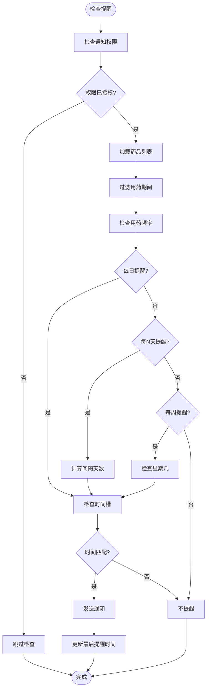

**图表来源**
- [medicationReminder.ts:11-48](file://src/services/medicationReminder.ts#L11-L48)
- [medicationReminder.ts:53-97](file://src/services/medicationReminder.ts#L53-L97)

#### 提醒配置选项

| 配置项 | 类型 | 默认值 | 描述 |
|--------|------|--------|------|
| is_taking | boolean | false | 是否正在服用标记 |
| frequency_type | FrequencyType | 'daily' | 用药频率类型 |
| frequency_days | number | 1 | 每N天提醒间隔 |
| week_days | string | '' | 星期几提醒（逗号分隔） |
| time_slots | string | '' | 用药时间槽（逗号分隔） |
| duration_start | string | '' | 用药开始日期 |
| duration_end | string | '' | 用药结束日期 |
| last_reminded | string | '' | 最后提醒时间 |

**章节来源**
- [medicationReminder.ts:1-132](file://src/services/medicationReminder.ts#L1-L132)

### 药品服务层 (medicineService)

药品服务层负责药品数据的持久化操作，提供完整的CRUD功能：

#### 数据库操作流程

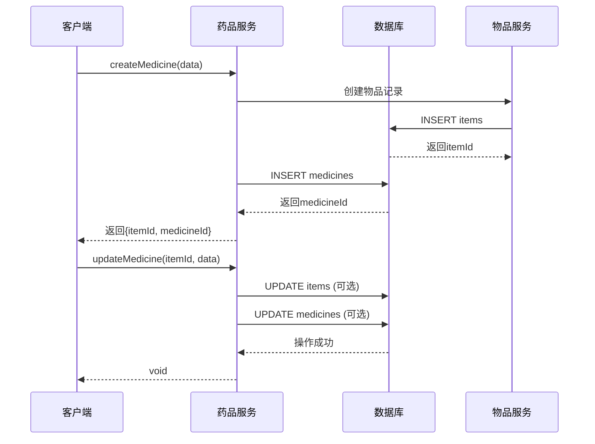

**图表来源**
- [medicineService.ts:54-95](file://src/services/medicineService.ts#L54-L95)
- [medicineService.ts:97-162](file://src/services/medicineService.ts#L97-L162)

#### 查询优化策略

1. **索引优化**: 在关键字段上建立数据库索引
2. **联合查询**: 使用JOIN操作一次性获取完整数据
3. **参数化查询**: 防止SQL注入攻击
4. **分页支持**: 支持大数据集的分页查询

**章节来源**
- [medicineService.ts:10-37](file://src/services/medicineService.ts#L10-L37)
- [medicineService.ts:164-193](file://src/services/medicineService.ts#L164-L193)

### UI组件集成

#### 药品卡片组件 (MedicineCard)

药品卡片组件提供了药品信息的可视化展示：

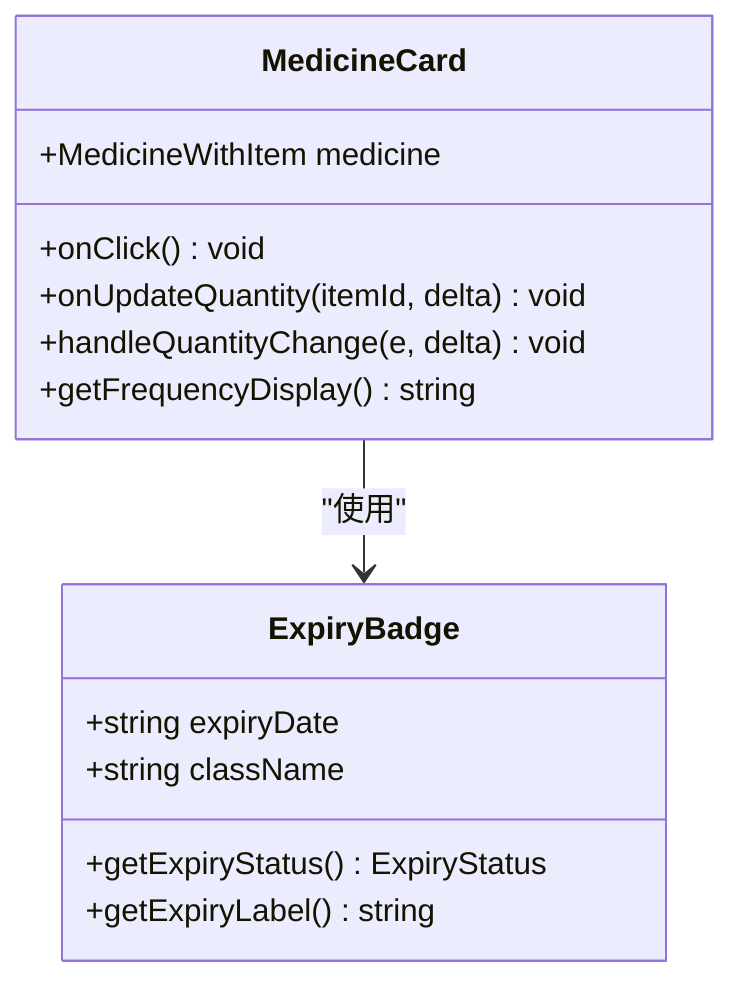

**图表来源**
- [MedicineCard.tsx:14-147](file://src/components/medicine/MedicineCard.tsx#L14-L147)
- [ExpiryBadge.tsx:8-24](file://src/components/medicine/ExpiryBadge.tsx#L8-L24)

#### 药品表单组件 (MedicineForm)

药品表单组件提供了完整的药品信息录入和编辑功能：

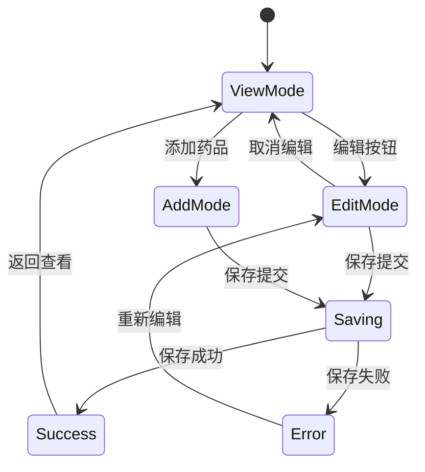

**图表来源**
- [MedicineForm.tsx:33-401](file://src/routes/MedicineForm.tsx#L33-L401)

**章节来源**
- [MedicineCard.tsx:14-147](file://src/components/medicine/MedicineCard.tsx#L14-L147)
- [MedicineForm.tsx:33-401](file://src/routes/MedicineForm.tsx#L33-L401)

## 依赖关系分析

### 组件间依赖关系

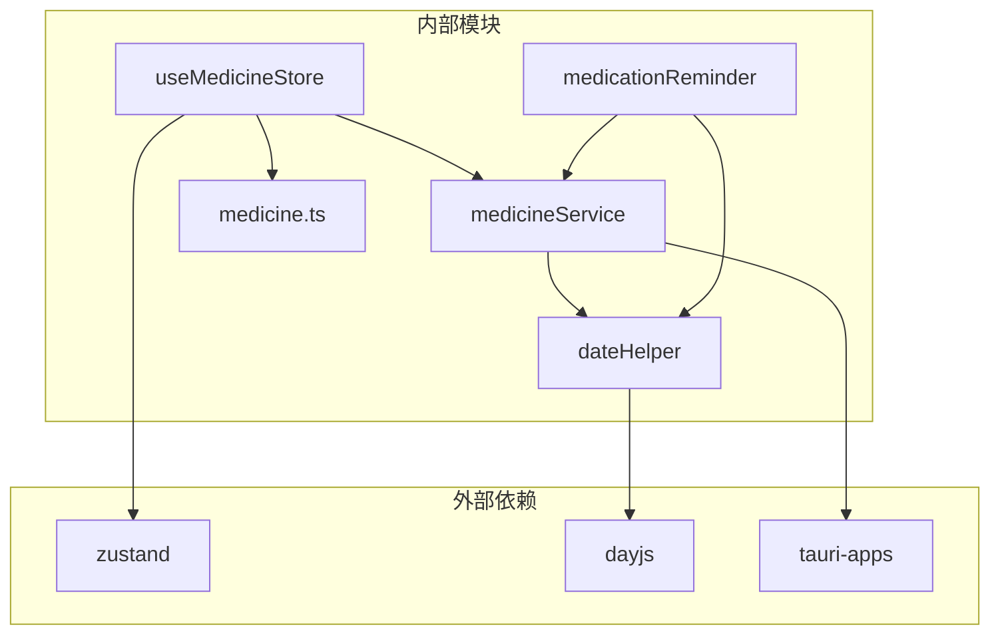

**图表来源**
- [useMedicineStore.ts:1](file://src/stores/useMedicineStore.ts#L1)
- [medicationReminder.ts:1](file://src/services/medicationReminder.ts#L1)
- [medicineService.ts:1](file://src/services/medicineService.ts#L1)

### 数据库依赖关系

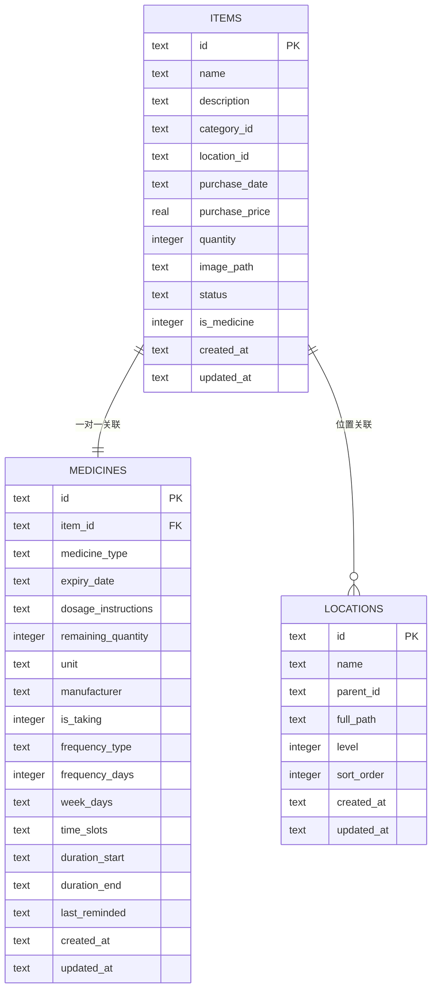

**图表来源**
- [database.ts:104-117](file://src/services/database.ts#L104-L117)

**章节来源**
- [database.ts:60-170](file://src/services/database.ts#L60-L170)

## 性能考虑

### 数据库性能优化

1. **索引策略**: 在常用查询字段上建立索引
   - `medicines(expiry_date)`: 支持过期查询
   - `medicines(medicine_type)`: 支持类型过滤
   - `items(category_id)`: 支持分类查询

2. **查询优化**: 使用JOIN操作减少数据库往返次数
3. **缓存策略**: 使用localStorage缓存最后检查时间

### 内存管理

1. **状态压缩**: 只存储必要的状态数据
2. **异步处理**: 避免阻塞主线程
3. **资源清理**: 定时器的正确清理

### 网络优化

1. **批量操作**: 合并多个状态更新操作
2. **防抖处理**: 避免频繁的状态刷新
3. **错误恢复**: 实现自动重试机制

## 故障排除指南

### 常见问题及解决方案

#### 数据库连接问题

**症状**: 应用启动时数据库连接失败
**原因**: 数据库文件损坏或权限不足
**解决方案**: 
1. 检查数据库文件是否存在
2. 验证应用具有文件读写权限
3. 重新初始化数据库

#### 提醒功能异常

**症状**: 用药提醒不准确或不触发
**原因**: 时间配置错误或权限问题
**解决方案**:
1. 检查系统通知权限
2. 验证时间槽配置格式
3. 确认用药期间设置

#### 状态不同步问题

**症状**: UI显示与实际数据不一致
**原因**: 状态更新延迟或并发冲突
**解决方案**:
1. 检查异步操作的完成状态
2. 实现状态重载机制
3. 添加冲突检测逻辑

**章节来源**
- [medicationReminder.ts:55-66](file://src/services/medicationReminder.ts#L55-L66)
- [medicationReminder.ts:94-96](file://src/services/medicationReminder.ts#L94-L96)

## 结论

药品状态管理模块通过精心设计的架构和完善的业务逻辑，为用户提供了一个功能完整、性能优良的药品管理解决方案。模块采用了现代化的技术栈和最佳实践，包括：

1. **清晰的架构分层**: 层次分明，职责明确
2. **强类型设计**: TypeScript提供编译时类型安全
3. **响应式状态管理**: Zustand提供高效的本地状态管理
4. **智能提醒机制**: 支持多种提醒模式的灵活配置
5. **数据持久化**: SQLite提供可靠的数据存储
6. **用户友好界面**: 直观的操作界面和良好的用户体验

该模块不仅满足了当前的功能需求，还为未来的功能扩展预留了充足的空间，是一个值得借鉴的优秀前端架构案例。