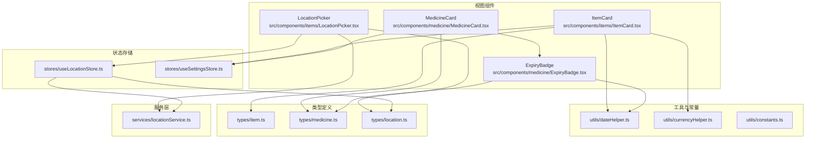
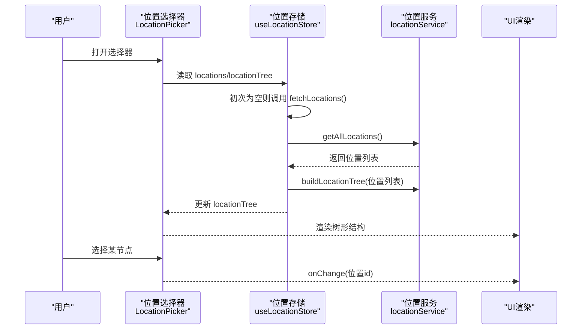
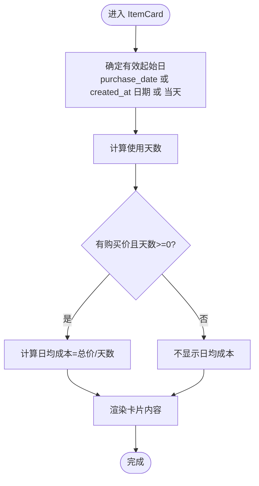
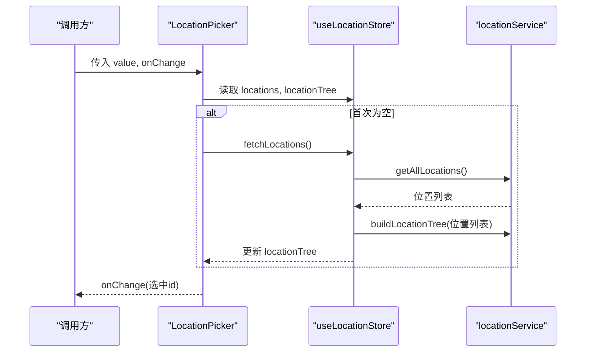
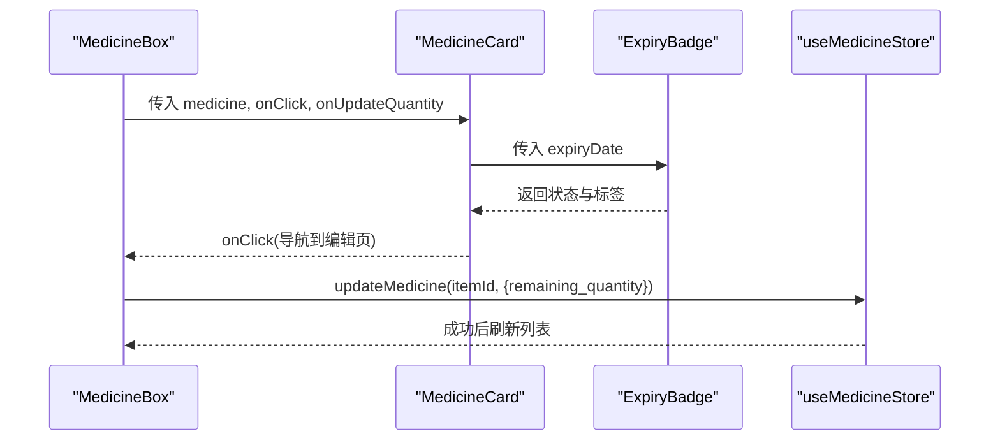
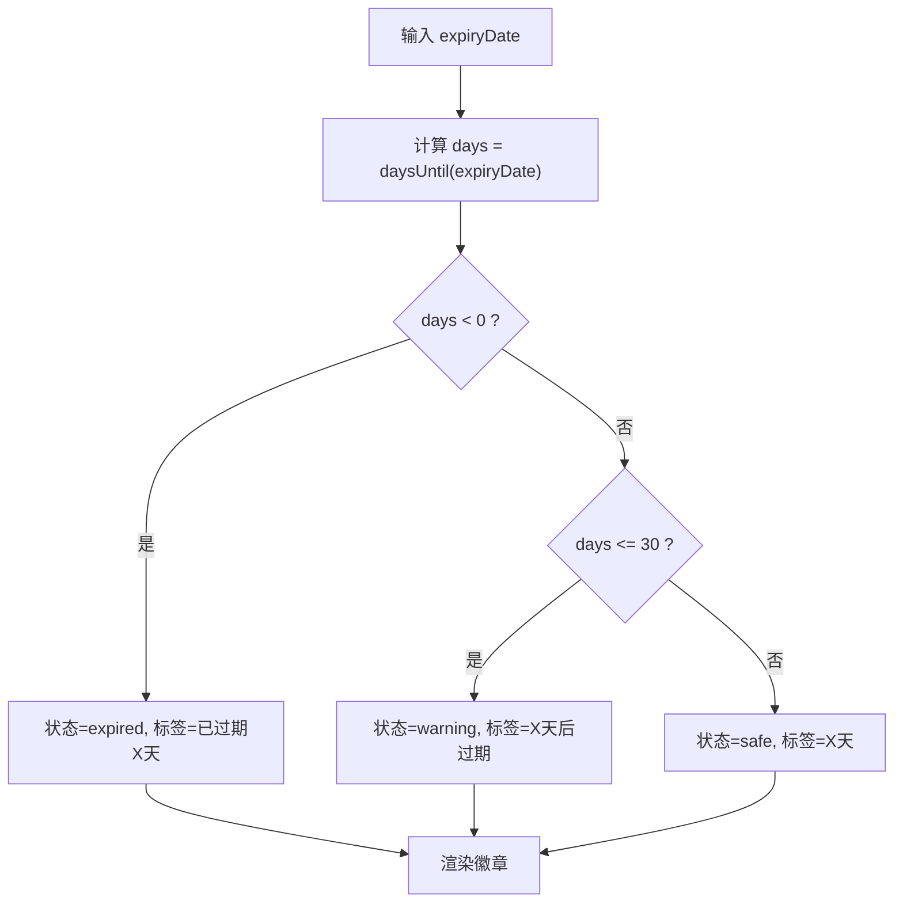
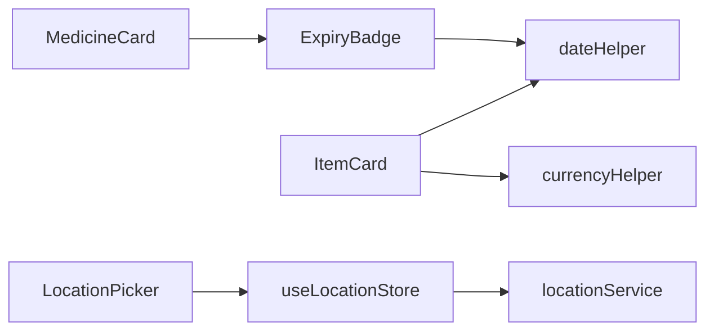

# 业务组件

<cite>
**本文引用的文件**
- [src/components/items/ItemCard.tsx](file://src/components/items/ItemCard.tsx)
- [src/components/items/LocationPicker.tsx](file://src/components/items/LocationPicker.tsx)
- [src/components/medicine/MedicineCard.tsx](file://src/components/medicine/MedicineCard.tsx)
- [src/components/medicine/ExpiryBadge.tsx](file://src/components/medicine/ExpiryBadge.tsx)
- [src/types/item.ts](file://src/types/item.ts)
- [src/types/medicine.ts](file://src/types/medicine.ts)
- [src/types/location.ts](file://src/types/location.ts)
- [src/utils/dateHelper.ts](file://src/utils/dateHelper.ts)
- [src/utils/currencyHelper.ts](file://src/utils/currencyHelper.ts)
- [src/utils/constants.ts](file://src/utils/constants.ts)
- [src/stores/useLocationStore.ts](file://src/stores/useLocationStore.ts)
- [src/stores/useSettingsStore.ts](file://src/stores/useSettingsStore.ts)
- [src/services/locationService.ts](file://src/services/locationService.ts)
- [src/routes/ItemList.tsx](file://src/routes/ItemList.tsx)
- [src/routes/MedicineBox.tsx](file://src/routes/MedicineBox.tsx)
- [src/routes/Locations.tsx](file://src/routes/Locations.tsx)
</cite>

## 目录
1. [简介](#简介)
2. [项目结构](#项目结构)
3. [核心组件](#核心组件)
4. [架构总览](#架构总览)
5. [详细组件分析](#详细组件分析)
6. [依赖分析](#依赖分析)
7. [性能考虑](#性能考虑)
8. [故障排查指南](#故障排查指南)
9. [结论](#结论)
10. [附录](#附录)

## 简介
本文件聚焦于 Assetly 的业务组件：物品卡片（ItemCard）、位置选择器（LocationPicker）、药品卡片（MedicineCard）与过期状态徽章（ExpiryBadge）。文档从系统架构、组件职责、数据绑定与状态同步、业务规则实现（过期预警、位置层级、药品状态管理）等方面进行深入解析，并提供使用示例、协作模式与可扩展性建议。

## 项目结构
业务组件主要位于 src/components 下，配合 src/types 定义的数据模型、src/utils 提供的业务工具函数、src/stores 管理的状态以及 src/services 提供的数据访问层，形成“视图组件 → 工具函数/常量 → 状态存储 → 服务层”的清晰分层。

图表来源
- [src/components/items/ItemCard.tsx:1-94](file://src/components/items/ItemCard.tsx#L1-L94)
- [src/components/items/LocationPicker.tsx:1-103](file://src/components/items/LocationPicker.tsx#L1-L103)
- [src/components/medicine/MedicineCard.tsx:1-147](file://src/components/medicine/MedicineCard.tsx#L1-L147)
- [src/components/medicine/ExpiryBadge.tsx:1-24](file://src/components/medicine/ExpiryBadge.tsx#L1-L24)
- [src/types/item.ts:1-46](file://src/types/item.ts#L1-L46)
- [src/types/medicine.ts:1-70](file://src/types/medicine.ts#L1-L70)
- [src/types/location.ts:1-24](file://src/types/location.ts#L1-L24)
- [src/utils/dateHelper.ts:1-52](file://src/utils/dateHelper.ts#L1-L52)
- [src/utils/currencyHelper.ts:1-17](file://src/utils/currencyHelper.ts#L1-L17)
- [src/utils/constants.ts:1-40](file://src/utils/constants.ts#L1-L40)
- [src/stores/useLocationStore.ts:1-43](file://src/stores/useLocationStore.ts#L1-L43)
- [src/stores/useSettingsStore.ts:1-56](file://src/stores/useSettingsStore.ts#L1-L56)
- [src/services/locationService.ts:1-143](file://src/services/locationService.ts#L1-L143)

章节来源
- [src/components/items/ItemCard.tsx:1-94](file://src/components/items/ItemCard.tsx#L1-L94)
- [src/components/items/LocationPicker.tsx:1-103](file://src/components/items/LocationPicker.tsx#L1-L103)
- [src/components/medicine/MedicineCard.tsx:1-147](file://src/components/medicine/MedicineCard.tsx#L1-L147)
- [src/components/medicine/ExpiryBadge.tsx:1-24](file://src/components/medicine/ExpiryBadge.tsx#L1-L24)
- [src/types/item.ts:1-46](file://src/types/item.ts#L1-L46)
- [src/types/medicine.ts:1-70](file://src/types/medicine.ts#L1-L70)
- [src/types/location.ts:1-24](file://src/types/location.ts#L1-L24)
- [src/utils/dateHelper.ts:1-52](file://src/utils/dateHelper.ts#L1-L52)
- [src/utils/currencyHelper.ts:1-17](file://src/utils/currencyHelper.ts#L1-L17)
- [src/utils/constants.ts:1-40](file://src/utils/constants.ts#L1-L40)
- [src/stores/useLocationStore.ts:1-43](file://src/stores/useLocationStore.ts#L1-L43)
- [src/stores/useSettingsStore.ts:1-56](file://src/stores/useSettingsStore.ts#L1-L56)
- [src/services/locationService.ts:1-143](file://src/services/locationService.ts#L1-L143)

## 核心组件
- 物品卡片（ItemCard）
  - 展示物品名称、价格、使用时长、日均成本、状态标签与图标。
  - 数据绑定：从 ItemWithDetails 获取字段；通过 useSettingsStore 绑定货币符号；计算日均成本。
  - 业务规则：根据购买日期或创建日期推导有效起始日，计算使用天数与日均成本；状态标签来自常量映射。
- 位置选择器（LocationPicker）
  - 基于树形结构的层级选择器，支持展开/折叠、选中态高亮、空值选项。
  - 数据绑定：从 useLocationStore 获取 locationTree 与 locations；onChange 回传选中位置 id。
  - 业务规则：首次打开时拉取位置列表；full_path 显示为“>”分隔的路径；支持不选择位置。
- 药品卡片（MedicineCard）
  - 展示药品名称、类型、是否正在服用、频次/时间槽/期间、位置、单价、库存与快速增减。
  - 数据绑定：从 MedicineWithItem 获取字段；嵌套使用 ExpiryBadge；通过 useSettingsStore 绑定货币符号。
  - 业务规则：格式化频次显示（每日/每隔N天/每周具体星期）；按需显示时隙与期间；库存变更通过回调更新。
- 过期状态徽章（ExpiryBadge）
  - 基于过期天数判断安全/预警/过期三种状态，显示对应标签与颜色。
  - 数据绑定：接收 expiryDate，内部调用日期工具函数计算状态与标签。

章节来源
- [src/components/items/ItemCard.tsx:27-94](file://src/components/items/ItemCard.tsx#L27-L94)
- [src/components/items/LocationPicker.tsx:11-63](file://src/components/items/LocationPicker.tsx#L11-L63)
- [src/components/medicine/MedicineCard.tsx:14-147](file://src/components/medicine/MedicineCard.tsx#L14-L147)
- [src/components/medicine/ExpiryBadge.tsx:8-24](file://src/components/medicine/ExpiryBadge.tsx#L8-L24)

## 架构总览
组件与业务逻辑的集成方式
- 视图组件通过 props 接收业务实体（ItemWithDetails、MedicineWithItem、LocationTreeNode），并在交互时触发回调或更新 store。
- 工具函数负责业务规则计算（日期差、日均成本、过期状态与标签）。
- 状态存储统一管理 UI 状态与异步加载状态（如位置树、设置项）。
- 服务层封装数据库操作与树构建逻辑，供 store 调用。

图表来源
- [src/components/items/LocationPicker.tsx:11-63](file://src/components/items/LocationPicker.tsx#L11-L63)
- [src/stores/useLocationStore.ts:15-43](file://src/stores/useLocationStore.ts#L15-L43)
- [src/services/locationService.ts:9-143](file://src/services/locationService.ts#L9-L143)

## 详细组件分析

### 物品卡片（ItemCard）
- 设计要点
  - 使用优先级策略选择图标：优先使用物品自定义图标，其次类别映射，最后默认包裹盒图标。
  - 计算“已使用天数”与“日均成本”，仅当有购买价且天数非负时显示。
  - 状态标签来自常量映射，统一展示“服役中/已闲置/已处置”。
- 数据绑定与状态同步
  - 通过 useSettingsStore 获取货币符号，保证金额格式化一致。
  - 与 ItemList 页面联动：点击卡片跳转详情页。
- 业务规则
  - 有效起始日：优先 purchase_date，否则 fallback 到 created_at 的日期部分或当天。
  - 日均成本：单价×数量除以天数（至少1天）。
- 使用示例
  - 在物品列表页将 ItemWithDetails 作为 props 传入，点击卡片导航到详情页。

图表来源
- [src/components/items/ItemCard.tsx:27-94](file://src/components/items/ItemCard.tsx#L27-L94)
- [src/utils/currencyHelper.ts:13-17](file://src/utils/currencyHelper.ts#L13-L17)
- [src/utils/dateHelper.ts:26-28](file://src/utils/dateHelper.ts#L26-L28)
- [src/utils/constants.ts:22-27](file://src/utils/constants.ts#L22-L27)

章节来源
- [src/components/items/ItemCard.tsx:27-94](file://src/components/items/ItemCard.tsx#L27-L94)
- [src/routes/ItemList.tsx:172-181](file://src/routes/ItemList.tsx#L172-L181)
- [src/utils/currencyHelper.ts:13-17](file://src/utils/currencyHelper.ts#L13-L17)
- [src/utils/dateHelper.ts:26-28](file://src/utils/dateHelper.ts#L26-L28)
- [src/utils/constants.ts:22-27](file://src/utils/constants.ts#L22-L27)

### 位置选择器（LocationPicker）
- 设计要点
  - 首次打开时自动拉取位置列表并构建树；支持空值选项“不选择位置”。
  - 树节点支持展开/折叠，选中项高亮；路径以“>”连接展示。
- 数据绑定与状态同步
  - 通过 useLocationStore 获取 locationTree 与 locations；onChange 回调返回选中位置 id。
  - 内部维护 open 状态控制下拉面板显隐。
- 业务规则
  - full_path 由父路径拼接生成；更新父名会递归更新子节点路径。
  - 删除位置时级联删除其后代并清空关联物品的位置。
- 使用示例
  - 在新增/编辑物品表单中使用，回填 location_id 并显示路径。

图表来源
- [src/components/items/LocationPicker.tsx:11-63](file://src/components/items/LocationPicker.tsx#L11-L63)
- [src/stores/useLocationStore.ts:15-43](file://src/stores/useLocationStore.ts#L15-L43)
- [src/services/locationService.ts:124-143](file://src/services/locationService.ts#L124-L143)

章节来源
- [src/components/items/LocationPicker.tsx:11-63](file://src/components/items/LocationPicker.tsx#L11-L63)
- [src/stores/useLocationStore.ts:15-43](file://src/stores/useLocationStore.ts#L15-L43)
- [src/services/locationService.ts:9-143](file://src/services/locationService.ts#L9-L143)
- [src/routes/Locations.tsx:8-116](file://src/routes/Locations.tsx#L8-L116)

### 药品卡片（MedicineCard）
- 设计要点
  - 展示药品类型、是否正在服用、提醒标识、频次/时间槽/期间、位置、单价与库存。
  - 快速增减库存：点击“-/+”按钮触发 onUpdateQuantity 回调。
- 数据绑定与状态同步
  - 嵌套使用 ExpiryBadge 展示过期状态；通过 useSettingsStore 获取货币符号。
  - 与 MedicineBox 页面联动：点击卡片导航到编辑页；支持库存变更。
- 业务规则
  - 频次显示：每日、每隔N天、每周具体星期几组合显示；时隙逗号分隔。
  - 期间显示：起始/结束日期任一存在时的友好展示。
- 使用示例
  - 在药箱页面展示多种药品，支持按类型筛选与库存调整。

图表来源
- [src/components/medicine/MedicineCard.tsx:14-147](file://src/components/medicine/MedicineCard.tsx#L14-L147)
- [src/components/medicine/ExpiryBadge.tsx:8-24](file://src/components/medicine/ExpiryBadge.tsx#L8-L24)
- [src/routes/MedicineBox.tsx:18-112](file://src/routes/MedicineBox.tsx#L18-L112)

章节来源
- [src/components/medicine/MedicineCard.tsx:14-147](file://src/components/medicine/MedicineCard.tsx#L14-L147)
- [src/routes/MedicineBox.tsx:18-112](file://src/routes/MedicineBox.tsx#L18-L112)

### 过期状态徽章（ExpiryBadge）
- 设计要点
  - 根据 expiryDate 计算距离今天的天数，映射为安全/预警/过期三态。
  - 标签文案随剩余天数动态变化，过期态带“!”前缀。
- 数据绑定与状态同步
  - 仅接收 expiryDate 与可选样式类名；内部通过日期工具函数计算状态与标签。
- 业务规则
  - 30天内视为预警，当天视为“今天过期”，超过30天显示剩余天数，过期则显示已过期天数。
- 使用示例
  - 在药品卡片中展示，配合提醒与库存管理。

图表来源
- [src/components/medicine/ExpiryBadge.tsx:8-24](file://src/components/medicine/ExpiryBadge.tsx#L8-L24)
- [src/utils/dateHelper.ts:30-43](file://src/utils/dateHelper.ts#L30-L43)

章节来源
- [src/components/medicine/ExpiryBadge.tsx:8-24](file://src/components/medicine/ExpiryBadge.tsx#L8-L24)
- [src/utils/dateHelper.ts:30-43](file://src/utils/dateHelper.ts#L30-L43)

## 依赖分析
- 组件间耦合
  - MedicineCard 依赖 ExpiryBadge；两者共同消费日期工具函数。
  - ItemCard 依赖货币与日期工具函数；依赖设置存储。
  - LocationPicker 依赖位置存储与服务层，内部递归渲染树节点。
- 外部依赖
  - 日期处理依赖 dayjs；状态管理依赖 zustand；数据库访问通过服务层封装。
- 潜在循环依赖
  - 组件之间无直接循环导入；工具函数为纯函数，避免循环。

图表来源
- [src/components/medicine/MedicineCard.tsx:1-147](file://src/components/medicine/MedicineCard.tsx#L1-L147)
- [src/components/medicine/ExpiryBadge.tsx:1-24](file://src/components/medicine/ExpiryBadge.tsx#L1-L24)
- [src/components/items/ItemCard.tsx:1-94](file://src/components/items/ItemCard.tsx#L1-L94)
- [src/components/items/LocationPicker.tsx:1-103](file://src/components/items/LocationPicker.tsx#L1-L103)
- [src/stores/useLocationStore.ts:1-43](file://src/stores/useLocationStore.ts#L1-L43)
- [src/services/locationService.ts:1-143](file://src/services/locationService.ts#L1-L143)
- [src/utils/dateHelper.ts:1-52](file://src/utils/dateHelper.ts#L1-L52)
- [src/utils/currencyHelper.ts:1-17](file://src/utils/currencyHelper.ts#L1-L17)

章节来源
- [src/components/medicine/MedicineCard.tsx:1-147](file://src/components/medicine/MedicineCard.tsx#L1-L147)
- [src/components/medicine/ExpiryBadge.tsx:1-24](file://src/components/medicine/ExpiryBadge.tsx#L1-L24)
- [src/components/items/ItemCard.tsx:1-94](file://src/components/items/ItemCard.tsx#L1-L94)
- [src/components/items/LocationPicker.tsx:1-103](file://src/components/items/LocationPicker.tsx#L1-L103)
- [src/stores/useLocationStore.ts:1-43](file://src/stores/useLocationStore.ts#L1-L43)
- [src/services/locationService.ts:1-143](file://src/services/locationService.ts#L1-L143)
- [src/utils/dateHelper.ts:1-52](file://src/utils/dateHelper.ts#L1-L52)
- [src/utils/currencyHelper.ts:1-17](file://src/utils/currencyHelper.ts#L1-L17)

## 性能考虑
- 渲染优化
  - LocationPicker 使用固定遮罩与绝对定位，减少 DOM 层级；树节点展开/折叠使用本地状态，避免全局重渲染。
  - MedicineCard 条目较多时建议结合虚拟滚动（当前实现未包含，可在列表容器层引入）。
- 数据获取
  - LocationPicker 首次为空才触发 fetchLocations，避免重复请求。
  - useLocationStore 在增删改后统一重新拉取，确保树一致性。
- 计算优化
  - ItemCard 的日均成本计算为轻量级数值运算；MedicineBox 中的过期统计在渲染前进行过滤，避免重复计算。
- 存储与缓存
  - useSettingsStore 从本地数据库读取设置，初始化后复用；currencyHelper 对大额金额采用“万元”格式，降低字符串长度。

## 故障排查指南
- 位置选择器无法显示树
  - 检查 useLocationStore 是否成功拉取并构建树；确认服务层返回的 locations 是否包含父-子关系。
  - 章节来源
    - [src/stores/useLocationStore.ts:20-25](file://src/stores/useLocationStore.ts#L20-L25)
    - [src/services/locationService.ts:124-143](file://src/services/locationService.ts#L124-L143)
- 位置路径不正确
  - 修改父位置名称会递归更新子路径；检查 updateLocation 与递归更新逻辑。
  - 章节来源
    - [src/services/locationService.ts:55-92](file://src/services/locationService.ts#L55-L92)
- 物品卡片日均成本异常
  - 确认 purchase_price > 0 且天数 >= 0；检查有效起始日推导逻辑。
  - 章节来源
    - [src/components/items/ItemCard.tsx:30-35](file://src/components/items/ItemCard.tsx#L30-L35)
    - [src/utils/currencyHelper.ts:13-17](file://src/utils/currencyHelper.ts#L13-L17)
- 药品卡片库存更新无效
  - 确认 onUpdateQuantity 回调正确传入 item_id 与 delta；检查 useMedicineStore 的 update 流程。
  - 章节来源
    - [src/components/medicine/MedicineCard.tsx:17-20](file://src/components/medicine/MedicineCard.tsx#L17-L20)
    - [src/routes/MedicineBox.tsx:31-36](file://src/routes/MedicineBox.tsx#L31-L36)
- 过期徽章状态错误
  - 检查 expiryDate 格式与 daysUntil 计算；确认阈值（30天）与标签文案逻辑。
  - 章节来源
    - [src/utils/dateHelper.ts:30-43](file://src/utils/dateHelper.ts#L30-L43)
    - [src/components/medicine/ExpiryBadge.tsx:8-24](file://src/components/medicine/ExpiryBadge.tsx#L8-L24)

## 结论
上述业务组件围绕“物品、位置、药品”三大核心领域，通过清晰的类型定义、工具函数与状态存储，实现了稳定的业务规则与良好的用户体验。组件间职责明确、耦合度低，具备良好的可扩展性与定制化空间。

## 附录
- 组件使用示例与业务场景
  - 物品卡片：在物品列表页展示资产概览与日均成本，点击进入详情。
  - 位置选择器：在新增/编辑物品时选择存放位置，支持层级浏览与空值选择。
  - 药品卡片：在药箱页面展示药品信息与提醒，支持库存快速调整与过期预警。
  - 过期状态徽章：在药品卡片中直观提示有效期状态。
- 可扩展性与定制化建议
  - 图标与标签：通过常量映射扩展更多类别与状态标签。
  - 金额格式：在 currencyHelper 增加更多单位或小数位控制。
  - 位置树：支持拖拽排序、批量移动、位置搜索等增强功能。
  - 药品提醒：结合提醒服务扩展更复杂的频次与时间段配置。