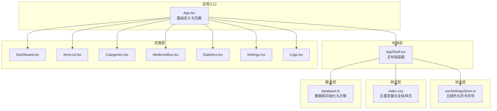
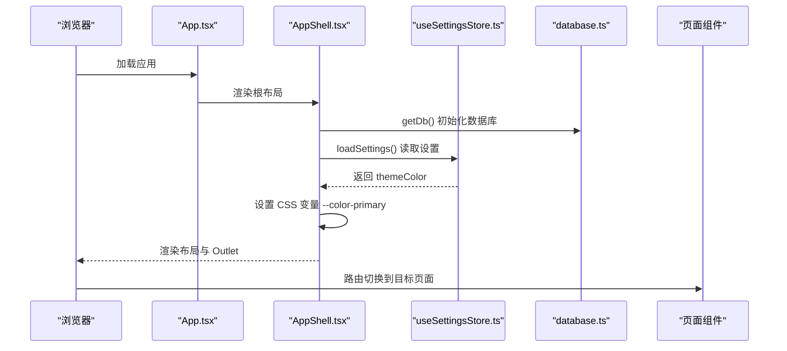
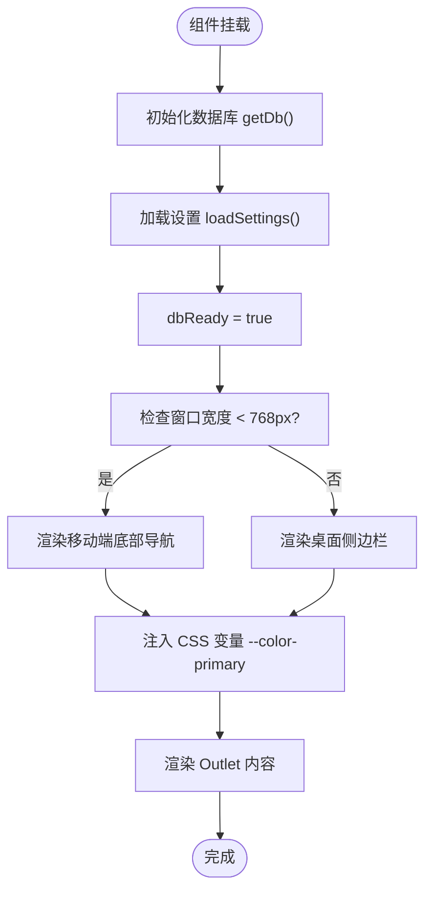
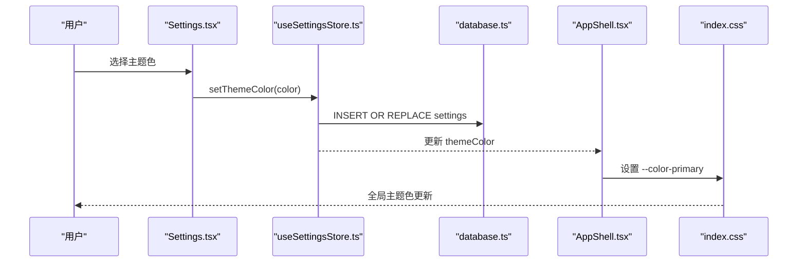
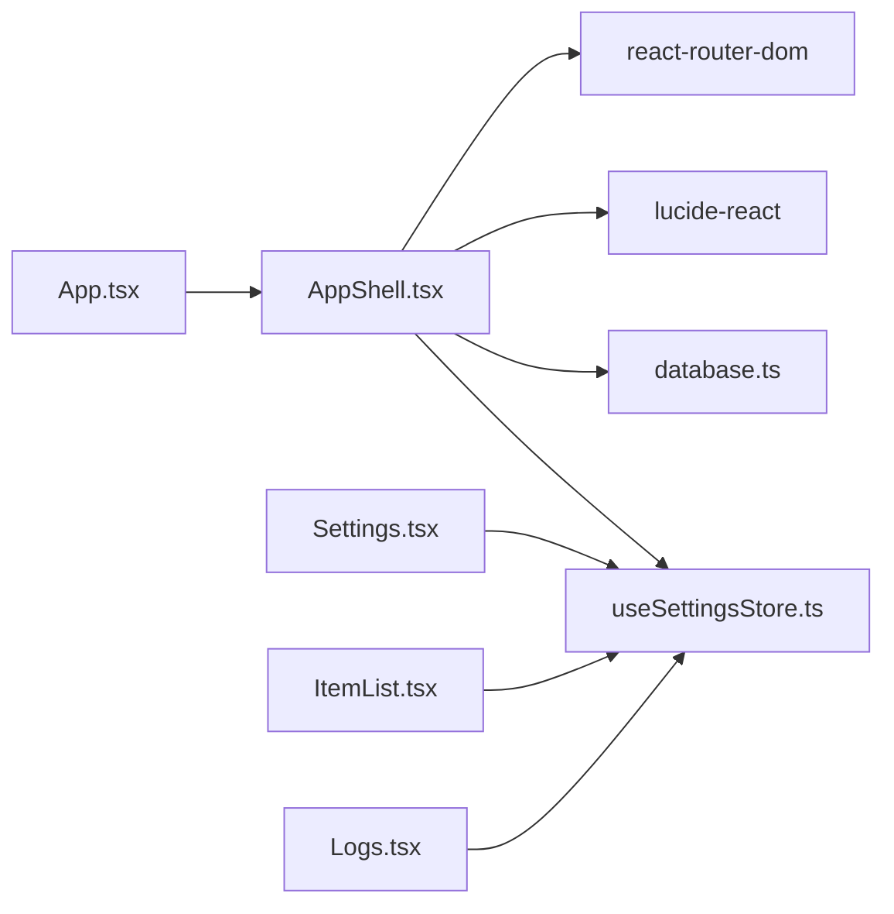

# 布局组件

<cite>
**本文引用的文件列表**
- [AppShell.tsx](file://src/components/layout/AppShell.tsx)
- [App.tsx](file://src/App.tsx)
- [index.css](file://src/index.css)
- [useSettingsStore.ts](file://src/stores/useSettingsStore.ts)
- [database.ts](file://src/services/database.ts)
- [constants.ts](file://src/utils/constants.ts)
- [Settings.tsx](file://src/routes/Settings.tsx)
- [ItemList.tsx](file://src/routes/ItemList.tsx)
- [Logs.tsx](file://src/routes/Logs.tsx)
- [package.json](file://package.json)
</cite>

## 目录
1. [简介](#简介)
2. [项目结构](#项目结构)
3. [核心组件](#核心组件)
4. [架构总览](#架构总览)
5. [详细组件分析](#详细组件分析)
6. [依赖关系分析](#依赖关系分析)
7. [性能考量](#性能考量)
8. [故障排查指南](#故障排查指南)
9. [结论](#结论)
10. [附录](#附录)

## 简介
本文件聚焦于 Assetly 的主布局组件 AppShell，系统性阐述其设计理念与实现细节，涵盖：
- 桌面端侧边栏导航与移动端底部导航的响应式设计
- 导航项配置、活动状态管理与主题色动态切换机制
- 组件的 props 接口、状态管理策略与事件处理模式
- 使用示例与定制化方案（扩展导航项、修改样式主题）
- 响应式断点设置、安全区域适配与性能优化策略

## 项目结构
AppShell 作为应用的根级布局容器，位于组件层的 layout 目录，配合路由系统与状态管理共同构成整体 UI 结构。关键文件与职责如下：
- AppShell.tsx：主布局组件，负责渲染桌面侧边栏、移动端底部导航、内容区 Outlet 以及主题色注入
- App.tsx：路由入口，定义所有页面路由并以 AppShell 包裹
- index.css：Tailwind 主题变量与全局样式，提供 --color-primary 等变量
- useSettingsStore.ts：Zustand 状态管理，负责主题色持久化与动态更新
- database.ts：数据库初始化与迁移，确保 AppShell 首次渲染前数据可用
- constants.ts：主题预设、货币符号等常量
- Settings.tsx：设置页，提供主题色与货币符号的交互入口
- Logs.tsx：日志页，与 AppShell 的“设置/日志”活动状态联动
- package.json：依赖清单，包含 react-router-dom、lucide-react、zustand、tailwindcss 等

图表来源
- [App.tsx:70-89](file://src/App.tsx#L70-L89)
- [AppShell.tsx:24-159](file://src/components/layout/AppShell.tsx#L24-L159)
- [useSettingsStore.ts:14-55](file://src/stores/useSettingsStore.ts#L14-L55)
- [database.ts:8-16](file://src/services/database.ts#L8-L16)
- [index.css:3-18](file://src/index.css#L3-L18)

章节来源
- [App.tsx:70-89](file://src/App.tsx#L70-L89)
- [AppShell.tsx:24-159](file://src/components/layout/AppShell.tsx#L24-L159)
- [index.css:3-18](file://src/index.css#L3-L18)

## 核心组件
- AppShell 主布局组件
  - 职责：根据设备宽度渲染桌面侧边栏或移动端底部导航；注入主题色 CSS 变量；等待数据库初始化后再显示内容
  - 关键特性：
    - 响应式断点：小于 768px 视为移动端，采用底部导航；大于等于 768px 采用侧边栏
    - 活动状态：首页与“设置/日志”共享高亮逻辑；移动端底部导航支持“设置/日志”联动
    - 主题色：通过 CSS 变量 --color-primary 动态注入，支持设置页即时生效
    - 安全区域：移动端内容区与底部导航使用 env(safe-area-inset-*) 适配刘海屏/底栏
    - 初始化：先初始化数据库与设置，再渲染内容，避免空白屏

章节来源
- [AppShell.tsx:10-22](file://src/components/layout/AppShell.tsx#L10-L22)
- [AppShell.tsx:24-159](file://src/components/layout/AppShell.tsx#L24-L159)
- [useSettingsStore.ts:14-55](file://src/stores/useSettingsStore.ts#L14-L55)
- [database.ts:8-16](file://src/services/database.ts#L8-L16)

## 架构总览
AppShell 的控制流与数据流如下：
- 路由层：App.tsx 定义路由树，以 AppShell 为根布局
- 布局层：AppShell 计算 isMobile、监听窗口 resize、注入主题色、等待数据库初始化
- 状态层：useSettingsStore 提供主题色与货币符号，并持久化到 SQLite
- 服务层：database.ts 负责数据库连接与迁移
- 页面层：各页面组件按路由挂载至 Outlet

图表来源
- [App.tsx:70-89](file://src/App.tsx#L70-L89)
- [AppShell.tsx:33-46](file://src/components/layout/AppShell.tsx#L33-L46)
- [useSettingsStore.ts:19-35](file://src/stores/useSettingsStore.ts#L19-L35)
- [database.ts:8-16](file://src/services/database.ts#L8-L16)

## 详细组件分析

### AppShell 主布局组件
- 设计理念
  - 单一职责：集中处理布局、导航与主题注入，不承担业务逻辑
  - 响应式优先：以断点驱动 UI 切换，保证桌面与移动端一致的导航体验
  - 主题解耦：通过 CSS 变量与 Zustand 状态管理分离主题色与持久化
- 实现要点
  - 导航项配置：navItems 与 sidebarSubItems 两组数组，分别用于侧边栏与子菜单
  - 活动状态管理：useLocation 获取当前路径；特殊处理“设置/日志”共享高亮
  - 响应式断点：窗口 resize 监听，阈值 768px；移动端底部导航采用悬浮胶囊式
  - 安全区域适配：main 区域与底部导航使用 env(safe-area-inset-*)，避免遮挡
  - 初始化流程：getDb + loadSettings 后标记 dbReady，再渲染布局
  - 主题色注入：useEffect 将 themeColor 写入 documentElement.style

图表来源
- [AppShell.tsx:33-46](file://src/components/layout/AppShell.tsx#L33-L46)
- [AppShell.tsx:33-38](file://src/components/layout/AppShell.tsx#L33-L38)
- [AppShell.tsx:48-50](file://src/components/layout/AppShell.tsx#L48-L50)
- [AppShell.tsx:63-159](file://src/components/layout/AppShell.tsx#L63-L159)

章节来源
- [AppShell.tsx:10-22](file://src/components/layout/AppShell.tsx#L10-L22)
- [AppShell.tsx:24-159](file://src/components/layout/AppShell.tsx#L24-L159)
- [useSettingsStore.ts:14-55](file://src/stores/useSettingsStore.ts#L14-L55)
- [database.ts:8-16](file://src/services/database.ts#L8-L16)

### 导航项配置与活动状态
- 导航项配置
  - 主导航：首页、物品、药箱、位置、设置
  - 子菜单：分类管理、位置管理、运行日志
- 活动状态
  - 首页 end={true} 精确匹配
  - “设置/日志”共享高亮：当 pathname 为 “/settings” 或 “/logs” 时，设置按钮高亮
  - 移动端底部导航：对“设置/日志”使用统一的 isSettingsActive 判断

章节来源
- [AppShell.tsx:10-22](file://src/components/layout/AppShell.tsx#L10-L22)
- [AppShell.tsx:31](file://src/components/layout/AppShell.tsx#L31)
- [AppShell.tsx:135-153](file://src/components/layout/AppShell.tsx#L135-L153)

### 主题色动态切换机制
- 设置入口：Settings 页面提供主题色预设与自定义色
- 状态管理：useSettingsStore 提供 setThemeColor，写入 SQLite 并更新内存状态
- 注入方式：AppShell 中监听 themeColor，将颜色写入 --color-primary
- 效果范围：index.css 中大量使用 var(--color-primary)，实现全局主题色一致

图表来源
- [Settings.tsx:152-179](file://src/routes/Settings.tsx#L152-L179)
- [useSettingsStore.ts:37-45](file://src/stores/useSettingsStore.ts#L37-L45)
- [AppShell.tsx:48-50](file://src/components/layout/AppShell.tsx#L48-L50)
- [index.css:3-18](file://src/index.css#L3-L18)

章节来源
- [Settings.tsx:152-179](file://src/routes/Settings.tsx#L152-L179)
- [useSettingsStore.ts:37-45](file://src/stores/useSettingsStore.ts#L37-L45)
- [AppShell.tsx:48-50](file://src/components/layout/AppShell.tsx#L48-L50)
- [index.css:3-18](file://src/index.css#L3-L18)

### 响应式断点与安全区域适配
- 断点：768px；小于该值为移动端，采用底部导航；否则为桌面侧边栏
- 安全区域：
  - main 区域：顶部使用 env(safe-area-inset-top,0px)，底部使用 env(safe-area-inset-bottom,0px)
  - 底部导航：固定定位，底部留白为 1.25rem + env(safe-area-inset-bottom,0px)，避免遮挡底部手势区域
- 滚动行为：移动端隐藏滚动条，桌面显示滚动条；全局 overscroll-behavior-y:none 防止回弹

章节来源
- [AppShell.tsx:33-38](file://src/components/layout/AppShell.tsx#L33-L38)
- [AppShell.tsx:118-126](file://src/components/layout/AppShell.tsx#L118-L126)
- [AppShell.tsx:129-156](file://src/components/layout/AppShell.tsx#L129-L156)
- [index.css:31-57](file://src/index.css#L31-L57)

### 组件 Props 接口与事件处理
- Props 接口
  - AppShell：无外部 props，内部通过 useLocation、useSettingsStore、useEffect 管理状态
- 事件处理
  - 窗口 resize：监听器在组件卸载时清理
  - 导航点击：使用 NavLink，内置激活态类名切换
  - 设置页主题色变更：通过 store 的 setThemeColor 触发全局主题更新

章节来源
- [AppShell.tsx:24-159](file://src/components/layout/AppShell.tsx#L24-L159)
- [useSettingsStore.ts:14-55](file://src/stores/useSettingsStore.ts#L14-L55)

### 使用示例与定制化方案
- 在 App.tsx 中扩展路由
  - 在 AppShell 外层路由中新增 Route，即可在 AppShell 的导航中自动出现对应入口
  - 示例参考：App.tsx 中已包含 Dashboard、ItemList、Categories、Locations、MedicineBox、Statistics、Settings、Logs 等路由
- 扩展导航项
  - 在 AppShell 的 navItems 或 sidebarSubItems 中添加新项，包含 to、icon、label 字段
  - 注意：移动端底部导航仅展示主导航项，子菜单建议保留在桌面侧边栏
- 修改主题色
  - 通过 Settings 页面选择预设或直接调用 setThemeColor
  - 主题色会持久化到 settings 表，重启后仍保持
- 自定义样式主题
  - 可在 index.css 中调整 --color-* 变量，或通过 store 动态注入新的 CSS 变量

章节来源
- [App.tsx:70-89](file://src/App.tsx#L70-L89)
- [AppShell.tsx:10-22](file://src/components/layout/AppShell.tsx#L10-L22)
- [Settings.tsx:152-179](file://src/routes/Settings.tsx#L152-L179)
- [useSettingsStore.ts:37-45](file://src/stores/useSettingsStore.ts#L37-L45)
- [index.css:3-18](file://src/index.css#L3-L18)

## 依赖关系分析
- 组件间依赖
  - AppShell 依赖 useSettingsStore（主题色）、database（数据库初始化）、lucide-react（图标）、react-router-dom（NavLink）
  - App 依赖 AppShell 与各页面组件
- 外部依赖
  - @tauri-apps/plugin-sql：SQLite 数据库访问
  - lucide-react：图标库
  - zustand：轻量状态管理
  - tailwindcss：原子化样式框架

图表来源
- [AppShell.tsx:1-8](file://src/components/layout/AppShell.tsx#L1-L8)
- [App.tsx:1-16](file://src/App.tsx#L1-L16)
- [Settings.tsx:1-8](file://src/routes/Settings.tsx#L1-L8)
- [ItemList.tsx:1-10](file://src/routes/ItemList.tsx#L1-L10)
- [Logs.tsx:1-4](file://src/routes/Logs.tsx#L1-L4)

章节来源
- [package.json:12-31](file://package.json#L12-L31)
- [AppShell.tsx:1-8](file://src/components/layout/AppShell.tsx#L1-L8)
- [App.tsx:1-16](file://src/App.tsx#L1-L16)

## 性能考量
- 渲染优化
  - AppShell 仅在 dbReady 为 true 时渲染完整布局，避免首次空白屏
  - 侧边栏与底部导航均使用固定宽高与最小重排策略，减少布局抖动
- 事件监听
  - resize 监听在组件卸载时清理，避免内存泄漏
- 状态更新
  - 主题色变更仅触发一次 CSS 变量更新，影响范围可控
- 滚动与触摸
  - 移动端隐藏滚动条，降低绘制开销；全局禁用横向滑动以提升导航稳定性

章节来源
- [AppShell.tsx:52-61](file://src/components/layout/AppShell.tsx#L52-L61)
- [AppShell.tsx:33-38](file://src/components/layout/AppShell.tsx#L33-L38)
- [App.tsx:29-68](file://src/App.tsx#L29-L68)
- [index.css:31-57](file://src/index.css#L31-L57)

## 故障排查指南
- 首次进入页面空白
  - 检查 database 初始化是否完成（getDb 是否返回实例）与 loadSettings 是否成功
  - 确认 dbReady 已置为 true
- 主题色不生效
  - 确认 useSettingsStore 的 themeColor 已更新且 AppShell 的 useEffect 已执行
  - 检查 index.css 中 --color-primary 是否被覆盖
- 移动端底部导航遮挡内容
  - 检查 main 区域是否正确使用 env(safe-area-inset-top/bottom)
  - 确认底部导航的固定定位与内边距计算
- 导航高亮异常
  - 检查“设置/日志”共享高亮逻辑是否被覆盖
  - 确认 NavLink 的 end 属性与路径匹配规则

章节来源
- [AppShell.tsx:40-50](file://src/components/layout/AppShell.tsx#L40-L50)
- [useSettingsStore.ts:19-35](file://src/stores/useSettingsStore.ts#L19-L35)
- [index.css:3-18](file://src/index.css#L3-L18)
- [AppShell.tsx:118-126](file://src/components/layout/AppShell.tsx#L118-L126)
- [AppShell.tsx:129-156](file://src/components/layout/AppShell.tsx#L129-L156)

## 结论
AppShell 通过简洁的职责划分与清晰的响应式策略，实现了跨平台的一致导航体验。结合 Zustand 的轻量状态管理与 SQLite 的本地持久化，主题色与设置得以即时生效且稳定持久。通过合理的断点与安全区域适配，移动端与桌面端均获得良好的可访问性与视觉一致性。建议在扩展导航项与主题色时遵循现有模式，确保全局样式与状态的一致性。

## 附录
- 常用常量与预设
  - 主题预设：见 constants.ts 中 THEME_PRESETS
  - 货币符号：见 constants.ts 中 CURRENCY_OPTIONS
- 数据库设置表
  - theme_color：主题色
  - currency_symbol：货币符号
- 页面路由参考
  - Dashboard、ItemList、Categories、Locations、MedicineBox、Statistics、Settings、Logs

章节来源
- [constants.ts:29-40](file://src/utils/constants.ts#L29-L40)
- [database.ts:118-140](file://src/services/database.ts#L118-L140)
- [App.tsx:70-89](file://src/App.tsx#L70-L89)