# 用户界面组件

<cite>
**本文引用的文件**
- [src/components/layout/AppShell.tsx](file://src/components/layout/AppShell.tsx)
- [src/components/shared/SearchBar.tsx](file://src/components/shared/SearchBar.tsx)
- [src/components/shared/DatePicker.tsx](file://src/components/shared/DatePicker.tsx)
- [src/components/shared/TimePicker.tsx](file://src/components/shared/TimePicker.tsx)
- [src/components/shared/CustomSelect.tsx](file://src/components/shared/CustomSelect.tsx)
- [src/components/items/ItemCard.tsx](file://src/components/items/ItemCard.tsx)
- [src/components/medicine/MedicineCard.tsx](file://src/components/medicine/MedicineCard.tsx)
- [src/components/medicine/ExpiryBadge.tsx](file://src/components/medicine/ExpiryBadge.tsx)
- [src/stores/useSettingsStore.ts](file://src/stores/useSettingsStore.ts)
- [src/index.css](file://src/index.css)
- [src/utils/constants.ts](file://src/utils/constants.ts)
- [src/utils/dateHelper.ts](file://src/utils/dateHelper.ts)
- [src/utils/currencyHelper.ts](file://src/utils/currencyHelper.ts)
- [src/types/item.ts](file://src/types/item.ts)
- [src/types/medicine.ts](file://src/types/medicine.ts)
</cite>

## 目录
1. [简介](#简介)
2. [项目结构](#项目结构)
3. [核心组件](#核心组件)
4. [架构总览](#架构总览)
5. [详细组件分析](#详细组件分析)
6. [依赖关系分析](#依赖关系分析)
7. [性能考量](#性能考量)
8. [故障排查指南](#故障排查指南)
9. [结论](#结论)
10. [附录](#附录)

## 简介
本文件面向 Assetly 的用户界面组件库，系统性阐述组件库的设计理念与设计系统（颜色体系、字体规范、圆角与边框、间距与排版），并逐项解析布局组件 AppShell 与通用组件（SearchBar、DatePicker、TimePicker、CustomSelect）及业务组件（ItemCard、MedicineCard、ExpiryBadge）。文档同时覆盖各组件的 props 接口、事件处理、状态管理与样式定制选项，并给出使用示例与最佳实践、组件组合模式与复用策略，以及响应式设计与移动端适配方案。

## 项目结构
组件库采用按功能域分层的组织方式：布局组件位于 layout，共享组件位于 shared，业务组件分别位于 items 与 medicine 子目录；全局样式通过 Tailwind 主题变量统一管理；状态通过 Zustand store 管理；工具函数与类型定义位于 utils 与 types 目录。

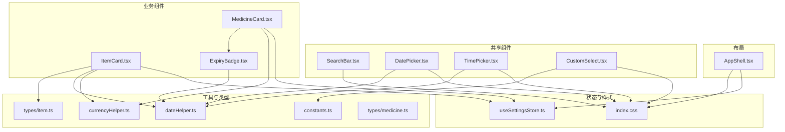

图表来源
- [src/components/layout/AppShell.tsx:1-160](file://src/components/layout/AppShell.tsx#L1-L160)
- [src/components/shared/SearchBar.tsx:1-31](file://src/components/shared/SearchBar.tsx#L1-L31)
- [src/components/shared/DatePicker.tsx:1-278](file://src/components/shared/DatePicker.tsx#L1-L278)
- [src/components/shared/TimePicker.tsx:1-221](file://src/components/shared/TimePicker.tsx#L1-L221)
- [src/components/shared/CustomSelect.tsx:1-109](file://src/components/shared/CustomSelect.tsx#L1-L109)
- [src/components/items/ItemCard.tsx:1-94](file://src/components/items/ItemCard.tsx#L1-L94)
- [src/components/medicine/MedicineCard.tsx:1-147](file://src/components/medicine/MedicineCard.tsx#L1-L147)
- [src/components/medicine/ExpiryBadge.tsx:1-24](file://src/components/medicine/ExpiryBadge.tsx#L1-L24)
- [src/stores/useSettingsStore.ts:1-56](file://src/stores/useSettingsStore.ts#L1-L56)
- [src/index.css:1-84](file://src/index.css#L1-L84)
- [src/utils/constants.ts:1-40](file://src/utils/constants.ts#L1-L40)
- [src/utils/dateHelper.ts:1-52](file://src/utils/dateHelper.ts#L1-L52)
- [src/utils/currencyHelper.ts:1-17](file://src/utils/currencyHelper.ts#L1-L17)
- [src/types/item.ts:1-46](file://src/types/item.ts#L1-L46)
- [src/types/medicine.ts:1-70](file://src/types/medicine.ts#L1-L70)

章节来源
- [src/components/layout/AppShell.tsx:1-160](file://src/components/layout/AppShell.tsx#L1-L160)
- [src/index.css:1-84](file://src/index.css#L1-L84)

## 核心组件
- 设计系统与主题
  - 颜色体系：以主色变量为核心，提供主色、浅/深主色、危险、警告、信息、表面、背景、边框、文字辅助色等变量，支持动态切换主题色并通过 CSS 自定义属性注入。
  - 字体与字号：默认无衬线字体族，代码/数字使用等宽字体变量，确保一致性与可读性。
  - 圆角与边框：卡片圆角、按钮圆角、输入框圆角由主题变量统一控制，保证视觉一致。
  - 间距与排版：组件内部普遍采用紧凑的内边距与网格布局，配合 Tailwind 实现响应式与可定制。
- 布局组件
  - AppShell：提供桌面端侧边栏与移动端底部导航胶囊，支持响应式检测、数据库初始化、主题色注入、路由高亮与安全区域适配。
- 通用组件
  - SearchBar：带清空按钮的搜索输入框，支持受控值与占位符。
  - DatePicker：内嵌弹窗日历，支持年/月/日三级视图、快速选择“今天”与“清除”，点击外部关闭。
  - TimePicker：底部弹出滚轮选择器，支持小时/分钟吸附滚动、确认后回调。
  - CustomSelect：底部弹出选择面板，支持选项高亮与回退动画，使用 Portal 渲染。
- 业务组件
  - ItemCard：物品卡片，展示图标、状态徽标、价格与使用天数、日均成本等。
  - MedicineCard：药品卡片，展示类型标签、是否在服、频次/时间段/时长、位置路径、单价与库存快捷调整。
  - ExpiryBadge：基于过期天数的状态徽章，提供安全/预警/过期三态。

章节来源
- [src/index.css:3-18](file://src/index.css#L3-L18)
- [src/stores/useSettingsStore.ts:14-55](file://src/stores/useSettingsStore.ts#L14-L55)
- [src/components/layout/AppShell.tsx:24-158](file://src/components/layout/AppShell.tsx#L24-L158)
- [src/components/shared/SearchBar.tsx:3-30](file://src/components/shared/SearchBar.tsx#L3-L30)
- [src/components/shared/DatePicker.tsx:5-277](file://src/components/shared/DatePicker.tsx#L5-L277)
- [src/components/shared/TimePicker.tsx:4-220](file://src/components/shared/TimePicker.tsx#L4-L220)
- [src/components/shared/CustomSelect.tsx:10-108](file://src/components/shared/CustomSelect.tsx#L10-L108)
- [src/components/items/ItemCard.tsx:7-93](file://src/components/items/ItemCard.tsx#L7-L93)
- [src/components/medicine/MedicineCard.tsx:8-146](file://src/components/medicine/MedicineCard.tsx#L8-L146)
- [src/components/medicine/ExpiryBadge.tsx:3-23](file://src/components/medicine/ExpiryBadge.tsx#L3-L23)

## 架构总览
组件库遵循“共享组件 + 业务组件 + 布局容器”的分层架构，状态通过 Zustand store 统一管理，样式通过 CSS 变量与 Tailwind 类名组合实现主题化与响应式。

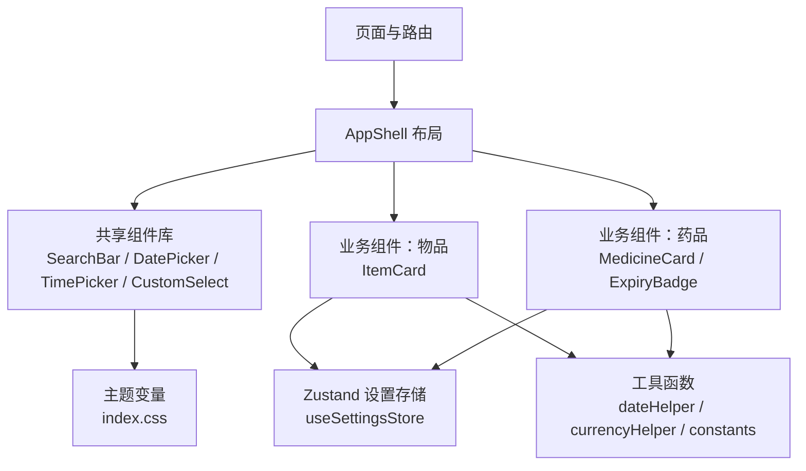

图表来源
- [src/components/layout/AppShell.tsx:24-158](file://src/components/layout/AppShell.tsx#L24-L158)
- [src/stores/useSettingsStore.ts:14-55](file://src/stores/useSettingsStore.ts#L14-L55)
- [src/index.css:3-18](file://src/index.css#L3-L18)
- [src/utils/dateHelper.ts:1-52](file://src/utils/dateHelper.ts#L1-L52)
- [src/utils/currencyHelper.ts:1-17](file://src/utils/currencyHelper.ts#L1-L17)
- [src/utils/constants.ts:1-40](file://src/utils/constants.ts#L1-L40)

## 详细组件分析

### AppShell 布局组件
- 功能要点
  - 导航项与子菜单项配置，支持当前路由高亮与“日志”页激活“设置”项的特殊逻辑。
  - 桌面端固定侧边栏与移动端底部胶囊导航，响应式宽度阈值与安全区域适配。
  - 初始化数据库与加载设置，动态注入主题色 CSS 变量。
  - 加载态骨架屏，避免未就绪时渲染。
- Props 与行为
  - 无显式 props，通过路由与 store 状态驱动 UI。
  - 使用 useLocation 判断当前路由，useEffect 监听窗口尺寸变化，useSettingsStore 获取主题色。
- 最佳实践
  - 将 AppShell 作为根布局容器，所有页面在 Outlet 中渲染。
  - 在路由变更时保持导航高亮一致，必要时扩展 isSettingsActive 的判断范围。
- 响应式与移动端
  - 移动端底部导航使用固定定位与安全区变量，避免刘海与底部安全区遮挡。
  - 侧边栏仅在非移动端显示，内容区根据安全区调整内边距。

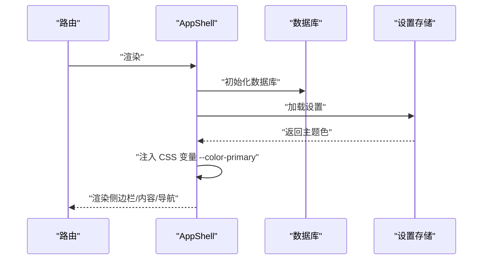

图表来源
- [src/components/layout/AppShell.tsx:24-158](file://src/components/layout/AppShell.tsx#L24-L158)
- [src/stores/useSettingsStore.ts:19-44](file://src/stores/useSettingsStore.ts#L19-L44)

章节来源
- [src/components/layout/AppShell.tsx:10-158](file://src/components/layout/AppShell.tsx#L10-L158)
- [src/stores/useSettingsStore.ts:14-55](file://src/stores/useSettingsStore.ts#L14-L55)

### SearchBar 搜索组件
- Props 接口
  - value: string（受控）
  - onChange: (value: string) => void（受控变更）
  - placeholder?: string（默认“搜索...”）
- 行为与交互
  - 输入框聚焦时显示下划线与主色环。
  - 当存在输入值时显示清空按钮，点击置空并回调。
- 样式与定制
  - 基于主题变量的边框、背景、主色环与悬停过渡。
- 使用示例
  - 在列表页或筛选场景中作为顶部搜索入口，结合业务 store 或本地状态使用。

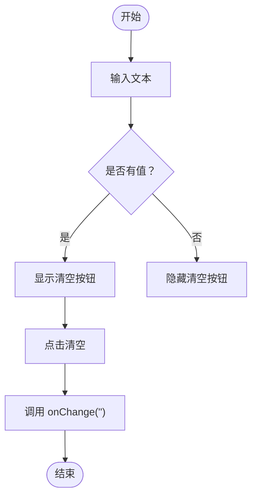

图表来源
- [src/components/shared/SearchBar.tsx:9-30](file://src/components/shared/SearchBar.tsx#L9-L30)

章节来源
- [src/components/shared/SearchBar.tsx:3-30](file://src/components/shared/SearchBar.tsx#L3-L30)

### DatePicker 日期选择器
- Props 接口
  - value: string（YYYY-MM-DD）
  - onChange: (value: string) => void
  - placeholder?: string
  - required?: boolean（必填星号提示）
- 视图与交互
  - 三级视图：日 -> 月 -> 年，点击头部在月/年视图间切换。
  - 支持上一/下一周期跳转，点击外部关闭。
  - 快速操作：“今天”填充、“清除”清空。
- 状态与数据流
  - 内部维护 open、viewDate、mode 与受控 value。
  - 使用 dayjs 进行日期计算与格式化。
- 最佳实践
  - 与表单校验结合，必填时显示星号。
  - 与 TimePicker 组合用于“日期+时间”场景。

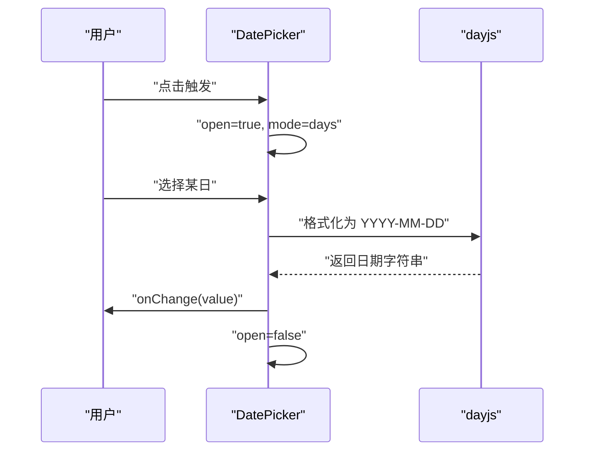

图表来源
- [src/components/shared/DatePicker.tsx:17-277](file://src/components/shared/DatePicker.tsx#L17-L277)
- [src/utils/dateHelper.ts:4-28](file://src/utils/dateHelper.ts#L4-L28)

章节来源
- [src/components/shared/DatePicker.tsx:5-277](file://src/components/shared/DatePicker.tsx#L5-L277)
- [src/utils/dateHelper.ts:1-52](file://src/utils/dateHelper.ts#L1-L52)

### TimePicker 时间选择器
- Props 接口
  - value: string（HH:mm）
  - onChange: (value: string) => void
  - placeholder?: string
- 视图与交互
  - 底部弹出滚轮选择器，左右两列分别滚动小时与分钟。
  - 滚动停止后吸附到最近项，确认后回调。
  - 支持点击外部关闭。
- 性能与体验
  - 使用滚动节流与吸附对齐，避免滚动抖动。
- 最佳实践
  - 与 DatePicker 组合形成“日期+时间”选择器。
  - 在提醒设置与记录场景中使用。

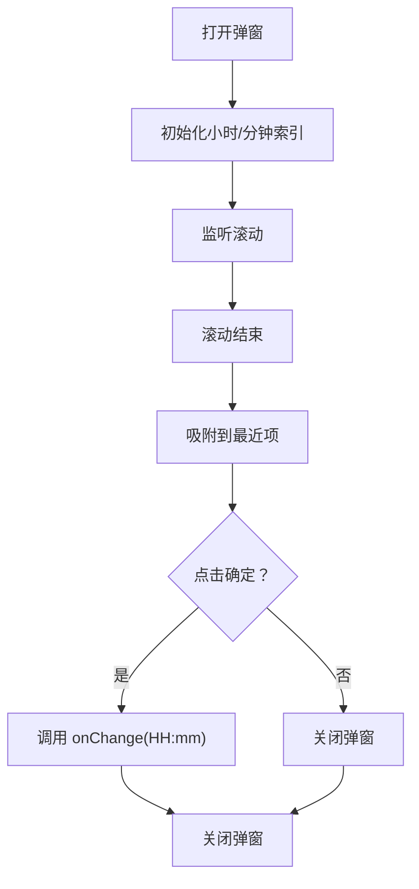

图表来源
- [src/components/shared/TimePicker.tsx:15-220](file://src/components/shared/TimePicker.tsx#L15-L220)

章节来源
- [src/components/shared/TimePicker.tsx:4-220](file://src/components/shared/TimePicker.tsx#L4-L220)

### CustomSelect 自定义选择器
- Props 接口
  - value: string（当前选中值）
  - onChange: (value: string) => void
  - options: { value: string; label: string }[]（选项列表）
  - placeholder?: string（默认“请选择”）
- 视图与交互
  - 触发器点击展开底部弹出面板，点击遮罩或选项完成选择。
  - 打开时锁定 body 滚动，使用 Portal 渲染到 document.body。
  - 选中项高亮并显示勾选图标。
- 最佳实践
  - 与表单联动，结合必填校验与错误提示。
  - 选项过多时注意性能，必要时引入虚拟滚动。

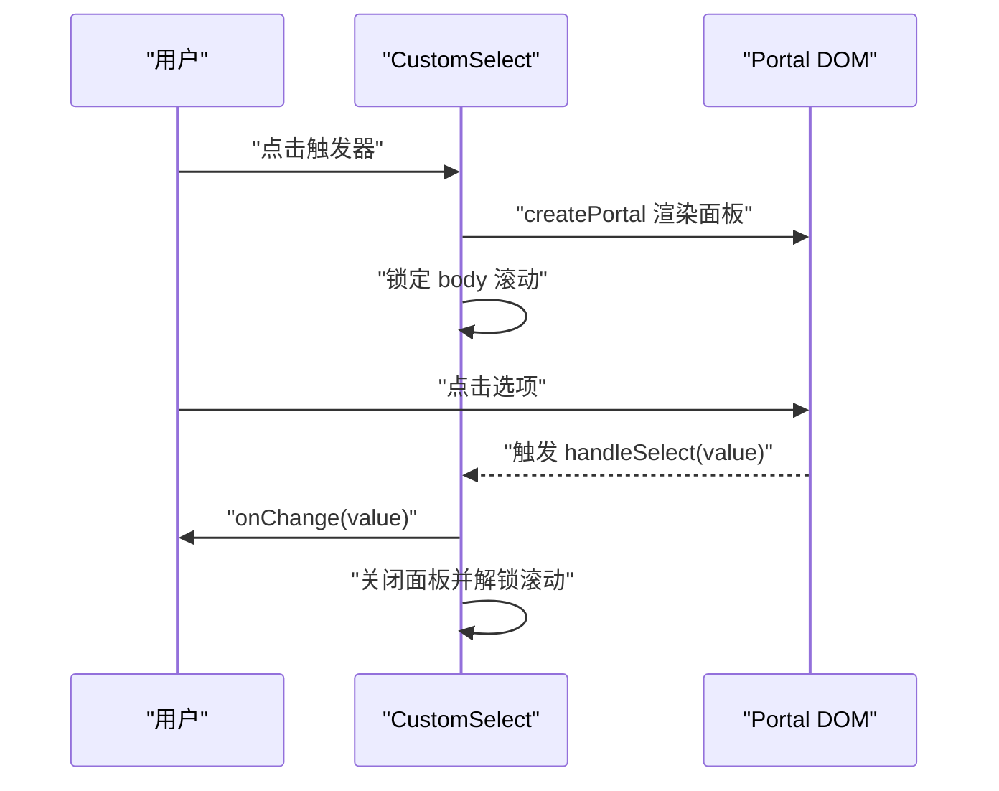

图表来源
- [src/components/shared/CustomSelect.tsx:17-108](file://src/components/shared/CustomSelect.tsx#L17-L108)

章节来源
- [src/components/shared/CustomSelect.tsx:10-108](file://src/components/shared/CustomSelect.tsx#L10-L108)

### ItemCard 物品卡片
- Props 接口
  - item: ItemWithDetails（包含物品详情）
  - onClick: () => void（点击卡片回调）
- 展示逻辑
  - 图标优先级：item.icon > 分类映射 > 默认包裹盒。
  - 状态徽标：根据状态映射中文标签。
  - 价格与使用天数：按购买总价与天数计算日均成本。
  - 日均成本条：当有效时展示。
- 依赖与工具
  - 使用设置存储中的货币符号，使用日期与货币工具函数。
- 最佳实践
  - 在物品列表页作为主要展示卡片，点击进入详情页。
  - 与分页/排序/筛选组合使用。

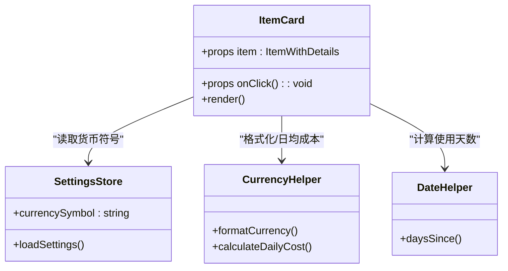

图表来源
- [src/components/items/ItemCard.tsx:27-93](file://src/components/items/ItemCard.tsx#L27-L93)
- [src/stores/useSettingsStore.ts:14-55](file://src/stores/useSettingsStore.ts#L14-L55)
- [src/utils/currencyHelper.ts:1-17](file://src/utils/currencyHelper.ts#L1-L17)
- [src/utils/dateHelper.ts:26-28](file://src/utils/dateHelper.ts#L26-L28)

章节来源
- [src/components/items/ItemCard.tsx:7-93](file://src/components/items/ItemCard.tsx#L7-L93)
- [src/types/item.ts:24-29](file://src/types/item.ts#L24-L29)

### MedicineCard 药品卡片
- Props 接口
  - medicine: MedicineWithItem
  - onClick: () => void
  - onUpdateQuantity?: (itemId: string, delta: number) => void（库存增减回调）
- 展示逻辑
  - 类型标签与“正在服用”徽标。
  - 频次/每周/每日/每N日、时间段、时长显示。
  - 位置路径与单价展示。
  - 快捷增减库存按钮，阻止事件冒泡。
- 依赖与工具
  - 使用设置存储货币符号、常量映射、日期工具与 ExpiryBadge。
- 最佳实践
  - 在药箱列表页作为主要展示卡片，点击进入编辑或详情。
  - 与提醒服务联动，展示提醒状态徽章。

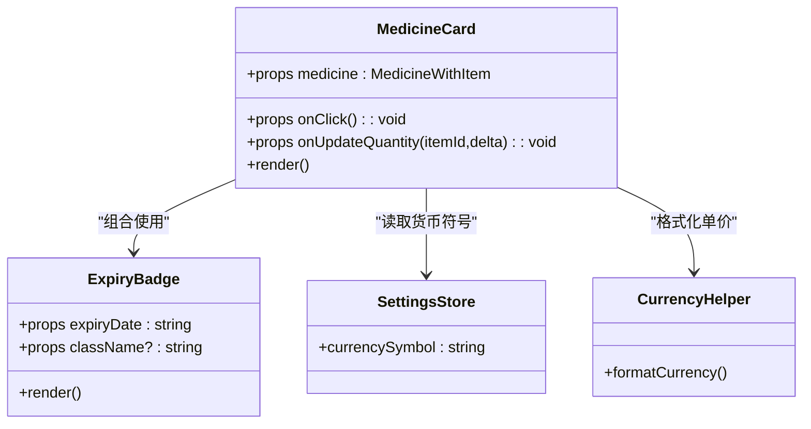

图表来源
- [src/components/medicine/MedicineCard.tsx:14-146](file://src/components/medicine/MedicineCard.tsx#L14-L146)
- [src/components/medicine/ExpiryBadge.tsx:8-23](file://src/components/medicine/ExpiryBadge.tsx#L8-L23)
- [src/stores/useSettingsStore.ts:14-55](file://src/stores/useSettingsStore.ts#L14-L55)
- [src/utils/currencyHelper.ts:1-17](file://src/utils/currencyHelper.ts#L1-L17)

章节来源
- [src/components/medicine/MedicineCard.tsx:8-146](file://src/components/medicine/MedicineCard.tsx#L8-L146)
- [src/types/medicine.ts:29-41](file://src/types/medicine.ts#L29-L41)

### ExpiryBadge 过期徽章
- Props 接口
  - expiryDate: string（YYYY-MM-DD）
  - className?: string（额外类名）
- 展示逻辑
  - 基于剩余天数判定安全/预警/过期三态，生成中文标签。
  - 不同状态使用不同背景与文字色。
- 最佳实践
  - 在药品卡片、统计报表等场景中统一展示过期状态。

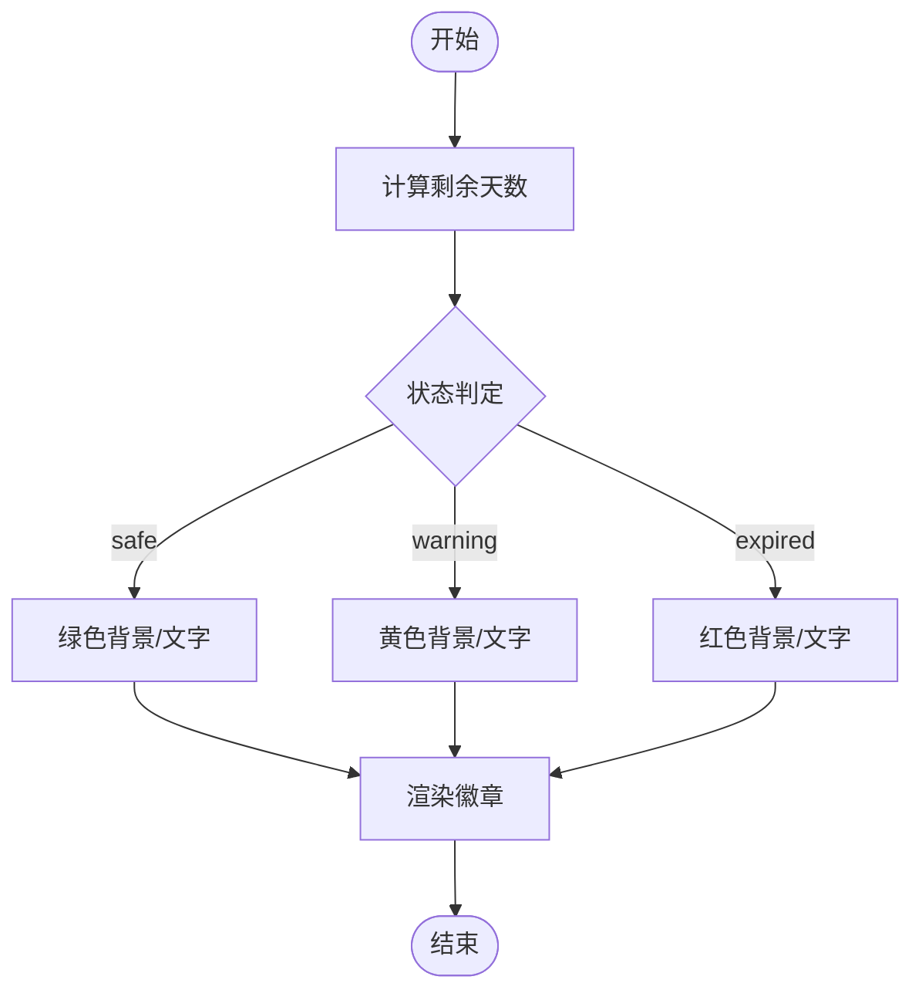

图表来源
- [src/components/medicine/ExpiryBadge.tsx:8-23](file://src/components/medicine/ExpiryBadge.tsx#L8-L23)
- [src/utils/dateHelper.ts:30-43](file://src/utils/dateHelper.ts#L30-L43)

章节来源
- [src/components/medicine/ExpiryBadge.tsx:3-23](file://src/components/medicine/ExpiryBadge.tsx#L3-L23)
- [src/utils/dateHelper.ts:30-43](file://src/utils/dateHelper.ts#L30-L43)

## 依赖关系分析
- 组件耦合
  - AppShell 与设置存储强耦合，负责主题色注入与初始化流程。
  - 业务组件依赖工具函数与 store，保持低耦合与高内聚。
- 外部依赖
  - dayjs 用于日期计算与格式化。
  - Zustand 用于轻量状态管理。
  - Lucide 图标库提供统一图标集。
- 潜在循环依赖
  - 组件间通过 props 传递数据，未见直接循环导入。

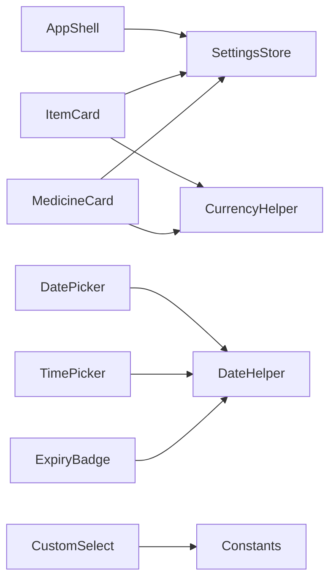

图表来源
- [src/components/layout/AppShell.tsx:27-49](file://src/components/layout/AppShell.tsx#L27-L49)
- [src/stores/useSettingsStore.ts:14-55](file://src/stores/useSettingsStore.ts#L14-L55)
- [src/utils/dateHelper.ts:1-52](file://src/utils/dateHelper.ts#L1-L52)
- [src/utils/currencyHelper.ts:1-17](file://src/utils/currencyHelper.ts#L1-L17)
- [src/utils/constants.ts:1-40](file://src/utils/constants.ts#L1-L40)

章节来源
- [src/components/layout/AppShell.tsx:24-50](file://src/components/layout/AppShell.tsx#L24-L50)
- [src/stores/useSettingsStore.ts:14-55](file://src/stores/useSettingsStore.ts#L14-L55)

## 性能考量
- 滚动吸附与节流
  - TimePicker 在滚动结束时才更新选中项，减少频繁重绘。
- 弹窗渲染策略
  - DatePicker/TimePicker/CustomSelect 使用固定定位与 Portal，避免层级与溢出问题。
- 日期计算
  - 使用 dayjs 进行日期计算，避免重复格式化与本地化开销。
- 样式与主题
  - 通过 CSS 变量集中管理主题色，减少样式切换成本。
- 移动端优化
  - 隐藏滚动条、启用触摸滚动优化、底部导航胶囊阴影与模糊背景提升可读性与性能。

## 故障排查指南
- 主题色不生效
  - 确认设置存储已加载并写入 CSS 变量；检查 AppShell 是否在 mount 后执行注入。
- 日期/时间选择异常
  - 检查传入 value 格式是否为 YYYY-MM-DD 或 HH:mm；确认 onChange 回调链路。
- 选择器无法关闭
  - 确认点击遮罩与外部点击事件绑定；检查 Portal 渲染目标。
- 药品卡片库存增减无效
  - 确认 onUpdateQuantity 回调已传入且事件未被父元素阻止冒泡。
- 移动端滚动穿透
  - 确认打开选择器时已锁定 body 滚动并在关闭时释放。

章节来源
- [src/stores/useSettingsStore.ts:19-44](file://src/stores/useSettingsStore.ts#L19-L44)
- [src/components/shared/DatePicker.tsx:34-45](file://src/components/shared/DatePicker.tsx#L34-L45)
- [src/components/shared/TimePicker.tsx:38-47](file://src/components/shared/TimePicker.tsx#L38-L47)
- [src/components/shared/CustomSelect.tsx:22-29](file://src/components/shared/CustomSelect.tsx#L22-L29)
- [src/components/medicine/MedicineCard.tsx:17-20](file://src/components/medicine/MedicineCard.tsx#L17-L20)

## 结论
Assetly 的组件库以清晰的分层与统一的设计系统为基础，通过共享组件与业务组件的组合实现高效开发与一致体验。借助主题变量、工具函数与状态存储，组件具备良好的可定制性与可维护性。建议在实际使用中遵循本文档的接口约定、交互模式与最佳实践，以获得更稳定与可扩展的用户体验。

## 附录
- 设计系统参数
  - 颜色变量：主色、浅/深主色、危险、警告、信息、表面、背景、边框、文字辅助色。
  - 字体变量：默认无衬线字体与等宽字体。
  - 圆角变量：卡片、按钮、输入框。
- 常用类型
  - Item 与 Medicine 的字段集合与别名类型，便于表单与查询使用。
- 常用工具
  - 日期格式化、相对天数计算、过期状态判定、货币格式化与日均成本计算。

章节来源
- [src/index.css:3-18](file://src/index.css#L3-L18)
- [src/utils/constants.ts:15-40](file://src/utils/constants.ts#L15-L40)
- [src/types/item.ts:1-46](file://src/types/item.ts#L1-L46)
- [src/types/medicine.ts:1-70](file://src/types/medicine.ts#L1-L70)
- [src/utils/dateHelper.ts:1-52](file://src/utils/dateHelper.ts#L1-L52)
- [src/utils/currencyHelper.ts:1-17](file://src/utils/currencyHelper.ts#L1-L17)