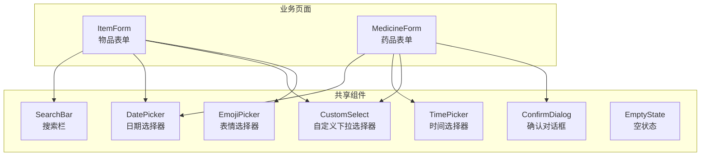
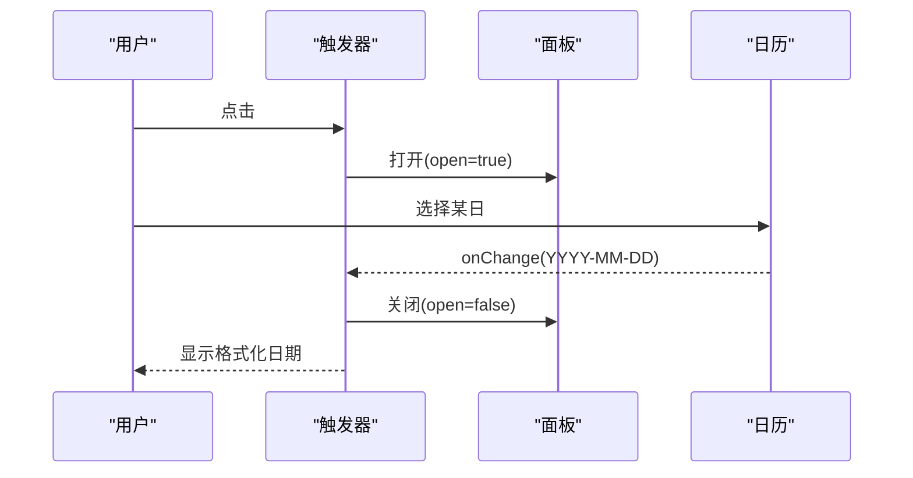
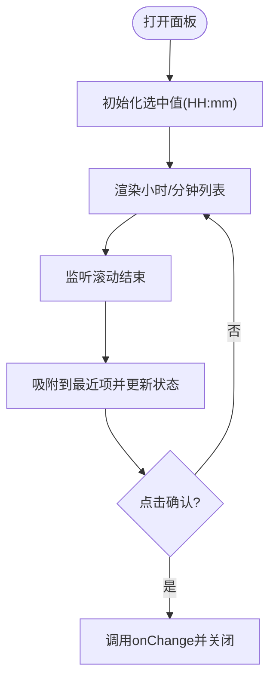
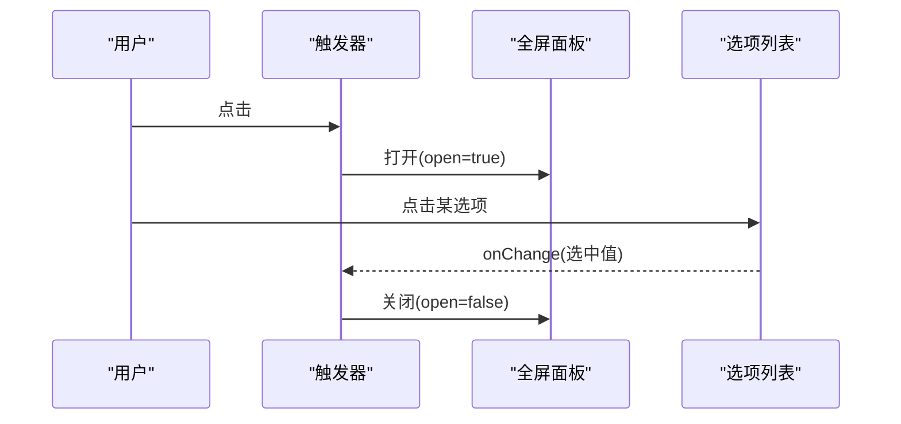
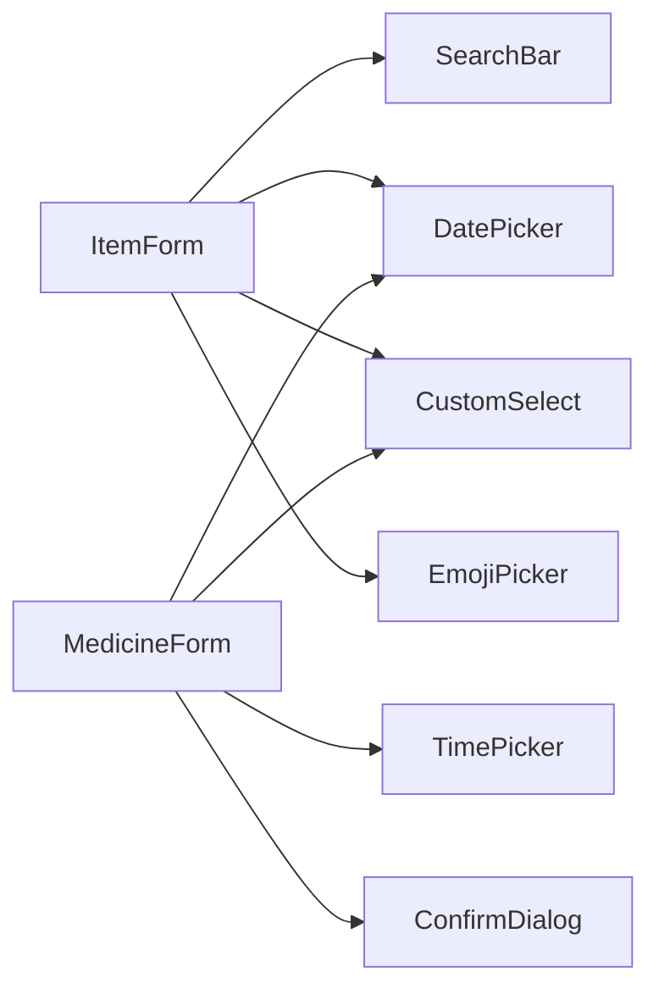

# 通用组件

<cite>
**本文引用的文件**
- [SearchBar.tsx](file://src/components/shared/SearchBar.tsx)
- [DatePicker.tsx](file://src/components/shared/DatePicker.tsx)
- [TimePicker.tsx](file://src/components/shared/TimePicker.tsx)
- [CustomSelect.tsx](file://src/components/shared/CustomSelect.tsx)
- [EmojiPicker.tsx](file://src/components/shared/EmojiPicker.tsx)
- [ConfirmDialog.tsx](file://src/components/shared/ConfirmDialog.tsx)
- [EmptyState.tsx](file://src/components/shared/EmptyState.tsx)
- [ItemForm.tsx](file://src/routes/ItemForm.tsx)
- [MedicineForm.tsx](file://src/routes/MedicineForm.tsx)
- [index.css](file://src/index.css)
- [dateHelper.ts](file://src/utils/dateHelper.ts)
- [utils.ts](file://src/lib/utils.ts)
</cite>

## 目录
1. [简介](#简介)
2. [项目结构](#项目结构)
3. [核心组件](#核心组件)
4. [架构总览](#架构总览)
5. [组件详解](#组件详解)
6. [依赖关系分析](#依赖关系分析)
7. [性能与体验优化](#性能与体验优化)
8. [故障排查指南](#故障排查指南)
9. [结论](#结论)
10. [附录：使用示例与最佳实践](#附录使用示例与最佳实践)

## 简介
本文件系统化梳理 Assetly 中的通用 UI 组件库，覆盖搜索栏、日期选择器、时间选择器、自定义下拉选择器、表情选择器、确认对话框、空状态等组件。内容包括：
- 组件 Props 接口与事件回调
- 内部状态管理与交互流程
- 样式与主题定制方式
- 在实际业务页面中的使用范式
- 无障碍、响应式与性能优化建议

## 项目结构
通用组件集中于 src/components/shared 目录，围绕表单输入、选择与提示等高频交互场景构建，配合路由页面（如 ItemForm、MedicineForm）进行组合使用。

图表来源
- [SearchBar.tsx:1-31](file://src/components/shared/SearchBar.tsx#L1-L31)
- [DatePicker.tsx:1-278](file://src/components/shared/DatePicker.tsx#L1-L278)
- [TimePicker.tsx:1-221](file://src/components/shared/TimePicker.tsx#L1-L221)
- [CustomSelect.tsx:1-109](file://src/components/shared/CustomSelect.tsx#L1-L109)
- [EmojiPicker.tsx:1-44](file://src/components/shared/EmojiPicker.tsx#L1-L44)
- [ConfirmDialog.tsx:1-52](file://src/components/shared/ConfirmDialog.tsx#L1-L52)
- [EmptyState.tsx:1-22](file://src/components/shared/EmptyState.tsx#L1-L22)
- [ItemForm.tsx:1-263](file://src/routes/ItemForm.tsx#L1-L263)
- [MedicineForm.tsx:1-401](file://src/routes/MedicineForm.tsx#L1-L401)

章节来源
- [SearchBar.tsx:1-31](file://src/components/shared/SearchBar.tsx#L1-L31)
- [DatePicker.tsx:1-278](file://src/components/shared/DatePicker.tsx#L1-L278)
- [TimePicker.tsx:1-221](file://src/components/shared/TimePicker.tsx#L1-L221)
- [CustomSelect.tsx:1-109](file://src/components/shared/CustomSelect.tsx#L1-L109)
- [EmojiPicker.tsx:1-44](file://src/components/shared/EmojiPicker.tsx#L1-L44)
- [ConfirmDialog.tsx:1-52](file://src/components/shared/ConfirmDialog.tsx#L1-L52)
- [EmptyState.tsx:1-22](file://src/components/shared/EmptyState.tsx#L1-L22)
- [ItemForm.tsx:1-263](file://src/routes/ItemForm.tsx#L1-L263)
- [MedicineForm.tsx:1-401](file://src/routes/MedicineForm.tsx#L1-L401)

## 核心组件
- 搜索栏：轻量输入 + 清空按钮，支持占位符与受控值。
- 日期选择器：弹出式日历，支持年/月/日三级视图切换与“今天/清除”快捷操作。
- 时间选择器：底部弹出滚轮式时间选择，带吸附滚动与确认提交。
- 自定义下拉选择器：全屏底部弹层，支持选项高亮与回退动画。
- 表情选择器：网格布局的表情面板，按类别分组展示。
- 确认对话框：居中浮层，支持危险样式与自定义文案。
- 空状态：统一的“无数据/无结果”占位布局。

章节来源
- [SearchBar.tsx:3-7](file://src/components/shared/SearchBar.tsx#L3-L7)
- [DatePicker.tsx:5-10](file://src/components/shared/DatePicker.tsx#L5-L10)
- [TimePicker.tsx:4-8](file://src/components/shared/TimePicker.tsx#L4-L8)
- [CustomSelect.tsx:10-15](file://src/components/shared/CustomSelect.tsx#L10-L15)
- [EmojiPicker.tsx:1-3](file://src/components/shared/EmojiPicker.tsx#L1-L3)
- [ConfirmDialog.tsx:3-12](file://src/components/shared/ConfirmDialog.tsx#L3-L12)
- [EmptyState.tsx:3-8](file://src/components/shared/EmptyState.tsx#L3-L8)

## 架构总览
通用组件遵循“受控 + 事件回调”的设计原则，通过 props 传递当前值与回调，内部维护最小必要状态（如展开/收起、当前视图、滚动定位等）。样式采用主题变量与 Tailwind 类名组合，确保一致的视觉与交互体验。

```mermaid
classDiagram
class SearchBar {
+props : value, onChange, placeholder
+事件 : 输入变更
}
class DatePicker {
+props : value, onChange, placeholder, required
+状态 : open, viewDate, mode
+事件 : 日期选择, 切换视图, 快捷操作
}
class TimePicker {
+props : value, onChange, placeholder
+状态 : open, selectedHour, selectedMinute
+事件 : 滚动吸附, 确认
}
class CustomSelect {
+props : value, onChange, options, placeholder
+状态 : open
+事件 : 选项选择, 背景点击关闭
}
class EmojiPicker {
+props : onSelect
+事件 : 表情点击
}
class ConfirmDialog {
+props : open, title, message, confirmLabel, cancelLabel, danger, onConfirm, onCancel
+事件 : 确认, 取消
}
class EmptyState {
+props : icon?, title, description?, action?
}
```

图表来源
- [SearchBar.tsx:3-7](file://src/components/shared/SearchBar.tsx#L3-L7)
- [DatePicker.tsx:5-10](file://src/components/shared/DatePicker.tsx#L5-L10)
- [TimePicker.tsx:4-8](file://src/components/shared/TimePicker.tsx#L4-L8)
- [CustomSelect.tsx:10-15](file://src/components/shared/CustomSelect.tsx#L10-L15)
- [EmojiPicker.tsx:1-3](file://src/components/shared/EmojiPicker.tsx#L1-L3)
- [ConfirmDialog.tsx:3-12](file://src/components/shared/ConfirmDialog.tsx#L3-L12)
- [EmptyState.tsx:3-8](file://src/components/shared/EmptyState.tsx#L3-L8)

## 组件详解

### 搜索栏 SearchBar
- 功能要点
  - 受控输入，支持清空按钮一键清除。
  - 占位符默认中文“搜索...”，可自定义。
  - 内置左侧图标与右侧清空按钮，交互明确。
- Props
  - value: string（受控）
  - onChange: (value: string) => void（回调）
  - placeholder?: string
- 事件与状态
  - 用户输入触发 onChange；当有值时显示清空按钮。
- 样式与主题
  - 使用主题圆角、边框与聚焦态样式，保持与表单元素一致。
- 无障碍与可用性
  - 建议在父容器中提供标签或 aria-label，提升可访问性。
- 性能
  - 纯展示型组件，渲染开销极低。

章节来源
- [SearchBar.tsx:3-7](file://src/components/shared/SearchBar.tsx#L3-L7)
- [SearchBar.tsx:9-30](file://src/components/shared/SearchBar.tsx#L9-L30)
- [index.css:1-18](file://src/index.css#L1-L18)

### 日期选择器 DatePicker
- 功能要点
  - 触发器点击展开，点击外部区域自动关闭。
  - 支持“日/月/年”三级视图，头部双击切换层级。
  - 提供“今天/清除”快捷操作。
  - 严格格式化为 YYYY-MM-DD 字符串。
- Props
  - value: string（受控）
  - onChange: (value: string) => void（YYYY-MM-DD）
  - placeholder?: string
  - required?: boolean（必填星号提示）
- 状态与逻辑
  - open：控制面板显隐
  - viewDate：当前视图日期（用于计算月份第一天、天数等）
  - mode：'days' | 'months' | 'years'
  - 外部点击关闭：捕获捕获阶段事件，避免冒泡干扰
  - 选择日期后立即关闭面板
- 事件与回调
  - onChange 返回标准化日期字符串
- 样式与主题
  - 固定定位卡片、阴影与圆角，背景半透明蒙层
  - 今日/选中态高亮，普通日期悬停态过渡
- 无障碍与可用性
  - 建议为触发器添加 aria-expanded、aria-controls 等属性
  - 避免在打开状态下禁用滚动条（组件已处理）
- 性能
  - 日历生成为纯数组拼接，复杂度 O(1)，渲染稳定

图表来源
- [DatePicker.tsx:17-45](file://src/components/shared/DatePicker.tsx#L17-L45)
- [DatePicker.tsx:55-59](file://src/components/shared/DatePicker.tsx#L55-L59)
- [DatePicker.tsx:107-121](file://src/components/shared/DatePicker.tsx#L107-L121)
- [DatePicker.tsx:124-274](file://src/components/shared/DatePicker.tsx#L124-L274)

章节来源
- [DatePicker.tsx:5-10](file://src/components/shared/DatePicker.tsx#L5-L10)
- [DatePicker.tsx:17-45](file://src/components/shared/DatePicker.tsx#L17-L45)
- [DatePicker.tsx:55-85](file://src/components/shared/DatePicker.tsx#L55-L85)
- [DatePicker.tsx:107-121](file://src/components/shared/DatePicker.tsx#L107-L121)
- [DatePicker.tsx:124-274](file://src/components/shared/DatePicker.tsx#L124-L274)
- [dateHelper.ts:4-7](file://src/utils/dateHelper.ts#L4-L7)

### 时间选择器 TimePicker
- 功能要点
  - 底部弹出，双列数字列表，吸附滚动对齐中心
  - 支持小时/分钟独立选择，确认后统一返回 HH:mm
- Props
  - value: string（受控，HH:mm 或空）
  - onChange: (value: string) => void
  - placeholder?: string
- 状态与逻辑
  - open：控制面板显隐
  - selectedHour/selectedMinute：当前选中值
  - 滚动结束触发吸附与状态更新，避免滚动抖动
  - 打开时锁定 body 滚动
- 事件与回调
  - 确认后调用 onChange 并关闭面板
- 样式与主题
  - 圆角顶部卡片、中间分割冒号、确认按钮主色
- 无障碍与可用性
  - 建议提供键盘导航或触控辅助方案（当前为手势滚动）
- 性能
  - 列表项固定高度，吸附算法平滑，滚动节流优化

图表来源
- [TimePicker.tsx:15-47](file://src/components/shared/TimePicker.tsx#L15-L47)
- [TimePicker.tsx:64-98](file://src/components/shared/TimePicker.tsx#L64-L98)
- [TimePicker.tsx:102-211](file://src/components/shared/TimePicker.tsx#L102-L211)

章节来源
- [TimePicker.tsx:4-8](file://src/components/shared/TimePicker.tsx#L4-L8)
- [TimePicker.tsx:15-47](file://src/components/shared/TimePicker.tsx#L15-L47)
- [TimePicker.tsx:64-98](file://src/components/shared/TimePicker.tsx#L64-L98)
- [TimePicker.tsx:102-211](file://src/components/shared/TimePicker.tsx#L102-L211)

### 自定义下拉选择器 CustomSelect
- 功能要点
  - 全屏底部弹层，带手柄与标题，支持选项高亮与勾选图标
  - 点击遮罩或取消按钮关闭，背景锁定滚动
- Props
  - value: string（受控）
  - onChange: (value: string) => void
  - options: { value: string; label: string }[]
  - placeholder?: string
- 状态与逻辑
  - open 控制显隐
  - 通过 createPortal 将面板挂载到 document.body
- 事件与回调
  - 选中后调用 onChange 并关闭
- 样式与主题
  - 主题圆角、主色高亮、动画入场
- 无障碍与可用性
  - 建议提供键盘选择与焦点管理
- 性能
  - 仅在打开时渲染，列表滚动需注意虚拟化（当前为完整渲染）

图表来源
- [CustomSelect.tsx:17-36](file://src/components/shared/CustomSelect.tsx#L17-L36)
- [CustomSelect.tsx:52-105](file://src/components/shared/CustomSelect.tsx#L52-L105)

章节来源
- [CustomSelect.tsx:10-15](file://src/components/shared/CustomSelect.tsx#L10-L15)
- [CustomSelect.tsx:17-36](file://src/components/shared/CustomSelect.tsx#L17-L36)
- [CustomSelect.tsx:52-105](file://src/components/shared/CustomSelect.tsx#L52-L105)

### 表情选择器 EmojiPicker
- 功能要点
  - 网格布局的表情面板，点击回调返回所选表情字符
- Props
  - onSelect: (emoji: string) => void
- 样式与主题
  - 固定列数网格，滚动容器限制高度
- 无障碍与可用性
  - 建议为每个按钮提供 aria-label（当前未提供）
- 性能
  - 表情列表有限，渲染成本低

章节来源
- [EmojiPicker.tsx:1-3](file://src/components/shared/EmojiPicker.tsx#L1-L3)
- [EmojiPicker.tsx:28-43](file://src/components/shared/EmojiPicker.tsx#L28-L43)

### 确认对话框 ConfirmDialog
- 功能要点
  - 居中浮层，支持危险样式（danger），可自定义按钮文案
- Props
  - open: boolean（受控）
  - title: string
  - message: string
  - confirmLabel?: string
  - cancelLabel?: string
  - danger?: boolean
  - onConfirm: () => void
  - onCancel: () => void
- 事件与回调
  - 点击取消或遮罩触发 onCancel
  - 点击确认触发 onConfirm
- 样式与主题
  - 圆角卡片、主色/危险色确认按钮
- 无障碍与可用性
  - 建议提供 ESC 关闭、焦点管理与键盘确认
- 性能
  - 条件渲染（open 为真才渲染），成本低

章节来源
- [ConfirmDialog.tsx:3-12](file://src/components/shared/ConfirmDialog.tsx#L3-L12)
- [ConfirmDialog.tsx:14-51](file://src/components/shared/ConfirmDialog.tsx#L14-L51)

### 空状态 EmptyState
- 功能要点
  - 统一的“无数据/无结果”占位，支持自定义图标、标题、描述与操作按钮
- Props
  - icon?: ReactNode
  - title: string
  - description?: string
  - action?: ReactNode
- 样式与主题
  - 居中布局、柔和配色与间距
- 无障碍与可用性
  - 建议提供可读性更强的语义化标题
- 性能
  - 纯展示组件，无状态

章节来源
- [EmptyState.tsx:3-8](file://src/components/shared/EmptyState.tsx#L3-L8)
- [EmptyState.tsx:10-21](file://src/components/shared/EmptyState.tsx#L10-L21)

## 依赖关系分析
- 组件间耦合
  - 通用组件彼此独立，通过 props 与回调协作
  - 业务页面（ItemForm、MedicineForm）作为组合容器，将多个通用组件编排为表单
- 外部依赖
  - 日期处理：dayjs（用于格式化与计算）
  - 图标：lucide-react
  - 样式：Tailwind + 主题变量
- 潜在循环依赖
  - 未发现直接循环导入

图表来源
- [ItemForm.tsx:8-10](file://src/routes/ItemForm.tsx#L8-L10)
- [MedicineForm.tsx:8-11](file://src/routes/MedicineForm.tsx#L8-L11)

章节来源
- [ItemForm.tsx:8-10](file://src/routes/ItemForm.tsx#L8-L10)
- [MedicineForm.tsx:8-11](file://src/routes/MedicineForm.tsx#L8-L11)

## 性能与体验优化
- 通用建议
  - 使用受控组件与最小状态，减少重渲染
  - 对长列表（如自定义下拉）考虑虚拟滚动
  - 滚动与吸附类交互增加节流/防抖
  - 弹层组件使用 Portal 减少 DOM 深度与重绘范围
- 组件级优化
  - DatePicker：固定尺寸与网格，避免动态测量
  - TimePicker：吸附滚动与固定项高，保证流畅
  - CustomSelect：打开时锁定 body 滚动，避免背景滚动
  - ConfirmDialog：条件渲染，避免常驻 DOM
- 主题与样式
  - 使用主题变量统一颜色与圆角，减少重复样式
  - 移动端隐藏滚动条，桌面端提供细滚动条

章节来源
- [index.css:1-18](file://src/index.css#L1-L18)
- [index.css:31-57](file://src/index.css#L31-L57)
- [CustomSelect.tsx:21-29](file://src/components/shared/CustomSelect.tsx#L21-L29)
- [TimePicker.tsx:70-90](file://src/components/shared/TimePicker.tsx#L70-L90)
- [ConfirmDialog.tsx:18-18](file://src/components/shared/ConfirmDialog.tsx#L18-L18)

## 故障排查指南
- 日期选择器无法关闭
  - 检查外部点击捕获逻辑是否生效（捕获阶段监听）
  - 确认传入 value 是否被父组件及时更新
- 时间选择器滚动不吸附
  - 检查 ITEM_HEIGHT 与 scrollTimeout 设置
  - 确认滚动结束事件是否触发
- 自定义下拉选择器遮罩无效
  - 确认 Portal 挂载点与 z-index
  - 检查点击遮罩关闭逻辑
- 确认对话框不显示
  - 确认 open 为 true 且父容器未被裁剪
- 表情选择器不可用
  - 确认 onSelect 回调是否正确绑定

章节来源
- [DatePicker.tsx:34-45](file://src/components/shared/DatePicker.tsx#L34-L45)
- [TimePicker.tsx:70-90](file://src/components/shared/TimePicker.tsx#L70-L90)
- [CustomSelect.tsx:52-55](file://src/components/shared/CustomSelect.tsx#L52-L55)
- [ConfirmDialog.tsx:18-18](file://src/components/shared/ConfirmDialog.tsx#L18-L18)
- [EmojiPicker.tsx:28-43](file://src/components/shared/EmojiPicker.tsx#L28-L43)

## 结论
上述通用组件以简洁的 Props/回调模型与稳定的内部状态管理，实现了高复用与强组合能力。结合主题变量与统一的交互模式，可在多页面中快速搭建一致的用户体验。建议在后续迭代中补充无障碍属性与键盘支持，并对长列表引入虚拟化以进一步提升性能。

## 附录：使用示例与最佳实践
- 在表单中组合使用
  - 物品表单：搜索栏用于筛选、日期选择器用于购买/保质期、自定义下拉用于分类/状态、表情选择器用于图标
  - 药品表单：日期选择器用于有效期/购买日期、时间选择器用于服药时间、自定义下拉用于类型/单位、确认对话框用于删除
- 最佳实践
  - 使用受控组件，确保父组件持有真实状态
  - 为关键交互提供可访问性属性（aria-*）
  - 对弹层组件统一管理 z-index 与背景滚动
  - 对长列表采用虚拟化或分页策略
  - 使用主题变量统一风格，避免硬编码颜色与尺寸

章节来源
- [ItemForm.tsx:162-171](file://src/routes/ItemForm.tsx#L162-L171)
- [ItemForm.tsx:183-221](file://src/routes/ItemForm.tsx#L183-L221)
- [MedicineForm.tsx:156-161](file://src/routes/MedicineForm.tsx#L156-L161)
- [MedicineForm.tsx:333-356](file://src/routes/MedicineForm.tsx#L333-L356)
- [MedicineForm.tsx:390-397](file://src/routes/MedicineForm.tsx#L390-L397)