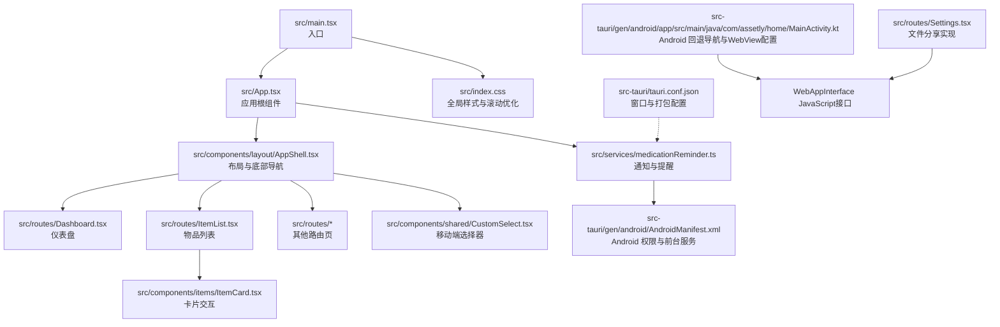
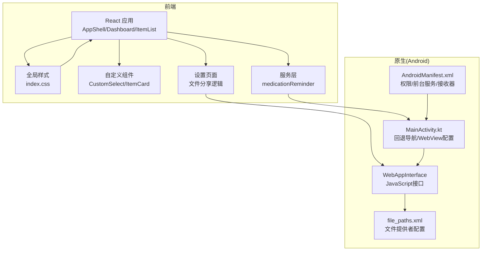
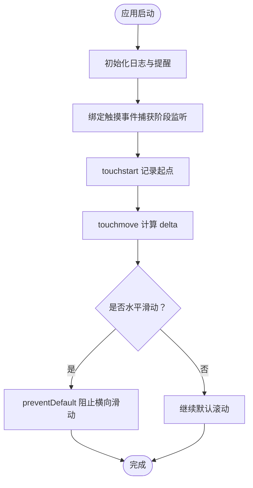
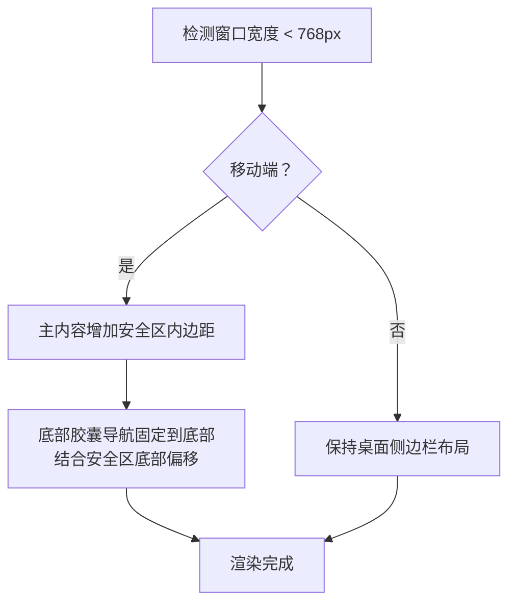
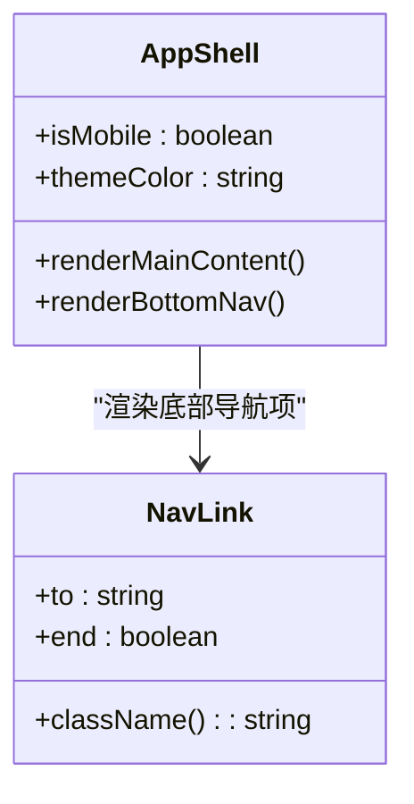
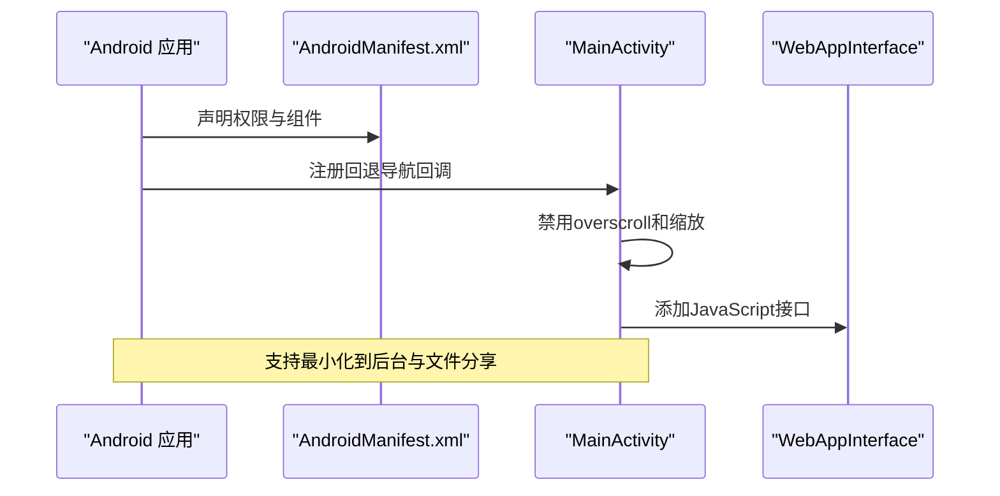
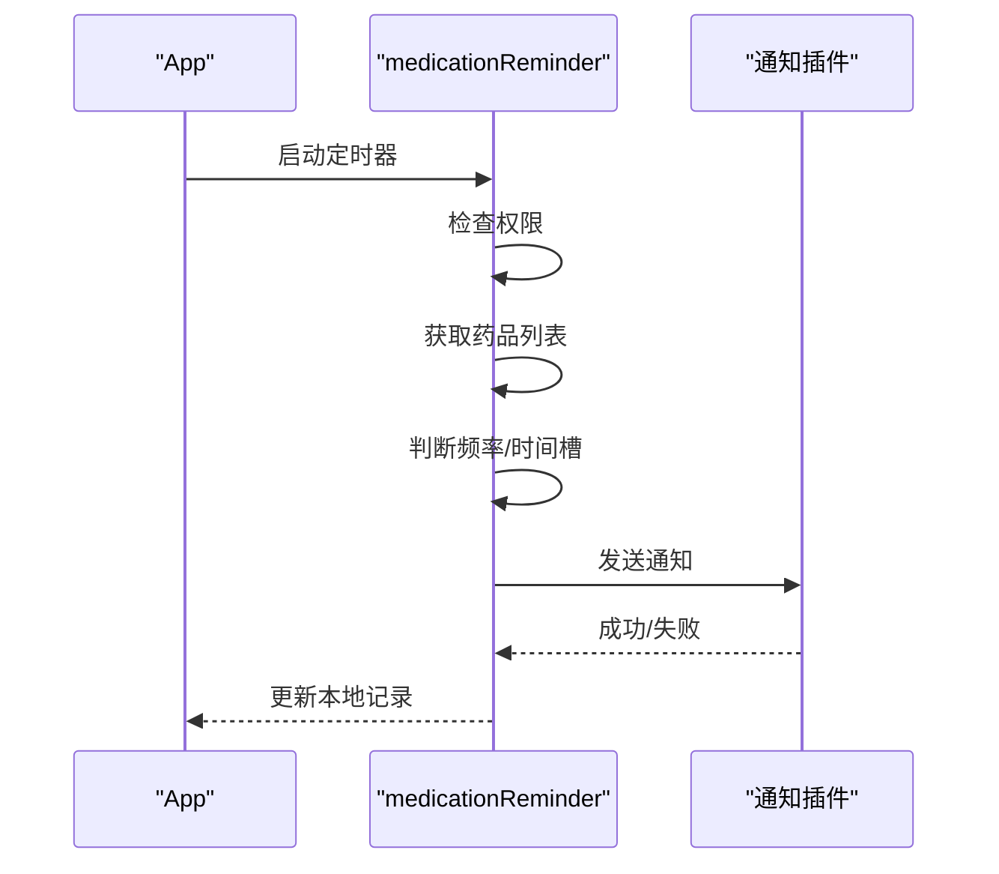
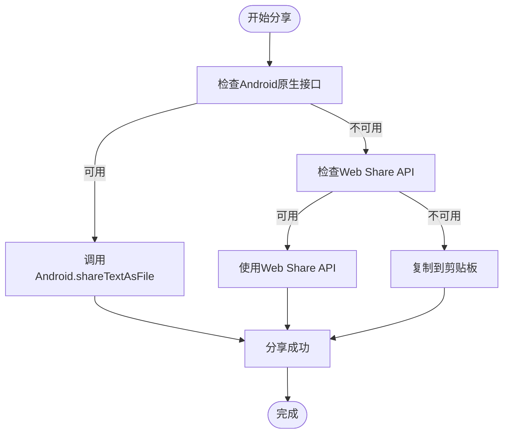
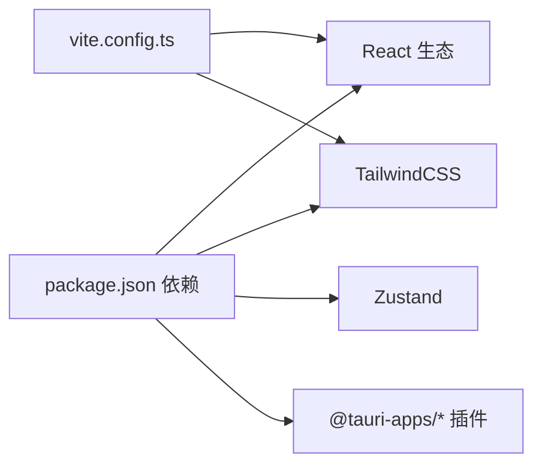

# 移动端优化

<cite>
**本文引用的文件**
- [src/App.tsx](file://src/App.tsx)
- [src/main.tsx](file://src/main.tsx)
- [src/components/layout/AppShell.tsx](file://src/components/layout/AppShell.tsx)
- [src/routes/Dashboard.tsx](file://src/routes/Dashboard.tsx)
- [src/routes/ItemList.tsx](file://src/routes/ItemList.tsx)
- [src/routes/Settings.tsx](file://src/routes/Settings.tsx)
- [src/index.css](file://src/index.css)
- [src/components/shared/CustomSelect.tsx](file://src/components/shared/CustomSelect.tsx)
- [src/components/items/ItemCard.tsx](file://src/components/items/ItemCard.tsx)
- [src/services/medicationReminder.ts](file://src/services/medicationReminder.ts)
- [src/utils/constants.ts](file://src/utils/constants.ts)
- [src/stores/useSettingsStore.ts](file://src/stores/useSettingsStore.ts)
- [src/utils/logger.ts](file://src/utils/logger.ts)
- [src-tauri/tauri.conf.json](file://src-tauri/tauri.conf.json)
- [src-tauri/gen/android/app/src/main/AndroidManifest.xml](file://src-tauri/gen/android/app/src/main/AndroidManifest.xml)
- [src-tauri/gen/android/app/src/main/java/com/assetly/home/MainActivity.kt](file://src-tauri/gen/android/app/src/main/java/com/assetly/home/MainActivity.kt)
- [src-tauri/gen/android/app/src/main/res/xml/file_paths.xml](file://src-tauri/gen/android/app/src/main/res/xml/file_paths.xml)
- [package.json](file://package.json)
- [vite.config.ts](file://vite.config.ts)
</cite>

## 更新摘要
**变更内容**
- 新增Android回退导航处理：实现最小化到后台而非完全退出的功能
- WebView配置改进：禁用overscroll效果和缩放控制，提升移动端滚动体验
- JavaScript接口增强：新增WebAppInterface类和shareTextAsFile方法用于文件分享功能
- 文件提供者配置：完善Android文件分享的权限和路径配置

## 目录
1. [简介](#简介)
2. [项目结构](#项目结构)
3. [核心组件](#核心组件)
4. [架构总览](#架构总览)
5. [详细组件分析](#详细组件分析)
6. [依赖关系分析](#依赖关系分析)
7. [性能考量](#性能考量)
8. [故障排查指南](#故障排查指南)
9. [结论](#结论)
10. [附录](#附录)

## 简介
本文件聚焦 Assetly 在移动端的优化实践，围绕以下主题展开：全面屏手势适配（禁用横向滑动返回）、安全区域处理（通过环境变量适配刘海/圆角屏）、触摸交互优化（滚动与选择器体验）、底部导航设计（胶囊式浮动导航）、滚动性能优化（iOS 滚动回弹与桌面滚动条差异）、Android 平台特殊配置（权限声明、通知渠道与前台服务）、移动端调试与性能监控、跨平台兼容性策略以及移动端与桌面端的差异化设计策略。

**更新** 新增Android回退导航处理、WebView配置改进和JavaScript接口增强功能。

## 项目结构
- 前端采用 React + Vite + TailwindCSS 构建，使用 Tauri 作为原生壳，支持多端打包。
- 移动端样式与交互集中在布局组件与路由页面中，通过 CSS 变量与响应式断点控制。
- Android 特定配置位于 Tauri 生成的 Android 目录中，包含权限、清单与前台服务接收器等。

**图表来源**
- [src/main.tsx:1-11](file://src/main.tsx#L1-L11)
- [src/App.tsx:1-92](file://src/App.tsx#L1-L92)
- [src/components/layout/AppShell.tsx:1-160](file://src/components/layout/AppShell.tsx#L1-L160)
- [src/routes/Dashboard.tsx:1-235](file://src/routes/Dashboard.tsx#L1-L235)
- [src/routes/ItemList.tsx:1-185](file://src/routes/ItemList.tsx#L1-L185)
- [src/index.css:1-84](file://src/index.css#L1-L84)
- [src/components/shared/CustomSelect.tsx:1-109](file://src/components/shared/CustomSelect.tsx#L1-L109)
- [src/components/items/ItemCard.tsx:1-94](file://src/components/items/ItemCard.tsx#L1-L94)
- [src/services/medicationReminder.ts:1-132](file://src/services/medicationReminder.ts#L1-L132)
- [src-tauri/gen/android/app/src/main/AndroidManifest.xml:1-49](file://src-tauri/gen/android/app/src/main/AndroidManifest.xml#L1-L49)
- [src-tauri/tauri.conf.json:1-40](file://src-tauri/tauri.conf.json#L1-L40)
- [src-tauri/gen/android/app/src/main/java/com/assetly/home/MainActivity.kt:1-110](file://src-tauri/gen/android/app/src/main/java/com/assetly/home/MainActivity.kt#L1-L110)
- [src/routes/Settings.tsx:1-286](file://src/routes/Settings.tsx#L1-L286)

**章节来源**
- [src/main.tsx:1-11](file://src/main.tsx#L1-L11)
- [src/App.tsx:1-92](file://src/App.tsx#L1-L92)
- [src-tauri/tauri.conf.json:1-40](file://src-tauri/tauri.conf.json#L1-L40)

## 核心组件
- 应用根组件与手势拦截：在应用启动时初始化日志与提醒，并通过捕获阶段阻止横向滑动以避免与 WebView 的侧滑返回冲突。
- 布局与底部导航：根据窗口宽度判断移动端，使用 CSS 环境变量适配安全区域，提供胶囊式浮动底部导航。
- 路由页面：仪表盘与物品列表在移动端使用安全区顶部/底部偏移，保证内容不被系统栏遮挡。
- 自定义选择器：移动端弹出全屏模态，锁定背景滚动，提升选择体验。
- 卡片交互：统一圆角与按压缩放反馈，增强触摸可感知性。
- 通知与提醒：基于 Tauri 插件进行权限检查与通知发送，注册动作类型以支持"已服用/稍后提醒"等操作。
- Android 权限与前台服务：声明网络、存储、通知、开机广播、前台服务等权限；注册提醒接收器与文件提供者。
- **新增** Android回退导航处理：拦截所有返回事件（硬件返回键、手势导航、系统返回），实现最小化到后台而非完全退出。
- **新增** WebView配置改进：禁用overscroll边缘效果和缩放控制，提供更流畅的移动端浏览体验。
- **新增** JavaScript接口增强：通过WebAppInterface类提供shareTextAsFile方法，支持将文本内容作为文件分享。

**章节来源**
- [src/App.tsx:18-68](file://src/App.tsx#L18-L68)
- [src/components/layout/AppShell.tsx:24-156](file://src/components/layout/AppShell.tsx#L24-L156)
- [src/routes/Dashboard.tsx:42](file://src/routes/Dashboard.tsx#L42)
- [src/routes/ItemList.tsx:71](file://src/routes/ItemList.tsx#L71)
- [src/components/shared/CustomSelect.tsx:21-29](file://src/components/shared/CustomSelect.tsx#L21-L29)
- [src/components/items/ItemCard.tsx:47](file://src/components/items/ItemCard.tsx#L47)
- [src/services/medicationReminder.ts:53-97](file://src/services/medicationReminder.ts#L53-L97)
- [src-tauri/gen/android/app/src/main/AndroidManifest.xml:3-8](file://src-tauri/gen/android/app/src/main/AndroidManifest.xml#L3-L8)
- [src-tauri/gen/android/app/src/main/java/com/assetly/home/MainActivity.kt:22-39](file://src-tauri/gen/android/app/src/main/java/com/assetly/home/MainActivity.kt#L22-L39)
- [src-tauri/gen/android/app/src/main/java/com/assetly/home/MainActivity.kt:45-51](file://src-tauri/gen/android/app/src/main/java/com/assetly/home/MainActivity.kt#L45-L51)
- [src-tauri/gen/android/app/src/main/java/com/assetly/home/MainActivity.kt:76-108](file://src-tauri/gen/android/app/src/main/java/com/assetly/home/MainActivity.kt#L76-L108)

## 架构总览
移动端优化涉及前端样式层、交互层与原生层（Android）协同：

**图表来源**
- [src/index.css:20-57](file://src/index.css#L20-L57)
- [src/components/shared/CustomSelect.tsx:38-107](file://src/components/shared/CustomSelect.tsx#L38-L107)
- [src/components/items/ItemCard.tsx:45-92](file://src/components/items/ItemCard.tsx#L45-L92)
- [src/services/medicationReminder.ts:102-131](file://src/services/medicationReminder.ts#L102-L131)
- [src-tauri/gen/android/app/src/main/AndroidManifest.xml:13-47](file://src-tauri/gen/android/app/src/main/AndroidManifest.xml#L13-L47)
- [src-tauri/gen/android/app/src/main/java/com/assetly/home/MainActivity.kt:14-63](file://src-tauri/gen/android/app/src/main/java/com/assetly/home/MainActivity.kt#L14-L63)
- [src-tauri/gen/android/app/src/main/res/xml/file_paths.xml:1-7](file://src-tauri/gen/android/app/src/main/res/xml/file_paths.xml#L1-L7)

## 详细组件分析

### 手势与触摸交互优化
- 禁用横向滑动返回：在捕获阶段监听触摸事件，检测水平滑动并阻止默认行为，确保在移动端不会误触 WebView 的侧滑返回。
- 触摸滚动优化：启用 `-webkit-overflow-scrolling: touch` 提升 iOS 滚动体验；桌面端保留滚动条，移动端隐藏滚动条以减少视觉干扰。
- 选择器交互：打开时锁定背景滚动，防止穿透滚动导致的意外关闭；使用 Portal 将弹窗挂载到 body，避免定位上下文影响。

**图表来源**
- [src/App.tsx:35-62](file://src/App.tsx#L35-L62)

**章节来源**
- [src/App.tsx:29-68](file://src/App.tsx#L29-L68)
- [src/index.css:27-40](file://src/index.css#L27-L40)
- [src/components/shared/CustomSelect.tsx:21-29](file://src/components/shared/CustomSelect.tsx#L21-L29)

### 安全区域与全面屏适配
- 使用 CSS 环境变量 `env(safe-area-inset-*)` 动态计算顶部与底部安全区偏移，保证内容不被刘海或底部胶囊遮挡。
- 主内容区域在移动端增加顶部与底部内边距；底部导航容器在底部使用固定定位并结合安全区底部偏移，同时设置指针事件分层以避免遮挡交互。

**图表来源**
- [src/components/layout/AppShell.tsx:34-38](file://src/components/layout/AppShell.tsx#L34-L38)
- [src/components/layout/AppShell.tsx:118-126](file://src/components/layout/AppShell.tsx#L118-L126)
- [src/components/layout/AppShell.tsx:129-156](file://src/components/layout/AppShell.tsx#L129-L156)
- [src/routes/Dashboard.tsx:42](file://src/routes/Dashboard.tsx#L42)
- [src/routes/ItemList.tsx:71](file://src/routes/ItemList.tsx#L71)

**章节来源**
- [src/components/layout/AppShell.tsx:118-156](file://src/components/layout/AppShell.tsx#L118-L156)
- [src/routes/Dashboard.tsx:42](file://src/routes/Dashboard.tsx#L42)
- [src/routes/ItemList.tsx:71](file://src/routes/ItemList.tsx#L71)

### 底部导航设计（胶囊式）
- 导航项为圆形胶囊，激活态高亮并带阴影，非激活态悬停有浅色背景过渡。
- 使用 `pointer-events-none/pointer-events-auto` 分层处理，避免底部导航遮挡主内容交互。
- 通过主题色 CSS 变量动态更新胶囊背景色，保证视觉一致性。

**图表来源**
- [src/components/layout/AppShell.tsx:10-16](file://src/components/layout/AppShell.tsx#L10-L16)
- [src/components/layout/AppShell.tsx:135-154](file://src/components/layout/AppShell.tsx#L135-L154)
- [src/stores/useSettingsStore.ts:44](file://src/stores/useSettingsStore.ts#L44)

**章节来源**
- [src/components/layout/AppShell.tsx:129-156](file://src/components/layout/AppShell.tsx#L129-L156)
- [src/stores/useSettingsStore.ts:44](file://src/stores/useSettingsStore.ts#L44)

### 滚动性能优化
- iOS 滚动回弹：启用 `-webkit-overflow-scrolling: touch`，获得更顺滑的滚动体验。
- 桌面端滚动条：保留滚动条以便在大屏设备上更精确滚动。
- 移动端隐藏滚动条：减少视觉杂讯，提升卡片网格的纯净感。
- **新增** WebView滚动优化：禁用overscroll边缘效果，提供更自然的滚动反馈。

**章节来源**
- [src/index.css:27-57](file://src/index.css#L27-L57)
- [src-tauri/gen/android/app/src/main/java/com/assetly/home/MainActivity.kt:45-46](file://src-tauri/gen/android/app/src/main/java/com/assetly/home/MainActivity.kt#L45-L46)

### Android 平台特殊配置
- 权限声明：网络、外部存储读写、通知、开机广播、前台服务等。
- 前台服务与提醒：声明前台服务权限，注册提醒接收器用于跨进程唤醒与处理。
- 文件提供者：配置 FileProvider 以便导出与分享文件。
- 最小窗口尺寸：在 Tauri 配置中设置最小宽高，保障移动端显示质量。
- **新增** 回退导航处理：拦截所有返回事件，实现最小化到后台而非完全退出。
- **新增** WebView配置：禁用缩放控制，提供更稳定的移动端浏览体验。

**图表来源**
- [src-tauri/gen/android/app/src/main/AndroidManifest.xml:3-8](file://src-tauri/gen/android/app/src/main/AndroidManifest.xml#L3-L8)
- [src-tauri/gen/android/app/src/main/AndroidManifest.xml:42-46](file://src-tauri/gen/android/app/src/main/AndroidManifest.xml#L42-L46)
- [src-tauri/gen/android/app/src/main/java/com/assetly/home/MainActivity.kt:22-39](file://src-tauri/gen/android/app/src/main/java/com/assetly/home/MainActivity.kt#L22-L39)
- [src-tauri/gen/android/app/src/main/java/com/assetly/home/MainActivity.kt:45-51](file://src-tauri/gen/android/app/src/main/java/com/assetly/home/MainActivity.kt#L45-L51)
- [src-tauri/gen/android/app/src/main/java/com/assetly/home/MainActivity.kt:76-108](file://src-tauri/gen/android/app/src/main/java/com/assetly/home/MainActivity.kt#L76-L108)

**章节来源**
- [src-tauri/gen/android/app/src/main/AndroidManifest.xml:1-49](file://src-tauri/gen/android/app/src/main/AndroidManifest.xml#L1-L49)
- [src-tauri/gen/android/app/src/main/java/com/assetly/home/MainActivity.kt:14-63](file://src-tauri/gen/android/app/src/main/java/com/assetly/home/MainActivity.kt#L14-L63)
- [src-tauri/tauri.conf.json:19-22](file://src-tauri/tauri.conf.json#L19-L22)

### 通知与提醒（移动端）
- 权限检查：启动时检查通知权限，未授权则请求权限。
- 周期检查：每分钟检查一次是否需要提醒，避免重复触发。
- 动作类型：注册"已服用/稍后提醒"等动作，便于用户快速操作。
- 存储上次检查时间：避免同一分钟内的重复提醒。

**图表来源**
- [src/services/medicationReminder.ts:53-97](file://src/services/medicationReminder.ts#L53-L97)
- [src/services/medicationReminder.ts:102-131](file://src/services/medicationReminder.ts#L102-L131)

**章节来源**
- [src/services/medicationReminder.ts:1-132](file://src/services/medicationReminder.ts#L1-L132)

### JavaScript接口增强（文件分享）
- **新增** WebAppInterface类：通过JavaScriptInterface提供原生文件分享能力。
- **新增** shareTextAsFile方法：支持将文本内容作为文件分享，提供多层分享策略。
- 多层分享策略：优先使用Android原生分享，回退到Web Share API，最后使用剪贴板。
- 安全文件处理：使用缓存目录存储临时文件，避免权限问题。
- UI线程安全：确保分享操作在UI线程执行，避免WebView线程问题。
- 文件提供者集成：通过FileProvider实现安全的文件分享。

**图表来源**
- [src-tauri/gen/android/app/src/main/java/com/assetly/home/MainActivity.kt:76-108](file://src-tauri/gen/android/app/src/main/java/com/assetly/home/MainActivity.kt#L76-L108)
- [src/routes/Settings.tsx:29-81](file://src/routes/Settings.tsx#L29-L81)

**章节来源**
- [src-tauri/gen/android/app/src/main/java/com/assetly/home/MainActivity.kt:66-109](file://src-tauri/gen/android/app/src/main/java/com/assetly/home/MainActivity.kt#L66-L109)
- [src/routes/Settings.tsx:29-81](file://src/routes/Settings.tsx#L29-L81)

### 跨平台兼容性与差异化设计
- 设计断点：以 768px 为移动/桌面分界，移动端使用底部导航与安全区偏移，桌面端使用侧边栏。
- 字体与滚动：移动端启用字体平滑与触摸滚动，桌面端保留滚动条。
- 表单元素：统一美化 select 与 number 输入框，提升移动端输入体验。
- 主题色：通过 CSS 变量与设置存储联动，保证跨平台一致的主题风格。
- **新增** 回退导航策略：移动端最小化到后台，桌面端完全退出，符合各平台用户习惯。

**章节来源**
- [src/components/layout/AppShell.tsx:34-38](file://src/components/layout/AppShell.tsx#L34-L38)
- [src/index.css:24-83](file://src/index.css#L24-L83)
- [src/stores/useSettingsStore.ts:14-55](file://src/stores/useSettingsStore.ts#L14-L55)
- [src-tauri/gen/android/app/src/main/java/com/assetly/home/MainActivity.kt:22-39](file://src-tauri/gen/android/app/src/main/java/com/assetly/home/MainActivity.kt#L22-L39)

## 依赖关系分析
- 前端依赖：React、React Router、TailwindCSS、Zustand 状态管理、Lucide 图标等。
- 原生插件：通知、日志、SQL、文件系统、Opener 等，用于移动端能力扩展。
- 构建工具：Vite + React 插件 + Tailwind Vite 插件；Tauri CLI 用于打包与运行。

**图表来源**
- [package.json:12-31](file://package.json#L12-L31)
- [vite.config.ts:1-29](file://vite.config.ts#L1-L29)

**章节来源**
- [package.json:12-43](file://package.json#L12-L43)
- [vite.config.ts:1-29](file://vite.config.ts#L1-L29)

## 性能考量
- 滚动性能：移动端启用触摸滚动，隐藏滚动条减少重绘；长列表使用虚拟化（如需）进一步优化。
- 事件处理：手势拦截仅在移动端生效，避免对桌面端交互造成影响。
- 通知频率：每分钟检查一次，避免频繁唤醒；使用本地存储记录上次检查时间。
- 资源体积：通过 Tauri 打包裁剪前端资源，结合最小窗口尺寸避免过度渲染。
- **新增** WebView性能：禁用不必要的滚动效果和缩放控制，减少渲染开销。
- **新增** 文件分享性能：使用缓存目录存储临时文件，避免磁盘I/O阻塞。

## 故障排查指南
- 通知不显示：确认通知权限状态与请求流程；检查动作类型注册是否成功。
- 横向滑动误触发：确认捕获阶段监听是否正确绑定与解绑。
- 安全区异常：检查 CSS 环境变量是否正确注入，底部导航与主内容的内边距是否一致。
- 背景滚动穿透：确认选择器打开时是否锁定 body 滚动。
- 日志与调试：通过日志插件输出结构化日志，结合内存日志上限进行问题定位。
- **新增** 回退导航问题：确认OnBackPressedCallback是否正确注册，检查moveTaskToBack调用。
- **新增** WebView配置问题：确认overScrollMode和zoom settings设置是否生效。
- **新增** 文件分享问题：检查WebAppInterface是否正确添加，FileProvider配置是否正确。

**章节来源**
- [src/services/medicationReminder.ts:55-66](file://src/services/medicationReminder.ts#L55-L66)
- [src/App.tsx:60-67](file://src/App.tsx#L60-L67)
- [src/components/shared/CustomSelect.tsx:22-28](file://src/components/shared/CustomSelect.tsx#L22-L28)
- [src/utils/logger.ts:57-83](file://src/utils/logger.ts#L57-L83)
- [src-tauri/gen/android/app/src/main/java/com/assetly/home/MainActivity.kt:22-39](file://src-tauri/gen/android/app/src/main/java/com/assetly/home/MainActivity.kt#L22-L39)
- [src-tauri/gen/android/app/src/main/java/com/assetly/home/MainActivity.kt:45-51](file://src-tauri/gen/android/app/src/main/java/com/assetly/home/MainActivity.kt#L45-L51)
- [src-tauri/gen/android/app/src/main/java/com/assetly/home/MainActivity.kt:76-108](file://src-tauri/gen/android/app/src/main/java/com/assetly/home/MainActivity.kt#L76-L108)

## 结论
Assetly 在移动端通过手势拦截、安全区域适配、胶囊式底部导航与滚动优化，提供了流畅一致的用户体验。配合 Android 权限与前台服务配置，实现了可靠的后台提醒能力。**新增的Android回退导航处理**使得应用符合移动端用户习惯，**WebView配置改进**提升了浏览体验，**JavaScript接口增强**为文件分享提供了原生级的性能和可靠性。建议后续在长列表场景引入虚拟化、在复杂表单中增加输入法优化，并持续监控通知与日志表现以提升稳定性。

## 附录
- 主题色预设与货币符号：用于设置页面与展示组件的颜色与单位一致性。
- Tauri 窗口最小尺寸：保障移动端窗口最小尺寸，避免内容拥挤。
- **新增** 文件提供者路径配置：支持应用内部文件、外部存储和缓存目录的文件访问。

**章节来源**
- [src/utils/constants.ts:29-40](file://src/utils/constants.ts#L29-L40)
- [src-tauri/tauri.conf.json:19-22](file://src-tauri/tauri.conf.json#L19-L22)
- [src-tauri/gen/android/app/src/main/res/xml/file_paths.xml:1-7](file://src-tauri/gen/android/app/src/main/res/xml/file_paths.xml#L1-L7)