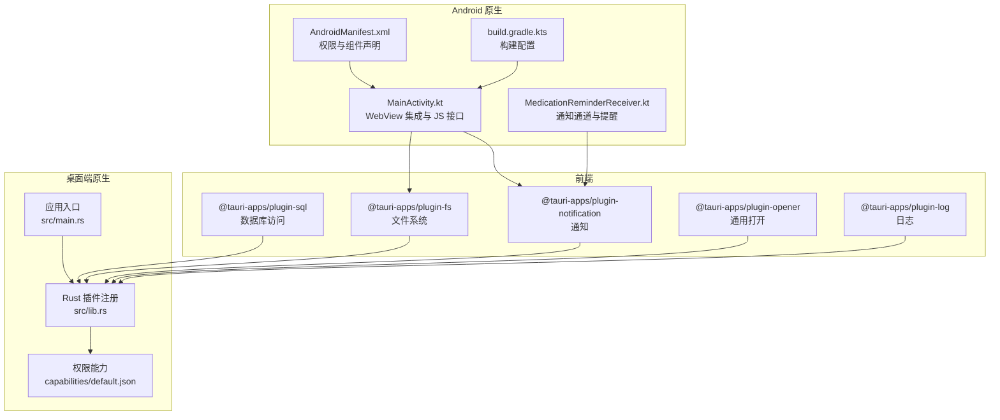
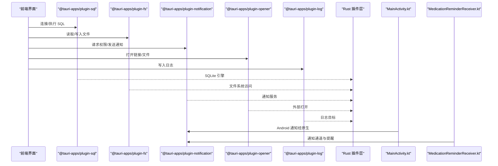
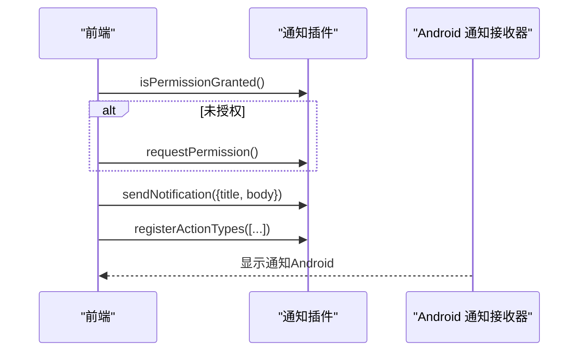
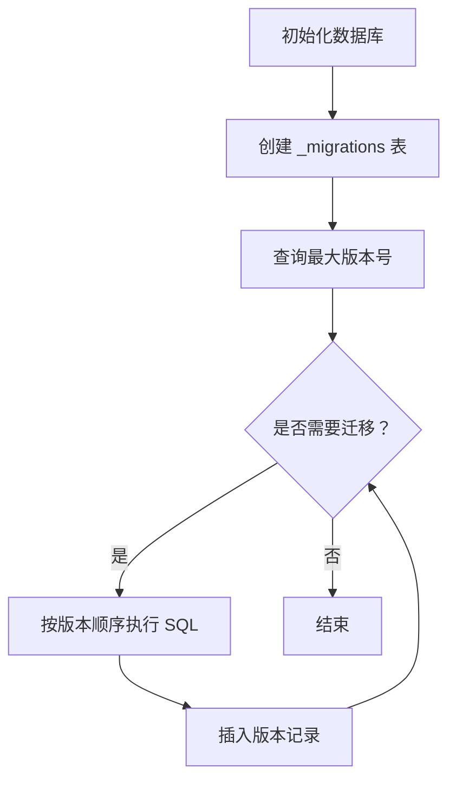
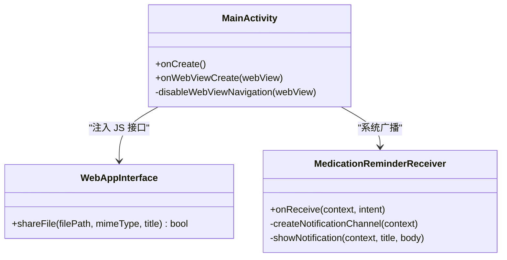
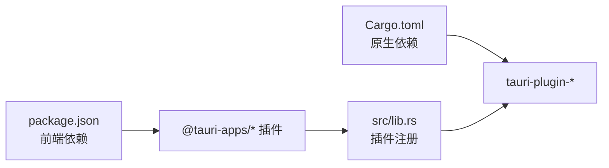

# Tauri 插件生态

<cite>
**本文引用的文件**
- [src-tauri/tauri.conf.json](file://src-tauri/tauri.conf.json)
- [src-tauri/tauri.macos.conf.json](file://src-tauri/tauri.macos.conf.json)
- [src-tauri/Cargo.toml](file://src-tauri/Cargo.toml)
- [src-tauri/src/lib.rs](file://src-tauri/src/lib.rs)
- [src-tauri/src/main.rs](file://src-tauri/src/main.rs)
- [src-tauri/capabilities/default.json](file://src-tauri/capabilities/default.json)
- [src-tauri/gen/schemas/capabilities.json](file://src-tauri/gen/schemas/capabilities.json)
- [src-tauri/gen/android/app/src/main/AndroidManifest.xml](file://src-tauri/gen/android/app/src/main/AndroidManifest.xml)
- [src-tauri/gen/android/app/src/main/java/com/assetly/home/MainActivity.kt](file://src-tauri/gen/android/app/src/main/java/com/assetly/home/MainActivity.kt)
- [src-tauri/gen/android/app/src/main/java/com/assetly/home/MedicationReminderReceiver.kt](file://src-tauri/gen/android/app/src/main/java/com/assetly/home/MedicationReminderReceiver.kt)
- [src-tauri/gen/android/app/build.gradle.kts](file://src-tauri/gen/android/app/build.gradle.kts)
- [src/services/database.ts](file://src/services/database.ts)
- [src/services/medicationReminder.ts](file://src/services/medicationReminder.ts)
- [package.json](file://package.json)
</cite>

## 目录
1. [简介](#简介)
2. [项目结构](#项目结构)
3. [核心组件](#核心组件)
4. [架构总览](#架构总览)
5. [详细组件分析](#详细组件分析)
6. [依赖关系分析](#依赖关系分析)
7. [性能考量](#性能考量)
8. [故障排查指南](#故障排查指南)
9. [结论](#结论)
10. [附录](#附录)

## 简介
本文件面向 Assetly 的 Tauri 插件生态系统，系统性梳理权限配置体系（capabilities.json）、核心插件（notification、shell/opener、fs、sql）的使用方式、跨平台差异（macOS、Windows、Linux、Android）以及安全与扩展最佳实践。文档同时提供可直接对照的配置与实现路径，帮助开发者快速理解并安全地扩展插件能力。

## 项目结构
- 应用前端位于 src/，通过 @tauri-apps/api 与插件交互；数据库访问通过 @tauri-apps/plugin-sql；通知通过 @tauri-apps/plugin-notification；文件系统通过 @tauri-apps/plugin-fs；通用打开能力通过 @tauri-apps/plugin-opener；日志通过 @tauri-apps/plugin-log。
- 桌面端与移动端原生侧位于 src-tauri/，使用 Rust 构建，插件在 src/lib.rs 中注册，主入口在 src/main.rs。
- 权限与能力由 capabilities/default.json 定义，并生成 JSON Schema 用于校验。
- Android 平台通过生成的 Kotlin Activity 与原生广播接收器实现通知通道与分享能力。



图表来源
- [src-tauri/src/lib.rs:1-49](file://src-tauri/src/lib.rs#L1-L49)
- [src-tauri/src/main.rs:1-7](file://src-tauri/src/main.rs#L1-L7)
- [src-tauri/capabilities/default.json:1-37](file://src-tauri/capabilities/default.json#L1-L37)
- [src-tauri/gen/android/app/src/main/AndroidManifest.xml:1-49](file://src-tauri/gen/android/app/src/main/AndroidManifest.xml#L1-L49)
- [src-tauri/gen/android/app/src/main/java/com/assetly/home/MainActivity.kt:1-95](file://src-tauri/gen/android/app/src/main/java/com/assetly/home/MainActivity.kt#L1-L95)
- [src-tauri/gen/android/app/src/main/java/com/assetly/home/MedicationReminderReceiver.kt:1-68](file://src-tauri/gen/android/app/src/main/java/com/assetly/home/MedicationReminderReceiver.kt#L1-L68)

章节来源
- [src-tauri/tauri.conf.json:1-40](file://src-tauri/tauri.conf.json#L1-L40)
- [src-tauri/Cargo.toml:1-31](file://src-tauri/Cargo.toml#L1-L31)
- [src-tauri/src/lib.rs:1-49](file://src-tauri/src/lib.rs#L1-L49)
- [src-tauri/src/main.rs:1-7](file://src-tauri/src/main.rs#L1-L7)
- [src-tauri/capabilities/default.json:1-37](file://src-tauri/capabilities/default.json#L1-L37)
- [src-tauri/gen/schemas/capabilities.json:1-1](file://src-tauri/gen/schemas/capabilities.json#L1-L1)
- [src-tauri/gen/android/app/src/main/AndroidManifest.xml:1-49](file://src-tauri/gen/android/app/src/main/AndroidManifest.xml#L1-L49)
- [src-tauri/gen/android/app/src/main/java/com/assetly/home/MainActivity.kt:1-95](file://src-tauri/gen/android/app/src/main/java/com/assetly/home/MainActivity.kt#L1-L95)
- [src-tauri/gen/android/app/src/main/java/com/assetly/home/MedicationReminderReceiver.kt:1-68](file://src-tauri/gen/android/app/src/main/java/com/assetly/home/MedicationReminderReceiver.kt#L1-L68)
- [src-tauri/gen/android/app/build.gradle.kts:1-72](file://src-tauri/gen/android/app/build.gradle.kts#L1-L72)

## 核心组件
- 数据库插件（SQL）
  - 前端：通过 @tauri-apps/plugin-sql 连接 sqlite:assetly.db，封装迁移与查询。
  - 原生：在 Cargo.toml 中声明 tauri-plugin-sql，Rust 层以 Builder::new().build() 初始化。
- 通知插件（Notification）
  - 前端：调用 isPermissionGranted/requestPermission/sendNotification/registerActionTypes。
  - 原生：Android 使用 MedicationReminderReceiver 创建通知渠道并展示通知。
- 文件系统插件（FS）
  - 前端：读写本地文件与目录。
  - 原生：通过 capabilities/default.json 限定 $APPDATA、$RESOURCE、$DOWNLOAD 等范围。
- 开放器插件（Opener）
  - 前端：打开外部链接或文件。
  - 原生：tauri-plugin-opener。
- 日志插件（Log）
  - 原生：tauri-plugin-log，输出到日志目录与标准输出。

章节来源
- [src/services/database.ts:1-171](file://src/services/database.ts#L1-L171)
- [src/services/medicationReminder.ts:1-132](file://src/services/medicationReminder.ts#L1-L132)
- [src-tauri/Cargo.toml:20-30](file://src-tauri/Cargo.toml#L20-L30)
- [src-tauri/src/lib.rs:4-20](file://src-tauri/src/lib.rs#L4-L20)
- [src-tauri/capabilities/default.json:6-35](file://src-tauri/capabilities/default.json#L6-L35)
- [package.json:12-31](file://package.json#L12-L31)

## 架构总览
下图展示了前端如何通过插件 API 访问原生能力，以及 Android 特定的原生组件如何参与通知与文件分享。



图表来源
- [src/services/database.ts:1-171](file://src/services/database.ts#L1-L171)
- [src/services/medicationReminder.ts:1-132](file://src/services/medicationReminder.ts#L1-L132)
- [src-tauri/src/lib.rs:4-20](file://src-tauri/src/lib.rs#L4-L20)
- [src-tauri/gen/android/app/src/main/java/com/assetly/home/MainActivity.kt:63-94](file://src-tauri/gen/android/app/src/main/java/com/assetly/home/MainActivity.kt#L63-L94)
- [src-tauri/gen/android/app/src/main/java/com/assetly/home/MedicationReminderReceiver.kt:20-66](file://src-tauri/gen/android/app/src/main/java/com/assetly/home/MedicationReminderReceiver.kt#L20-L66)

## 详细组件分析

### 权限配置系统（capabilities.json）
- 结构设计
  - identifier：能力标识符（如 default）。
  - windows：绑定窗口（如 main）。
  - permissions：权限清单，包含核心权限与细粒度允许项。
  - fs:scope：文件系统作用域白名单，限定 $APPDATA/**、$APPDATA/exports/**、$RESOURCE/**、$DOWNLOAD/** 等路径。
- 权限声明语法
  - 字符串形式：如 "core:default"、"fs:allow-read"。
  - 对象形式：如 {"identifier":"fs:scope","allow":[...]}。
- 安全边界
  - 仅授予必要权限，避免开放根目录或全局路径。
  - 通过作用域白名单限制文件系统访问范围。

```mermaid
flowchart TD
Start(["加载默认能力"]) --> Parse["解析 permissions 列表"]
Parse --> PermType{"权限类型"}
PermType --> |字符串| AddPerm["添加权限标识"]
PermType --> |对象(fs:scope)| Scope["解析 allow 数组"]
Scope --> ApplyScope["应用文件系统作用域"]
AddPerm --> Next["继续下一个权限"]
ApplyScope --> Next
Next --> End(["完成"])
```

图表来源
- [src-tauri/capabilities/default.json:6-35](file://src-tauri/capabilities/default.json#L6-L35)
- [src-tauri/gen/schemas/capabilities.json:1-1](file://src-tauri/gen/schemas/capabilities.json#L1-L1)

章节来源
- [src-tauri/capabilities/default.json:1-37](file://src-tauri/capabilities/default.json#L1-L37)
- [src-tauri/gen/schemas/capabilities.json:1-1](file://src-tauri/gen/schemas/capabilities.json#L1-L1)

### 核心插件使用方法

#### 通知插件（notification）
- 前端流程
  - 检查权限 isPermissionGranted，未授权则 requestPermission。
  - 发送通知 sendNotification，注册动作类型 registerActionTypes。
- Android 差异
  - 通过 MedicationReminderReceiver 创建通知渠道并在前台显示通知。
  - MainActivity.kt 提供 JavaScript 接口用于文件分享（与通知相关但非通知核心）。



图表来源
- [src/services/medicationReminder.ts:53-97](file://src/services/medicationReminder.ts#L53-L97)
- [src-tauri/gen/android/app/src/main/java/com/assetly/home/MedicationReminderReceiver.kt:20-66](file://src-tauri/gen/android/app/src/main/java/com/assetly/home/MedicationReminderReceiver.kt#L20-L66)

章节来源
- [src/services/medicationReminder.ts:1-132](file://src/services/medicationReminder.ts#L1-L132)
- [src-tauri/gen/android/app/src/main/java/com/assetly/home/MedicationReminderReceiver.kt:1-68](file://src-tauri/gen/android/app/src/main/java/com/assetly/home/MedicationReminderReceiver.kt#L1-L68)

#### 文件系统插件（fs）
- 前端使用
  - 读取/写入文件、判断存在、创建目录、删除/重命名等。
- 权限与作用域
  - capabilities/default.json 中明确列出允许的操作与作用域白名单。

章节来源
- [src-tauri/capabilities/default.json:13-30](file://src-tauri/capabilities/default.json#L13-L30)
- [package.json:16-16](file://package.json#L16-L16)

#### 数据库插件（sql）
- 前端使用
  - 通过 @tauri-apps/plugin-sql 加载 sqlite:assetly.db，执行迁移与查询。
- 迁移策略
  - 维护 _migrations 表记录版本，按顺序执行未应用的迁移语句。



图表来源
- [src/services/database.ts:18-53](file://src/services/database.ts#L18-L53)

章节来源
- [src/services/database.ts:1-171](file://src/services/database.ts#L1-L171)
- [package.json:20-20](file://package.json#L20-L20)

#### 开放器插件（opener）
- 前端使用
  - 打开外部链接或文件。
- 原生集成
  - 在 Rust 层通过 tauri-plugin-opener::init() 注册。

章节来源
- [src-tauri/src/lib.rs:4-5](file://src-tauri/src/lib.rs#L4-L5)
- [package.json:19-19](file://package.json#L19-L19)

#### 日志插件（log）
- 原生集成
  - tauri-plugin-log 输出到日志目录与标准输出，级别为 Info。

章节来源
- [src-tauri/src/lib.rs:8-20](file://src-tauri/src/lib.rs#L8-L20)
- [package.json:17-17](file://package.json#L17-L17)

### 平台特定功能实现

#### Android 原生功能集成
- 权限与组件
  - AndroidManifest.xml 声明 INTERNET、存储读写、通知、开机广播、前台服务等权限。
  - FileProvider 与通知接收器 MedicationReminderReceiver。
- WebView 集成
  - MainActivity.kt 禁用回退导航、禁用缩放与历史、注入 JavaScript 接口用于文件分享。
- 构建配置
  - build.gradle.kts 设置 SDK、签名、混淆与打包参数。



图表来源
- [src-tauri/gen/android/app/src/main/java/com/assetly/home/MainActivity.kt:13-95](file://src-tauri/gen/android/app/src/main/java/com/assetly/home/MainActivity.kt#L13-L95)
- [src-tauri/gen/android/app/src/main/java/com/assetly/home/MedicationReminderReceiver.kt:12-68](file://src-tauri/gen/android/app/src/main/java/com/assetly/home/MedicationReminderReceiver.kt#L12-L68)

章节来源
- [src-tauri/gen/android/app/src/main/AndroidManifest.xml:1-49](file://src-tauri/gen/android/app/src/main/AndroidManifest.xml#L1-L49)
- [src-tauri/gen/android/app/src/main/java/com/assetly/home/MainActivity.kt:1-95](file://src-tauri/gen/android/app/src/main/java/com/assetly/home/MainActivity.kt#L1-L95)
- [src-tauri/gen/android/app/src/main/java/com/assetly/home/MedicationReminderReceiver.kt:1-68](file://src-tauri/gen/android/app/src/main/java/com/assetly/home/MedicationReminderReceiver.kt#L1-L68)
- [src-tauri/gen/android/app/build.gradle.kts:1-72](file://src-tauri/gen/android/app/build.gradle.kts#L1-L72)

#### macOS、Windows、Linux 差异化处理
- macOS 配置
  - tauri.macos.conf.json 中包含签名身份、权限清单占位等字段，便于打包与签名。
- Windows/Linux
  - 通过 tauri.conf.json 的 windows 配置统一设置窗口属性与安全策略（如 CSP 为空）。

章节来源
- [src-tauri/tauri.macos.conf.json:1-10](file://src-tauri/tauri.macos.conf.json#L1-L10)
- [src-tauri/tauri.conf.json:12-27](file://src-tauri/tauri.conf.json#L12-L27)

### 插件安全考虑
- 权限最小化
  - 仅启用必要的 permissions，避免授予全局文件系统或网络权限。
- 沙箱机制
  - 通过 capabilities/default.json 的作用域白名单限制文件系统访问范围。
- API 调用限制
  - 仅暴露前端实际需要的 API，避免过度授权。
- 平台差异
  - Android 明确声明所需权限并在清单中注册组件，避免隐式权限风险。

章节来源
- [src-tauri/capabilities/default.json:6-35](file://src-tauri/capabilities/default.json#L6-L35)
- [src-tauri/gen/android/app/src/main/AndroidManifest.xml:3-8](file://src-tauri/gen/android/app/src/main/AndroidManifest.xml#L3-L8)

### 插件扩展最佳实践
- 自定义插件开发
  - 在 Rust 层通过 tauri::plugin 注册新插件，遵循命令导出与权限声明。
- 第三方插件集成
  - 在 Cargo.toml 添加依赖，在 src/lib.rs 中 init() 注册。
- 版本兼容性管理
  - 前端与 CLI、插件版本保持一致，避免 API 不匹配。
- 配置与 Schema
  - 更新 capabilities/default.json 后同步生成 schema，确保构建时校验通过。

章节来源
- [src-tauri/Cargo.toml:20-30](file://src-tauri/Cargo.toml#L20-L30)
- [src-tauri/src/lib.rs:4-20](file://src-tauri/src/lib.rs#L4-L20)
- [src-tauri/gen/schemas/capabilities.json:1-1](file://src-tauri/gen/schemas/capabilities.json#L1-L1)

## 依赖关系分析
- 前端依赖
  - @tauri-apps/api、@tauri-apps/plugin-* 等。
- 原生依赖
  - tauri、tauri-plugin-*、serde、serde_json。
- 插件注册
  - 在 Rust 层集中注册，统一运行时上下文。



图表来源
- [package.json:12-31](file://package.json#L12-L31)
- [src-tauri/Cargo.toml:20-30](file://src-tauri/Cargo.toml#L20-L30)
- [src-tauri/src/lib.rs:4-20](file://src-tauri/src/lib.rs#L4-L20)

章节来源
- [package.json:12-31](file://package.json#L12-L31)
- [src-tauri/Cargo.toml:20-30](file://src-tauri/Cargo.toml#L20-L30)
- [src-tauri/src/lib.rs:1-49](file://src-tauri/src/lib.rs#L1-L49)

## 性能考量
- 数据库迁移与查询
  - 使用索引优化常见查询（如 items/location/status、medicines/expiry/type）。
- 通知频率控制
  - 通过定时器与去抖逻辑（如至少 50 秒检查一次）降低重复触发。
- WebView 导航与历史
  - Android 端禁用回退导航与历史，减少不必要的页面状态维护。

章节来源
- [src/services/database.ts:119-131](file://src/services/database.ts#L119-L131)
- [src/services/medicationReminder.ts:72-73](file://src/services/medicationReminder.ts#L72-L73)
- [src-tauri/gen/android/app/src/main/java/com/assetly/home/MainActivity.kt:49-57](file://src-tauri/gen/android/app/src/main/java/com/assetly/home/MainActivity.kt#L49-L57)

## 故障排查指南
- 数据库连接失败
  - 检查 sqlite:assetly.db 是否存在，确认迁移是否成功执行。
- 通知权限被拒绝
  - 前端检查 isPermissionGranted，必要时引导用户手动开启系统通知权限。
- 文件系统访问被拒
  - 核对 capabilities/default.json 中的 fs:scope 白名单是否包含目标路径。
- Android 分享失败
  - 检查 FileProvider 配置与权限声明，确认文件存在且具备读取权限。

章节来源
- [src/services/database.ts:38-44](file://src/services/database.ts#L38-L44)
- [src/services/medicationReminder.ts:55-66](file://src/services/medicationReminder.ts#L55-L66)
- [src-tauri/capabilities/default.json:20-28](file://src-tauri/capabilities/default.json#L20-L28)
- [src-tauri/gen/android/app/src/main/AndroidManifest.xml:32-40](file://src-tauri/gen/android/app/src/main/AndroidManifest.xml#L32-L40)

## 结论
Assetly 的 Tauri 插件生态以 capabilities.json 为核心权限边界，结合 @tauri-apps/plugin-* 在前端提供稳定 API，Rust 层集中注册插件并按需暴露能力。Android 平台通过原生组件补充通知与文件分享能力。建议在扩展插件时严格遵循权限最小化与作用域白名单原则，并通过 schema 校验与版本一致性保障稳定性。

## 附录
- 配置示例路径
  - 权限能力：[capabilities/default.json:1-37](file://src-tauri/capabilities/default.json#L1-L37)
  - 桌面配置：[tauri.conf.json:1-40](file://src-tauri/tauri.conf.json#L1-L40)
  - macOS 配置：[tauri.macos.conf.json:1-10](file://src-tauri/tauri.macos.conf.json#L1-L10)
  - 原生依赖：[Cargo.toml:20-30](file://src-tauri/Cargo.toml#L20-L30)
  - 插件注册：[src/lib.rs:4-20](file://src-tauri/src/lib.rs#L4-L20)
  - Android 清单：[AndroidManifest.xml:1-49](file://src-tauri/gen/android/app/src/main/AndroidManifest.xml#L1-L49)
  - Android 构建：[build.gradle.kts:1-72](file://src-tauri/gen/android/app/build.gradle.kts#L1-L72)
- 前端服务示例路径
  - 数据库服务：[src/services/database.ts:1-171](file://src/services/database.ts#L1-L171)
  - 用药提醒服务：[src/services/medicationReminder.ts:1-132](file://src/services/medicationReminder.ts#L1-L132)