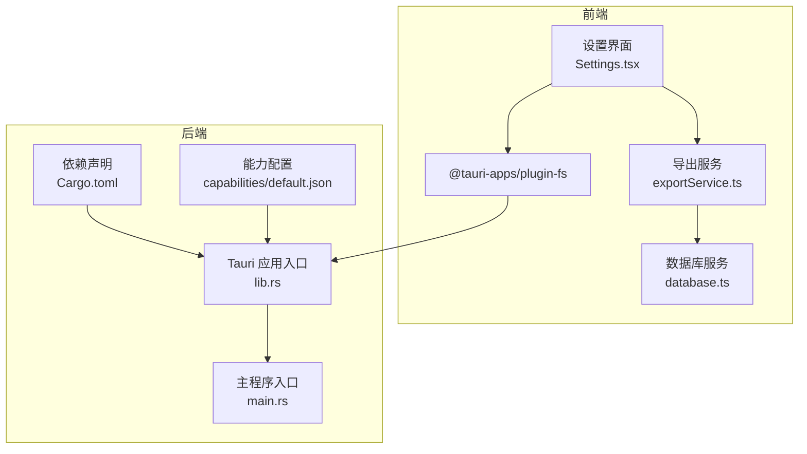
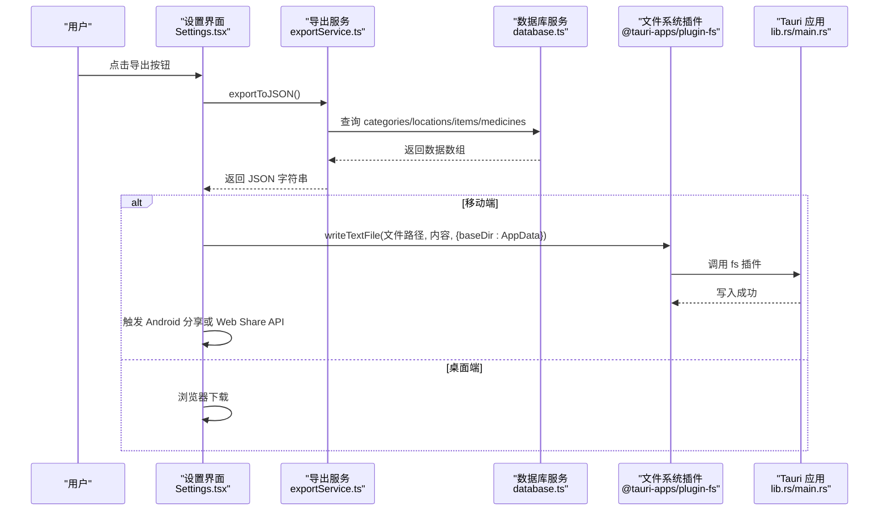
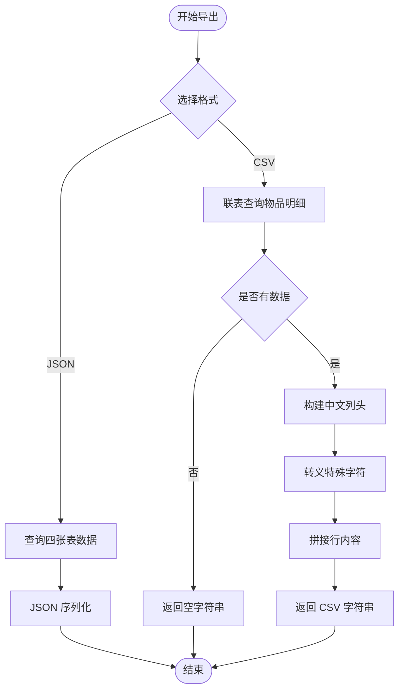
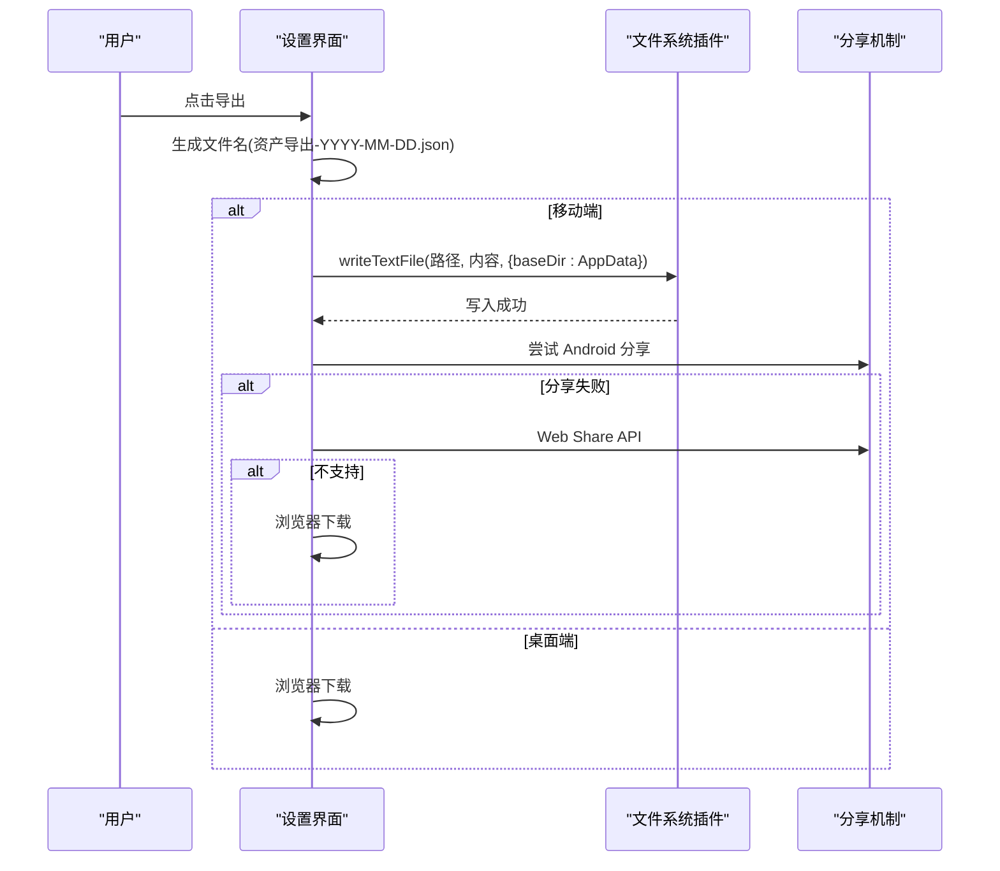
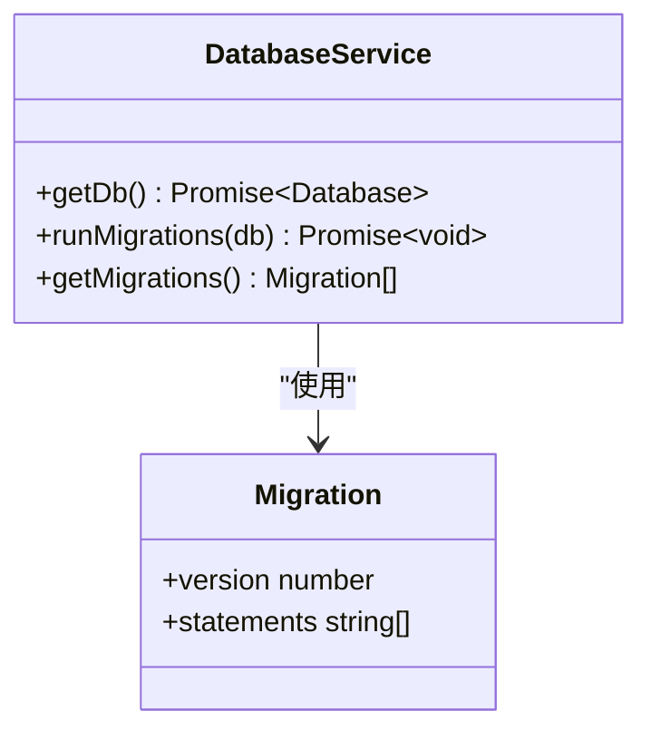
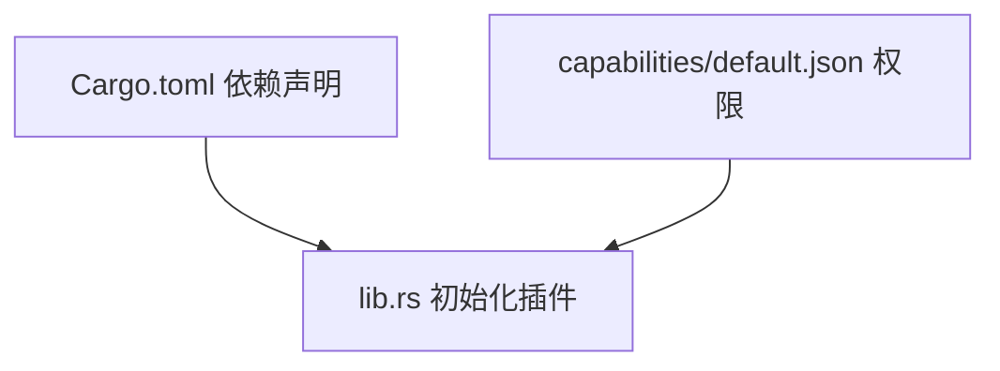
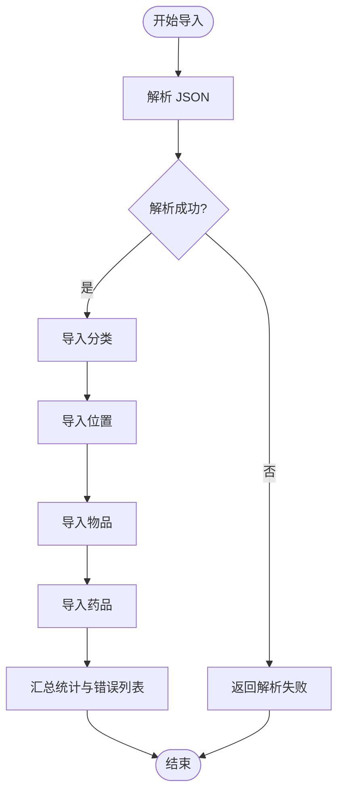
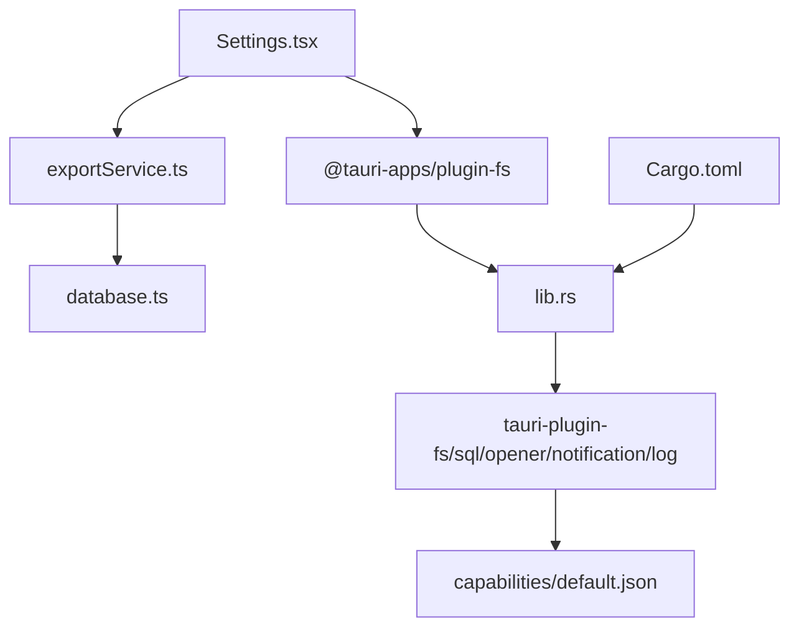

# 文件系统集成

<cite>
**本文档引用的文件**
- [exportService.ts](file://src/services/exportService.ts)
- [Settings.tsx](file://src/routes/Settings.tsx)
- [database.ts](file://src/services/database.ts)
- [lib.rs](file://src-tauri/src/lib.rs)
- [main.rs](file://src-tauri/src/main.rs)
- [Cargo.toml](file://src-tauri/Cargo.toml)
- [default.json](file://src-tauri/capabilities/default.json)
- [tauri.conf.json](file://src-tauri/tauri.conf.json)
- [constants.ts](file://src/utils/constants.ts)
</cite>

## 目录
1. [简介](#简介)
2. [项目结构](#项目结构)
3. [核心组件](#核心组件)
4. [架构概览](#架构概览)
5. [详细组件分析](#详细组件分析)
6. [依赖关系分析](#依赖关系分析)
7. [性能考量](#性能考量)
8. [故障排除指南](#故障排除指南)
9. [结论](#结论)
10. [附录](#附录)

## 简介
本文件系统集成文档聚焦于 Assetly 应用的数据导出与导入功能，涵盖以下关键方面：
- 导出格式设计：JSON 与 CSV 的数据结构与序列化策略
- 数据序列化过程：从数据库查询到最终文件内容的转换流程
- 文件命名规则：时间戳驱动的文件名生成策略
- 文件分享机制：跨平台文件操作、路径处理与权限管理
- 导入功能实现：文件解析、数据验证与错误处理
- Tauri 文件系统 API 集成：写入、读取与分享能力
- 安全考虑：路径遍历防护、文件大小限制与临时文件清理
- 实际代码示例与常见问题解决方案

## 项目结构
Assetly 采用前端（React + Tauri）与后端（Rust）分离的架构，文件系统相关逻辑主要分布在：
- 前端导出/导入界面与服务层
- 后端数据库访问与文件系统插件
- Tauri 能力配置与权限控制

**图表来源**
- [Settings.tsx:1-298](file://src/routes/Settings.tsx#L1-L298)
- [exportService.ts:1-154](file://src/services/exportService.ts#L1-L154)
- [database.ts:1-171](file://src/services/database.ts#L1-L171)
- [lib.rs:1-48](file://src-tauri/src/lib.rs#L1-L48)
- [main.rs:1-7](file://src-tauri/src/main.rs#L1-L7)
- [Cargo.toml:1-31](file://src-tauri/Cargo.toml#L1-L31)
- [default.json:1-37](file://src-tauri/capabilities/default.json#L1-L37)

**章节来源**
- [Settings.tsx:1-298](file://src/routes/Settings.tsx#L1-L298)
- [exportService.ts:1-154](file://src/services/exportService.ts#L1-L154)
- [database.ts:1-171](file://src/services/database.ts#L1-L171)
- [lib.rs:1-48](file://src-tauri/src/lib.rs#L1-L48)
- [main.rs:1-7](file://src-tauri/src/main.rs#L1-L7)
- [Cargo.toml:1-31](file://src-tauri/Cargo.toml#L1-L31)
- [default.json:1-37](file://src-tauri/capabilities/default.json#L1-L37)

## 核心组件
- 导出服务：负责从数据库查询数据并序列化为 JSON 或 CSV
- 设置界面：提供导出/导入按钮、文件选择与分享流程
- 数据库服务：封装 SQLite 连接、迁移与查询执行
- Tauri 插件：提供文件系统读写、通知与日志能力
- 能力配置：定义文件系统访问范围与权限

**章节来源**
- [exportService.ts:1-154](file://src/services/exportService.ts#L1-L154)
- [Settings.tsx:1-298](file://src/routes/Settings.tsx#L1-L298)
- [database.ts:1-171](file://src/services/database.ts#L1-L171)
- [lib.rs:1-48](file://src-tauri/src/lib.rs#L1-L48)
- [default.json:1-37](file://src-tauri/capabilities/default.json#L1-L37)

## 架构概览
文件系统集成的关键流程如下：
- 导出：前端调用导出服务，服务层查询数据库，返回序列化内容；移动端通过 Tauri 写入应用数据目录并触发分享；桌面端直接浏览器下载
- 导入：前端选择 JSON 文件，读取文本内容，调用导入服务进行解析与数据库写入
- 权限：通过 Tauri 能力配置限制文件系统访问范围，仅允许特定目录与操作

**图表来源**
- [Settings.tsx:23-106](file://src/routes/Settings.tsx#L23-L106)
- [exportService.ts:4-13](file://src/services/exportService.ts#L4-L13)
- [database.ts:8-16](file://src/services/database.ts#L8-L16)
- [lib.rs:6-6](file://src-tauri/src/lib.rs#L6-L6)
- [main.rs:4-6](file://src-tauri/src/main.rs#L4-L6)

## 详细组件分析

### 导出服务（exportService.ts）
- JSON 导出：按类别、位置、物品、药品顺序查询，统一序列化为对象结构
- CSV 导出：通过联表查询生成物品明细，包含分类、位置、购买信息、药品相关信息，按中文列头输出
- 序列化策略：JSON 使用缩进格式；CSV 对包含逗号或引号的值进行转义处理

**图表来源**
- [exportService.ts:4-44](file://src/services/exportService.ts#L4-L44)

**章节来源**
- [exportService.ts:1-154](file://src/services/exportService.ts#L1-L154)

### 设置界面（Settings.tsx）
- 导出流程：生成带日期的时间戳文件名，移动端优先尝试 Android 分享或 Web Share API，最后回退到浏览器下载
- 导入流程：选择 JSON 文件，读取文本内容，弹出确认对话框后调用导入服务
- 文件命名：以资产导出前缀加日期组成，便于识别与归档

**图表来源**
- [Settings.tsx:23-106](file://src/routes/Settings.tsx#L23-L106)

**章节来源**
- [Settings.tsx:1-298](file://src/routes/Settings.tsx#L1-L298)

### 数据库服务（database.ts）
- 连接管理：首次使用时建立 SQLite 连接并执行迁移
- 迁移机制：维护迁移版本表，按版本顺序执行 SQL 语句，确保数据库结构一致性
- 表结构：包含分类、位置（树形结构）、物品、药品、设置等表及索引

**图表来源**
- [database.ts:8-53](file://src/services/database.ts#L8-L53)

**章节来源**
- [database.ts:1-171](file://src/services/database.ts#L1-L171)

### Tauri 文件系统与能力配置
- 插件初始化：启用 opener、SQL、文件系统、通知、日志等插件
- 能力配置：限定文件系统作用域为应用数据目录、资源目录与下载目录，明确允许读写、存在性检查、创建目录、删除与重命名
- 主程序入口：调用应用入口函数启动 Tauri 应用

**图表来源**
- [lib.rs:4-25](file://src-tauri/src/lib.rs#L4-L25)
- [default.json:6-35](file://src-tauri/capabilities/default.json#L6-L35)
- [Cargo.toml:20-29](file://src-tauri/Cargo.toml#L20-L29)

**章节来源**
- [lib.rs:1-48](file://src-tauri/src/lib.rs#L1-L48)
- [default.json:1-37](file://src-tauri/capabilities/default.json#L1-L37)
- [Cargo.toml:1-31](file://src-tauri/Cargo.toml#L1-L31)

### 导入服务（exportService.ts）
- 解析与校验：先尝试 JSON 解析，失败则返回错误
- 数据写入：按顺序导入分类、位置、物品、药品，使用“插入或替换”策略保证幂等
- 错误处理：逐条记录成功/失败计数与具体错误消息，便于反馈

**图表来源**
- [exportService.ts:53-153](file://src/services/exportService.ts#L53-L153)

**章节来源**
- [exportService.ts:46-154](file://src/services/exportService.ts#L46-L154)

## 依赖关系分析
- 前端依赖：React 组件依赖导出服务与数据库服务；导出服务依赖数据库服务；设置界面依赖文件系统插件
- 后端依赖：Tauri 应用依赖各插件；能力配置约束插件行为；Cargo.toml 明确插件版本与特性
- 能力与权限：默认能力配置限制文件系统访问范围，避免越权操作

**图表来源**
- [Settings.tsx:1-20](file://src/routes/Settings.tsx#L1-L20)
- [exportService.ts:1-2](file://src/services/exportService.ts#L1-L2)
- [database.ts:1-4](file://src/services/database.ts#L1-L4)
- [lib.rs:4-25](file://src-tauri/src/lib.rs#L4-L25)
- [default.json:6-35](file://src-tauri/capabilities/default.json#L6-L35)
- [Cargo.toml:20-29](file://src-tauri/Cargo.toml#L20-L29)

**章节来源**
- [Settings.tsx:1-20](file://src/routes/Settings.tsx#L1-L20)
- [exportService.ts:1-2](file://src/services/exportService.ts#L1-L2)
- [database.ts:1-4](file://src/services/database.ts#L1-L4)
- [lib.rs:1-48](file://src-tauri/src/lib.rs#L1-L48)
- [default.json:1-37](file://src-tauri/capabilities/default.json#L1-L37)
- [Cargo.toml:1-31](file://src-tauri/Cargo.toml#L1-L31)

## 性能考量
- 导出性能
  - JSON 导出：一次性查询四张表，适合小到中型数据量；建议在大数据量场景下分页或异步分批导出
  - CSV 导出：联表查询可能产生较大结果集，建议在前端分块处理或服务端流式输出
- 导入性能
  - 使用“插入或替换”策略减少重复键冲突开销；建议批量事务或分批提交以提升吞吐
- 文件系统性能
  - 移动端写入应用数据目录后触发分享，避免频繁磁盘扫描；桌面端直接浏览器下载，减少中间步骤

[本节为通用性能指导，不直接分析具体文件]

## 故障排除指南
- 导出失败
  - 检查数据库连接是否正常，确认迁移是否成功执行
  - 移动端无法分享时，检查 Web Share API 支持与权限
  - 桌面端下载失败时，检查浏览器下载权限与扩展程序拦截
- 导入失败
  - JSON 格式错误：确认文件为有效 JSON，字段与类型匹配
  - 数据库写入异常：查看错误列表中的具体失败项，修正后再试
- 权限问题
  - 确认能力配置中文件系统作用域包含目标目录
  - 检查 baseDir 参数是否正确（如 AppData）

**章节来源**
- [exportService.ts:53-153](file://src/services/exportService.ts#L53-L153)
- [Settings.tsx:80-106](file://src/routes/Settings.tsx#L80-L106)
- [default.json:20-28](file://src-tauri/capabilities/default.json#L20-L28)

## 结论
Assetly 的文件系统集成功能通过清晰的前后端分工与严格的权限控制，实现了跨平台的数据导出与导入。前端负责用户交互与文件分享，后端提供数据库访问与文件系统能力，配合能力配置确保安全性与可控性。未来可进一步优化大数据量场景下的导出/导入性能与错误恢复机制。

[本节为总结性内容，不直接分析具体文件]

## 附录

### 文件命名规则
- 格式：资产导出-YYYY-MM-DD.json
- 生成时机：导出按钮点击时根据当前日期生成
- 作用：便于用户识别与归档

**章节来源**
- [Settings.tsx:27-28](file://src/routes/Settings.tsx#L27-L28)

### CSV 列头与字段映射
- 中文列头：名称、描述、分类、位置、购买日期、价格、数量、状态、有效期、药品类型
- 字段映射：与数据库查询结果键对应，确保中文显示与兼容性

**章节来源**
- [exportService.ts:31-32](file://src/services/exportService.ts#L31-L32)

### 跨平台文件操作与权限
- 移动端：优先使用 Android 原生分享或 Web Share API，最后回退到浏览器下载
- 桌面端：直接浏览器下载
- 权限范围：能力配置限定在应用数据目录、资源目录与下载目录

**章节来源**
- [Settings.tsx:30-87](file://src/routes/Settings.tsx#L30-L87)
- [default.json:20-28](file://src-tauri/capabilities/default.json#L20-L28)

### Tauri 文件系统 API 使用要点
- 写入：使用 writeTextFile 并指定 baseDir（如 AppData）
- 读取：可通过 @tauri-apps/plugin-fs 的读取接口实现
- 分享：移动端结合原生分享与 Web Share API

**章节来源**
- [Settings.tsx:34-58](file://src/routes/Settings.tsx#L34-L58)
- [lib.rs:6-6](file://src-tauri/src/lib.rs#L6-L6)

### 安全考虑与最佳实践
- 路径遍历防护：通过能力配置限制文件系统访问范围，避免任意路径写入
- 文件大小限制：前端读取文件时可增加大小上限判断，防止超大文件导致内存压力
- 临时文件清理：移动端导出后可定期清理 exports 目录中的临时文件
- 错误处理：导入过程中记录每条记录的错误原因，便于用户定位问题

**章节来源**
- [default.json:20-28](file://src-tauri/capabilities/default.json#L20-L28)
- [exportService.ts:53-153](file://src/services/exportService.ts#L53-L153)