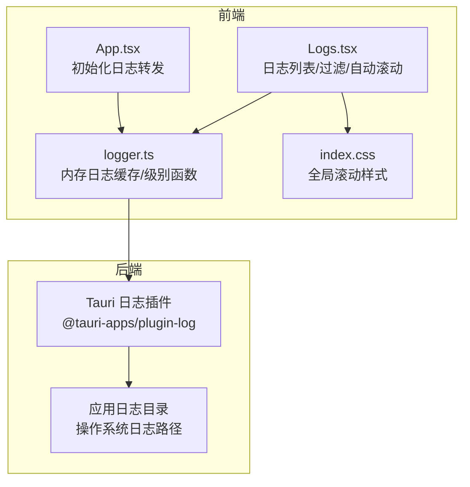
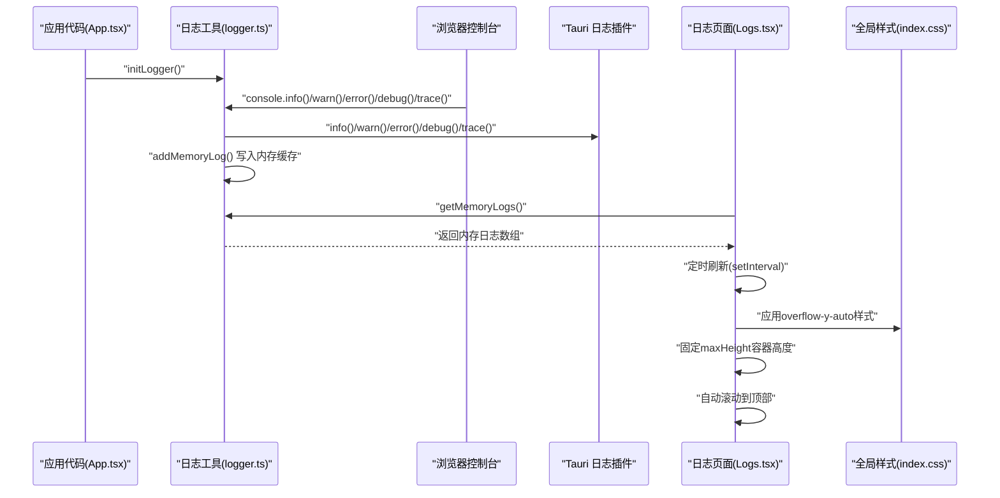
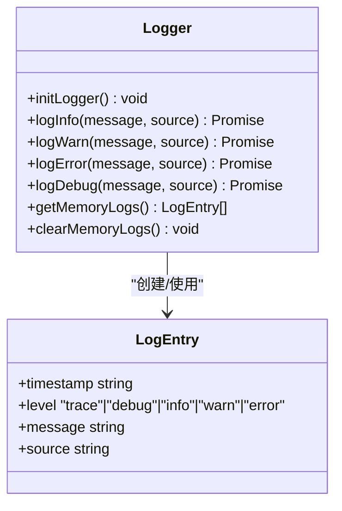
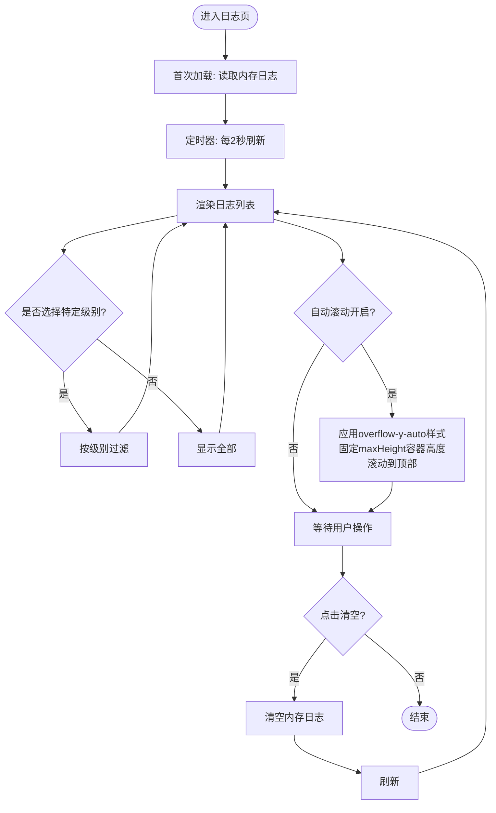
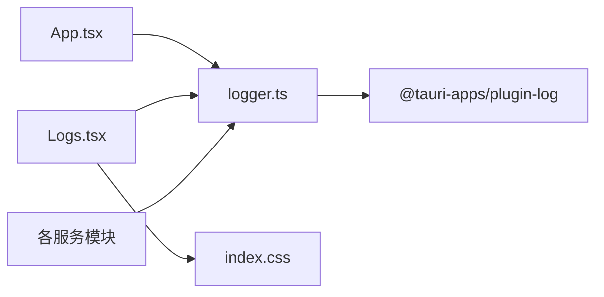

# 日志系统

<cite>
**本文引用的文件**
- [logger.ts](file://src/utils/logger.ts)
- [Logs.tsx](file://src/routes/Logs.tsx)
- [App.tsx](file://src/App.tsx)
- [database.ts](file://src/services/database.ts)
- [medicationReminder.ts](file://src/services/medicationReminder.ts)
- [itemService.ts](file://src/services/itemService.ts)
- [medicineService.ts](file://src/services/medicineService.ts)
- [Cargo.lock](file://src-tauri/Cargo.lock)
- [tauri.conf.json](file://src-tauri/tauri.conf.json)
- [index.css](file://src/index.css)
</cite>

## 更新摘要
**变更内容**
- 更新日志界面滚动行为说明，增强overflow-y-auto样式实现平滑滚动
- 添加固定容器高度的样式配置说明
- 更新自动滚动机制的实现细节
- 补充滚动性能优化策略

## 目录
1. [简介](#简介)
2. [项目结构](#项目结构)
3. [核心组件](#核心组件)
4. [架构总览](#架构总览)
5. [详细组件分析](#详细组件分析)
6. [依赖关系分析](#依赖关系分析)
7. [性能考量](#性能考量)
8. [故障排查指南](#故障排查指南)
9. [结论](#结论)
10. [附录：API 使用示例与最佳实践](#附录api-使用示例与最佳实践)

## 简介
本文件系统性梳理 Assetly 的日志系统，覆盖以下方面：
- 结构化日志记录机制：日志级别、格式、时间戳与来源字段
- 前端日志查看：列表渲染、过滤搜索、自动刷新与平滑滚动
- 性能优化策略：内存限制、轮转与存储策略建议
- 持久化与备份：Tauri 日志插件与应用日志目录
- 分析与调试：指标监控、异常追踪、性能分析
- API 使用示例与故障诊断

## 项目结构
日志系统由三部分组成：
- 前端日志工具：负责内存缓存、级别与格式化、转发控制台输出
- 前端日志页面：负责展示、过滤、清空与自动滚动
- 后端日志插件：通过 Tauri 插件将日志写入应用日志目录

**图表来源**
- [App.tsx:18-27](file://src/App.tsx#L18-L27)
- [logger.ts:1-25](file://src/utils/logger.ts#L1-L25)
- [logger.ts:57-83](file://src/utils/logger.ts#L57-L83)
- [Logs.tsx:14-47](file://src/routes/Logs.tsx#L14-L47)
- [index.css:20-57](file://src/index.css#L20-L57)
- [Cargo.lock:99-104](file://src-tauri/Cargo.lock#L99-L104)

**章节来源**
- [App.tsx:18-27](file://src/App.tsx#L18-L27)
- [logger.ts:1-25](file://src/utils/logger.ts#L1-L25)
- [logger.ts:57-83](file://src/utils/logger.ts#L57-L83)
- [Logs.tsx:14-47](file://src/routes/Logs.tsx#L14-L47)
- [index.css:20-57](file://src/index.css#L20-L57)
- [Cargo.lock:99-104](file://src-tauri/Cargo.lock#L99-L104)

## 核心组件
- 日志工具（logger.ts）
  - 初始化：将浏览器 console 的 log/debug/info/warn/error 转发到 Tauri 日志插件
  - 结构化条目：包含时间戳、级别、消息、可选来源
  - 内存缓存：最多保留固定数量的日志条目，避免无限增长
  - 提供统一的日志接口：logInfo/logWarn/logError/logDebug
- 日志页面（Logs.tsx）
  - 展示内存中的日志，支持按级别过滤
  - 自动刷新：定时从内存读取最新日志
  - 平滑滚动：增强的滚动行为，添加overflow-y-auto样式实现平滑滚动
  - 固定容器高度：使用maxHeight样式保持固定容器高度
  - 清空按钮：清空内存日志并刷新
  - 时间格式化：本地化显示时分秒与毫秒
- 应用入口（App.tsx）
  - 启动时调用初始化函数，并记录应用生命周期事件
- 全局样式（index.css）
  - 统一的滚动条样式，隐藏移动端滚动条
  - 桌面端滚动条美化
  - 全局滚动行为优化

**章节来源**
- [logger.ts:1-25](file://src/utils/logger.ts#L1-L25)
- [logger.ts:35-40](file://src/utils/logger.ts#L35-L40)
- [logger.ts:42-55](file://src/utils/logger.ts#L42-L55)
- [logger.ts:57-83](file://src/utils/logger.ts#L57-L83)
- [Logs.tsx:14-47](file://src/routes/Logs.tsx#L14-L47)
- [Logs.tsx:37-47](file://src/routes/Logs.tsx#L37-L47)
- [Logs.tsx:104-141](file://src/routes/Logs.tsx#L104-L141)
- [App.tsx:18-27](file://src/App.tsx#L18-L27)
- [index.css:20-57](file://src/index.css#L20-L57)

## 架构总览
日志从应用代码或控制台产生，经由前端日志工具写入内存缓存，并同时写入 Tauri 日志插件；前端日志页面定时拉取内存缓存进行展示，具备增强的滚动行为和固定容器高度。

**图表来源**
- [App.tsx:18-27](file://src/App.tsx#L18-L27)
- [logger.ts:7-25](file://src/utils/logger.ts#L7-L25)
- [logger.ts:45-55](file://src/utils/logger.ts#L45-L55)
- [logger.ts:77-79](file://src/utils/logger.ts#L77-L79)
- [Logs.tsx:21-29](file://src/routes/Logs.tsx#L21-L29)
- [Logs.tsx:31-35](file://src/routes/Logs.tsx#L31-L35)
- [Logs.tsx:104-108](file://src/routes/Logs.tsx#L104-L108)
- [index.css:20-57](file://src/index.css#L20-L57)

## 详细组件分析

### 组件一：日志工具（logger.ts）
- 功能要点
  - 控制台转发：拦截 console 的各级别方法，将拼接后的字符串转发给对应日志级别
  - 结构化条目：统一的 LogEntry 接口，包含时间戳、级别、消息、来源
  - 内存缓存：先进先出地维护固定上限的日志队列，超出容量时丢弃最旧条目
  - 级别函数：logInfo/logWarn/logError/logDebug 包装内存缓存与插件写入
  - 查询与清空：提供获取与清空内存日志的方法
- 数据结构与复杂度
  - 内存日志数组：插入 O(1)，删除尾部 O(1)，整体空间 O(N)
  - 过滤与渲染：前端按需过滤，复杂度与展示条数线性相关
- 错误处理
  - 控制台转发中对插件调用进行容错处理，避免影响业务逻辑
- 性能影响
  - 内存上限控制防止内存膨胀
  - 插件写入为异步操作，避免阻塞主线程

**图表来源**
- [logger.ts:7-25](file://src/utils/logger.ts#L7-L25)
- [logger.ts:35-40](file://src/utils/logger.ts#L35-L40)
- [logger.ts:45-55](file://src/utils/logger.ts#L45-L55)
- [logger.ts:57-83](file://src/utils/logger.ts#L57-L83)

**章节来源**
- [logger.ts:1-25](file://src/utils/logger.ts#L1-L25)
- [logger.ts:35-40](file://src/utils/logger.ts#L35-L40)
- [logger.ts:42-55](file://src/utils/logger.ts#L42-L55)
- [logger.ts:57-83](file://src/utils/logger.ts#L57-L83)

### 组件二：日志页面（Logs.tsx）
- 功能要点
  - 列表渲染：按级别配置渲染不同颜色与图标，显示级别、时间、来源与消息
  - 过滤搜索：支持按级别筛选，统计各级别数量
  - 自动刷新：定时从内存读取日志，保持界面实时更新
  - 平滑滚动：增强的滚动行为，添加overflow-y-auto样式实现平滑滚动
  - 固定容器高度：使用maxHeight样式保持固定容器高度，提升用户体验
  - 自动滚动：开启时始终滚动至顶部
  - 清空日志：一键清空内存日志并刷新
  - 时间格式化：本地化显示时分秒与毫秒
- 处理流程
  - 首次加载与定时刷新：从内存获取日志并设置状态
  - 过滤：根据选择的级别过滤内存日志
  - 渲染：遍历过滤后的日志生成列表项
  - 清空：调用清空函数并刷新
  - 滚动优化：通过useEffect监听日志变化，实现平滑滚动到顶部

**更新** 增强了滚动行为，添加overflow-y-auto样式以实现平滑滚动，保持固定容器高度

**图表来源**
- [Logs.tsx:21-29](file://src/routes/Logs.tsx#L21-L29)
- [Logs.tsx:31-35](file://src/routes/Logs.tsx#L31-L35)
- [Logs.tsx:37-47](file://src/routes/Logs.tsx#L37-L47)
- [Logs.tsx:104-141](file://src/routes/Logs.tsx#L104-L141)

**章节来源**
- [Logs.tsx:14-47](file://src/routes/Logs.tsx#L14-L47)
- [Logs.tsx:81-101](file://src/routes/Logs.tsx#L81-L101)
- [Logs.tsx:104-141](file://src/routes/Logs.tsx#L104-L141)

### 组件三：应用入口与生命周期日志（App.tsx）
- 功能要点
  - 启动时初始化日志转发
  - 记录应用启动与关闭事件，便于定位生命周期问题
- 关键点
  - 在副作用中调用初始化与记录
  - 清理阶段记录关闭事件

**章节来源**
- [App.tsx:18-27](file://src/App.tsx#L18-L27)

### 组件四：全局样式与滚动优化（index.css）
- 功能要点
  - 统一的滚动条样式，隐藏移动端滚动条
  - 桌面端滚动条美化
  - 全局滚动行为优化
  - 支持overflow-y-auto样式
- 关键点
  - 移动端隐藏滚动条，提升视觉一致性
  - 桌面端提供美观的滚动条样式
  - 全局滚动行为优化，提升滚动体验

**章节来源**
- [index.css:20-57](file://src/index.css#L20-L57)

### 组件五：服务层日志使用示例
- 数据库服务：连接、迁移过程的关键节点均记录日志
- 用药提醒服务：权限检查、定时检查、通知发送、错误捕获均有日志
- 物品与药品服务：创建、删除等关键操作记录日志

**章节来源**
- [database.ts:8-16](file://src/services/database.ts#L8-L16)
- [database.ts:18-31](file://src/services/database.ts#L18-L31)
- [medicationReminder.ts:53-97](file://src/services/medicationReminder.ts#L53-L97)
- [itemService.ts:75-76](file://src/services/itemService.ts#L75-L76)
- [itemService.ts:124-125](file://src/services/itemService.ts#L124-L125)
- [medicineService.ts:92-93](file://src/services/medicineService.ts#L92-L93)

## 依赖关系分析
- 前端日志工具依赖 Tauri 日志插件
- 前端日志页面依赖日志工具提供的内存日志接口
- 前端日志页面依赖全局样式提供的滚动优化
- 应用入口在启动时初始化日志工具
- 多个服务模块在关键节点调用日志工具记录运行状态

**图表来源**
- [App.tsx:16](file://src/App.tsx#L16)
- [logger.ts:1](file://src/utils/logger.ts#L1)
- [Logs.tsx:4](file://src/routes/Logs.tsx#L4)
- [index.css:20](file://src/index.css#L20)

**章节来源**
- [App.tsx:16](file://src/App.tsx#L16)
- [logger.ts:1](file://src/utils/logger.ts#L1)
- [Logs.tsx:4](file://src/routes/Logs.tsx#L4)
- [index.css:20](file://src/index.css#L20)

## 性能考量
- 内存限制
  - 内置最大日志条目上限，避免内存无限增长
- 刷新频率
  - 页面定时刷新间隔适中，兼顾实时性与性能
- 异步写入
  - 插件写入为异步，不影响主线程
- 滚动性能优化
  - 增强的overflow-y-auto样式实现平滑滚动
  - 固定maxHeight容器高度，避免布局抖动
  - 自动滚动机制优化，减少不必要的DOM操作
- 存储与轮转
  - 当前实现仅使用内存缓存，未见文件轮转与磁盘持久化策略
  - 建议：结合 Tauri 日志插件能力，配置文件轮转与大小限制，避免日志文件过大
- 清理策略
  - 支持手动清空内存日志，建议增加自动清理阈值与策略
- 并发与抖动
  - 控制台转发已做容错处理，避免异常导致业务中断
  - 滚动优化减少滚动过程中的性能抖动

**更新** 新增滚动性能优化策略，包括平滑滚动和固定容器高度

**章节来源**
- [logger.ts:42-55](file://src/utils/logger.ts#L42-L55)
- [logger.ts:77-83](file://src/utils/logger.ts#L77-L83)
- [Logs.tsx:27-29](file://src/routes/Logs.tsx#L27-L29)
- [Logs.tsx:31-35](file://src/routes/Logs.tsx#L31-L35)
- [Logs.tsx:104-108](file://src/routes/Logs.tsx#L104-L108)
- [index.css:20-57](file://src/index.css#L20-L57)

## 故障排查指南
- 无法看到日志
  - 确认应用已初始化日志转发
  - 检查页面是否正常定时刷新
  - 尝试清空日志后重新触发业务动作
- 日志过多导致卡顿
  - 调整过滤级别，优先查看 error/warn
  - 减少刷新频率或关闭自动刷新
- 日志缺失
  - 确认控制台输出已被转发（例如使用 console.error 等）
  - 检查插件是否可用（Tauri 环境）
- 滚动问题
  - 检查overflow-y-auto样式是否正确应用
  - 确认maxHeight容器高度设置合理
  - 验证自动滚动功能是否正常工作
- 应用生命周期问题
  - 查看应用启动/关闭日志，确认生命周期事件是否按预期发生

**更新** 新增滚动问题排查指南

**章节来源**
- [App.tsx:18-27](file://src/App.tsx#L18-L27)
- [Logs.tsx:21-29](file://src/routes/Logs.tsx#L21-L29)
- [logger.ts:7-25](file://src/utils/logger.ts#L7-L25)
- [Logs.tsx:104-108](file://src/routes/Logs.tsx#L104-L108)

## 结论
Assetly 的日志系统采用"前端内存缓存 + Tauri 插件"的轻量方案，实现了结构化、可过滤、可自动刷新的日志查看体验。通过在关键业务节点记录日志，有助于快速定位问题。最新的界面改进增强了滚动行为，添加overflow-y-auto样式以实现平滑滚动，保持固定容器高度，显著提升了用户体验。建议后续引入文件轮转与磁盘持久化策略，完善长期运行场景下的日志管理能力。

## 附录：API 使用示例与最佳实践

### API 使用示例
- 初始化日志转发
  - 在应用启动时调用初始化函数
  - 参考路径：[App.tsx:18-27](file://src/App.tsx#L18-L27)
- 记录日志
  - 使用统一接口记录 info/warn/error/debug
  - 参考路径：[logger.ts:57-83](file://src/utils/logger.ts#L57-L83)
- 在服务层记录关键事件
  - 数据库连接、迁移、错误
  - 用药提醒权限、检查、通知发送
  - 物品与药品的创建/删除
  - 参考路径：
    - [database.ts:8-16](file://src/services/database.ts#L8-L16)
    - [medicationReminder.ts:53-97](file://src/services/medicationReminder.ts#L53-L97)
    - [itemService.ts:75-76](file://src/services/itemService.ts#L75-L76)
    - [itemService.ts:124-125](file://src/services/itemService.ts#L124-L125)
    - [medicineService.ts:92-93](file://src/services/medicineService.ts#L92-L93)

### 最佳实践
- 结构化日志
  - 固定字段：时间戳、级别、消息、来源
  - 来源字段用于区分模块（如 Database、MedicationReminder、ItemService）
- 关键指标监控
  - 统计 error/warn 数量与趋势，结合页面过滤进行定向排查
- 异常追踪
  - 对异常分支记录 error，并附带上下文信息（如 SQL 片段、参数）
- 性能分析
  - 使用 debug/info 记录耗时操作与关键路径，避免生产环境过度打印
- 滚动优化
  - 使用overflow-y-auto样式实现平滑滚动
  - 设置合理的maxHeight容器高度
  - 优化自动滚动机制，减少性能开销
- 存储与轮转
  - 建议启用 Tauri 日志插件的文件轮转与大小限制，避免日志文件过大
- 备份与恢复
  - 定期备份应用日志目录，确保故障后可回溯