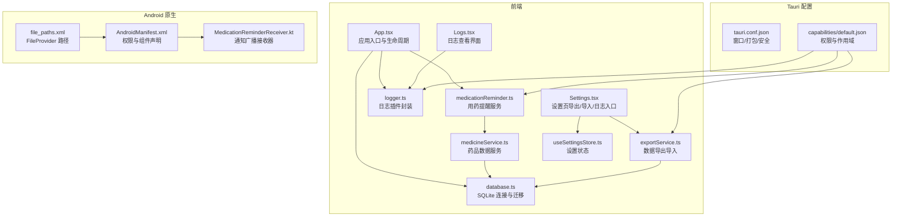
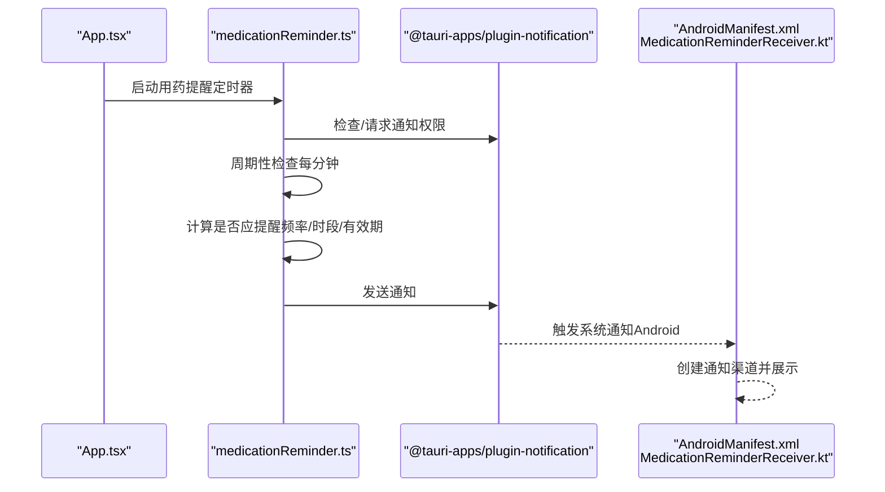
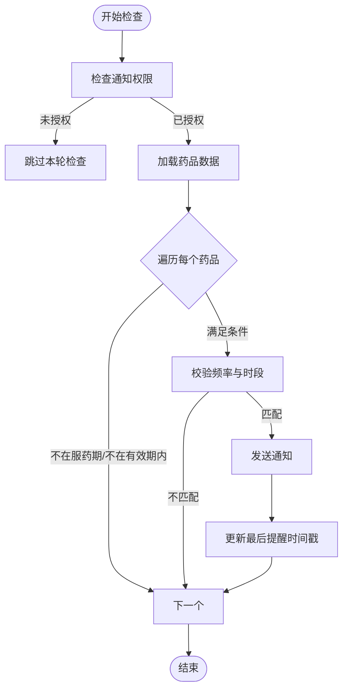
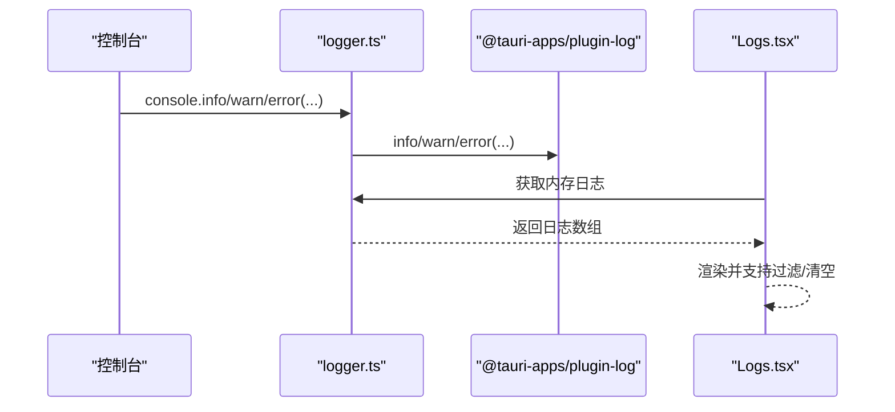
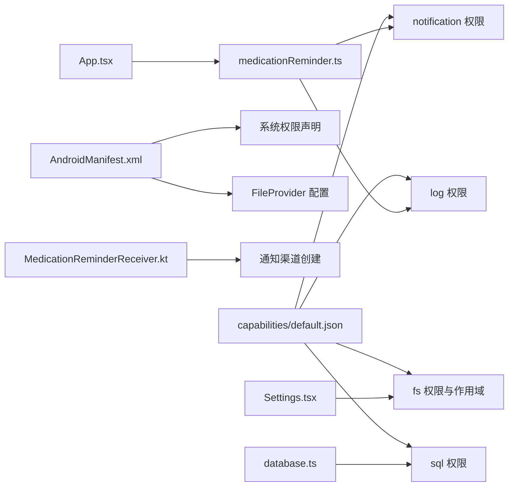
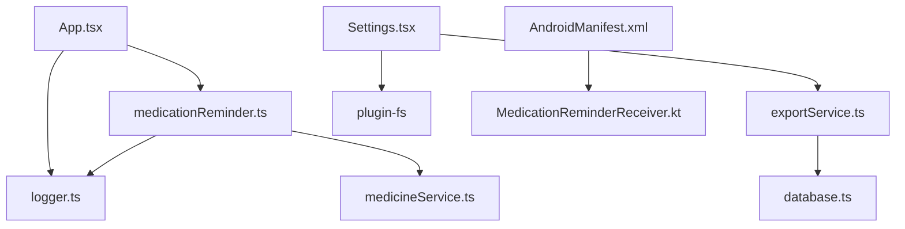

# 系统集成

<cite>
**本文引用的文件**
- [src/services/medicationReminder.ts](file://src/services/medicationReminder.ts)
- [src/services/medicineService.ts](file://src/services/medicineService.ts)
- [src/services/exportService.ts](file://src/services/exportService.ts)
- [src/services/database.ts](file://src/services/database.ts)
- [src/utils/logger.ts](file://src/utils/logger.ts)
- [src/utils/constants.ts](file://src/utils/constants.ts)
- [src/routes/Logs.tsx](file://src/routes/Logs.tsx)
- [src/routes/Settings.tsx](file://src/routes/Settings.tsx)
- [src/stores/useSettingsStore.ts](file://src/stores/useSettingsStore.ts)
- [src/App.tsx](file://src/App.tsx)
- [src-tauri/tauri.conf.json](file://src-tauri/tauri.conf.json)
- [src-tauri/capabilities/default.json](file://src-tauri/capabilities/default.json)
- [src-tauri/src/main.rs](file://src-tauri/src/main.rs)
- [src-tauri/gen/android/app/src/main/java/com/assetly/home/MedicationReminderReceiver.kt](file://src-tauri/gen/android/app/src/main/java/com/assetly/home/MedicationReminderReceiver.kt)
- [src-tauri/gen/android/app/src/main/AndroidManifest.xml](file://src-tauri/gen/android/app/src/main/AndroidManifest.xml)
- [src-tauri/gen/android/app/src/main/res/xml/file_paths.xml](file://src-tauri/gen/android/app/src/main/res/xml/file_paths.xml)
</cite>

## 目录
1. [简介](#简介)
2. [项目结构](#项目结构)
3. [核心组件](#核心组件)
4. [架构总览](#架构总览)
5. [详细组件分析](#详细组件分析)
6. [依赖关系分析](#依赖关系分析)
7. [性能考量](#性能考量)
8. [故障排查指南](#故障排查指南)
9. [结论](#结论)
10. [附录](#附录)

## 简介
本文件聚焦 Assetly 的系统集成功能，围绕以下方面展开：通知系统（含用药提醒触发逻辑、Android 原生通知渠道与系统级推送）、文件系统集成（数据导出导入、文件分享机制与跨平台文件操作）、日志系统（结构化日志记录、日志级别管理与日志查看界面）、Tauri 插件生态（权限配置、API 调用与平台特定功能）。文档同时提供最佳实践与安全建议，帮助开发者与运维人员理解并维护系统集成层。

## 项目结构
项目采用前端（React + Vite）与后端（Rust/Tauri）混合架构，核心业务逻辑位于前端，通过 Tauri 插件访问系统能力（通知、日志、文件系统、SQL 数据库等）。Android 平台通过原生广播接收器实现系统级推送通道。



**图表来源**
- [src/App.tsx:18-27](file://src/App.tsx#L18-L27)
- [src/services/medicationReminder.ts:53-97](file://src/services/medicationReminder.ts#L53-L97)
- [src/utils/logger.ts:7-25](file://src/utils/logger.ts#L7-L25)
- [src/services/exportService.ts:4-44](file://src/services/exportService.ts#L4-L44)
- [src/services/database.ts:8-16](file://src/services/database.ts#L8-L16)
- [src/services/medicineService.ts:10-37](file://src/services/medicineService.ts#L10-L37)
- [src/routes/Settings.tsx:23-93](file://src/routes/Settings.tsx#L23-L93)
- [src/routes/Logs.tsx:21-29](file://src/routes/Logs.tsx#L21-L29)
- [src-tauri/tauri.conf.json:1-40](file://src-tauri/tauri.conf.json#L1-L40)
- [src-tauri/capabilities/default.json:1-37](file://src-tauri/capabilities/default.json#L1-L37)
- [src-tauri/gen/android/app/src/main/AndroidManifest.xml:1-49](file://src-tauri/gen/android/app/src/main/AndroidManifest.xml#L1-L49)
- [src-tauri/gen/android/app/src/main/java/com/assetly/home/MedicationReminderReceiver.kt:12-66](file://src-tauri/gen/android/app/src/main/java/com/assetly/home/MedicationReminderReceiver.kt#L12-L66)
- [src-tauri/gen/android/app/src/main/res/xml/file_paths.xml:1-6](file://src-tauri/gen/android/app/src/main/res/xml/file_paths.xml#L1-L6)

**章节来源**
- [src/App.tsx:18-27](file://src/App.tsx#L18-L27)
- [src-tauri/tauri.conf.json:1-40](file://src-tauri/tauri.conf.json#L1-L40)
- [src-tauri/capabilities/default.json:1-37](file://src-tauri/capabilities/default.json#L1-L37)

## 核心组件
- 通知系统：前端周期性检查并请求系统通知权限；Android 侧通过广播接收器创建通知渠道并展示系统通知。
- 文件系统集成：设置页支持移动端“分享导出”与桌面端浏览器下载；导入时进行 JSON 校验与批量写入。
- 日志系统：统一转发 console 到 Tauri 日志插件，内存缓存最近日志并在 UI 中展示。
- Tauri 插件生态：权限清单定义 fs/sql/notification/log 的能力范围与作用域，Android Manifest 声明必要权限与 FileProvider。

**章节来源**
- [src/services/medicationReminder.ts:53-97](file://src/services/medicationReminder.ts#L53-L97)
- [src-tauri/gen/android/app/src/main/java/com/assetly/home/MedicationReminderReceiver.kt:20-66](file://src-tauri/gen/android/app/src/main/java/com/assetly/home/MedicationReminderReceiver.kt#L20-L66)
- [src/routes/Settings.tsx:23-93](file://src/routes/Settings.tsx#L23-L93)
- [src/utils/logger.ts:7-25](file://src/utils/logger.ts#L7-L25)
- [src-tauri/capabilities/default.json:6-35](file://src-tauri/capabilities/default.json#L6-L35)

## 架构总览
下图展示从应用启动到系统通知与文件操作的关键交互路径。



**图表来源**
- [src/App.tsx:22-26](file://src/App.tsx#L22-L26)
- [src/services/medicationReminder.ts:53-97](file://src/services/medicationReminder.ts#L53-L97)
- [src-tauri/gen/android/app/src/main/AndroidManifest.xml:42-46](file://src-tauri/gen/android/app/src/main/AndroidManifest.xml#L42-L46)
- [src-tauri/gen/android/app/src/main/java/com/assetly/home/MedicationReminderReceiver.kt:20-66](file://src-tauri/gen/android/app/src/main/java/com/assetly/home/MedicationReminderReceiver.kt#L20-L66)

## 详细组件分析

### 通知系统与用药提醒
- 触发逻辑
  - 权限检查与请求：首次运行自动检查并尝试请求通知权限，若未授予则跳过提醒。
  - 频率与时段：支持每日、每隔 N 天、每周（按周几列表）三种频率；仅在设定的小时:分钟时刻触发。
  - 有效期与服药期：仅在有效期内且“正在服用”标记为真时参与提醒。
  - 去抖：最近一次检查时间距当前不足约 50 秒则跳过，避免重复提醒。
- Android 系统级推送
  - 在 AndroidManifest 中注册广播接收器，并在接收器中创建通知渠道与展示通知。
  - 使用 PendingIntent 打开主界面，启用振动与高优先级提示。
- 行为与清理
  - 定时器每 60 秒执行一次检查；应用卸载或关闭时清理定时器。



**图表来源**
- [src/services/medicationReminder.ts:53-97](file://src/services/medicationReminder.ts#L53-L97)
- [src/services/medicineService.ts:10-37](file://src/services/medicineService.ts#L10-L37)

**章节来源**
- [src/services/medicationReminder.ts:11-48](file://src/services/medicationReminder.ts#L11-L48)
- [src/services/medicationReminder.ts:53-97](file://src/services/medicationReminder.ts#L53-L97)
- [src-tauri/gen/android/app/src/main/java/com/assetly/home/MedicationReminderReceiver.kt:20-66](file://src-tauri/gen/android/app/src/main/java/com/assetly/home/MedicationReminderReceiver.kt#L20-L66)

### 文件系统集成：数据导出导入与分享
- 导出
  - JSON：聚合分类、位置、物品、药品表，返回格式化 JSON 字符串。
  - CSV：通过联表查询生成中文列头与转义处理，返回逗号分隔文本。
- 导入
  - 解析 JSON，逐条插入或替换 categories/locations/items/medicines。
  - 对异常进行计数与错误收集，保证部分导入仍可继续。
- 分享与下载
  - 移动端优先尝试调用 Android 原生分享接口；若不可用则回退至 Web Share API；均失败则通过浏览器下载。
  - 桌面端直接触发浏览器下载。
- 跨平台文件操作
  - 通过 @tauri-apps/plugin-fs 写入 AppData 目录下的 exports 子目录，再由 Android 层发起分享。

```mermaid
sequenceDiagram
participant UI as "Settings.tsx"
participant Exp as "exportService.ts"
participant FS as "@tauri-apps/plugin-fs"
participant And as "Android 原生分享"
UI->>Exp : 导出 JSON
Exp-->>UI : 返回 JSON 字符串
UI->>FS : 写入 AppData/exports/*.json
UI->>And : 调用 Android.shareFile(...)
And-->>UI : 打开系统分享面板
```

**图表来源**
- [src/routes/Settings.tsx:23-93](file://src/routes/Settings.tsx#L23-L93)
- [src/services/exportService.ts:4-44](file://src/services/exportService.ts#L4-L44)
- [src-tauri/gen/android/app/src/main/AndroidManifest.xml:32-40](file://src-tauri/gen/android/app/src/main/AndroidManifest.xml#L32-L40)

**章节来源**
- [src/services/exportService.ts:4-44](file://src/services/exportService.ts#L4-L44)
- [src/routes/Settings.tsx:23-93](file://src/routes/Settings.tsx#L23-L93)

### 日志系统：结构化记录、级别管理与查看
- 结构化日志
  - 统一将 console.log/debug/info/warn/error 转发至 @tauri-apps/plugin-log。
  - 内存中维护固定长度（默认 500 条）的日志队列，包含时间戳、级别、消息与来源。
- 级别管理
  - 提供 info/warn/error/debug 四类异步记录方法，内部统一包装。
- 日志查看
  - Logs 页面定时刷新内存日志，支持按级别过滤、自动滚动与清空。
  - 显示最近条目数量与完整日志文件所在目录提示。



**图表来源**
- [src/utils/logger.ts:7-25](file://src/utils/logger.ts#L7-L25)
- [src/routes/Logs.tsx:21-29](file://src/routes/Logs.tsx#L21-L29)

**章节来源**
- [src/utils/logger.ts:57-83](file://src/utils/logger.ts#L57-L83)
- [src/routes/Logs.tsx:6-149](file://src/routes/Logs.tsx#L6-L149)

### Tauri 插件生态：权限、API 与平台特性
- 权限配置
  - capabilities/default.json 声明 core/opener/sql/fs/notification/log 等权限，并限定 fs 作用域为 $APPDATA/**、$APPDATA/exports/**、$RESOURCE/**、$DOWNLOAD/**。
  - AndroidManifest.xml 声明 INTERNET、READ/WRITE_EXTERNAL_STORAGE、POST_NOTIFICATIONS、RECEIVE_BOOT_COMPLETED、FOREGROUND_SERVICE 等权限。
- API 调用
  - 通知：isPermissionGranted/requestPermission/sendNotification/registerActionTypes。
  - 日志：info/warn/error/debug/trace。
  - 文件系统：writeTextFile（BaseDirectory.AppData），配合 Android FileProvider。
  - SQL：Database.load 与 select/execute。
- 平台特性
  - Android 通知渠道：在接收器中创建高优先级通知渠道并启用振动。
  - 设置持久化：settings 表用于主题色与货币符号等用户偏好。



**图表来源**
- [src-tauri/capabilities/default.json:6-35](file://src-tauri/capabilities/default.json#L6-L35)
- [src-tauri/gen/android/app/src/main/AndroidManifest.xml:3-8](file://src-tauri/gen/android/app/src/main/AndroidManifest.xml#L3-L8)
- [src-tauri/gen/android/app/src/main/java/com/assetly/home/MedicationReminderReceiver.kt:28-43](file://src-tauri/gen/android/app/src/main/java/com/assetly/home/MedicationReminderReceiver.kt#L28-L43)
- [src/App.tsx:22-26](file://src/App.tsx#L22-L26)
- [src/routes/Settings.tsx:34-54](file://src/routes/Settings.tsx#L34-L54)
- [src/services/database.ts:8-16](file://src/services/database.ts#L8-L16)

**章节来源**
- [src-tauri/capabilities/default.json:6-35](file://src-tauri/capabilities/default.json#L6-L35)
- [src-tauri/gen/android/app/src/main/AndroidManifest.xml:3-8](file://src-tauri/gen/android/app/src/main/AndroidManifest.xml#L3-L8)
- [src-tauri/gen/android/app/src/main/res/xml/file_paths.xml:1-6](file://src-tauri/gen/android/app/src/main/res/xml/file_paths.xml#L1-L6)

## 依赖关系分析
- 组件耦合
  - App.tsx 作为入口，初始化日志与启动提醒，耦合度低但影响全局生命周期。
  - medicationReminder.ts 依赖 medicineService.ts 查询药品数据，依赖 logger.ts 记录日志。
  - Settings.tsx 依赖 exportService.ts 与 @tauri-apps/plugin-fs 实现导出/导入与分享。
  - Android 侧通过 Manifest 与 Receiver 与前端通知插件协同工作。
- 外部依赖
  - Tauri 插件：notification、log、fs、sql。
  - Android 原生：NotificationChannel、BroadcastReceiver、FileProvider。



**图表来源**
- [src/App.tsx:18-27](file://src/App.tsx#L18-L27)
- [src/services/medicationReminder.ts:1-4](file://src/services/medicationReminder.ts#L1-L4)
- [src/services/medicineService.ts:1-4](file://src/services/medicineService.ts#L1-L4)
- [src/routes/Settings.tsx:5-8](file://src/routes/Settings.tsx#L5-L8)
- [src/services/exportService.ts:1](file://src/services/exportService.ts#L1)
- [src/services/database.ts:1](file://src/services/database.ts#L1)
- [src-tauri/gen/android/app/src/main/AndroidManifest.xml:42-46](file://src-tauri/gen/android/app/src/main/AndroidManifest.xml#L42-L46)
- [src-tauri/gen/android/app/src/main/java/com/assetly/home/MedicationReminderReceiver.kt:12](file://src-tauri/gen/android/app/src/main/java/com/assetly/home/MedicationReminderReceiver.kt#L12)

**章节来源**
- [src/App.tsx:18-27](file://src/App.tsx#L18-L27)
- [src/services/medicationReminder.ts:1-4](file://src/services/medicationReminder.ts#L1-L4)
- [src/routes/Settings.tsx:5-8](file://src/routes/Settings.tsx#L5-L8)

## 性能考量
- 通知检查频率
  - 默认每 60 秒检查一次，建议根据设备性能与电池策略调整间隔，避免频繁唤醒。
- 日志内存占用
  - 内存日志上限 500 条，建议在长时间运行场景下定期持久化或限制级别输出。
- 导入性能
  - 批量写入采用逐条 INSERT OR REPLACE，建议在大数据量时考虑事务包裹以提升吞吐。
- Android 通知
  - 通知渠道创建在接收器中执行，注意避免重复创建；保持 IMPORTANCE_HIGH 与振动策略一致。

[本节为通用指导，无需列出具体文件来源]

## 故障排查指南
- 通知未显示
  - 检查通知权限是否授予；确认 AndroidManifest 是否声明 POST_NOTIFICATIONS；核对通知渠道是否创建成功。
- 导出/导入失败
  - 导出失败：检查 AppData 目录写入权限与文件名合法性；移动端回退链路是否生效。
  - 导入失败：确认 JSON 格式正确；查看错误集合中的第一条定位问题；确认数据库连接与迁移已完成。
- 日志为空
  - 确认 initLogger 已在应用启动时调用；检查内存日志刷新定时器；确认 Logs 页面已渲染。
- 设置项未持久化
  - 检查 settings 表是否存在；确认写入 SQL 的键名与 JSON 序列化逻辑。

**章节来源**
- [src/services/medicationReminder.ts:55-66](file://src/services/medicationReminder.ts#L55-L66)
- [src-tauri/gen/android/app/src/main/AndroidManifest.xml:6](file://src-tauri/gen/android/app/src/main/AndroidManifest.xml#L6)
- [src/routes/Settings.tsx:132-146](file://src/routes/Settings.tsx#L132-L146)
- [src/utils/logger.ts:7-25](file://src/utils/logger.ts#L7-L25)
- [src/services/database.ts:18-53](file://src/services/database.ts#L18-L53)

## 结论
Assetly 的系统集成功能以 Tauri 插件为核心，结合前端定时任务与 Android 原生广播接收器，实现了稳定的通知与文件操作体验。日志系统提供了结构化与可视化的可观测性。通过明确的权限配置与作用域约束，兼顾了安全性与可用性。建议在生产环境中进一步优化通知频率、日志持久化与导入事务处理，并持续监控 Android 通知渠道与权限变化。

[本节为总结性内容，无需列出具体文件来源]

## 附录
- 最佳实践
  - 通知：仅在必要时发送，避免过度打扰；为不同动作（已服用/稍后提醒）提供快捷按钮。
  - 文件：导出前进行完整性校验；导入前提供预览与确认对话框；失败时保留原始数据。
  - 日志：在开发环境开启更细粒度日志，在生产环境限制级别；定期归档日志文件。
  - 安全：严格限制 fs 作用域；避免在日志中输出敏感信息；确保 HTTPS 传输与最小权限原则。
- 参考路径
  - 应用入口与生命周期：[src/App.tsx:18-27](file://src/App.tsx#L18-L27)
  - 通知权限与触发：[src/services/medicationReminder.ts:53-97](file://src/services/medicationReminder.ts#L53-L97)
  - Android 通知渠道与接收器：[src-tauri/gen/android/app/src/main/java/com/assetly/home/MedicationReminderReceiver.kt:20-66](file://src-tauri/gen/android/app/src/main/java/com/assetly/home/MedicationReminderReceiver.kt#L20-L66)
  - 数据导出导入：[src/services/exportService.ts:4-44](file://src/services/exportService.ts#L4-L44)
  - 日志记录与查看：[src/utils/logger.ts:57-83](file://src/utils/logger.ts#L57-L83)，[src/routes/Logs.tsx:21-29](file://src/routes/Logs.tsx#L21-L29)
  - 权限与作用域：[src-tauri/capabilities/default.json:6-35](file://src-tauri/capabilities/default.json#L6-L35)
  - Android 权限与 FileProvider：[src-tauri/gen/android/app/src/main/AndroidManifest.xml:3-8](file://src-tauri/gen/android/app/src/main/AndroidManifest.xml#L3-L8)，[src-tauri/gen/android/app/src/main/res/xml/file_paths.xml:1-6](file://src-tauri/gen/android/app/src/main/res/xml/file_paths.xml#L1-L6)

[本节为补充说明，无需列出具体文件来源]