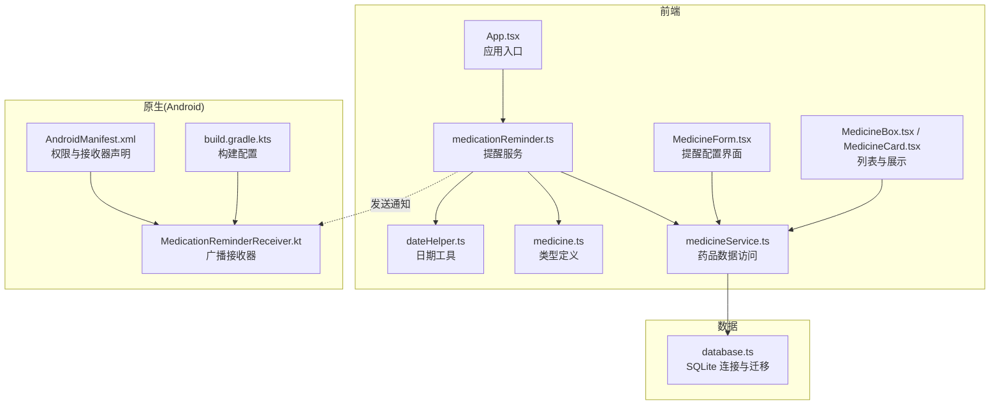
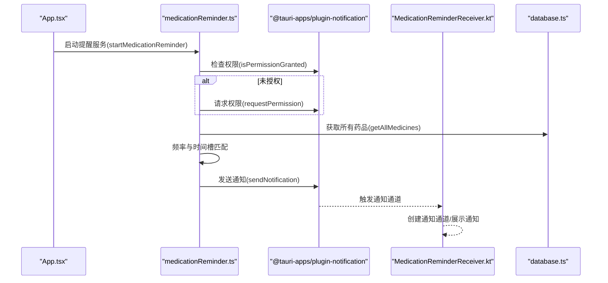
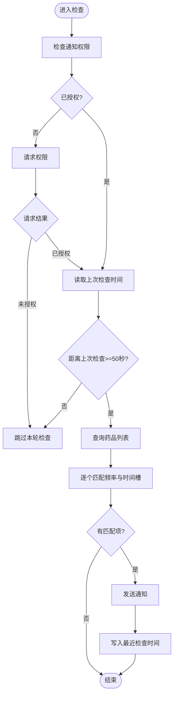
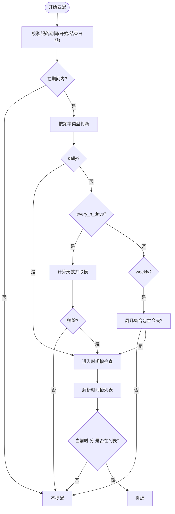
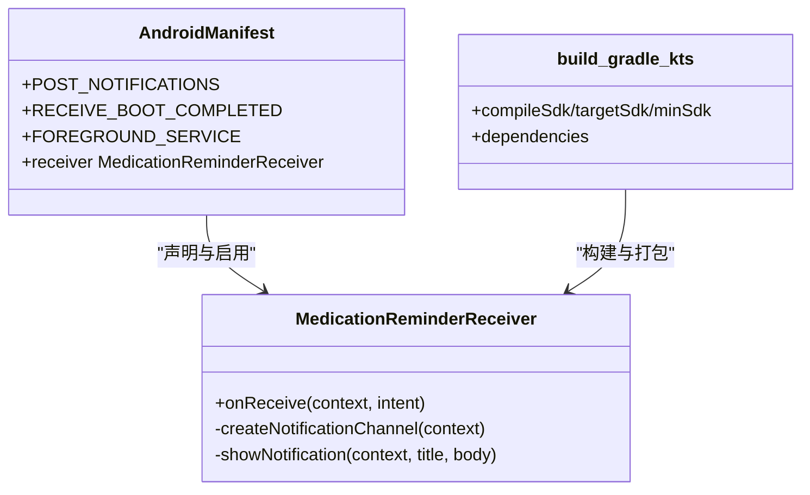
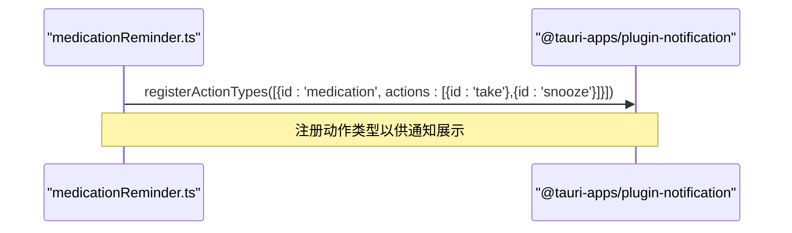
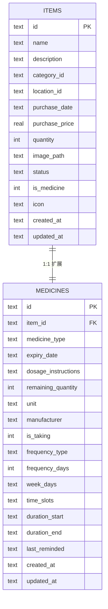
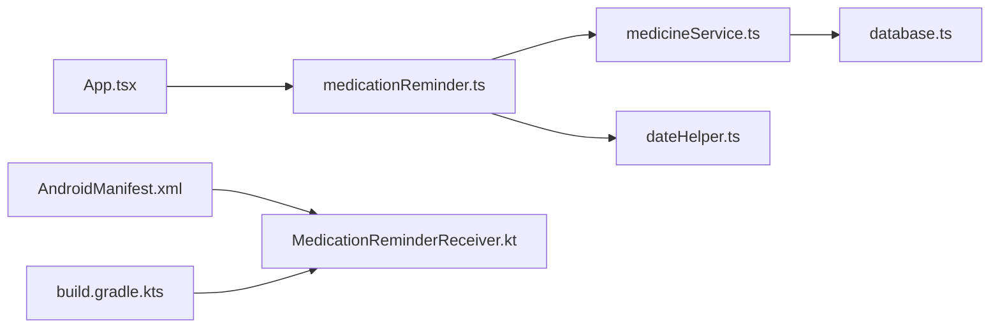

# 通知系统

<cite>
**本文引用的文件**
- [medicationReminder.ts](file://src/services/medicationReminder.ts)
- [MedicationReminderReceiver.kt](file://src-tauri/gen/android/app/src/main/java/com/assetly/home/MedicationReminderReceiver.kt)
- [medicine.ts](file://src/types/medicine.ts)
- [medicineService.ts](file://src/services/medicineService.ts)
- [MedicineForm.tsx](file://src/routes/MedicineForm.tsx)
- [MedicineBox.tsx](file://src/routes/MedicineBox.tsx)
- [MedicineCard.tsx](file://src/components/medicine/MedicineCard.tsx)
- [database.ts](file://src/services/database.ts)
- [App.tsx](file://src/App.tsx)
- [AndroidManifest.xml](file://src-tauri/gen/android/app/src/main/AndroidManifest.xml)
- [build.gradle.kts](file://src-tauri/gen/android/app/build.gradle.kts)
- [dateHelper.ts](file://src/utils/dateHelper.ts)
</cite>

## 目录
1. [简介](#简介)
2. [项目结构](#项目结构)
3. [核心组件](#核心组件)
4. [架构总览](#架构总览)
5. [组件详解](#组件详解)
6. [依赖关系分析](#依赖关系分析)
7. [性能与优化](#性能与优化)
8. [故障排除指南](#故障排除指南)
9. [结论](#结论)

## 简介
本文件系统性梳理 Assetly 的通知系统，聚焦“用药提醒”功能的完整实现：从通知权限检查、频率设置验证（每日、每隔N天、每周）、时间槽匹配逻辑，到 Android 原生通知接收器的实现机制（通知动作类型注册、用户交互响应处理），再到性能优化策略（防重复触发、定时器管理）与最佳实践（权限请求流程、用户拒绝后的降级处理）。文档同时提供关键流程图与时序图，帮助开发者快速理解与维护。

## 项目结构
通知系统由前端 Tauri 插件驱动的 JavaScript 服务层与 Android 原生广播接收器协同组成：
- 前端服务层负责权限检查、频率与时间槽匹配、定时轮询与通知发送。
- Android 层负责通知通道创建、通知展示与动作响应注册。
- 数据层通过 SQLite 存储药品与提醒配置，并在应用启动时自动迁移。

图表来源
- [App.tsx:18-27](file://src/App.tsx#L18-L27)
- [medicationReminder.ts:102-131](file://src/services/medicationReminder.ts#L102-L131)
- [MedicationReminderReceiver.kt:20-66](file://src-tauri/gen/android/app/src/main/java/com/assetly/home/MedicationReminderReceiver.kt#L20-L66)
- [AndroidManifest.xml:6,43-46](file://src-tauri/gen/android/app/src/main/AndroidManifest.xml#L6,L43-L46)
- [database.ts:8-16](file://src/services/database.ts#L8-L16)

章节来源
- [App.tsx:18-27](file://src/App.tsx#L18-L27)
- [medicationReminder.ts:102-131](file://src/services/medicationReminder.ts#L102-L131)
- [MedicationReminderReceiver.kt:20-66](file://src-tauri/gen/android/app/src/main/java/com/assetly/home/MedicationReminderReceiver.kt#L20-L66)
- [AndroidManifest.xml:6,43-46](file://src-tauri/gen/android/app/src/main/AndroidManifest.xml#L6,L43-L46)
- [database.ts:8-16](file://src/services/database.ts#L8-L16)

## 核心组件
- 提醒服务：负责权限检查、频率与时间槽匹配、定时轮询、通知发送与去重。
- 药品服务：提供药品清单查询与更新，承载提醒配置字段。
- 类型定义：统一药品与提醒字段的数据结构。
- Android 接收器：负责通知通道创建、通知展示与动作响应。
- 应用入口：在应用启动时初始化提醒服务并在卸载时清理定时器。

章节来源
- [medicationReminder.ts:53-97](file://src/services/medicationReminder.ts#L53-L97)
- [medicationReminder.ts:102-131](file://src/services/medicationReminder.ts#L102-L131)
- [medicineService.ts:10-37](file://src/services/medicineService.ts#L10-L37)
- [medicine.ts:7-27](file://src/types/medicine.ts#L7-L27)
- [MedicationReminderReceiver.kt:20-66](file://src-tauri/gen/android/app/src/main/java/com/assetly/home/MedicationReminderReceiver.kt#L20-L66)
- [App.tsx:18-27](file://src/App.tsx#L18-L27)

## 架构总览
前端通过 Tauri 插件进行通知权限检查与发送；Android 广播接收器负责通知通道与展示；数据通过 SQLite 存储与迁移。

图表来源
- [App.tsx:18-27](file://src/App.tsx#L18-L27)
- [medicationReminder.ts:53-97](file://src/services/medicationReminder.ts#L53-L97)
- [MedicationReminderReceiver.kt:20-66](file://src-tauri/gen/android/app/src/main/java/com/assetly/home/MedicationReminderReceiver.kt#L20-L66)
- [database.ts:8-16](file://src/services/database.ts#L8-L16)

## 组件详解

### 1) 通知权限检查与去重触发
- 权限检查：首次运行检查通知权限，若未授权则请求；若仍拒绝则跳过本轮检查。
- 去重触发：使用本地存储记录上次检查时间，限制最小检查间隔以避免同一分钟内重复触发。

图表来源
- [medicationReminder.ts:53-97](file://src/services/medicationReminder.ts#L53-L97)

章节来源
- [medicationReminder.ts:53-97](file://src/services/medicationReminder.ts#L53-L97)

### 2) 频率设置验证与时间槽匹配
- 频率类型支持：每日、每隔N天、每周。
  - 每日：直接满足条件。
  - 每隔N天：计算自开始日期或创建日期起的天数，取模判断。
  - 每周：根据周几集合判断当天是否命中。
- 时间槽匹配：将字符串拆分为多个“时:分”，与当前小时/分钟精确匹配。

图表来源
- [medicationReminder.ts:11-48](file://src/services/medicationReminder.ts#L11-L48)

章节来源
- [medicationReminder.ts:11-48](file://src/services/medicationReminder.ts#L11-L48)

### 3) Android 原生通知接收器实现
- 通知通道：在 Android 8+ 创建专用通道，设置重要度与震动模式。
- 通知展示：构建通知内容，设置点击意图跳转到主界面，启用自动取消与震动。
- 动作类型注册：在前端注册“已服用/稍后提醒”两类动作，供 Android 端展示与回调。

图表来源
- [MedicationReminderReceiver.kt:20-66](file://src-tauri/gen/android/app/src/main/java/com/assetly/home/MedicationReminderReceiver.kt#L20-L66)
- [AndroidManifest.xml:6,43-46](file://src-tauri/gen/android/app/src/main/AndroidManifest.xml#L6,L43-L46)
- [build.gradle.kts:16-56](file://src-tauri/gen/android/app/build.gradle.kts#L16-L56)

章节来源
- [MedicationReminderReceiver.kt:20-66](file://src-tauri/gen/android/app/src/main/java/com/assetly/home/MedicationReminderReceiver.kt#L20-L66)
- [AndroidManifest.xml:6,43-46](file://src-tauri/gen/android/app/src/main/AndroidManifest.xml#L6,L43-L46)
- [build.gradle.kts:16-56](file://src-tauri/gen/android/app/build.gradle.kts#L16-L56)

### 4) 用户交互与动作响应
- 前端注册动作类型：在启动提醒服务时注册“medication”动作组，包含“take”“snooze”两个动作。
- Android 接收器：负责通知通道与展示，动作回调由前端插件与应用侧处理（此处为框架职责边界说明）。

图表来源
- [medicationReminder.ts:105-119](file://src/services/medicationReminder.ts#L105-L119)

章节来源
- [medicationReminder.ts:105-119](file://src/services/medicationReminder.ts#L105-L119)

### 5) 数据模型与存储
- 药品与提醒字段：is_taking、frequency_type、frequency_days、week_days、time_slots、duration_start、duration_end、last_reminded。
- 数据库迁移：在应用启动时加载数据库并执行迁移，确保提醒字段存在。

图表来源
- [medicine.ts:7-27](file://src/types/medicine.ts#L7-L27)
- [database.ts:104-117](file://src/services/database.ts#L104-L117)

章节来源
- [medicine.ts:7-27](file://src/types/medicine.ts#L7-L27)
- [database.ts:104-117](file://src/services/database.ts#L104-L117)
- [database.ts:149-160](file://src/services/database.ts#L149-L160)

### 6) 用药提醒配置界面与展示
- 表单界面：支持开启/关闭“正在服用”开关，选择频率类型（每日/每隔N天/每周），设置周几与时间槽，填写服药周期。
- 列表展示：卡片显示频率与时间槽摘要、服药周期等信息，便于核对提醒配置。

章节来源
- [MedicineForm.tsx:260-377](file://src/routes/MedicineForm.tsx#L260-L377)
- [MedicineBox.tsx:18-112](file://src/routes/MedicineBox.tsx#L18-L112)
- [MedicineCard.tsx:22-57](file://src/components/medicine/MedicineCard.tsx#L22-L57)

## 依赖关系分析
- 应用入口依赖提醒服务：在启动时调用启动函数，在卸载时返回的清理函数用于停止定时器。
- 提醒服务依赖通知插件、药品服务与日期工具。
- 药品服务依赖数据库连接与迁移。
- Android 接收器依赖清单声明与构建配置。

图表来源
- [App.tsx:18-27](file://src/App.tsx#L18-L27)
- [medicationReminder.ts:102-131](file://src/services/medicationReminder.ts#L102-L131)
- [medicineService.ts:10-37](file://src/services/medicineService.ts#L10-L37)
- [database.ts:8-16](file://src/services/database.ts#L8-L16)
- [AndroidManifest.xml:43-46](file://src-tauri/gen/android/app/src/main/AndroidManifest.xml#L43-L46)
- [build.gradle.kts:16-56](file://src-tauri/gen/android/app/build.gradle.kts#L16-L56)

章节来源
- [App.tsx:18-27](file://src/App.tsx#L18-L27)
- [medicationReminder.ts:102-131](file://src/services/medicationReminder.ts#L102-L131)
- [medicineService.ts:10-37](file://src/services/medicineService.ts#L10-L37)
- [database.ts:8-16](file://src/services/database.ts#L8-L16)
- [AndroidManifest.xml:43-46](file://src-tauri/gen/android/app/src/main/AndroidManifest.xml#L43-L46)
- [build.gradle.kts:16-56](file://src-tauri/gen/android/app/build.gradle.kts#L16-L56)

## 性能与优化
- 定时器管理
  - 每60秒检查一次，初始立即检查，避免冷启动后首分钟无提醒。
  - 清理函数在组件卸载时停止定时器，防止内存泄漏与后台任务残留。
- 防重复触发
  - 使用本地存储记录上次检查时间，限制最小检查间隔（约50秒），避免同一分钟内重复触发。
- 数据访问优化
  - 仅在需要时查询药品列表，减少不必要的数据库访问。
- Android 通知通道
  - 在接收器中创建通知通道，避免重复创建与权限问题。
- 最佳实践建议
  - 将检查间隔参数化，便于调试与动态调整。
  - 对于大量药品场景，可考虑分批处理或延迟队列。
  - 在应用进入后台时可降低检查频率或暂停定时器，恢复前台后再恢复。

章节来源
- [medicationReminder.ts:121-131](file://src/services/medicationReminder.ts#L121-L131)
- [medicationReminder.ts:72-73](file://src/services/medicationReminder.ts#L72-L73)
- [MedicationReminderReceiver.kt:28-43](file://src-tauri/gen/android/app/src/main/java/com/assetly/home/MedicationReminderReceiver.kt#L28-L43)

## 故障排除指南
- 通知未显示
  - 检查通知权限：确认已在设备上授予通知权限；若未授权，前端会尝试请求，但需用户手动允许。
  - 检查 Android 通知通道：确认清单中声明了通知权限与接收器，并在接收器中正确创建通道。
  - 检查动作类型注册：确认前端已成功注册动作类型，否则 Android 端可能无法展示动作按钮。
- 频繁重复提醒
  - 检查最小检查间隔是否被绕过；确保本地存储的上次检查时间有效。
  - 检查时间槽格式是否正确，避免因解析错误导致的误判。
- 频率设置无效
  - 每隔N天：确认开始日期与频率天数设置合理，避免取模异常。
  - 每周：确认周几集合与当前日期一致，注意周日对应0。
- 数据不一致
  - 确认数据库迁移已完成，提醒相关字段已存在。
  - 确认药品服务查询逻辑正常，过滤与排序符合预期。

章节来源
- [medicationReminder.ts:53-97](file://src/services/medicationReminder.ts#L53-L97)
- [MedicationReminderReceiver.kt:20-66](file://src-tauri/gen/android/app/src/main/java/com/assetly/home/MedicationReminderReceiver.kt#L20-L66)
- [AndroidManifest.xml:6,43-46](file://src-tauri/gen/android/app/src/main/AndroidManifest.xml#L6,L43-L46)
- [database.ts:149-160](file://src/services/database.ts#L149-L160)

## 结论
Assetly 的通知系统通过前端服务层与 Android 原生接收器的协作，实现了可靠的用药提醒能力。系统具备完善的权限处理、频率与时间槽匹配、防重复触发与定时器管理机制。结合数据库迁移与清晰的类型定义，整体架构易于扩展与维护。建议在生产环境中进一步参数化检查间隔、增强日志与监控，并针对不同设备与系统版本进行兼容性测试。