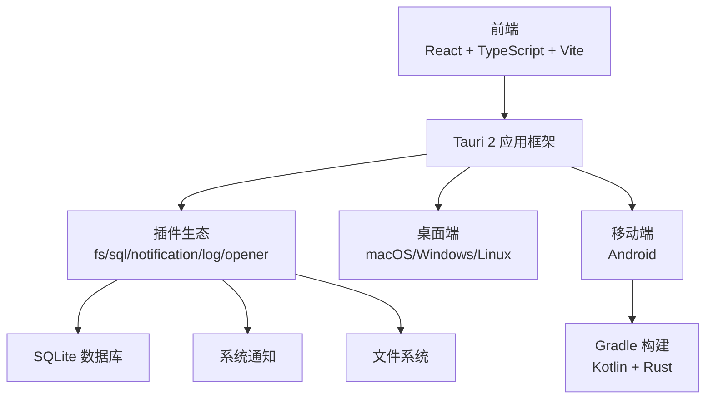
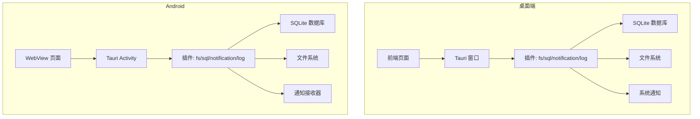
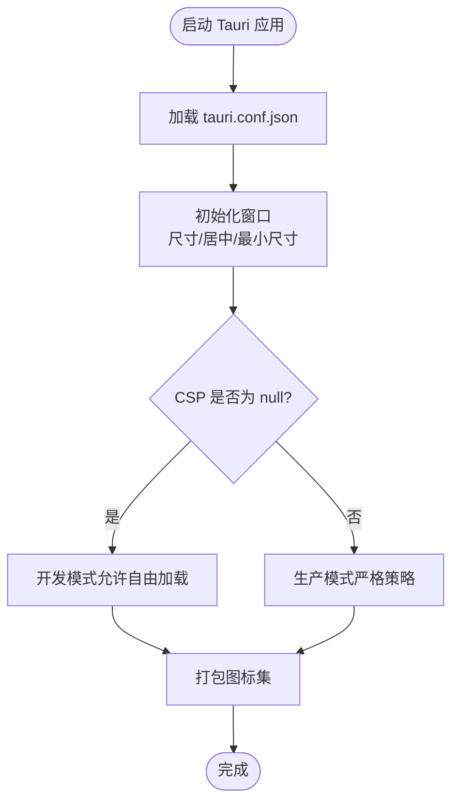
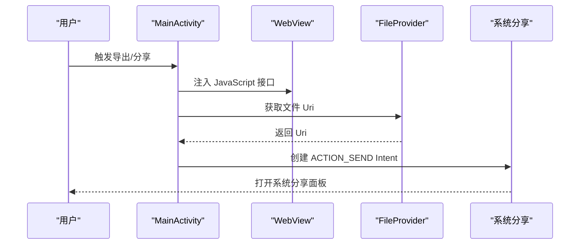
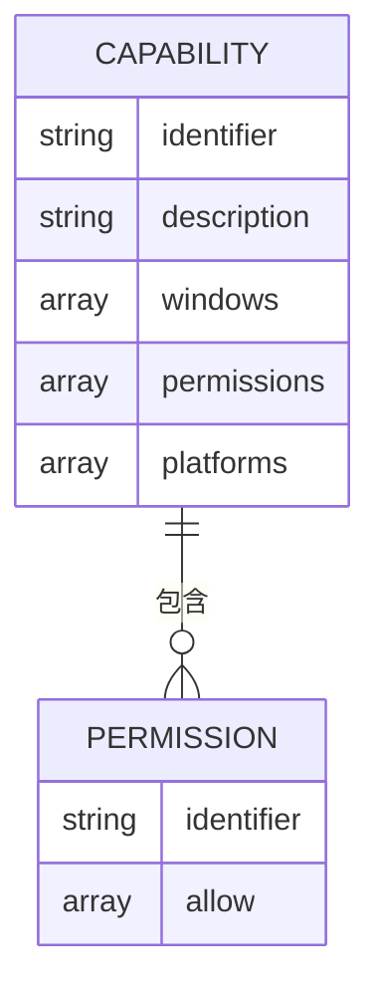
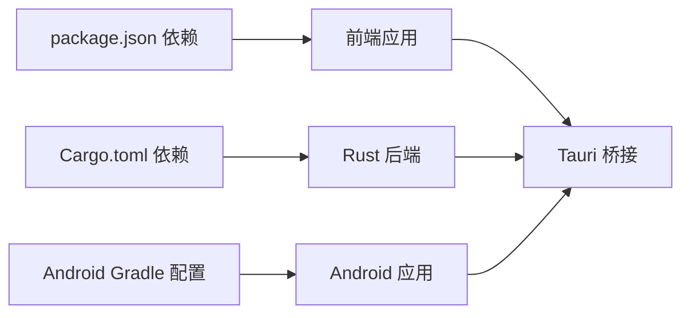

# 平台支持

<cite>
**本文引用的文件**
- [README.md](file://README.md)
- [tauri.conf.json](file://src-tauri/tauri.conf.json)
- [tauri.macos.conf.json](file://src-tauri/tauri.macos.conf.json)
- [Cargo.toml](file://src-tauri/Cargo.toml)
- [default.json](file://src-tauri/capabilities/default.json)
- [AndroidManifest.xml](file://src-tauri/gen/android/app/src/main/AndroidManifest.xml)
- [build.gradle.kts](file://src-tauri/gen/android/app/build.gradle.kts)
- [MainActivity.kt](file://src-tauri/gen/android/app/src/main/java/com/assetly/home/MainActivity.kt)
- [strings.xml](file://src-tauri/gen/android/app/src/main/res/values/strings.xml)
- [mobile-schema.json](file://src-tauri/gen/schemas/mobile-schema.json)
- [desktop-schema.json](file://src-tauri/gen/schemas/desktop-schema.json)
- [package.json](file://package.json)
</cite>

## 目录
1. [简介](#简介)
2. [项目结构](#项目结构)
3. [核心组件](#核心组件)
4. [架构总览](#架构总览)
5. [详细组件分析](#详细组件分析)
6. [依赖关系分析](#依赖关系分析)
7. [性能考量](#性能考量)
8. [故障排查指南](#故障排查指南)
9. [结论](#结论)
10. [附录](#附录)

## 简介
本文件面向 Assetly 项目，系统性梳理四大平台（macOS、Windows、Linux、Android）的支持现状与实现细节，并重点阐述 Android 平台的全面屏手势适配、存储权限、通知权限与后台运行限制等特殊处理。同时说明 iOS 平台当前状态与待验证点，提供各平台构建命令、部署要求与用户安装指引，帮助开发者理解平台差异并高效定位问题。

## 项目结构
- 前端采用 React + TypeScript + Vite，通过 Tauri 2 框架打包为桌面与移动应用。
- 后端 Rust 通过 Tauri 插件体系提供文件系统、数据库、通知、日志等能力。
- Android 平台通过 Gradle 构建，生成 APK 并集成 WebView 与原生通知通道。
- 平台配置集中在 Tauri 配置与 Android 清单文件中，权限与能力通过能力文件与插件权限声明统一管理。

**图表来源**
- [package.json:1-43](file://package.json#L1-L43)
- [Cargo.toml:1-31](file://src-tauri/Cargo.toml#L1-L31)
- [tauri.conf.json:1-40](file://src-tauri/tauri.conf.json#L1-L40)

**章节来源**
- [README.md:157-181](file://README.md#L157-L181)
- [package.json:1-43](file://package.json#L1-L43)
- [Cargo.toml:1-31](file://src-tauri/Cargo.toml#L1-L31)

## 核心组件
- 平台打包与构建
  - 桌面端：通过 Tauri CLI 使用目标平台参数进行构建，支持 macOS Universal、Windows x86_64。
  - 移动端：Android 通过 Tauri Android 子命令与 Gradle 构建 APK。
- 权限与能力
  - 通过能力文件声明窗口、权限集合与作用域，覆盖文件系统读写、数据库操作、通知等。
  - Android Manifest 显式声明存储、通知、开机广播、前台服务等权限。
- 插件与后端
  - Rust 侧加载 Tauri 插件，提供 fs/sql/notification/log 等能力；Windows 侧通过 subsystem 隐藏控制台。
- 平台配置
  - Tauri 主配置定义窗口尺寸、最小尺寸、安全策略与打包图标。
  - macOS 额外配置签名标识、entitlements 与异常域名（当前为空）。

**章节来源**
- [README.md:130-154](file://README.md#L130-L154)
- [tauri.conf.json:1-40](file://src-tauri/tauri.conf.json#L1-L40)
- [tauri.macos.conf.json:1-10](file://src-tauri/tauri.macos.conf.json#L1-L10)
- [Cargo.toml:1-31](file://src-tauri/Cargo.toml#L1-L31)
- [default.json:1-37](file://src-tauri/capabilities/default.json#L1-L37)

## 架构总览
下图展示 Assetly 在不同平台上的运行时关系：前端通过 Tauri 桥接调用 Rust 插件，桌面端直接运行，Android 通过 Gradle 构建并在设备上安装运行。

**图表来源**
- [Cargo.toml:20-30](file://src-tauri/Cargo.toml#L20-L30)
- [AndroidManifest.xml:1-49](file://src-tauri/gen/android/app/src/main/AndroidManifest.xml#L1-L49)
- [MainActivity.kt:1-95](file://src-tauri/gen/android/app/src/main/java/com/assetly/home/MainActivity.kt#L1-L95)

## 详细组件分析

### 桌面端（macOS / Windows / Linux）
- 窗口与安全
  - 定义主窗口标题、居中显示、最小宽高、窗口中心化等属性。
  - 安全策略中 CSP 设置为 null，允许本地开发环境自由加载资源。
- 打包与图标
  - 打包目标为 all，包含多平台图标集（.icns、.ico 等），便于分发。
- 平台差异
  - macOS 额外配置签名标识、entitlements 与异常域名，当前为空值，适合开发阶段使用。
  - Windows 通过入口文件隐藏额外控制台窗口，提升用户体验。

**图表来源**
- [tauri.conf.json:12-38](file://src-tauri/tauri.conf.json#L12-L38)
- [tauri.macos.conf.json:1-10](file://src-tauri/tauri.macos.conf.json#L1-L10)
- [src/main.rs:1-7](file://src-tauri/src/main.rs#L1-L7)

**章节来源**
- [tauri.conf.json:1-40](file://src-tauri/tauri.conf.json#L1-L40)
- [tauri.macos.conf.json:1-10](file://src-tauri/tauri.macos.conf.json#L1-L10)
- [src/main.rs:1-7](file://src-tauri/src/main.rs#L1-L7)

### Android 平台
- 权限与清单
  - 显式声明 INTERNET、READ_EXTERNAL_STORAGE、WRITE_EXTERNAL_STORAGE、POST_NOTIFICATIONS、RECEIVE_BOOT_COMPLETED、FOREGROUND_SERVICE 等权限。
  - 支持 Android TV（leanback）与 WebView 安全配置。
- 全面屏手势与导航
  - 禁用硬件返回键与滑动手势返回，防止与 WebView 导航冲突。
  - 禁用 WebView 边缘过度滚动效果与缩放控件，清理导航历史以阻止回退。
- 文件分享与 Provider
  - 通过 FileProvider 将本地文件分享至系统分享面板，授予临时读取 URI 权限。
- 构建与目标
  - Gradle 配置 minSdk/targetSdk/版本号，区分 debug/release 构建类型，启用 Rust 模块与 AndroidX 依赖。

**图表来源**
- [AndroidManifest.xml:1-49](file://src-tauri/gen/android/app/src/main/AndroidManifest.xml#L1-L49)
- [MainActivity.kt:1-95](file://src-tauri/gen/android/app/src/main/java/com/assetly/home/MainActivity.kt#L1-L95)
- [build.gradle.kts:1-72](file://src-tauri/gen/android/app/build.gradle.kts#L1-L72)

**章节来源**
- [AndroidManifest.xml:1-49](file://src-tauri/gen/android/app/src/main/AndroidManifest.xml#L1-L49)
- [MainActivity.kt:1-95](file://src-tauri/gen/android/app/src/main/java/com/assetly/home/MainActivity.kt#L1-L95)
- [build.gradle.kts:1-72](file://src-tauri/gen/android/app/build.gradle.kts#L1-L72)

### iOS 平台
- 当前状态
  - iOS 未在配置中显式声明目标平台，属于“待测试”状态。
- 建议与注意事项
  - 若计划支持 iOS，需在 Tauri 配置中添加对应目标平台与能力声明，并确保插件兼容性。
  - 注意 iOS 的通知权限、后台任务限制与沙盒机制对应用行为的影响。

**章节来源**
- [README.md:235-251](file://README.md#L235-L251)
- [mobile-schema.json:1-104](file://src-tauri/gen/schemas/mobile-schema.json#L1-L104)

### 权限与能力（跨平台）
- 能力文件
  - default 能力涵盖核心、opener、sql/fs/notification/log 等权限集合，并限定 APPDATA/exports 等目录范围。
- 插件与权限
  - Rust 侧加载 fs/sql/notification/log 插件，配合能力文件授权前端调用。
- 平台限制
  - mobile-schema 与 desktop-schema 定义了能力文件的结构与平台过滤规则，用于控制不同平台的权限边界。

**图表来源**
- [default.json:1-37](file://src-tauri/capabilities/default.json#L1-L37)
- [mobile-schema.json:39-104](file://src-tauri/gen/schemas/mobile-schema.json#L39-L104)
- [desktop-schema.json:39-104](file://src-tauri/gen/schemas/desktop-schema.json#L39-L104)

**章节来源**
- [default.json:1-37](file://src-tauri/capabilities/default.json#L1-L37)
- [mobile-schema.json:1-104](file://src-tauri/gen/schemas/mobile-schema.json#L1-L104)
- [desktop-schema.json:1-104](file://src-tauri/gen/schemas/desktop-schema.json#L1-L104)

## 依赖关系分析
- 前端依赖
  - React、Vite、TypeScript、Tailwind、Zustand、Recharts 等，通过 package.json 管理。
- Rust 依赖
  - Tauri 2、SQL 插件、FS 插件、Notification 插件、Log 插件、Opener 插件等。
- Android 依赖
  - Gradle、Kotlin、AndroidX、Material、Rust 插件，以及 WebView 与文件分享组件。

**图表来源**
- [package.json:12-41](file://package.json#L12-L41)
- [Cargo.toml:17-30](file://src-tauri/Cargo.toml#L17-L30)
- [build.gradle.kts:62-70](file://src-tauri/gen/android/app/build.gradle.kts#L62-L70)

**章节来源**
- [package.json:1-43](file://package.json#L1-L43)
- [Cargo.toml:1-31](file://src-tauri/Cargo.toml#L1-L31)
- [build.gradle.kts:1-72](file://src-tauri/gen/android/app/build.gradle.kts#L1-L72)

## 性能考量
- Android WebView
  - 禁用边缘过度滚动与缩放控件，减少视觉反馈与交互开销；清理导航历史降低内存占用。
- 构建优化
  - Release 构建启用混淆与签名，减小体积并提升安全性。
- 插件使用
  - 仅在需要的窗口与页面启用相应能力，避免过度授权导致的性能与安全风险。

[本节为通用建议，无需特定文件引用]

## 故障排查指南
- Android 通知权限
  - Android 13+ 需要用户手动授予通知权限，若无提醒，请检查权限声明与请求流程。
- 后台运行限制
  - 用药提醒依赖前台运行，建议将应用加入电池优化白名单以保持稳定提醒。
- 文件导出失败
  - 检查存储权限是否授予，确认 FileProvider 配置与 Uri 权限标志位正确。
- WebView 导航冲突
  - 若出现误触返回或滑动返回，确认已禁用返回手势与 WebView 导航历史。

**章节来源**
- [README.md:245-251](file://README.md#L245-L251)
- [AndroidManifest.xml:3-8](file://src-tauri/gen/android/app/src/main/AndroidManifest.xml#L3-L8)
- [MainActivity.kt:19-57](file://src-tauri/gen/android/app/src/main/java/com/assetly/home/MainActivity.kt#L19-L57)

## 结论
Assetly 在四大平台具备基础支持：macOS（Universal）、Windows、Linux、Android。Android 平台针对全面屏手势、存储与通知权限、后台运行限制进行了专门处理，确保移动端体验稳定。iOS 当前处于待测试状态，后续可按需扩展。通过能力文件与插件权限的统一管理，项目在保证功能完整性的同时兼顾了安全与性能。

[本节为总结性内容，无需特定文件引用]

## 附录

### 平台支持矩阵
- macOS：支持（Universal）
- Windows：支持
- Linux：支持
- Android：支持
- iOS：待测试

**章节来源**
- [README.md:235-244](file://README.md#L235-L244)

### 构建命令与产物位置
- 桌面端
  - macOS Universal：使用目标 universal-apple-darwin
  - Windows：使用目标 x86_64-pc-windows-msvc
  - 产物位置：src-tauri/target/{target}/release/bundle/
- Android
  - 构建 APK：使用 tauri android build --apk 或 --target aarch64
  - 产物位置：src-tauri/gen/android/app/build/outputs/apk/universal/release/

**章节来源**
- [README.md:130-154](file://README.md#L130-L154)

### 用户安装指导
- 桌面端
  - 下载对应平台安装包，双击安装后首次启动会根据系统策略进行权限提示。
- Android
  - 安装 APK 后首次启动可能需要授予存储与通知权限；建议在电池优化中添加应用以确保提醒稳定。
- iOS
  - 由于尚未正式支持，暂不提供安装说明。

**章节来源**
- [README.md:235-251](file://README.md#L235-L251)