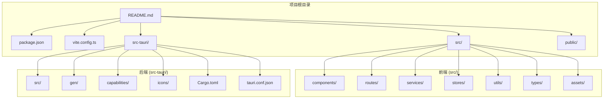
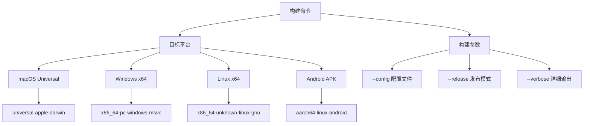
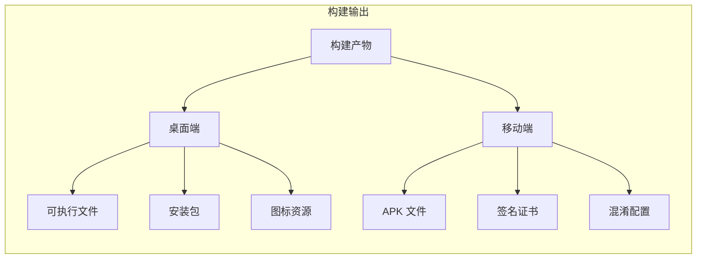
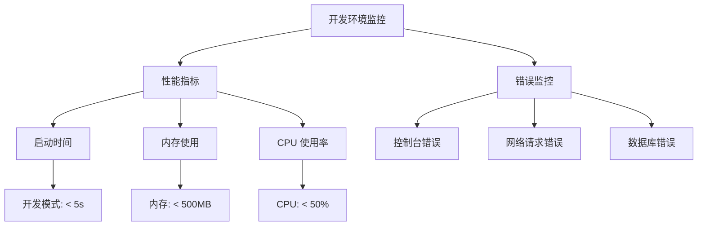

# 快速开始

<cite>
**本文档引用的文件**
- [README.md](file://README.md)
- [package.json](file://package.json)
- [vite.config.ts](file://vite.config.ts)
- [src-tauri/tauri.conf.json](file://src-tauri/tauri.conf.json)
- [src-tauri/Cargo.toml](file://src-tauri/Cargo.toml)
- [src-tauri/src/main.rs](file://src-tauri/src/main.rs)
- [src/main.tsx](file://src/main.tsx)
- [src/App.tsx](file://src/App.tsx)
- [src/services/database.ts](file://src/services/database.ts)
- [.github/workflows/release.yml](file://.github/workflows/release.yml)
</cite>

## 目录
1. [简介](#简介)
2. [环境准备](#环境准备)
3. [项目克隆](#项目克隆)
4. [依赖安装](#依赖安装)
5. [开发服务器启动](#开发服务器启动)
6. [桌面端构建](#桌面端构建)
7. [移动端构建](#移动端构建)
8. [构建产物位置](#构建产物位置)
9. [部署方式](#部署方式)
10. [常见问题解决](#常见问题解决)
11. [开发环境验证](#开发环境验证)
12. [故障排除指南](#故障排除指南)

## 简介

Assetly 是一款基于 Tauri 2.x 和 React 19 的跨平台家庭物品管理应用。它帮助用户记录、分类、追踪家中的所有资产，支持物品管理、分类管理、位置管理、药箱管理、数据统计等功能。应用采用本地 SQLite 数据库存储，确保数据隐私和离线可用性。

## 环境准备

### 系统要求

在开始之前，请确保您的开发环境满足以下要求：

- **Node.js**: LTS 版本（推荐使用 20.x）
- **包管理器**: pnpm（版本 8.x 或更高）
- **Rust 工具链**: stable 版本
- **Tauri CLI**: 2.x 版本
- **操作系统支持**:
  - macOS: 支持 Universal 构建
  - Windows: 支持 x64 构建
  - Linux: 支持构建
  - Android: 支持 APK 构建
  - iOS: 待测试

### 安装步骤

#### 1. 安装 Node.js 和 pnpm

```bash
# 使用 nvm 安装 Node.js LTS
nvm install --lts
nvm use --lts

# 安装 pnpm
npm install -g pnpm
```

#### 2. 安装 Rust 工具链

```bash
# 安装 rustup
curl --proto '=https' --tlsv1.2 -sSf https://sh.rustup.rs | sh

# 重新加载环境变量
source "$HOME/.cargo/env"

# 安装 Rust 工具链
rustup install stable
rustup default stable
```

#### 3. 安装 Tauri CLI

```bash
# 安装 Tauri CLI
npm install -g @tauri-apps/cli
```

#### 4. 验证安装

```bash
# 检查 Node.js 版本
node --version

# 检查 pnpm 版本
pnpm --version

# 检查 Rust 版本
rustc --version

# 检查 Tauri CLI 版本
tauri --version
```

## 项目克隆

### 获取源代码

```bash
# 克隆项目仓库
git clone https://github.com/your-username/assetly.git
cd assetly

# 或者使用 SSH（如果配置了 GitHub SSH 密钥）
git clone git@github.com:your-username/assetly.git
cd assetly
```

### 项目结构概览



**图表来源**
- [README.md:157-180](file://README.md#L157-L180)
- [package.json:1-43](file://package.json#L1-L43)

## 依赖安装

### 安装前端依赖

```bash
# 使用 pnpm 安装所有依赖
pnpm install

# 如果遇到网络问题，可以使用淘宝镜像
pnpm install --registry https://registry.npmmirror.com/
```

### 依赖项说明

项目使用的主要技术栈：

| 层级 | 技术 | 版本 | 用途 |
|------|------|------|------|
| 前端框架 | React | 19.1 | 用户界面 |
| 语言 | TypeScript | 5.8 | 类型安全 |
| 构建工具 | Vite | 7.0 | 开发服务器和构建 |
| 样式 | Tailwind CSS | 4.2 | 响应式设计 |
| 状态管理 | Zustand | 5.0 | 应用状态管理 |
| 路由 | React Router DOM | 7.14 | 页面路由 |
| 图表 | Recharts | 3.8 | 数据可视化 |
| 数据库 | SQLite | 2.4 | 本地数据存储 |

**章节来源**
- [README.md:86-105](file://README.md#L86-L105)
- [package.json:12-41](file://package.json#L12-L41)

## 开发服务器启动

### 启动开发环境

```bash
# 启动 Tauri 开发服务器（同时启动前端和后端）
pnpm tauri dev

# 或者分别启动前端和后端
# 在新终端中启动前端
pnpm dev

# 在新终端中启动 Tauri 后端
pnpm tauri
```

### 开发服务器配置

开发服务器使用以下配置：

- **前端开发服务器**: http://localhost:1420
- **热重载**: 支持实时更新
- **主机绑定**: 支持远程调试（通过 TAURI_DEV_HOST 环境变量）

### 验证开发环境

```bash
# 检查开发服务器是否正常运行
curl http://localhost:1420

# 查看应用窗口标题
# 应该显示 "Assetly" 窗口
```

**图表来源**
- [vite.config.ts:13-27](file://vite.config.ts#L13-L27)
- [src-tauri/tauri.conf.json:6-11](file://src-tauri/tauri.conf.json#L6-L11)

## 桌面端构建

### macOS Universal 构建

```bash
# 构建 macOS Universal 版本（支持 Intel 和 Apple Silicon）
pnpm tauri build --target universal-apple-darwin

# 使用自定义配置文件
pnpm tauri build --target universal-apple-darwin --config src-tauri/tauri.macos.conf.json
```

### Windows 构建

```bash
# 构建 Windows x64 版本
pnpm tauri build --target x86_64-pc-windows-msvc

# 构建 Windows x86 版本
pnpm tauri build --target i686-pc-windows-msvc
```

### Linux 构建

```bash
# 构建 Linux x64 版本
pnpm tauri build --target x86_64-unknown-linux-gnu

# 构建 Linux ARM64 版本
pnpm tauri build --target aarch64-unknown-linux-gnu
```

### 构建选项说明



**图表来源**
- [README.md:132-140](file://README.md#L132-L140)
- [.github/workflows/release.yml:66-78](file://.github/workflows/release.yml#L66-L78)

## 移动端构建

### Android APK 构建

```bash
# 初始化 Android 项目
pnpm tauri android init

# 构建 APK（通用架构）
pnpm tauri android build --apk

# 构建特定架构的 APK
pnpm tauri android build --target aarch64
pnpm tauri android build --target armv7
pnpm tauri android build --target x86_64
pnpm tauri android build --target i686
```

### Android 构建配置

Android 构建支持以下目标架构：

| 架构 | 目标标识符 | 支持的设备 |
|------|------------|------------|
| ARM64 | aarch64-linux-android | 现代智能手机和平板 |
| ARMv7 | armv7-linux-androideabi | 较老的 ARM 设备 |
| x86_64 | x86_64-linux-android | x86 模拟器和部分设备 |
| x86 | i686-linux-android | 旧版 x86 设备 |

### Android 开发环境要求

```bash
# 安装 Android 目标架构
rustup target add aarch64-linux-android
rustup target add armv7-linux-androideabi
rustup target add x86_64-linux-android
rustup target add i686-linux-android

# 设置 Java 环境（Android SDK 需要）
# 使用 GitHub Actions 中的配置
```

**章节来源**
- [README.md:142-148](file://README.md#L142-L148)
- [.github/workflows/release.yml:187-198](file://.github/workflows/release.yml#L187-L198)

## 构建产物位置

### 桌面端产物位置

| 平台 | 产物类型 | 输出路径 |
|------|----------|----------|
| macOS | DMG 安装包 | `src-tauri/target/universal-apple-darwin/release/bundle/dmg/` |
| macOS | App 包 | `src-tauri/target/universal-apple-darwin/release/bundle/macos/` |
| Windows | EXE 安装包 | `src-tauri/target/release/bundle/nsis/` |
| Windows | MSI 安装包 | `src-tauri/target/release/bundle/msi/` |
| Linux | AppImage | `src-tauri/target/release/bundle/appimage/` |
| Linux | DEB 包 | `src-tauri/target/release/bundle/deb/` |

### 移动端产物位置

| 平台 | 产物类型 | 输出路径 |
|------|----------|----------|
| Android | APK | `src-tauri/gen/android/app/build/outputs/apk/universal/release/` |
| Android | AAB | `src-tauri/gen/android/app/build/outputs/bundle/` |

### 产物文件说明



**图表来源**
- [README.md:150-154](file://README.md#L150-L154)

## 部署方式

### 桌面端部署

#### macOS 部署

```bash
# 使用 Homebrew 安装
brew install assetly

# 或者手动安装 DMG 包
open src-tauri/target/universal-apple-darwin/release/bundle/dmg/*.dmg
```

#### Windows 部署

```bash
# 使用 NSIS 安装程序
src-tauri/target/release/bundle/nsis/*.exe

# 使用 MSI 安装程序
src-tauri/target/release/bundle/msi/*.msi
```

### 移动端部署

#### Android 部署

```bash
# 安装 APK 到设备
adb install src-tauri/gen/android/app/build/outputs/apk/universal/release/*.apk

# 或者通过文件管理器安装
```

### 自动化部署

项目使用 GitHub Actions 进行自动化构建和发布：

```yaml
# .github/workflows/release.yml
name: Release Build
on:
  push:
    tags:
      - 'v*'
  workflow_dispatch:

jobs:
  build-macos:
    # macOS 构建配置
  
  build-windows:
    # Windows 构建配置
  
  build-android:
    # Android 构建配置
  
  create-release:
    # 创建 GitHub Release
```

**章节来源**
- [.github/workflows/release.yml:1-266](file://.github/workflows/release.yml#L1-L266)

## 常见问题解决

### 环境配置问题

#### Node.js 版本不兼容

```bash
# 检查当前 Node.js 版本
node --version

# 使用 nvm 切换到 LTS 版本
nvm install --lts
nvm use --lts

# 验证版本
node --version
```

#### pnpm 安装失败

```bash
# 清理缓存
pnpm store prune

# 使用淘宝镜像源
pnpm install --registry https://registry.npmmirror.com/

# 或者使用 npm 缓存
pnpm install --frozen-lockfile
```

#### Rust 工具链问题

```bash
# 更新 rustup
rustup self update

# 安装缺失的目标
rustup target add universal-apple-darwin
rustup target add x86_64-pc-windows-msvc

# 清理 Cargo 缓存
cargo clean
```

### 构建问题

#### Tauri 构建失败

```bash
# 检查 Tauri CLI 版本
tauri --version

# 更新 Tauri CLI
npm update -g @tauri-apps/cli

# 清理构建缓存
cargo clean
```

#### Android 构建问题

```bash
# 安装 Android SDK
# 在 GitHub Actions 中使用的配置
actions/setup-java@v4
android-actions/setup-android@v3

# 安装 Rust Android 目标
rustup target add aarch64-linux-android
```

### 运行时问题

#### 数据库连接失败

```bash
# 检查数据库文件权限
ls -la src-tauri/target/*/release/bundle/

# 删除损坏的数据库文件
rm assetly.db

# 重新启动应用
pnpm tauri dev
```

#### 通知权限问题

```bash
# Android 13+ 需要手动授予通知权限
# 设置 -> 应用 -> Assetly -> 通知 -> 允许通知
```

## 开发环境验证

### 验证步骤

#### 1. 基础环境验证

```bash
# 验证 Node.js
node --version
npm --version

# 验证 pnpm
pnpm --version

# 验证 Rust
rustc --version
cargo --version

# 验证 Tauri
tauri --version
```

#### 2. 项目依赖验证

```bash
# 检查 package.json 依赖
pnpm install --dry-run

# 验证 TypeScript 配置
pnpm tsc --noEmit
```

#### 3. 开发服务器验证

```bash
# 启动开发服务器
pnpm tauri dev

# 在浏览器中访问
# http://localhost:1420

# 检查应用窗口
# 应该看到 "Assetly" 窗口标题
```

#### 4. 数据库连接验证

```bash
# 检查数据库文件
ls -la src-tauri/target/*/release/bundle/assetly.db

# 验证数据库连接
# 应用启动时会自动创建数据库文件
```

### 性能监控



## 故障排除指南

### 常见错误及解决方案

#### 1. 端口占用问题

```bash
# 检查端口占用
lsof -i :1420
lsof -i :1421

# 杀死占用进程
kill -9 $(lsof -t -i :1420)

# 更改开发端口
echo "1422" > .env.local
```

#### 2. 热重载失效

```bash
# 重启开发服务器
# Ctrl+C 停止
pnpm tauri dev

# 清理缓存
pnpm cache clean
```

#### 3. 数据库迁移失败

```bash
# 检查迁移日志
# 查看应用日志文件

# 手动执行迁移
# 在数据库中运行迁移 SQL

# 重置数据库
rm assetly.db
```

#### 4. Android 构建失败

```bash
# 检查 Android SDK
echo $ANDROID_HOME

# 安装缺失的构建工具
sdkmanager "platform-tools" "platforms;android-33" "build-tools;33.0.0"

# 清理 Android 构建缓存
cd src-tauri
./gradlew clean
cd ..
```

### 调试技巧

#### 1. 启用详细日志

```bash
# 设置日志级别
export RUST_LOG=debug

# 或在代码中设置
process.env.RUST_LOG = 'debug'
```

#### 2. 检查构建日志

```bash
# 使用详细输出
pnpm tauri build --verbose

# 查看构建过程
pnpm tauri build --features --verbose
```

#### 3. 网络调试

```bash
# 检查网络连接
ping localhost:1420

# 检查防火墙设置
# 确保端口 1420 和 1421 未被阻止
```

### 性能优化建议

#### 1. 开发环境优化

```bash
# 使用更快的构建工具
pnpm install --faster

# 启用缓存
pnpm install --prefer-offline
```

#### 2. 内存优化

```bash
# 监控内存使用
# 使用 Chrome DevTools Memory 面板

# 优化大文件加载
# 使用懒加载和虚拟滚动
```

#### 3. 网络优化

```bash
# 配置开发代理
# 避免跨域问题

# 使用本地缓存
# 减少网络请求
```

通过以上详细的快速开始指南，新用户应该能够顺利搭建 Assetly 项目的开发环境并运行项目。如果在过程中遇到任何问题，可以参考故障排除指南或查阅相关配置文件的具体实现。