# 技术栈概览

<cite>
**本文档引用的文件**
- [package.json](file://package.json)
- [vite.config.ts](file://vite.config.ts)
- [tsconfig.json](file://tsconfig.json)
- [src-tauri/Cargo.toml](file://src-tauri/Cargo.toml)
- [src-tauri/tauri.conf.json](file://src-tauri/tauri.conf.json)
- [src-tauri/src/main.rs](file://src-tauri/src/main.rs)
- [src/main.tsx](file://src/main.tsx)
- [src/App.tsx](file://src/App.tsx)
- [src/services/database.ts](file://src/services/database.ts)
- [src/stores/useItemStore.ts](file://src/stores/useItemStore.ts)
- [src/stores/useSettingsStore.ts](file://src/stores/useSettingsStore.ts)
- [src/components/layout/AppShell.tsx](file://src/components/layout/AppShell.tsx)
- [src/index.css](file://src/index.css)
- [src/types/item.ts](file://src/types/item.ts)
- [src/utils/constants.ts](file://src/utils/constants.ts)
- [README.md](file://README.md)
</cite>

## 目录
1. [简介](#简介)
2. [项目结构](#项目结构)
3. [核心组件](#核心组件)
4. [架构总览](#架构总览)
5. [详细组件分析](#详细组件分析)
6. [依赖关系分析](#依赖关系分析)
7. [性能考虑](#性能考虑)
8. [故障排除指南](#故障排除指南)
9. [结论](#结论)
10. [附录](#附录)

## 简介
本文件为 Assetly 项目的现代技术栈概览文档，系统阐述项目采用的技术组合及其选择理由、特性、版本兼容性与在项目中的具体作用。技术栈包括：Tauri 2.x 作为跨平台应用框架、React 19.1 作为前端框架、TypeScript 5.8 提供强类型支持、Vite 7.0 构建工具、Tailwind CSS 4.2 响应式设计、Zustand 5.0 轻量级状态管理、SQLite 本地存储与 Tauri SQL 插件。

## 项目结构
项目采用“前端 + Tauri/Rust 后端”的双层架构：
- 前端层：React 19.1 + TypeScript 5.8 + Vite 7.0 + Tailwind CSS 4.2 + Zustand 5.0
- 后端层：Tauri 2.x + Rust 2021 Edition + Tauri 插件生态（SQL、FS、Notification、Log 等）
- 数据层：SQLite 本地数据库，通过 Tauri SQL 插件访问

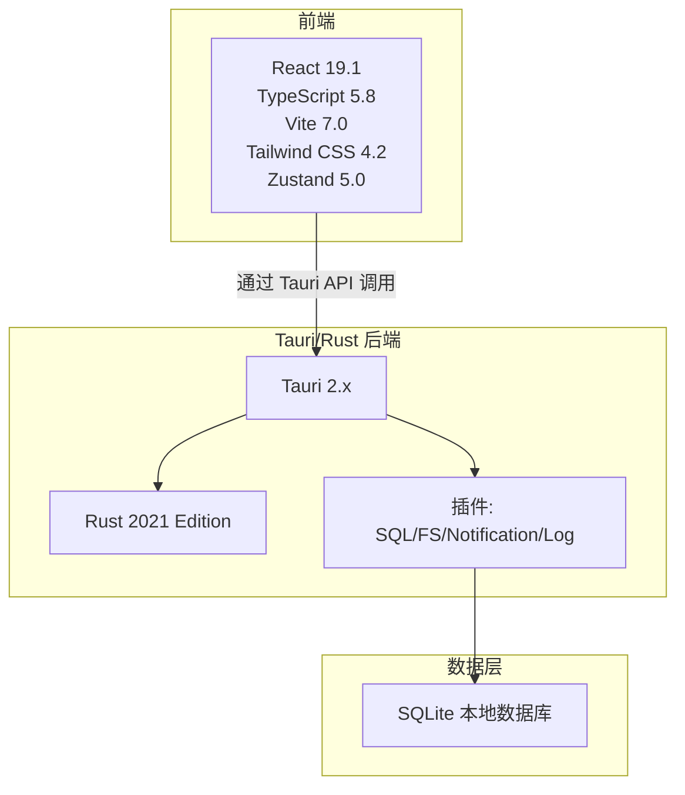

图表来源
- [package.json:12-41](file://package.json#L12-L41)
- [src-tauri/Cargo.toml:20-30](file://src-tauri/Cargo.toml#L20-L30)
- [src-tauri/tauri.conf.json:6-11](file://src-tauri/tauri.conf.json#L6-L11)

章节来源
- [README.md:157-180](file://README.md#L157-L180)

## 核心组件
- Tauri 2.x：提供跨平台桌面与移动应用框架，结合 Rust 后端与前端 Web 技术栈，实现高性能与低资源占用。
- React 19.1：用于构建用户界面，配合路由与状态管理实现页面导航与数据驱动视图。
- TypeScript 5.8：提供强类型检查，提升代码质量与可维护性。
- Vite 7.0：快速开发与构建工具，支持热更新与现代化打包。
- Tailwind CSS 4.2：原子化 CSS 框架，支持主题变量与响应式设计。
- Zustand 5.0：轻量级状态管理，按领域拆分 Store，简化状态逻辑。
- SQLite + Tauri SQL 插件：本地持久化存储，支持迁移与索引优化。

章节来源
- [README.md:86-105](file://README.md#L86-L105)
- [package.json:12-41](file://package.json#L12-L41)
- [src-tauri/Cargo.toml:20-30](file://src-tauri/Cargo.toml#L20-L30)

## 架构总览
前端通过 Vite 开发服务器提供静态资源，Tauri 将前端与 Rust 后端桥接，暴露系统能力（文件系统、通知、日志、数据库）。应用启动时初始化数据库与日志，路由层负责页面切换，状态层通过 Zustand 管理业务域数据。

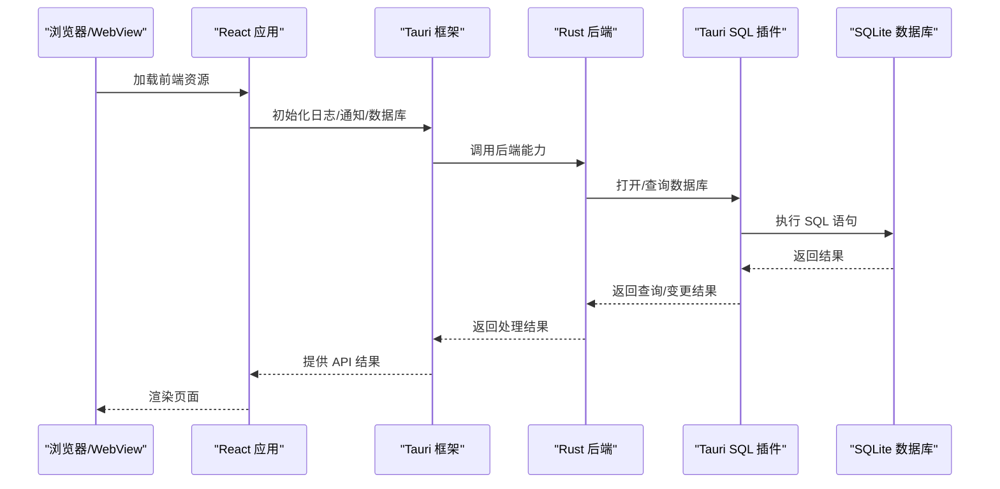

图表来源
- [src/App.tsx:15-27](file://src/App.tsx#L15-L27)
- [src/services/database.ts:8-16](file://src/services/database.ts#L8-L16)
- [src-tauri/tauri.conf.json:6-11](file://src-tauri/tauri.conf.json#L6-L11)

## 详细组件分析

### Tauri 2.x 与 Rust 后端
- 作用：作为应用壳与系统能力桥接层，提供窗口、菜单、系统通知、文件系统、日志与数据库访问。
- 版本兼容性：前端依赖与后端依赖均指向 Tauri 2.x；Rust 使用 2021 Edition。
- 配置要点：开发时通过 Vite 提供前端地址；打包时将 dist 目录作为前端资源；窗口尺寸与最小尺寸在配置中定义。

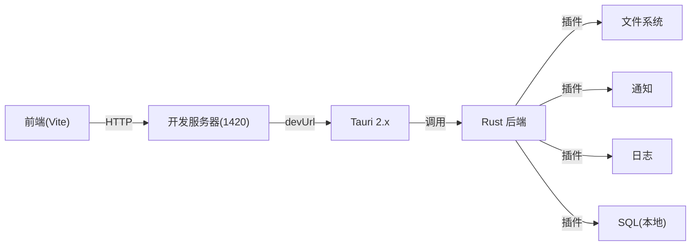

图表来源
- [vite.config.ts:9-28](file://vite.config.ts#L9-L28)
- [src-tauri/tauri.conf.json:6-11](file://src-tauri/tauri.conf.json#L6-L11)
- [src-tauri/Cargo.toml:20-30](file://src-tauri/Cargo.toml#L20-L30)
- [src-tauri/src/main.rs:4-6](file://src-tauri/src/main.rs#L4-L6)

章节来源
- [src-tauri/tauri.conf.json:1-40](file://src-tauri/tauri.conf.json#L1-L40)
- [src-tauri/Cargo.toml:1-31](file://src-tauri/Cargo.toml#L1-L31)
- [src-tauri/src/main.rs:1-7](file://src-tauri/src/main.rs#L1-L7)

### React 19.1 与路由
- 作用：页面路由与组件渲染，基于 React Router DOM 实现页面级导航。
- 特点：应用入口创建根节点并挂载 App；App 中注册路由与布局外壳，启用移动端手势拦截以避免 WebView 侧滑返回干扰。
- 版本：React 与 React DOM 均为 19.1。

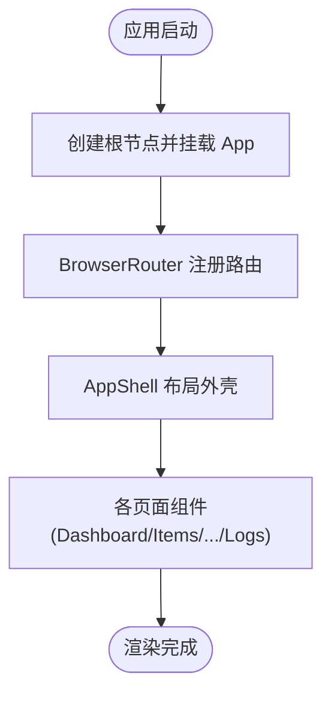

图表来源
- [src/main.tsx:6-10](file://src/main.tsx#L6-L10)
- [src/App.tsx:70-91](file://src/App.tsx#L70-L91)
- [src/components/layout/AppShell.tsx:24-160](file://src/components/layout/AppShell.tsx#L24-L160)

章节来源
- [src/main.tsx:1-11](file://src/main.tsx#L1-L11)
- [src/App.tsx:1-92](file://src/App.tsx#L1-L92)

### TypeScript 5.8 强类型支持
- 作用：在编译期提供类型检查，减少运行时错误，提升协作效率。
- 配置要点：严格模式开启，模块解析采用 bundler，JSX 使用 react-jsx，目标 ES2020，包含 src 目录并引用 node 配置。

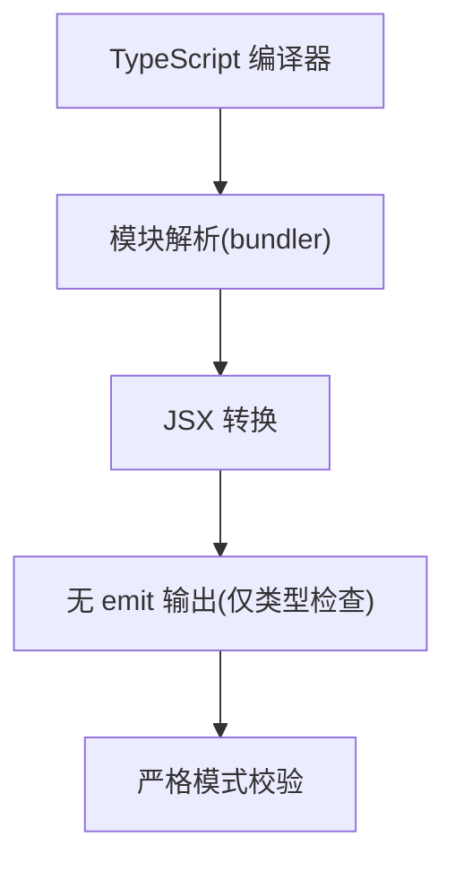

图表来源
- [tsconfig.json:2-25](file://tsconfig.json#L2-L25)

章节来源
- [tsconfig.json:1-26](file://tsconfig.json#L1-L26)

### Vite 7.0 构建与开发体验
- 作用：开发时提供 HMR 与快速启动，构建时进行代码分割与优化。
- 配置要点：启用 React 与 Tailwind CSS 插件；开发服务器端口 1420，支持跨主机热更；忽略 src-tauri 目录监听；生产构建输出至 dist。

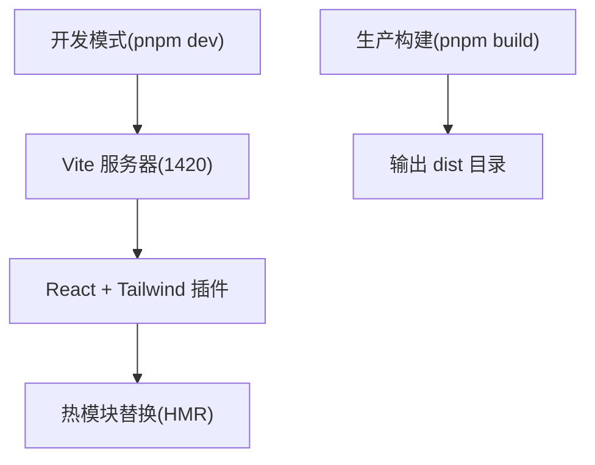

图表来源
- [vite.config.ts:9-28](file://vite.config.ts#L9-L28)
- [package.json:6-11](file://package.json#L6-L11)

章节来源
- [vite.config.ts:1-29](file://vite.config.ts#L1-L29)
- [package.json:1-43](file://package.json#L1-L43)

### Tailwind CSS 4.2 与主题系统
- 作用：提供原子化样式与响应式设计，结合 CSS 变量实现主题色动态切换。
- 特点：全局样式中定义主题变量，AppShell 在运行时根据设置更新 CSS 变量；移动端隐藏滚动条，桌面端提供统一滚动条样式；表单元素统一美化。

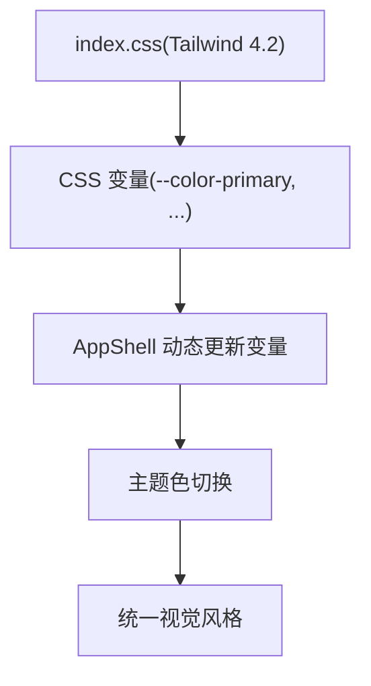

图表来源
- [src/index.css:3-18](file://src/index.css#L3-L18)
- [src/stores/useSettingsStore.ts:37-45](file://src/stores/useSettingsStore.ts#L37-L45)
- [src/components/layout/AppShell.tsx:48-50](file://src/components/layout/AppShell.tsx#L48-L50)

章节来源
- [src/index.css:1-84](file://src/index.css#L1-L84)
- [src/stores/useSettingsStore.ts:1-56](file://src/stores/useSettingsStore.ts#L1-L56)
- [src/components/layout/AppShell.tsx:1-160](file://src/components/layout/AppShell.tsx#L1-L160)

### Zustand 5.0 状态管理
- 作用：按领域拆分 Store，简化状态逻辑，避免过度复杂的状态容器。
- 特点：useItemStore 管理物品列表与过滤；useSettingsStore 管理主题色与货币符号；Store 内部通过服务层访问数据库，保持 UI 与数据层解耦。

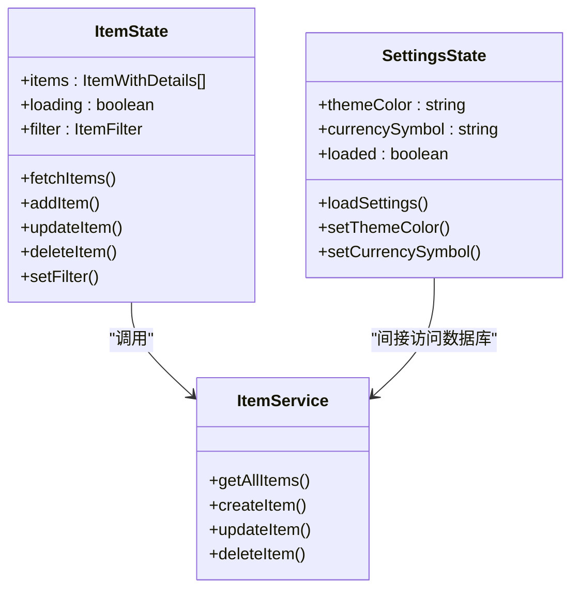

图表来源
- [src/stores/useItemStore.ts:12-52](file://src/stores/useItemStore.ts#L12-L52)
- [src/stores/useSettingsStore.ts:5-55](file://src/stores/useSettingsStore.ts#L5-L55)

章节来源
- [src/stores/useItemStore.ts:1-53](file://src/stores/useItemStore.ts#L1-L53)
- [src/stores/useSettingsStore.ts:1-56](file://src/stores/useSettingsStore.ts#L1-L56)

### SQLite 本地存储与数据库迁移
- 作用：本地持久化存储，支持迁移、索引与默认数据初始化。
- 特点：首次连接自动建立数据库连接并执行迁移；迁移包含多版本 SQL 语句与默认分类、设置种子数据；通过 Tauri SQL 插件访问，支持 INSERT/UPDATE/DELETE/SELECT。

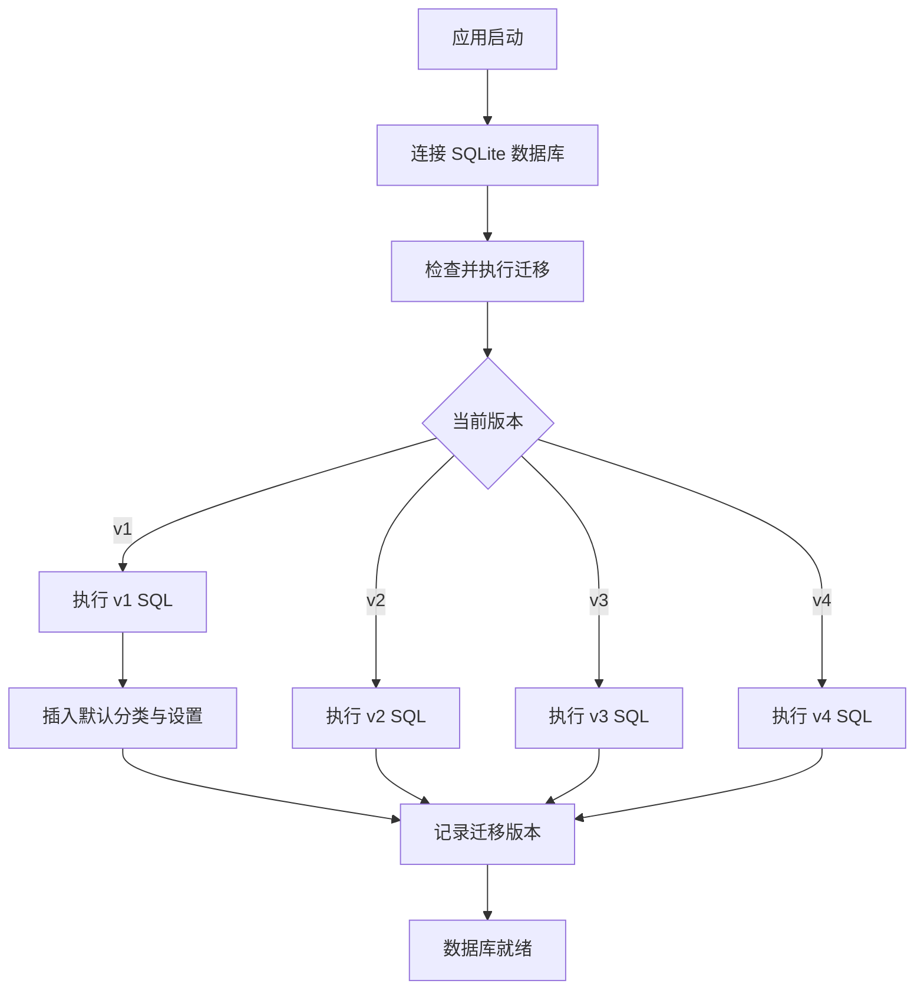

图表来源
- [src/services/database.ts:18-53](file://src/services/database.ts#L18-L53)
- [src/services/database.ts:60-170](file://src/services/database.ts#L60-L170)

章节来源
- [src/services/database.ts:1-171](file://src/services/database.ts#L1-L171)
- [src/utils/constants.ts:4-13](file://src/utils/constants.ts#L4-L13)

### 类型系统与数据模型
- 作用：通过 TypeScript 类型约束确保数据一致性，减少运行时错误。
- 特点：Item/ItemWithDetails/ItemFormData 明确字段与可选属性；枚举与字典映射状态与标签；Store 与服务层共享类型定义。

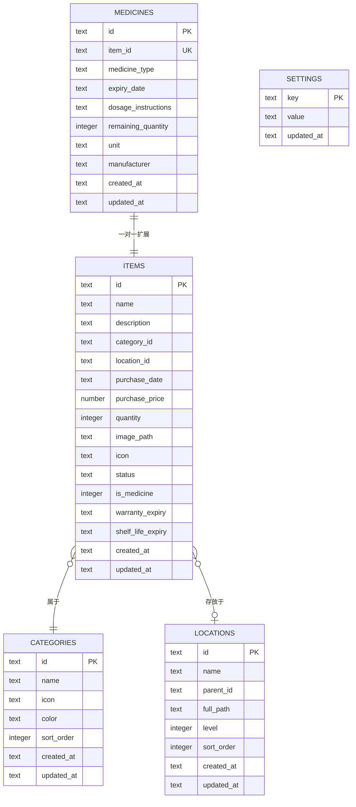

图表来源
- [src/services/database.ts:67-131](file://src/services/database.ts#L67-L131)
- [src/types/item.ts:5-45](file://src/types/item.ts#L5-L45)

章节来源
- [src/types/item.ts:1-46](file://src/types/item.ts#L1-L46)
- [src/services/database.ts:60-170](file://src/services/database.ts#L60-L170)

## 依赖关系分析
- 前端依赖：React 19.1、React Router DOM、Zustand 5.0、Tailwind CSS 4.2、Recharts、Lucide React、Day.js 等。
- 开发依赖：Vite 7.0、TypeScript 5.8、@vitejs/plugin-react、@tailwindcss/vite、@tauri-apps/cli。
- Tauri 插件：SQL、FS、Notification、Log 等，均与 Tauri 2.x 兼容。
- 构建脚本：dev、build、preview、tauri，分别对应 Vite 开发、TypeScript 检查+Vite 构建、预览、Tauri CLI。

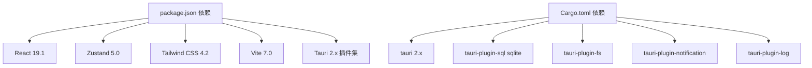

图表来源
- [package.json:12-41](file://package.json#L12-L41)
- [src-tauri/Cargo.toml:20-30](file://src-tauri/Cargo.toml#L20-L30)

章节来源
- [package.json:1-43](file://package.json#L1-L43)
- [src-tauri/Cargo.toml:1-31](file://src-tauri/Cargo.toml#L1-L31)

## 性能考虑
- Vite 7.0：快速冷启动与热更新，开发体验优秀；生产构建进行 Tree-shaking 与代码分割。
- Tauri 2.x：相比 Electron 更轻量，启动更快、内存占用更低；Rust 后端提供系统级性能与安全性。
- Zustand 5.0：极简 API，避免不必要的重渲染；按领域拆分 Store，降低耦合。
- Tailwind CSS 4.2：原子化类名减少重复样式，提升构建效率；CSS 变量实现主题切换零运行时开销。
- SQLite：本地存储，避免网络延迟；索引与迁移策略保证查询效率与数据一致性。

## 故障排除指南
- 数据库连接失败：确认数据库文件存在且路径正确；检查迁移是否成功执行；查看日志插件输出定位错误。
- 路由跳转异常：检查路由配置与 AppShell 布局包裹；确认移动端手势拦截未影响点击事件。
- 主题色不生效：确认 CSS 变量已在运行时更新；检查 useSettingsStore 的 setThemeColor 是否被调用。
- 构建报错：确保 TypeScript 5.8 与 Vite 7.0 版本匹配；清理缓存后重新安装依赖。

章节来源
- [src/services/database.ts:8-16](file://src/services/database.ts#L8-L16)
- [src/App.tsx:29-68](file://src/App.tsx#L29-L68)
- [src/stores/useSettingsStore.ts:37-45](file://src/stores/useSettingsStore.ts#L37-L45)
- [package.json:32-41](file://package.json#L32-L41)

## 结论
Assetly 采用现代技术栈组合，前端以 React 19.1 + TypeScript 5.8 + Vite 7.0 + Tailwind CSS 4.2 + Zustand 5.0 构建，后端以 Tauri 2.x + Rust + SQLite + 插件体系支撑，形成高性能、低耦合、易维护的跨平台应用架构。该技术栈在开发效率、运行性能与用户体验之间取得良好平衡，并为后续扩展与维护提供清晰路径。

## 附录
- 学习路径建议
  - 前端：从 React 19.1 与 TypeScript 5.8 入门，掌握 Vite 与 Tailwind CSS；理解 Zustand 状态管理最佳实践。
  - 后端：学习 Tauri 2.x 与 Rust 基础，掌握插件机制与本地数据库访问；了解 SQLite 与迁移策略。
  - 集成：通过 Tauri 配置与 CLI 脚本串联前后端，完成开发与构建流程。
- 平台支持：macOS、Windows、Linux、Android；iOS 待测试。

章节来源
- [README.md:235-244](file://README.md#L235-L244)
- [README.md:206-232](file://README.md#L206-L232)