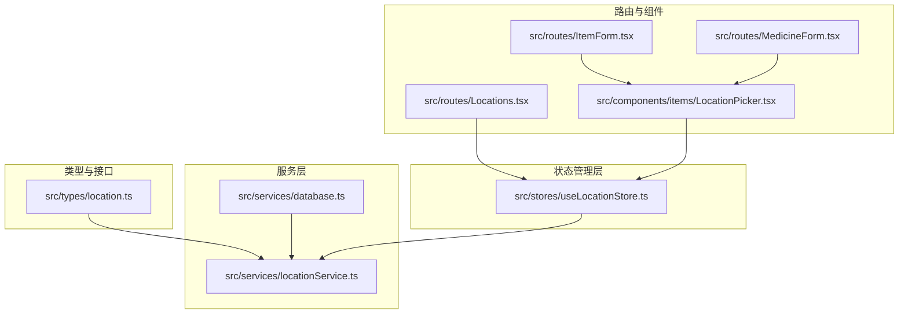
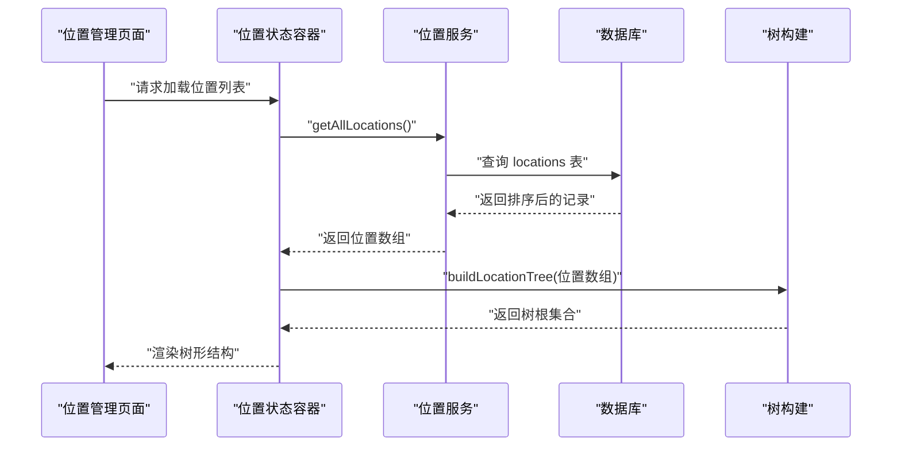
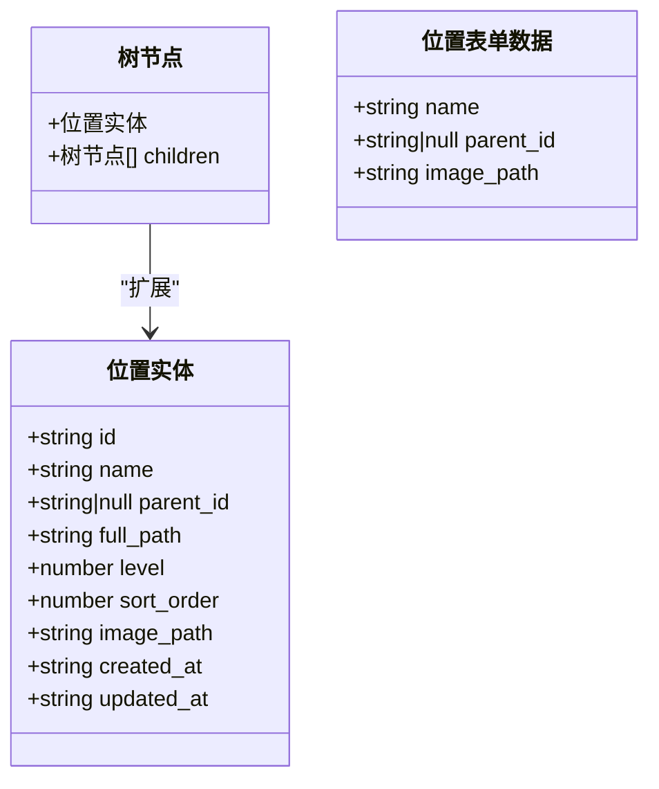
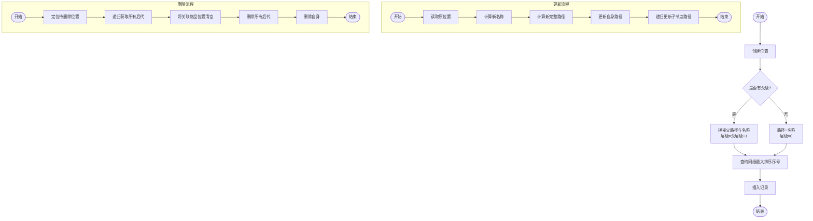
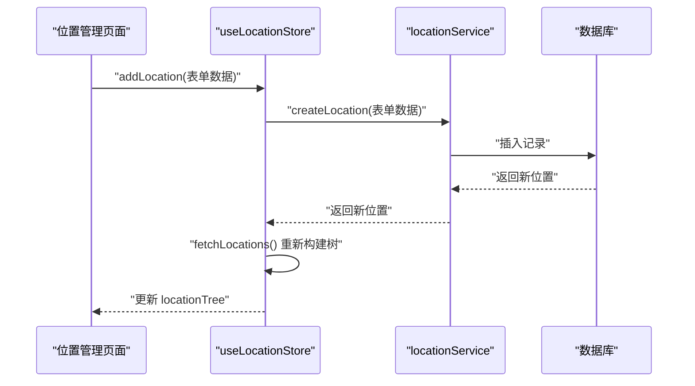
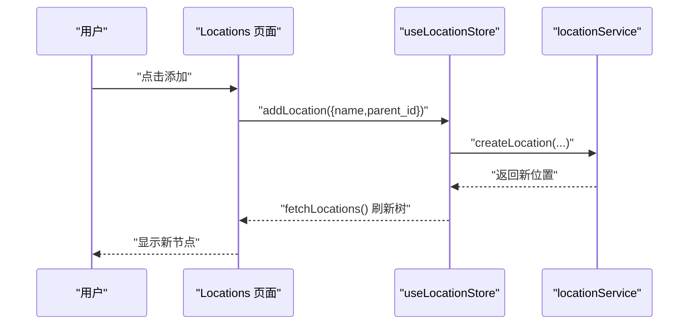
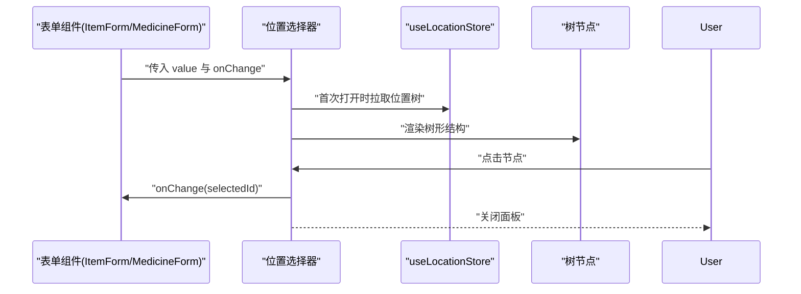
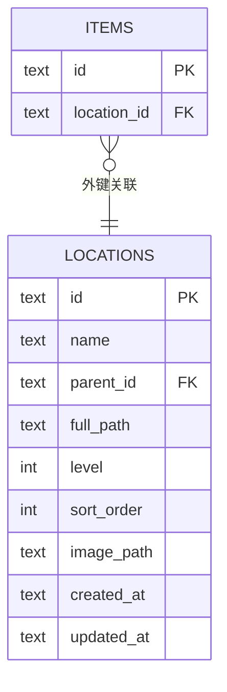
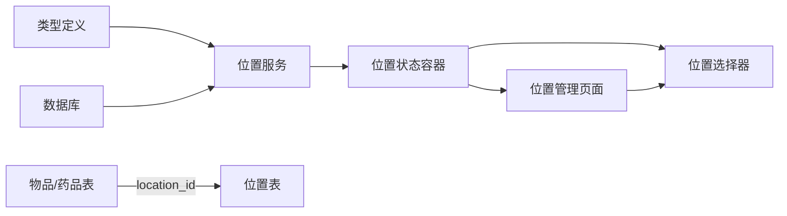

# 位置管理

<cite>
**本文档引用的文件**
- [src/types/location.ts](file://src/types/location.ts)
- [src/services/locationService.ts](file://src/services/locationService.ts)
- [src/stores/useLocationStore.ts](file://src/stores/useLocationStore.ts)
- [src/routes/Locations.tsx](file://src/routes/Locations.tsx)
- [src/components/items/LocationPicker.tsx](file://src/components/items/LocationPicker.tsx)
- [src/services/database.ts](file://src/services/database.ts)
- [src/routes/ItemForm.tsx](file://src/routes/ItemForm.tsx)
- [src/routes/MedicineForm.tsx](file://src/routes/MedicineForm.tsx)
- [src/types/item.ts](file://src/types/item.ts)
</cite>

## 目录
1. [简介](#简介)
2. [项目结构](#项目结构)
3. [核心组件](#核心组件)
4. [架构总览](#架构总览)
5. [详细组件分析](#详细组件分析)
6. [依赖关系分析](#依赖关系分析)
7. [性能考虑](#性能考虑)
8. [故障排除指南](#故障排除指南)
9. [结论](#结论)
10. [附录](#附录)

## 简介
本文件系统性阐述资产管理系统中的位置管理功能，围绕树形结构位置管理体系进行设计与实现说明。内容涵盖：
- 树形层级组织与路径生成算法
- 位置层级管理（创建、移动、重命名、删除）
- 路径计算逻辑（从根到任意位置的完整路径生成、路径解析与验证）
- 实际应用场景（物品存放位置追踪、多仓库管理、部门位置分配）
- 位置选择器组件的使用与集成

## 项目结构
位置管理功能由类型定义、服务层、状态管理层、UI 路由与组件协同构成，数据持久化通过 SQLite 数据库与迁移脚本完成。

**图表来源**
- [src/types/location.ts:1-24](file://src/types/location.ts#L1-L24)
- [src/services/locationService.ts:1-143](file://src/services/locationService.ts#L1-L143)
- [src/services/database.ts:1-171](file://src/services/database.ts#L1-L171)
- [src/stores/useLocationStore.ts:1-43](file://src/stores/useLocationStore.ts#L1-L43)
- [src/routes/Locations.tsx:1-204](file://src/routes/Locations.tsx#L1-L204)
- [src/components/items/LocationPicker.tsx:1-103](file://src/components/items/LocationPicker.tsx#L1-L103)
- [src/routes/ItemForm.tsx:1-200](file://src/routes/ItemForm.tsx#L1-L200)
- [src/routes/MedicineForm.tsx:1-200](file://src/routes/MedicineForm.tsx#L1-L200)

**章节来源**
- [src/types/location.ts:1-24](file://src/types/location.ts#L1-L24)
- [src/services/locationService.ts:1-143](file://src/services/locationService.ts#L1-L143)
- [src/services/database.ts:1-171](file://src/services/database.ts#L1-L171)
- [src/stores/useLocationStore.ts:1-43](file://src/stores/useLocationStore.ts#L1-L43)
- [src/routes/Locations.tsx:1-204](file://src/routes/Locations.tsx#L1-L204)
- [src/components/items/LocationPicker.tsx:1-103](file://src/components/items/LocationPicker.tsx#L1-L103)
- [src/routes/ItemForm.tsx:1-200](file://src/routes/ItemForm.tsx#L1-L200)
- [src/routes/MedicineForm.tsx:1-200](file://src/routes/MedicineForm.tsx#L1-L200)

## 核心组件
- 类型与接口：定义位置实体、树节点与表单数据结构，支撑前后端一致的数据契约。
- 服务层：封装位置 CRUD、路径更新、树构建与删除级联逻辑。
- 状态管理层：基于 Zustand 的位置状态容器，统一拉取与刷新树结构。
- 路由与组件：位置管理页面与位置选择器组件，提供可视化交互与数据绑定。

**章节来源**
- [src/types/location.ts:3-23](file://src/types/location.ts#L3-L23)
- [src/services/locationService.ts:9-142](file://src/services/locationService.ts#L9-L142)
- [src/stores/useLocationStore.ts:5-42](file://src/stores/useLocationStore.ts#L5-L42)
- [src/routes/Locations.tsx:7-116](file://src/routes/Locations.tsx#L7-L116)
- [src/components/items/LocationPicker.tsx:6-63](file://src/components/items/LocationPicker.tsx#L6-L63)

## 架构总览
位置管理采用“类型定义 → 服务层 → 状态层 → UI 层”的分层架构，配合数据库迁移确保表结构与索引稳定。

**图表来源**
- [src/stores/useLocationStore.ts:20-25](file://src/stores/useLocationStore.ts#L20-L25)
- [src/services/locationService.ts:9-12](file://src/services/locationService.ts#L9-L12)
- [src/services/locationService.ts:124-142](file://src/services/locationService.ts#L124-L142)

## 详细组件分析

### 类型与数据模型
- 位置实体包含唯一标识、名称、父级标识、完整路径、层级、排序序号、图片路径及时间戳。
- 树节点在位置实体基础上扩展 children 字段，用于构建树形结构。
- 表单数据用于创建/更新时的输入约束。

**图表来源**
- [src/types/location.ts:3-23](file://src/types/location.ts#L3-L23)

**章节来源**
- [src/types/location.ts:3-23](file://src/types/location.ts#L3-L23)

### 服务层：位置管理与路径算法
- 创建位置：根据父级 ID 计算完整路径与层级；按父级下的最大排序序号生成新排序值；插入数据库。
- 更新位置：更新名称与完整路径；递归更新所有子节点的完整路径。
- 删除位置：递归查找所有后代节点，先将关联物品的位置清空，再逐个删除位置。
- 树构建：通过映射与父子关系构建树根集合，支持多根树场景。

**图表来源**
- [src/services/locationService.ts:20-53](file://src/services/locationService.ts#L20-L53)
- [src/services/locationService.ts:55-92](file://src/services/locationService.ts#L55-L92)
- [src/services/locationService.ts:94-122](file://src/services/locationService.ts#L94-L122)
- [src/services/locationService.ts:124-142](file://src/services/locationService.ts#L124-L142)

**章节来源**
- [src/services/locationService.ts:9-142](file://src/services/locationService.ts#L9-L142)

### 状态管理层：位置状态容器
- 提供加载、创建、更新、删除位置的方法，并在每次操作后重新拉取数据以保持树结构一致性。
- 将位置数组转换为树结构，供 UI 组件直接消费。

**图表来源**
- [src/stores/useLocationStore.ts:27-31](file://src/stores/useLocationStore.ts#L27-L31)
- [src/stores/useLocationStore.ts:20-25](file://src/stores/useLocationStore.ts#L20-L25)
- [src/services/locationService.ts:20-53](file://src/services/locationService.ts#L20-L53)

**章节来源**
- [src/stores/useLocationStore.ts:5-42](file://src/stores/useLocationStore.ts#L5-L42)

### 路由与组件：位置管理页面
- 支持添加顶级或子级位置、展开/折叠节点、编辑名称、确认删除。
- 使用树形组件递归渲染，深度控制缩进，提供直观的层级展示。

**图表来源**
- [src/routes/Locations.tsx:17-26](file://src/routes/Locations.tsx#L17-L26)
- [src/stores/useLocationStore.ts:27-31](file://src/stores/useLocationStore.ts#L27-L31)
- [src/services/locationService.ts:20-53](file://src/services/locationService.ts#L20-L53)

**章节来源**
- [src/routes/Locations.tsx:7-116](file://src/routes/Locations.tsx#L7-L116)

### 组件：位置选择器
- 位置选择器提供弹出式树形选择面板，支持搜索式浏览与选择。
- 选中位置后，将位置 ID 回传给父组件；未选择时可清空选择。
- 面板内使用递归树节点组件，支持展开/折叠与选中态高亮。

**图表来源**
- [src/components/items/LocationPicker.tsx:11-63](file://src/components/items/LocationPicker.tsx#L11-L63)
- [src/stores/useLocationStore.ts:12-12](file://src/stores/useLocationStore.ts#L12-L12)
- [src/components/items/LocationPicker.tsx:65-102](file://src/components/items/LocationPicker.tsx#L65-L102)

**章节来源**
- [src/components/items/LocationPicker.tsx:6-103](file://src/components/items/LocationPicker.tsx#L6-L103)

### 数据库与迁移
- 位置表采用自引用外键，支持无限层级树形结构。
- 迁移脚本包含位置表创建、索引建立与字段扩展（如图片路径）。
- 通过迁移版本控制保证数据库结构演进与兼容性。

**图表来源**
- [src/services/database.ts:76-87](file://src/services/database.ts#L76-L87)
- [src/services/database.ts:162-167](file://src/services/database.ts#L162-L167)

**章节来源**
- [src/services/database.ts:18-53](file://src/services/database.ts#L18-L53)
- [src/services/database.ts:60-170](file://src/services/database.ts#L60-L170)

## 依赖关系分析
- 类型定义被服务层与状态层共同依赖，确保数据结构一致性。
- 服务层依赖数据库模块，负责 SQL 查询与事务相关操作。
- 状态层依赖服务层，提供统一的状态访问与副作用处理。
- UI 层依赖状态层与组件库，负责用户交互与视图渲染。
- 物品与药品表通过位置 ID 与位置表建立关联，实现位置追踪。

**图表来源**
- [src/types/location.ts:3-23](file://src/types/location.ts#L3-L23)
- [src/services/locationService.ts:1-3](file://src/services/locationService.ts#L1-L3)
- [src/stores/useLocationStore.ts:1-3](file://src/stores/useLocationStore.ts#L1-L3)
- [src/routes/Locations.tsx:3-3](file://src/routes/Locations.tsx#L3-L3)
- [src/components/items/LocationPicker.tsx:3-3](file://src/components/items/LocationPicker.tsx#L3-L3)
- [src/services/database.ts:89-103](file://src/services/database.ts#L89-L103)

**章节来源**
- [src/types/location.ts:3-23](file://src/types/location.ts#L3-L23)
- [src/services/locationService.ts:1-3](file://src/services/locationService.ts#L1-L3)
- [src/stores/useLocationStore.ts:1-3](file://src/stores/useLocationStore.ts#L1-L3)
- [src/routes/Locations.tsx:3-3](file://src/routes/Locations.tsx#L3-L3)
- [src/components/items/LocationPicker.tsx:3-3](file://src/components/items/LocationPicker.tsx#L3-L3)
- [src/services/database.ts:89-103](file://src/services/database.ts#L89-L103)

## 性能考虑
- 查询顺序：按层级与排序序号排序，确保树形渲染顺序稳定且高效。
- 索引策略：对位置表的父级字段建立索引，加速父子关系查询与树构建。
- 递归更新：更新位置名称时递归更新子节点完整路径，避免路径断裂。
- 批量删除：删除位置时先清理物品关联再删除位置，减少不一致风险。
- 前端渲染：树节点按深度缩进，避免深层节点过多导致的渲染压力。

[本节为通用性能建议，无需特定文件引用]

## 故障排除指南
- 无法加载位置树：检查数据库连接与迁移是否完成，确认位置表存在且有数据。
- 路径异常：确认父级 ID 正确，更新名称后触发子节点路径递归更新。
- 删除失败：检查是否存在后代节点，删除前应先清理关联物品位置。
- 选择器无数据：首次打开时触发拉取，确认状态容器已正确初始化。

**章节来源**
- [src/services/database.ts:18-53](file://src/services/database.ts#L18-L53)
- [src/services/locationService.ts:55-92](file://src/services/locationService.ts#L55-L92)
- [src/services/locationService.ts:94-122](file://src/services/locationService.ts#L94-L122)
- [src/stores/useLocationStore.ts:12-12](file://src/stores/useLocationStore.ts#L12-L12)

## 结论
位置管理功能通过树形结构与路径算法实现了灵活的层级组织，结合服务层的 CRUD 与树构建能力，以及状态层与 UI 组件的协同，提供了完整的可视化位置管理体验。配合数据库迁移与索引策略，系统具备良好的扩展性与稳定性，适用于物品存放位置追踪、多仓库管理与部门位置分配等实际场景。

[本节为总结性内容，无需特定文件引用]

## 附录

### 实际应用场景
- 物品存放位置追踪：在物品表中通过位置 ID 关联位置表，实现从根到任意位置的完整路径展示与过滤。
- 多仓库管理：通过创建多个顶级仓库作为根节点，子级为库区、货架、货位，形成多仓库树结构。
- 部门位置分配：以公司组织架构为根，部门为节点，工位/储物柜为叶子，便于资产管理与盘点。

**章节来源**
- [src/routes/ItemForm.tsx:173-177](file://src/routes/ItemForm.tsx#L173-L177)
- [src/routes/MedicineForm.tsx:1-200](file://src/routes/MedicineForm.tsx#L1-L200)
- [src/types/item.ts:10-10](file://src/types/item.ts#L10-L10)

### 位置选择器使用与集成
- 在表单中引入位置选择器组件，传入当前值与变更回调，即可实现位置选择。
- 选择器内部自动拉取位置树并渲染，支持清空选择与空状态提示。
- 集成时注意确保状态容器已初始化，以便首次打开时能正确加载数据。

**章节来源**
- [src/components/items/LocationPicker.tsx:6-63](file://src/components/items/LocationPicker.tsx#L6-L63)
- [src/stores/useLocationStore.ts:12-12](file://src/stores/useLocationStore.ts#L12-L12)