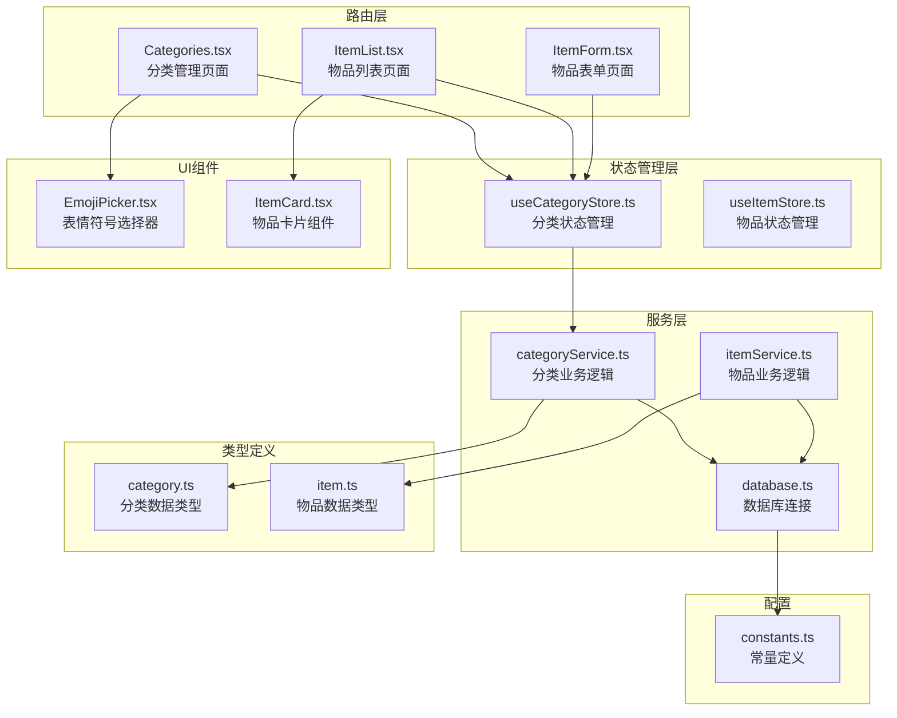
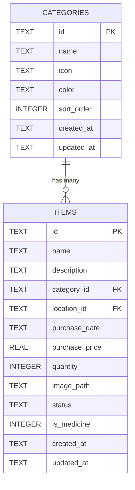
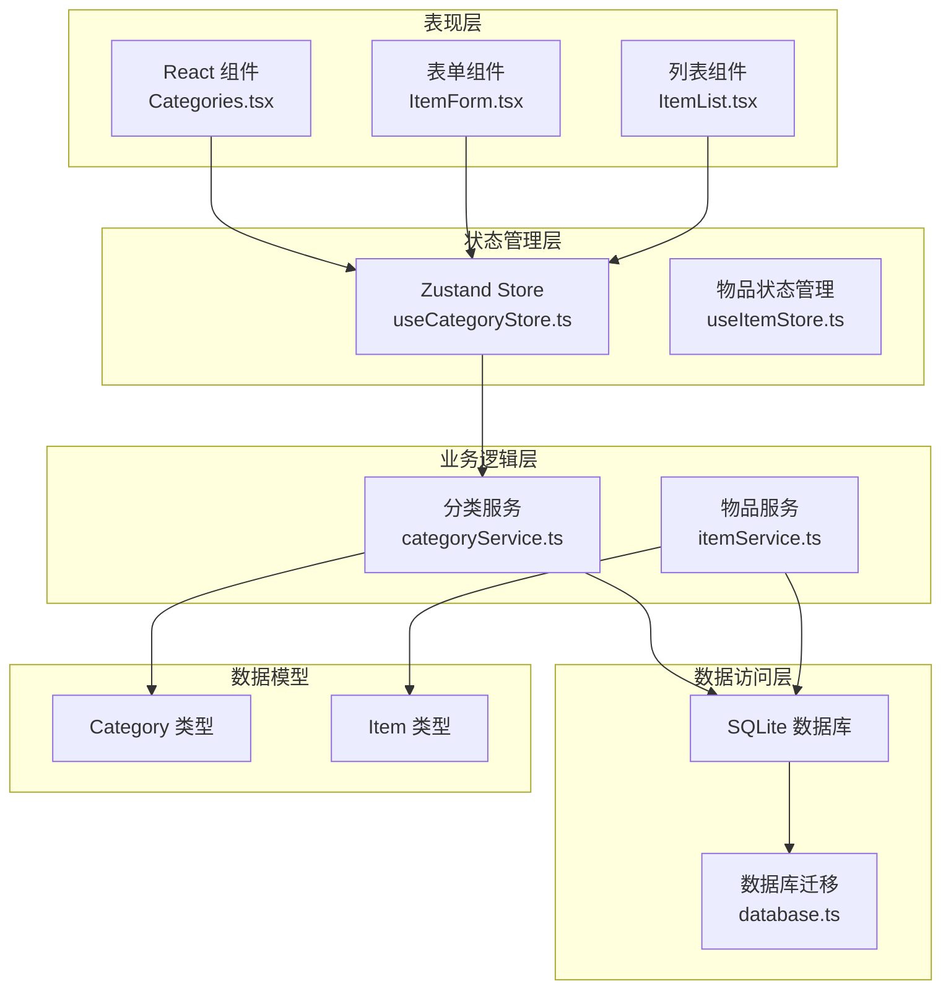
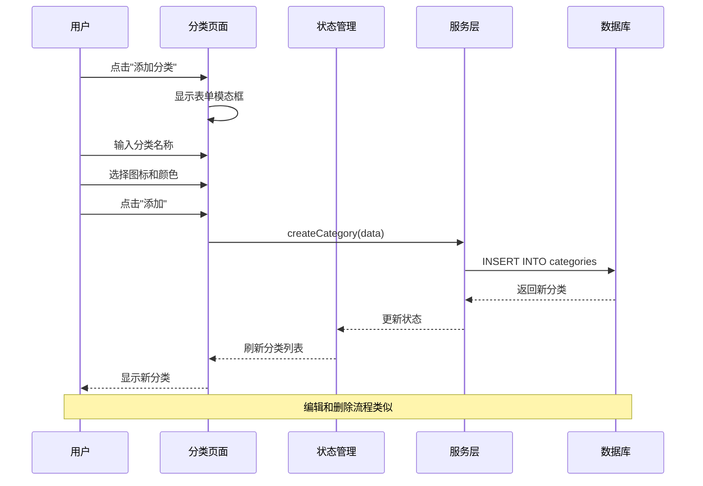
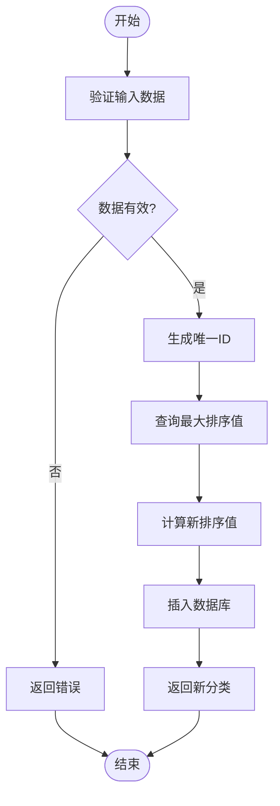
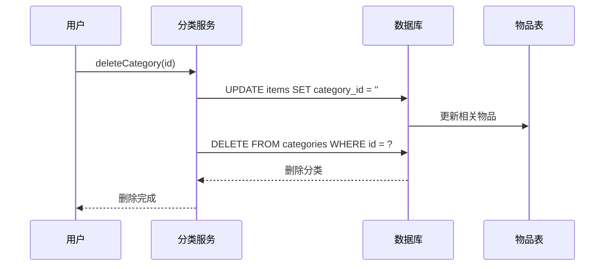
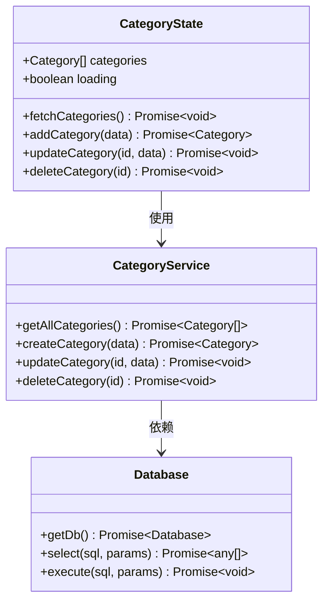
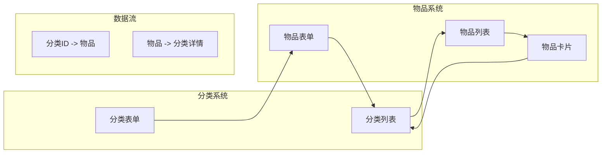
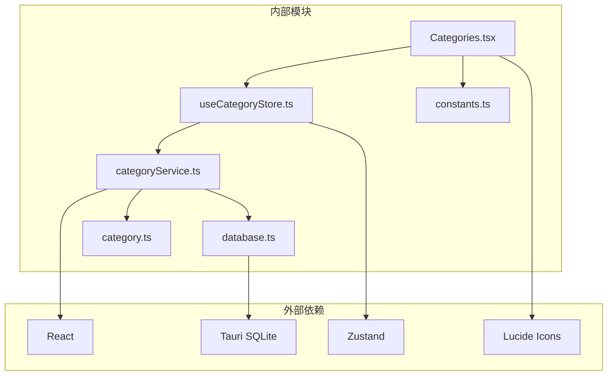

# 分类管理

<cite>
**本文档引用的文件**
- [Categories.tsx](file://src/routes/Categories.tsx)
- [categoryService.ts](file://src/services/categoryService.ts)
- [useCategoryStore.ts](file://src/stores/useCategoryStore.ts)
- [category.ts](file://src/types/category.ts)
- [constants.ts](file://src/utils/constants.ts)
- [database.ts](file://src/services/database.ts)
- [ItemList.tsx](file://src/routes/ItemList.tsx)
- [ItemForm.tsx](file://src/routes/ItemForm.tsx)
- [ItemCard.tsx](file://src/components/items/ItemCard.tsx)
- [EmojiPicker.tsx](file://src/components/shared/EmojiPicker.tsx)
- [itemService.ts](file://src/services/itemService.ts)
</cite>

## 目录
1. [简介](#简介)
2. [项目结构](#项目结构)
3. [核心组件](#核心组件)
4. [架构概览](#架构概览)
5. [详细组件分析](#详细组件分析)
6. [依赖分析](#依赖分析)
7. [性能考虑](#性能考虑)
8. [故障排除指南](#故障排除指南)
9. [结论](#结论)
10. [附录](#附录)

## 简介

分类管理是 Assetly 应用的核心功能之一，它为用户提供了灵活的物品组织系统。该系统不仅包含预设的默认分类，还支持用户自定义分类，包括名称设置、图标选择和颜色配置等个性化选项。

本系统采用 SQLite 数据库存储分类信息，通过服务层提供 CRUD 操作，并通过状态管理器与前端界面进行交互。分类系统支持层次化管理和权重计算，确保用户可以有效地组织和查找物品。

## 项目结构

分类管理系统在项目中的组织结构如下：

**图表来源**
- [Categories.tsx:1-184](file://src/routes/Categories.tsx#L1-L184)
- [useCategoryStore.ts:1-44](file://src/stores/useCategoryStore.ts#L1-L44)
- [categoryService.ts:1-59](file://src/services/categoryService.ts#L1-L59)
- [database.ts:1-171](file://src/services/database.ts#L1-L171)

**章节来源**
- [Categories.tsx:1-184](file://src/routes/Categories.tsx#L1-L184)
- [useCategoryStore.ts:1-44](file://src/stores/useCategoryStore.ts#L1-L44)
- [categoryService.ts:1-59](file://src/services/categoryService.ts#L1-L59)
- [database.ts:1-171](file://src/services/database.ts#L1-L171)

## 核心组件

### 默认分类系统

系统内置了8个预设分类，每个分类都配有特定的图标和颜色方案：

| 分类名称 | 图标 | 颜色 | 排序权重 |
|---------|------|------|----------|
| 电子产品 | Smartphone | #3B82F6 | 0 |
| 家具家电 | Sofa | #8B5CF6 | 1 |
| 厨房用品 | CookingPot | #F97316 | 2 |
| 衣物鞋包 | Shirt | #EC4899 | 3 |
| 书籍文具 | BookOpen | #06B6D4 | 4 |
| 药品保健 | Pill | #22C55E | 5 |
| 工具耗材 | Wrench | #78716C | 6 |
| 其他 | Package | #6B7280 | 7 |

这些默认分类通过数据库迁移自动创建，确保新用户能够立即开始使用分类功能。

### 分类数据模型

分类系统采用简洁而强大的数据模型设计：

**图表来源**
- [category.ts:3-11](file://src/types/category.ts#L3-L11)
- [database.ts:67-75](file://src/services/database.ts#L67-L75)
- [itemService.ts:89-119](file://src/services/itemService.ts#L89-L119)

**章节来源**
- [category.ts:1-18](file://src/types/category.ts#L1-L18)
- [constants.ts:3-13](file://src/utils/constants.ts#L3-L13)
- [database.ts:67-75](file://src/services/database.ts#L67-L75)

## 架构概览

分类管理系统的整体架构采用分层设计模式：

**图表来源**
- [Categories.tsx:11-184](file://src/routes/Categories.tsx#L11-L184)
- [useCategoryStore.ts:14-43](file://src/stores/useCategoryStore.ts#L14-L43)
- [categoryService.ts:9-59](file://src/services/categoryService.ts#L9-L59)
- [database.ts:18-53](file://src/services/database.ts#L18-L53)

## 详细组件分析

### 分类管理页面

分类管理页面提供了完整的分类 CRUD 功能：

**图表来源**
- [Categories.tsx:21-57](file://src/routes/Categories.tsx#L21-L57)
- [categoryService.ts:20-34](file://src/services/categoryService.ts#L20-L34)
- [useCategoryStore.ts:24-28](file://src/stores/useCategoryStore.ts#L24-L28)

#### 自定义分类功能

系统支持丰富的自定义选项：

**图标选择系统**
- 内置图标选项：Smartphone, Sofa, CookingPot, Shirt, BookOpen, Pill, Wrench, Package, Camera, Headphones, Watch, Car
- 实时图标映射：通过 iconEmoji 函数将图标名称转换为表情符号
- 自定义表情符号：用户可以通过 EmojiPicker 选择任意表情符号作为图标

**颜色配置系统**
- 预设颜色方案：蓝色系、紫色系、橙色系、粉色系、青色系等
- 颜色选择器：提供直观的颜色选择界面
- 颜色应用：实时预览颜色效果

**章节来源**
- [Categories.tsx:8-9](file://src/routes/Categories.tsx#L8-L9)
- [Categories.tsx:59-66](file://src/routes/Categories.tsx#L59-L66)
- [Categories.tsx:125-156](file://src/routes/Categories.tsx#L125-L156)

### 分类服务层

分类服务层负责处理所有分类相关的业务逻辑：

**图表来源**
- [categoryService.ts:20-34](file://src/services/categoryService.ts#L20-L34)
- [categoryService.ts:24-27](file://src/services/categoryService.ts#L24-L27)

#### 删除分类的安全机制

当用户删除分类时，系统会自动处理相关物品的分类关联：

**图表来源**
- [categoryService.ts:44-49](file://src/services/categoryService.ts#L44-L49)

**章节来源**
- [categoryService.ts:1-59](file://src/services/categoryService.ts#L1-L59)

### 分类状态管理

使用 Zustand 管理分类状态，提供响应式的数据更新机制：

**图表来源**
- [useCategoryStore.ts:5-12](file://src/stores/useCategoryStore.ts#L5-L12)
- [categoryService.ts:9-59](file://src/services/categoryService.ts#L9-L59)
- [database.ts:8-16](file://src/services/database.ts#L8-L16)

**章节来源**
- [useCategoryStore.ts:1-44](file://src/stores/useCategoryStore.ts#L1-L44)

### 分类在物品管理中的应用

分类系统深度集成到物品管理流程中：

**图表来源**
- [ItemList.tsx:138-151](file://src/routes/ItemList.tsx#L138-L151)
- [ItemForm.tsx:162-171](file://src/routes/ItemForm.tsx#L162-L171)
- [ItemCard.tsx:37-42](file://src/components/items/ItemCard.tsx#L37-L42)

**章节来源**
- [ItemList.tsx:1-185](file://src/routes/ItemList.tsx#L1-L185)
- [ItemForm.tsx:1-263](file://src/routes/ItemForm.tsx#L1-L263)
- [ItemCard.tsx:1-94](file://src/components/items/ItemCard.tsx#L1-L94)

## 依赖分析

分类管理系统的关键依赖关系：

**图表来源**
- [Categories.tsx:1-7](file://src/routes/Categories.tsx#L1-L7)
- [useCategoryStore.ts:1-3](file://src/stores/useCategoryStore.ts#L1-L3)
- [categoryService.ts:1-3](file://src/services/categoryService.ts#L1-L3)
- [database.ts:1-4](file://src/services/database.ts#L1-L4)

**章节来源**
- [Categories.tsx:1-184](file://src/routes/Categories.tsx#L1-L184)
- [useCategoryStore.ts:1-44](file://src/stores/useCategoryStore.ts#L1-L44)
- [categoryService.ts:1-59](file://src/services/categoryService.ts#L1-L59)
- [database.ts:1-171](file://src/services/database.ts#L1-L171)

## 性能考虑

### 数据库优化

- **索引策略**：为分类 ID 创建索引以加速物品查询
- **排序优化**：使用 sort_order 字段进行高效排序
- **批量操作**：支持批量删除和更新操作

### 前端性能

- **状态缓存**：使用 Zustand 进行本地状态缓存
- **懒加载**：分类列表按需加载
- **防抖处理**：搜索和过滤操作使用防抖机制

### 内存管理

- **组件卸载**：正确清理事件监听器和定时器
- **状态清理**：及时清理不再使用的状态数据

## 故障排除指南

### 常见问题及解决方案

**问题1：分类无法显示**
- 检查数据库连接是否正常
- 验证分类数据是否正确存储
- 确认网络权限设置

**问题2：图标显示异常**
- 检查图标名称是否在支持列表中
- 验证颜色格式是否正确
- 确认字体渲染是否正常

**问题3：删除分类时报错**
- 检查是否有物品依赖该分类
- 验证数据库事务是否成功
- 查看错误日志获取详细信息

**章节来源**
- [database.ts:18-53](file://src/services/database.ts#L18-L53)
- [categoryService.ts:44-49](file://src/services/categoryService.ts#L44-L49)

## 结论

分类管理系统通过精心设计的架构和丰富的功能特性，为用户提供了强大而灵活的物品组织解决方案。系统不仅支持默认分类，还允许用户完全自定义分类的外观和行为。

关键优势包括：
- **易用性**：直观的界面设计和简单的工作流程
- **灵活性**：支持自定义图标、颜色和名称
- **可靠性**：完善的错误处理和数据一致性保证
- **扩展性**：模块化的架构设计便于功能扩展

## 附录

### 最佳实践指南

**分类命名规范**
- 使用简洁明了的名称
- 避免使用特殊字符
- 保持命名风格一致

**图标选择指南**
- 选择与物品类型相关的图标
- 避免使用过于复杂的表情符号
- 考虑视觉对比度和可读性

**颜色搭配建议**
- 使用高对比度的颜色组合
- 避免使用过于鲜艳的颜色
- 考虑色盲用户的可访问性

### 操作示例

**创建新分类**
1. 在分类管理页面点击"添加分类"
2. 输入分类名称
3. 选择合适的图标和颜色
4. 点击"添加"按钮确认

**编辑现有分类**
1. 在分类列表中点击编辑按钮
2. 修改分类名称、图标或颜色
3. 点击"保存修改"按钮

**删除分类**
1. 在分类列表中点击删除按钮
2. 系统会提示确认对话框
3. 确认删除后，相关物品将变为"未分类"

**批量调整分类设置**
1. 在物品列表中选择多个物品
2. 批量修改分类设置
3. 系统会自动更新相关物品的分类信息