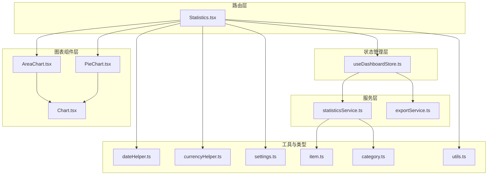
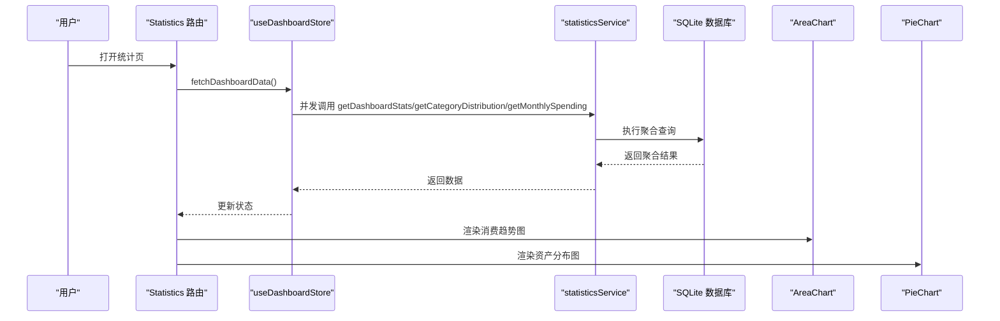
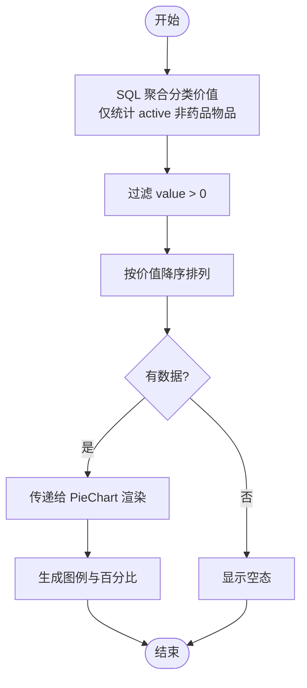
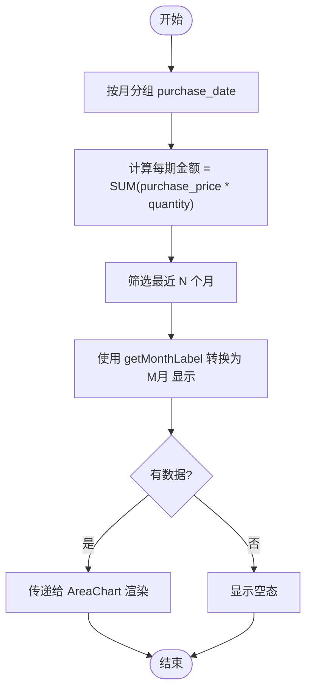
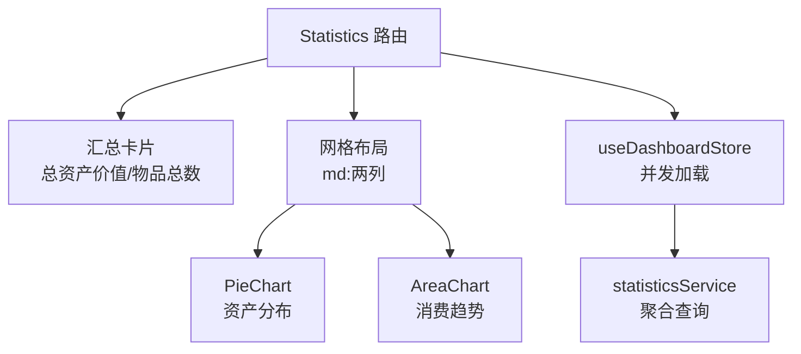
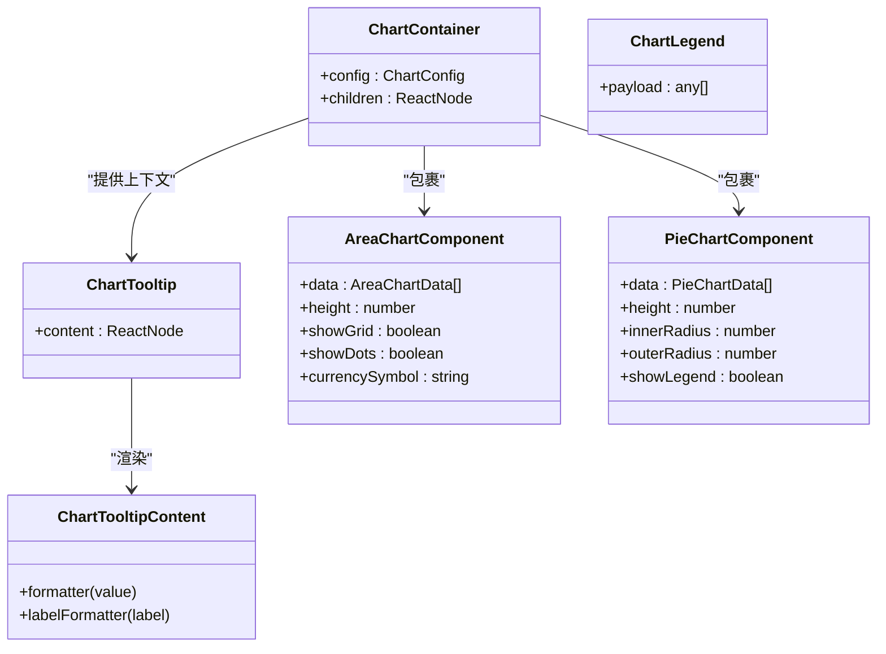
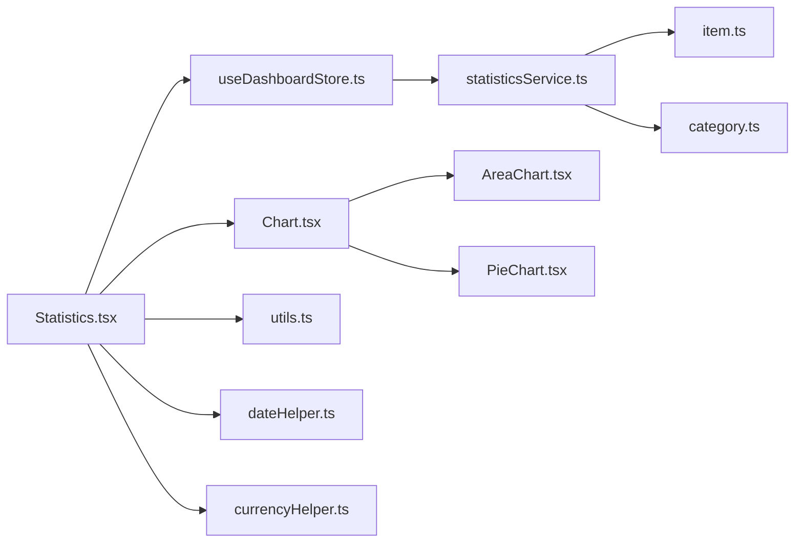

# 数据统计

<cite>
**本文引用的文件**
- [Statistics.tsx](file://src/routes/Statistics.tsx)
- [statisticsService.ts](file://src/services/statisticsService.ts)
- [AreaChart.tsx](file://src/components/charts/AreaChart.tsx)
- [PieChart.tsx](file://src/components/charts/PieChart.tsx)
- [Chart.tsx](file://src/components/charts/Chart.tsx)
- [useDashboardStore.ts](file://src/stores/useDashboardStore.ts)
- [settings.ts](file://src/types/settings.ts)
- [dateHelper.ts](file://src/utils/dateHelper.ts)
- [currencyHelper.ts](file://src/utils/currencyHelper.ts)
- [exportService.ts](file://src/services/exportService.ts)
- [item.ts](file://src/types/item.ts)
- [category.ts](file://src/types/category.ts)
- [utils.ts](file://src/lib/utils.ts)
</cite>

## 目录
1. [简介](#简介)
2. [项目结构](#项目结构)
3. [核心组件](#核心组件)
4. [架构总览](#架构总览)
5. [详细组件分析](#详细组件分析)
6. [依赖关系分析](#依赖关系分析)
7. [性能考量](#性能考量)
8. [故障排查指南](#故障排查指南)
9. [结论](#结论)
10. [附录](#附录)

## 简介
本文件围绕“数据统计”功能进行系统化技术文档整理，重点覆盖以下方面：
- 资产分布统计：按分类维度进行数据聚合与可视化展示
- 消费趋势分析：基于时间序列的月度支出聚合、趋势线绘制与预测思路
- 仪表板统计：汇总卡片、图表组件的可复用性、响应式布局与交互式探索
- 统计图表架构：AreaChart 面积图、PieChart 饼图等组件的设计模式与扩展点
- 可视化最佳实践：图表选择指南、数据格式要求、性能优化策略
- 报告生成与导出：JSON/CSV 导出能力与后续报告生成的建议

## 项目结构
数据统计功能由“路由层 -> 状态管理 -> 服务层 -> 图表组件 -> 工具函数”的分层架构组成，采用并行加载与懒渲染策略提升用户体验。

**图表来源**
- [Statistics.tsx:1-85](file://src/routes/Statistics.tsx#L1-L85)
- [useDashboardStore.ts:1-34](file://src/stores/useDashboardStore.ts#L1-L34)
- [statisticsService.ts:1-52](file://src/services/statisticsService.ts#L1-L52)
- [exportService.ts:1-154](file://src/services/exportService.ts#L1-L154)
- [AreaChart.tsx:1-94](file://src/components/charts/AreaChart.tsx#L1-L94)
- [PieChart.tsx:1-114](file://src/components/charts/PieChart.tsx#L1-L114)
- [Chart.tsx:1-330](file://src/components/charts/Chart.tsx#L1-L330)
- [dateHelper.ts:1-52](file://src/utils/dateHelper.ts#L1-L52)
- [currencyHelper.ts:1-17](file://src/utils/currencyHelper.ts#L1-L17)
- [settings.ts:1-25](file://src/types/settings.ts#L1-L25)
- [item.ts:1-46](file://src/types/item.ts#L1-L46)
- [category.ts:1-18](file://src/types/category.ts#L1-L18)
- [utils.ts:1-7](file://src/lib/utils.ts#L1-L7)

**章节来源**
- [Statistics.tsx:1-85](file://src/routes/Statistics.tsx#L1-L85)
- [useDashboardStore.ts:1-34](file://src/stores/useDashboardStore.ts#L1-L34)

## 核心组件
- 统计页面路由：负责加载仪表板数据、渲染汇总卡片与图表区域，并处理空态与加载态。
- 仪表板状态管理：统一管理统计数据、分类分布、月度支出与过期药品列表，支持并发拉取与缓存。
- 统计服务：封装数据库查询逻辑，提供资产统计、分类分布、月度支出三类聚合接口。
- 图表组件：基于 Recharts 的 AreaChart 与 PieChart，提供主题色映射、工具提示、图例与响应式容器。
- 工具函数：日期格式化（月标签）、货币格式化（含单位换算）、通用类名合并。

**章节来源**
- [Statistics.tsx:9-85](file://src/routes/Statistics.tsx#L9-L85)
- [useDashboardStore.ts:7-34](file://src/stores/useDashboardStore.ts#L7-L34)
- [statisticsService.ts:4-51](file://src/services/statisticsService.ts#L4-L51)
- [AreaChart.tsx:23-94](file://src/components/charts/AreaChart.tsx#L23-L94)
- [PieChart.tsx:28-114](file://src/components/charts/PieChart.tsx#L28-L114)
- [Chart.tsx:32-330](file://src/components/charts/Chart.tsx#L32-L330)
- [dateHelper.ts:49-51](file://src/utils/dateHelper.ts#L49-L51)
- [currencyHelper.ts:1-17](file://src/utils/currencyHelper.ts#L1-L17)
- [utils.ts:4-6](file://src/lib/utils.ts#L4-L6)

## 架构总览
统计模块采用“数据驱动 + 组件化”的设计，通过路由触发状态管理，状态管理并发调用统计服务，服务层执行 SQL 聚合，最终由图表组件渲染。

**图表来源**
- [Statistics.tsx:13-15](file://src/routes/Statistics.tsx#L13-L15)
- [useDashboardStore.ts:23-32](file://src/stores/useDashboardStore.ts#L23-L32)
- [statisticsService.ts:4-51](file://src/services/statisticsService.ts#L4-L51)

## 详细组件分析

### 资产分布统计（按分类）
- 数据聚合逻辑
  - 通过分类表与物品表关联，按分类聚合“购买单价 × 数量”的总值，仅统计状态为“active”的非药品物品。
  - 使用 SQL 分组与排序，确保高价值分类优先展示。
- 可视化实现
  - 饼图组件接收分类名称、颜色与数值，动态生成图例与百分比标注。
  - 支持货币符号格式化与工具提示展示具体金额。
- 性能与可用性
  - 当无数据时显示空态文案；数据量较大时，饼图内部半径与外半径可调以适配不同容器尺寸。

**图表来源**
- [statisticsService.ts:28-38](file://src/services/statisticsService.ts#L28-L38)
- [PieChart.tsx:28-114](file://src/components/charts/PieChart.tsx#L28-L114)

**章节来源**
- [statisticsService.ts:28-38](file://src/services/statisticsService.ts#L28-L38)
- [PieChart.tsx:28-114](file://src/components/charts/PieChart.tsx#L28-L114)

### 消费趋势分析（时间序列）
- 数据聚合逻辑
  - 基于购买日期按月分组，计算“购买单价 × 数量”的累计金额，默认最近6个月。
  - 使用 SQLite 的日期函数与区间筛选，保证时间连续性与性能。
- 可视化实现
  - 面积图组件支持网格线、点标记、渐变填充与货币格式化轴标签。
  - 通过月标签工具函数将“年-月”键转换为“M月”显示。
- 预测与扩展
  - 当前实现为展示已有数据的趋势线；若需预测，可在前端引入简单线性回归或移动平均法，或在服务层返回更多历史窗口供前端做外推。

**图表来源**
- [statisticsService.ts:40-51](file://src/services/statisticsService.ts#L40-L51)
- [AreaChart.tsx:23-94](file://src/components/charts/AreaChart.tsx#L23-L94)
- [dateHelper.ts:49-51](file://src/utils/dateHelper.ts#L49-L51)

**章节来源**
- [statisticsService.ts:40-51](file://src/services/statisticsService.ts#L40-L51)
- [AreaChart.tsx:23-94](file://src/components/charts/AreaChart.tsx#L23-L94)
- [dateHelper.ts:49-51](file://src/utils/dateHelper.ts#L49-L51)

### 仪表板统计核心组件设计
- 汇总卡片
  - 展示总资产价值与物品总数，货币值通过工具函数格式化，支持自定义货币符号。
- 响应式布局
  - 使用网格布局在小屏与大屏下自动调整列数，保证内容可读性。
- 交互式数据探索
  - 饼图与面积图均内置工具提示与图例，便于用户聚焦特定分类或月份。

**图表来源**
- [Statistics.tsx:34-81](file://src/routes/Statistics.tsx#L34-L81)
- [useDashboardStore.ts:23-32](file://src/stores/useDashboardStore.ts#L23-L32)
- [currencyHelper.ts:1-7](file://src/utils/currencyHelper.ts#L1-L7)

**章节来源**
- [Statistics.tsx:34-81](file://src/routes/Statistics.tsx#L34-L81)
- [useDashboardStore.ts:23-32](file://src/stores/useDashboardStore.ts#L23-L32)
- [currencyHelper.ts:1-7](file://src/utils/currencyHelper.ts#L1-L7)

### 统计图表实现架构（Chart.tsx 设计模式）
- 主题色映射
  - 通过 ChartContainer 注入 CSS 变量，使 Recharts 组件继承主题色，支持明暗主题切换。
- 工具提示与图例
  - 提供统一的 Tooltip 与 Legend 组件，支持自定义格式化器与图标。
- 响应式容器
  - 将图表包裹在响应式容器中，自动适配父容器宽高，避免溢出。

**图表来源**
- [Chart.tsx:32-330](file://src/components/charts/Chart.tsx#L32-L330)
- [AreaChart.tsx:23-94](file://src/components/charts/AreaChart.tsx#L23-L94)
- [PieChart.tsx:28-114](file://src/components/charts/PieChart.tsx#L28-L114)

**章节来源**
- [Chart.tsx:32-330](file://src/components/charts/Chart.tsx#L32-L330)

### 数据聚合算法与复杂度
- 资产分布（分类维度）
  - 时间复杂度：O(n)，其中 n 为物品数量；空间复杂度：O(k)，k 为分类数量。
  - 关键点：LEFT JOIN + GROUP BY + HAVING 过滤零值，避免冗余分类。
- 月度支出（时间序列）
  - 时间复杂度：O(n)；空间复杂度：O(m)，m 为月份数（通常较小）。
  - 关键点：使用日期范围筛选与按月分组，确保时间连续性。
- 合并与渲染
  - 路由层对月度数据进行标签转换，避免图表组件内重复逻辑。

**章节来源**
- [statisticsService.ts:28-51](file://src/services/statisticsService.ts#L28-L51)
- [Statistics.tsx:25-28](file://src/routes/Statistics.tsx#L25-L28)

## 依赖关系分析
- 组件耦合
  - Statistics 路由依赖 useDashboardStore 与 Chart 工具；PieChart/AreaChart 依赖 Chart 容器与 Recharts。
- 数据流
  - 路由触发状态管理，状态管理并发调用统计服务，服务层访问数据库，最终回填到组件。
- 类型契约
  - DashboardStats、CategoryDistribution、MonthlySpending 作为跨层数据契约，确保类型安全。

**图表来源**
- [Statistics.tsx:1-85](file://src/routes/Statistics.tsx#L1-L85)
- [useDashboardStore.ts:1-34](file://src/stores/useDashboardStore.ts#L1-L34)
- [statisticsService.ts:1-52](file://src/services/statisticsService.ts#L1-L52)
- [Chart.tsx:1-330](file://src/components/charts/Chart.tsx#L1-L330)
- [AreaChart.tsx:1-94](file://src/components/charts/AreaChart.tsx#L1-L94)
- [PieChart.tsx:1-114](file://src/components/charts/PieChart.tsx#L1-L114)
- [item.ts:1-46](file://src/types/item.ts#L1-L46)
- [category.ts:1-18](file://src/types/category.ts#L1-L18)
- [utils.ts:1-7](file://src/lib/utils.ts#L1-L7)
- [dateHelper.ts:1-52](file://src/utils/dateHelper.ts#L1-L52)
- [currencyHelper.ts:1-17](file://src/utils/currencyHelper.ts#L1-L17)

**章节来源**
- [Statistics.tsx:1-85](file://src/routes/Statistics.tsx#L1-L85)
- [useDashboardStore.ts:1-34](file://src/stores/useDashboardStore.ts#L1-L34)
- [statisticsService.ts:1-52](file://src/services/statisticsService.ts#L1-L52)

## 性能考量
- 并发加载
  - 使用 Promise.all 并行请求多维统计，减少首屏等待时间。
- 数据预处理
  - 在路由层完成月度标签转换，避免图表组件重复计算。
- 图表渲染优化
  - 关闭动画与禁用激活点，降低重绘成本；按需显示点标记。
- 数据库查询优化
  - 使用索引友好的条件（如日期范围、状态过滤），避免全表扫描。
- 内存与渲染
  - 对于大量分类或月份，考虑虚拟化或分页策略；当前实现以小规模数据为主，无需过度优化。

**章节来源**
- [useDashboardStore.ts:25-31](file://src/stores/useDashboardStore.ts#L25-L31)
- [Statistics.tsx:25-28](file://src/routes/Statistics.tsx#L25-L28)
- [AreaChart.tsx:79-88](file://src/components/charts/AreaChart.tsx#L79-L88)

## 故障排查指南
- 无数据或空态
  - 资产分布与消费趋势图在无数据时会显示空态文案；检查数据库中是否存在“active”状态的非药品物品。
- 日期格式问题
  - 月度标签依赖“YYYY-MM”格式；确认 purchase_date 字段不为空且格式正确。
- 货币格式异常
  - 货币格式化函数支持千分位与单位换算；若显示异常，检查传入的金额与货币符号。
- 导出与导入
  - JSON/CSV 导出用于备份与报告生成；导入时注意字段映射与默认值处理。

**章节来源**
- [PieChart.tsx:54-60](file://src/components/charts/PieChart.tsx#L54-L60)
- [AreaChart.tsx:40-46](file://src/components/charts/AreaChart.tsx#L40-L46)
- [dateHelper.ts:49-51](file://src/utils/dateHelper.ts#L49-L51)
- [currencyHelper.ts:1-17](file://src/utils/currencyHelper.ts#L1-L17)
- [exportService.ts:4-44](file://src/services/exportService.ts#L4-L44)

## 结论
该统计模块通过清晰的分层设计与可复用的图表组件，实现了资产分布与消费趋势的高效可视化。服务层的 SQL 聚合保证了性能与准确性，路由层与状态管理提供了良好的用户体验。未来可在消费趋势上引入更丰富的预测模型，并进一步完善报告生成与导出能力。

## 附录

### 图表选择指南
- 资产分布（分类占比）：优先使用饼图，强调部分与整体关系；当分类过多时考虑使用柱状图或环形图。
- 消费趋势（时间序列）：使用面积图或折线图，突出趋势与波动；需要预测时可叠加辅助线或阴影区域。

### 数据格式要求
- 分类分布：名称、颜色、数值三项；数值需为正数。
- 月度支出：月份键（YYYY-MM）、金额；月份需连续以便平滑趋势。
- 货币符号：支持任意符号，建议与应用设置一致。

### 性能优化策略
- 查询层面：使用索引字段（状态、日期）与 LIMIT 控制结果集大小。
- 渲染层面：关闭不必要的动画与激活点；按需渲染点标记与网格线。
- 缓存层面：对静态配置（如分类颜色）进行本地缓存，减少重复计算。

### 报告生成与导出
- JSON 导出：包含分类、位置、物品、药品四类数据，适合完整备份与二次开发。
- CSV 导出：面向业务报表场景，提供标准字段与转义处理。
- 报告生成建议：结合导出数据与现有统计结果，输出包含摘要、图表截图与明细表格的 PDF 报告。

**章节来源**
- [exportService.ts:4-44](file://src/services/exportService.ts#L4-L44)
- [exportService.ts:53-153](file://src/services/exportService.ts#L53-L153)