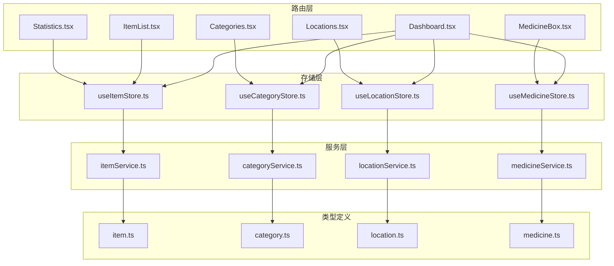
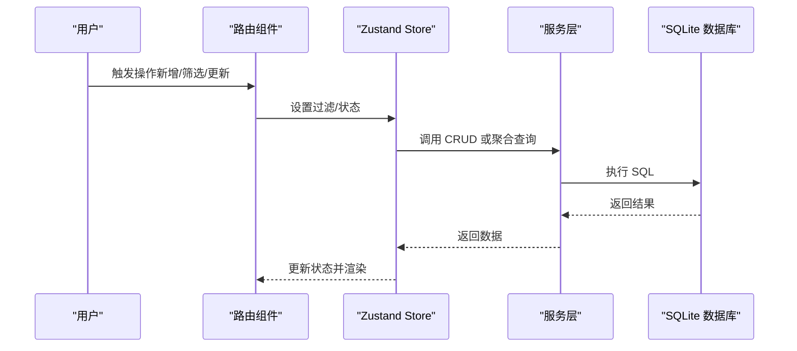
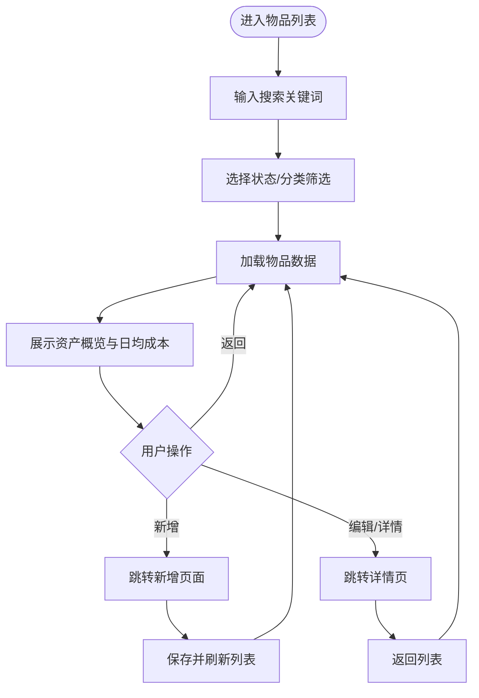
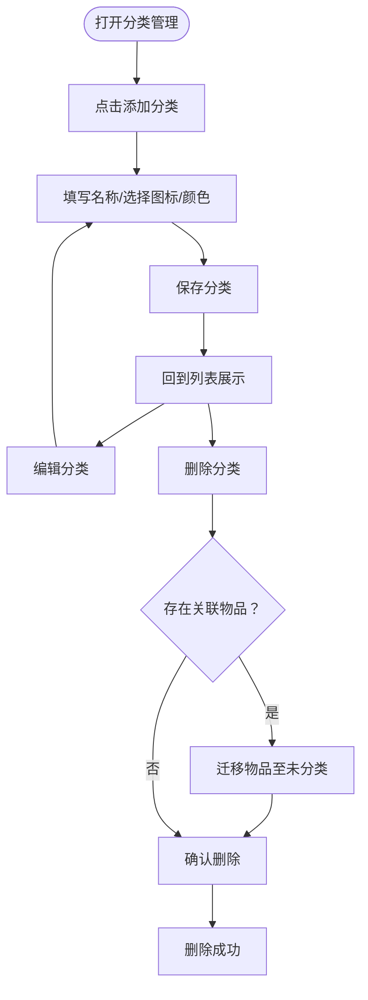
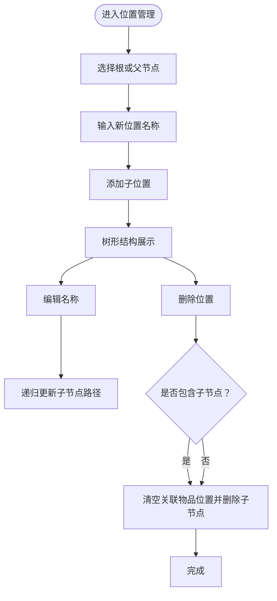
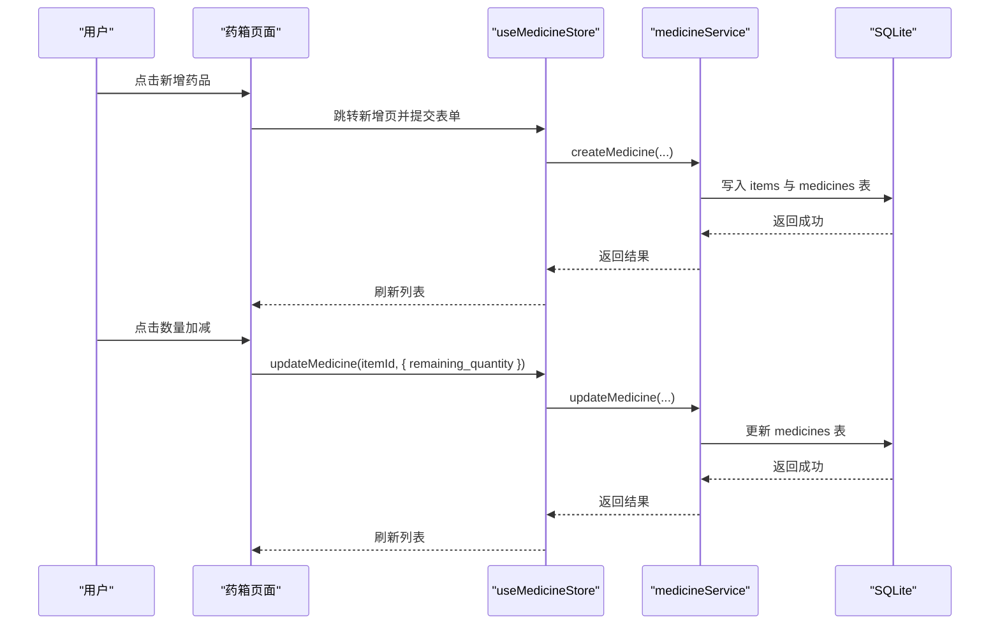
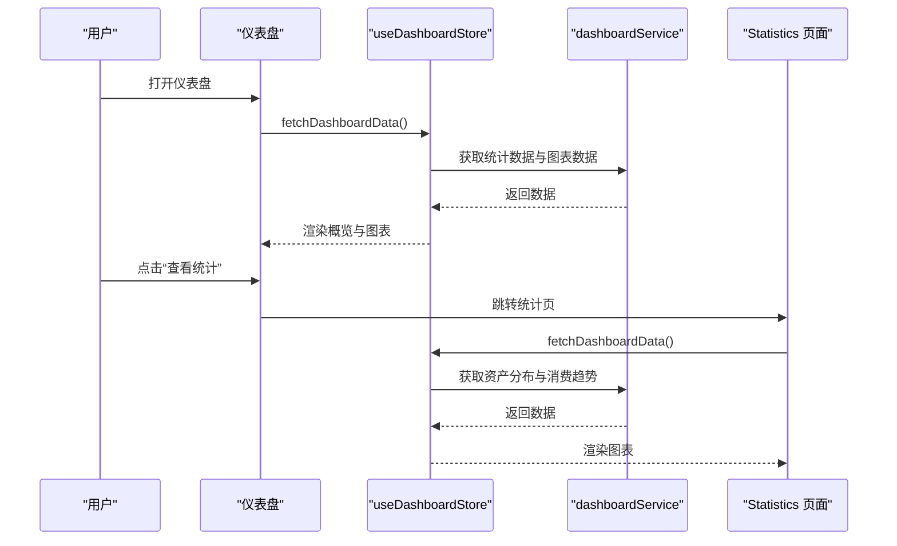
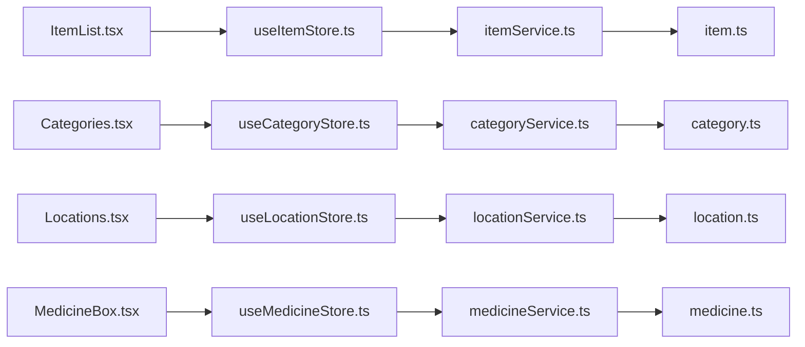

# 核心功能特性

<cite>
**本文引用的文件**
- [Dashboard.tsx](file://src/routes/Dashboard.tsx)
- [ItemList.tsx](file://src/routes/ItemList.tsx)
- [Categories.tsx](file://src/routes/Categories.tsx)
- [Locations.tsx](file://src/routes/Locations.tsx)
- [MedicineBox.tsx](file://src/routes/MedicineBox.tsx)
- [Statistics.tsx](file://src/routes/Statistics.tsx)
- [useItemStore.ts](file://src/stores/useItemStore.ts)
- [useCategoryStore.ts](file://src/stores/useCategoryStore.ts)
- [useLocationStore.ts](file://src/stores/useLocationStore.ts)
- [useMedicineStore.ts](file://src/stores/useMedicineStore.ts)
- [itemService.ts](file://src/services/itemService.ts)
- [categoryService.ts](file://src/services/categoryService.ts)
- [locationService.ts](file://src/services/locationService.ts)
- [medicineService.ts](file://src/services/medicineService.ts)
- [item.ts](file://src/types/item.ts)
- [category.ts](file://src/types/category.ts)
- [location.ts](file://src/types/location.ts)
- [medicine.ts](file://src/types/medicine.ts)
</cite>

## 目录
1. [简介](#简介)
2. [项目结构](#项目结构)
3. [核心组件](#核心组件)
4. [架构总览](#架构总览)
5. [详细组件分析](#详细组件分析)
6. [依赖分析](#依赖分析)
7. [性能考虑](#性能考虑)
8. [故障排除指南](#故障排除指南)
9. [结论](#结论)
10. [附录](#附录)

## 简介
本文件面向 Assetly 项目的核心功能特性，围绕五大模块进行系统化说明：物品管理、分类管理、位置管理、药箱管理、数据统计。内容涵盖业务价值、实现方式、用户交互流程与实际使用效果，并提供具体使用场景与操作示例，帮助不同背景的读者快速理解与落地应用。

## 项目结构
- 路由层：负责页面级视图与用户交互，如仪表盘、物品列表、分类、位置、药箱、统计等。
- 存储层（Zustand）：集中管理各模块的状态与过滤条件，统一触发服务层调用。
- 服务层：封装数据库访问逻辑，提供 CRUD 与聚合查询能力。
- 类型定义：统一数据模型与表单结构，确保前后端一致。
- 组件与图表：复用卡片、选择器、日期选择器、饼图、面积图等，提升交互一致性。

**图表来源**
- [Dashboard.tsx:13-217](file://src/routes/Dashboard.tsx#L13-L217)
- [ItemList.tsx:19-184](file://src/routes/ItemList.tsx#L19-L184)
- [Categories.tsx:11-183](file://src/routes/Categories.tsx#L11-L183)
- [Locations.tsx:7-115](file://src/routes/Locations.tsx#L7-L115)
- [MedicineBox.tsx:18-111](file://src/routes/MedicineBox.tsx#L18-L111)
- [Statistics.tsx:9-84](file://src/routes/Statistics.tsx#L9-L84)
- [useItemStore.ts:23-52](file://src/stores/useItemStore.ts#L23-L52)
- [useCategoryStore.ts:14-43](file://src/stores/useCategoryStore.ts#L14-L43)
- [useLocationStore.ts:15-42](file://src/stores/useLocationStore.ts#L15-L42)
- [useMedicineStore.ts:15-41](file://src/stores/useMedicineStore.ts#L15-L41)
- [itemService.ts:10-44](file://src/services/itemService.ts#L10-L44)
- [categoryService.ts:9-18](file://src/services/categoryService.ts#L9-L18)
- [locationService.ts:9-12](file://src/services/locationService.ts#L9-L12)
- [medicineService.ts:10-37](file://src/services/medicineService.ts#L10-L37)

**章节来源**
- [Dashboard.tsx:13-217](file://src/routes/Dashboard.tsx#L13-L217)
- [ItemList.tsx:19-184](file://src/routes/ItemList.tsx#L19-L184)
- [Categories.tsx:11-183](file://src/routes/Categories.tsx#L11-L183)
- [Locations.tsx:7-115](file://src/routes/Locations.tsx#L7-L115)
- [MedicineBox.tsx:18-111](file://src/routes/MedicineBox.tsx#L18-L111)
- [Statistics.tsx:9-84](file://src/routes/Statistics.tsx#L9-L84)

## 核心组件
- 物品管理：支持物品录入、状态追踪、智能搜索、多维筛选、日均成本计算。
- 分类管理：默认分类、自定义分类、图标与颜色设置。
- 位置管理：树形结构、路径生成、层级管理。
- 药箱管理：过期预警、用药提醒、类型分类。
- 数据统计：资产分布、消费趋势、资产总览。

**章节来源**
- [ItemList.tsx:51-68](file://src/routes/ItemList.tsx#L51-L68)
- [Categories.tsx:8-9](file://src/routes/Categories.tsx#L8-L9)
- [Locations.tsx:8-103](file://src/routes/Locations.tsx#L8-L103)
- [MedicineBox.tsx:38-67](file://src/routes/MedicineBox.tsx#L38-L67)
- [Statistics.tsx:34-81](file://src/routes/Statistics.tsx#L34-L81)

## 架构总览
- 前端采用 React + Zustand，路由层通过存储层触发服务层，服务层基于 SQLite 数据库执行读写。
- 各模块通过统一的过滤参数与分页策略协作，保证查询性能与用户体验。
- 图表组件用于可视化统计结果，增强信息密度与可读性。

**图表来源**
- [useItemStore.ts:28-32](file://src/stores/useItemStore.ts#L28-L32)
- [useCategoryStore.ts:18-22](file://src/stores/useCategoryStore.ts#L18-L22)
- [useLocationStore.ts:20-25](file://src/stores/useLocationStore.ts#L20-L25)
- [useMedicineStore.ts:20-26](file://src/stores/useMedicineStore.ts#L20-L26)
- [itemService.ts:10-44](file://src/services/itemService.ts#L10-L44)
- [categoryService.ts:9-12](file://src/services/categoryService.ts#L9-L12)
- [locationService.ts:9-12](file://src/services/locationService.ts#L9-L12)
- [medicineService.ts:10-37](file://src/services/medicineService.ts#L10-L37)

## 详细组件分析

### 物品管理
- 业务价值
  - 提供物品全生命周期管理：从购买到处置，支持状态追踪与成本核算。
  - 通过日均成本计算辅助预算与折旧分析，提升资产管理效率。
- 实现方式
  - 列表页集成搜索、状态筛选与分类标签，支持按名称模糊匹配与状态过滤。
  - 使用货币工具计算日均成本，结合购买价格与使用天数得出。
- 用户交互流程
  - 新增物品 → 填写基础信息与分类/位置 → 保存并返回列表 → 支持后续编辑与状态变更。
  - 在列表页通过搜索框与筛选器快速定位目标物品。
- 实际使用效果
  - 清晰的资产概览与日均成本展示，便于决策与优化配置。
- 使用场景与示例
  - 家庭资产盘点：在“我的物品”中按分类筛选，查看各类别资产占比与总值。
  - 成本控制：关注日均成本变化，识别高成本物品并调整采购策略。

**图表来源**
- [ItemList.tsx:19-184](file://src/routes/ItemList.tsx#L19-L184)
- [useItemStore.ts:23-52](file://src/stores/useItemStore.ts#L23-L52)
- [itemService.ts:10-44](file://src/services/itemService.ts#L10-L44)

**章节来源**
- [ItemList.tsx:51-68](file://src/routes/ItemList.tsx#L51-L68)
- [useItemStore.ts:23-52](file://src/stores/useItemStore.ts#L23-L52)
- [itemService.ts:10-44](file://src/services/itemService.ts#L10-L44)
- [item.ts:24-29](file://src/types/item.ts#L24-L29)

### 分类管理
- 业务价值
  - 通过图标与颜色提升分类辨识度，统一物品归类标准，降低管理复杂度。
- 实现方式
  - 支持新增、编辑、删除分类；删除时将关联物品移至“未分类”，避免数据丢失。
  - 提供预设图标与颜色选项，便于快速配置。
- 用户交互流程
  - 点击“添加分类”打开表单 → 填写名称 → 选择图标与颜色 → 保存。
  - 删除前提示关联物品数量，确认后执行迁移与删除。
- 实际使用效果
  - 分类体系清晰，视觉识别强，便于批量筛选与报表生成。
- 使用场景与示例
  - 家庭常用分类：电子产品、服装、图书、药品保健等。
  - 自定义分类：根据家庭成员或用途细分，如“爸爸用品”、“厨房用具”。

**图表来源**
- [Categories.tsx:11-183](file://src/routes/Categories.tsx#L11-L183)
- [categoryService.ts:44-49](file://src/services/categoryService.ts#L44-L49)

**章节来源**
- [Categories.tsx:8-9](file://src/routes/Categories.tsx#L8-L9)
- [Categories.tsx:36-47](file://src/routes/Categories.tsx#L36-L47)
- [categoryService.ts:44-49](file://src/services/categoryService.ts#L44-L49)
- [category.ts:3-11](file://src/types/category.ts#L3-L11)

### 位置管理
- 业务价值
  - 以树形结构管理空间位置，自动维护路径与层级，便于物品定位与空间规划。
- 实现方式
  - 创建位置时根据父节点生成完整路径与层级；重命名时递归更新子节点路径。
  - 支持添加子位置、编辑名称、删除位置（含级联删除与物品位置清空）。
- 用户交互流程
  - 选择根或某节点 → 输入名称 → 添加子位置。
  - 编辑时直接在列表中修改名称，保存后路径同步更新。
  - 删除时弹出确认，包含级联影响说明。
- 实际使用效果
  - 位置关系一目了然，物品定位更高效，空间利用率提升。
- 使用场景与示例
  - 家庭空间：客厅/沙发/茶几；卧室/床头柜；厨房/冰箱等。
  - 办公空间：工位/抽屉/文件夹等。

**图表来源**
- [Locations.tsx:7-115](file://src/routes/Locations.tsx#L7-L115)
- [locationService.ts:20-92](file://src/services/locationService.ts#L20-L92)
- [locationService.ts:94-122](file://src/services/locationService.ts#L94-L122)
- [locationService.ts:124-142](file://src/services/locationService.ts#L124-L142)

**章节来源**
- [Locations.tsx:8-103](file://src/routes/Locations.tsx#L8-L103)
- [locationService.ts:20-92](file://src/services/locationService.ts#L20-L92)
- [locationService.ts:94-122](file://src/services/locationService.ts#L94-L122)
- [locationService.ts:124-142](file://src/services/locationService.ts#L124-L142)
- [location.ts:3-13](file://src/types/location.ts#L3-L13)

### 药箱管理
- 业务价值
  - 集中管理药品信息，提供过期预警与用药提醒，保障家庭健康安全。
- 实现方式
  - 按类型（内服/外用/急救）分组展示；支持剩余数量变动与到期提醒。
  - 通过服务层查询即将过期与正在服用的药品，驱动界面展示。
- 用户交互流程
  - 新增药品 → 填写基本信息与用药计划 → 保存后在列表中查看。
  - 通过标签切换查看不同类型药品；点击卡片进入编辑页。
  - 数量变更通过按钮加减，实时更新并持久化。
- 实际使用效果
  - 药品库存可视化，过期风险可控，用药依从性提升。
- 使用场景与示例
  - 家庭常备药：感冒药、创可贴、退烧药等按类型分类管理。
  - 慢病用药：每日/每周服药计划，配合提醒功能。

**图表来源**
- [MedicineBox.tsx:18-111](file://src/routes/MedicineBox.tsx#L18-L111)
- [useMedicineStore.ts:28-36](file://src/stores/useMedicineStore.ts#L28-L36)
- [medicineService.ts:54-95](file://src/services/medicineService.ts#L54-L95)
- [medicineService.ts:97-162](file://src/services/medicineService.ts#L97-L162)

**章节来源**
- [MedicineBox.tsx:38-67](file://src/routes/MedicineBox.tsx#L38-L67)
- [MedicineBox.tsx:98-108](file://src/routes/MedicineBox.tsx#L98-L108)
- [useMedicineStore.ts:20-26](file://src/stores/useMedicineStore.ts#L20-L26)
- [medicineService.ts:164-193](file://src/services/medicineService.ts#L164-L193)
- [medicine.ts:7-27](file://src/types/medicine.ts#L7-L27)

### 数据统计
- 业务价值
  - 通过可视化图表呈现资产分布与消费趋势，辅助财务与采购决策。
- 实现方式
  - 仪表盘汇总总资产、物品总数、药品数量与过期预警数。
  - 统计页提供资产分布饼图与近六个月消费趋势面积图。
- 用户交互流程
  - 进入仪表盘 → 查看概览卡片与图表 → 点击“查看统计”进入详细页。
  - 统计页加载完成后展示图表与摘要信息。
- 实际使用效果
  - 数据驱动的资产管理，直观掌握资产结构与支出动态。
- 使用场景与示例
  - 月度/季度资产盘点：查看资产分布与消费趋势，识别异常波动。
  - 预算制定：结合消费趋势预测未来支出，优化采购计划。

**图表来源**
- [Dashboard.tsx:15-21](file://src/routes/Dashboard.tsx#L15-L21)
- [Statistics.tsx:9-15](file://src/routes/Statistics.tsx#L9-L15)
- [Statistics.tsx:25-28](file://src/routes/Statistics.tsx#L25-L28)

**章节来源**
- [Dashboard.tsx:49-78](file://src/routes/Dashboard.tsx#L49-L78)
- [Dashboard.tsx:193-213](file://src/routes/Dashboard.tsx#L193-L213)
- [Statistics.tsx:34-81](file://src/routes/Statistics.tsx#L34-L81)

## 依赖分析
- 组件耦合
  - 路由组件仅依赖对应存储，存储依赖服务层，服务层依赖数据库与工具函数，形成清晰的单向依赖。
- 关键依赖链
  - 物品列表 → useItemStore → itemService → SQLite
  - 分类管理 → useCategoryStore → categoryService → SQLite
  - 位置管理 → useLocationStore → locationService → SQLite
  - 药箱管理 → useMedicineStore → medicineService → SQLite
- 外部依赖
  - 图表组件依赖独立的图表模块，提供可复用的可视化能力。
- 循环依赖
  - 未发现循环依赖，模块职责明确。

**图表来源**
- [ItemList.tsx:19-24](file://src/routes/ItemList.tsx#L19-L24)
- [Categories.tsx:11-17](file://src/routes/Categories.tsx#L11-L17)
- [Locations.tsx:7-13](file://src/routes/Locations.tsx#L7-L13)
- [MedicineBox.tsx:18-21](file://src/routes/MedicineBox.tsx#L18-L21)
- [useItemStore.ts:23-26](file://src/stores/useItemStore.ts#L23-L26)
- [useCategoryStore.ts:14-17](file://src/stores/useCategoryStore.ts#L14-L17)
- [useLocationStore.ts:15-18](file://src/stores/useLocationStore.ts#L15-L18)
- [useMedicineStore.ts:15-18](file://src/stores/useMedicineStore.ts#L15-L18)
- [itemService.ts:1-8](file://src/services/itemService.ts#L1-L8)
- [categoryService.ts:1-7](file://src/services/categoryService.ts#L1-L7)
- [locationService.ts:1-7](file://src/services/locationService.ts#L1-L7)
- [medicineService.ts:1-7](file://src/services/medicineService.ts#L1-L7)

**章节来源**
- [useItemStore.ts:23-52](file://src/stores/useItemStore.ts#L23-L52)
- [useCategoryStore.ts:14-43](file://src/stores/useCategoryStore.ts#L14-L43)
- [useLocationStore.ts:15-42](file://src/stores/useLocationStore.ts#L15-L42)
- [useMedicineStore.ts:15-41](file://src/stores/useMedicineStore.ts#L15-L41)

## 性能考虑
- 查询优化
  - 物品与药品查询均支持多条件过滤，建议在高频字段建立索引以提升检索性能。
- 渲染优化
  - 列表页采用虚拟滚动与懒加载策略，减少大数据集下的渲染压力。
- 状态管理
  - 使用轻量状态切片，避免不必要的全局重渲染；合理拆分过滤条件与加载状态。
- 图表性能
  - 图表组件按需渲染，数据量大时可启用采样或分页展示。

## 故障排除指南
- 物品搜索无效
  - 检查搜索关键词长度与过滤条件是否正确传递至存储层与服务层。
  - 确认数据库中是否存在匹配记录。
- 分类删除失败
  - 确认是否存在关联物品；若存在，需先迁移至“未分类”再删除。
- 位置路径异常
  - 修改父节点名称后需检查子节点路径是否同步更新；必要时手动触发路径重建。
- 药品数量不更新
  - 检查按钮事件绑定与状态更新流程；确认服务层更新语句执行成功。
- 统计图表空白
  - 确认数据加载完成后再渲染图表；检查数据格式与图表组件参数。

**章节来源**
- [itemService.ts:37-40](file://src/services/itemService.ts#L37-L40)
- [categoryService.ts:44-49](file://src/services/categoryService.ts#L44-L49)
- [locationService.ts:75-92](file://src/services/locationService.ts#L75-L92)
- [medicineService.ts:153-161](file://src/services/medicineService.ts#L153-L161)
- [Statistics.tsx:17-23](file://src/routes/Statistics.tsx#L17-L23)

## 结论
Assetly 的五大核心功能模块以清晰的分层架构实现，覆盖从物品录入、分类与位置管理到药箱与统计分析的完整闭环。通过直观的交互设计与可视化展示，帮助用户高效管理家庭资产，提升日常运营效率与风险控制能力。建议在生产环境中进一步完善索引策略与缓存机制，持续优化查询与渲染性能。

## 附录
- 快速操作清单
  - 新增物品：点击“添加” → 填写信息 → 保存。
  - 新增分类：点击“添加分类” → 选择图标与颜色 → 保存。
  - 新增位置：选择根或父节点 → 输入名称 → 添加。
  - 新增药品：点击“添加药品” → 填写用药计划 → 保存。
  - 查看统计：点击“查看统计” → 浏览资产分布与消费趋势。
- 最佳实践
  - 保持分类与位置命名规范，便于长期维护。
  - 定期清理过期药品，关注药箱预警信息。
  - 利用搜索与筛选功能快速定位物品，提高工作效率。