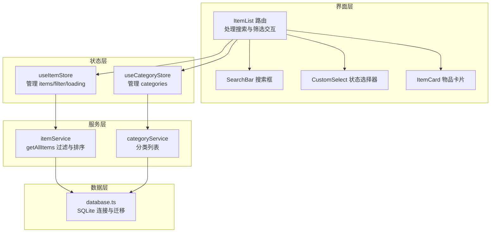
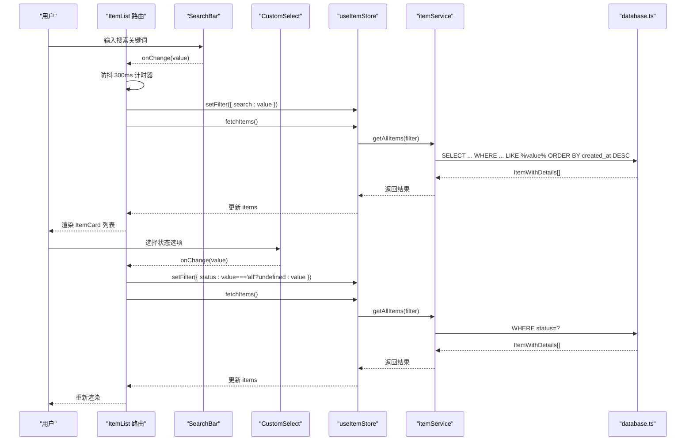
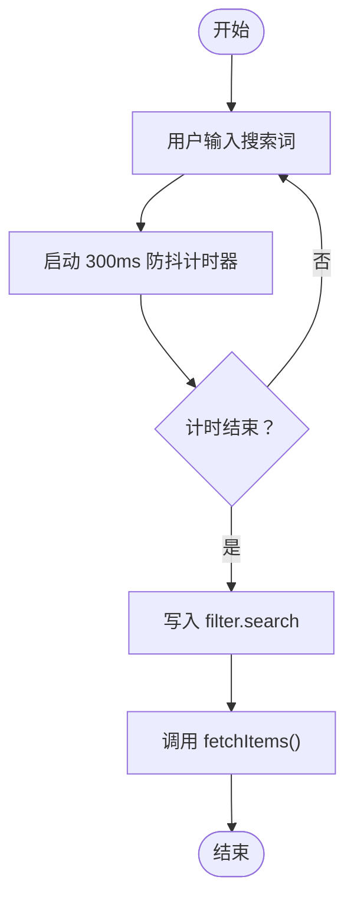
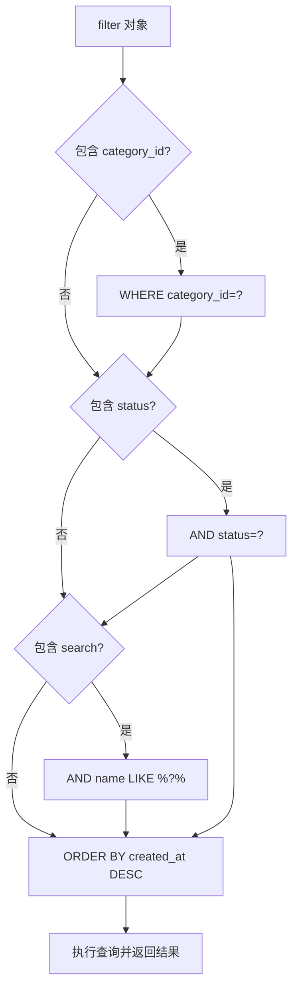
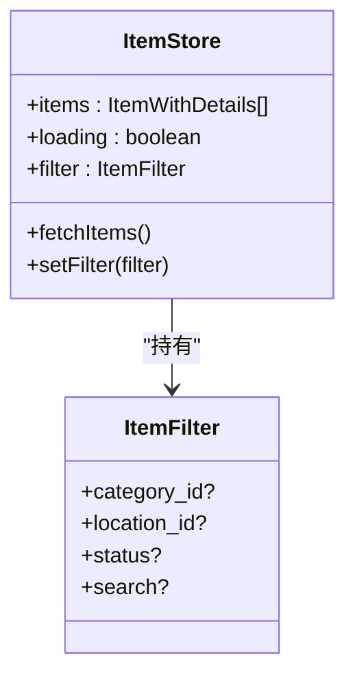
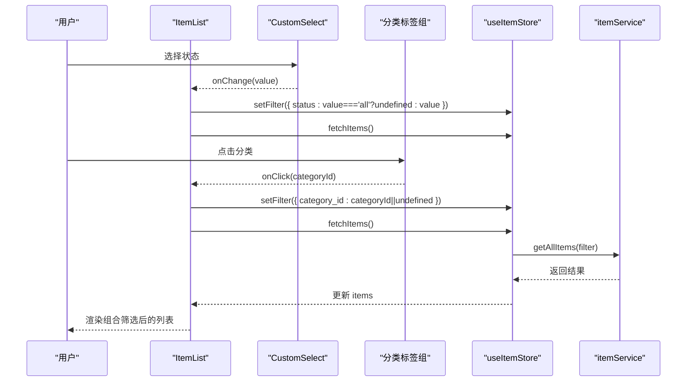
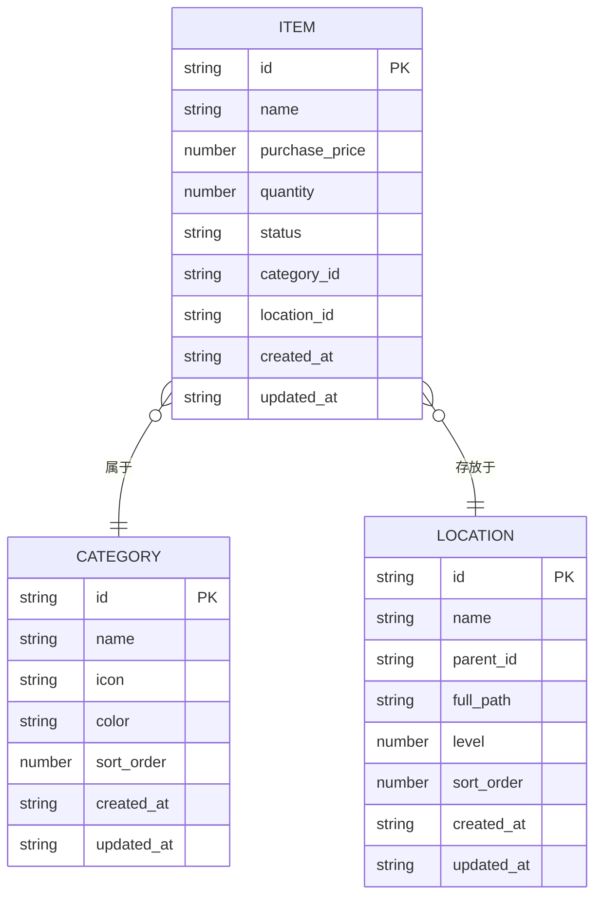
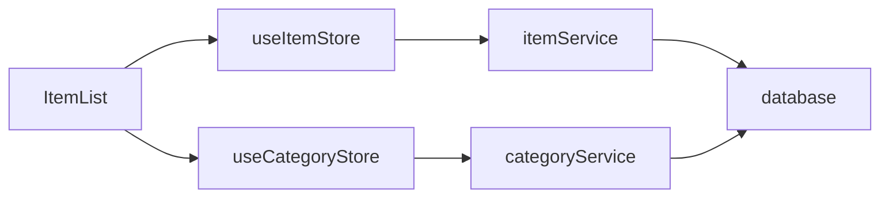

# 搜索与筛选

<cite>
**本文引用的文件**
- [src/routes/ItemList.tsx](file://src/routes/ItemList.tsx)
- [src/components/shared/SearchBar.tsx](file://src/components/shared/SearchBar.tsx)
- [src/components/shared/CustomSelect.tsx](file://src/components/shared/CustomSelect.tsx)
- [src/stores/useItemStore.ts](file://src/stores/useItemStore.ts)
- [src/stores/useCategoryStore.ts](file://src/stores/useCategoryStore.ts)
- [src/services/itemService.ts](file://src/services/itemService.ts)
- [src/services/categoryService.ts](file://src/services/categoryService.ts)
- [src/services/database.ts](file://src/services/database.ts)
- [src/types/item.ts](file://src/types/item.ts)
- [src/types/category.ts](file://src/types/category.ts)
- [src/utils/constants.ts](file://src/utils/constants.ts)
- [src/components/items/ItemCard.tsx](file://src/components/items/ItemCard.tsx)
</cite>

## 目录
1. [简介](#简介)
2. [项目结构](#项目结构)
3. [核心组件](#核心组件)
4. [架构总览](#架构总览)
5. [详细组件分析](#详细组件分析)
6. [依赖关系分析](#依赖关系分析)
7. [性能考虑](#性能考虑)
8. [故障排查指南](#故障排查指南)
9. [结论](#结论)
10. [附录：使用示例](#附录使用示例)

## 简介
本文件聚焦“物品搜索与筛选”功能，系统性阐述智能搜索的实现原理与多维筛选架构。内容覆盖：
- 防抖机制（300ms 延迟）与输入响应链路
- 模糊匹配算法与数据库 LIKE 查询
- 实时结果更新与状态管理
- 多维筛选：状态筛选（全部、服役中、已闲置、已处置）、分类筛选与组合筛选
- 性能优化策略：数据库索引、查询参数化、结果排序与内存管理
- 使用示例：通过名称搜索、状态过滤与分类筛选快速定位目标物品

## 项目结构
该功能由路由层、UI 组件层、状态管理层、服务层与数据库层协同完成，形成清晰的分层架构。

图表来源
- [src/routes/ItemList.tsx:19-184](file://src/routes/ItemList.tsx#L19-L184)
- [src/stores/useItemStore.ts:23-52](file://src/stores/useItemStore.ts#L23-L52)
- [src/stores/useCategoryStore.ts:14-43](file://src/stores/useCategoryStore.ts#L14-L43)
- [src/services/itemService.ts:10-44](file://src/services/itemService.ts#L10-L44)
- [src/services/categoryService.ts:9-18](file://src/services/categoryService.ts#L9-L18)
- [src/services/database.ts:8-16](file://src/services/database.ts#L8-L16)

章节来源
- [src/routes/ItemList.tsx:19-184](file://src/routes/ItemList.tsx#L19-L184)
- [src/stores/useItemStore.ts:23-52](file://src/stores/useItemStore.ts#L23-L52)
- [src/stores/useCategoryStore.ts:14-43](file://src/stores/useCategoryStore.ts#L14-L43)
- [src/services/itemService.ts:10-44](file://src/services/itemService.ts#L10-L44)
- [src/services/categoryService.ts:9-18](file://src/services/categoryService.ts#L9-L18)
- [src/services/database.ts:8-16](file://src/services/database.ts#L8-L16)

## 核心组件
- 搜索输入与清空：SearchBar 提供基础输入与一键清空能力，支持占位符与受控值。
- 状态筛选：CustomSelect 提供移动端友好的弹窗选择器，支持“全部/服役中/已闲置/已处置”切换。
- 分类筛选：ItemList 中渲染分类标签组，点击切换 category_id 过滤。
- 数据加载与过滤：useItemStore 维护 filter 与 items，触发服务层查询；itemService 将 filter 映射为 SQL 条件。
- 结果展示：ItemList 渲染 ItemCard 列表，支持加载态与空状态。

章节来源
- [src/components/shared/SearchBar.tsx:9-30](file://src/components/shared/SearchBar.tsx#L9-L30)
- [src/components/shared/CustomSelect.tsx:17-108](file://src/components/shared/CustomSelect.tsx#L17-L108)
- [src/routes/ItemList.tsx:12-184](file://src/routes/ItemList.tsx#L12-L184)
- [src/stores/useItemStore.ts:5-21](file://src/stores/useItemStore.ts#L5-L21)
- [src/services/itemService.ts:10-44](file://src/services/itemService.ts#L10-L44)
- [src/components/items/ItemCard.tsx:27-93](file://src/components/items/ItemCard.tsx#L27-L93)

## 架构总览
下图展示了从用户输入到数据库查询再到结果渲染的完整流程。

图表来源
- [src/routes/ItemList.tsx:24-49](file://src/routes/ItemList.tsx#L24-L49)
- [src/stores/useItemStore.ts:28-32](file://src/stores/useItemStore.ts#L28-L32)
- [src/services/itemService.ts:10-44](file://src/services/itemService.ts#L10-L44)
- [src/services/database.ts:8-16](file://src/services/database.ts#L8-L16)

## 详细组件分析

### 搜索输入与防抖机制
- 用户在 SearchBar 中输入时，ItemList 的状态会更新 search 值。
- 设置 300ms 定时器，超时后将 search 写入 store 的 filter，并触发 fetchItems。
- 清空按钮可一键清空搜索词，同时清除 filter.search 并刷新列表。
- 防抖避免频繁请求，提升交互流畅度与网络/数据库压力控制。

图表来源
- [src/routes/ItemList.tsx:24-38](file://src/routes/ItemList.tsx#L24-L38)
- [src/components/shared/SearchBar.tsx:9-30](file://src/components/shared/SearchBar.tsx#L9-L30)

章节来源
- [src/routes/ItemList.tsx:24-38](file://src/routes/ItemList.tsx#L24-L38)
- [src/components/shared/SearchBar.tsx:9-30](file://src/components/shared/SearchBar.tsx#L9-L30)

### 模糊匹配算法与数据库查询
- itemService.getAllItems 接收 filter 对象，按需拼接 SQL 条件。
- 搜索条件使用 LIKE %keyword%，实现不区分位置的模糊匹配。
- 其他筛选条件包括：category_id、location_id、status。
- 最终按 created_at 降序返回，保证新创建的物品优先显示。

图表来源
- [src/services/itemService.ts:10-44](file://src/services/itemService.ts#L10-L44)

章节来源
- [src/services/itemService.ts:10-44](file://src/services/itemService.ts#L10-L44)

### 实时结果更新与状态管理
- useItemStore 维护 items、loading、filter 三要素。
- setFilter 合并新过滤条件，fetchItems 发起异步请求，更新 items 并关闭 loading。
- ItemList 在 items 变化时自动重渲染，实现“所见即所得”的实时反馈。

图表来源
- [src/stores/useItemStore.ts:12-21](file://src/stores/useItemStore.ts#L12-L21)
- [src/stores/useItemStore.ts:23-52](file://src/stores/useItemStore.ts#L23-L52)

章节来源
- [src/stores/useItemStore.ts:12-21](file://src/stores/useItemStore.ts#L12-L21)
- [src/stores/useItemStore.ts:23-52](file://src/stores/useItemStore.ts#L23-L52)

### 多维筛选架构
- 状态筛选：CustomSelect 提供“全部/服役中/已闲置/已处置”，切换时写入 filter.status 或清除，随后 fetchItems。
- 分类筛选：ItemList 渲染分类标签组，点击切换 filter.category_id，支持“全部”与具体分类。
- 组合筛选：store 中的 filter 是对象合并的结果，最终在 SQL 中以 AND 条件组合，实现多维组合筛选。

图表来源
- [src/routes/ItemList.tsx:40-49](file://src/routes/ItemList.tsx#L40-L49)
- [src/components/shared/CustomSelect.tsx:17-108](file://src/components/shared/CustomSelect.tsx#L17-L108)
- [src/stores/useItemStore.ts:28-32](file://src/stores/useItemStore.ts#L28-L32)
- [src/services/itemService.ts:10-44](file://src/services/itemService.ts#L10-L44)

章节来源
- [src/routes/ItemList.tsx:40-49](file://src/routes/ItemList.tsx#L40-L49)
- [src/components/shared/CustomSelect.tsx:17-108](file://src/components/shared/CustomSelect.tsx#L17-L108)
- [src/stores/useItemStore.ts:28-32](file://src/stores/useItemStore.ts#L28-L32)
- [src/services/itemService.ts:10-44](file://src/services/itemService.ts#L10-L44)

### 数据模型与类型约束
- Item 与 ItemWithDetails：包含名称、价格、数量、状态、分类与位置等字段，支持扩展图标与路径。
- Category 与 CategoryFormData：分类的基本信息与表单数据。
- 状态枚举：ItemStatus 限定为 active/archived/disposed。

图表来源
- [src/types/item.ts:5-29](file://src/types/item.ts#L5-L29)
- [src/types/category.ts:3-11](file://src/types/category.ts#L3-L11)
- [src/services/database.ts:67-103](file://src/services/database.ts#L67-L103)

章节来源
- [src/types/item.ts:5-29](file://src/types/item.ts#L5-L29)
- [src/types/category.ts:3-11](file://src/types/category.ts#L3-L11)
- [src/services/database.ts:67-103](file://src/services/database.ts#L67-L103)

## 依赖关系分析
- 路由层依赖状态层与服务层；状态层依赖服务层；服务层依赖数据库层。
- 关键依赖链：ItemList → useItemStore → itemService → database。
- 分类筛选依赖 useCategoryStore 与 categoryService，用于渲染分类标签组。

图表来源
- [src/routes/ItemList.tsx:19-23](file://src/routes/ItemList.tsx#L19-L23)
- [src/stores/useItemStore.ts:23-52](file://src/stores/useItemStore.ts#L23-L52)
- [src/stores/useCategoryStore.ts:14-43](file://src/stores/useCategoryStore.ts#L14-L43)
- [src/services/itemService.ts:10-44](file://src/services/itemService.ts#L10-L44)
- [src/services/categoryService.ts:9-18](file://src/services/categoryService.ts#L9-L18)
- [src/services/database.ts:8-16](file://src/services/database.ts#L8-L16)

章节来源
- [src/routes/ItemList.tsx:19-23](file://src/routes/ItemList.tsx#L19-L23)
- [src/stores/useItemStore.ts:23-52](file://src/stores/useItemStore.ts#L23-L52)
- [src/stores/useCategoryStore.ts:14-43](file://src/stores/useCategoryStore.ts#L14-L43)
- [src/services/itemService.ts:10-44](file://src/services/itemService.ts#L10-L44)
- [src/services/categoryService.ts:9-18](file://src/services/categoryService.ts#L9-L18)
- [src/services/database.ts:8-16](file://src/services/database.ts#L8-L16)

## 性能考虑
- 防抖策略：300ms 防抖降低请求频率，缓解 UI 与数据库压力。
- 参数化查询：itemService 使用参数占位符拼接 SQL，避免注入风险并利于执行计划复用。
- 索引优化：数据库迁移中为 items 表的关键列建立索引（category_id、location_id、status），加速过滤。
- 排序策略：默认按 created_at 降序，有利于新物品优先展示，减少前端二次排序开销。
- 内存管理：store 仅保存必要字段；列表渲染采用虚拟滚动或分页可进一步优化（当前为全量渲染）。
- 缓存策略：当前未实现应用层缓存；可在 store 层引入基于 filter 的结果缓存，命中则直接返回，未命中再走查询。

章节来源
- [src/routes/ItemList.tsx:24-38](file://src/routes/ItemList.tsx#L24-L38)
- [src/services/itemService.ts:10-44](file://src/services/itemService.ts#L10-L44)
- [src/services/database.ts:124-131](file://src/services/database.ts#L124-L131)

## 故障排查指南
- 搜索无结果
  - 检查 filter.search 是否正确写入 store，确认 fetchItems 是否被调用。
  - 确认数据库中是否存在匹配名称（LIKE %keyword%）的数据。
- 状态筛选无效
  - 检查 CustomSelect 的 onChange 是否设置 filter.status 或清除。
  - 确认 SQL 中 status 条件是否生效。
- 分类筛选异常
  - 检查分类标签点击事件是否设置 filter.category_id。
  - 确认分类列表是否正确加载（useCategoryStore）。
- 性能问题
  - 观察防抖是否生效，避免频繁输入导致过多请求。
  - 检查数据库索引是否存在，确认查询是否命中索引。
- 类型与字段问题
  - 确认 ItemWithDetails 字段与数据库 JOIN 查询一致。
  - 检查状态枚举与常量映射是否一致。

章节来源
- [src/routes/ItemList.tsx:40-49](file://src/routes/ItemList.tsx#L40-L49)
- [src/stores/useItemStore.ts:28-32](file://src/stores/useItemStore.ts#L28-L32)
- [src/services/itemService.ts:10-44](file://src/services/itemService.ts#L10-L44)
- [src/services/database.ts:124-131](file://src/services/database.ts#L124-L131)
- [src/utils/constants.ts:22-27](file://src/utils/constants.ts#L22-L27)

## 结论
该搜索与筛选系统通过“防抖 + 参数化查询 + 多维过滤 + 默认排序”的组合，实现了稳定、直观且高效的物品检索体验。建议后续引入应用层缓存与索引优化，以进一步提升大规模数据下的响应速度与资源占用表现。

## 附录：使用示例
以下示例展示如何通过名称搜索、状态过滤与分类筛选快速定位目标物品：

- 名称搜索
  - 在搜索框中输入关键词，等待 300ms 防抖结束后，系统自动根据名称模糊匹配并刷新列表。
  - 参考路径：[src/routes/ItemList.tsx:24-38](file://src/routes/ItemList.tsx#L24-L38)，[src/services/itemService.ts:37-40](file://src/services/itemService.ts#L37-L40)

- 状态过滤
  - 点击状态选择器，选择“服役中/已闲置/已处置”，系统自动设置 filter.status 并刷新列表。
  - 参考路径：[src/routes/ItemList.tsx:40-44](file://src/routes/ItemList.tsx#L40-L44)，[src/services/itemService.ts:33-36](file://src/services/itemService.ts#L33-L36)

- 分类筛选
  - 点击分类标签“全部”或具体分类，系统设置 filter.category_id 并刷新列表。
  - 参考路径：[src/routes/ItemList.tsx:46-49](file://src/routes/ItemList.tsx#L46-L49)，[src/services/itemService.ts:25-28](file://src/services/itemService.ts#L25-L28)

- 组合筛选
  - 同时设置搜索词、状态与分类，系统将多个条件以 AND 组合查询，返回精确结果。
  - 参考路径：[src/stores/useItemStore.ts:49-51](file://src/stores/useItemStore.ts#L49-L51)，[src/services/itemService.ts:25-40](file://src/services/itemService.ts#L25-L40)