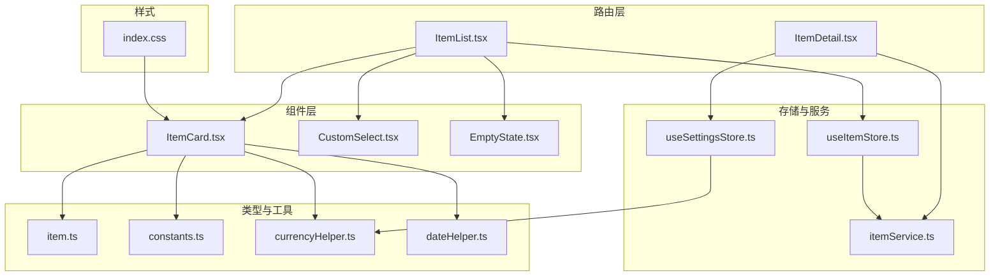
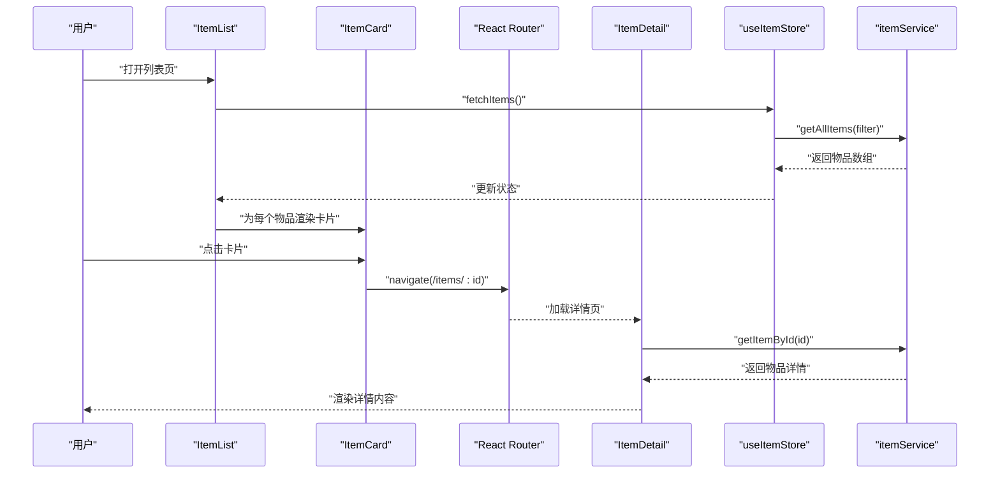
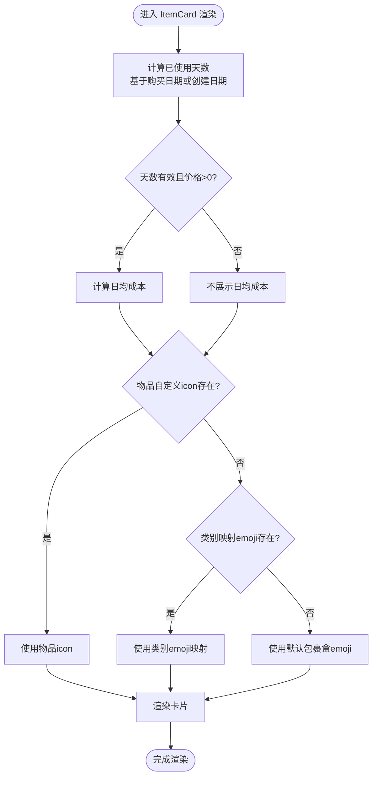
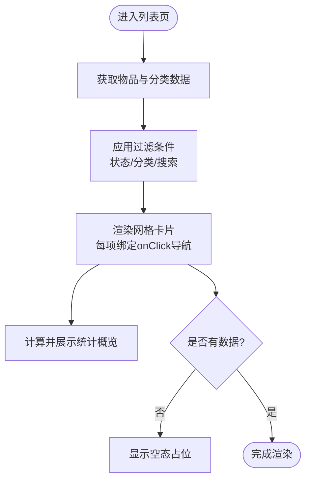
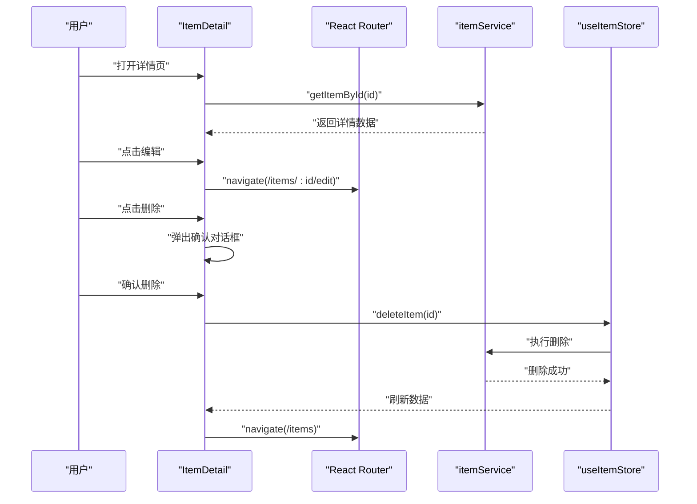
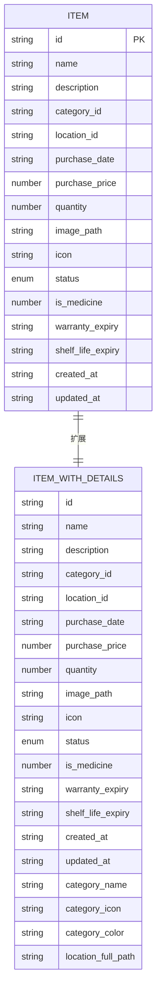
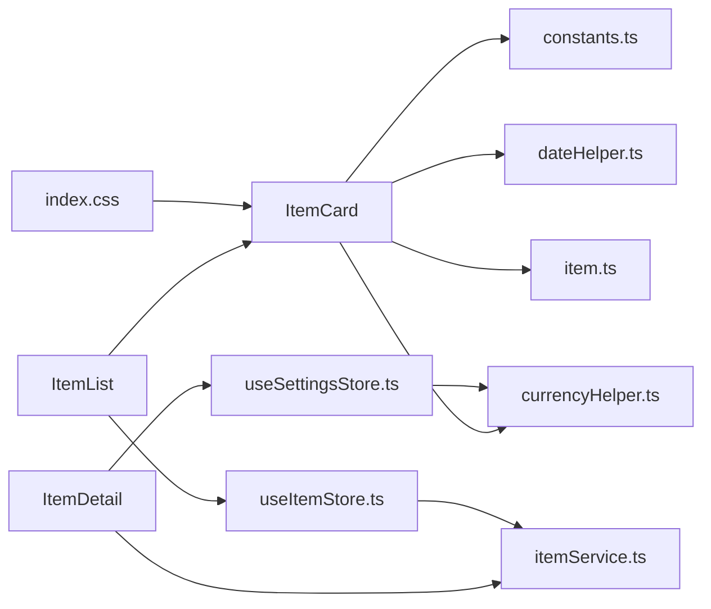

# 物品卡片展示

<cite>
**本文引用的文件**
- [ItemCard.tsx](file://src/components/items/ItemCard.tsx)
- [item.ts](file://src/types/item.ts)
- [ItemList.tsx](file://src/routes/ItemList.tsx)
- [ItemDetail.tsx](file://src/routes/ItemDetail.tsx)
- [useItemStore.ts](file://src/stores/useItemStore.ts)
- [constants.ts](file://src/utils/constants.ts)
- [currencyHelper.ts](file://src/utils/currencyHelper.ts)
- [dateHelper.ts](file://src/utils/dateHelper.ts)
- [itemService.ts](file://src/services/itemService.ts)
- [index.css](file://src/index.css)
- [useSettingsStore.ts](file://src/stores/useSettingsStore.ts)
- [EmptyState.tsx](file://src/components/shared/EmptyState.tsx)
- [CustomSelect.tsx](file://src/components/shared/CustomSelect.tsx)
</cite>

## 目录
1. [简介](#简介)
2. [项目结构](#项目结构)
3. [核心组件](#核心组件)
4. [架构总览](#架构总览)
5. [详细组件分析](#详细组件分析)
6. [依赖关系分析](#依赖关系分析)
7. [性能考量](#性能考量)
8. [故障排查指南](#故障排查指南)
9. [结论](#结论)
10. [附录](#附录)

## 简介
本文件围绕“物品卡片展示”组件进行系统化技术文档编写，重点聚焦 ItemCard 组件的设计架构与实现细节，包括：
- 卡片布局与信息密度控制
- 视觉层次设计（图标、状态标签、价格与日均成本）
- 响应式网格布局与触摸交互优化
- 点击交互处理（路由跳转、状态切换、动画效果）
- 组件定制指南（样式覆盖、事件处理、扩展开发）

该组件在列表页以网格形式呈现，支持按状态、分类、关键词筛选，并通过轻量动画提升交互体验；在详情页则提供更丰富的信息展示与操作入口。

## 项目结构
与物品卡片展示相关的核心文件分布如下：
- 组件层：ItemCard.tsx（卡片）、CustomSelect.tsx（筛选下拉）、EmptyState.tsx（空态）
- 路由层：ItemList.tsx（列表页）、ItemDetail.tsx（详情页）
- 类型定义：item.ts（Item/ItemWithDetails）
- 工具与常量：constants.ts（状态标签映射）、currencyHelper.ts（货币格式化与日均成本计算）、dateHelper.ts（日期计算）
- 存储层：useItemStore.ts（数据获取与过滤）、useSettingsStore.ts（主题色与货币符号）
- 服务层：itemService.ts（数据库访问）
- 样式：index.css（主题变量与全局样式）

图表来源
- [ItemList.tsx:1-185](file://src/routes/ItemList.tsx#L1-L185)
- [ItemDetail.tsx:1-168](file://src/routes/ItemDetail.tsx#L1-L168)
- [ItemCard.tsx:1-94](file://src/components/items/ItemCard.tsx#L1-L94)
- [CustomSelect.tsx:1-109](file://src/components/shared/CustomSelect.tsx#L1-L109)
- [EmptyState.tsx:1-22](file://src/components/shared/EmptyState.tsx#L1-L22)
- [item.ts:1-46](file://src/types/item.ts#L1-L46)
- [constants.ts:1-40](file://src/utils/constants.ts#L1-L40)
- [currencyHelper.ts:1-17](file://src/utils/currencyHelper.ts#L1-L17)
- [dateHelper.ts:1-52](file://src/utils/dateHelper.ts#L1-L52)
- [useItemStore.ts:1-53](file://src/stores/useItemStore.ts#L1-L53)
- [useSettingsStore.ts:1-56](file://src/stores/useSettingsStore.ts#L1-L56)
- [itemService.ts:1-127](file://src/services/itemService.ts#L1-L127)
- [index.css:1-84](file://src/index.css#L1-L84)

章节来源
- [ItemList.tsx:1-185](file://src/routes/ItemList.tsx#L1-L185)
- [ItemCard.tsx:1-94](file://src/components/items/ItemCard.tsx#L1-L94)

## 核心组件
- ItemCard：单个物品卡片，负责渲染物品名称、图标、状态标签、总价与日均成本，并提供点击跳转到详情页的能力。
- ItemList：物品列表页，包含搜索、状态与分类筛选、统计概览、网格布局与空态处理。
- ItemDetail：物品详情页，展示完整信息与操作入口（编辑、删除）。
- useItemStore：Zustand 状态管理，封装数据获取、过滤、增删改查。
- useSettingsStore：设置存储，提供主题色与货币符号等全局配置。
- 自定义组件：CustomSelect（移动端底部弹出选择器）、EmptyState（空态占位）。

章节来源
- [ItemCard.tsx:1-94](file://src/components/items/ItemCard.tsx#L1-L94)
- [ItemList.tsx:1-185](file://src/routes/ItemList.tsx#L1-L185)
- [ItemDetail.tsx:1-168](file://src/routes/ItemDetail.tsx#L1-L168)
- [useItemStore.ts:1-53](file://src/stores/useItemStore.ts#L1-L53)
- [useSettingsStore.ts:1-56](file://src/stores/useSettingsStore.ts#L1-L56)
- [CustomSelect.tsx:1-109](file://src/components/shared/CustomSelect.tsx#L1-L109)
- [EmptyState.tsx:1-22](file://src/components/shared/EmptyState.tsx#L1-L22)

## 架构总览
ItemCard 所属的数据流与交互链路如下：
- 列表页（ItemList）通过 useItemStore 获取物品列表，并将每个 Item 渲染为 ItemCard。
- ItemCard 接收 onClick 回调，触发路由跳转至 ItemDetail。
- ItemDetail 从 itemService 拉取单条数据，计算日均成本并渲染详情。
- useSettingsStore 提供货币符号，currencyHelper/formatCurrency 控制金额展示。
- dateHelper 提供日期计算（如已使用天数），用于日均成本计算。

图表来源
- [ItemList.tsx:172-179](file://src/routes/ItemList.tsx#L172-L179)
- [ItemCard.tsx:45-47](file://src/components/items/ItemCard.tsx#L45-L47)
- [ItemDetail.tsx:21-23](file://src/routes/ItemDetail.tsx#L21-L23)
- [useItemStore.ts:28-32](file://src/stores/useItemStore.ts#L28-L32)
- [itemService.ts:10-44](file://src/services/itemService.ts#L10-L44)

## 详细组件分析

### ItemCard 组件分析
- 设计目标
  - 在有限空间内清晰传达关键信息：名称、图标、状态、总价、日均成本。
  - 通过视觉层级与颜色区分状态，确保可读性与一致性。
  - 提供点击反馈与缩放动画，增强触摸交互体验。
- 关键信息展示策略
  - 名称：使用简洁字体与截断策略，避免长名溢出。
  - 图标：优先使用物品自定义 icon，其次使用类别映射 emoji，最后回退默认包裹盒。
  - 状态标签：根据状态值映射中文标签，使用语义化颜色。
  - 总价：基于购买单价与数量计算，结合货币符号格式化。
  - 日均成本：仅当有效日期与正价格时展示，计算逻辑来自工具函数。
- 布局与视觉层次
  - 头部区域：左对齐图标区，右对齐状态标签，形成信息分组。
  - 中部区域：名称、总价与使用天数组合，紧凑排布。
  - 底部区域：日均成本展示框，强调“成本”概念。
- 交互与动画
  - 容器具备点击光标与按下缩放（active:scale），提供即时反馈。
  - 点击回调由父组件传入，便于统一处理导航与状态切换。
- 响应式与触摸优化
  - 使用 Tailwind 类控制圆角、阴影、边框与间距，适配移动端与桌面端。
  - 移动端网格列数通过 CSS Grid 断点控制，保证在小屏设备上的可读性与点击面积。

图表来源
- [ItemCard.tsx:30-42](file://src/components/items/ItemCard.tsx#L30-L42)
- [dateHelper.ts:26-28](file://src/utils/dateHelper.ts#L26-L28)
- [currencyHelper.ts:13-16](file://src/utils/currencyHelper.ts#L13-L16)

章节来源
- [ItemCard.tsx:1-94](file://src/components/items/ItemCard.tsx#L1-L94)
- [constants.ts:22-27](file://src/utils/constants.ts#L22-L27)
- [currencyHelper.ts:1-17](file://src/utils/currencyHelper.ts#L1-L17)
- [dateHelper.ts:1-52](file://src/utils/dateHelper.ts#L1-L52)

### 列表页（ItemList）与网格布局
- 网格布局
  - 采用 CSS Grid，列数随屏幕宽度递增：移动端两列，中等屏三列，大屏四列，保证信息密度与可读性。
- 过滤与搜索
  - 支持状态筛选（全部/服役中/已闲置/已处置）、分类筛选（类目按钮组）、关键词搜索（带防抖）。
  - 过滤条件通过 useItemStore.setFilter 与 fetchItems 同步更新。
- 统计概览
  - 展示总资产、日均成本与各类别数量，帮助用户快速掌握资产状况。
- 空态处理
  - 当无数据时显示 EmptyState，引导用户添加物品。

图表来源
- [ItemList.tsx:19-68](file://src/routes/ItemList.tsx#L19-L68)
- [ItemList.tsx:172-181](file://src/routes/ItemList.tsx#L172-L181)
- [EmptyState.tsx:10-21](file://src/components/shared/EmptyState.tsx#L10-L21)

章节来源
- [ItemList.tsx:1-185](file://src/routes/ItemList.tsx#L1-L185)
- [EmptyState.tsx:1-22](file://src/components/shared/EmptyState.tsx#L1-L22)

### 详情页（ItemDetail）与点击交互
- 导航与返回
  - 顶部返回按钮使用浏览器历史导航，详情页编辑与删除入口提供一致的交互路径。
- 信息密度控制
  - 顶部展示图标与名称、状态标签；中部展示总价与日均成本；下方以信息卡片形式罗列分类、位置、购买日期、数量与备注。
- 点击交互处理
  - 编辑按钮触发路由跳转至编辑页；删除按钮弹出确认对话框，确认后删除并返回列表。
- 动画与过渡
  - 卡片与按钮使用过渡动画，提升交互流畅度。

图表来源
- [ItemDetail.tsx:13-30](file://src/routes/ItemDetail.tsx#L13-L30)
- [ItemDetail.tsx:54-67](file://src/routes/ItemDetail.tsx#L54-L67)
- [ItemDetail.tsx:156-164](file://src/routes/ItemDetail.tsx#L156-L164)
- [useItemStore.ts:44-47](file://src/stores/useItemStore.ts#L44-L47)
- [itemService.ts:121-126](file://src/services/itemService.ts#L121-L126)

章节来源
- [ItemDetail.tsx:1-168](file://src/routes/ItemDetail.tsx#L1-L168)
- [useItemStore.ts:1-53](file://src/stores/useItemStore.ts#L1-L53)
- [itemService.ts:1-127](file://src/services/itemService.ts#L1-L127)

### 数据模型与类型约束
- Item 与 ItemWithDetails
  - Item 定义了物品的基础字段（名称、描述、分类、位置、购买日期、价格、数量、图片路径、图标、状态、是否药品、质保/保质期、创建/更新时间）。
  - ItemWithDetails 在 Item 基础上扩展了分类名称、图标、颜色与位置全路径，便于在列表与详情中直接使用。
- 状态枚举与标签映射
  - ItemStatus 包含 active/archived/disposed 三种状态，配合 constants.ts 的映射实现中文标签展示。

图表来源
- [item.ts:5-29](file://src/types/item.ts#L5-L29)

章节来源
- [item.ts:1-46](file://src/types/item.ts#L1-L46)
- [constants.ts:22-27](file://src/utils/constants.ts#L22-L27)

## 依赖关系分析
- 组件耦合
  - ItemCard 与 ItemList 高内聚：ItemList 负责数据与过滤，ItemCard 专注展示与交互。
  - ItemDetail 与 itemService 解耦：通过服务层抽象数据库访问，便于测试与替换。
- 外部依赖
  - 货币格式化与日均成本计算依赖工具函数，减少重复逻辑。
  - 设置存储 useSettingsStore 提供主题色与货币符号，影响全局样式与数值展示。
- 潜在循环依赖
  - 未发现直接循环导入；组件间通过 props 传递回调，避免反向依赖。

图表来源
- [ItemCard.tsx:1-94](file://src/components/items/ItemCard.tsx#L1-L94)
- [ItemList.tsx:1-185](file://src/routes/ItemList.tsx#L1-L185)
- [ItemDetail.tsx:1-168](file://src/routes/ItemDetail.tsx#L1-L168)
- [useItemStore.ts:1-53](file://src/stores/useItemStore.ts#L1-L53)
- [useSettingsStore.ts:1-56](file://src/stores/useSettingsStore.ts#L1-L56)
- [itemService.ts:1-127](file://src/services/itemService.ts#L1-L127)
- [index.css:1-84](file://src/index.css#L1-L84)

章节来源
- [ItemList.tsx:1-185](file://src/routes/ItemList.tsx#L1-L185)
- [ItemDetail.tsx:1-168](file://src/routes/ItemDetail.tsx#L1-L168)
- [useItemStore.ts:1-53](file://src/stores/useItemStore.ts#L1-L53)
- [useSettingsStore.ts:1-56](file://src/stores/useSettingsStore.ts#L1-L56)

## 性能考量
- 渲染优化
  - 列表页使用 CSS Grid 实现高效布局，避免复杂嵌套容器。
  - ItemCard 内部仅包含必要元素，减少 DOM 层级，降低重排开销。
- 计算优化
  - 日均成本计算在渲染前完成，避免在渲染过程中重复计算。
  - 搜索输入使用防抖，减少频繁请求与重渲染。
- 数据获取
  - useItemStore 封装 fetchItems，集中处理 loading 状态与错误处理，避免组件内部重复逻辑。
- 样式与主题
  - 主题变量集中于 index.css，动态修改主题色时仅需更新 CSS 变量，避免全量重绘。

[本节为通用性能建议，无需特定文件来源]

## 故障排查指南
- 卡片点击无反应
  - 检查 ItemCard 的 onClick 是否正确传入，以及父组件是否正确绑定导航逻辑。
  - 参考路径：[ItemCard.tsx:45-47](file://src/components/items/ItemCard.tsx#L45-L47)，[ItemList.tsx:174-178](file://src/routes/ItemList.tsx#L174-L178)
- 日均成本不显示
  - 确认购买日期与价格有效，且已使用天数大于 0。
  - 参考路径：[ItemCard.tsx:33-35](file://src/components/items/ItemCard.tsx#L33-L35)，[dateHelper.ts:26-28](file://src/utils/dateHelper.ts#L26-L28)，[currencyHelper.ts:13-16](file://src/utils/currencyHelper.ts#L13-L16)
- 状态标签显示异常
  - 检查状态值是否为有效枚举，以及 constants.ts 中的映射是否存在。
  - 参考路径：[constants.ts:22-27](file://src/utils/constants.ts#L22-L27)，[item.ts:3](file://src/types/item.ts#L3)
- 货币格式不符合预期
  - 确认 useSettingsStore 中的 currencySymbol 设置，以及 formatCurrencyFull 的使用场景。
  - 参考路径：[useSettingsStore.ts:14-56](file://src/stores/useSettingsStore.ts#L14-L56)，[currencyHelper.ts:9-11](file://src/utils/currencyHelper.ts#L9-L11)
- 列表为空但未显示空态
  - 检查 items.length 与 loading 状态，确认 EmptyState 条件分支。
  - 参考路径：[ItemList.tsx:154-171](file://src/routes/ItemList.tsx#L154-L171)，[EmptyState.tsx:10-21](file://src/components/shared/EmptyState.tsx#L10-L21)

章节来源
- [ItemCard.tsx:1-94](file://src/components/items/ItemCard.tsx#L1-L94)
- [ItemList.tsx:1-185](file://src/routes/ItemList.tsx#L1-L185)
- [EmptyState.tsx:1-22](file://src/components/shared/EmptyState.tsx#L1-L22)
- [useSettingsStore.ts:1-56](file://src/stores/useSettingsStore.ts#L1-L56)
- [currencyHelper.ts:1-17](file://src/utils/currencyHelper.ts#L1-L17)
- [dateHelper.ts:1-52](file://src/utils/dateHelper.ts#L1-L52)
- [constants.ts:1-40](file://src/utils/constants.ts#L1-L40)
- [item.ts:1-46](file://src/types/item.ts#L1-L46)

## 结论
ItemCard 组件通过简洁的布局与明确的信息层级，在有限空间内高效传达物品关键信息。结合列表页的网格布局、筛选与统计功能，以及详情页的丰富信息与操作入口，形成了完整的物品展示与管理体验。其设计遵循低耦合、高内聚的原则，便于后续扩展与维护。

[本节为总结性内容，无需特定文件来源]

## 附录

### 响应式布局要点
- 网格列数：移动端两列，中等屏三列，大屏四列，确保在不同设备上的可读性与点击面积。
- 间距与圆角：统一使用 Tailwind 类控制卡片圆角与间距，保持视觉一致性。
- 移动端滚动与滚动条：隐藏移动端滚动条，桌面端提供自定义滚动条样式。

章节来源
- [ItemList.tsx:172](file://src/routes/ItemList.tsx#L172)
- [index.css:31-57](file://src/index.css#L31-L57)

### 点击交互与动画
- 卡片点击：容器具备点击光标与按下缩放，提供即时反馈。
- 下拉选择：CustomSelect 在移动端以底部弹窗形式呈现，支持滚动锁定与动画入场。
- 删除确认：详情页删除操作通过 ConfirmDialog 弹窗确认，防止误操作。

章节来源
- [ItemCard.tsx:45-47](file://src/components/items/ItemCard.tsx#L45-L47)
- [CustomSelect.tsx:21-29](file://src/components/shared/CustomSelect.tsx#L21-L29)
- [CustomSelect.tsx:52-105](file://src/components/shared/CustomSelect.tsx#L52-L105)
- [ItemDetail.tsx:156-164](file://src/routes/ItemDetail.tsx#L156-L164)

### 组件定制指南
- 样式覆盖
  - 通过 Tailwind 类覆盖默认样式，如圆角、阴影、边框与背景色。
  - 使用 CSS 变量（如 --color-primary）统一主题色，便于全局替换。
- 事件处理
  - 将 onClick 回调从父组件传入，支持自定义导航逻辑与状态切换。
  - 在列表页中，为每个 ItemCard 绑定 navigate('/items/:id')，实现统一跳转。
- 扩展开发
  - 新增字段：在 Item/ItemWithDetails 类型中扩展字段，并在服务层与详情页中同步展示。
  - 新增状态：在 constants.ts 中新增状态映射，并在 ItemCard 中补充对应样式与文案。
  - 自定义图标：在 CATEGORY_EMOJI 映射中增加类别到图标的映射，或允许物品自定义 icon 字段。

章节来源
- [index.css:3-18](file://src/index.css#L3-L18)
- [ItemList.tsx:174-178](file://src/routes/ItemList.tsx#L174-L178)
- [constants.ts:22-27](file://src/utils/constants.ts#L22-L27)
- [ItemCard.tsx:12-25](file://src/components/items/ItemCard.tsx#L12-L25)
- [item.ts:5-29](file://src/types/item.ts#L5-L29)