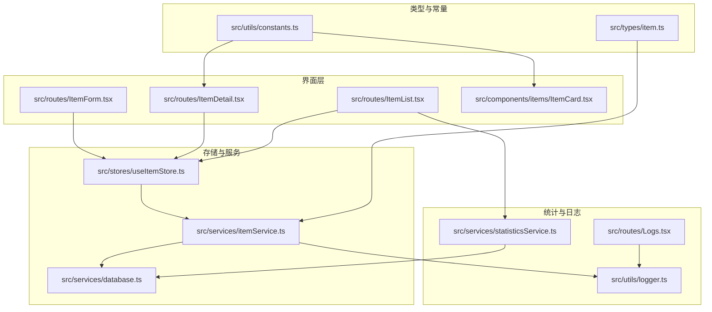
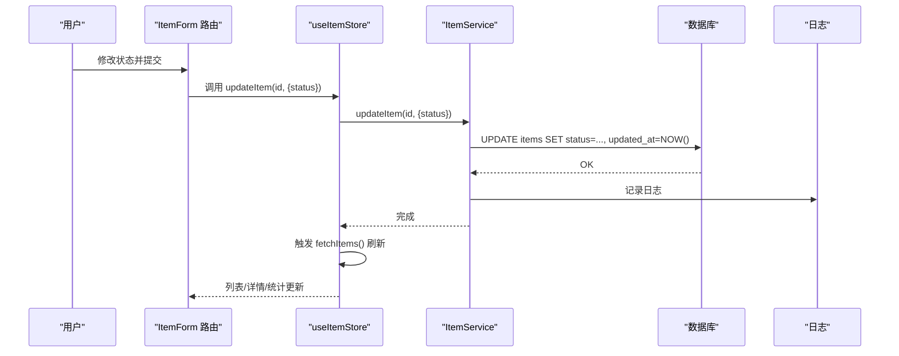
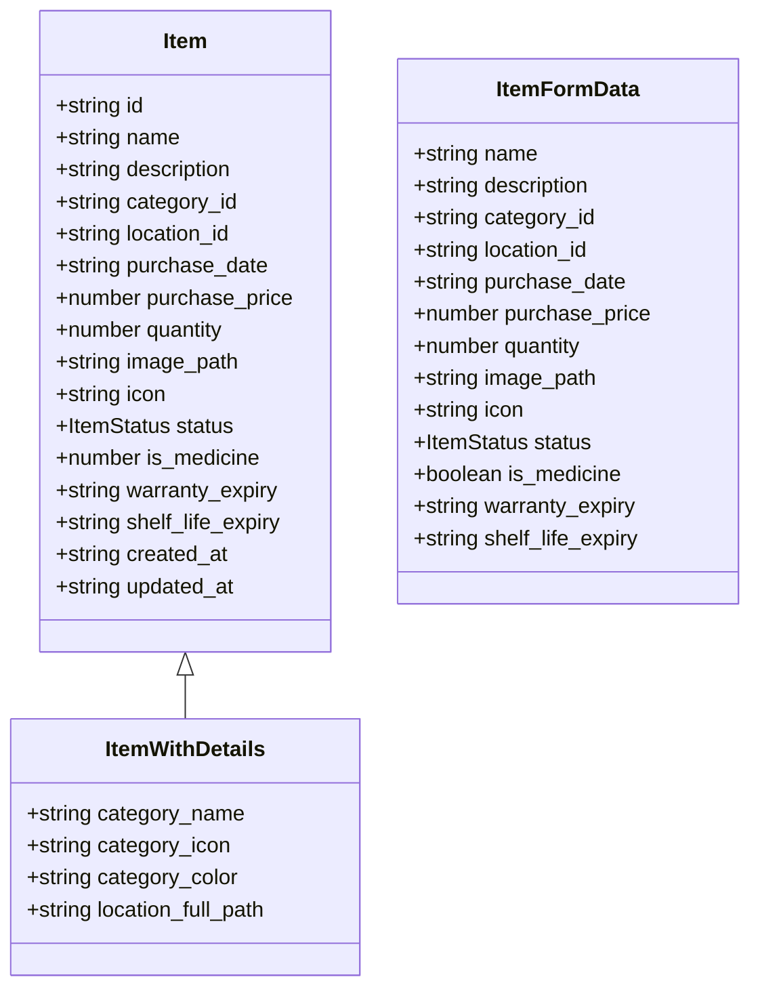
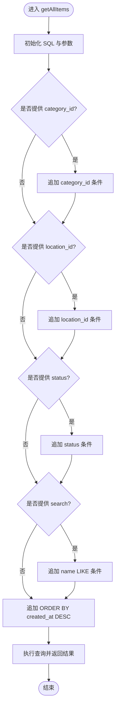
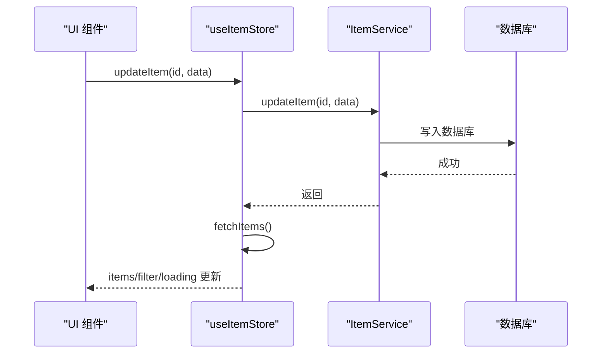
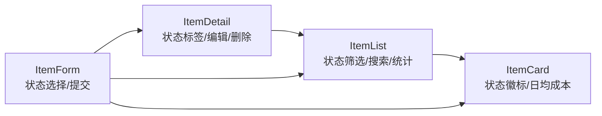
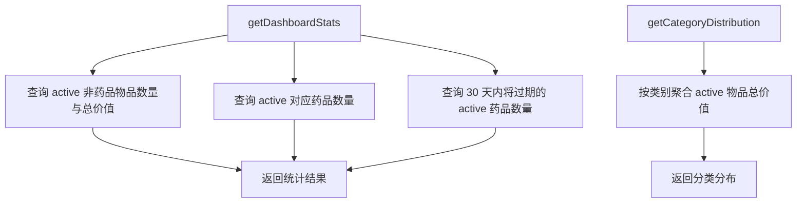
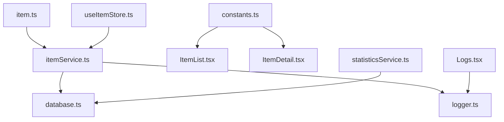

# 物品生命周期管理

<cite>
**本文引用的文件**
- [src/types/item.ts](file://src/types/item.ts)
- [src/services/itemService.ts](file://src/services/itemService.ts)
- [src/stores/useItemStore.ts](file://src/stores/useItemStore.ts)
- [src/routes/ItemList.tsx](file://src/routes/ItemList.tsx)
- [src/routes/ItemDetail.tsx](file://src/routes/ItemDetail.tsx)
- [src/routes/ItemForm.tsx](file://src/routes/ItemForm.tsx)
- [src/components/items/ItemCard.tsx](file://src/components/items/ItemCard.tsx)
- [src/utils/constants.ts](file://src/utils/constants.ts)
- [src/services/database.ts](file://src/services/database.ts)
- [src/services/statisticsService.ts](file://src/services/statisticsService.ts)
- [src/utils/logger.ts](file://src/utils/logger.ts)
- [src/routes/Logs.tsx](file://src/routes/Logs.tsx)
</cite>

## 目录
1. [简介](#简介)
2. [项目结构](#项目结构)
3. [核心组件](#核心组件)
4. [架构总览](#架构总览)
5. [详细组件分析](#详细组件分析)
6. [依赖关系分析](#依赖关系分析)
7. [性能考量](#性能考量)
8. [故障排查指南](#故障排查指南)
9. [结论](#结论)
10. [附录：生命周期示例与最佳实践](#附录生命周期示例与最佳实践)

## 简介
本文件围绕“物品生命周期管理”功能，系统性梳理状态枚举、状态流转规则、触发条件与业务约束，以及状态变更对统计、搜索过滤与报表的影响；同时阐明页面间的状态同步机制、UI 响应与数据刷新策略，并总结状态管理的最佳实践（状态校验、回滚与历史追踪），最后提供从新增到处置的完整生命周期示例与状态变化轨迹。

## 项目结构
该功能主要由以下层次构成：
- 类型层：定义物品状态与数据模型
- 服务层：封装数据库访问与业务逻辑（增删改查、状态更新）
- 存储层：集中管理列表数据、筛选器与刷新策略
- 路由与组件层：负责用户交互、表单提交、卡片渲染与统计展示
- 数据层：SQLite 表结构与索引，支持按状态检索与统计
- 日志与监控：内存日志收集与可视化

图表来源
- [src/types/item.ts:1-46](file://src/types/item.ts#L1-L46)
- [src/utils/constants.ts:22-27](file://src/utils/constants.ts#L22-L27)
- [src/stores/useItemStore.ts:12-52](file://src/stores/useItemStore.ts#L12-L52)
- [src/services/itemService.ts:10-127](file://src/services/itemService.ts#L10-L127)
- [src/services/database.ts:90-171](file://src/services/database.ts#L90-L171)
- [src/routes/ItemList.tsx:19-185](file://src/routes/ItemList.tsx#L19-L185)
- [src/routes/ItemDetail.tsx:13-168](file://src/routes/ItemDetail.tsx#L13-L168)
- [src/routes/ItemForm.tsx:29-263](file://src/routes/ItemForm.tsx#L29-L263)
- [src/components/items/ItemCard.tsx:27-94](file://src/components/items/ItemCard.tsx#L27-L94)
- [src/services/statisticsService.ts:4-38](file://src/services/statisticsService.ts#L4-L38)
- [src/utils/logger.ts:57-84](file://src/utils/logger.ts#L57-L84)
- [src/routes/Logs.tsx:14-150](file://src/routes/Logs.tsx#L14-L150)

章节来源
- [src/types/item.ts:1-46](file://src/types/item.ts#L1-L46)
- [src/services/database.ts:90-171](file://src/services/database.ts#L90-L171)

## 核心组件
- 状态枚举与数据模型
  - 状态枚举：active（服役中）、archived（已闲置）、disposed（已处置）
  - 数据模型：包含基础字段与状态字段，用于表单、详情与列表展示
- 服务层
  - 提供查询、创建、更新、删除等操作；支持按状态过滤与全文检索
- 存储层
  - 集中维护 items 列表、筛选器、加载态；统一触发刷新
- 统计与报表
  - 仅统计状态为 active 的物品，且排除药品（is_medicine=0）

章节来源
- [src/types/item.ts:3-45](file://src/types/item.ts#L3-L45)
- [src/services/itemService.ts:10-127](file://src/services/itemService.ts#L10-L127)
- [src/stores/useItemStore.ts:12-52](file://src/stores/useItemStore.ts#L12-L52)
- [src/services/statisticsService.ts:4-38](file://src/services/statisticsService.ts#L4-L38)

## 架构总览
状态管理贯穿“类型定义 → 服务层持久化 → 存储层刷新 → UI 展示”的闭环。状态变更通过表单提交或直接更新触发，随后统一调用服务层写入数据库并刷新本地状态，最终驱动多个页面的数据与 UI 同步。

图表来源
- [src/routes/ItemForm.tsx:67-81](file://src/routes/ItemForm.tsx#L67-L81)
- [src/stores/useItemStore.ts:39-42](file://src/stores/useItemStore.ts#L39-L42)
- [src/services/itemService.ts:89-119](file://src/services/itemService.ts#L89-L119)
- [src/utils/logger.ts:57-60](file://src/utils/logger.ts#L57-L60)

## 详细组件分析

### 状态枚举与数据模型
- 状态枚举：active、archived、disposed
- 数据模型：包含 id、name、description、category_id、location_id、purchase_date、purchase_price、quantity、image_path、icon、status、is_medicine、warranty_expiry、shelf_life_expiry、created_at、updated_at
- 表单数据模型：与数据模型一致，但 is_medicine 以布尔形式传入

图表来源
- [src/types/item.ts:5-45](file://src/types/item.ts#L5-L45)

章节来源
- [src/types/item.ts:3-45](file://src/types/item.ts#L3-L45)

### 服务层：状态变更与过滤
- 查询接口支持按 category_id、location_id、status、search 过滤
- 创建时默认状态为 active
- 更新接口支持动态拼接字段，包含 status 字段
- 删除接口会级联删除药品扩展信息

图表来源
- [src/services/itemService.ts:10-44](file://src/services/itemService.ts#L10-L44)

章节来源
- [src/services/itemService.ts:10-127](file://src/services/itemService.ts#L10-L127)

### 存储层：状态刷新与筛选
- 使用 zustand 管理 items、loading、filter
- 所有更新（新增、更新、删除）后统一调用 fetchItems 刷新
- 支持设置筛选器（category_id、location_id、status、search）

图表来源
- [src/stores/useItemStore.ts:39-42](file://src/stores/useItemStore.ts#L39-L42)
- [src/services/itemService.ts:89-119](file://src/services/itemService.ts#L89-L119)

章节来源
- [src/stores/useItemStore.ts:12-52](file://src/stores/useItemStore.ts#L12-L52)

### 页面层：状态展示与交互
- 列表页：支持按状态筛选、搜索；统计 active 数量与总价值、日均成本
- 详情页：展示状态标签与颜色；提供编辑与删除入口
- 卡片页：展示状态徽标与日均成本条
- 表单页：允许选择状态并提交

图表来源
- [src/routes/ItemList.tsx:19-185](file://src/routes/ItemList.tsx#L19-L185)
- [src/components/items/ItemCard.tsx:27-94](file://src/components/items/ItemCard.tsx#L27-L94)
- [src/routes/ItemDetail.tsx:13-168](file://src/routes/ItemDetail.tsx#L13-L168)
- [src/routes/ItemForm.tsx:29-263](file://src/routes/ItemForm.tsx#L29-L263)

章节来源
- [src/routes/ItemList.tsx:19-185](file://src/routes/ItemList.tsx#L19-L185)
- [src/routes/ItemDetail.tsx:13-168](file://src/routes/ItemDetail.tsx#L13-L168)
- [src/components/items/ItemCard.tsx:27-94](file://src/components/items/ItemCard.tsx#L27-L94)
- [src/routes/ItemForm.tsx:29-263](file://src/routes/ItemForm.tsx#L29-L263)

### 统计与报表：状态影响范围
- 仅统计状态为 active 的非药品物品（is_medicine=0）
- 分类分布按类别聚合 active 物品的总价值
- 日均成本与总价值计算均基于 active 状态

图表来源
- [src/services/statisticsService.ts:4-38](file://src/services/statisticsService.ts#L4-L38)

章节来源
- [src/services/statisticsService.ts:4-38](file://src/services/statisticsService.ts#L4-L38)

## 依赖关系分析
- 类型与常量
  - 状态标签映射：ITEM_STATUS_LABELS 将状态值映射为中文标签
- 存储与服务
  - useItemStore 依赖 itemService；itemService 依赖 database.ts 中的表结构与索引
- 统计与报表
  - statisticsService 依赖数据库查询，限定 active 与非药品
- 日志
  - itemService 在创建/删除时记录日志；Logs 页面展示内存日志

图表来源
- [src/types/item.ts:3-45](file://src/types/item.ts#L3-L45)
- [src/utils/constants.ts:22-27](file://src/utils/constants.ts#L22-L27)
- [src/stores/useItemStore.ts:12-52](file://src/stores/useItemStore.ts#L12-L52)
- [src/services/itemService.ts:10-127](file://src/services/itemService.ts#L10-L127)
- [src/services/database.ts:90-171](file://src/services/database.ts#L90-L171)
- [src/services/statisticsService.ts:4-38](file://src/services/statisticsService.ts#L4-L38)
- [src/utils/logger.ts:57-84](file://src/utils/logger.ts#L57-L84)
- [src/routes/Logs.tsx:14-150](file://src/routes/Logs.tsx#L14-L150)

章节来源
- [src/utils/constants.ts:22-27](file://src/utils/constants.ts#L22-L27)
- [src/services/database.ts:90-171](file://src/services/database.ts#L90-L171)

## 性能考量
- 数据库索引
  - items 表存在 status 索引，有利于按状态过滤
  - items、medicines、locations 等多处索引，提升查询效率
- 查询优化
  - 按需拼接 WHERE 条件，避免不必要的全表扫描
  - 使用参数化查询，防止注入并提升缓存命中
- 前端刷新
  - 所有状态变更后统一 fetchItems，减少分散刷新带来的重复请求
- 统计计算
  - 列表页与仪表盘统计均基于 active 非药品，避免无关数据干扰

章节来源
- [src/services/database.ts:124-131](file://src/services/database.ts#L124-L131)
- [src/services/itemService.ts:10-44](file://src/services/itemService.ts#L10-L44)
- [src/stores/useItemStore.ts:28-32](file://src/stores/useItemStore.ts#L28-L32)

## 故障排查指南
- 现象：状态未生效或页面未刷新
  - 排查：确认 useItemStore.updateItem 是否调用了 fetchItems；检查网络请求是否成功
  - 参考路径：[src/stores/useItemStore.ts:39-42](file://src/stores/useItemStore.ts#L39-L42)
- 现象：统计不准确
  - 排查：确认统计查询是否仅包含 active 且 is_medicine=0 的记录
  - 参考路径：[src/services/statisticsService.ts:7-18](file://src/services/statisticsService.ts#L7-L18)
- 现象：日志缺失
  - 排查：确认 logger 初始化与日志级别；查看 Logs 页面内存日志
  - 参考路径：[src/utils/logger.ts:57-84](file://src/utils/logger.ts#L57-L84)，[src/routes/Logs.tsx:14-150](file://src/routes/Logs.tsx#L14-L150)
- 现象：按状态筛选无效
  - 排查：确认 filter 中 status 字段是否正确传递给 getAllItems
  - 参考路径：[src/stores/useItemStore.ts:49-51](file://src/stores/useItemStore.ts#L49-L51)，[src/services/itemService.ts:33-36](file://src/services/itemService.ts#L33-L36)

章节来源
- [src/stores/useItemStore.ts:39-42](file://src/stores/useItemStore.ts#L39-L42)
- [src/services/statisticsService.ts:7-18](file://src/services/statisticsService.ts#L7-L18)
- [src/utils/logger.ts:57-84](file://src/utils/logger.ts#L57-L84)
- [src/routes/Logs.tsx:14-150](file://src/routes/Logs.tsx#L14-L150)
- [src/services/itemService.ts:33-36](file://src/services/itemService.ts#L33-L36)

## 结论
本系统通过明确的状态枚举、严格的过滤与统计约束、统一的刷新机制与完善的日志体系，实现了可靠的物品生命周期管理。状态变更在表单提交后统一落地并触发全局刷新，确保统计、搜索与报表的一致性。建议在后续版本中进一步引入状态机校验与历史审计，以增强可追溯性与安全性。

## 附录：生命周期示例与最佳实践

### 生命周期示例：从新增到处置
- 新增物品
  - 表单提交，状态默认为 active
  - 服务层写入数据库，记录日志
  - 存储层刷新，列表与统计更新
  - 参考路径：[src/routes/ItemForm.tsx:67-81](file://src/routes/ItemForm.tsx#L67-L81)，[src/services/itemService.ts:60-87](file://src/services/itemService.ts#L60-L87)，[src/stores/useItemStore.ts:34-37](file://src/stores/useItemStore.ts#L34-L37)
- 状态变更：从 active → archived
  - 用户在表单或详情页选择 archived
  - 服务层更新 status 并写入 updated_at
  - 存储层 fetchItems 刷新，列表与统计随之变化
  - 参考路径：[src/routes/ItemForm.tsx:236-248](file://src/routes/ItemForm.tsx#L236-L248)，[src/services/itemService.ts:89-119](file://src/services/itemService.ts#L89-L119)
- 状态变更：从 archived → disposed
  - 用户在列表或详情页选择 disposed
  - 服务层更新 status 并写入 updated_at
  - 存储层 fetchItems 刷新，统计不再计入该物品
  - 参考路径：[src/routes/ItemList.tsx:40-44](file://src/routes/ItemList.tsx#L40-L44)，[src/services/itemService.ts:89-119](file://src/services/itemService.ts#L89-L119)
- 删除物品
  - 删除后级联删除药品扩展信息，日志记录删除事件
  - 存储层 fetchItems 刷新，页面数据清空
  - 参考路径：[src/services/itemService.ts:121-127](file://src/services/itemService.ts#L121-L127)，[src/stores/useItemStore.ts:44-47](file://src/stores/useItemStore.ts#L44-L47)

### 最佳实践
- 状态验证
  - 在提交前校验状态值属于枚举集合，避免非法状态写入
  - 参考路径：[src/types/item.ts:3](file://src/types/item.ts#L3)
- 回滚机制
  - 对于批量状态变更，建议采用事务或临时缓存，失败时回滚
  - 参考路径：[src/services/itemService.ts:89-119](file://src/services/itemService.ts#L89-L119)
- 历史记录追踪
  - 为每次状态变更记录时间戳与操作来源，便于审计
  - 参考路径：[src/utils/logger.ts:57-84](file://src/utils/logger.ts#L57-L84)，[src/services/itemService.ts:76](file://src/services/itemService.ts#L76)
- 页面同步
  - 所有状态变更后统一调用 fetchItems，保证列表、详情、统计与报表一致
  - 参考路径：[src/stores/useItemStore.ts:34-47](file://src/stores/useItemStore.ts#L34-L47)