# 物品管理

<cite>
**本文引用的文件**
- [src/types/item.ts](file://src/types/item.ts)
- [src/services/itemService.ts](file://src/services/itemService.ts)
- [src/stores/useItemStore.ts](file://src/stores/useItemStore.ts)
- [src/routes/ItemList.tsx](file://src/routes/ItemList.tsx)
- [src/routes/ItemForm.tsx](file://src/routes/ItemForm.tsx)
- [src/routes/ItemDetail.tsx](file://src/routes/ItemDetail.tsx)
- [src/components/items/ItemCard.tsx](file://src/components/items/ItemCard.tsx)
- [src/services/database.ts](file://src/services/database.ts)
- [src/services/exportService.ts](file://src/services/exportService.ts)
- [src/utils/currencyHelper.ts](file://src/utils/currencyHelper.ts)
- [src/utils/dateHelper.ts](file://src/utils/dateHelper.ts)
- [src/utils/constants.ts](file://src/utils/constants.ts)
- [src/components/shared/SearchBar.tsx](file://src/components/shared/SearchBar.tsx)
- [README.md](file://README.md)
</cite>

## 目录
1. [简介](#简介)
2. [项目结构](#项目结构)
3. [核心组件](#核心组件)
4. [架构概览](#架构概览)
5. [详细组件分析](#详细组件分析)
6. [依赖关系分析](#依赖关系分析)
7. [性能考虑](#性能考虑)
8. [故障排除指南](#故障排除指南)
9. [结论](#结论)
10. [附录](#附录)

## 简介

Assetly 是一款跨平台的家庭物品管理应用，专注于物品的完整生命周期管理。该系统提供了从物品录入到状态追踪的全流程管理，包括智能搜索、多维筛选、日均成本计算等核心功能。

本系统采用现代技术栈构建，前端基于 React 19 和 TypeScript，后端通过 Tauri 框架集成 Rust，使用 SQLite 作为本地数据库存储。系统支持桌面端（macOS、Windows、Linux）和移动端（Android）平台。

## 项目结构

项目采用模块化组织方式，主要分为以下几个层次：

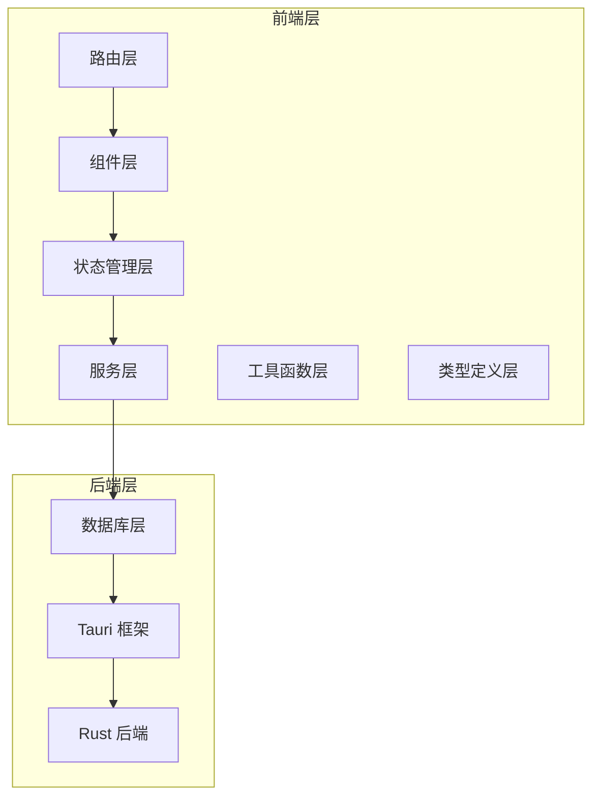

**图表来源**
- [src/routes/ItemList.tsx:1-185](file://src/routes/ItemList.tsx#L1-L185)
- [src/stores/useItemStore.ts:1-53](file://src/stores/useItemStore.ts#L1-L53)
- [src/services/itemService.ts:1-127](file://src/services/itemService.ts#L1-L127)
- [src/services/database.ts:1-171](file://src/services/database.ts#L1-L171)

**章节来源**
- [README.md:157-180](file://README.md#L157-L180)
- [README.md:184-198](file://README.md#L184-L198)

## 核心组件

### 数据模型设计

系统的核心数据模型围绕物品实体构建，支持完整的生命周期管理：

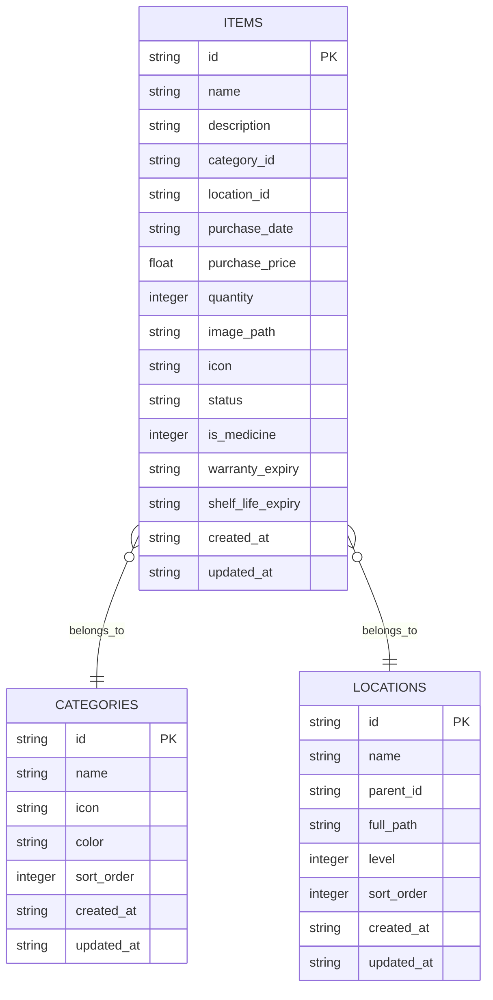

**图表来源**
- [src/types/item.ts:5-22](file://src/types/item.ts#L5-L22)
- [src/services/database.ts:67-103](file://src/services/database.ts#L67-L103)

### 状态管理架构

系统采用 Zustand 进行状态管理，实现了集中式的物品状态管理：

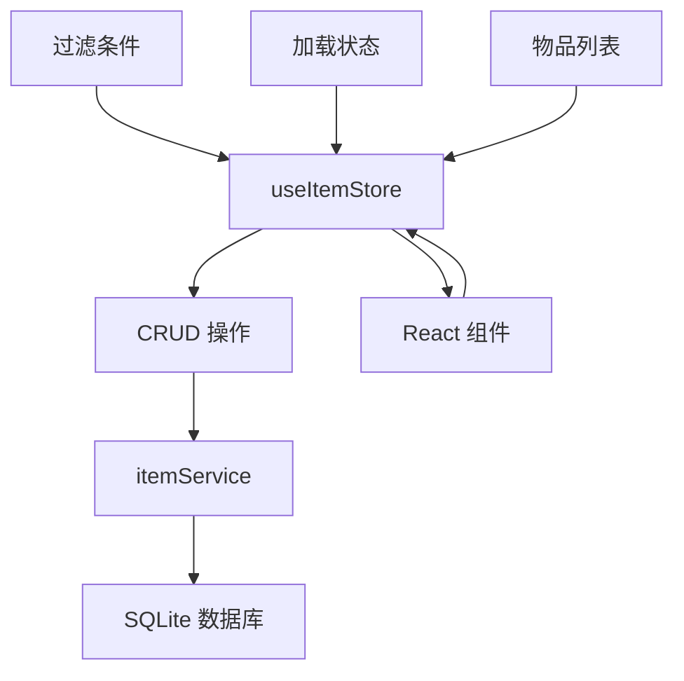

**图表来源**
- [src/stores/useItemStore.ts:23-52](file://src/stores/useItemStore.ts#L23-L52)
- [src/services/itemService.ts:10-44](file://src/services/itemService.ts#L10-L44)

**章节来源**
- [src/types/item.ts:1-46](file://src/types/item.ts#L1-L46)
- [src/stores/useItemStore.ts:1-53](file://src/stores/useItemStore.ts#L1-L53)

## 架构概览

### 整体架构设计

系统采用分层架构设计，确保关注点分离和模块化：

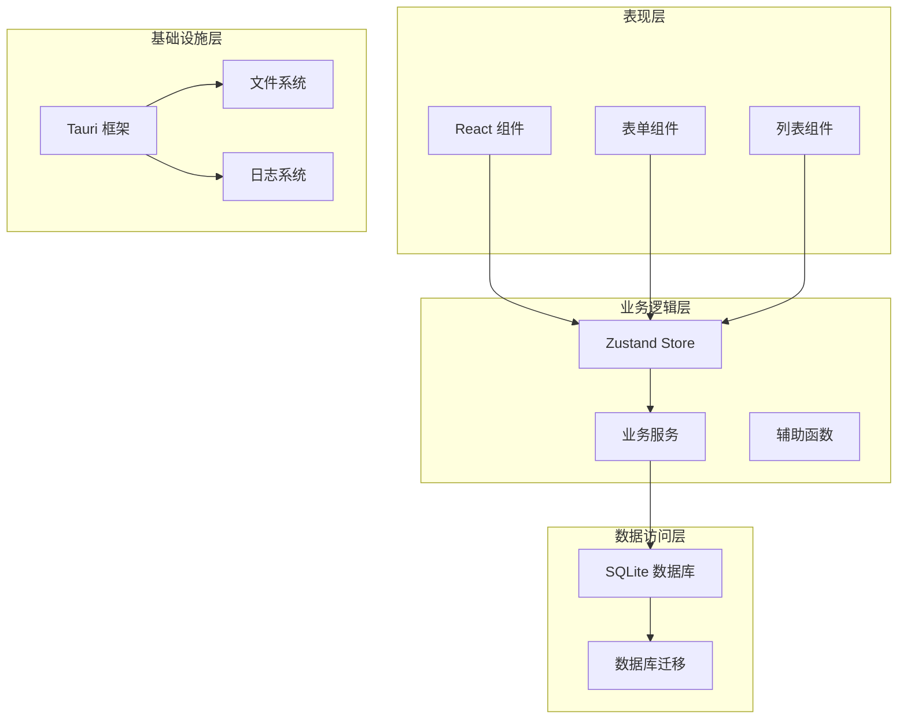

**图表来源**
- [src/routes/ItemList.tsx:19-185](file://src/routes/ItemList.tsx#L19-L185)
- [src/services/itemService.ts:1-127](file://src/services/itemService.ts#L1-L127)
- [src/services/database.ts:8-53](file://src/services/database.ts#L8-L53)

### 数据流处理

系统的数据流遵循单向数据流原则，确保状态的一致性和可预测性：

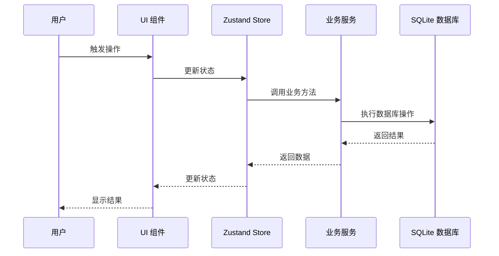

**图表来源**
- [src/stores/useItemStore.ts:28-51](file://src/stores/useItemStore.ts#L28-L51)
- [src/services/itemService.ts:60-87](file://src/services/itemService.ts#L60-L87)

**章节来源**
- [src/routes/ItemList.tsx:27-38](file://src/routes/ItemList.tsx#L27-L38)
- [src/stores/useItemStore.ts:23-52](file://src/stores/useItemStore.ts#L23-L52)

## 详细组件分析

### 物品录入与管理

#### 表单组件实现

物品表单组件提供了完整的录入界面，支持所有必要的字段输入：

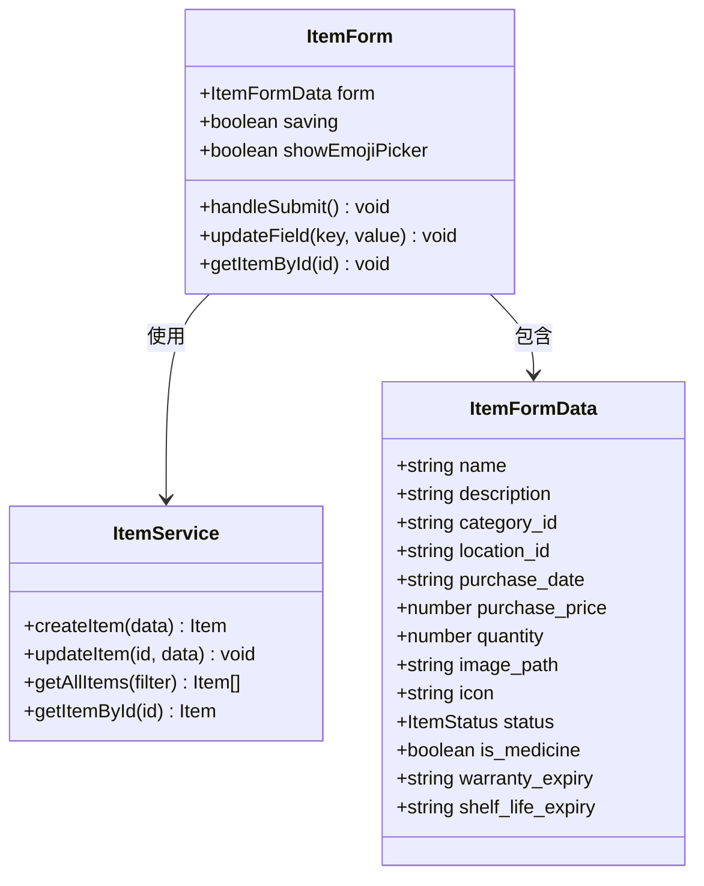

**图表来源**
- [src/routes/ItemForm.tsx:29-263](file://src/routes/ItemForm.tsx#L29-L263)
- [src/types/item.ts:31-45](file://src/types/item.ts#L31-L45)
- [src/services/itemService.ts:60-127](file://src/services/itemService.ts#L60-L127)

#### 搜索功能实现

系统实现了智能搜索功能，支持按名称进行模糊匹配：

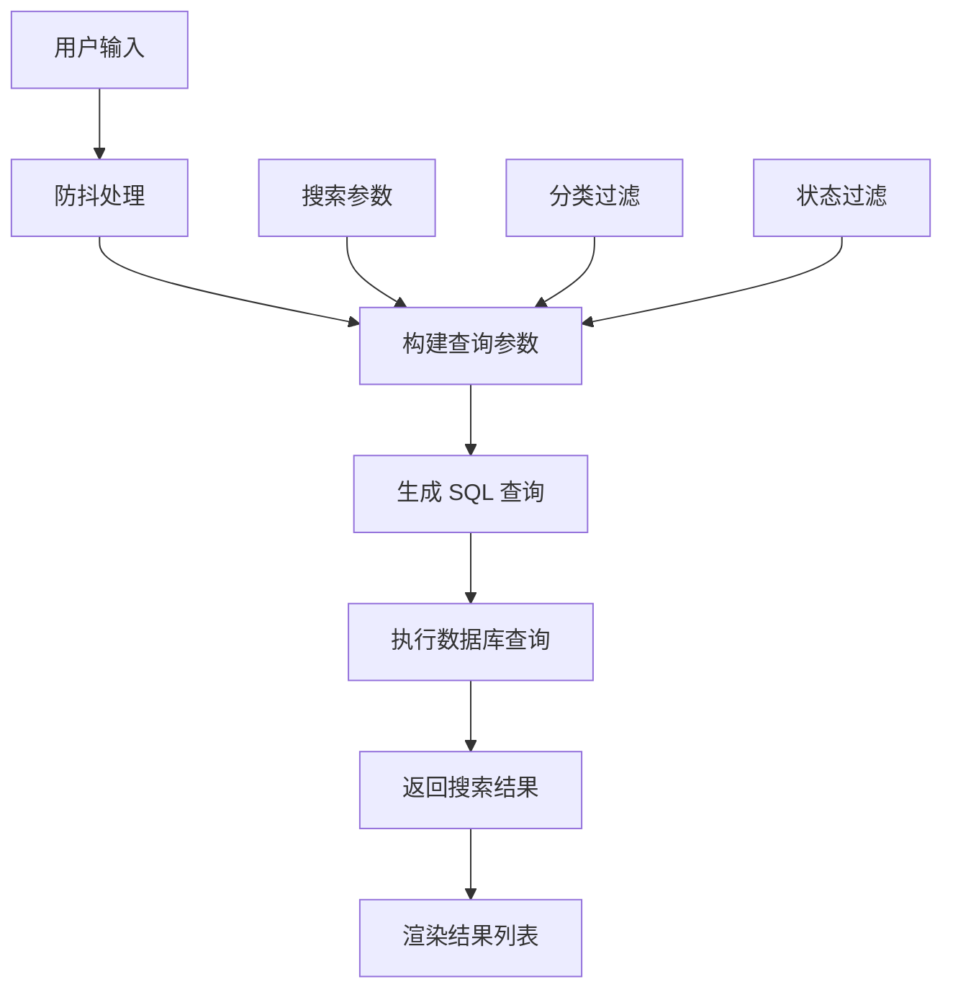

**图表来源**
- [src/routes/ItemList.tsx:32-38](file://src/routes/ItemList.tsx#L32-L38)
- [src/services/itemService.ts:10-44](file://src/services/itemService.ts#L10-L44)

**章节来源**
- [src/routes/ItemForm.tsx:13-27](file://src/routes/ItemForm.tsx#L13-L27)
- [src/routes/ItemList.tsx:19-185](file://src/routes/ItemList.tsx#L19-L185)

### 状态追踪机制

#### 状态枚举定义

系统定义了三种物品状态，支持完整的生命周期管理：

| 状态值 | 中文含义 | 用途描述 |
|--------|----------|----------|
| `active` | 服役中 | 物品正常使用状态 |
| `archived` | 已闲置 | 物品暂时不使用但保留 |
| `disposed` | 已处置 | 物品已报废或处理完毕 |

#### 状态转换流程

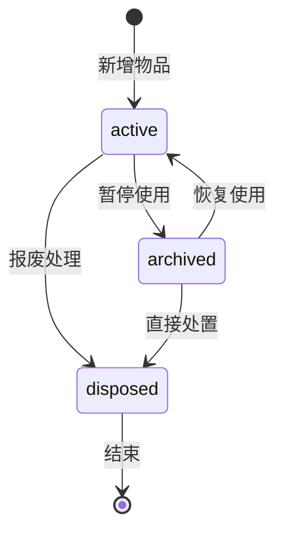

**图表来源**
- [src/types/item.ts:3](file://src/types/item.ts#L3)
- [src/utils/constants.ts:22-27](file://src/utils/constants.ts#L22-L27)

**章节来源**
- [src/types/item.ts:3-4](file://src/types/item.ts#L3-L4)
- [src/utils/constants.ts:22-27](file://src/utils/constants.ts#L22-L27)

### 多维筛选系统

#### 筛选条件组合

系统支持多种筛选条件的组合使用：

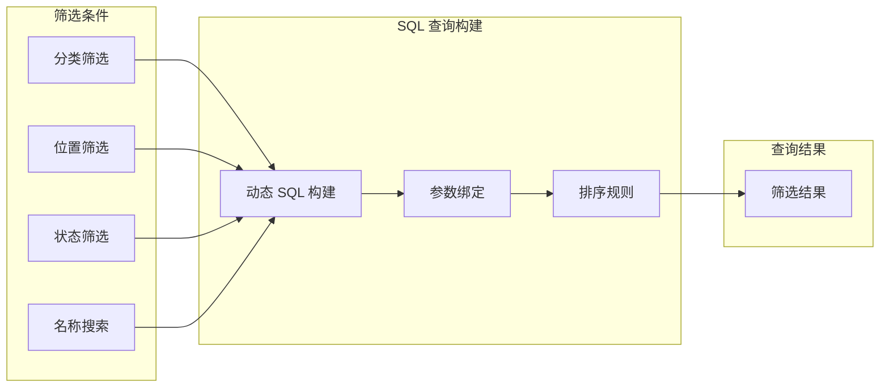

**图表来源**
- [src/services/itemService.ts:10-44](file://src/services/itemService.ts#L10-L44)
- [src/stores/useItemStore.ts:5-10](file://src/stores/useItemStore.ts#L5-L10)

#### 筛选实现细节

筛选功能通过动态构建 SQL 查询实现，支持以下条件：

- **分类筛选**: `category_id = ?`
- **位置筛选**: `location_id = ?`  
- **状态筛选**: `status = ?`
- **名称搜索**: `name LIKE %?%`

**章节来源**
- [src/services/itemService.ts:25-40](file://src/services/itemService.ts#L25-L40)
- [src/stores/useItemStore.ts:49-51](file://src/stores/useItemStore.ts#L49-L51)

### 日均成本计算算法

#### 成本计算公式

系统实现了精确的日均成本计算算法：

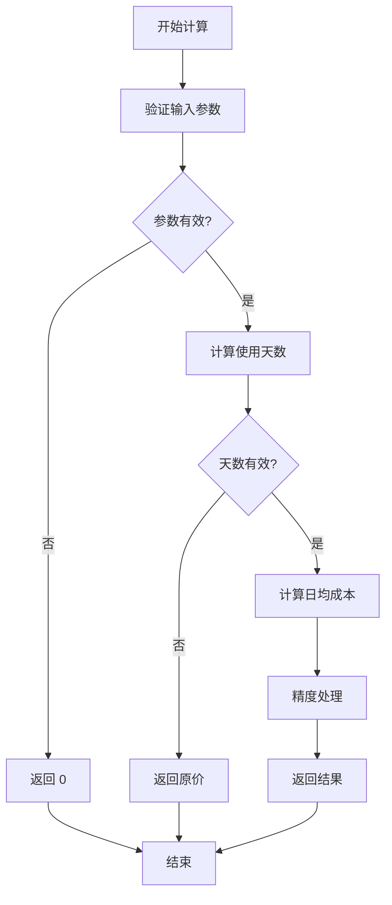

**图表来源**
- [src/utils/currencyHelper.ts:13-16](file://src/utils/currencyHelper.ts#L13-L16)
- [src/components/items/ItemCard.tsx:30-35](file://src/components/items/ItemCard.tsx#L30-L35)

#### 算法实现细节

日均成本计算公式：`日均成本 = 总价值 / 使用天数`

其中：
- **总价值**: `purchase_price × quantity`
- **使用天数**: 从购买日期到当前日期的天数
- **精度处理**: 使用 `toFixed(2)` 保持两位小数

**章节来源**
- [src/utils/currencyHelper.ts:13-16](file://src/utils/currencyHelper.ts#L13-L16)
- [src/components/items/ItemCard.tsx:30-35](file://src/components/items/ItemCard.tsx#L30-L35)

### 数据导出与导入

#### 导出功能实现

系统支持 JSON 和 CSV 两种格式的数据导出：

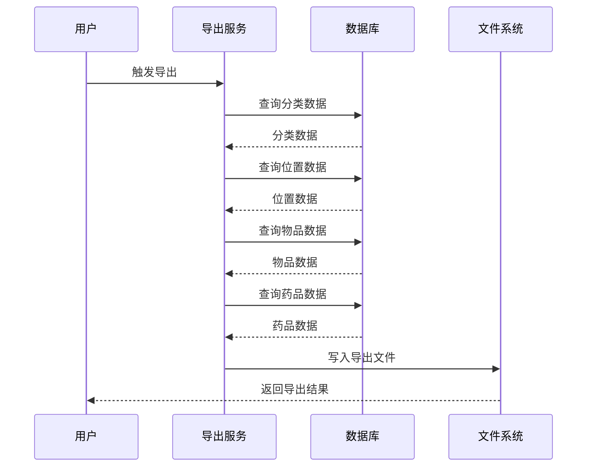

**图表来源**
- [src/services/exportService.ts:4-44](file://src/services/exportService.ts#L4-L44)
- [src/services/exportService.ts:53-153](file://src/services/exportService.ts#L53-L153)

**章节来源**
- [src/services/exportService.ts:1-154](file://src/services/exportService.ts#L1-L154)

## 依赖关系分析

### 核心依赖关系

系统的主要依赖关系如下：

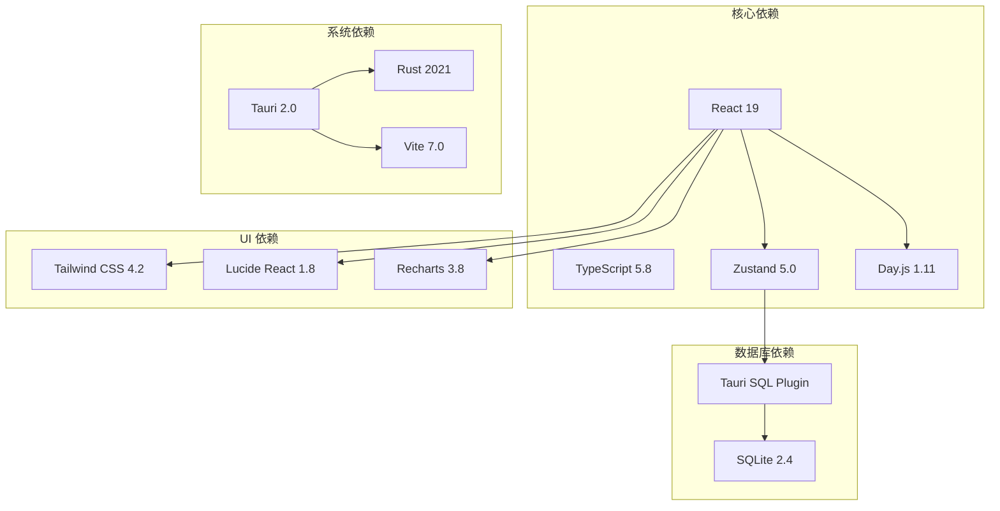

**图表来源**
- [README.md:86-104](file://README.md#L86-L104)

### 组件间交互关系

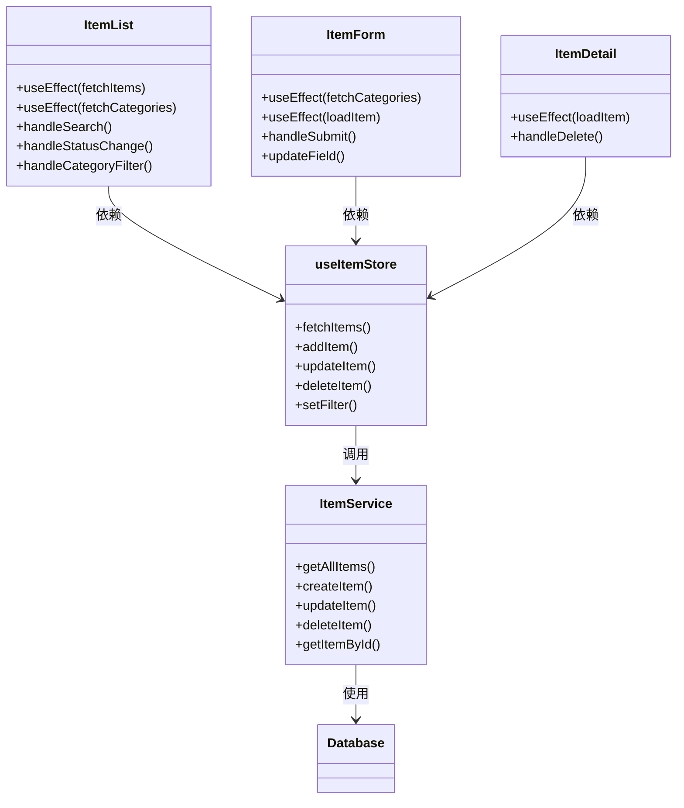

**图表来源**
- [src/routes/ItemList.tsx:19-185](file://src/routes/ItemList.tsx#L19-L185)
- [src/routes/ItemForm.tsx:29-263](file://src/routes/ItemForm.tsx#L29-L263)
- [src/routes/ItemDetail.tsx:13-168](file://src/routes/ItemDetail.tsx#L13-L168)
- [src/stores/useItemStore.ts:23-52](file://src/stores/useItemStore.ts#L23-L52)

**章节来源**
- [src/routes/ItemList.tsx:19-185](file://src/routes/ItemList.tsx#L19-L185)
- [src/stores/useItemStore.ts:23-52](file://src/stores/useItemStore.ts#L23-L52)

## 性能考虑

### 数据库优化

系统通过以下方式优化数据库性能：

1. **索引优化**: 在常用查询字段上建立索引
   - `idx_items_category`: 分类查询优化
   - `idx_items_location`: 位置查询优化  
   - `idx_items_status`: 状态查询优化

2. **查询优化**: 使用参数化查询防止 SQL 注入

3. **连接池管理**: 单例模式管理数据库连接

### 前端性能优化

1. **状态管理优化**: 使用 Zustand 减少不必要的重渲染
2. **防抖处理**: 搜索功能使用 300ms 防抖延迟
3. **虚拟滚动**: 大列表使用虚拟滚动优化渲染性能

### 缓存策略

系统采用多层次缓存策略：

1. **内存缓存**: Zustand store 缓存当前页面数据
2. **数据库缓存**: SQLite 本地缓存，支持离线使用
3. **组件缓存**: React memo 优化组件渲染

## 故障排除指南

### 常见问题诊断

#### 数据库连接问题

**症状**: 应用启动时报数据库连接错误

**解决方案**:
1. 检查数据库文件是否存在
2. 验证数据库权限设置
3. 查看迁移日志确认迁移是否成功

#### 数据同步问题

**症状**: 新增/修改的物品未显示或显示异常

**解决方案**:
1. 检查网络连接状态
2. 验证数据格式正确性
3. 查看控制台错误日志

#### 性能问题

**症状**: 页面加载缓慢或操作卡顿

**解决方案**:
1. 检查数据库索引是否完整
2. 优化复杂查询语句
3. 实施分页加载策略

**章节来源**
- [src/services/database.ts:8-53](file://src/services/database.ts#L8-L53)
- [src/utils/logger.ts](file://src/utils/logger.ts)

## 结论

Assetly 物品管理系统通过精心设计的架构和完善的组件实现，提供了完整的物品生命周期管理解决方案。系统具有以下优势：

1. **完整的功能覆盖**: 从物品录入到状态追踪的全流程管理
2. **优秀的用户体验**: 响应式设计和直观的操作界面
3. **可靠的数据安全**: 本地存储和数据导出功能
4. **良好的扩展性**: 模块化设计便于功能扩展

系统采用的技术栈成熟稳定，能够满足家庭物品管理的各种需求。通过合理的架构设计和性能优化，系统能够在不同平台上提供一致的使用体验。

## 附录

### 使用场景示例

#### 批量导入操作流程

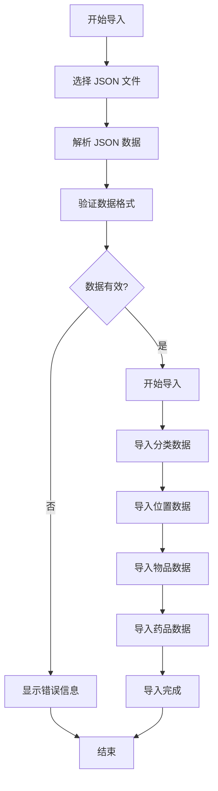

#### 快速录入操作流程

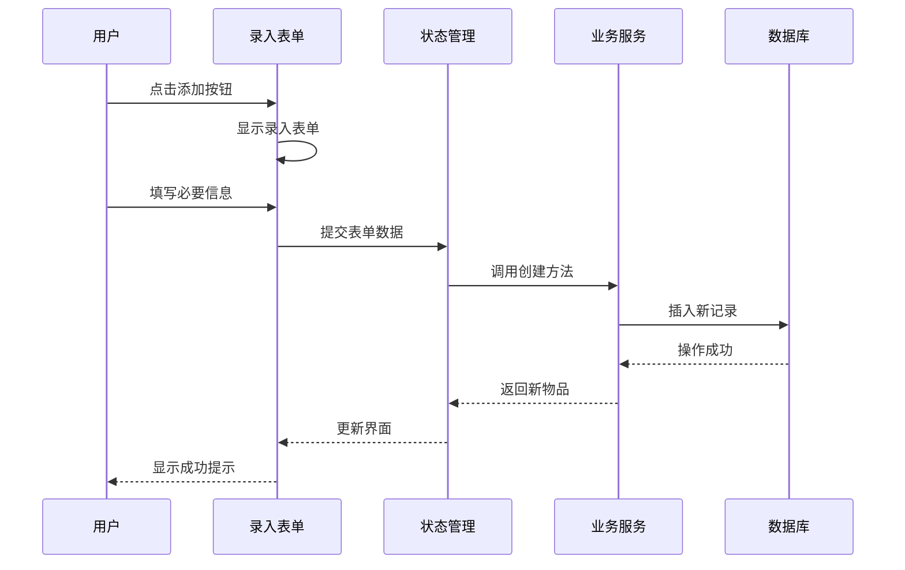

#### 报表导出操作流程

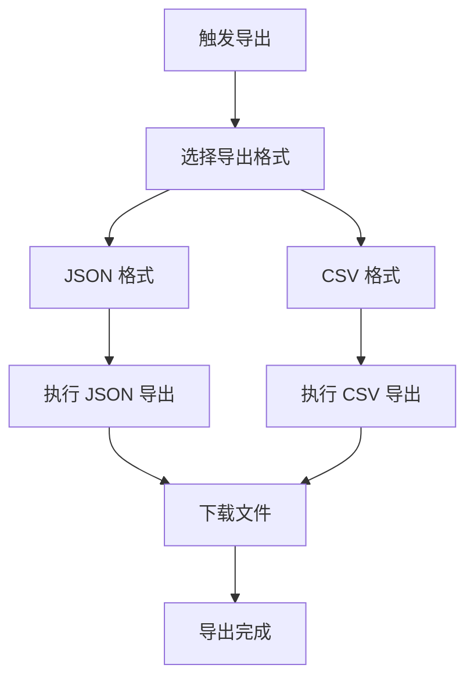

**章节来源**
- [src/services/exportService.ts:4-44](file://src/services/exportService.ts#L4-L44)
- [src/routes/ItemForm.tsx:67-81](file://src/routes/ItemForm.tsx#L67-L81)
- [src/routes/ItemList.tsx:32-38](file://src/routes/ItemList.tsx#L32-L38)