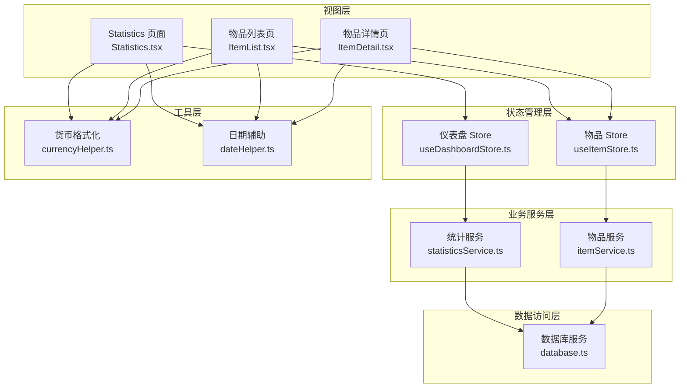
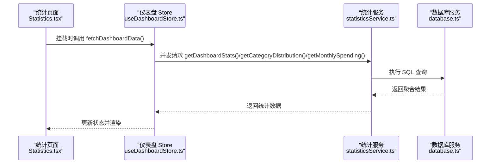
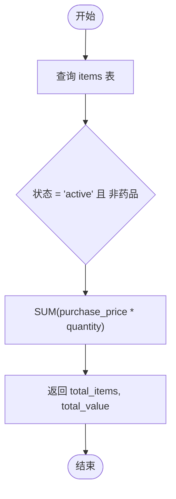
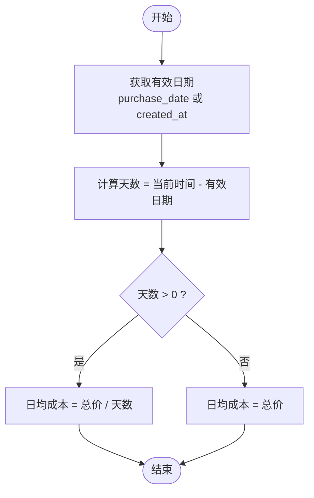
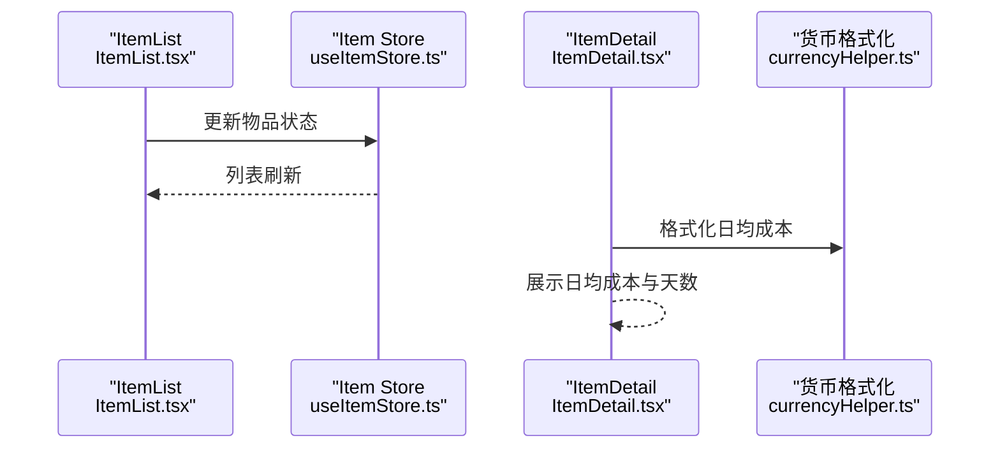
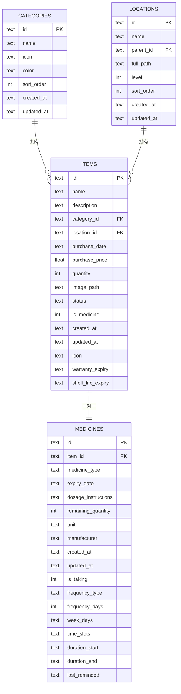
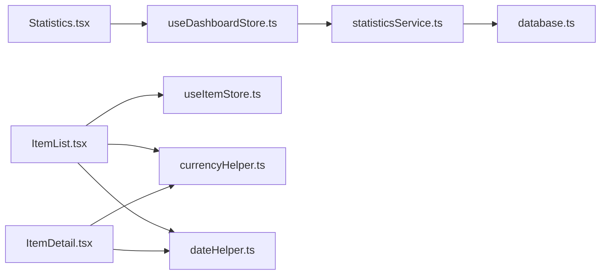

# 统计与成本计算

<cite>
**本文引用的文件**
- [src/services/statisticsService.ts](file://src/services/statisticsService.ts)
- [src/stores/useDashboardStore.ts](file://src/stores/useDashboardStore.ts)
- [src/routes/Statistics.tsx](file://src/routes/Statistics.tsx)
- [src/utils/currencyHelper.ts](file://src/utils/currencyHelper.ts)
- [src/utils/dateHelper.ts](file://src/utils/dateHelper.ts)
- [src/routes/ItemList.tsx](file://src/routes/ItemList.tsx)
- [src/routes/ItemDetail.tsx](file://src/routes/ItemDetail.tsx)
- [src/services/itemService.ts](file://src/services/itemService.ts)
- [src/stores/useItemStore.ts](file://src/stores/useItemStore.ts)
- [src/services/database.ts](file://src/services/database.ts)
- [src/types/settings.ts](file://src/types/settings.ts)
- [src/types/item.ts](file://src/types/item.ts)
- [src/components/charts/AreaChart.tsx](file://src/components/charts/AreaChart.tsx)
- [src/components/charts/PieChart.tsx](file://src/components/charts/PieChart.tsx)
</cite>

## 目录
1. [简介](#简介)
2. [项目结构](#项目结构)
3. [核心组件](#核心组件)
4. [架构总览](#架构总览)
5. [详细组件分析](#详细组件分析)
6. [依赖关系分析](#依赖关系分析)
7. [性能考量](#性能考量)
8. [故障排查指南](#故障排查指南)
9. [结论](#结论)
10. [附录：计算示例](#附录计算示例)

## 简介
本文件聚焦“物品统计与成本计算”功能，系统性阐述以下内容：
- 总资产计算算法：按状态过滤（仅计算服役中物品）、单价与数量乘积累加、货币格式化处理
- 日均成本计算：有效日期确定（购买日期优先于创建日期）、天数计算公式（当前时间减去有效日期）、折旧计算函数与精度处理策略
- 统计指标的实时更新机制：状态变化触发的重新计算与性能优化
- 完整计算示例：覆盖不同时间段与物品组合的成本分析场景

## 项目结构
围绕统计与成本计算的关键模块如下：
- 数据访问层：通过数据库服务封装 SQLite 访问与迁移
- 业务服务层：统计服务负责总资产、分类分布、月度支出等聚合查询
- 状态管理层：Zustand Store 负责缓存与并发拉取统计数据
- 视图层：仪表盘与统计页面渲染汇总数据与图表
- 工具层：货币格式化、日期辅助、日均成本计算

**图表来源**
- [src/routes/Statistics.tsx:1-85](file://src/routes/Statistics.tsx#L1-L85)
- [src/stores/useDashboardStore.ts:1-34](file://src/stores/useDashboardStore.ts#L1-L34)
- [src/stores/useItemStore.ts:1-53](file://src/stores/useItemStore.ts#L1-L53)
- [src/services/statisticsService.ts:1-52](file://src/services/statisticsService.ts#L1-L52)
- [src/services/itemService.ts:1-127](file://src/services/itemService.ts#L1-L127)
- [src/utils/currencyHelper.ts:1-17](file://src/utils/currencyHelper.ts#L1-L17)
- [src/utils/dateHelper.ts:1-52](file://src/utils/dateHelper.ts#L1-L52)
- [src/services/database.ts:1-171](file://src/services/database.ts#L1-L171)

**章节来源**
- [src/routes/Statistics.tsx:1-85](file://src/routes/Statistics.tsx#L1-L85)
- [src/stores/useDashboardStore.ts:1-34](file://src/stores/useDashboardStore.ts#L1-L34)
- [src/stores/useItemStore.ts:1-53](file://src/stores/useItemStore.ts#L1-L53)
- [src/services/statisticsService.ts:1-52](file://src/services/statisticsService.ts#L1-L52)
- [src/services/itemService.ts:1-127](file://src/services/itemService.ts#L1-L127)
- [src/utils/currencyHelper.ts:1-17](file://src/utils/currencyHelper.ts#L1-L17)
- [src/utils/dateHelper.ts:1-52](file://src/utils/dateHelper.ts#L1-L52)
- [src/services/database.ts:1-171](file://src/services/database.ts#L1-L171)

## 核心组件
- 统计服务：提供总资产、分类分布、月度支出等聚合查询，使用 SQL 过滤与分组聚合
- 仪表盘 Store：并发拉取多类统计并缓存，支持页面挂载时自动刷新
- 物品 Store：管理物品列表与筛选，支持状态变更后重新计算日均成本
- 货币格式化：统一金额显示，包含大额数字“万元”单位处理
- 日期辅助：提供日期差计算、标签转换等
- 图表组件：面积图与饼图用于可视化展示

**章节来源**
- [src/services/statisticsService.ts:4-51](file://src/services/statisticsService.ts#L4-L51)
- [src/stores/useDashboardStore.ts:23-32](file://src/stores/useDashboardStore.ts#L23-L32)
- [src/stores/useItemStore.ts:28-51](file://src/stores/useItemStore.ts#L28-L51)
- [src/utils/currencyHelper.ts:1-17](file://src/utils/currencyHelper.ts#L1-L17)
- [src/utils/dateHelper.ts:22-43](file://src/utils/dateHelper.ts#L22-L43)
- [src/components/charts/AreaChart.tsx:1-94](file://src/components/charts/AreaChart.tsx#L1-L94)
- [src/components/charts/PieChart.tsx:1-114](file://src/components/charts/PieChart.tsx#L1-L114)

## 架构总览
统计与成本计算遵循“视图-状态-服务-数据”的分层架构，关键交互如下：

**图表来源**
- [src/routes/Statistics.tsx:13-15](file://src/routes/Statistics.tsx#L13-L15)
- [src/stores/useDashboardStore.ts:23-32](file://src/stores/useDashboardStore.ts#L23-L32)
- [src/services/statisticsService.ts:4-51](file://src/services/statisticsService.ts#L4-L51)
- [src/services/database.ts:8-16](file://src/services/database.ts#L8-L16)

## 详细组件分析

### 总资产计算算法
- 过滤条件：仅统计状态为“服役中”的物品
- 计算方式：单价 × 数量，按状态分组求和
- 结果类型：包含物品总数与总资产值

**图表来源**
- [src/services/statisticsService.ts:7-25](file://src/services/statisticsService.ts#L7-L25)

**章节来源**
- [src/services/statisticsService.ts:4-25](file://src/services/statisticsService.ts#L4-L25)
- [src/types/settings.ts:8-13](file://src/types/settings.ts#L8-L13)

### 日均成本计算逻辑
- 有效日期确定：优先使用购买日期；若为空则回退到创建日期
- 天数计算：当前时间减去有效日期（单位：天）
- 折旧计算：日均成本 = 总价 / 天数；当天数小于等于 0 时，日均成本等于总价
- 精度处理：统一保留两位小数

**图表来源**
- [src/routes/ItemList.tsx:51-67](file://src/routes/ItemList.tsx#L51-L67)
- [src/utils/currencyHelper.ts:13-16](file://src/utils/currencyHelper.ts#L13-L16)

**章节来源**
- [src/routes/ItemList.tsx:51-67](file://src/routes/ItemList.tsx#L51-L67)
- [src/utils/currencyHelper.ts:13-16](file://src/utils/currencyHelper.ts#L13-L16)

### 统计指标的实时更新机制
- 仪表盘 Store：并发拉取多项统计，完成后一次性更新状态，避免重复渲染
- 物品 Store：状态变更后重新拉取数据，从而触发日均成本的重新计算
- 页面渲染：统计页面在挂载时自动拉取最新数据

**图表来源**
- [src/stores/useItemStore.ts:34-47](file://src/stores/useItemStore.ts#L34-L47)
- [src/routes/ItemList.tsx:40-44](file://src/routes/ItemList.tsx#L40-L44)
- [src/routes/ItemDetail.tsx:88-98](file://src/routes/ItemDetail.tsx#L88-L98)
- [src/utils/currencyHelper.ts:9-11](file://src/utils/currencyHelper.ts#L9-L11)

**章节来源**
- [src/stores/useDashboardStore.ts:23-32](file://src/stores/useDashboardStore.ts#L23-L32)
- [src/stores/useItemStore.ts:34-47](file://src/stores/useItemStore.ts#L34-L47)
- [src/routes/ItemList.tsx:40-44](file://src/routes/ItemList.tsx#L40-L44)
- [src/routes/ItemDetail.tsx:88-98](file://src/routes/ItemDetail.tsx#L88-L98)

### 数据模型与数据库结构
- items 表：存储物品基本信息、价格、数量、状态、购买日期、创建/更新时间等
- categories 表：物品分类信息
- medicines 表：药品扩展信息（与 items 一对一关联）

**图表来源**
- [src/services/database.ts:88-117](file://src/services/database.ts#L88-L117)

**章节来源**
- [src/services/database.ts:88-117](file://src/services/database.ts#L88-L117)
- [src/types/item.ts:5-22](file://src/types/item.ts#L5-L22)
- [src/types/settings.ts:15-24](file://src/types/settings.ts#L15-L24)

## 依赖关系分析
- 统计页面依赖仪表盘 Store 获取汇总数据与图表数据
- 物品列表页依赖物品 Store 获取物品集合，并基于状态与日期计算日均成本
- 货币格式化与日期辅助被多个组件复用
- 统计服务通过数据库服务执行 SQL 聚合查询

**图表来源**
- [src/routes/Statistics.tsx:1-85](file://src/routes/Statistics.tsx#L1-L85)
- [src/stores/useDashboardStore.ts:1-34](file://src/stores/useDashboardStore.ts#L1-L34)
- [src/stores/useItemStore.ts:1-53](file://src/stores/useItemStore.ts#L1-L53)
- [src/services/statisticsService.ts:1-52](file://src/services/statisticsService.ts#L1-L52)
- [src/utils/currencyHelper.ts:1-17](file://src/utils/currencyHelper.ts#L1-L17)
- [src/utils/dateHelper.ts:1-52](file://src/utils/dateHelper.ts#L1-L52)
- [src/services/database.ts:1-171](file://src/services/database.ts#L1-L171)

**章节来源**
- [src/routes/Statistics.tsx:1-85](file://src/routes/Statistics.tsx#L1-L85)
- [src/stores/useDashboardStore.ts:1-34](file://src/stores/useDashboardStore.ts#L1-L34)
- [src/stores/useItemStore.ts:1-53](file://src/stores/useItemStore.ts#L1-L53)
- [src/services/statisticsService.ts:1-52](file://src/services/statisticsService.ts#L1-L52)
- [src/utils/currencyHelper.ts:1-17](file://src/utils/currencyHelper.ts#L1-L17)
- [src/utils/dateHelper.ts:1-52](file://src/utils/dateHelper.ts#L1-L52)
- [src/services/database.ts:1-171](file://src/services/database.ts#L1-L171)

## 性能考量
- 并发拉取：仪表盘 Store 使用并发请求聚合统计，减少等待时间
- SQL 聚合：在数据库层完成分组与求和，降低前端计算压力
- 索引优化：items/status、medicines/expiry_date 等索引提升查询效率
- 前端缓存：Store 缓存统计结果，避免重复请求
- 渲染优化：图表组件按需渲染，空数据时显示提示文案

**章节来源**
- [src/stores/useDashboardStore.ts:25-31](file://src/stores/useDashboardStore.ts#L25-L31)
- [src/services/database.ts:124-131](file://src/services/database.ts#L124-L131)

## 故障排查指南
- 数据库未初始化：确认数据库连接与迁移执行成功
- 统计为空：检查 items 表中是否存在状态为“active”的非药品记录
- 日期异常：确保 purchase_date 与 created_at 字段格式正确
- 日均成本为总价：确认天数计算逻辑是否因无效日期导致天数小于等于 0
- 图表不显示：检查传入数据是否为空或格式错误

**章节来源**
- [src/services/database.ts:8-16](file://src/services/database.ts#L8-L16)
- [src/services/statisticsService.ts:40-51](file://src/services/statisticsService.ts#L40-L51)
- [src/utils/dateHelper.ts:22-28](file://src/utils/dateHelper.ts#L22-L28)
- [src/utils/currencyHelper.ts:13-16](file://src/utils/currencyHelper.ts#L13-L16)

## 结论
本功能以数据库聚合为核心，结合 Store 的并发拉取与前端格式化，实现了高效、可读的统计与成本计算。通过明确的状态过滤、日期回退策略与统一的货币格式化，保证了结果的一致性与可理解性。建议在后续迭代中引入更细粒度的缓存失效策略与增量更新机制，进一步提升性能。

## 附录：计算示例
以下示例展示不同场景下的成本分析思路（不直接引用具体代码）：
- 单物品日均成本：购买日期为 2024-01-01，当前日期为 2024-01-15，总价为 150 元，则日均成本为 150 元 ÷ 14 天
- 多物品组合：仅统计状态为“active”的物品，按分类分组求和，再计算各分类占比
- 月度支出趋势：按购买日期所在月份分组，统计每月总支出，绘制消费趋势图
- 状态变更影响：当某物品从“active”变为“archived”，其不再计入总资产与日均成本

**章节来源**
- [src/routes/ItemList.tsx:51-67](file://src/routes/ItemList.tsx#L51-L67)
- [src/services/statisticsService.ts:40-51](file://src/services/statisticsService.ts#L40-L51)
- [src/components/charts/AreaChart.tsx:71-77](file://src/components/charts/AreaChart.tsx#L71-L77)
- [src/components/charts/PieChart.tsx:90-110](file://src/components/charts/PieChart.tsx#L90-L110)