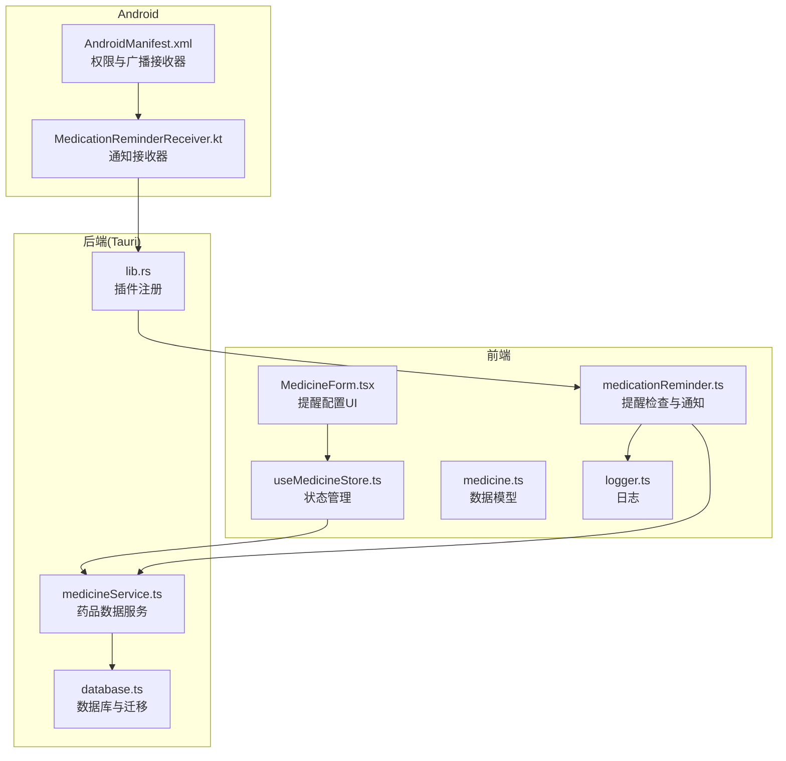
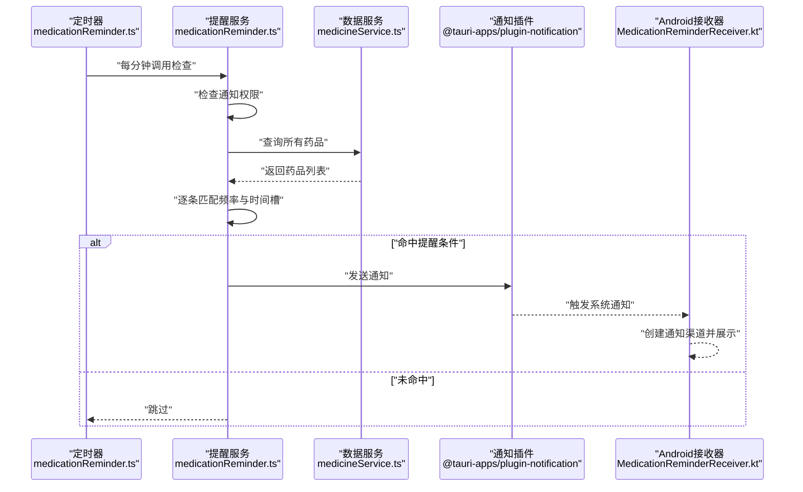
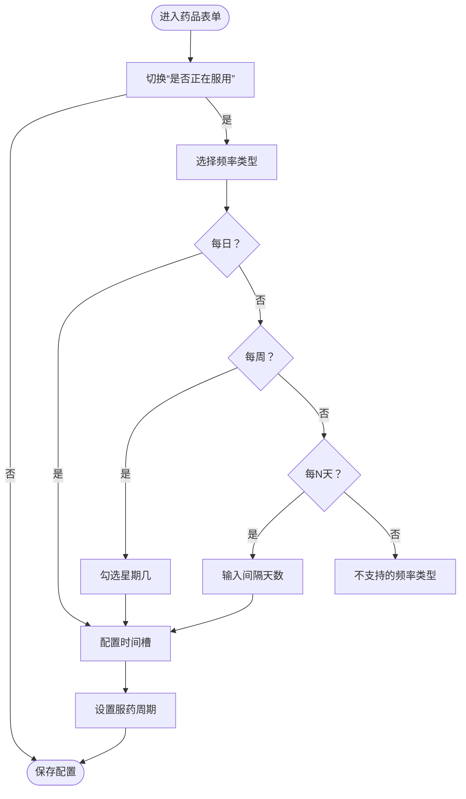
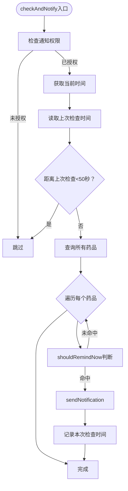
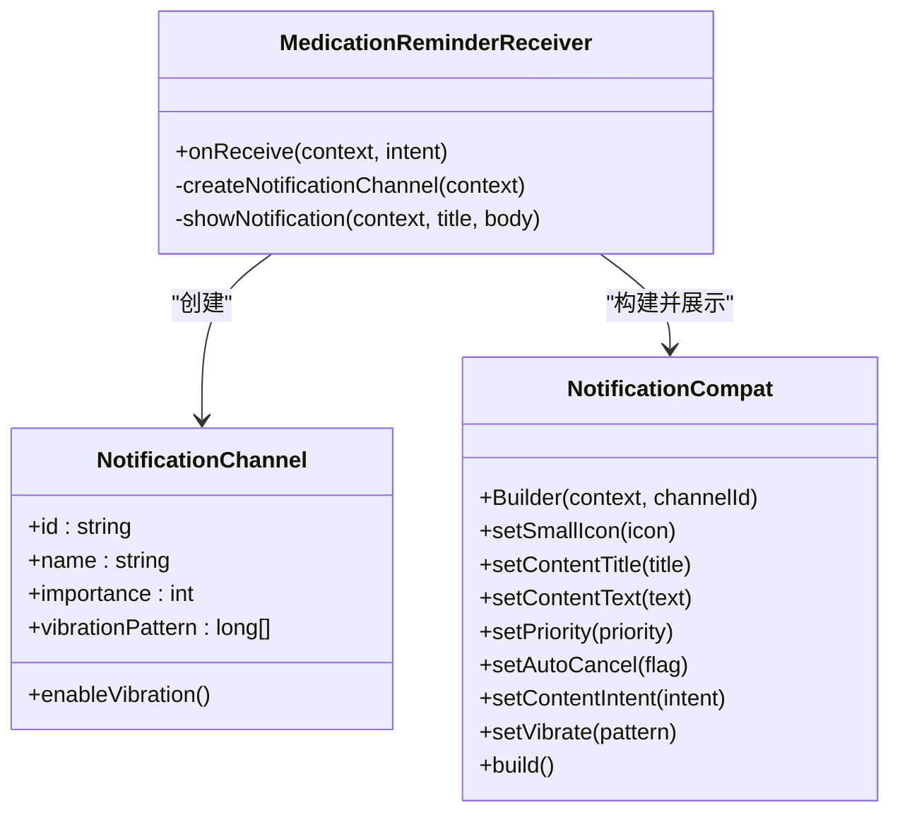
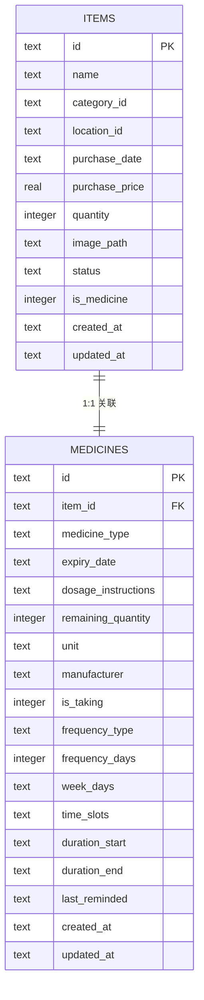
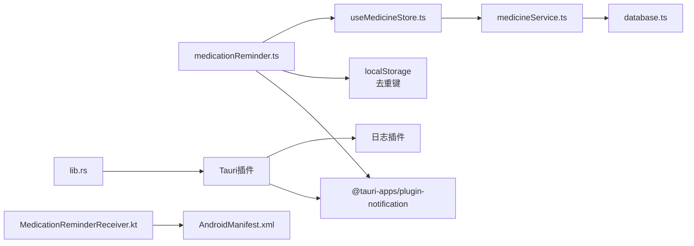

# 用药提醒功能

<cite>
**本文档引用的文件**
- [medicationReminder.ts](file://src/services/medicationReminder.ts)
- [MedicationReminderReceiver.kt](file://src-tauri/gen/android/app/src/main/java/com/assetly/home/MedicationReminderReceiver.kt)
- [MedicineForm.tsx](file://src/routes/MedicineForm.tsx)
- [useMedicineStore.ts](file://src/stores/useMedicineStore.ts)
- [medicine.ts](file://src/types/medicine.ts)
- [medicineService.ts](file://src/services/medicineService.ts)
- [database.ts](file://src/services/database.ts)
- [logger.ts](file://src/utils/logger.ts)
- [lib.rs](file://src-tauri/src/lib.rs)
- [AndroidManifest.xml](file://src-tauri/gen/android/app/src/main/AndroidManifest.xml)
- [tauri.conf.json](file://src-tauri/tauri.conf.json)
</cite>

## 目录
1. [简介](#简介)
2. [项目结构](#项目结构)
3. [核心组件](#核心组件)
4. [架构总览](#架构总览)
5. [详细组件分析](#详细组件分析)
6. [依赖关系分析](#依赖关系分析)
7. [性能考虑](#性能考虑)
8. [故障排除指南](#故障排除指南)
9. [结论](#结论)
10. [附录](#附录)

## 简介
本文件全面介绍用药提醒功能的设计与实现，覆盖提醒规则配置（单次、每日、每周、每N天）、提醒时间设置、重复提醒策略、通知定制化（标题、内容、震动）以及Android原生通知接收器的实现细节。文档同时提供集成指南与常见问题排查方法，帮助开发者快速理解并扩展该功能。

## 项目结构
用药提醒功能由前端React逻辑与Tauri后端共同协作完成：前端负责用户界面与提醒规则配置，Tauri后端负责定时检查与系统通知分发；Android侧通过BroadcastReceiver接收通知并展示。

**图表来源**
- [MedicineForm.tsx:1-401](file://src/routes/MedicineForm.tsx#L1-L401)
- [useMedicineStore.ts:1-42](file://src/stores/useMedicineStore.ts#L1-L42)
- [medicationReminder.ts:1-132](file://src/services/medicationReminder.ts#L1-L132)
- [medicine.ts:1-70](file://src/types/medicine.ts#L1-L70)
- [medicineService.ts:1-194](file://src/services/medicineService.ts#L1-L194)
- [database.ts:90-171](file://src/services/database.ts#L90-L171)
- [lib.rs:1-49](file://src-tauri/src/lib.rs#L1-L49)
- [AndroidManifest.xml:1-49](file://src-tauri/gen/android/app/src/main/AndroidManifest.xml#L1-L49)
- [MedicationReminderReceiver.kt:1-68](file://src-tauri/gen/android/app/src/main/java/com/assetly/home/MedicationReminderReceiver.kt#L1-L68)

**章节来源**
- [MedicineForm.tsx:1-401](file://src/routes/MedicineForm.tsx#L1-L401)
- [medicationReminder.ts:1-132](file://src/services/medicationReminder.ts#L1-L132)
- [lib.rs:1-49](file://src-tauri/src/lib.rs#L1-L49)
- [AndroidManifest.xml:1-49](file://src-tauri/gen/android/app/src/main/AndroidManifest.xml#L1-L49)

## 核心组件
- 提醒规则配置：在表单中支持“是否正在服用”开关、频率类型（每日/每N天/每周）、每周选择星期、时间槽（可多时段）、服药周期（起止日期）。
- 提醒检查逻辑：每分钟检查一次，基于频率与时间槽判断是否触发通知；避免同一分钟重复触发。
- 通知发送：前端调用通知插件发送通知；Android侧通过BroadcastReceiver创建通知渠道并展示通知。
- 数据模型：包含提醒相关字段（频率类型、间隔天数、周几、时间槽、周期起止、上次提醒时间等）。
- 数据持久化：SQLite数据库，包含items与medicines两张表及索引；支持版本迁移以增加提醒字段。

**章节来源**
- [MedicineForm.tsx:253-377](file://src/routes/MedicineForm.tsx#L253-L377)
- [medicationReminder.ts:11-48](file://src/services/medicationReminder.ts#L11-L48)
- [medicationReminder.ts:53-97](file://src/services/medicationReminder.ts#L53-L97)
- [medicine.ts:7-27](file://src/types/medicine.ts#L7-L27)
- [database.ts:104-117](file://src/services/database.ts#L104-L117)
- [database.ts:149-159](file://src/services/database.ts#L149-L159)

## 架构总览
提醒系统采用“前端定时轮询 + 后端通知插件 + Android广播接收器”的组合架构。前端负责业务规则判断与通知触发；后端负责系统级通知能力与日志记录；Android负责通知渠道与前台展示。

**图表来源**
- [medicationReminder.ts:53-97](file://src/services/medicationReminder.ts#L53-L97)
- [medicationReminder.ts:102-131](file://src/services/medicationReminder.ts#L102-L131)
- [medicineService.ts:10-37](file://src/services/medicineService.ts#L10-L37)
- [MedicationReminderReceiver.kt:20-26](file://src-tauri/gen/android/app/src/main/java/com/assetly/home/MedicationReminderReceiver.kt#L20-L26)

## 详细组件分析

### 提醒规则配置与UI
- 频率类型：支持每日、每N天、每周三种模式；每N天需要输入间隔天数；每周需勾选对应星期。
- 时间槽：支持添加多个时间点，格式为“时:分”，用于精确到分钟的提醒。
- 服药周期：可设置开始/结束日期，仅在该区间内生效。
- 是否正在服用：作为开关控制是否参与提醒计算。

**图表来源**
- [MedicineForm.tsx:272-377](file://src/routes/MedicineForm.tsx#L272-L377)

**章节来源**
- [MedicineForm.tsx:253-377](file://src/routes/MedicineForm.tsx#L253-L377)

### 提醒检查与通知触发
- 权限检查：首次自动请求通知权限，若未授权则跳过本轮检查。
- 频率判断：根据当前日期与起始日期计算是否满足“每N天”或“每周”条件。
- 时间槽匹配：比较当前小时与分钟与配置的时间槽是否一致。
- 去重保护：最近50秒内不会重复触发相同提醒，避免同一分钟多次通知。
- 通知动作：注册Android通知动作类型（已服用、稍后提醒），便于用户直接操作。

**图表来源**
- [medicationReminder.ts:53-97](file://src/services/medicationReminder.ts#L53-L97)
- [medicationReminder.ts:11-48](file://src/services/medicationReminder.ts#L11-L48)

**章节来源**
- [medicationReminder.ts:53-97](file://src/services/medicationReminder.ts#L53-L97)
- [medicationReminder.ts:11-48](file://src/services/medicationReminder.ts#L11-L48)

### Android原生通知接收器
- 通知渠道：在Android 8+创建高优先级通知渠道，启用震动并设置震动模式。
- 通知展示：构建通知，设置标题、内容、点击意图（打开MainActivity），并使用震动增强提醒效果。
- 广播接收器：在清单文件中声明，允许应用在后台接收通知事件。

**图表来源**
- [MedicationReminderReceiver.kt:12-67](file://src-tauri/gen/android/app/src/main/java/com/assetly/home/MedicationReminderReceiver.kt#L12-L67)

**章节来源**
- [MedicationReminderReceiver.kt:20-67](file://src-tauri/gen/android/app/src/main/java/com/assetly/home/MedicationReminderReceiver.kt#L20-L67)
- [AndroidManifest.xml:42-46](file://src-tauri/gen/android/app/src/main/AndroidManifest.xml#L42-L46)

### 数据模型与存储
- 药品与提醒字段：在medicines表中新增提醒相关字段（频率类型、间隔天数、周几集合、时间槽集合、周期起止、上次提醒时间）。
- 表结构与索引：items与medicines表定义清晰，包含必要的索引以提升查询效率。
- 版本迁移：通过数据库迁移脚本逐步添加提醒字段，确保历史数据兼容。

**图表来源**
- [database.ts:90-117](file://src/services/database.ts#L90-L117)
- [medicine.ts:7-27](file://src/types/medicine.ts#L7-L27)

**章节来源**
- [medicine.ts:7-27](file://src/types/medicine.ts#L7-L27)
- [database.ts:104-117](file://src/services/database.ts#L104-L117)
- [database.ts:149-159](file://src/services/database.ts#L149-L159)

### 日志与错误处理
- 日志系统：封装console输出到Tauri日志插件，支持info/warn/error等级别，内存中保留最近500条日志以便调试。
- 错误捕获：提醒检查过程中的异常会被捕获并记录，保证应用稳定性。

**章节来源**
- [logger.ts:57-75](file://src/utils/logger.ts#L57-L75)
- [medicationReminder.ts:94-96](file://src/services/medicationReminder.ts#L94-L96)

## 依赖关系分析
- 前端依赖：@tauri-apps/plugin-notification（通知）、本地存储（去重）、Zustand（状态管理）。
- 后端依赖：Tauri插件体系（notification、log、fs、sql），SQLite数据库。
- Android依赖：通知渠道、前台服务、开机自启权限（Manifest声明）。

**图表来源**
- [medicationReminder.ts:1-6](file://src/services/medicationReminder.ts#L1-L6)
- [useMedicineStore.ts:1-42](file://src/stores/useMedicineStore.ts#L1-L42)
- [medicineService.ts:1-5](file://src/services/medicineService.ts#L1-L5)
- [database.ts:1-1](file://src/services/database.ts#L1-L1)
- [lib.rs:4-25](file://src-tauri/src/lib.rs#L4-L25)
- [AndroidManifest.xml:6-8](file://src-tauri/gen/android/app/src/main/AndroidManifest.xml#L6-L8)
- [MedicationReminderReceiver.kt:28-43](file://src-tauri/gen/android/app/src/main/java/com/assetly/home/MedicationReminderReceiver.kt#L28-L43)

**章节来源**
- [medicationReminder.ts:1-6](file://src/services/medicationReminder.ts#L1-L6)
- [lib.rs:4-25](file://src-tauri/src/lib.rs#L4-L25)
- [AndroidManifest.xml:6-8](file://src-tauri/gen/android/app/src/main/AndroidManifest.xml#L6-L8)

## 性能考虑
- 定时检查频率：每分钟检查一次，避免过于频繁导致CPU占用；通过去重键限制同分钟重复触发。
- 查询优化：数据库为items与medicines表建立索引，减少查询成本。
- 前台服务与电量优化：Android侧通过通知渠道与前台服务提升通知可靠性，但需注意系统电池优化策略可能影响后台运行。

[本节为通用建议，无需特定文件来源]

## 故障排除指南
- 通知权限未授予
  - 现象：提醒检查被跳过，日志显示权限未授予。
  - 处理：引导用户在系统设置中开启通知权限；前端会自动请求，若拒绝则需手动开启。
  - 参考：[medicationReminder.ts:55-66](file://src/services/medicationReminder.ts#L55-L66)
- 同一分钟重复提醒
  - 现象：短时间内收到多条相同提醒。
  - 处理：确认去重键逻辑正常工作（最近50秒内不重复触发）；检查系统时间同步。
  - 参考：[medicationReminder.ts:72-73](file://src/services/medicationReminder.ts#L72-L73)
- 频率规则不生效
  - 现象：应提醒时未提醒。
  - 处理：核对“是否正在服用”开关、频率类型、每N天间隔、周几选择与时间槽配置；确认服药周期在当前日期范围内。
  - 参考：[medicationReminder.ts:11-48](file://src/services/medicationReminder.ts#L11-L48)
- Android通知未显示
  - 现象：系统未弹出通知。
  - 处理：检查通知渠道创建、震动设置、前台服务权限；确认开机自启与后台运行限制未拦截。
  - 参考：[MedicationReminderReceiver.kt:28-43](file://src-tauri/gen/android/app/src/main/java/com/assetly/home/MedicationReminderReceiver.kt#L28-L43)，[AndroidManifest.xml:6-8](file://src-tauri/gen/android/app/src/main/AndroidManifest.xml#L6-L8)
- 日志定位问题
  - 使用内存日志查看最近500条日志，定位错误发生时间点与上下文。
  - 参考：[logger.ts:77-83](file://src/utils/logger.ts#L77-L83)

**章节来源**
- [medicationReminder.ts:55-66](file://src/services/medicationReminder.ts#L55-L66)
- [medicationReminder.ts:72-73](file://src/services/medicationReminder.ts#L72-L73)
- [medicationReminder.ts:11-48](file://src/services/medicationReminder.ts#L11-L48)
- [MedicationReminderReceiver.kt:28-43](file://src-tauri/gen/android/app/src/main/java/com/assetly/home/MedicationReminderReceiver.kt#L28-L43)
- [AndroidManifest.xml:6-8](file://src-tauri/gen/android/app/src/main/AndroidManifest.xml#L6-L8)
- [logger.ts:77-83](file://src/utils/logger.ts#L77-L83)

## 结论
用药提醒功能通过清晰的规则配置与稳定的前后端协作，实现了灵活且可靠的服药提醒体验。前端负责规则判断与通知触发，后端提供系统通知能力与日志支持，Android侧保障通知渠道与前台展示。建议在集成时重点关注权限管理、规则配置准确性与系统后台限制，以获得最佳用户体验。

[本节为总结性内容，无需特定文件来源]

## 附录

### 集成指南
- 在应用启动时调用提醒启动函数，初始化定时器与通知动作类型。
  - 参考：[medicationReminder.ts:102-131](file://src/services/medicationReminder.ts#L102-L131)
- 在Android清单中确保声明必要权限与广播接收器。
  - 参考：[AndroidManifest.xml:6-8](file://src-tauri/gen/android/app/src/main/AndroidManifest.xml#L6-L8)，[AndroidManifest.xml:42-46](file://src-tauri/gen/android/app/src/main/AndroidManifest.xml#L42-L46)
- 在Tauri后端注册通知与日志插件。
  - 参考：[lib.rs:7-20](file://src-tauri/src/lib.rs#L7-L20)
- 在数据库迁移中确认提醒字段已存在。
  - 参考：[database.ts:149-159](file://src/services/database.ts#L149-L159)

### 提醒规则速查
- 单次提醒：通过时间槽设置一次性提醒时间。
- 每日提醒：频率类型设为每日，按时间槽每日提醒。
- 每N天提醒：频率类型设为每N天，填写间隔天数。
- 每周提醒：频率类型设为每周，勾选相应星期几。
- 服药周期：设置起止日期，仅在区间内生效。

**章节来源**
- [MedicineForm.tsx:272-377](file://src/routes/MedicineForm.tsx#L272-L377)
- [medicationReminder.ts:11-48](file://src/services/medicationReminder.ts#L11-L48)