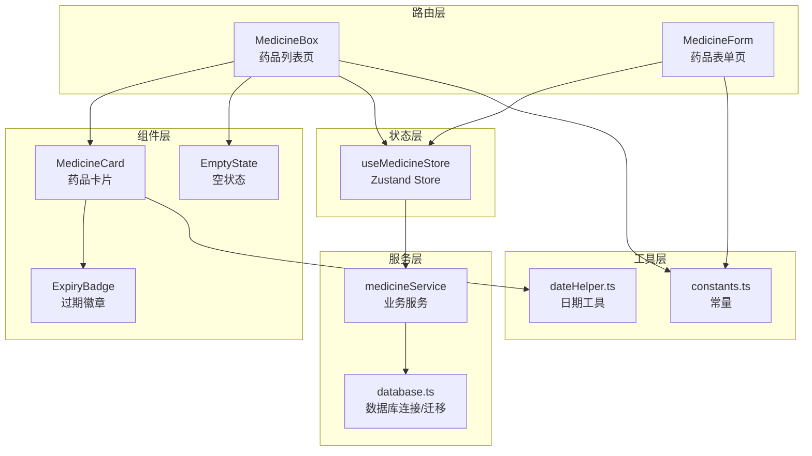
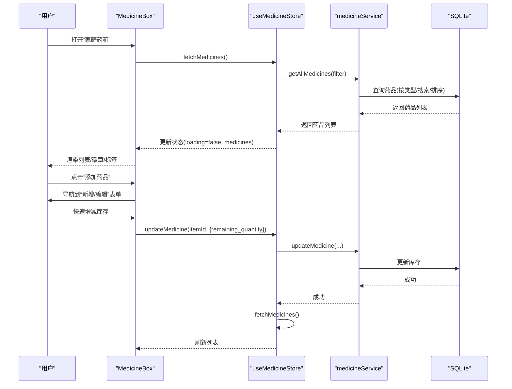
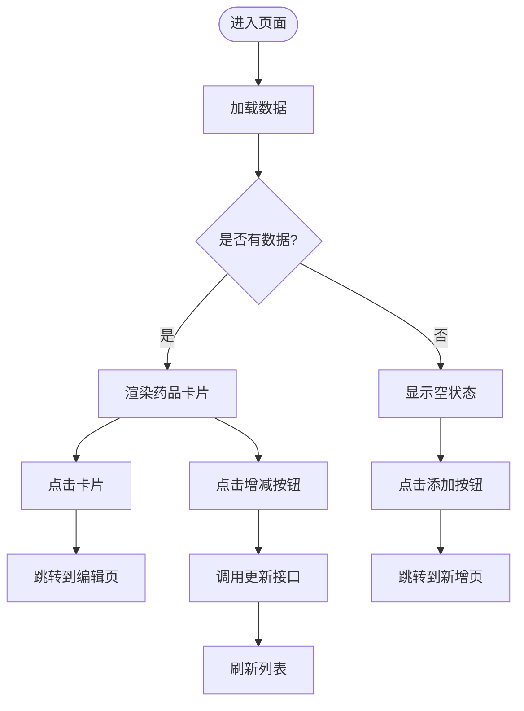
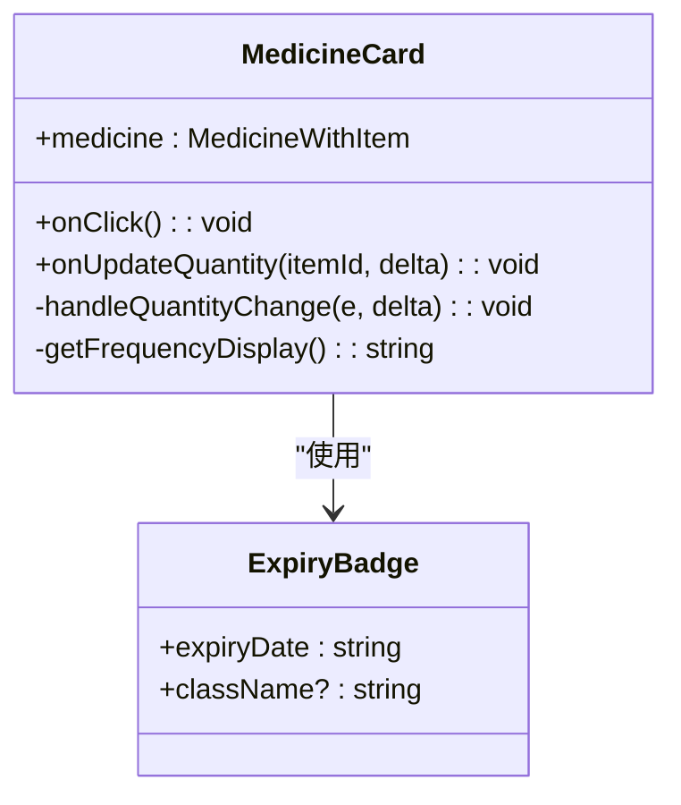
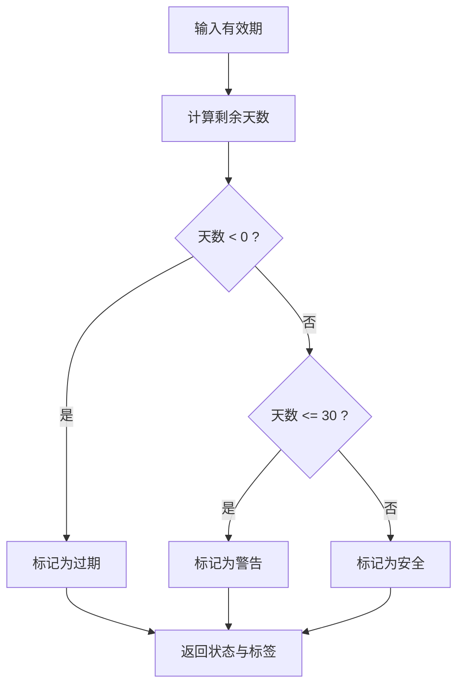
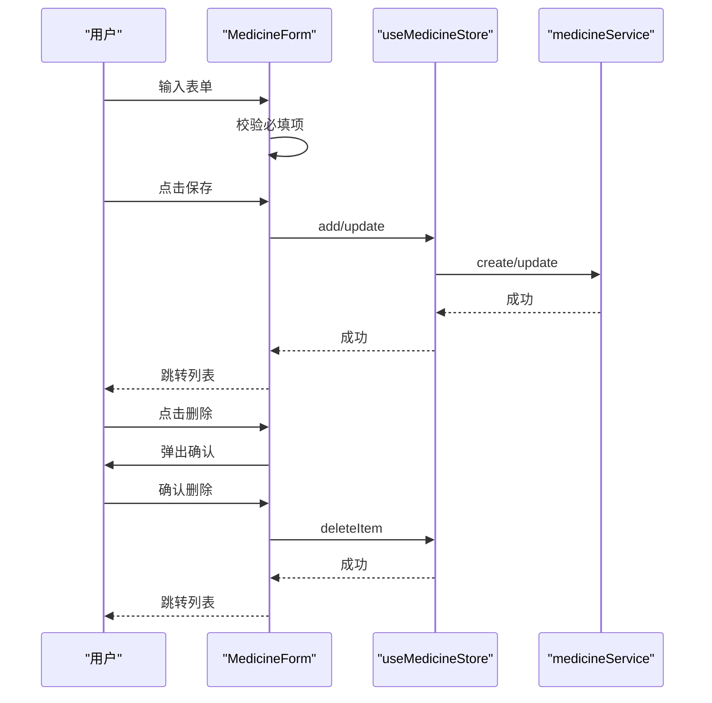
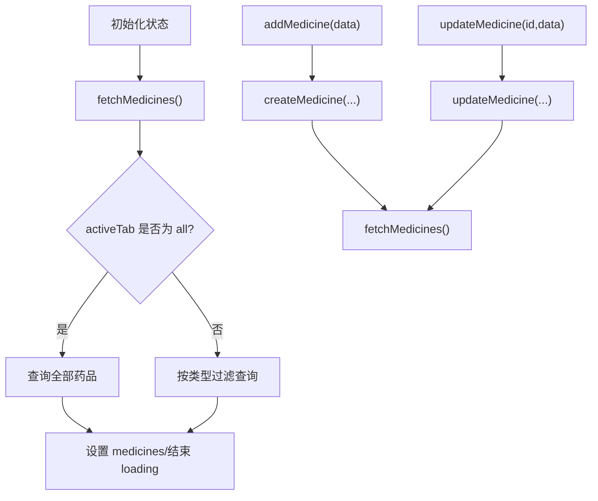
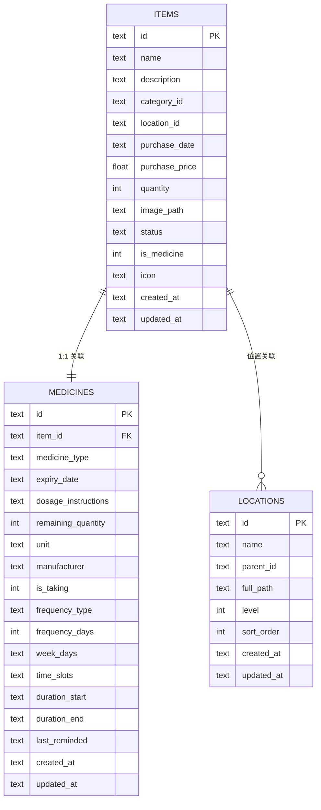
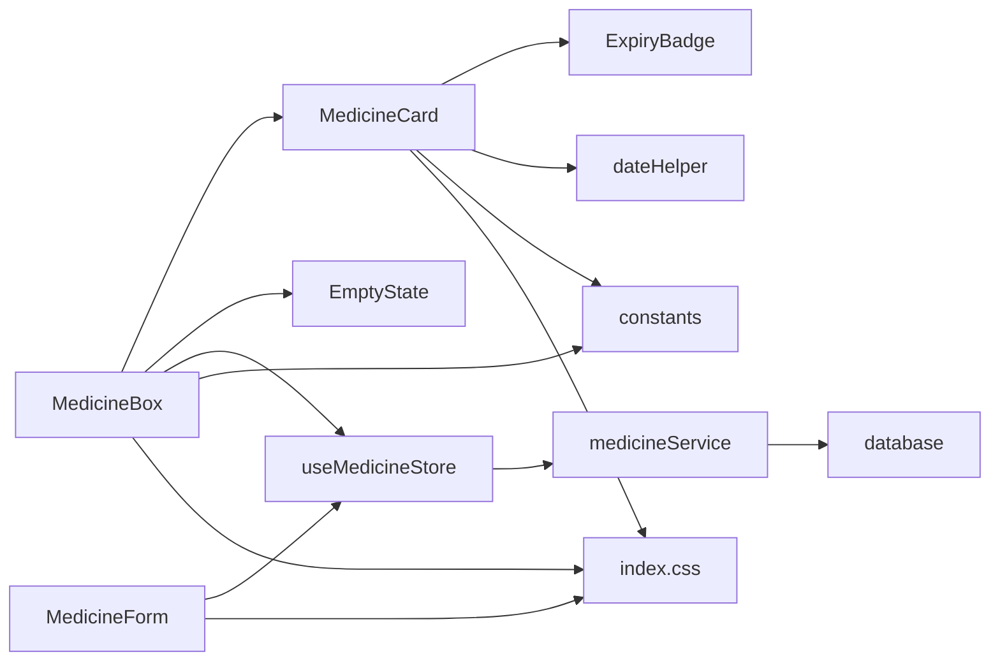

# 药品列表管理

<cite>
**本文档引用的文件**
- [MedicineBox.tsx](file://src/routes/MedicineBox.tsx)
- [MedicineCard.tsx](file://src/components/medicine/MedicineCard.tsx)
- [ExpiryBadge.tsx](file://src/components/medicine/ExpiryBadge.tsx)
- [MedicineForm.tsx](file://src/routes/MedicineForm.tsx)
- [useMedicineStore.ts](file://src/stores/useMedicineStore.ts)
- [medicineService.ts](file://src/services/medicineService.ts)
- [database.ts](file://src/services/database.ts)
- [constants.ts](file://src/utils/constants.ts)
- [dateHelper.ts](file://src/utils/dateHelper.ts)
- [App.tsx](file://src/App.tsx)
- [index.css](file://src/index.css)
</cite>

## 目录
1. [简介](#简介)
2. [项目结构](#项目结构)
3. [核心组件](#核心组件)
4. [架构总览](#架构总览)
5. [详细组件分析](#详细组件分析)
6. [依赖关系分析](#依赖关系分析)
7. [性能考虑](#性能考虑)
8. [故障排除指南](#故障排除指南)
9. [结论](#结论)
10. [附录：完整使用示例](#附录完整使用示例)

## 简介
本功能围绕“家庭药箱”展开，提供药品列表的展示与管理能力，包含：
- 按药品类型（内服、外用、急救）的分类筛选
- 药品卡片组件的展示与交互（点击跳转、快速增减库存）
- 库存数量管理（增减、边界保护）
- 过期状态可视化（安全/警告/过期）
- 完整的新增/编辑/删除流程

## 项目结构
该功能主要由以下层次构成：
- 路由层：负责页面入口与导航
- 组件层：展示型组件（卡片、徽章、空状态）
- 状态层：Zustand store 管理药品数据与筛选状态
- 服务层：MedicineService 封装数据库读写与查询
- 数据层：SQLite 数据库与迁移脚本
- 工具层：常量、日期辅助函数

**图表来源**
- [MedicineBox.tsx:18-112](file://src/routes/MedicineBox.tsx#L18-L112)
- [MedicineCard.tsx:14-147](file://src/components/medicine/MedicineCard.tsx#L14-L147)
- [ExpiryBadge.tsx:8-24](file://src/components/medicine/ExpiryBadge.tsx#L8-L24)
- [MedicineForm.tsx:33-401](file://src/routes/MedicineForm.tsx#L33-L401)
- [useMedicineStore.ts:15-42](file://src/stores/useMedicineStore.ts#L15-L42)
- [medicineService.ts:10-194](file://src/services/medicineService.ts#L10-L194)
- [database.ts:8-171](file://src/services/database.ts#L8-L171)
- [constants.ts:15-20](file://src/utils/constants.ts#L15-L20)
- [dateHelper.ts:30-43](file://src/utils/dateHelper.ts#L30-L43)

**章节来源**
- [MedicineBox.tsx:18-112](file://src/routes/MedicineBox.tsx#L18-L112)
- [MedicineCard.tsx:14-147](file://src/components/medicine/MedicineCard.tsx#L14-L147)
- [MedicineForm.tsx:33-401](file://src/routes/MedicineForm.tsx#L33-L401)
- [useMedicineStore.ts:15-42](file://src/stores/useMedicineStore.ts#L15-L42)
- [medicineService.ts:10-194](file://src/services/medicineService.ts#L10-L194)
- [database.ts:8-171](file://src/services/database.ts#L8-L171)
- [constants.ts:15-20](file://src/utils/constants.ts#L15-L20)
- [dateHelper.ts:30-43](file://src/utils/dateHelper.ts#L30-L43)

## 核心组件
- 药品列表页（MedicineBox）
  - 提供“全部/内服/外用/急救”标签切换
  - 展示过期/警告提示横幅
  - 渲染药品卡片列表，支持点击进入编辑、快速增减库存
- 药品卡片（MedicineCard）
  - 展示药品名称、类型标签、是否正在服用、用法说明
  - 显示位置路径、购买价格、剩余数量
  - 提供库存增减按钮，调用父级传入的更新回调
- 过期徽章（ExpiryBadge）
  - 根据有效期计算状态并显示对应颜色与文案
- 药品表单（MedicineForm）
  - 新增/编辑药品，包含基本信息、购买信息、用药提醒
  - 支持删除药品
- 状态管理（useMedicineStore）
  - 维护药品列表、加载状态、当前标签
  - 提供获取、新增、更新、切换标签的方法
- 业务服务（medicineService）
  - 查询药品（支持类型过滤、模糊搜索）、创建、更新
  - 提供过期药品查询、正在服用药品查询
- 数据库（database.ts）
  - 初始化 SQLite 连接、执行迁移、建表与索引
- 工具（constants.ts、dateHelper.ts）
  - 药品类别标签映射
  - 有效期状态与标签计算

**章节来源**
- [MedicineBox.tsx:18-112](file://src/routes/MedicineBox.tsx#L18-L112)
- [MedicineCard.tsx:14-147](file://src/components/medicine/MedicineCard.tsx#L14-L147)
- [ExpiryBadge.tsx:8-24](file://src/components/medicine/ExpiryBadge.tsx#L8-L24)
- [MedicineForm.tsx:33-401](file://src/routes/MedicineForm.tsx#L33-L401)
- [useMedicineStore.ts:15-42](file://src/stores/useMedicineStore.ts#L15-L42)
- [medicineService.ts:10-194](file://src/services/medicineService.ts#L10-L194)
- [database.ts:8-171](file://src/services/database.ts#L8-L171)
- [constants.ts:15-20](file://src/utils/constants.ts#L15-L20)
- [dateHelper.ts:30-43](file://src/utils/dateHelper.ts#L30-L43)

## 架构总览
从路由到数据库的数据流如下：

**图表来源**
- [MedicineBox.tsx:20-36](file://src/routes/MedicineBox.tsx#L20-L36)
- [useMedicineStore.ts:20-36](file://src/stores/useMedicineStore.ts#L20-L36)
- [medicineService.ts:10-37](file://src/services/medicineService.ts#L10-L37)
- [database.ts:8-171](file://src/services/database.ts#L8-L171)

## 详细组件分析

### 药品列表页（MedicineBox）
- 分类筛选
  - 内置标签：全部/内服/外用/急救
  - 切换标签时通过 store 设置 activeTab，并触发重新拉取数据
- 库存预警
  - 计算过期与即将过期数量，展示警示横幅
- 列表渲染
  - 加载中显示旋转指示器
  - 空状态根据当前标签显示不同文案
  - 每个卡片绑定点击事件，跳转到编辑页
- 快速库存管理
  - 通过 onUpdateQuantity 回调处理增减
  - 保证库存不小于 0

**图表来源**
- [MedicineBox.tsx:18-112](file://src/routes/MedicineBox.tsx#L18-L112)
- [useMedicineStore.ts:20-26](file://src/stores/useMedicineStore.ts#L20-L26)

**章节来源**
- [MedicineBox.tsx:18-112](file://src/routes/MedicineBox.tsx#L18-L112)
- [useMedicineStore.ts:15-42](file://src/stores/useMedicineStore.ts#L15-L42)

### 药品卡片（MedicineCard）
- 展示内容
  - 药品名称、类型标签、是否正在服用徽章
  - 用法说明（非正在服用时显示）
  - 位置路径、购买价格
  - 剩余数量与单位
- 交互行为
  - 整体可点击，触发父级 onClick
  - 库存增减按钮禁用条件：减少时库存为 0
  - 阻止事件冒泡，避免误触卡片点击
- 视觉标识
  - 类型标签使用常量映射
  - 正在服用徽章仅在 is_taking=true 时显示
  - 购买价格格式化显示

**图表来源**
- [MedicineCard.tsx:14-147](file://src/components/medicine/MedicineCard.tsx#L14-L147)
- [ExpiryBadge.tsx:8-24](file://src/components/medicine/ExpiryBadge.tsx#L8-L24)

**章节来源**
- [MedicineCard.tsx:14-147](file://src/components/medicine/MedicineCard.tsx#L14-L147)
- [ExpiryBadge.tsx:8-24](file://src/components/medicine/ExpiryBadge.tsx#L8-L24)
- [constants.ts:15-20](file://src/utils/constants.ts#L15-L20)

### 过期徽章（ExpiryBadge）
- 状态计算
  - 依据有效期距离今天的天数判断：过期、警告、安全
- 文案展示
  - 根据剩余天数生成人性化文案
- 样式映射
  - 不同状态使用不同背景色与文字色

**图表来源**
- [dateHelper.ts:30-43](file://src/utils/dateHelper.ts#L30-L43)
- [ExpiryBadge.tsx:8-24](file://src/components/medicine/ExpiryBadge.tsx#L8-L24)

**章节来源**
- [dateHelper.ts:30-43](file://src/utils/dateHelper.ts#L30-L43)
- [ExpiryBadge.tsx:8-24](file://src/components/medicine/ExpiryBadge.tsx#L8-L24)

### 药品表单（MedicineForm）
- 表单字段
  - 基本信息：名称、有效期、类型、用法说明、剩余数量、单位、厂商
  - 购买信息：购买日期、价格、存放位置
  - 用药提醒：是否正在服用、频率类型、间隔天数、周几、时间点、周期
- 交互逻辑
  - 编辑模式下加载已有数据
  - 新增/更新提交，成功后返回列表
  - 删除确认对话框
  - 时间点与周几的增删改
- 校验与约束
  - 名称与有效期必填
  - 保存按钮根据必填项启用/禁用

**图表来源**
- [MedicineForm.tsx:33-401](file://src/routes/MedicineForm.tsx#L33-L401)
- [useMedicineStore.ts:28-36](file://src/stores/useMedicineStore.ts#L28-L36)
- [medicineService.ts:54-162](file://src/services/medicineService.ts#L54-L162)

**章节来源**
- [MedicineForm.tsx:33-401](file://src/routes/MedicineForm.tsx#L33-L401)
- [useMedicineStore.ts:28-36](file://src/stores/useMedicineStore.ts#L28-L36)
- [medicineService.ts:54-162](file://src/services/medicineService.ts#L54-L162)

### 状态管理（useMedicineStore）
- 状态字段
  - medicines、loading、activeTab
- 核心方法
  - fetchMedicines：按 activeTab 过滤查询
  - addMedicine：创建药品后刷新列表
  - updateMedicine：更新后刷新列表
  - setActiveTab：切换标签

**图表来源**
- [useMedicineStore.ts:15-42](file://src/stores/useMedicineStore.ts#L15-L42)
- [medicineService.ts:10-37](file://src/services/medicineService.ts#L10-L37)

**章节来源**
- [useMedicineStore.ts:15-42](file://src/stores/useMedicineStore.ts#L15-L42)
- [medicineService.ts:10-37](file://src/services/medicineService.ts#L10-L37)

### 业务服务（medicineService）
- 查询
  - getAllMedicines：支持 type 与 search 过滤，按有效期升序
  - getMedicineByItemId：按物品 ID 获取详情
  - getExpiringMedicines：查询即将过期药品
  - getTakingMedicines：查询正在服用药品
- 写入
  - createMedicine：先创建物品，再创建药品扩展记录
  - updateMedicine：分别更新物品与药品字段（布尔值转换为整数）

**图表来源**
- [medicineService.ts:10-52](file://src/services/medicineService.ts#L10-L52)
- [database.ts:104-117](file://src/services/database.ts#L104-L117)

**章节来源**
- [medicineService.ts:10-194](file://src/services/medicineService.ts#L10-L194)
- [database.ts:104-117](file://src/services/database.ts#L104-L117)

## 依赖关系分析
- 组件依赖
  - MedicineBox 依赖 MedicineCard、EmptyState、ExpiryBadge
  - MedicineCard 依赖 ExpiryBadge、dateHelper、constants
- 状态与服务
  - useMedicineStore 依赖 medicineService
  - medicineService 依赖 database
- 全局样式
  - index.css 定义主题色与通用样式，影响所有组件外观

**图表来源**
- [MedicineBox.tsx:18-112](file://src/routes/MedicineBox.tsx#L18-L112)
- [MedicineCard.tsx:14-147](file://src/components/medicine/MedicineCard.tsx#L14-L147)
- [ExpiryBadge.tsx:8-24](file://src/components/medicine/ExpiryBadge.tsx#L8-L24)
- [MedicineForm.tsx:33-401](file://src/routes/MedicineForm.tsx#L33-L401)
- [useMedicineStore.ts:15-42](file://src/stores/useMedicineStore.ts#L15-L42)
- [medicineService.ts:10-194](file://src/services/medicineService.ts#L10-L194)
- [database.ts:8-171](file://src/services/database.ts#L8-L171)
- [constants.ts:15-20](file://src/utils/constants.ts#L15-L20)
- [index.css:1-84](file://src/index.css#L1-L84)

**章节来源**
- [MedicineBox.tsx:18-112](file://src/routes/MedicineBox.tsx#L18-L112)
- [MedicineCard.tsx:14-147](file://src/components/medicine/MedicineCard.tsx#L14-L147)
- [MedicineForm.tsx:33-401](file://src/routes/MedicineForm.tsx#L33-L401)
- [useMedicineStore.ts:15-42](file://src/stores/useMedicineStore.ts#L15-L42)
- [medicineService.ts:10-194](file://src/services/medicineService.ts#L10-L194)
- [database.ts:8-171](file://src/services/database.ts#L8-L171)
- [constants.ts:15-20](file://src/utils/constants.ts#L15-L20)
- [index.css:1-84](file://src/index.css#L1-L84)

## 性能考虑
- 查询优化
  - medicines 表按 expiry_date、type 建有索引，保障排序与过滤效率
  - items 表按 category_id、location_id、status 建有索引，支持多维检索
- 渲染优化
  - 列表使用 key={med.id}，避免重复渲染
  - 空状态与加载状态分离，减少不必要的 DOM 更新
- 网络/IO
  - store 在更新后统一触发 fetch，避免多次独立请求
- 样式
  - 使用 Tailwind 主题变量，统一尺寸与颜色，降低样式计算成本

[本节为通用建议，无需特定文件引用]

## 故障排除指南
- 页面空白或长时间加载
  - 检查数据库连接与迁移是否成功
  - 确认 store 的 fetchMedicines 是否被正确调用
- 库存无法更新
  - 确认 onUpdateQuantity 回调是否传递给卡片
  - 检查 updateMedicine 接口返回与错误日志
- 过期状态显示异常
  - 检查有效期字段格式与 dateHelper 的计算逻辑
- 新增/编辑无效
  - 确认必填字段（名称、有效期）是否满足
  - 查看服务层日志与数据库事务是否成功

**章节来源**
- [database.ts:8-171](file://src/services/database.ts#L8-L171)
- [useMedicineStore.ts:20-36](file://src/stores/useMedicineStore.ts#L20-L36)
- [medicineService.ts:97-162](file://src/services/medicineService.ts#L97-L162)
- [dateHelper.ts:30-43](file://src/utils/dateHelper.ts#L30-L43)

## 结论
该“药品列表管理”功能以清晰的分层架构实现，具备完善的分类筛选、库存管理与状态可视化能力。通过 store 与 service 的职责分离，配合数据库索引与样式主题，既保证了良好的用户体验，也为后续扩展（如搜索栏、批量操作、提醒推送）提供了良好基础。

[本节为总结性内容，无需特定文件引用]

## 附录：完整使用示例

### 示例一：添加药品
- 步骤
  - 点击“添加药品”，进入新增表单
  - 填写基本信息（名称、有效期、类型、用法说明）
  - 填写购买信息（购买日期、价格、存放位置）
  - 可选：开启“是否正在服用”，配置用药提醒（频率、时间点、周期）
  - 点击“添加药品”，返回列表
- 关键实现
  - 表单校验与保存流程
  - 创建物品与药品扩展记录
  - 自动刷新列表

**章节来源**
- [MedicineForm.tsx:66-80](file://src/routes/MedicineForm.tsx#L66-L80)
- [medicineService.ts:54-95](file://src/services/medicineService.ts#L54-L95)
- [useMedicineStore.ts:28-31](file://src/stores/useMedicineStore.ts#L28-L31)

### 示例二：编辑药品信息
- 步骤
  - 在列表点击某药品卡片，进入编辑页
  - 修改任意字段（名称、类型、用法说明、库存、单位、厂商等）
  - 点击“保存修改”，返回列表
- 关键实现
  - 按物品 ID 加载详情
  - 分别更新 items 与 medicines 字段

**章节来源**
- [MedicineForm.tsx:43-64](file://src/routes/MedicineForm.tsx#L43-L64)
- [MedicineForm.tsx:71-76](file://src/routes/MedicineForm.tsx#L71-L76)
- [medicineService.ts:97-162](file://src/services/medicineService.ts#L97-L162)

### 示例三：管理库存数量
- 步骤
  - 在药品卡片底部点击“-”减少，“+”增加
  - 减少时若库存为 0，则按钮禁用
  - 更新后自动刷新列表
- 关键实现
  - 快速增减回调
  - 边界保护（库存不小于 0）
  - 调用 updateMedicine 并刷新

**章节来源**
- [MedicineBox.tsx:31-36](file://src/routes/MedicineBox.tsx#L31-L36)
- [MedicineCard.tsx:17-20](file://src/components/medicine/MedicineCard.tsx#L17-L20)
- [MedicineCard.tsx:124-140](file://src/components/medicine/MedicineCard.tsx#L124-L140)

### 示例四：按类型筛选与查看过期状态
- 步骤
  - 点击“内服/外用/急救”标签，仅显示对应类型药品
  - 若存在过期或即将过期药品，顶部显示警示横幅
- 关键实现
  - store 切换 activeTab 并触发查询
  - 计算过期/警告数量并渲染横幅

**章节来源**
- [MedicineBox.tsx:11-16](file://src/routes/MedicineBox.tsx#L11-L16)
- [MedicineBox.tsx:38-39](file://src/routes/MedicineBox.tsx#L38-L39)
- [useMedicineStore.ts:38-40](file://src/stores/useMedicineStore.ts#L38-L40)

### 示例五：删除药品
- 步骤
  - 在编辑页点击“删除”，弹出确认对话框
  - 确认后删除物品记录，返回列表
- 关键实现
  - 删除确认对话框
  - 调用删除接口并跳转

**章节来源**
- [MedicineForm.tsx:82-87](file://src/routes/MedicineForm.tsx#L82-L87)
- [MedicineForm.tsx:389-398](file://src/routes/MedicineForm.tsx#L389-L398)