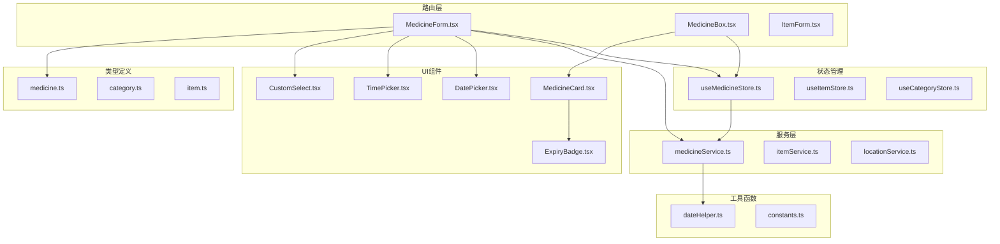
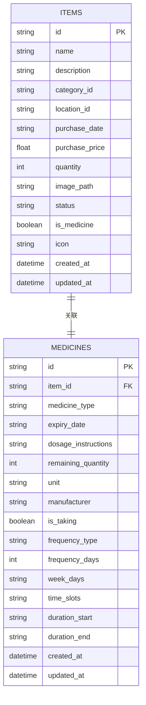
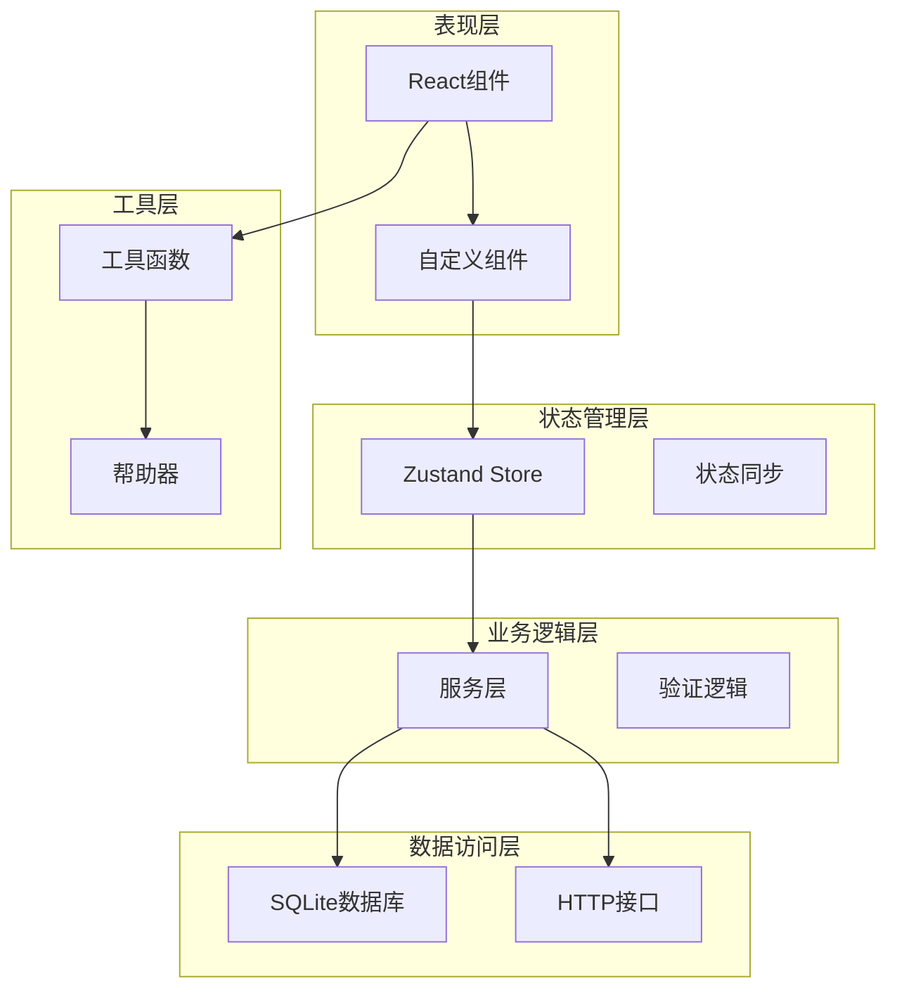
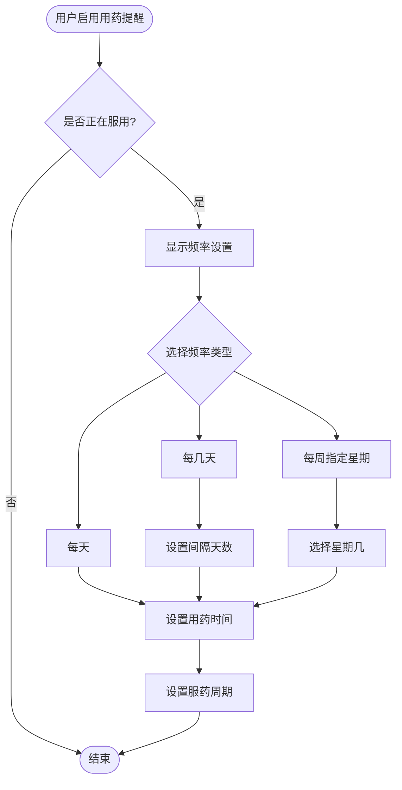
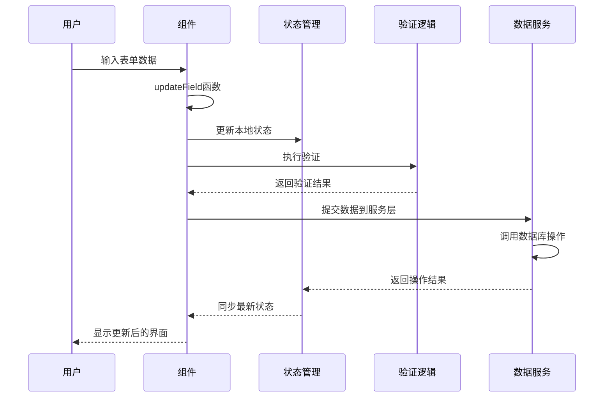
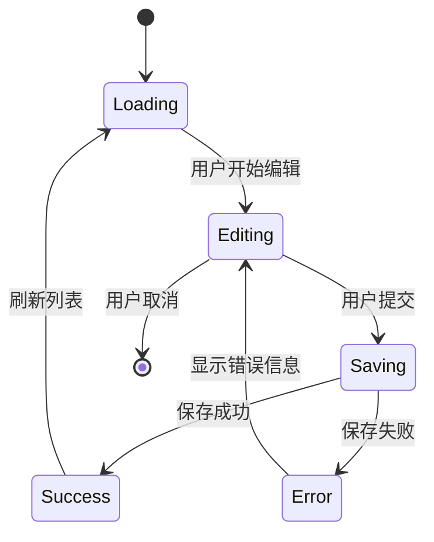
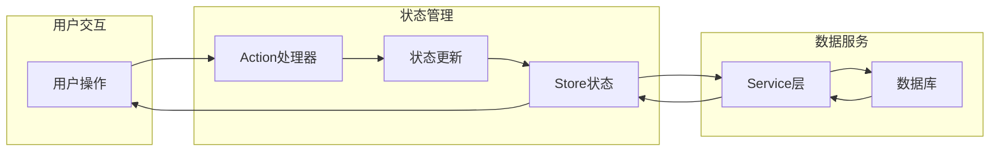
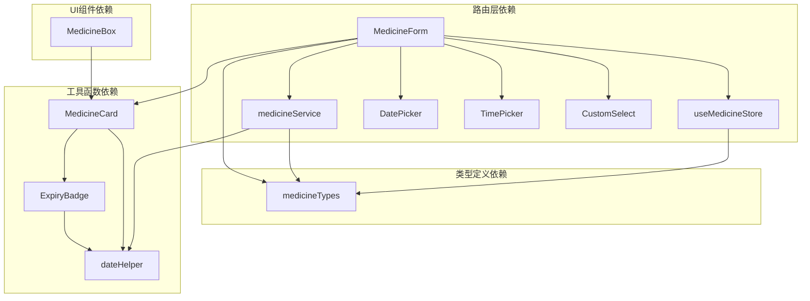

# 药品表单编辑

<cite>
**本文档引用的文件**
- [MedicineForm.tsx](file://src/routes/MedicineForm.tsx)
- [medicine.ts](file://src/types/medicine.ts)
- [medicineService.ts](file://src/services/medicineService.ts)
- [useMedicineStore.ts](file://src/stores/useMedicineStore.ts)
- [ExpiryBadge.tsx](file://src/components/medicine/ExpiryBadge.tsx)
- [dateHelper.ts](file://src/utils/dateHelper.ts)
- [DatePicker.tsx](file://src/components/shared/DatePicker.tsx)
- [TimePicker.tsx](file://src/components/shared/TimePicker.tsx)
- [CustomSelect.tsx](file://src/components/shared/CustomSelect.tsx)
- [MedicineBox.tsx](file://src/routes/MedicineBox.tsx)
- [MedicineCard.tsx](file://src/components/medicine/MedicineCard.tsx)
- [constants.ts](file://src/utils/constants.ts)
- [ItemForm.tsx](file://src/routes/ItemForm.tsx)
</cite>

## 目录
1. [简介](#简介)
2. [项目结构](#项目结构)
3. [核心组件](#核心组件)
4. [架构概览](#架构概览)
5. [详细组件分析](#详细组件分析)
6. [依赖关系分析](#依赖关系分析)
7. [性能考虑](#性能考虑)
8. [故障排除指南](#故障排除指南)
9. [结论](#结论)
10. [附录](#附录)

## 简介

本项目是一个基于React + Tauri构建的家庭药箱管理系统，专注于药品信息的完整生命周期管理。本文档详细介绍了药品表单编辑功能的设计与实现，包括必填字段、可选字段、输入验证规则、药品类型分类、表单数据绑定机制、编辑更新流程以及组件复用模式。

系统采用现代化的前端架构，结合TypeScript类型安全、Zustand状态管理、自定义UI组件库和SQLite数据库存储，为用户提供直观易用的药品管理体验。

## 项目结构

项目采用模块化组织方式，核心目录结构如下：

**图表来源**
- [MedicineForm.tsx:1-401](file://src/routes/MedicineForm.tsx#L1-L401)
- [medicineService.ts:1-194](file://src/services/medicineService.ts#L1-L194)
- [useMedicineStore.ts:1-42](file://src/stores/useMedicineStore.ts#L1-L42)

**章节来源**
- [MedicineForm.tsx:1-401](file://src/routes/MedicineForm.tsx#L1-L401)
- [medicine.ts:1-70](file://src/types/medicine.ts#L1-L70)

## 核心组件

### 药品表单组件

MedicineForm.tsx是整个药品管理功能的核心组件，实现了完整的CRUD操作：

- **基础信息区域**：包含药品名称、有效期、类型、说明等必填字段
- **购买信息区域**：记录购买日期、价格、存放位置等可选信息  
- **用药提醒区域**：支持复杂的用药计划配置
- **状态管理**：集成Zustand状态管理，支持实时数据同步

### 数据模型设计

系统采用分层数据模型，将通用物品信息与药品特有信息分离：

**图表来源**
- [medicine.ts:7-41](file://src/types/medicine.ts#L7-L41)

**章节来源**
- [medicine.ts:1-70](file://src/types/medicine.ts#L1-L70)
- [MedicineForm.tsx:14-21](file://src/routes/MedicineForm.tsx#L14-L21)

## 架构概览

系统采用分层架构设计，确保关注点分离和代码可维护性：

**图表来源**
- [MedicineForm.tsx:33-401](file://src/routes/MedicineForm.tsx#L33-L401)
- [useMedicineStore.ts:15-42](file://src/stores/useMedicineStore.ts#L15-L42)

## 详细组件分析

### 药品表单组件分析

#### 表单字段设计

表单采用分组设计，每个区域都有明确的功能边界：

**基本信息区域（必填）**
- 药品名称：必填字段，用于标识药品
- 有效期：必填字段，关键的安全信息
- 类型：下拉选择，支持内服、外用、急救三种类型

**扩展信息区域（可选）**
- 服用/使用说明：详细指导文本
- 剩余数量：库存管理
- 单位：标准化计量单位
- 生产厂商：供应商信息

**购买信息区域**
- 购买日期：财务追踪
- 价格：成本核算
- 存放位置：物理定位

#### 用药提醒系统

这是系统的核心特色功能，支持多种复杂的用药模式：

**图表来源**
- [MedicineForm.tsx:253-377](file://src/routes/MedicineForm.tsx#L253-L377)

#### 数据绑定机制

系统采用受控组件模式，通过useState实现双向数据绑定：

**图表来源**
- [MedicineForm.tsx:66-80](file://src/routes/MedicineForm.tsx#L66-L80)
- [useMedicineStore.ts:28-36](file://src/stores/useMedicineStore.ts#L28-L36)

**章节来源**
- [MedicineForm.tsx:89-120](file://src/routes/MedicineForm.tsx#L89-L120)
- [MedicineForm.tsx:138-387](file://src/routes/MedicineForm.tsx#L138-L387)

### 自定义组件分析

#### 日期选择器组件

DatePicker.tsx提供了完整的日期选择功能：

- **多级视图**：支持日、月、年三级切换
- **快速选择**：包含"今天"、"清除"等快捷操作
- **外部点击关闭**：自动处理弹窗关闭逻辑
- **响应式设计**：适配移动端和桌面端

#### 时间选择器组件

TimePicker.tsx专为用药时间设计：

- **滚轮选择**：模拟传统滚轮时钟效果
- **吸附对齐**：滚动停止时自动对齐到最近的时间
- **双列显示**：小时和分钟独立滚动
- **确认机制**：避免误触导致的数据丢失

#### 下拉选择器组件

CustomSelect.tsx提供统一的选择器体验：

- **全屏弹窗**：提供更好的移动端体验
- **滚动锁定**：防止背景滚动
- **动画过渡**：流畅的打开关闭动画
- **选项高亮**：当前选中项的视觉反馈

**章节来源**
- [DatePicker.tsx:17-278](file://src/components/shared/DatePicker.tsx#L17-L278)
- [TimePicker.tsx:15-221](file://src/components/shared/TimePicker.tsx#L15-L221)
- [CustomSelect.tsx:17-109](file://src/components/shared/CustomSelect.tsx#L17-L109)

### 服务层分析

#### 数据库操作

medicineService.ts封装了所有数据库操作：

- **事务处理**：确保数据一致性
- **参数化查询**：防止SQL注入攻击
- **错误处理**：完善的异常捕获机制
- **日志记录**：操作审计和调试支持

#### 数据同步策略

系统采用乐观更新策略：

**图表来源**
- [medicineService.ts:54-95](file://src/services/medicineService.ts#L54-L95)
- [medicineService.ts:97-162](file://src/services/medicineService.ts#L97-L162)

**章节来源**
- [medicineService.ts:1-194](file://src/services/medicineService.ts#L1-L194)
- [useMedicineStore.ts:15-42](file://src/stores/useMedicineStore.ts#L15-L42)

### 状态管理分析

#### Zustand Store设计

useMedicineStore.ts实现了集中式状态管理：

- **状态隔离**：不同页面使用独立的状态
- **异步操作**：支持Promise的异步状态更新
- **计算属性**：派生状态的自动更新
- **订阅机制**：状态变化时的自动通知

#### 数据流管理

**图表来源**
- [useMedicineStore.ts:15-42](file://src/stores/useMedicineStore.ts#L15-L42)
- [MedicineBox.tsx:18-112](file://src/routes/MedicineBox.tsx#L18-L112)

**章节来源**
- [useMedicineStore.ts:1-42](file://src/stores/useMedicineStore.ts#L1-42)
- [MedicineBox.tsx:18-112](file://src/routes/MedicineBox.tsx#L18-L112)

## 依赖关系分析

系统采用松耦合设计，各模块间依赖关系清晰：

**图表来源**
- [MedicineForm.tsx:1-12](file://src/routes/MedicineForm.tsx#L1-L12)
- [medicineService.ts:1-4](file://src/services/medicineService.ts#L1-L4)

**章节来源**
- [MedicineForm.tsx:1-12](file://src/routes/MedicineForm.tsx#L1-L12)
- [medicineService.ts:1-4](file://src/services/medicineService.ts#L1-L4)

## 性能考虑

### 渲染优化

- **条件渲染**：根据状态动态显示/隐藏复杂组件
- **懒加载**：大型组件按需加载
- **虚拟滚动**：长列表的性能优化
- **防抖节流**：输入验证的性能优化

### 数据传输优化

- **批量操作**：减少网络请求次数
- **增量更新**：只更新变化的数据
- **缓存策略**：重复数据的本地缓存
- **压缩传输**：减少数据体积

### 内存管理

- **及时清理**：组件卸载时清理事件监听
- **引用优化**：避免不必要的对象创建
- **垃圾回收**：合理使用JavaScript特性

## 故障排除指南

### 常见问题及解决方案

**表单验证失败**
- 检查必填字段是否为空
- 验证日期格式是否正确
- 确认数值范围是否合法

**数据同步问题**
- 检查网络连接状态
- 验证数据库连接
- 查看服务层错误日志

**组件渲染异常**
- 检查props传递是否正确
- 验证状态更新时机
- 确认事件处理器绑定

**章节来源**
- [MedicineForm.tsx:66-80](file://src/routes/MedicineForm.tsx#L66-L80)
- [medicineService.ts:97-162](file://src/services/medicineService.ts#L97-L162)

## 结论

本药品表单编辑功能展现了现代前端应用的最佳实践：

1. **架构清晰**：分层设计确保了代码的可维护性和可扩展性
2. **用户体验**：丰富的交互组件提供了优秀的用户体验
3. **数据安全**：完善的验证和错误处理机制保障了数据完整性
4. **性能优化**：合理的优化策略确保了应用的响应速度
5. **开发效率**：模块化的组件设计提高了开发和测试效率

该系统为家庭药箱管理提供了完整的解决方案，既满足了基本的药品信息管理需求，又具备了扩展新功能的灵活性。

## 附录

### 最佳实践指南

**组件复用模式**
- 将通用逻辑提取到自定义Hook
- 使用高阶组件实现横切关注点
- 通过props实现灵活配置

**错误处理策略**
- 分层错误处理机制
- 用户友好的错误提示
- 完善的日志记录系统

**测试策略**
- 单元测试覆盖核心逻辑
- 集成测试验证组件交互
- 端到端测试确保用户体验

**章节来源**
- [MedicineForm.tsx:33-401](file://src/routes/MedicineForm.tsx#L33-L401)
- [MedicineBox.tsx:18-112](file://src/routes/MedicineBox.tsx#L18-L112)