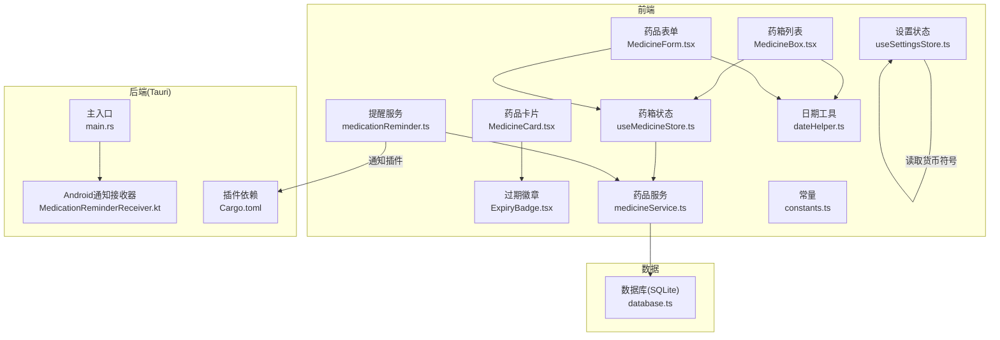
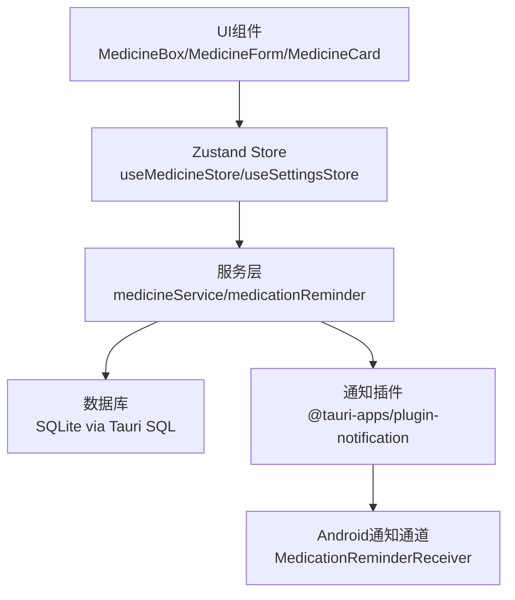
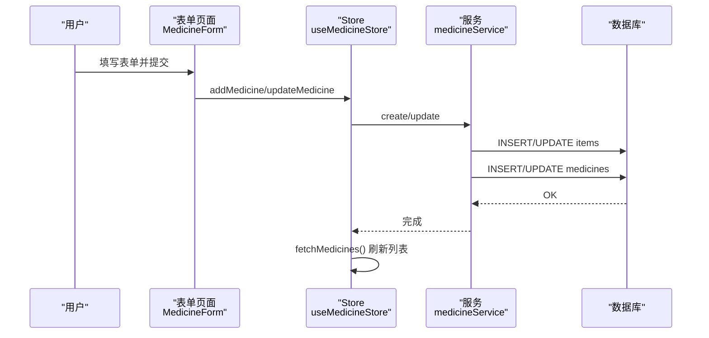
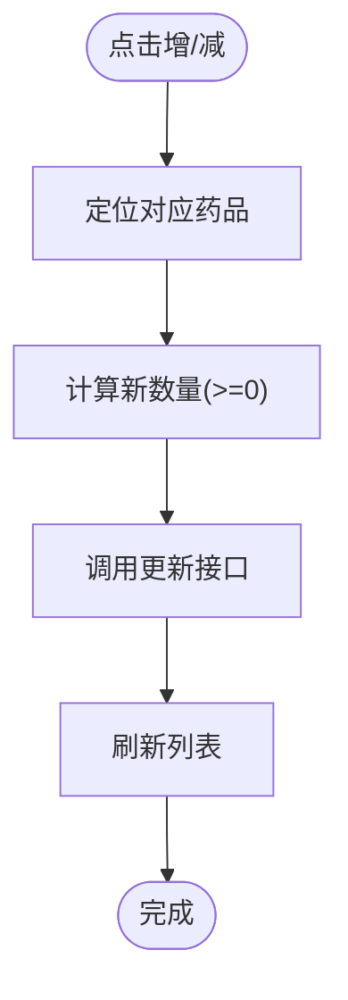
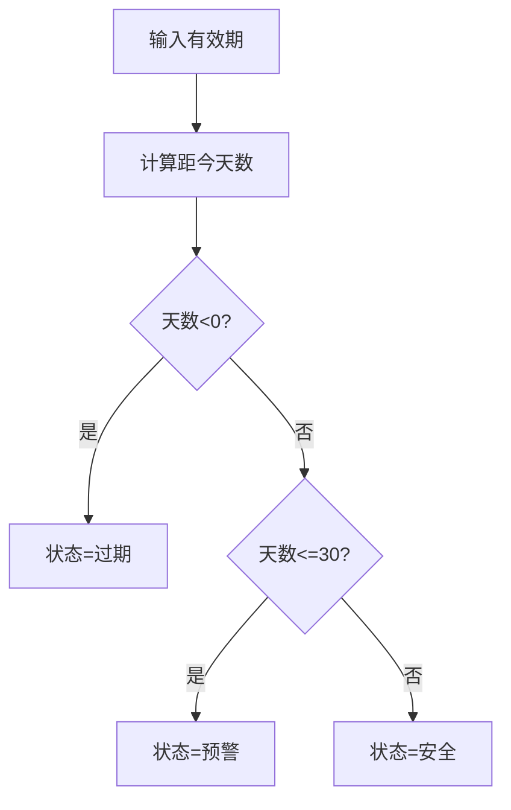
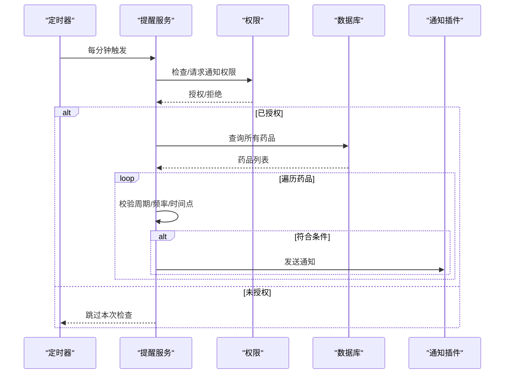
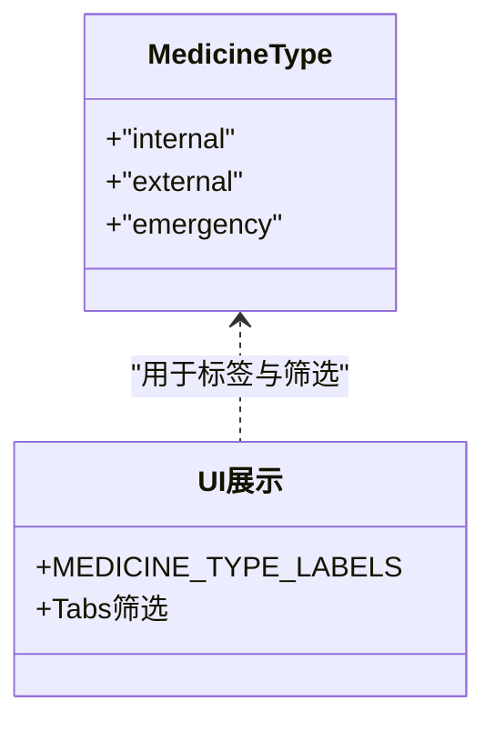
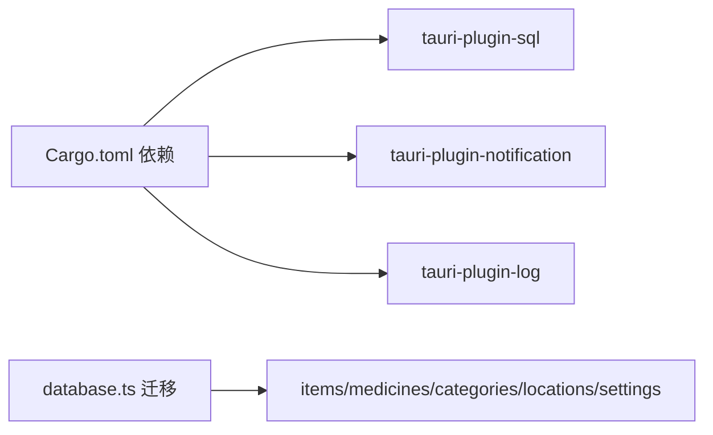

# 药箱管理

<cite>
**本文引用的文件**
- [src/routes/MedicineBox.tsx](file://src/routes/MedicineBox.tsx)
- [src/routes/MedicineForm.tsx](file://src/routes/MedicineForm.tsx)
- [src/services/medicineService.ts](file://src/services/medicineService.ts)
- [src/services/medicationReminder.ts](file://src/services/medicationReminder.ts)
- [src/stores/useMedicineStore.ts](file://src/stores/useMedicineStore.ts)
- [src/stores/useSettingsStore.ts](file://src/stores/useSettingsStore.ts)
- [src/components/medicine/MedicineCard.tsx](file://src/components/medicine/MedicineCard.tsx)
- [src/components/medicine/ExpiryBadge.tsx](file://src/components/medicine/ExpiryBadge.tsx)
- [src/utils/dateHelper.ts](file://src/utils/dateHelper.ts)
- [src/utils/constants.ts](file://src/utils/constants.ts)
- [src/services/database.ts](file://src/services/database.ts)
- [src-tauri/src/main.rs](file://src-tauri/src/main.rs)
- [src-tauri/gen/android/app/src/main/java/com/assetly/home/MedicationReminderReceiver.kt](file://src-tauri/gen/android/app/src/main/java/com/assetly/home/MedicationReminderReceiver.kt)
- [src-tauri/Cargo.toml](file://src-tauri/Cargo.toml)
</cite>

## 目录
1. [简介](#简介)
2. [项目结构](#项目结构)
3. [核心组件](#核心组件)
4. [架构总览](#架构总览)
5. [详细组件分析](#详细组件分析)
6. [依赖关系分析](#依赖关系分析)
7. [性能考量](#性能考量)
8. [故障排查指南](#故障排查指南)
9. [结论](#结论)
10. [附录：使用场景与最佳实践](#附录使用场景与最佳实践)

## 简介
本系统围绕“药箱管理”构建，提供药品信息全生命周期管理能力，包括：
- 药品基本信息录入（名称、类型、单位、厂商等）
- 库存数量管理（增减与实时显示）
- 有效期跟踪与过期预警
- 用药提醒系统（频率、时间点、周期、通知）
- 药品类型分类（内服/外用/急救）与展示
- 通知系统集成（桌面与Android原生通知）

系统采用前端React + Zustand状态管理 + Tauri后端，数据持久化通过SQLite，移动端通过Android广播接收器处理通知通道与振动。

## 项目结构
- 前端路由与页面
  - 药箱列表页：展示所有药品、按类型筛选、库存更新、过期预警横幅
  - 药品表单页：新增/编辑药品，包含购买信息、提醒设置
- 服务层
  - 药品服务：查询、创建、更新、过期药品检索、正在服用药品检索
  - 用药提醒：定时检查、权限校验、通知发送、Android动作类型注册
  - 数据库：连接、迁移、建表与索引
- 组件层
  - 药品卡片：展示基本信息、类型标签、用量、位置、提醒标识、库存快捷调整
  - 过期徽章：根据有效期计算状态与标签
- 工具与常量
  - 日期工具：格式化、到期计算、到期状态判定
  - 常量：默认分类、类型标签、货币符号等
- Tauri后端与Android集成
  - 主入口：Tauri运行
  - Android通知接收器：通知通道、振动模式、点击行为



**图表来源**
- [src/routes/MedicineBox.tsx:1-112](file://src/routes/MedicineBox.tsx#L1-L112)
- [src/routes/MedicineForm.tsx:1-401](file://src/routes/MedicineForm.tsx#L1-L401)
- [src/components/medicine/MedicineCard.tsx:1-147](file://src/components/medicine/MedicineCard.tsx#L1-L147)
- [src/components/medicine/ExpiryBadge.tsx:1-24](file://src/components/medicine/ExpiryBadge.tsx#L1-L24)
- [src/stores/useMedicineStore.ts:1-42](file://src/stores/useMedicineStore.ts#L1-L42)
- [src/stores/useSettingsStore.ts:1-56](file://src/stores/useSettingsStore.ts#L1-L56)
- [src/services/medicineService.ts:1-194](file://src/services/medicineService.ts#L1-L194)
- [src/services/medicationReminder.ts:1-132](file://src/services/medicationReminder.ts#L1-L132)
- [src/utils/dateHelper.ts:1-52](file://src/utils/dateHelper.ts#L1-L52)
- [src/utils/constants.ts:1-40](file://src/utils/constants.ts#L1-L40)
- [src/services/database.ts:1-171](file://src/services/database.ts#L1-L171)
- [src-tauri/src/main.rs:1-7](file://src-tauri/src/main.rs#L1-L7)
- [src-tauri/gen/android/app/src/main/java/com/assetly/home/MedicationReminderReceiver.kt:1-68](file://src-tauri/gen/android/app/src/main/java/com/assetly/home/MedicationReminderReceiver.kt#L1-L68)
- [src-tauri/Cargo.toml:1-31](file://src-tauri/Cargo.toml#L1-L31)

**章节来源**
- [src/routes/MedicineBox.tsx:1-112](file://src/routes/MedicineBox.tsx#L1-L112)
- [src/routes/MedicineForm.tsx:1-401](file://src/routes/MedicineForm.tsx#L1-L401)
- [src/services/medicineService.ts:1-194](file://src/services/medicineService.ts#L1-L194)
- [src/services/medicationReminder.ts:1-132](file://src/services/medicationReminder.ts#L1-L132)
- [src/services/database.ts:1-171](file://src/services/database.ts#L1-L171)
- [src-tauri/gen/android/app/src/main/java/com/assetly/home/MedicationReminderReceiver.kt:1-68](file://src-tauri/gen/android/app/src/main/java/com/assetly/home/MedicationReminderReceiver.kt#L1-L68)

## 核心组件
- 药品信息模型与类型
  - 药品类别：内服/外用/急救
  - 频率类型：每日、每隔N天、每周指定星期
  - 提醒字段：是否正在服用、频率类型、间隔天数、周几、时间点集合、起止周期、上次提醒时间
- 药品服务
  - 查询：支持按类型过滤、按名称模糊搜索、按有效期排序
  - 创建：先创建基础物品，再扩展为药品记录；自动关联默认“药品保健”分类
  - 更新：分别更新物品与药品扩展字段；布尔值转换为SQLite整型
  - 过期查询：按“多少天内过期”范围检索
  - 正在服用查询：按标记字段与状态排序
- 药箱状态管理
  - 列表加载、筛选、新增/更新后刷新
  - 与服务层交互，维护活动标签页
- 用药提醒
  - 定时器：每分钟检查一次
  - 触发条件：在服药周期内、满足频率规则、当前小时分钟匹配任一时间点
  - 通知：请求权限、发送系统通知、注册Android动作类型
- 通知与Android集成
  - Android通知通道：高优先级、振动模式
  - 广播接收器：创建通道、展示通知、点击回到应用
- 有效期与过期预警
  - 状态：安全/预警/过期
  - 阈值：30天内为预警，当天或更早为过期
  - 展示：徽章标签与列表横幅提示

**章节来源**
- [src/types/medicine.ts:1-70](file://src/types/medicine.ts#L1-L70)
- [src/services/medicineService.ts:10-194](file://src/services/medicineService.ts#L10-L194)
- [src/stores/useMedicineStore.ts:15-42](file://src/stores/useMedicineStore.ts#L15-L42)
- [src/services/medicationReminder.ts:53-132](file://src/services/medicationReminder.ts#L53-L132)
- [src-tauri/gen/android/app/src/main/java/com/assetly/home/MedicationReminderReceiver.kt:20-66](file://src-tauri/gen/android/app/src/main/java/com/assetly/home/MedicationReminderReceiver.kt#L20-L66)
- [src/utils/dateHelper.ts:30-43](file://src/utils/dateHelper.ts#L30-L43)

## 架构总览
系统采用分层架构：
- 表现层：React组件与路由
- 状态层：Zustand Store
- 服务层：业务逻辑封装（药品、提醒、数据库）
- 数据层：SQLite + Tauri SQL插件
- 通知层：Tauri通知插件 + Android广播接收器



**图表来源**
- [src/routes/MedicineBox.tsx:18-112](file://src/routes/MedicineBox.tsx#L18-L112)
- [src/routes/MedicineForm.tsx:33-401](file://src/routes/MedicineForm.tsx#L33-L401)
- [src/stores/useMedicineStore.ts:15-42](file://src/stores/useMedicineStore.ts#L15-L42)
- [src/services/medicineService.ts:10-194](file://src/services/medicineService.ts#L10-L194)
- [src/services/medicationReminder.ts:53-132](file://src/services/medicationReminder.ts#L53-L132)
- [src-tauri/gen/android/app/src/main/java/com/assetly/home/MedicationReminderReceiver.kt:20-66](file://src-tauri/gen/android/app/src/main/java/com/assetly/home/MedicationReminderReceiver.kt#L20-L66)

## 详细组件分析

### 药品信息管理（创建/编辑/查询）
- 创建流程
  - 生成唯一物品ID与药品ID
  - 插入物品记录（含购买信息、图标、是否药品标记）
  - 插入药品扩展记录（类型、有效期、用量、单位、制造商、提醒相关字段）
- 编辑流程
  - 分别更新物品与药品扩展字段，布尔值转换为整型存储
- 查询流程
  - 支持按类型过滤与名称模糊搜索，按有效期升序排列
  - 提供“即将过期/正在服用”专用查询接口



**图表来源**
- [src/routes/MedicineForm.tsx:66-80](file://src/routes/MedicineForm.tsx#L66-L80)
- [src/stores/useMedicineStore.ts:28-36](file://src/stores/useMedicineStore.ts#L28-L36)
- [src/services/medicineService.ts:54-95](file://src/services/medicineService.ts#L54-L95)

**章节来源**
- [src/routes/MedicineForm.tsx:14-224](file://src/routes/MedicineForm.tsx#L14-L224)
- [src/services/medicineService.ts:54-162](file://src/services/medicineService.ts#L54-L162)
- [src/stores/useMedicineStore.ts:28-36](file://src/stores/useMedicineStore.ts#L28-L36)

### 库存数量管理
- 列表页提供快速增减按钮，直接调用更新方法
- 保证库存不小于0
- 更新后刷新列表以反映最新状态



**图表来源**
- [src/routes/MedicineBox.tsx:31-36](file://src/routes/MedicineBox.tsx#L31-L36)
- [src/stores/useMedicineStore.ts:33-36](file://src/stores/useMedicineStore.ts#L33-L36)
- [src/services/medicineService.ts:97-162](file://src/services/medicineService.ts#L97-L162)

**章节来源**
- [src/routes/MedicineBox.tsx:31-36](file://src/routes/MedicineBox.tsx#L31-L36)
- [src/components/medicine/MedicineCard.tsx:120-141](file://src/components/medicine/MedicineCard.tsx#L120-L141)

### 有效期跟踪与过期预警
- 状态判定
  - 小于0天：已过期
  - 0~30天：预警
  - >30天：安全
- 展示
  - 徽章组件根据状态返回不同样式与文案
  - 药箱列表顶部汇总“已过期/即将过期”数量



**图表来源**
- [src/utils/dateHelper.ts:30-43](file://src/utils/dateHelper.ts#L30-L43)
- [src/components/medicine/ExpiryBadge.tsx:8-23](file://src/components/medicine/ExpiryBadge.tsx#L8-L23)
- [src/routes/MedicineBox.tsx:38-67](file://src/routes/MedicineBox.tsx#L38-L67)

**章节来源**
- [src/utils/dateHelper.ts:30-43](file://src/utils/dateHelper.ts#L30-L43)
- [src/components/medicine/ExpiryBadge.tsx:8-23](file://src/components/medicine/ExpiryBadge.tsx#L8-L23)
- [src/routes/MedicineBox.tsx:38-67](file://src/routes/MedicineBox.tsx#L38-L67)

### 用药提醒系统
- 触发条件
  - 在服药周期内（起止日期）
  - 频率满足：每日、每隔N天（基于起始日期计算）、每周指定星期
  - 时间点匹配：当前小时分钟与任一设定时间点一致
- 通知策略
  - 每分钟检查一次
  - 避免同一分钟重复提醒（本地去重）
  - 请求通知权限，发送系统通知
  - 注册Android动作类型（已服用/稍后提醒）



**图表来源**
- [src/services/medicationReminder.ts:53-97](file://src/services/medicationReminder.ts#L53-L97)
- [src/services/medicineService.ts:10-37](file://src/services/medicineService.ts#L10-L37)

**章节来源**
- [src/services/medicationReminder.ts:11-48](file://src/services/medicationReminder.ts#L11-L48)
- [src/services/medicationReminder.ts:53-97](file://src/services/medicationReminder.ts#L53-L97)

### 药品类型分类体系
- 类型定义：内服、外用、急救
- 展示映射：类型到中文标签
- 列表筛选：支持按类型切换查看



**图表来源**
- [src/types/medicine.ts:3](file://src/types/medicine.ts#L3)
- [src/utils/constants.ts:16-20](file://src/utils/constants.ts#L16-L20)
- [src/routes/MedicineBox.tsx:11-16](file://src/routes/MedicineBox.tsx#L11-L16)

**章节来源**
- [src/types/medicine.ts:3](file://src/types/medicine.ts#L3)
- [src/utils/constants.ts:16-20](file://src/utils/constants.ts#L16-L20)
- [src/routes/MedicineBox.tsx:11-16](file://src/routes/MedicineBox.tsx#L11-L16)

### 通知系统集成（桌面与Android）
- 桌面端
  - 使用Tauri通知插件发送系统通知
- Android端
  - 广播接收器创建通知通道（高优先级、振动）
  - 展示通知并设置点击行为回到应用
  - 注册通知动作类型（已服用/稍后提醒）

```mermaid
sequenceDiagram
participant App as "应用"
participant Rem as "提醒服务"
participant Noti as "通知插件"
participant And as "Android接收器"
App->>Rem : 启动提醒定时器
Rem->>Noti : 发送通知
Noti-->>And : 触发广播
And->>And : 创建通知通道
And->>And : 显示通知并设置点击意图
```

**图表来源**
- [src/services/medicationReminder.ts:102-131](file://src/services/medicationReminder.ts#L102-L131)
- [src-tauri/gen/android/app/src/main/java/com/assetly/home/MedicationReminderReceiver.kt:20-66](file://src-tauri/gen/android/app/src/main/java/com/assetly/home/MedicationReminderReceiver.kt#L20-L66)

**章节来源**
- [src/services/medicationReminder.ts:102-131](file://src/services/medicationReminder.ts#L102-L131)
- [src-tauri/gen/android/app/src/main/java/com/assetly/home/MedicationReminderReceiver.kt:20-66](file://src-tauri/gen/android/app/src/main/java/com/assetly/home/MedicationReminderReceiver.kt#L20-L66)

## 依赖关系分析
- 前端依赖
  - React + Zustand：状态管理
  - Tauri插件：SQL、通知、日志、文件系统
- 数据库迁移
  - 版本化迁移：创建表、索引、默认数据
  - 药品表新增提醒相关字段（版本3）
- Android依赖
  - 通知通道、振动、点击意图



**图表来源**
- [src-tauri/Cargo.toml:20-30](file://src-tauri/Cargo.toml#L20-L30)
- [src/services/database.ts:18-53](file://src/services/database.ts#L18-L53)

**章节来源**
- [src-tauri/Cargo.toml:20-30](file://src-tauri/Cargo.toml#L20-L30)
- [src/services/database.ts:18-53](file://src/services/database.ts#L18-L53)

## 性能考量
- 查询优化
  - 对items与medicines建立索引，提升按状态、类型、有效期查询效率
- 频繁检查
  - 用药提醒每分钟检查一次，避免过于频繁导致电量消耗
- 本地去重
  - 使用localStorage记录最近检查时间，避免同一分钟重复提醒
- 存储布尔值
  - 将布尔值转换为整型存储，减少类型转换开销

[本节为通用建议，无需特定文件引用]

## 故障排查指南
- 通知未弹出
  - 检查通知权限是否被授予，必要时重新请求
  - 确认定时器已启动且未被意外停止
- 重复提醒
  - 检查本地去重逻辑是否生效（最近检查时间）
- 数据不一致
  - 确认数据库迁移是否完成，特别是提醒相关字段是否存在于medicines表
- Android通知无振动/无声音
  - 检查通知通道创建与振动参数是否正确

**章节来源**
- [src/services/medicationReminder.ts:55-66](file://src/services/medicationReminder.ts#L55-L66)
- [src/services/medicationReminder.ts:72-73](file://src/services/medicationReminder.ts#L72-L73)
- [src/services/database.ts:142-169](file://src/services/database.ts#L142-L169)
- [src-tauri/gen/android/app/src/main/java/com/assetly/home/MedicationReminderReceiver.kt:28-43](file://src-tauri/gen/android/app/src/main/java/com/assetly/home/MedicationReminderReceiver.kt#L28-L43)

## 结论
本系统提供了从药品录入、库存管理、有效期预警到用药提醒的完整闭环。通过清晰的分层架构、完善的数据库迁移与索引、以及跨平台的通知集成，能够稳定支撑家庭药箱的日常管理需求。后续可考虑引入更细粒度的提醒策略（如“稍后提醒”延后逻辑）与更丰富的统计维度。

[本节为总结性内容，无需特定文件引用]

## 附录：使用场景与最佳实践
- 新增药品
  - 填写基本信息与有效期；如需提醒，开启“正在服用”，设置频率与时间点
  - 建议为常用药品设置多个时间点，覆盖早晚或三餐后
- 库存管理
  - 使用列表页的增减按钮快速更新；接近0时及时补充
- 有效期管理
  - 定期查看“即将过期”与“已过期”药品，优先使用临近过期的
- 用药提醒
  - 设置合理的频率与时间点，避免过于频繁造成干扰
  - 如需阶段性服药，务必设置起止周期
- 分类与展示
  - 使用类型标签快速筛选；结合位置信息定位药品存放地点

[本节为概念性内容，无需特定文件引用]