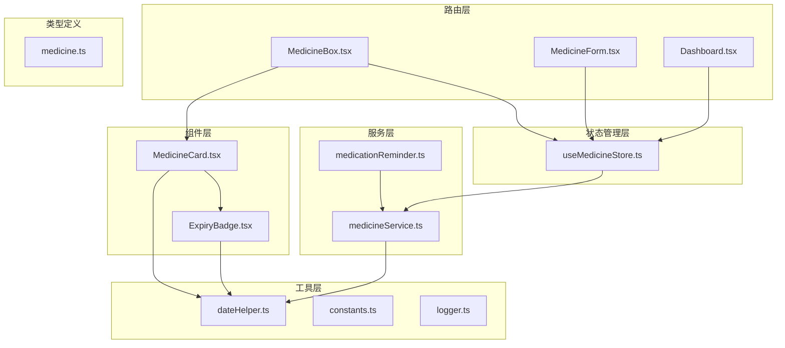
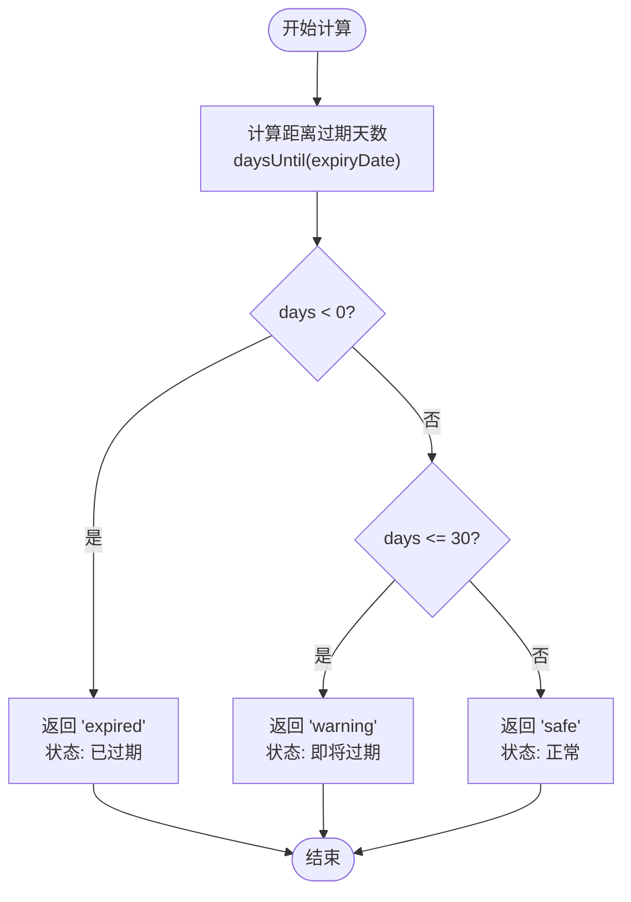
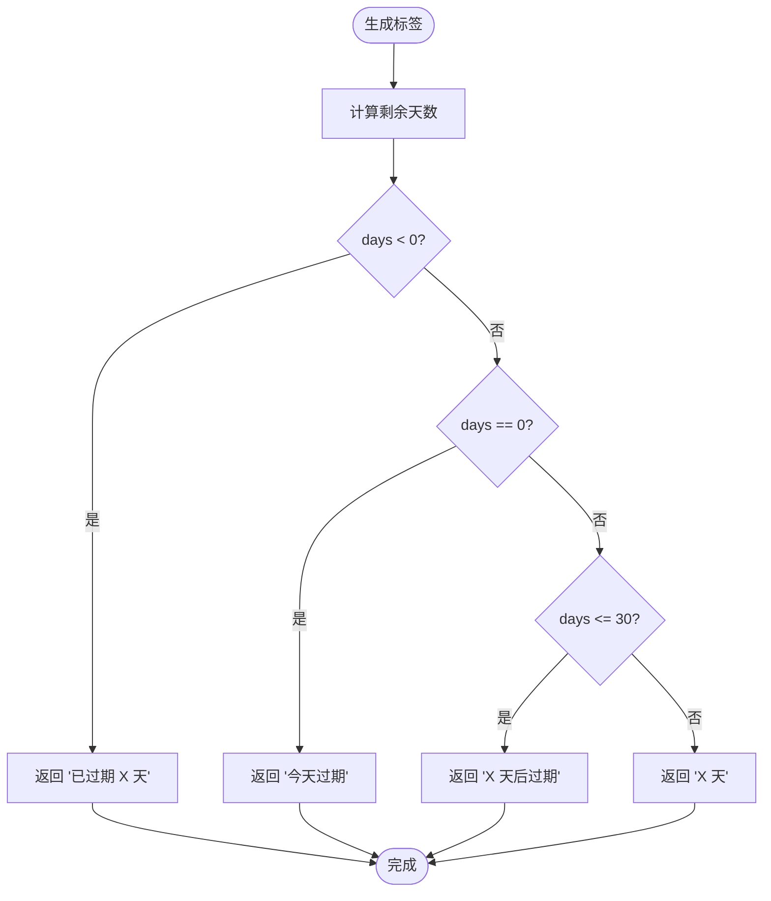
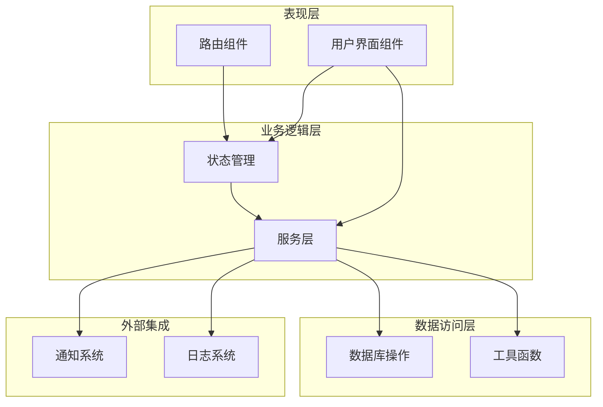
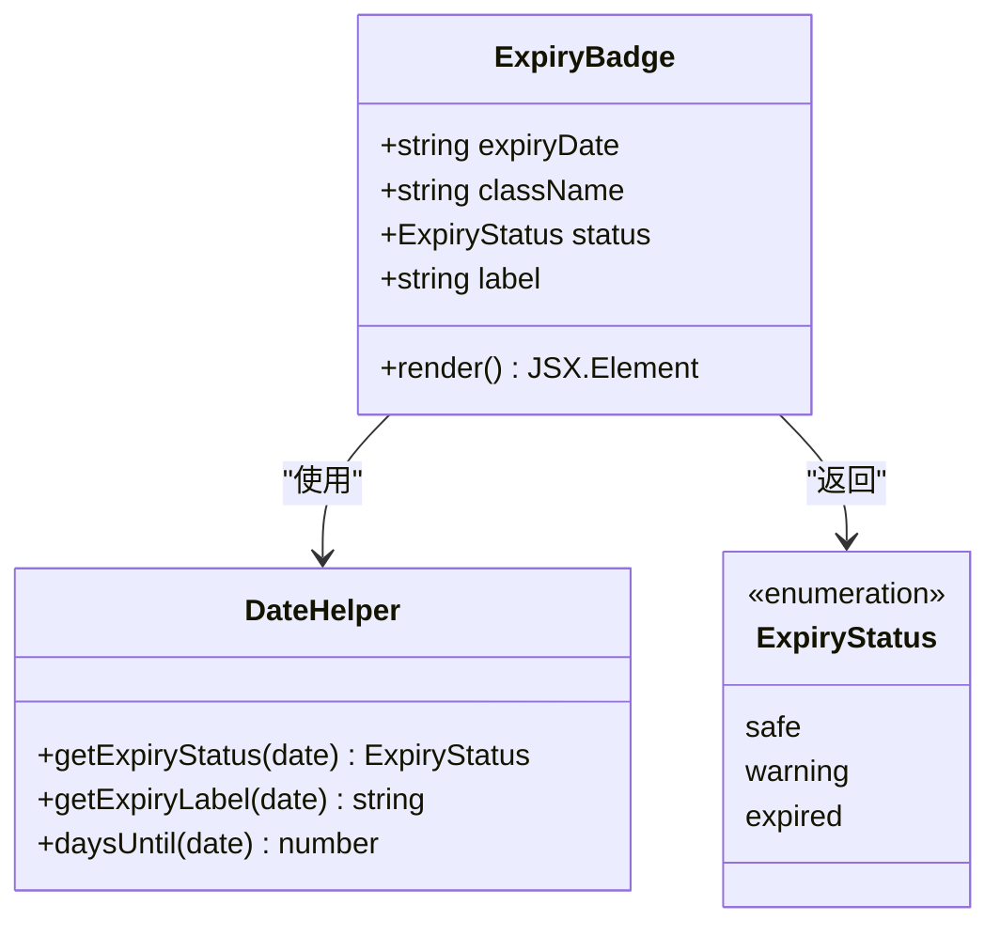
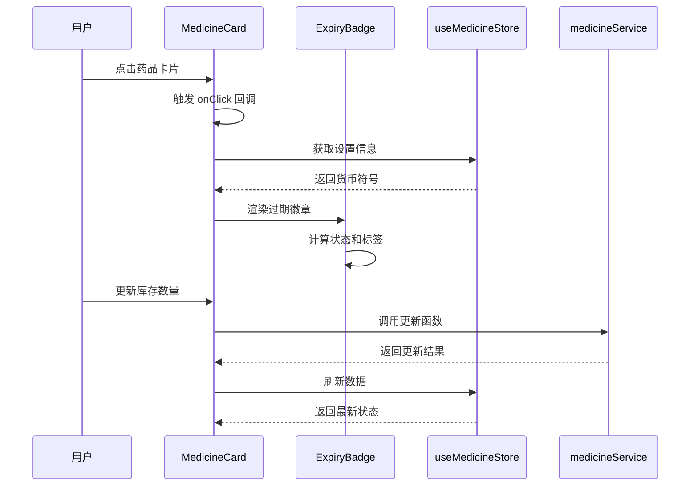
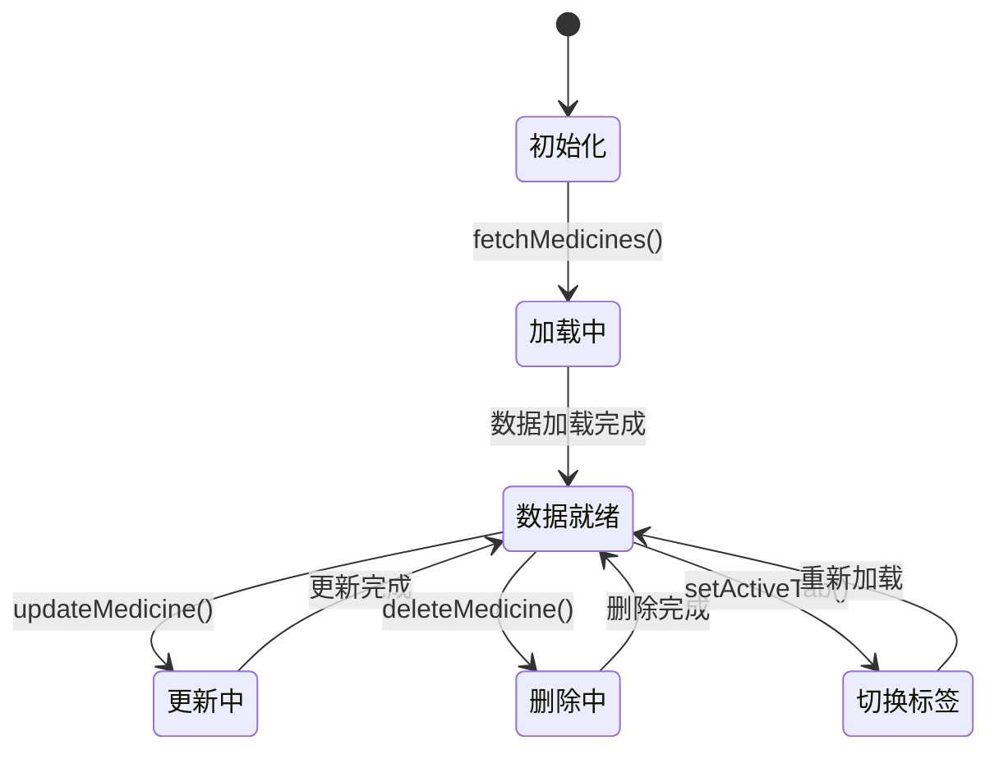
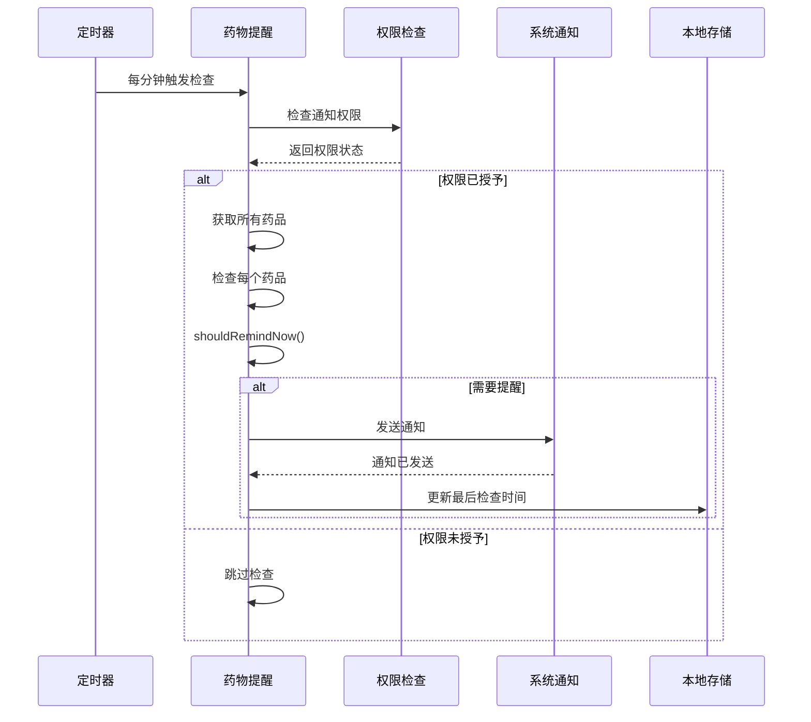
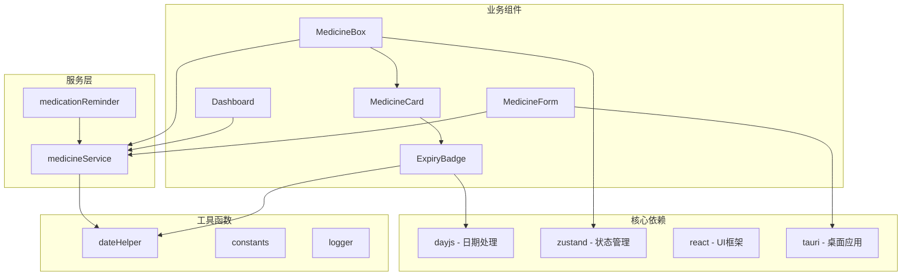

# 过期预警系统

<cite>
**本文档引用的文件**
- [ExpiryBadge.tsx](file://src/components/medicine/ExpiryBadge.tsx)
- [MedicineCard.tsx](file://src/components/medicine/MedicineCard.tsx)
- [dateHelper.ts](file://src/utils/dateHelper.ts)
- [medicine.ts](file://src/types/medicine.ts)
- [medicineService.ts](file://src/services/medicineService.ts)
- [useMedicineStore.ts](file://src/stores/useMedicineStore.ts)
- [MedicineBox.tsx](file://src/routes/MedicineBox.tsx)
- [constants.ts](file://src/utils/constants.ts)
- [medicationReminder.ts](file://src/services/medicationReminder.ts)
- [MedicineForm.tsx](file://src/routes/MedicineForm.tsx)
- [logger.ts](file://src/utils/logger.ts)
- [Dashboard.tsx](file://src/routes/Dashboard.tsx)
</cite>

## 目录
1. [简介](#简介)
2. [项目结构](#项目结构)
3. [核心组件](#核心组件)
4. [架构概览](#架构概览)
5. [详细组件分析](#详细组件分析)
6. [依赖关系分析](#依赖关系分析)
7. [性能考虑](#性能考虑)
8. [故障排除指南](#故障排除指南)
9. [结论](#结论)
10. [附录](#附录)

## 简介

过期预警系统是一个基于React + Tauri技术栈开发的家庭资产管理应用，专注于药品有效期管理和过期预警功能。系统通过智能的到期日期计算、预警阈值设置和状态判断逻辑，为用户提供全面的药品过期监控解决方案。

该系统的核心功能包括：
- **到期日期计算**：基于当前日期与药品有效期的差值计算
- **预警阈值设置**：30天预警窗口的智能判断
- **状态分类体系**：正常、警告、过期三种状态的精确划分
- **多维度通知机制**：系统横幅提示、状态徽章显示、颜色编码系统
- **完整的UI组件**：从仪表板到详细页面的全链路用户体验

## 项目结构

过期预警系统采用模块化的前端架构，主要分为以下几个层次：



**图表来源**
- [MedicineBox.tsx:1-112](file://src/routes/MedicineBox.tsx#L1-112)
- [MedicineForm.tsx:1-401](file://src/routes/MedicineForm.tsx#L1-401)
- [Dashboard.tsx:1-235](file://src/routes/Dashboard.tsx#L1-235)

**章节来源**
- [MedicineBox.tsx:1-112](file://src/routes/MedicineBox.tsx#L1-112)
- [MedicineForm.tsx:1-401](file://src/routes/MedicineForm.tsx#L1-401)
- [Dashboard.tsx:1-235](file://src/routes/Dashboard.tsx#L1-235)

## 核心组件

### 过期状态管理核心算法

系统的核心算法基于`dateHelper.ts`中的`getExpiryStatus`函数，实现了精确的过期状态判断：



**图表来源**
- [dateHelper.ts:30-43](file://src/utils/dateHelper.ts#L30-L43)

### 预警标签生成逻辑

标签生成系统根据剩余天数提供人性化的文本描述：



**图表来源**
- [dateHelper.ts:37-42](file://src/utils/dateHelper.ts#L37-L42)

**章节来源**
- [dateHelper.ts:1-52](file://src/utils/dateHelper.ts#L1-L52)
- [medicine.ts:1-70](file://src/types/medicine.ts#L1-L70)

## 架构概览

系统采用分层架构设计，确保各组件职责清晰、耦合度低：



**图表来源**
- [useMedicineStore.ts:1-42](file://src/stores/useMedicineStore.ts#L1-42)
- [medicineService.ts:1-194](file://src/services/medicineService.ts#L1-194)
- [medicationReminder.ts:1-132](file://src/services/medicationReminder.ts#L1-132)

## 详细组件分析

### ExpiryBadge 组件

ExpiryBadge 是过期状态的可视化展示组件，负责将抽象的状态转换为直观的视觉元素：



**图表来源**
- [ExpiryBadge.tsx:1-24](file://src/components/medicine/ExpiryBadge.tsx#L1-L24)
- [dateHelper.ts:30-43](file://src/utils/dateHelper.ts#L30-L43)

组件特性：
- **颜色编码系统**：绿色表示正常，黄色表示警告，红色表示过期
- **动态标签生成**：根据剩余天数自动生成人性化描述
- **可扩展样式**：支持自定义CSS类名覆盖默认样式

**章节来源**
- [ExpiryBadge.tsx:1-24](file://src/components/medicine/ExpiryBadge.tsx#L1-L24)

### MedicineCard 组件

MedicineCard 提供了药品卡片的完整UI展示，集成了过期状态显示和其他相关信息：



**图表来源**
- [MedicineCard.tsx:14-147](file://src/components/medicine/MedicineCard.tsx#L14-L147)
- [MedicineBox.tsx:31-36](file://src/routes/MedicineBox.tsx#L31-L36)

**章节来源**
- [MedicineCard.tsx:1-147](file://src/components/medicine/MedicineCard.tsx#L1-L147)

### 药品服务层

medicineService.ts 提供了完整的药品数据管理功能：

```mermaid
classDiagram
class MedicineService {
+getAllMedicines(filter) Promise~MedicineWithItem[]~
+getMedicineByItemId(id) Promise~MedicineWithItem|null~
+createMedicine(data) Promise~{itemId, medicineId}~
+updateMedicine(itemId, data) Promise~void~
+getExpiringMedicines(withinDays) Promise~MedicineWithItem[]~
+getTakingMedicines() Promise~MedicineWithItem[]~
}
class Database {
+select(sql, params) Promise~any[]~
+execute(sql, params) Promise~void~
}
class DateHelper {
+getNow() string
+daysUntil(date) number
}
MedicineService --> Database : "使用"
MedicineService --> DateHelper : "使用"
```

**图表来源**
- [medicineService.ts:10-194](file://src/services/medicineService.ts#L10-L194)
- [dateHelper.ts:14-16](file://src/utils/dateHelper.ts#L14-L16)

**章节来源**
- [medicineService.ts:1-194](file://src/services/medicineService.ts#L1-L194)

### 状态管理

useMedicineStore.ts 实现了Zustand状态管理，提供响应式的数据流：



**图表来源**
- [useMedicineStore.ts:15-41](file://src/stores/useMedicineStore.ts#L15-L41)

**章节来源**
- [useMedicineStore.ts:1-42](file://src/stores/useMedicineStore.ts#L1-L42)

### 用药提醒系统

medicationReminder.ts 实现了跨平台的通知功能：



**图表来源**
- [medicationReminder.ts:53-97](file://src/services/medicationReminder.ts#L53-L97)

**章节来源**
- [medicationReminder.ts:1-132](file://src/services/medicationReminder.ts#L1-L132)

## 依赖关系分析

系统的关键依赖关系如下：



**图表来源**
- [dateHelper.ts](file://src/utils/dateHelper.ts#L1)
- [ExpiryBadge.tsx](file://src/components/medicine/ExpiryBadge.tsx#L1)
- [MedicineBox.tsx](file://src/routes/MedicineBox.tsx#L1)

**章节来源**
- [dateHelper.ts:1-52](file://src/utils/dateHelper.ts#L1-L52)
- [MedicineBox.tsx:1-112](file://src/routes/MedicineBox.tsx#L1-L112)

## 性能考虑

### 时间复杂度优化

1. **日期计算优化**：使用dayjs库进行高效的日期运算，避免重复计算
2. **状态缓存**：Zustand状态管理减少不必要的组件重渲染
3. **查询优化**：数据库查询使用索引字段和适当的WHERE条件

### 内存管理

1. **日志限制**：内存日志最多保留500条记录，防止内存泄漏
2. **组件卸载**：及时清理定时器和事件监听器
3. **数据分页**：大数据量时考虑分页加载策略

### 网络优化

1. **批量操作**：合并多个数据库操作减少网络往返
2. **缓存策略**：合理使用localStorage缓存常用数据
3. **防抖处理**：输入框变更使用防抖减少频繁更新

## 故障排除指南

### 常见问题及解决方案

#### 1. 过期状态显示异常

**症状**：过期徽章颜色或标签显示不正确

**排查步骤**：
1. 检查日期格式是否符合ISO 8601标准
2. 验证`getExpiryStatus`函数的计算逻辑
3. 确认`daysUntil`函数返回正确的天数差值

**解决方案**：
- 使用`formatDate`函数标准化日期格式
- 在调试模式下输出中间计算结果
- 检查时区设置对日期计算的影响

#### 2. 通知功能失效

**症状**：用药提醒无法正常发送

**排查步骤**：
1. 检查系统通知权限状态
2. 验证`checkAndNotify`函数的执行流程
3. 确认本地存储的最后检查时间

**解决方案**：
- 引导用户手动授予通知权限
- 检查应用后台运行权限
- 实现通知权限的自动检测和提示

#### 3. 数据同步问题

**症状**：UI显示与数据库状态不一致

**排查步骤**：
1. 检查Zustand状态更新是否正确触发
2. 验证数据库事务的完整性
3. 确认异步操作的错误处理

**解决方案**：
- 实现乐观更新和回滚机制
- 添加数据一致性校验
- 增加错误边界和重试逻辑

**章节来源**
- [logger.ts:1-84](file://src/utils/logger.ts#L1-L84)
- [medicationReminder.ts:53-97](file://src/services/medicationReminder.ts#L53-L97)

## 结论

过期预警系统通过精心设计的架构和算法，为用户提供了可靠的药品有效期管理解决方案。系统的主要优势包括：

1. **精确的状态判断**：基于30天阈值的智能预警机制
2. **直观的视觉反馈**：颜色编码和人性化标签提升用户体验
3. **完整的功能覆盖**：从数据录入到提醒通知的全流程管理
4. **良好的扩展性**：模块化的架构便于功能扩展和维护

未来可以考虑的功能增强：
- 自定义预警阈值设置
- 批量操作和导入导出功能
- 更丰富的统计分析报告
- 移动端推送通知支持

## 附录

### 最佳实践指南

#### 预警配置最佳实践

1. **阈值设置建议**：
   - 常用药品：7-14天预警
   - 特殊药品：3-7天预警
   - 昂贵药品：2-3天预警

2. **通知策略**：
   - 避免在同一分钟内重复提醒
   - 提供"稍后提醒"选项
   - 支持震动和声音组合

#### 用户界面设计指南

1. **颜色编码规范**：
   - 绿色：安全状态（>30天）
   - 黄色：警告状态（0-30天）
   - 红色：过期状态（<0天）

2. **布局设计原则**：
   - 重要信息优先显示
   - 手机端适配优化
   - 无障碍访问支持

3. **交互设计要点**：
   - 直观的状态指示
   - 快速的操作入口
   - 清晰的反馈信息

#### 开发规范

1. **代码组织**：
   - 按功能模块划分文件
   - 统一的命名约定
   - 完善的类型定义

2. **错误处理**：
   - 全面的异常捕获
   - 友好的错误提示
   - 日志记录机制

3. **测试策略**：
   - 单元测试覆盖核心算法
   - 集成测试验证流程
   - 用户验收测试