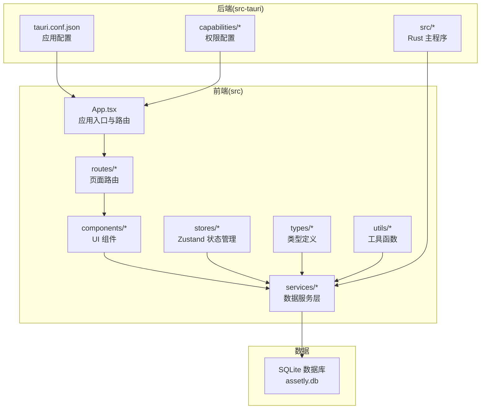
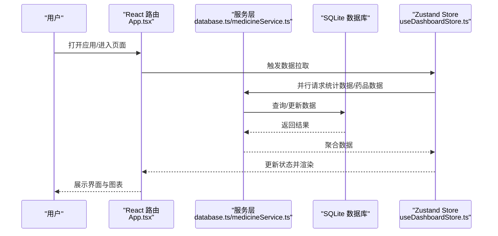
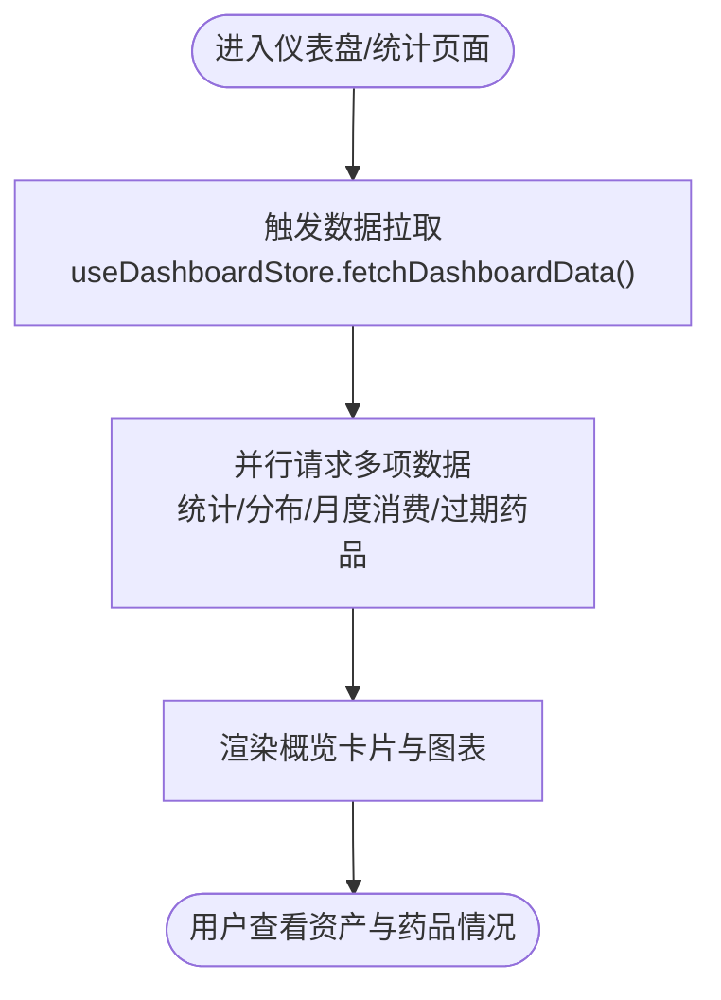
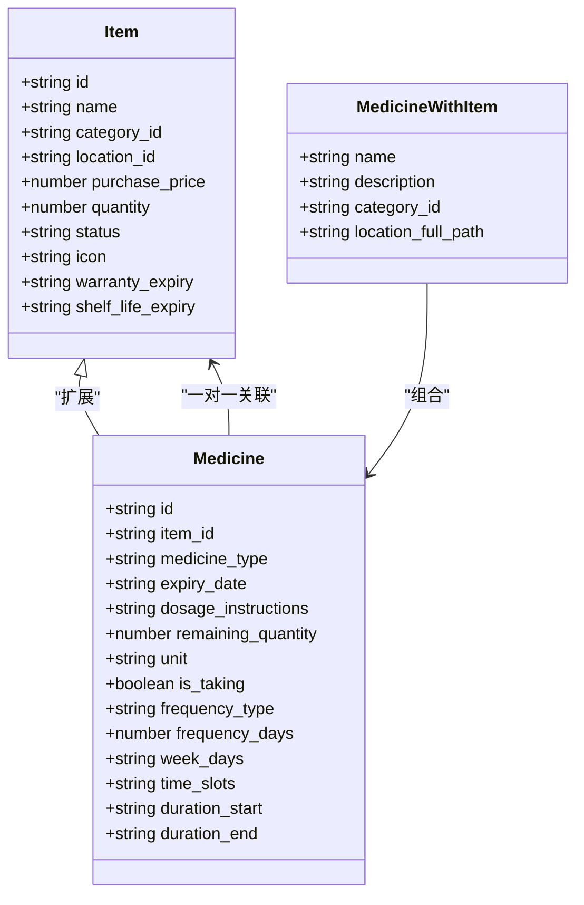
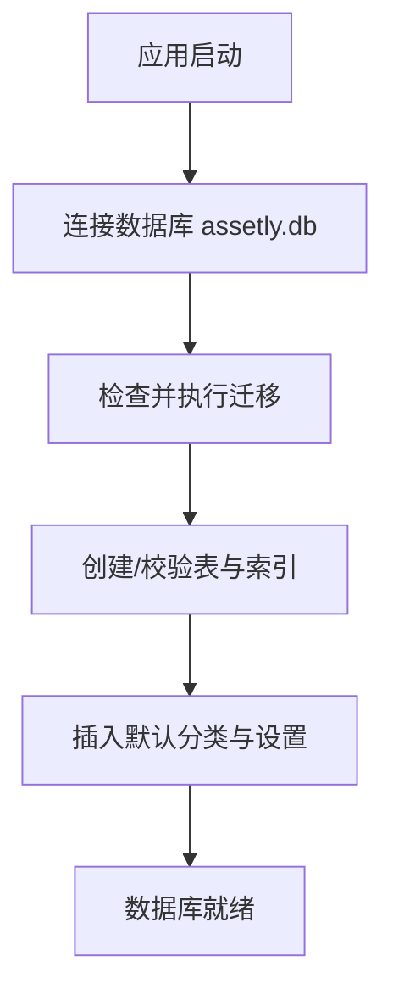
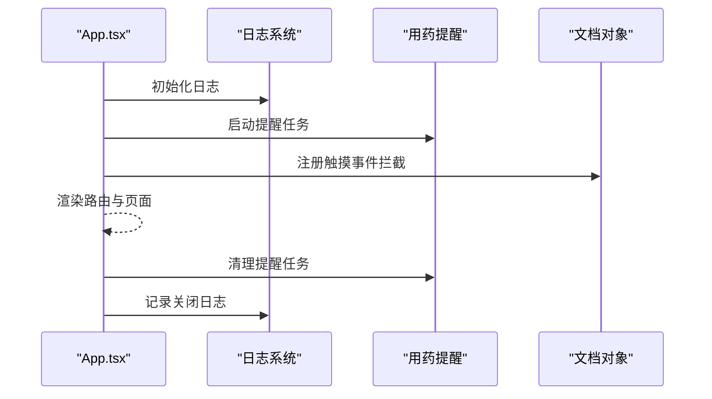
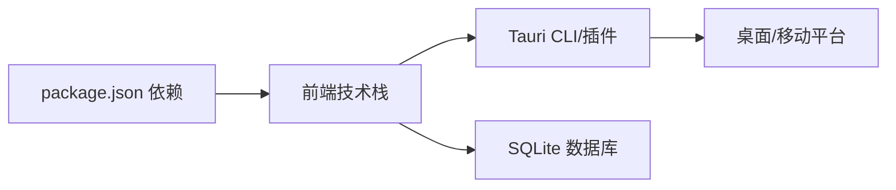

# 项目介绍

<cite>
**本文引用的文件**
- [README.md](file://README.md)
- [package.json](file://package.json)
- [src/App.tsx](file://src/App.tsx)
- [src/main.tsx](file://src/main.tsx)
- [src-tauri/tauri.conf.json](file://src-tauri/tauri.conf.json)
- [src/services/database.ts](file://src/services/database.ts)
- [src/routes/Dashboard.tsx](file://src/routes/Dashboard.tsx)
- [src/types/item.ts](file://src/types/item.ts)
- [src/types/medicine.ts](file://src/types/medicine.ts)
- [src/stores/useDashboardStore.ts](file://src/stores/useDashboardStore.ts)
- [src/utils/constants.ts](file://src/utils/constants.ts)
- [src/services/medicineService.ts](file://src/services/medicineService.ts)
- [src/components/medicine/MedicineCard.tsx](file://src/components/medicine/MedicineCard.tsx)
- [src/routes/Statistics.tsx](file://src/routes/Statistics.tsx)
</cite>

## 目录
1. [简介](#简介)
2. [项目结构](#项目结构)
3. [核心组件](#核心组件)
4. [架构总览](#架构总览)
5. [详细组件分析](#详细组件分析)
6. [依赖关系分析](#依赖关系分析)
7. [性能考虑](#性能考虑)
8. [故障排除指南](#故障排除指南)
9. [结论](#结论)
10. [附录](#附录)

## 简介
Assetly 是一款跨平台的家庭物品管理应用，旨在帮助用户高效记录、分类、追踪家中各类资产，并对药品库存进行智能管理与提醒。其核心价值主张在于：
- 完全本地存储：所有数据保存在本地 SQLite 数据库，无需联网，保障隐私与离线可用性。
- 多平台支持：同时覆盖桌面端（macOS/Windows/Linux）与移动端（Android），并支持构建 iOS 版本。
- 智能统计分析：提供资产分布、消费趋势、过期预警等可视化报表，辅助家庭资产管理决策。
- 药品专项管理：内置药品类型、过期预警、用药提醒、库存管理等能力，提升居家健康管理水平。

应用场景举例：
- 家庭资产盘点：记录家电、家具、电子设备等物品的购买时间、价格、状态，自动计算日均成本。
- 药品库存与用药管理：记录药品类型、剩余数量、用法用量、有效期，设置定时提醒，避免漏服或过期。
- 资产统计与预算：通过图表直观查看各类别资产占比与近半年消费趋势，辅助预算规划。

**章节来源**
- [README.md:1-267](file://README.md#L1-L267)

## 项目结构
项目采用前后端分离的跨平台架构，前端基于 React + TypeScript + Vite，后端通过 Tauri 框架桥接到 Rust，数据持久化使用 SQLite。核心目录与职责如下：
- src：前端源码，包含组件、页面路由、服务层、状态管理、类型定义与工具函数。
- src-tauri：Tauri/Rust 后端，负责应用窗口、系统集成、权限配置与原生能力调用。
- public：静态资源与入口 HTML。
- 构建与运行：Vite 提供开发与构建，Tauri CLI 管理跨平台打包。

**图表来源**
- [src/App.tsx:1-92](file://src/App.tsx#L1-L92)
- [src/main.tsx:1-11](file://src/main.tsx#L1-L11)
- [src-tauri/tauri.conf.json:1-40](file://src-tauri/tauri.conf.json#L1-L40)

**章节来源**
- [README.md:157-181](file://README.md#L157-L181)
- [package.json:1-43](file://package.json#L1-L43)

## 核心组件
- 应用入口与路由：负责初始化日志、启动用药提醒、配置全局触摸拦截策略，并挂载 React Router 的页面路由。
- 数据服务层：封装数据库连接、迁移、查询与更新逻辑，统一暴露 CRUD 能力。
- 状态管理：使用 Zustand 按领域拆分 Store，如仪表盘 Store，集中管理统计数据与加载状态。
- 统计与图表：提供资产分布饼图与消费趋势面积图，支持货币符号与时间格式化。
- 药品管理：独立的药品实体与表结构，支持类型、过期预警、用药提醒、库存变动等。

**章节来源**
- [src/App.tsx:18-92](file://src/App.tsx#L18-L92)
- [src/services/database.ts:1-171](file://src/services/database.ts#L1-L171)
- [src/stores/useDashboardStore.ts:1-34](file://src/stores/useDashboardStore.ts#L1-L34)
- [src/routes/Statistics.tsx:1-85](file://src/routes/Statistics.tsx#L1-L85)
- [src/services/medicineService.ts:1-194](file://src/services/medicineService.ts#L1-L194)

## 架构总览
下图展示了从用户交互到数据持久化的整体流程，以及跨平台运行时的关键节点。

**图表来源**
- [src/App.tsx:18-92](file://src/App.tsx#L18-L92)
- [src/services/database.ts:1-171](file://src/services/database.ts#L1-L171)
- [src/services/medicineService.ts:1-194](file://src/services/medicineService.ts#L1-L194)
- [src/stores/useDashboardStore.ts:16-34](file://src/stores/useDashboardStore.ts#L16-L34)

## 详细组件分析

### 仪表盘与统计
- 仪表盘聚合首页概览卡片、药品预警、正在服用药品、资产分布等信息，支持快速跳转到详情页。
- 统计页面提供资产分布饼图与近六个月消费趋势面积图，支持货币符号显示。

**图表来源**
- [src/routes/Dashboard.tsx:13-235](file://src/routes/Dashboard.tsx#L13-L235)
- [src/routes/Statistics.tsx:9-85](file://src/routes/Statistics.tsx#L9-L85)
- [src/stores/useDashboardStore.ts:23-32](file://src/stores/useDashboardStore.ts#L23-L32)

**章节来源**
- [src/routes/Dashboard.tsx:13-235](file://src/routes/Dashboard.tsx#L13-L235)
- [src/routes/Statistics.tsx:9-85](file://src/routes/Statistics.tsx#L9-L85)
- [src/stores/useDashboardStore.ts:16-34](file://src/stores/useDashboardStore.ts#L16-L34)

### 药品管理与提醒
- 药品实体扩展自物品，增加类型、有效期、用法用量、剩余数量、是否正在服用、服药频率、时间槽、持续期间等字段。
- 支持过期预警（默认30天内）、正在服用药品列表、库存增减快捷操作。
- 用药提醒：支持每日、每隔N天、每周指定日期等模式，可设置多个时间段与起止日期。

**图表来源**
- [src/types/item.ts:5-46](file://src/types/item.ts#L5-L46)
- [src/types/medicine.ts:7-70](file://src/types/medicine.ts#L7-L70)

**章节来源**
- [src/types/medicine.ts:1-70](file://src/types/medicine.ts#L1-L70)
- [src/services/medicineService.ts:164-194](file://src/services/medicineService.ts#L164-L194)
- [src/components/medicine/MedicineCard.tsx:14-147](file://src/components/medicine/MedicineCard.tsx#L14-L147)

### 数据库与迁移
- 使用 Tauri SQL 插件连接本地 SQLite 数据库，首次启动自动建立表结构与索引。
- 通过迁移机制维护数据库版本演进，包含默认分类、设置项与扩展字段（如药品提醒相关字段）。

**图表来源**
- [src/services/database.ts:8-53](file://src/services/database.ts#L8-L53)
- [src/services/database.ts:60-171](file://src/services/database.ts#L60-L171)

**章节来源**
- [src/services/database.ts:1-171](file://src/services/database.ts#L1-L171)
- [src/utils/constants.ts:4-13](file://src/utils/constants.ts#L4-L13)

### 应用入口与生命周期
- 初始化日志系统与用药提醒；在移动端完全禁用横向滑动手势以避免与 WebView 导航冲突；应用退出时清理资源。

**图表来源**
- [src/App.tsx:19-68](file://src/App.tsx#L19-L68)

**章节来源**
- [src/App.tsx:18-92](file://src/App.tsx#L18-L92)
- [src/main.tsx:1-11](file://src/main.tsx#L1-L11)

## 依赖关系分析
- 前端依赖：React、React Router、Zustand、Recharts、Lucide React、Day.js、Tailwind CSS 等。
- Tauri 插件：SQL、日志、通知、文件系统、打开器等，用于数据库访问、日志输出、系统通知与文件操作。
- 平台配置：通过 tauri.conf.json 设置窗口尺寸、最小尺寸、产品名称、图标与构建前命令。

**图表来源**
- [package.json:12-31](file://package.json#L12-L31)
- [src-tauri/tauri.conf.json:6-11](file://src-tauri/tauri.conf.json#L6-L11)

**章节来源**
- [package.json:1-43](file://package.json#L1-L43)
- [src-tauri/tauri.conf.json:1-40](file://src-tauri/tauri.conf.json#L1-L40)

## 性能考虑
- 响应式布局：针对桌面端侧边栏与移动端底部胶囊导航进行适配，保证不同屏幕尺寸下的良好体验。
- 移动端优化：全面屏手势禁用、安全区域适配、滚动防抖动、文件分享使用系统面板。
- 数据查询优化：数据库建立必要索引（如分类、位置、状态、过期日期等），减少查询成本。
- 并行加载：仪表盘使用并行请求聚合数据，缩短首屏等待时间。

**章节来源**
- [README.md:222-232](file://README.md#L222-L232)
- [src/services/database.ts:124-131](file://src/services/database.ts#L124-L131)
- [src/stores/useDashboardStore.ts:25-31](file://src/stores/useDashboardStore.ts#L25-L31)

## 故障排除指南
- 数据库连接失败：检查数据库文件是否存在、权限是否正确、迁移是否成功执行。
- 用药提醒无效：确认应用未被系统省电策略限制、通知权限已授予、提醒设置（频率/时间/周期）合理。
- 移动端滑动冲突：若出现页面误滑动，确认已启用触摸拦截策略（已在入口处实现）。
- 日志排查：通过“运行日志”页面查看实时日志，按级别筛选，定位异常。

**章节来源**
- [src/services/database.ts:18-53](file://src/services/database.ts#L18-L53)
- [src/App.tsx:29-68](file://src/App.tsx#L29-L68)
- [README.md:74-83](file://README.md#L74-L83)

## 结论
Assetly 以“本地化、隐私优先、跨平台一致体验”为核心理念，围绕家庭物品与药品两大高频场景，提供从记录、追踪到统计分析的完整闭环。通过 SQLite 本地存储与 Tauri 跨平台能力，既满足了数据安全与离线可用的需求，又提供了现代化的 UI 与实用的功能。对于希望掌控家庭资产、规范药品管理与获得智能统计洞察的用户而言，Assetly 是一个可靠且易上手的选择。

## 附录
- 平台支持：macOS、Windows、Linux、Android（iOS 待测试）。
- 隐私说明：本地存储、离线运行、导出文件通过系统分享或本地保存，不上传任何数据。
- 技术要点：响应式设计、自定义组件、按领域拆分的状态管理、移动端手势与安全区域适配。

**章节来源**
- [README.md:235-261](file://README.md#L235-L261)