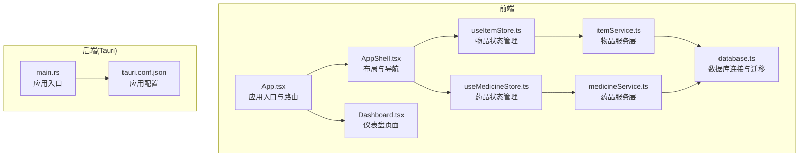
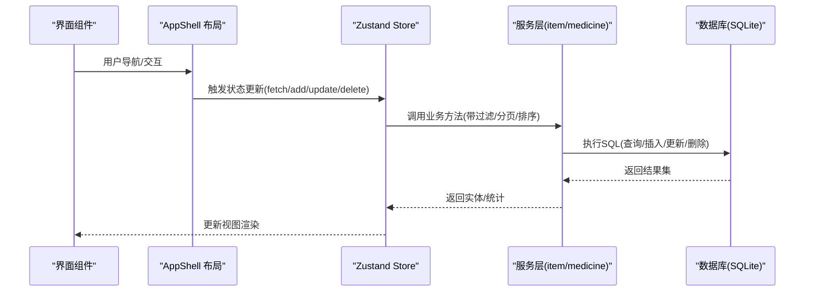
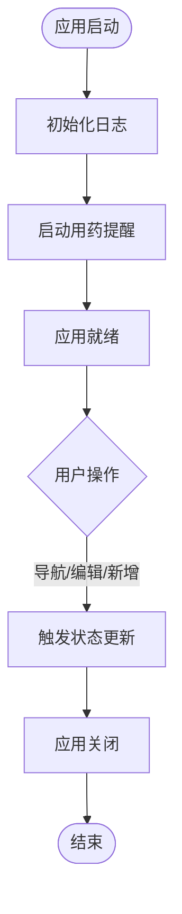
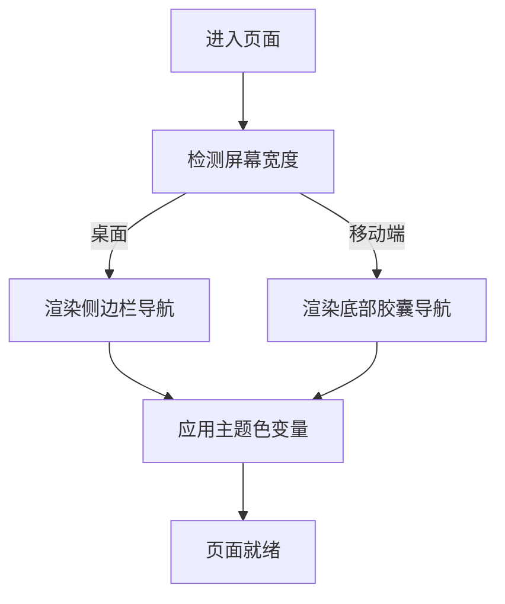
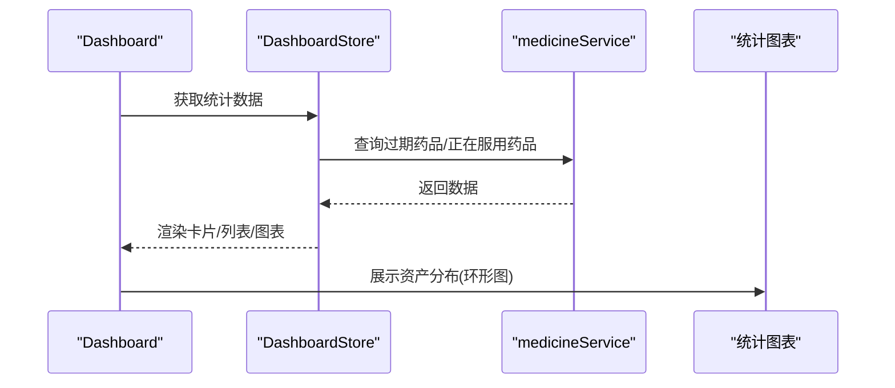
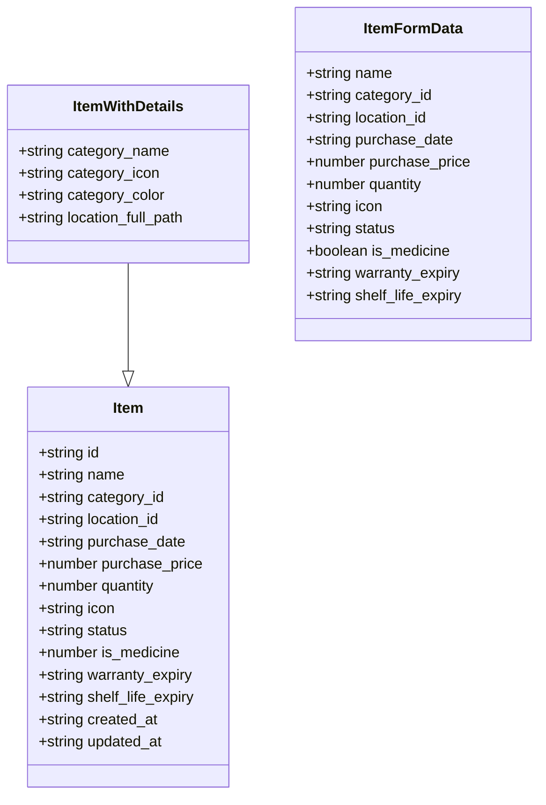
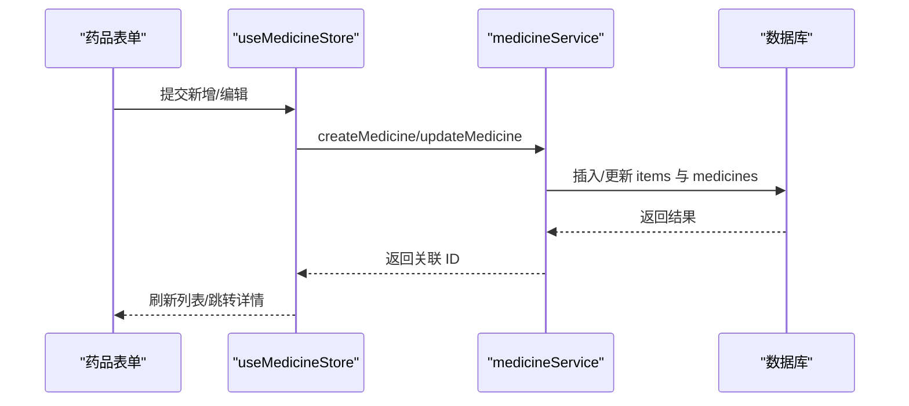
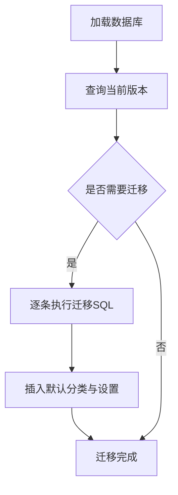
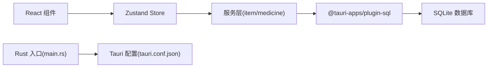

# 项目概述

<cite>
**本文引用的文件**
- [README.md](file://README.md)
- [package.json](file://package.json)
- [src-tauri/tauri.conf.json](file://src-tauri/tauri.conf.json)
- [src/App.tsx](file://src/App.tsx)
- [src/main.tsx](file://src/main.tsx)
- [src/components/layout/AppShell.tsx](file://src/components/layout/AppShell.tsx)
- [src/routes/Dashboard.tsx](file://src/routes/Dashboard.tsx)
- [src/services/database.ts](file://src/services/database.ts)
- [src/services/itemService.ts](file://src/services/itemService.ts)
- [src/services/medicineService.ts](file://src/services/medicineService.ts)
- [src/stores/useItemStore.ts](file://src/stores/useItemStore.ts)
- [src/stores/useMedicineStore.ts](file://src/stores/useMedicineStore.ts)
- [src/types/item.ts](file://src/types/item.ts)
- [src/utils/constants.ts](file://src/utils/constants.ts)
- [src-tauri/src/main.rs](file://src-tauri/src/main.rs)
</cite>

## 目录
1. [简介](#简介)
2. [项目结构](#项目结构)
3. [核心组件](#核心组件)
4. [架构总览](#架构总览)
5. [详细组件分析](#详细组件分析)
6. [依赖关系分析](#依赖关系分析)
7. [性能考量](#性能考量)
8. [故障排除指南](#故障排除指南)
9. [结论](#结论)
10. [附录](#附录)

## 简介
Assetly 是一款跨平台的家庭物品管理应用，专注于帮助用户记录、分类、追踪家中的各类资产。其核心价值主张在于"本地化、隐私优先、功能完备"，通过 Tauri + React + TypeScript 的现代技术栈，在桌面与移动端提供一致的使用体验。应用覆盖物品管理、药品管理、分类管理、位置管理、数据统计等核心模块，并内置数据导出、通知提醒、运行日志等实用能力。

- 本地存储与隐私保护：所有数据保存在本地 SQLite 数据库，不联网、不上传，确保用户数据安全。
- 跨平台部署：支持 macOS、Windows、Linux 桌面端，以及 Android 移动端；iOS 正在测试中。
- 丰富的业务场景：物品与药品双轨管理、树形位置管理、过期预警与用药提醒、资产分布与消费趋势统计。

**更新** 应用现已包含增强的视觉展示，通过8个应用界面截图（主页、商品管理、药品追踪、统计仪表板、设置、日志和提示界面）提供更直观的用户体验展示。

章节来源
- [README.md:1-283](file://README.md#L1-L283)

## 项目结构
前端采用 React + TypeScript + Vite 构建，状态管理使用 Zustand，UI 使用 Tailwind CSS；后端通过 Tauri 暴露 Rust 能力，数据库使用 SQLite（Tauri SQL 插件）。整体采用"前端路由 + 服务层封装 + 本地数据库"的分层架构。

图表来源
- [src/App.tsx:1-92](file://src/App.tsx#L1-L92)
- [src/components/layout/AppShell.tsx:1-160](file://src/components/layout/AppShell.tsx#L1-L160)
- [src/routes/Dashboard.tsx:1-235](file://src/routes/Dashboard.tsx#L1-L235)
- [src/stores/useItemStore.ts:1-53](file://src/stores/useItemStore.ts#L1-L53)
- [src/stores/useMedicineStore.ts:1-42](file://src/stores/useMedicineStore.ts#L1-L42)
- [src/services/itemService.ts:1-127](file://src/services/itemService.ts#L1-L127)
- [src/services/medicineService.ts:1-194](file://src/services/medicineService.ts#L1-L194)
- [src/services/database.ts:1-171](file://src/services/database.ts#L1-L171)
- [src-tauri/src/main.rs:1-7](file://src-tauri/src/main.rs#L1-L7)
- [src-tauri/tauri.conf.json:1-40](file://src-tauri/tauri.conf.json#L1-L40)

章节来源
- [README.md:173-196](file://README.md#L173-L196)
- [package.json:1-43](file://package.json#L1-L43)
- [src-tauri/tauri.conf.json:1-40](file://src-tauri/tauri.conf.json#L1-L40)

## 核心组件
- 应用入口与路由：负责初始化日志、启动用药提醒、全局路由与移动端手势拦截。
- 布局与导航：桌面端侧边栏、移动端底部胶囊导航，统一管理页面切换与设置加载。
- 仪表盘：聚合资产概览、药品预警、正在服用、资产分布等关键指标。
- 状态管理：按领域拆分的 Zustand Store，分别驱动物品与药品的数据流。
- 服务层：封装数据库操作，提供 CRUD 与复杂查询（如过期药品、正在服用药品）。
- 数据库：SQLite + Tauri SQL 插件，支持迁移、索引与默认数据初始化。

章节来源
- [src/App.tsx:1-92](file://src/App.tsx#L1-L92)
- [src/components/layout/AppShell.tsx:1-160](file://src/components/layout/AppShell.tsx#L1-L160)
- [src/routes/Dashboard.tsx:1-235](file://src/routes/Dashboard.tsx#L1-L235)
- [src/stores/useItemStore.ts:1-53](file://src/stores/useItemStore.ts#L1-L53)
- [src/stores/useMedicineStore.ts:1-42](file://src/stores/useMedicineStore.ts#L1-L42)
- [src/services/itemService.ts:1-127](file://src/services/itemService.ts#L1-L127)
- [src/services/medicineService.ts:1-194](file://src/services/medicineService.ts#L1-L194)
- [src/services/database.ts:1-171](file://src/services/database.ts#L1-L171)

## 架构总览
下图展示了从界面到数据库的调用链路，体现"前端路由 -> 状态管理 -> 服务层 -> 数据库"的清晰分层。

图表来源
- [src/components/layout/AppShell.tsx:1-160](file://src/components/layout/AppShell.tsx#L1-L160)
- [src/stores/useItemStore.ts:1-53](file://src/stores/useItemStore.ts#L1-L53)
- [src/stores/useMedicineStore.ts:1-42](file://src/stores/useMedicineStore.ts#L1-L42)
- [src/services/itemService.ts:1-127](file://src/services/itemService.ts#L1-L127)
- [src/services/medicineService.ts:1-194](file://src/services/medicineService.ts#L1-L194)
- [src/services/database.ts:1-171](file://src/services/database.ts#L1-L171)

## 详细组件分析

### 应用入口与生命周期
- 初始化日志系统与应用启动/关闭事件记录。
- 启动用药提醒任务并在卸载时清理。
- 禁用 WebView 横向滑动返回，避免误触。

图表来源
- [src/App.tsx:19-27](file://src/App.tsx#L19-L27)
- [src/App.tsx:29-68](file://src/App.tsx#L29-L68)

章节来源
- [src/App.tsx:1-92](file://src/App.tsx#L1-L92)

### 布局与导航
- 桌面端：固定侧边栏，包含主菜单与管理子菜单。
- 移动端：底部胶囊导航，自动适配安全区域与手势。
- 主题色通过 CSS 变量注入，支持动态切换。
- 首次进入会初始化数据库与设置。

图表来源
- [src/components/layout/AppShell.tsx:24-61](file://src/components/layout/AppShell.tsx#L24-L61)
- [src/components/layout/AppShell.tsx:63-157](file://src/components/layout/AppShell.tsx#L63-L157)

章节来源
- [src/components/layout/AppShell.tsx:1-160](file://src/components/layout/AppShell.tsx#L1-L160)

### 仪表盘与统计
- 资产总览卡片：总资产、物品总数、药品数量、过期预警数。
- 药品预警：展示即将过期的药品列表。
- 正在服用：展示正在使用的药品及其服药频率/时间段。
- 资产分布：按类别展示环形图，支持跳转到统计页面。

图表来源
- [src/routes/Dashboard.tsx:13-217](file://src/routes/Dashboard.tsx#L13-L217)

章节来源
- [src/routes/Dashboard.tsx:1-235](file://src/routes/Dashboard.tsx#L1-L235)

### 物品管理模块
- 数据模型：Item/ItemWithDetails/ItemFormData，支持状态(active/archived/disposed)、图标、保质期、保修期等字段。
- 服务层：提供分页/过滤/搜索/排序的查询接口，支持按分类、位置、状态、关键词检索。
- 状态管理：useItemStore 提供增删改查与过滤器设置。

图表来源
- [src/types/item.ts:1-46](file://src/types/item.ts#L1-L46)

章节来源
- [src/types/item.ts:1-46](file://src/types/item.ts#L1-L46)
- [src/services/itemService.ts:1-127](file://src/services/itemService.ts#L1-L127)
- [src/stores/useItemStore.ts:1-53](file://src/stores/useItemStore.ts#L1-L53)

### 药品管理模块
- 数据模型：MedicineWithItem/medicineService 提供药品扩展信息（类型、有效期、用法、剩余数量、是否正在服用、服药计划等）。
- 服务层：支持按类型/关键词查询、创建/更新关联物品与药品记录、查询过期药品与正在服用药品。
- 状态管理：useMedicineStore 提供按类型筛选与增删改查。

图表来源
- [src/stores/useMedicineStore.ts:15-41](file://src/stores/useMedicineStore.ts#L15-L41)
- [src/services/medicineService.ts:54-95](file://src/services/medicineService.ts#L54-L95)
- [src/services/medicineService.ts:97-162](file://src/services/medicineService.ts#L97-L162)

章节来源
- [src/stores/useMedicineStore.ts:1-42](file://src/stores/useMedicineStore.ts#L1-L42)
- [src/services/medicineService.ts:1-194](file://src/services/medicineService.ts#L1-L194)
- [src/utils/constants.ts:15-27](file://src/utils/constants.ts#L15-L27)

### 数据库与迁移
- 连接与初始化：首次访问时建立 SQLite 连接并执行迁移。
- 迁移策略：版本化迁移，记录已应用版本，按顺序执行 SQL。
- 默认数据：种子默认分类与应用设置。
- 索引优化：对常用查询字段建立索引，提升筛选与搜索性能。

图表来源
- [src/services/database.ts:8-53](file://src/services/database.ts#L8-L53)
- [src/services/database.ts:60-170](file://src/services/database.ts#L60-L170)

章节来源
- [src/services/database.ts:1-171](file://src/services/database.ts#L1-L171)
- [src/utils/constants.ts:3-13](file://src/utils/constants.ts#L3-L13)

### 技术栈与平台支持
- 前端：React 19、TypeScript 5.8、Vite 7、Tailwind CSS 4、Zustand 5、Recharts 3、Lucide React 1、Day.js 1、React Router DOM 7。
- 后端：Tauri 2、Rust 2021 Edition、SQLite 2.4。
- 平台：macOS/Windows/Linux 桌面端，Android 移动端，iOS 测试中。

章节来源
- [README.md:102-121](file://README.md#L102-L121)
- [README.md:251-260](file://README.md#L251-L260)
- [package.json:12-31](file://package.json#L12-L31)
- [src-tauri/tauri.conf.json:1-40](file://src-tauri/tauri.conf.json#L1-L40)

## 依赖关系分析
- 前端依赖：@tauri-apps/* 插件提供文件系统、日志、通知、SQL 等能力；Zustand 用于轻量状态管理；Recharts 用于统计可视化。
- 后端依赖：Tauri 配置与 Rust 入口，负责打包与平台桥接。
- 数据流：组件通过 Store 调用 Service，Service 通过 @tauri-apps/plugin-sql 与 SQLite 交互。

图表来源
- [package.json:12-31](file://package.json#L12-L31)
- [src/services/itemService.ts:1-127](file://src/services/itemService.ts#L1-L127)
- [src/services/medicineService.ts:1-194](file://src/services/medicineService.ts#L1-L194)
- [src-tauri/src/main.rs:1-7](file://src-tauri/src/main.rs#L1-L7)
- [src-tauri/tauri.conf.json:1-40](file://src-tauri/tauri.conf.json#L1-L40)

章节来源
- [package.json:1-43](file://package.json#L1-L43)
- [src-tauri/tauri.conf.json:1-40](file://src-tauri/tauri.conf.json#L1-L40)

## 性能考量
- 前端性能
  - 轻量状态管理：Zustand 按域拆分 Store，减少无关重渲染。
  - 图表渲染：Recharts 按需渲染，仪表盘仅在必要时更新。
- 数据库性能
  - 索引优化：对 items/location/status/expiry/type 等常用字段建立索引。
  - 迁移幂等：版本化迁移避免重复执行。
- 移动端优化
  - 禁用横向滑动返回，避免与 WebView 导航冲突。
  - 安全面板与安全区域适配，触摸滚动优化。

章节来源
- [src/services/database.ts:124-131](file://src/services/database.ts#L124-L131)
- [src/App.tsx:29-68](file://src/App.tsx#L29-L68)

## 故障排除指南
- 应用无法启动或空白
  - 检查数据库连接与迁移是否成功。
  - 查看日志页面，按级别筛选定位问题。
- 药品提醒无效
  - 确认 Android 通知权限已授予。
  - 建议将应用加入电池优化白名单，保证前台运行。
- 数据导出/导入异常
  - 桌面端检查下载目录权限。
  - 移动端通过系统分享面板确认保存路径。

章节来源
- [README.md:249-251](file://README.md#L249-L251)

## 结论
Assetly 以"本地化、隐私优先、功能完备"为核心定位，结合 Tauri + React + TypeScript 的现代技术栈，实现了跨平台家庭资产管理的最佳实践。通过清晰的分层架构、完善的数据库迁移与索引策略、以及移动端的专项优化，项目既适合初学者快速上手，也为有经验的开发者提供了良好的扩展空间。

## 附录

### 功能演示示例（基于仓库实现）
- 添加一个新物品
  - 导航至"物品/新建"，填写名称、分类、位置、购买日期与价格，点击保存。
  - 数据通过 itemService 写入 items 表，随后 Store 刷新列表。
- 新增一种药品并设置提醒
  - 导航至"药箱/新建"，填写药品类型、有效期、用法用量、剩余数量与服药计划。
  - 数据通过 medicineService 创建关联的 items 与 medicines 记录。
- 查看资产分布与消费趋势
  - 在"首页"查看资产分布环形图；在"统计"页面查看更多图表。
- 设置主题色与货币符号
  - 在"设置"中选择主题色与货币符号，主题色通过 CSS 变量生效。

章节来源
- [src/routes/Dashboard.tsx:13-217](file://src/routes/Dashboard.tsx#L13-L217)
- [src/services/itemService.ts:60-87](file://src/services/itemService.ts#L60-L87)
- [src/services/medicineService.ts:54-95](file://src/services/medicineService.ts#L54-L95)
- [src/utils/constants.ts:29-40](file://src/utils/constants.ts#L29-L40)

### 应用截图展示
应用现已包含增强的视觉展示，通过7个精选的应用界面截图提供直观的用户体验展示：

- **主页界面**：展示资产总览、药品预警和资产分布的仪表盘视图
- **商品管理界面**：物品列表与搜索筛选功能的主界面
- **药品追踪界面**：药品详情与过期预警的专用界面
- **统计仪表板界面**：资产分布环形图和消费趋势图表的统计视图
- **设置界面**：主题色选择、货币符号设置等个性化配置
- **日志界面**：运行日志查看与按级别筛选的功能界面
- **提示界面**：系统通知与用户提示信息的展示界面

这些截图文件位于 `img/` 目录中，包括 `home.jpg`、`goods.jpg`、`medicine.jpg`、`statistics.jpg`、`settings.jpg`、`logs.jpg` 和 `tips.jpg`，为用户提供了完整的应用功能预览和使用指导。

章节来源
- [README.md:21-34](file://README.md#L21-L34)
- [README.md:23-33](file://README.md#L23-L33)