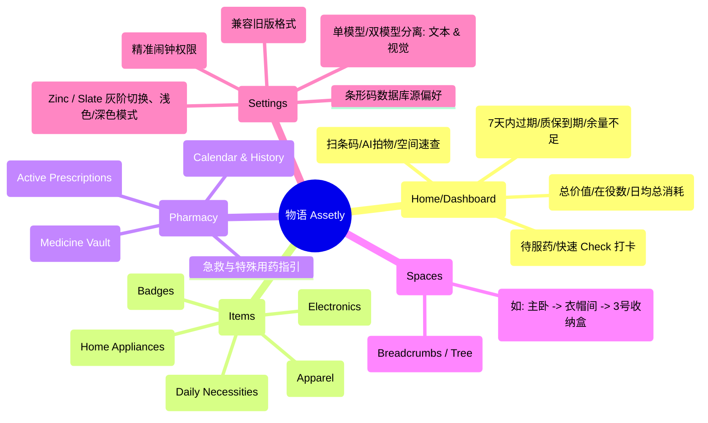
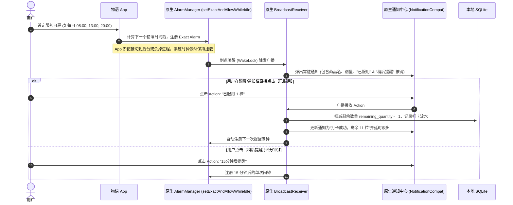
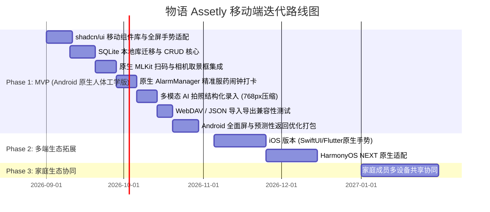

# 📱「物语 Assetly」家庭物品与健康资产管理 App - PRD 产品需求文档

| 文档版本 | 更新日期 | 编写人 | 状态 | 目标平台 |
| :--- | :--- | :--- | :--- | :--- |
| **v1.3.0** | 2026-08-23 | Antigravity PM | 已确认 (Confirmed) | Android（首发，兼顾 iOS & HarmonyOS NEXT 跨平台架构） |

---

## 1. 产品背景与定位

### 1.1 背景痛点与上一代（Tauri 桌面端 v0.3.3）复盘
上一代版本基于 Tauri + React 19 构建了良好的功能原型，但在手机端运行时暴露出明显的 Web 容器短板：
1. **全面屏手势与安全区冲突**：Android 侧滑返回手势与页面内水平滑动（如标签栏、轮播图、列表侧滑操作）相互打架；底部小白条（Gesture Bar）遮挡底部导航栏；状态栏挖孔屏适配生硬。
2. **软键盘顶起与抖动**：输入框聚焦时 WebView 视口重绘顿挫，键盘收起时存在大面积白边或滚动位置错乱。
3. **后台保活与服药提醒失效**：上一代依赖前端 JavaScript `setInterval` 轮询检查用药时间，一旦 App 被系统切入后台或挂起，定时器立即被冻结，导致服药提醒严重漏发。
4. **相机与条码扫描体验割裂**：WebView 调用系统相机交互重，缺乏 60fps 实时取景框扫描与对焦反馈。
5. **视觉体验亟待升级**：需从基础的管理后台 UI 升华至具有极高颜值的 **shadcn/ui 极简工业克制美学**（Zinc 色系 + 1px 精细描边 + Lucide 线性图标）。

### 1.2 产品定位
> **「物语 Assetly」** 是一款**主打 shadcn/ui 极简克制美学、移动端原生手势人体工学、智能双引擎录入（多模态 AI + 条形码/药监码）、深度融合日常资产与健康药箱管理**的家庭全景物品生命周期管理工具。

### 1.3 核心价值主张
- 🎨 **shadcn/ui 移动端原生质感**：精准 1px 细线边框、Zinc 灰阶极简基调、Lucide 线性图标、微触觉震动与丝滑弹簧动效。
- 📱 **原生级全面屏手势体验**：原生 Edge-to-Edge 边缘沉浸、Android 14+ 预测性返回动画（Predictive Back）、自适应软键盘避让与弹性下拉抽屉。
- ⚡ **秒级双引擎录入**：
  - **条码速扫**：集成原生 CameraX / MLKit，毫秒级识别 EAN-13、UPC 条码及国药准字/药监码。
  - **多模态 AI 视觉解析**：继承并增强上一代 Vision LLM 管道，图片自动压缩（768px / JPEG 0.8），结构化提取所有字段。
- 💊 **系统级准时用药引擎**：彻底摒弃 Web 轮询，采用 Android 原生 `AlarmManager` 精确闹钟，即使锁屏/关后台依然准点必达。
- 💰 **价值透视**：自动计算「日均使用成本（Cost Per Day）」与「折旧曲线」，量化每件物品的真实价值。
- 🔒 **隐私至上 (Local-First)**：完全兼容上一代 SQLite 表结构与 WebDAV 备份格式，离线无阻，数据自主掌控。

---

## 2. 整体产品架构与技术选型

### 2.1 技术选型（面向多平台迁移）
```mermaid
graph TD
    UI[UI 层: shadcn/ui 原生组件系统] --> Gesture[原生手势与安全区控制器]
    Gesture --> Core[跨平台业务核心层]
    Core --> LocalDB[(本地 SQLite 数据库 - 兼容 v0.3.3)]
    Core --> DualEntry[智能录入双引擎]
    DualEntry --> Scanner[原生 MLKit / Camera 扫码]
    DualEntry --> AIService[多模态 AI 网关: OpenAI / DeepSeek / Gemini / Ollama]
    Core --> NativeAlarm[系统级 AlarmManager / Exact Alarm 服务]
    Core --> WebDAV[WebDAV 同步与本地加密备份]

    subgraph 移动端跨平台框架选型
        F[方案 A (强烈推荐): Flutter + shadcn_ui 官方移动库 - 完美手势分发/原生动效]
        RN[方案 B: React Native / Expo + nativecn-ui - 迁移上一代 React 逻辑最快]
    end
```

- **架构建议**：
  - **方案 A（Flutter）**：内置手势竞技场（GestureArena）与物理滚动仿真，对全面屏手势、安全区处理极佳，配合 `shadcn_ui` 库可 1:1 复刻设计系统。
  - **方案 B（React Native）**：可最大化复用上一代 `src/services/` 和 `types/` 中的 TypeScript 逻辑，配合 `react-native-reanimated` 与 `react-native-gesture-handler` 消除 WebView 手势缺陷。

---

## 3. 信息架构 (Information Architecture)



---

## 4. 移动端专属人体工学与手势设计规范 (Mobile Ergonomics)

针对上一代 Tauri WebView 在手机上遇到的全面屏手势痛点，本版制定专门的原生级交互规则：

```
+-------------------------------------------------------------------+
|  [ Top Inset: Status Bar / Camera Cutout (安全区自动避让) ]       |
+-------------------------------------------------------------------+
|                                                                   |
|   ◀ 边缘侧滑 (Edge Swipe)                                         |
|   原生触发 Android 预测性返回动画 (Predictive Back Gesture)        |
|                                                                   |
|   ┌───────────────────────────────────────────────────────────┐   |
|   │ 抽屉弹窗 (Bottom Sheet / Drawer)                           │   |
|   │ • 顶端带有阻尼拖拽条 (Handle Bar)                         │   |
|   │ • 下拉阻尼动画 + 内部滚动自然嵌套 (Nested Scroll Physics)  │   |
|   │ • 键盘弹出时自动平滑上移 (Smooth Keyboard Inset Resize)   │   |
|   └───────────────────────────────────────────────────────────┘   |
|                                                                   |
+-------------------------------------------------------------------+
|  [ Bottom Inset: Home Indicator / Gesture Bar (底部沉浸避让) ]    |
+-------------------------------------------------------------------+
```

### 4.1 全面屏与边缘到边缘（Edge-to-Edge）沉浸规范
1. **透明系统栏沉浸**：状态栏与底部手势导航栏完全透明，内容延伸至屏幕物理边缘。
2. **安全区动态避让（Dynamic Insets）**：
   - 顶部导航栏高度 = `StatusBar Height + 56dp`。
   - 底部固定操作栏（或 Bottom Navigation）底部 Padding = `NavigationBar Inset + 12dp`，彻底杜绝误触或遮挡。

### 4.2 路由手势与返回防冲突机制
1. **预测性返回（Predictive Back）**：
   - 全面支持 Android 14+ 预测性返回手势动画（侧滑时上一级页面呈缩放预览卡片进入）。
2. **手势冲突判定原则**：
   - **水平滑动组件（如横滑卡片、Tabs 切换）**：设置屏幕边缘安全判定区（屏幕左右各预留 20dp 原生系统返回手势判定带，内部滑块不捕获边缘滑动事件）。
   - **长列表滑动**：采用原生弹性回弹（Overscroll Glow / iOS Bouncing），杜绝 WebView 常见的页面全局上下滚动拖拽露白。

### 4.3 软键盘自适应与防抖动
1. **IME 动画同步**：输入框聚焦激活键盘时，跟随键盘弹起曲线逐帧向上平滑位移，禁止突兀的页面跳闪。
2. **点击外部收起键盘**：点击页面空白区域或向下滑动列表时，自动失焦收起软键盘。

### 4.4 底部抽屉（BottomSheet / Drawer）手势分发
1. 采用 **Nested Scrolling 嵌套滑动机制**：
   - 当内部列表处于顶部且继续向下拉动时，拦截为**关闭抽屉手势**，带有丝滑弹簧阻尼。
   - 当内部列表未到顶时，优先响应内部列表的正常滚动。

---

## 5. 详细功能需求规格

### 5.1 普通物品与数码资产管理模块

#### 5.1.1 物品数据模型（完全兼容并扩展上一代 SQLite 表结构）
| 字段名称 | 类型 | 必填 | 兼容说明 |
| :--- | :--- | :--- | :--- |
| `id` | TEXT(UUID) | 是 | 主键唯一标识（兼容旧版 `items.id`） |
| `barcode` | TEXT(32) | 否 | **新增**：商品条形码（EAN-13 / UPC 等，扫码自动填入） |
| `name` | TEXT(60) | 是 | 物品名称（兼容旧版 `items.name`） |
| `description` | TEXT | 否 | 物品描述/备注（兼容旧版 `items.description`） |
| `category_id` | TEXT | 否 | 关联分类（兼容旧版 `items.category_id`） |
| `location_id` | TEXT | 否 | 关联存放空间/容器（兼容旧版 `items.location_id`） |
| `purchase_date` | TEXT | 否 | 购买日期（`YYYY-MM-DD`） |
| `purchase_price` | REAL | 否 | 购买金额（默认 0.00） |
| `quantity` | INTEGER | 否 | 数量（默认 1） |
| `image_path` | TEXT | 否 | 本地保存的图片路径/缩略图 |
| `status` | TEXT | 是 | 状态：`active (服役中)`、`idle (闲置)`、`disposed (已处置/退役)` |
| `is_medicine` | INTEGER | 是 | 是否为药品（0: 否, 1: 是） |
| `icon` | TEXT | 否 | 自定义图标/Emoji |
| `warranty_expiry` | TEXT | 否 | 质保到期日（`YYYY-MM-DD`） |
| `shelf_life_expiry`| TEXT | 否 | 保质期到期日（`YYYY-MM-DD`） |
| `retired_date` | TEXT | 否 | **新增**：退役/转售处置日期 |
| `created_at` / `updated_at` | TEXT | 是 | 时间戳（ISO 8601） |

#### 5.1.2 核心算法：日均使用成本 (Cost Per Day)
1. **在役状态（Active）**：
   $$\text{使用天数} = \max\left(1, (\text{当前日期} - \text{购买日期}) + 1\right)$$
   $$\text{日均成本} = \frac{\text{购买价格}}{\text{使用天数}}$$
2. **已退役/处置状态（Disposed）**：
   $$\text{实际服役天数} = \max\left(1, (\text{退役日期} - \text{购买日期}) + 1\right)$$
   $$\text{最终日均成本} = \frac{\text{购买价格} - \text{二手转售金额}}{\text{实际服役天数}}$$
3. **视觉展示**：
   - 采用 shadcn `Badge variant="secondary"` 呈现精细指标（如：`¥ 5.4 / 天`）。

---

### 5.2 智能药箱与服药提醒模块（系统级原生闹钟升级）

#### 5.2.1 药品数据模型
| 字段名称 | 类型 | 必填 | 兼容说明 |
| :--- | :--- | :--- | :--- |
| `id` | TEXT(UUID) | 是 | 药品唯一标识（兼容旧版 `medicines.id`） |
| `item_id` | TEXT | 是 | 关联 items 表的主键（外键级联删除） |
| `medicine_type` | TEXT | 是 | 类型：`internal (内服)`、`external (外用)`、`emergency (急救)`、`injection (注射)` 等 |
| `expiry_date` | TEXT | 是 | **药品有效期截止日**（`YYYY-MM-DD`） |
| `dosage_instructions`| TEXT | 否 | 用法用量说明（如：每日3次，每次1粒，饭后服） |
| `remaining_quantity` | REAL | 是 | 剩余数量（支持半片/小数） |
| `unit` | TEXT | 是 | 单位：片 / 粒 / 瓶 / 支 / ml / 贴 等 |
| `manufacturer` | TEXT | 否 | 生产药企厂商 |
| `is_taking` | INTEGER | 是 | 是否正在服用中（0: 否, 1: 是） |
| `frequency_type` | TEXT | 否 | 频次类型：`daily (每日)`、`every_n_days (每N天)`、`weekly (每周指定天)` |
| `frequency_days` | INTEGER | 否 | 间隔天数 |
| `week_days` | TEXT | 否 | 每周特定星期数组（如 `"1,3,5"`） |
| `time_slots` | TEXT | 否 | 每日提醒时间段数组（如 `"08:00,13:00,20:00"`） |
| `duration_start` / `end` | TEXT | 否 | 用药周期的起止日期 |
| `last_reminded` | TEXT | 否 | 最后一次成功提醒触发的时间戳 |

#### 5.2.2 原生级精准提醒与快捷打卡架构 (AlarmManager + Notification Action)


---

### 5.3 智能录入：条码扫描 + 自定义多模态 AI 双引擎

#### 5.3.1 条形码与药监码扫描引擎
1. **毫秒级原生扫码**：采用 Google MLKit Barcode Scanning，支持 EAN-13、UPC、Code-128 及药品电子监管码。
2. **三级级联查询策略**：
   - Level 1: 本地离线常见商品与药品条码库（< 50ms 返回）。
   - Level 2: 联网开放数据库（Open Food Facts、国家药品公共查询源）。
   - Level 3: 若条码未收录，自动唤起多模态 AI 拍照进行包装盒 OCR 结构化解析。

#### 5.3.2 自定义多模态 AI 引擎配置（完全继承并升级上一代能力）
- **模型模式**：支持 `single (单模型统一处理)` 或 `separate (分离模式: 文本与视觉使用不同 API/模型)`。
- **参数配置**：
  - `ai_api_url` / `ai_vision_api_url`：默认 `https://api.openai.com/v1`（支持任何兼容 OpenAI 协议的中转或本地 Ollama）。
  - `ai_api_key` / `ai_vision_api_key`：加密存储在本地安全区。
  - `ai_text_model`（如 `gpt-4o-mini`, `deepseek-chat`）与 `ai_vision_model`（如 `gpt-4o`, `qwen-vl-max`, `gemini-1.5-flash`）。
- **图片预处理管道**：延续上一代的高效压缩逻辑（最长边缩放至 768px，JPEG 质量 0.8），将 10MB 原图压缩至约 80KB，秒级上传并降低 Token 开销。

---

## 6. UI/UX 视觉与设计系统（shadcn/ui 移动端设计规范）

全面采用 **shadcn/ui 经典工业极简与中性克制美学（Zinc Design System）**，注重纯粹的留白、清晰的层级、精确的 1px 细线边框和极致的排版韵律。

### 6.1 shadcn/ui 移动端设计 Token

| Token 分类 | 浅色模式 (Light Mode) | 深色模式 (Dark Mode - Zinc) |
| :--- | :--- | :--- |
| **Background (画布底色)** | `#FFFFFF` | `#09090B` |
| **Card (卡片底色)** | `#FFFFFF` | `#18181B` (Zinc-900) |
| **Border (精致描边)** | `1px solid #E4E4E7` (Zinc-200) | `1px solid #27272A` (Zinc-800) |
| **Primary (主交互色)** | `#18181B` (前景色 `#FAFAFA`) | `#FAFAFA` (前景色 `#18181B`) |
| **Secondary (次级背景)**| `#F4F4F5` (Zinc-100) | `#27272A` (Zinc-800) |
| **Muted (静音文字/底色)**| `#71717A` (Zinc-500) | `#A1A1AA` (Zinc-400) |
| **Accent / Badge** | 药箱模块采用 `Emerald-500` 微点缀，临期采用 `Amber-500`，破坏性操作 `Rose-500` |
| **Radius (圆角体系)** | 遵循 shadcn 默认体系：卡片 `rounded-xl (12px)`，按钮 `rounded-md (6px)`，标签 `rounded-full (Pill)` |
| **Icon 体系** | **Lucide Icons**（20px / 24px，1.5px/2px 线性描边） |

### 6.2 核心页面线框

```
+-----------------------------------------------------------------+
|  Assetly.                                [ 🔍 Search ] [ ⚙️ ]   |
|  Sunday, Aug 23, 2026                                           |
+-----------------------------------------------------------------+
|  ┌── Card (border border-border) ─────────────────────────────┐ |
|  │  TOTAL ASSETS VALUE                      [ In Service: 142 ]│
|  │  ¥ 128,450.00                            Avg: ¥38.2/day     │
|  └─────────────────────────────────────────────────────────────┘ |
+-----------------------------------------------------------------+
|  ┌── Card: Daily Pill Tracker ────────────────────────────────┐ |
|  │  💊 Active Medication (2 pending)                           │
|  │  • Ibuprofen 0.3g   - 08:00 AM (After meal)  [ Check ✓ ]    │
|  │  • Vitamin C 100mg  - 13:00 PM               [ Check ✓ ]    │
|  └─────────────────────────────────────────────────────────────┘ |
+-----------------------------------------------------------------+
|  [ Button: + Scan Barcode ]    [ Button: + AI Vision Snap ]     |
+-----------------------------------------------------------------+
|  EXPIRING SOON & ALERTS                                         |
|  ┌── Alert (variant="destructive/warning") ───────────────────┐ |
|  │  ⚠️ 999 Cold Remedy - Expiring in 3 days! (Living Room Box) │
|  └─────────────────────────────────────────────────────────────┘ |
+-----------------------------------------------------------------+
|  INVENTORY ITEMS                                [ Filter ⊘ ]    |
|  ┌── Card (hover:bg-muted/50 transition) ─────────────────────┐ |
|  │  [Img]  MacBook Pro 16"               [ Badge: ¥9.6/day ]   │
|  │         Space: Study Room · Desk      Status: Active 🟢     │
|  ├─────────────────────────────────────────────────────────────┤
|  │  [Img]  Ibuprofen Capsules            [ Badge: 14 pills ]   │
|  │         Space: Living Room Pharmacy   Exp: 2027-11-20       │
|  └─────────────────────────────────────────────────────────────┘ |
+-----------------------------------------------------------------+
|  [ Tabs: 🏠 Home ]  [ 📦 Items ]  [ 💊 Pharmacy ]  [ ⚙️ Settings ] |
+-----------------------------------------------------------------+
```

---

## 7. 数据兼容性与 WebDAV 云同步 (Backward Compatibility)

1. **SQLite 数据平滑导入**：
   - 兼容上一代 Tauri 客户端生成的 `assetly.db` 结构，启动时自动执行增量 Migration（如添加 `barcode`、`retired_date` 字段），无需丢弃旧数据。
2. **WebDAV 备份协议**：
   - 完全兼容旧版 `webdavService.ts` 生成的 `/assetly-backup.json` 结构，支持双向合并或覆盖式恢复。

---

## 8. 版本迭代规划 (Roadmap)


